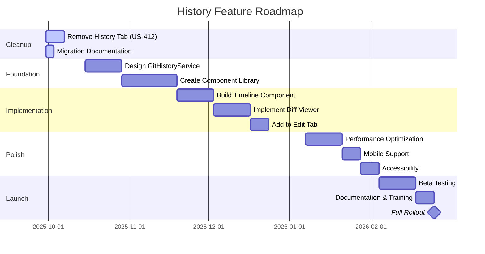

# History Feature Roadmap

**Epic**: EPIC-021 - Definitie Geschiedenis & Audit Trail Management
**Status**: In Progress
**Last Updated**: 2025-09-29

## Executive Summary

This document outlines the strategic roadmap for history functionality in DefinitieAgent, covering the immediate removal of unused code and the future implementation of modern inline history features.

## Current State (As of 2025-09-29)

### What Exists
- **Database Layer**: Fully functional `definitie_geschiedenis` table
- **Audit Triggers**: Active INSERT/UPDATE/DELETE tracking
- **Data Integrity**: Complete history preserved since inception
- **Backend Services**: Audit logging continues to function

### What Doesn't Work
- **History Tab UI**: Present but non-functional
- **User Access**: No way for users to view history
- **Code Overhead**: 453 lines of dead code

## Roadmap Overview



## Phase 1: Immediate Cleanup (Q4 2025)

### US-412: Remove Unused History Tab

**Timeline**: 1 week
**Status**: Ready to implement

#### Actions
1. Remove history_tab.py and related UI components
2. Update navigation to exclude history tab
3. Clean up all references and imports
4. Verify database integrity remains intact

#### Deliverables
- Clean codebase (-453 LOC)
- Migration guide for developers
- Updated documentation
- Rollback plan documented

#### Success Metrics
- Zero broken imports
- All tests passing
- Application loads faster
- No user-facing disruption

## Phase 2: Foundation (Q4 2025 - Q1 2026)

### Design Modern Architecture

**Timeline**: 4 weeks
**Status**: In design

#### Key Components

##### GitHistoryService
```python
class GitHistoryService:
    """Core history service with Git-inspired features"""

    def get_history(definitie_id: int) -> List[HistoryEntry]
    def get_diff(v1: int, v2: int) -> DiffResult
    def get_blame(definitie_id: int) -> BlameInfo
    def get_timeline(start: datetime, end: datetime) -> Timeline
```

##### React Component Library
```typescript
interface HistoryComponents {
    Timeline: React.FC<TimelineProps>
    DiffViewer: React.FC<DiffProps>
    VersionSelector: React.FC<VersionSelectorProps>
    HistoryPanel: React.FC<HistoryPanelProps>
}
```

#### Technical Decisions
- Use React for complex UI components
- Implement virtual scrolling for performance
- Cache aggressively with LRU strategy
- Progressive enhancement for mobile

## Phase 3: Implementation (Q1 2026)

### US-411: Modern Inline History

**Timeline**: 6 weeks
**Status**: Backlog

#### Sprint 1-2: Core Features
- Implement GitHistoryService
- Create Timeline component
- Basic diff generation
- Integration with Edit tab

#### Sprint 3-4: Enhancement
- Advanced diff visualization
- Version comparison tool
- Performance optimization
- Caching layer

#### Sprint 5-6: Polish
- Mobile responsive design
- Accessibility (WCAG 2.1 AA)
- Keyboard navigation
- Loading states and animations

## Phase 4: Launch (Q1 2026)

### Beta Testing
- 2 weeks closed beta
- Performance monitoring
- User feedback collection
- Bug fixes and optimization

### Training & Documentation
- User guides and video tutorials
- Developer documentation
- Architecture documentation
- Migration guides

### Full Rollout
- Feature flag rollout (10% → 50% → 100%)
- Monitor performance metrics
- Gather user feedback
- Iterate based on usage

## Technical Architecture

### Service Layer
```
┌─────────────────────────────────────────┐
│           Streamlit UI Layer            │
├─────────────────────────────────────────┤
│         Inline History Components        │
│  (Timeline, Diff, Version Selector)     │
├─────────────────────────────────────────┤
│          GitHistoryService              │
│    (History, Diff, Blame, Timeline)     │
├─────────────────────────────────────────┤
│           HistoryCache                  │
│        (LRU Cache, Prefetching)         │
├─────────────────────────────────────────┤
│        DefinitionRepository             │
│    (Database Access, Triggers)          │
├─────────────────────────────────────────┤
│          SQLite Database                │
│   (definitie_geschiedenis table)        │
└─────────────────────────────────────────┘
```

### Data Flow
1. User interacts with inline history button
2. Component requests data from GitHistoryService
3. Service checks cache, fetches if needed
4. Data formatted and returned to component
5. Component renders with virtual scrolling
6. User interactions update view instantly

## Performance Targets

| Metric | Target | Critical Threshold |
|--------|--------|--------------------|
| Initial Render | < 200ms | < 500ms |
| Timeline Fetch | < 300ms | < 1s |
| Diff Generation | < 500ms | < 2s |
| Cache Hit Rate | > 80% | > 60% |
| Memory Usage | < 50MB | < 100MB |

## Risk Management

### Technical Risks

| Risk | Impact | Mitigation |
|------|--------|------------|
| Performance degradation | HIGH | Implement caching, virtual scrolling, lazy loading |
| Complex UI implementation | MEDIUM | Use proven React patterns, extensive testing |
| Data volume growth | HIGH | Pagination, archiving strategy, compression |
| Browser compatibility | LOW | Progressive enhancement, fallbacks |

### Migration Risks

| Risk | Impact | Mitigation |
|------|--------|------------|
| Data loss during cleanup | CRITICAL | Preserve all database structures |
| User confusion | LOW | Clear communication, documentation |
| Rollback needed | LOW | Maintain git history, document process |

## Success Metrics

### Immediate (Post US-412)
- Code reduction: -453 LOC
- Build size: -10-15KB
- Load time: -50-100ms
- Test coverage: Maintained at >60%

### Future (Post US-411)
- User adoption: >80% use history feature
- Performance: P95 < 500ms
- User satisfaction: >4.5/5 rating
- Error rate: <0.1%
- Support tickets: <5 per month

## Resource Requirements

### Development Team
- 1 Senior Developer (lead)
- 1 Frontend Developer (React components)
- 1 Backend Developer (services)
- 0.5 UX Designer (design system)

### Timeline
- Phase 1: 1 week
- Phase 2: 4 weeks
- Phase 3: 6 weeks
- Phase 4: 3 weeks
- **Total**: 14 weeks

### Budget Considerations
- Development effort: 14 person-weeks
- Testing resources: 2 person-weeks
- Documentation: 1 person-week
- Training: 0.5 person-week

## Dependencies

### Technical
- React build pipeline setup
- Streamlit Components v1 (or v2 if available)
- Performance monitoring tools
- Testing framework extensions

### Organizational
- UX design approval
- Security review for audit features
- Compliance validation
- User training resources

## Future Enhancements (Post-Launch)

### Version 2.0 Features
1. **AI-Powered Insights**
   - Automated change summaries
   - Anomaly detection in changes
   - Predictive change patterns

2. **Collaboration Features**
   - Comments on changes
   - Change approval workflows
   - Team notifications

3. **Advanced Search**
   - Full-text search in history
   - Filter by change type
   - Semantic search capabilities

4. **Integration**
   - Export to Git
   - Connect with external VCS
   - API for third-party tools

## Conclusion

The history feature roadmap represents a strategic evolution from legacy tab-based UI to modern inline history. By first removing unused code (US-412) and then implementing a superior solution (US-411), we achieve:

1. **Immediate Benefits**: Cleaner codebase, better performance
2. **Future Value**: Modern UX, better user workflows
3. **Technical Excellence**: Clean architecture, high performance
4. **User Satisfaction**: Contextual history without disruption

This roadmap balances technical debt reduction with feature enhancement, ensuring a smooth transition for users while modernizing the application architecture.

## References

- [US-412: Remove Unused History Tab](./US-412/US-412.md)
- [US-411: Modern Inline History](./US-411/US-411.md)
- [Migration Guide](../../migrations/history_tab_removal.md)
- [EPIC-021: Main Epic](./EPIC-021.md)