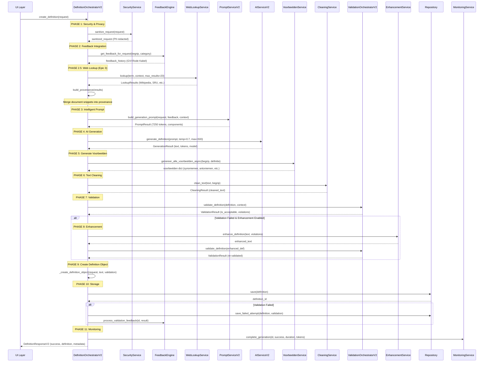

# DefinitionOrchestratorV2

## Overview
- **Location:** `src/services/orchestrators/definition_orchestrator_v2.py`
- **LOC:** 985
- **Complexity:** VERY HIGH
- **Purpose:** Next-generation stateless orchestrator that replaces monolithic generation logic with clean, modular 11-phase flow

## Responsibilities
1. **Security & Privacy** - DPIA/AVG compliance with PII redaction
2. **Feedback Integration** - GVI Rode Kabel feedback loop integration
3. **Prompt Generation** - Intelligent prompt building with ontological category support
4. **AI Generation** - OpenAI API calls with retry logic
5. **Example Generation** - Generate voorbeelden (examples) for definitions
6. **Text Cleaning** - Normalization and cleaning of generated text
7. **Validation** - Quality validation using ValidationOrchestratorV2
8. **Enhancement** - Optional AI-based enhancement if validation fails
9. **Storage** - Conditional database save based on quality gates
10. **Web Lookup** - Optional external context enrichment (Epic 3)
11. **Monitoring** - Performance tracking and metrics collection

## Input/Output Contract

### Input
```python
GenerationRequest(
    id: str | None,  # Optional correlation ID
    begrip: str,  # Required term to define
    context: str | None,  # Optional context string
    organisatorische_context: list[str] | None,
    juridische_context: list[str] | None,
    wettelijke_basis: list[str] | None,
    ontologische_categorie: str | None,  # "type" | "proces" | "resultaat" | "exemplaar"
    ufo_categorie: str | None,  # UFO ontology category
    actor: str | None,  # User/system identifier
    options: dict[str, Any] | None,  # force_generate, force_duplicate, etc.
)

context: dict[str, Any] = {
    "web_lookup": {
        "sources": list[dict],  # Provenance sources from web
        "top_k": int,
        "debug": dict | None
    },
    "documents": {
        "snippets": list[dict]  # Document snippets
    }
}
```

### Output
```python
DefinitionResponseV2(
    success: bool,
    definition: Definition | None,  # Full definition object if successful
    validation_result: ValidationResult | None,
    error: str | None,
    metadata: {
        "generation_id": str,
        "duration": float,  # seconds
        "feedback_integrated": bool,
        "ontological_category": str,
        "orchestrator_version": str,  # "v2.0"
        "phases_completed": int,  # 11
        "enhanced": bool,
        "web_lookup_status": str,  # "success" | "no_results" | "timeout" | "error" | "not_available"
        "web_lookup_available": bool,
        "web_sources_count": int
    }
)
```

## Workflow Sequence



## Detailed Step-by-Step Flow

### Phase 1: Security & Privacy (Lines 205-218)
- **Action:** Sanitize request for DPIA/AVG compliance
- **State Changes:** None (stateless)
- **Business Logic:**
  - PII redaction if SecurityService available
  - Falls back to original request if service unavailable
- **Error Handling:** Graceful degradation - continues without sanitization

### Phase 2: Feedback Integration (Lines 220-234)
- **Action:** Load feedback history for GVI Rode Kabel loop
- **State Changes:** None
- **Business Logic:**
  - Only loads feedback if `config.enable_feedback_loop` is True
  - Filters feedback by begrip and ontological category
- **Error Handling:** Continues without feedback if unavailable

### Phase 2.5: Web Lookup Context Enrichment (Lines 236-418)
- **Action:** Enrich context with external sources (Wikipedia, SRU, etc.)
- **State Changes:** Adds `web_lookup` to context dict
- **Business Logic:**
  - **Timeout:** Configurable via `WEB_LOOKUP_TIMEOUT_SECONDS` env var (default 10s)
  - **Max Results:** Configurable via `WEB_LOOKUP_MAX_RESULTS` env var (default 20)
  - **Top-K Selection:** Uses `config.web_lookup_top_k` (default 3) for prompt injection
  - **Provenance Building:** Extracts legal metadata for juridical sources (Story 3.1)
  - **Document Snippet Merging:** Merges uploaded document snippets into provenance (EPIC-018)
- **Error Handling:**
  - TimeoutError: Logs warning, proceeds WITHOUT external context
  - Other exceptions: Logs error, proceeds WITHOUT external context
  - Status tracked in metadata: "success" | "no_results" | "timeout" | "error" | "not_available"

### Phase 3: Intelligent Prompt Generation (Lines 420-431)
- **Action:** Build prompt using PromptServiceV2 with 14+ modules
- **State Changes:** None
- **Business Logic:**
  - **Ontological Category Fix:** Properly passes category to template selection
  - **Feedback Integration:** Includes historical feedback if available
  - **Web Context:** Injects top-K web sources into prompt
  - **Document Context:** Injects document snippets into prompt
- **Token Count:** ~7,250 tokens (needs optimization)
- **Error Handling:** Falls back to basic prompt if service fails

### Phase 4: AI Generation with Retry Logic (Lines 452-472)
- **Action:** Call OpenAI API via AIServiceV2
- **State Changes:** None
- **Business Logic:**
  - **Temperature:** From request.options or default 0.7
  - **Max Tokens:** From request.options or default 500
  - **Model:** From request.options or default (GPT-4)
  - **Retry Logic:** Handled internally by AIServiceV2 (3 attempts)
- **Error Handling:** Raises exception if all retries fail

### Phase 5: Generate Voorbeelden (Lines 475-565)
- **Action:** Generate examples, synonyms, antonyms, etc.
- **State Changes:** None
- **Business Logic:**
  - **Async Execution:** Uses `genereer_alle_voorbeelden_async` for performance
  - **Context Building:** Creates voorbeelden_context from request
  - **Debug Support:** Optional DEBUG_EXAMPLES env var for logging
- **Output:** Dict with keys: synoniemen, antoniemen, voorbeeldzinnen, etc.
- **Error Handling:** Logs warning, continues without voorbeelden

### Phase 6: Text Cleaning & Normalization (Lines 567-580)
- **Action:** Clean and normalize generated text
- **State Changes:** None
- **Business Logic:**
  - Always uses V2 cleaning service (no legacy fallback)
  - Removes markdown, fixes spacing, normalizes quotes
- **Error Handling:** Service should always be available (adapter pattern)

### Phase 7: Validation (Lines 582-649)
- **Action:** Validate definition using 45+ rules
- **State Changes:** None
- **Business Logic:**
  - **ValidationContext:** Includes correlation_id, metadata with options
  - **Force Duplicate:** Passed via metadata for duplicate escalation
  - **Schema Compliance:** Uses `ensure_schema_compliance` mapper
  - **Validation Interface:** Uses ValidationOrchestratorV2 (clean separation)
- **Error Handling:** Creates degraded result on exception

### Phase 8: Enhancement (Lines 651-712)
- **Action:** Optional AI-based enhancement if validation fails
- **State Changes:** Sets `was_enhanced = True`
- **Business Logic:**
  - **Condition:** Only if `config.enable_enhancement` AND validation failed
  - **Re-validation:** Enhanced text is re-validated
  - **Replaces Original:** `cleaned_text` is updated with enhanced version
- **Error Handling:** Logs error, uses unenhanced text

### Phase 9: Definition Object Creation (Lines 714-757)
- **Action:** Create Definition domain object with all metadata
- **State Changes:** None
- **Business Logic:**
  - **Metadata Included:**
    - Generation metadata (model, tokens, duration)
    - Feedback status
    - Enhancement status
    - Ontological category
    - Web lookup metadata (sources, status, debug info)
    - Voorbeelden
    - Prompt text for debugging
    - Force duplicate flag
- **Error Handling:** None (pure data transformation)

### Phase 10: Storage (Lines 759-780)
- **Action:** Save definition to database
- **State Changes:** Definition gets database ID
- **Business Logic:**
  - **Always Saves:** Saves regardless of validation score (as draft/review)
  - **Failed Attempts:** Also logs failed attempts for feedback learning
  - **Status Assignment:** Repository sets status based on validation
- **Error Handling:** `_safe_save_definition` catches exceptions, returns None

### Phase 11: Feedback Loop Update (Lines 782-796)
- **Action:** Process validation feedback for future improvements
- **State Changes:** Updates feedback storage
- **Business Logic:**
  - Only if validation failed AND feedback_engine available
  - Stores validation result for pattern learning
- **Error Handling:** Logs error, continues (feedback is non-critical)

### Phase 12: Monitoring & Metrics (Lines 798-816)
- **Action:** Track performance and success metrics
- **State Changes:** Updates monitoring database
- **Business Logic:**
  - Tracks: generation_id, success, duration, tokens, components, feedback usage
  - Used for: performance optimization, cost tracking, quality monitoring
- **Error Handling:** Logs error, continues (monitoring is non-critical)

## Service Dependencies

| Service | Method Called | Purpose | Error Handling | Required |
|---------|--------------|---------|----------------|----------|
| SecurityService | sanitize_request() | PII redaction | Continue without | No |
| FeedbackEngine | get_feedback_for_request() | GVI Rode Kabel | Continue without | No |
| WebLookupService | lookup() | External context | Continue without | No |
| PromptServiceV2 | build_generation_prompt() | Prompt building | Fallback to basic | Yes |
| AIServiceV2 | generate_definition() | OpenAI API | Raise exception | Yes |
| VoorbeeldenService | genereer_alle_voorbeelden_async() | Examples | Continue without | No |
| CleaningService | clean_text() | Text normalization | Should not fail | Yes |
| ValidationOrchestratorV2 | validate_definition() | Quality check | Degraded result | Yes |
| EnhancementService | enhance_definition() | AI improvement | Continue without | No |
| Repository | save(), save_failed_attempt() | Persistence | Log and continue | Yes |
| MonitoringService | complete_generation() | Metrics | Log and continue | No |

## State Management

### Session State Keys
**NONE** - This is a fully stateless orchestrator. All data is passed explicitly via function parameters.

### State Dependencies
- **Input:** All data comes from `GenerationRequest` and `context` parameters
- **Output:** All data returned in `DefinitionResponseV2`
- **No Side Effects:** No direct session state access (clean architecture)

### State Cleanup
Not applicable - orchestrator doesn't manage state.

## Business Rules

### 1. Rule: Always Save Definition (Lines 759-780)
- **Enforcement:** Phase 10 saves regardless of validation score
- **Rationale:** Even failed definitions are valuable for feedback learning
- **Threshold:** None - all definitions saved
- **Status Assignment:** Repository determines status (draft/review/established) based on validation

### 2. Rule: Feedback Loop Only on Failure (Lines 782-796)
- **Enforcement:** Phase 11 only updates feedback if validation failed
- **Rationale:** Learn from mistakes, not successes
- **Threshold:** `is_acceptable == False`

### 3. Rule: Enhancement Only if Enabled and Failed (Lines 651-712)
- **Enforcement:** Phase 8 checks both config flag and validation result
- **Rationale:** Don't waste AI calls on already-good definitions
- **Threshold:** `config.enable_enhancement == True` AND `is_acceptable == False`

### 4. Rule: Web Lookup Timeout (Lines 243-373)
- **Enforcement:** 10-second timeout with asyncio.wait_for
- **Rationale:** Don't block generation if external service is slow
- **Configurable:** Via `WEB_LOOKUP_TIMEOUT_SECONDS` env var
- **Fallback:** Continue without external context

### 5. Rule: Top-K Source Selection (Lines 334-338)
- **Enforcement:** Mark top-K sources as used_in_prompt
- **Rationale:** Limit prompt token usage while maintaining quality
- **Threshold:** `config.web_lookup_top_k` (default 3)

### 6. Rule: Force Duplicate Override (Lines 597-607)
- **Enforcement:** Pass force_duplicate flag through validation context
- **Rationale:** Allow user to explicitly bypass duplicate checks
- **Source:** `request.options.force_duplicate`

### 7. Rule: Ontological Category Required (Lines 201-202, 909)
- **Enforcement:** Category passed to prompt service and stored in definition
- **Rationale:** Fix template selection bug - different categories need different templates
- **Default:** None - caller must provide

## Error Handling

### Exception Types Caught

```python
# Phase 2.5: Web Lookup
except TimeoutError:
    # Log warning, set status="timeout", continue without web context

except Exception as e:
    # Log error, set status="error", continue without web context

# Phase 5: Voorbeelden Generation
except Exception as e:
    # Log warning, continue without voorbeelden

# Phase 7: Validation
except Exception as e:
    # Log error, return degraded result

# Phase 8: Enhancement
except Exception as e:
    # Log error, use unenhanced text

# Phase 10: Storage
except Exception as e:
    # Log error, return None (definition not saved)

# Phase 11: Feedback
except Exception as e:
    # Log error, continue (feedback non-critical)

# Phase 12: Monitoring
except Exception as e:
    # Log error, continue (monitoring non-critical)

# Top-level orchestration
except Exception as e:
    # Log error with stack trace
    # Call monitoring.track_error()
    # Return DefinitionResponseV2(success=False, error=str(e))
```

### Fallback Logic

1. **SecurityService unavailable** → Use original request without sanitization
2. **FeedbackEngine unavailable** → Continue without feedback history
3. **WebLookupService unavailable** → Continue without external context
4. **WebLookupService timeout** → Continue without external context, log warning
5. **PromptService fails** → Use `_create_basic_prompt()` fallback
6. **Voorbeelden fails** → Continue without examples
7. **EnhancementService unavailable** → Use unenhanced text
8. **Repository save fails** → Return response with error, no ID
9. **MonitoringService unavailable** → Continue without metrics

### User Error Messages

- **Success:** `DefinitionResponseV2(success=True, ...)`
- **Failure:** `DefinitionResponseV2(success=False, error="Generation failed: {exception}")`
- **Partial Success:** Definition saved but validation failed (still success=True)

## Performance Characteristics

### Async Operations
- **All phases are async** - orchestrator method is async
- **Sequential execution** - no parallelization (opportunity for optimization)
- **Voorbeelden generation** - uses async version for better performance (US-052)

### Database Queries
- **1 save query** - Definition.save() in Phase 10
- **1 optional query** - save_failed_attempt() if validation failed
- **0-N feedback queries** - depends on feedback history size

### External API Calls
- **1 OpenAI call** - AI generation in Phase 4
- **0-1 Web lookup calls** - Optional in Phase 2.5
- **0-1 Enhancement call** - Optional OpenAI call if validation fails

### Estimated Time
- **Fast path (no web lookup, good validation):** 3-5 seconds
- **Typical (with web lookup):** 5-8 seconds
- **Slow (with enhancement):** 10-15 seconds
- **Timeout (web lookup timeout):** +10 seconds max

### Bottlenecks
1. **Prompt token count:** 7,250 tokens (needs deduplication and caching)
2. **Service initialization:** 6x re-initialization due to Streamlit reruns (needs @st.cache_resource)
3. **Sequential execution:** No parallelization of independent phases
4. **Web lookup timeout:** Can add 10 seconds if service is slow
5. **Validation rules:** 45 rules loaded per session (needs @st.cache_data)

## Hardcoded Decisions

| Decision | Value | Location | Rationale |
|----------|-------|----------|-----------|
| Default temperature | 0.7 | Line 457 | Balance creativity and consistency |
| Default max_tokens | 500 | Line 462 | Sufficient for most definitions |
| Web lookup timeout | 10.0s | Line 247 | Prevent blocking, configurable via env |
| Web lookup max results | 20 | Line 277 | Balance coverage and performance |
| Web lookup top-K | 3 | Line 334 | Limit prompt tokens, configurable |
| Orchestrator version | "v2.0" | Line 731 | Version tracking |
| Phases completed | 11 | Line 837 | Fixed orchestration flow |
| Enhancement only on failure | True | Line 655 | Don't waste AI on good definitions |
| Always save definition | True | Line 759 | Learn from all attempts |

## Integration Points

### Called By
- **UI:** `src/ui/tabbed_interface.py` (line 992-1018) - Main generation flow
- **UI:** `src/ui/components/definition_generator_tab.py` (line 2275-2284) - Direct regeneration
- **Service Adapter:** `src/services/adapters/service_adapter_v2.py` - Wraps orchestrator for compatibility

### Calls
- **Services:** 11 different services (see Service Dependencies table)
- **Repository:** Database persistence
- **External APIs:** OpenAI (via AIService), Wikipedia/SRU (via WebLookupService)

## Testing Recommendations

### Unit Tests
- Mock all service dependencies
- Test each phase in isolation
- Verify error handling for each phase
- Test fallback logic for optional services
- Verify metadata is correctly populated

### Integration Tests
- Test full workflow end-to-end with real services
- Test with missing optional services
- Test web lookup timeout scenarios
- Test enhancement flow
- Test feedback loop integration

### Performance Tests
- Measure total execution time
- Identify bottlenecks with profiling
- Test with various prompt sizes
- Test concurrent requests
- Monitor memory usage

### Edge Cases
- Empty begrip
- Missing ontological category
- All optional services unavailable
- Validation always fails
- Web lookup always times out
- Enhancement makes definition worse
- Database save fails

## Rebuild Recommendations

### Simplification Opportunities

1. **Parallel Execution:** Phases 2, 2.5, and 5 could run in parallel (feedback + web lookup + voorbeelden)
2. **Service Grouping:** Group related services (e.g., prompt + AI generation)
3. **Metadata Builder:** Extract metadata building to separate helper
4. **Phase Objects:** Convert each phase to a Phase object with execute() method
5. **Pipeline Pattern:** Use pipeline pattern with middleware for cross-cutting concerns (monitoring, error handling)

### Keep As-Is

- **11-phase structure** - Clear, well-documented flow
- **Stateless design** - No session state dependency
- **Clean dependency injection** - All services injected via constructor
- **Comprehensive error handling** - Graceful degradation at every phase
- **Rich metadata** - Extensive tracking for debugging and monitoring

### Refactor Candidates

1. **Prompt token optimization** - 7,250 tokens is too high
2. **Service initialization** - Use @st.cache_resource to prevent 6x re-init
3. **Validation rule loading** - Use @st.cache_data to prevent 45x reload
4. **Sequential execution** - Parallelize independent phases
5. **Context enrichment** - Merge web lookup and document context earlier
6. **Metadata building** - Extract to separate builder class
7. **Phase execution** - Use Phase objects with uniform interface

## Notes

### Implementation Quirks
- **UTC import:** Double assignment for Python 3.10 compatibility (line 15, 22)
- **Debug logging:** Multiple debug points for voorbeelden tracking (lines 491-554)
- **Correlation ID:** Tolerant UUID parsing for validation context (lines 589-592)
- **Force duplicate:** Passed through multiple layers (request → context → validator)

### TODOs
- **Optimize prompt tokens:** Implement deduplication and caching
- **Parallelize phases:** Run independent phases concurrently
- **Cache services:** Use @st.cache_resource for service container
- **Cache rules:** Use @st.cache_data for validation rules
- **Monitoring dashboard:** Build dashboard for orchestrator metrics

### Warnings
- **Web lookup adds latency:** 10-second timeout can impact UX
- **Enhancement doubles cost:** Calls OpenAI twice if validation fails
- **Always saves:** Database will accumulate many low-quality definitions
- **No rollback:** If save succeeds but feedback fails, no rollback

## Extraction Date
2025-10-02

## Agent
Agent 4: Orchestration Specialist 🔄
