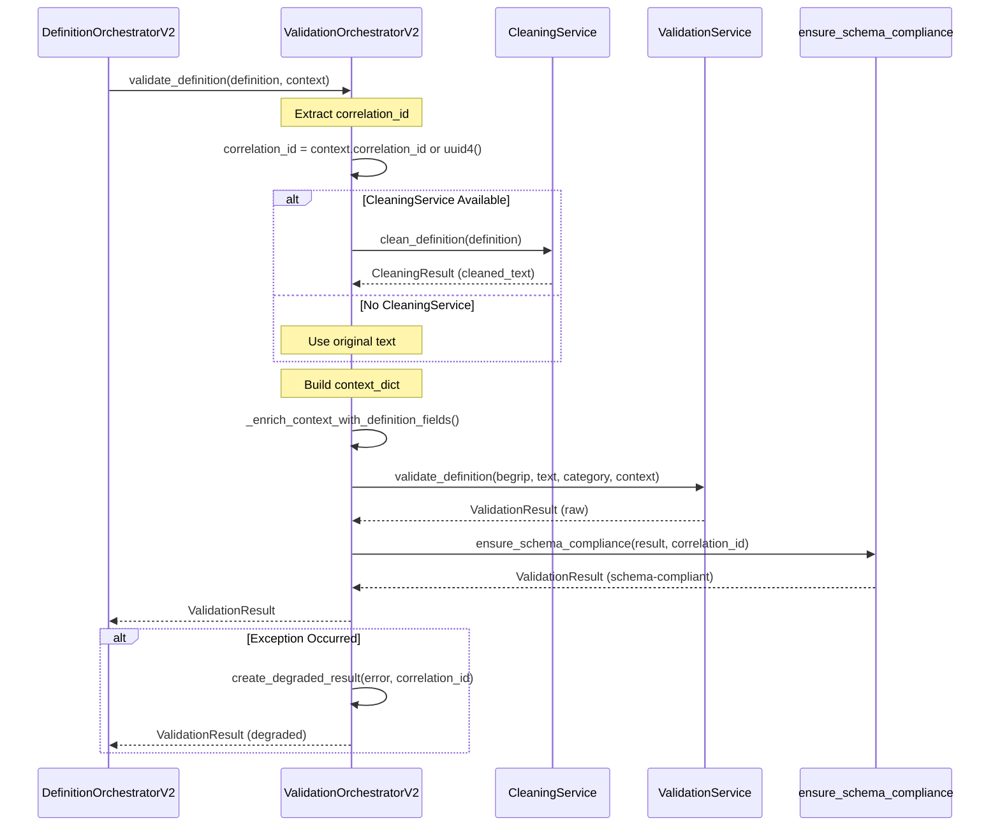

# ValidationOrchestratorV2

## Overview
- **Location:** `src/services/orchestrators/validation_orchestrator_v2.py`
- **LOC:** 252
- **Complexity:** MEDIUM
- **Purpose:** Thin async-first orchestration layer for validation with optional pre-cleaning

## Responsibilities
1. **Text Validation** - Validate standalone text with optional pre-cleaning
2. **Definition Validation** - Validate complete Definition objects
3. **Batch Validation** - Sequential validation of multiple items
4. **Context Enrichment** - Add definition metadata to validation context
5. **Schema Compliance** - Ensure results conform to ValidationResult schema
6. **Degraded Results** - Provide safe fallback on errors

## Input/Output Contract

### Input (validate_text)
```python
begrip: str  # Required term
text: str  # Text to validate (can be empty)
ontologische_categorie: str | None  # Optional category
context: ValidationContext | None = {
    correlation_id: UUID | str | None,
    profile: str | None,  # "strict" | "lenient"
    locale: str | None,
    feature_flags: dict[str, bool] | None,
    metadata: dict[str, Any] | None
}
```

### Input (validate_definition)
```python
definition: Definition  # Complete definition object
context: ValidationContext | None
```

### Input (batch_validate)
```python
items: Iterable[ValidationRequest]  # List of validation requests
max_concurrency: int = 1  # Ignored in v2.2 (sequential only)
```

### Output
```python
ValidationResult(
    is_valid: bool,
    is_acceptable: bool,  # Main quality gate
    overall_score: float,  # 0.0-1.0
    violations: list[RuleViolation],
    passed_rules: list[RuleResult],
    detailed_scores: dict[str, CategoryScore],
    correlation_id: str,
    validation_duration: float | None,
    rules_evaluated: int,
    metadata: dict[str, Any]
)
```

## Workflow Sequence



## Detailed Step-by-Step Flow

### Method: validate_text (Lines 54-118)

#### Step 1: Extract Correlation ID (Lines 73-77)
- **Action:** Get correlation_id from context or generate UUID
- **State Changes:** None
- **Business Logic:** Ensures traceability across async operations

#### Step 2: Optional Pre-Cleaning (Lines 79-83)
- **Action:** Clean text if CleaningService available
- **State Changes:** `cleaned_text` replaces original `text`
- **Business Logic:** Removes formatting, fixes spacing, normalizes quotes
- **Condition:** `self.cleaning_service is not None`

#### Step 3: Build Context Dict (Lines 85-99)
- **Action:** Convert ValidationContext to dict for service
- **State Changes:** None
- **Business Logic:** Extracts profile, correlation_id, locale, feature_flags
- **Note:** Does NOT enrich with definition fields (not available in validate_text)

#### Step 4: Call Validation Service (Lines 101-107)
- **Action:** Delegate to underlying ValidationServiceInterface
- **State Changes:** None
- **Business Logic:** Core validation logic lives in ValidationService
- **Parameters:** begrip, cleaned_text, ontologische_categorie, context_dict

#### Step 5: Ensure Schema Compliance (Line 110)
- **Action:** Map result to schema-compliant format
- **State Changes:** None
- **Business Logic:** Uses mapper to ensure consistent format
- **Returns:** ValidationResult with all required fields

#### Step 6: Error Handling (Lines 112-118)
- **Action:** Catch exceptions and return degraded result
- **State Changes:** None
- **Business Logic:** Logs error, creates safe fallback result
- **Returns:** ValidationResult with is_valid=False, error message

### Method: validate_definition (Lines 120-177)

#### Step 1: Extract Correlation ID (Lines 135-139)
- **Action:** Get correlation_id from context or generate UUID
- **State Changes:** None

#### Step 2: Optional Pre-Cleaning (Lines 141-145)
- **Action:** Clean definition if CleaningService available
- **State Changes:** `text` updated with cleaned version
- **Business Logic:** Uses `clean_definition()` method with full Definition object

#### Step 3: Build Context Dict (Lines 147-158)
- **Action:** Convert ValidationContext to dict
- **State Changes:** None
- **Business Logic:** Same as validate_text

#### Step 4: Call Validation Service (Lines 160-166)
- **Action:** Delegate to ValidationServiceInterface
- **State Changes:** None
- **Business Logic:** Passes definition fields (begrip, text, category)
- **Note:** Does NOT auto-enrich with definition fields (kept simple)

#### Step 5: Ensure Schema Compliance (Line 169)
- **Action:** Map result to schema-compliant format
- **State Changes:** None

#### Step 6: Error Handling (Lines 171-177)
- **Action:** Catch exceptions and return degraded result
- **State Changes:** None

### Method: batch_validate (Lines 179-206)

#### Sequential Processing (Lines 196-206)
- **Action:** Validate items one by one
- **State Changes:** None
- **Business Logic:**
  - `max_concurrency` parameter is **IGNORED** in v2.2
  - Parallelism will be added in Story 2.3
  - Individual failures → degraded results (not batch failure)
- **Returns:** List of ValidationResults in same order as input

### Helper: _enrich_context_with_definition_fields (Lines 209-251)

#### Step 1: Add Top-Level Context Fields (Lines 220-232)
- **Action:** Extract context lists from definition
- **State Changes:** Enriches context dict
- **Fields Added:**
  - `organisatorische_context`
  - `juridische_context`
  - `wettelijke_basis`
  - `categorie`

#### Step 2: Add Definition Metadata Bundle (Lines 235-249)
- **Action:** Bundle definition metadata under 'definition' key
- **State Changes:** Enriches context dict
- **Fields Added:**
  - `begrip`
  - `synoniemen`
  - `toelichting`
  - `gerelateerde_begrippen`
  - `ontologische_categorie`

## Service Dependencies

| Service | Method Called | Purpose | Error Handling | Required |
|---------|--------------|---------|----------------|----------|
| CleaningService | clean_text() | Text normalization | Use original text | No |
| CleaningService | clean_definition() | Definition cleaning | Use original text | No |
| ValidationService | validate_definition() | Core validation | Degraded result | Yes |
| Mappers | ensure_schema_compliance() | Schema mapping | Should not fail | Yes |
| Mappers | create_degraded_result() | Error fallback | Should not fail | Yes |

## State Management

### Session State Keys
**NONE** - Fully stateless orchestrator. No session state access.

### State Dependencies
- **Input:** All data from function parameters
- **Output:** All data returned in ValidationResult
- **No Side Effects:** Pure orchestration layer

## Business Rules

### 1. Rule: Optional Pre-Cleaning (Lines 79-83, 141-145)
- **Enforcement:** Only clean if CleaningService injected
- **Rationale:** Some callers may want to validate uncleaned text
- **Condition:** `self.cleaning_service is not None`

### 2. Rule: Always Generate Correlation ID (Lines 73-77, 135-139)
- **Enforcement:** Context or UUID generation
- **Rationale:** Traceability across distributed async operations
- **Fallback:** `str(uuid.uuid4())`

### 3. Rule: Schema Compliance Required (Lines 110, 169)
- **Enforcement:** All results mapped via ensure_schema_compliance
- **Rationale:** Consistent interface for consumers
- **Fields:** is_valid, is_acceptable, overall_score, violations, etc.

### 4. Rule: No Context Auto-Enrichment in validate_text (Lines 98-99)
- **Enforcement:** Comment explicitly states no enrichment
- **Rationale:** Definition fields not available in validate_text
- **Solution:** Use validate_definition for full context

### 5. Rule: Sequential Batch Processing (Lines 196-206)
- **Enforcement:** Simple for loop, max_concurrency ignored
- **Rationale:** Story 2.2 scope - parallelism in later story
- **Future:** Story 2.3 will add parallel execution

### 6. Rule: Individual Failures Don't Fail Batch (Line 194)
- **Enforcement:** Each item validated independently
- **Rationale:** Partial success better than total failure
- **Result:** Degraded results for failed items

## Error Handling

### Exception Types Caught

```python
# validate_text
except Exception as e:
    # Log error with begrip and correlation_id
    # Return create_degraded_result(error, correlation_id, begrip)

# validate_definition
except Exception as e:
    # Log error with begrip and correlation_id
    # Return create_degraded_result(error, correlation_id, begrip)

# batch_validate
# No top-level catch - individual items handle their own errors
```

### Fallback Logic

1. **CleaningService unavailable** → Use original text
2. **ValidationService fails** → Return degraded result with error
3. **Schema mapping fails** → Manual degraded result construction (defensive)

### Degraded Results

```python
ValidationResult(
    is_valid=False,
    is_acceptable=False,
    overall_score=0.0,
    violations=[],
    passed_rules=[],
    detailed_scores={},
    correlation_id=correlation_id,
    validation_duration=None,
    rules_evaluated=0,
    metadata={"error": str(e), "begrip": begrip}
)
```

## Performance Characteristics

### Async Operations
- **All methods are async** - Full async support
- **Sequential batch** - No parallelization yet (Story 2.3)
- **Awaitable services** - CleaningService and ValidationService are async

### Database Queries
- **0 queries** - Pure orchestration, no direct DB access
- **Validation service may query** - Depends on duplicate check rules

### External API Calls
- **0 API calls** - No external dependencies
- **Validation service may call** - If CON-01 duplicate check enabled

### Estimated Time
- **Single validation:** 100-500ms (depends on rule count)
- **With cleaning:** +50ms
- **Batch of 10:** 1-5 seconds (sequential)

### Bottlenecks
1. **Sequential batch processing** - No parallelization
2. **45 rules evaluated** - Each rule runs sequentially
3. **Duplicate check** - CON-01 may query database
4. **Context enrichment** - Dictionary manipulation overhead

## Hardcoded Decisions

| Decision | Value | Location | Rationale |
|----------|-------|----------|-----------|
| max_concurrency ignored | 1 (sequential) | Line 186 | Story 2.2 scope limitation |
| Auto-enrich disabled | False | Line 98 | Not available in validate_text |
| Degraded score | 0.0 | create_degraded_result | Fail-safe on errors |

## Integration Points

### Called By
- **DefinitionOrchestratorV2:** Lines 623-626, 686-689
- **UI Edit Tab:** Via ValidationOrchestratorInterface
- **Tests:** Extensive test coverage

### Calls
- **CleaningService:** Optional pre-cleaning
- **ValidationService:** Core validation logic
- **Mappers:** Schema compliance, degraded results

## Testing Recommendations

### Unit Tests
- Mock CleaningService and ValidationService
- Test with and without CleaningService
- Test correlation_id generation
- Verify schema compliance mapping
- Test degraded result creation
- Test context enrichment helper

### Integration Tests
- Test with real ValidationService
- Test with real CleaningService
- Test batch processing
- Test error propagation
- Verify correlation_id propagates

### Edge Cases
- Empty begrip
- Empty text
- Missing ontologische_categorie
- No CleaningService
- ValidationService throws exception
- Invalid correlation_id in context
- Empty batch input

## Rebuild Recommendations

### Simplification Opportunities

1. **Remove Context Enrichment Helper:** Method `_enrich_context_with_definition_fields` is NOT used - can be removed or moved to validator
2. **Merge Validation Methods:** `validate_text` and `validate_definition` have 90% code overlap
3. **Extract Common Logic:** Correlation ID extraction, cleaning, context building all duplicated

### Keep As-Is

- **Thin orchestration layer** - Clean separation of concerns
- **Optional CleaningService** - Flexible dependency injection
- **Schema compliance** - Ensures consistent output format
- **Degraded results** - Safe error handling

### Refactor Candidates

1. **Parallel Batch Processing:** Add in Story 2.3 using asyncio.gather
2. **Common Flow Extraction:** Extract shared logic between validate_text and validate_definition
3. **Context Builder:** Extract context dict building to separate method
4. **Correlation ID Helper:** Extract to utility function

## Notes

### Implementation Quirks
- **Context enrichment NOT used:** Method exists but is never called (lines 209-251)
- **Manual schema fallback:** Defensive code for mapper failure (lines 634-645)
- **max_concurrency ignored:** Parameter accepted but not used (line 186)

### TODOs
- **Story 2.3:** Implement parallel batch processing using asyncio.gather
- **Remove unused method:** _enrich_context_with_definition_fields is dead code
- **Consolidate methods:** Merge validate_text and validate_definition
- **Add caching:** Consider caching validation results for same input

### Warnings
- **Sequential batch is slow:** 10 items = 1-5 seconds
- **No retry logic:** Single failure = degraded result
- **Context enrichment unused:** Might be needed for future validation rules

## Extraction Date
2025-10-02

## Agent
Agent 4: Orchestration Specialist 🔄
