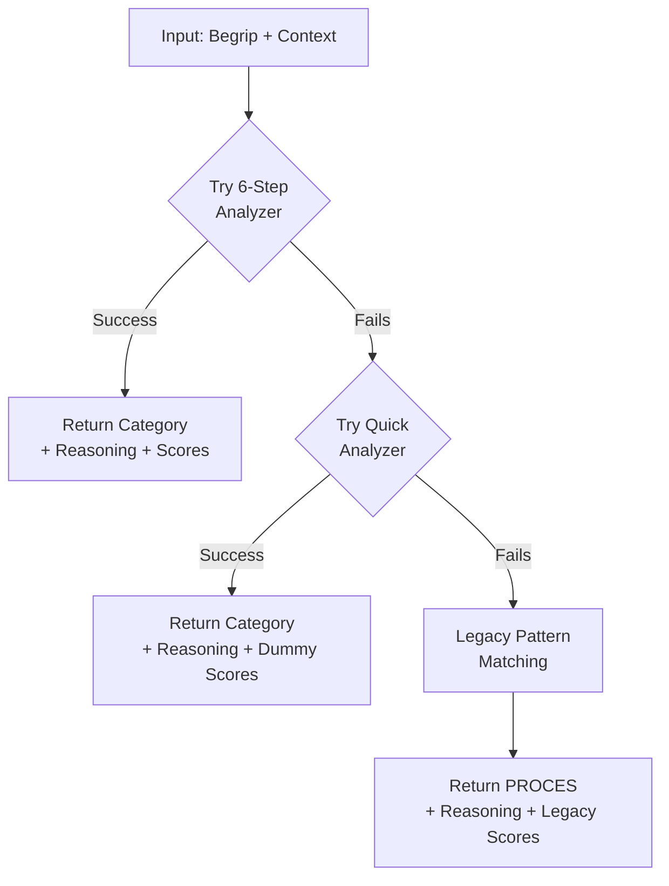

# Ontological Categorization

## Overview
- **Purpose:** Automatically determine the ontological category (proces, type, resultaat, exemplaar) of a legal term based on linguistic patterns and AI analysis
- **Complexity:** Very High
- **Criticality:** Must-have
- **Source Files:**
  - `/Users/chrislehnen/Projecten/Definitie-app/src/ui/tabbed_interface.py` (lines 272-498)
  - `/Users/chrislehnen/Projecten/Definitie-app/src/ontologie/ontological_analyzer.py`

## Business Purpose

### Problem Being Solved
In legal terminology, correctly classifying a term's ontological nature is critical for:
- **Definition structure**: Different categories require different definitional approaches
- **Reasoning and inference**: Understanding whether something is a process, type, result, or instance affects legal interpretation
- **Consistency**: Ensures terms are defined consistently across the domain
- **Integration**: Allows mapping to UFO (Unified Foundational Ontology) categories for formal ontologies

### Why This Approach
The system uses a **3-level fallback chain** to ensure robust categorization:
1. **6-step ontological analysis** (AI-powered, comprehensive) - Primary method
2. **Quick pattern analyzer** (rule-based, fast) - Fallback when AI fails
3. **Legacy pattern matching** (hardcoded rules) - Ultimate fallback

This ensures the system always produces a category, even if external services fail.

## Algorithm/Logic

### High-Level Flow


### Detailed Steps

#### Level 1: 6-Step Ontological Analysis (Primary)
Located in `src/ontologie/ontological_analyzer.py`:

1. **Import analyzer**: `from ontologie.ontological_analyzer import OntologischeAnalyzer`
2. **Initialize**: `analyzer = OntologischeAnalyzer()`
3. **Call async method**: `categorie, analyse_resultaat = await analyzer.bepaal_ontologische_categorie(begrip, org_context, jur_context)`
4. **Extract components**:
   - `reasoning` - Textual explanation of classification
   - `test_scores` - Dict mapping each category to a score (0.0-1.0)
5. **Return**: `(categorie, reasoning, test_scores)`

**Success indicators**: Returns `OntologischeCategorie` enum + comprehensive analysis

#### Level 2: Quick Pattern Analyzer (Fallback)
When 6-step fails:

1. **Import**: `from ontologie.ontological_analyzer import QuickOntologischeAnalyzer`
2. **Initialize**: `quick_analyzer = QuickOntologischeAnalyzer()`
3. **Call**: `categorie, reasoning = quick_analyzer.quick_categoriseer(begrip)`
4. **Generate dummy scores**: All 0.0 except chosen category = 0.5
5. **Return**: `(categorie, f"Quick analyse - {reasoning}", quick_scores)`

**Trigger**: Exception in 6-step analysis

#### Level 3: Legacy Pattern Matching (Ultimate Fallback)
When both AI and quick fail:

1. **Call**: `_legacy_pattern_matching(begrip)` (lines 334-345)
2. **Apply simple rules**:
   ```python
   begrip_lower = begrip.lower()

   # Proces patterns
   if any(begrip_lower.endswith(p) for p in ["atie", "ing", "eren"]):
       return "Proces patroon gedetecteerd"

   # Type patterns
   if any(w in begrip_lower for w in ["document", "bewijs", "systeem"]):
       return "Type patroon gedetecteerd"

   # Resultaat patterns
   if any(w in begrip_lower for w in ["resultaat", "uitkomst", "besluit"]):
       return "Resultaat patroon gedetecteerd"

   # Default
   return "Geen duidelijke patronen gedetecteerd"
   ```
3. **Generate legacy scores**: `{"proces": 0, "type": 1, "resultaat": 0, "exemplaar": 0}`
4. **Return**: `(OntologischeCategorie.PROCES, f"Legacy fallback - {reasoning}", legacy_scores)`

**Trigger**: Exception in both Level 1 and Level 2

### Pseudocode
```python
async def determine_ontological_category(begrip, org_context, jur_context):
    """3-level fallback chain for ontological categorization."""
    try:
        # Level 1: Full 6-step AI analysis
        analyzer = OntologischeAnalyzer()
        categorie, analyse_resultaat = await analyzer.bepaal_ontologische_categorie(
            begrip, org_context, jur_context
        )
        reasoning = analyse_resultaat.get("reasoning", "Ontologische analyse voltooid")
        test_scores = analyse_resultaat.get("categorie_resultaat", {}).get("test_scores", {})

        logger.info(f"6-stappen ontologische analyse voor '{begrip}': {categorie.value}")
        return categorie, reasoning, test_scores

    except Exception as e:
        logger.warning(f"6-stappen analyse mislukt voor '{begrip}': {e}")

        try:
            # Level 2: Quick pattern analyzer
            quick_analyzer = QuickOntologischeAnalyzer()
            categorie, reasoning = quick_analyzer.quick_categoriseer(begrip)

            logger.info(f"Quick ontologische analyse voor '{begrip}': {categorie.value}")
            # Generate dummy scores for quick analyzer
            quick_scores = {
                cat: 0.5 if cat == categorie.value else 0.0
                for cat in ["type", "proces", "resultaat", "exemplaar"]
            }
            return categorie, f"Quick analyse - {reasoning}", quick_scores

        except Exception as e2:
            logger.error(f"Ontologische analyse volledig mislukt voor '{begrip}': {e2}")

            # Level 3: Ultimate fallback to legacy pattern matching
            reasoning = legacy_pattern_matching(begrip)
            legacy_scores = {"type": 0, "proces": 1, "resultaat": 0, "exemplaar": 0}
            return (
                OntologischeCategorie.PROCES,
                f"Legacy fallback - {reasoning}",
                legacy_scores,
            )

def legacy_pattern_matching(begrip: str) -> str:
    """Simple pattern matching for fallback situations."""
    begrip_lower = begrip.lower()

    if any(begrip_lower.endswith(p) for p in ["atie", "ing", "eren"]):
        return "Proces patroon gedetecteerd"
    if any(w in begrip_lower for w in ["document", "bewijs", "systeem"]):
        return "Type patroon gedetecteerd"
    if any(w in begrip_lower for w in ["resultaat", "uitkomst", "besluit"]):
        return "Resultaat patroon gedetecteerd"

    return "Geen duidelijke patronen gedetecteerd"
```

## Hardcoded Values

| Name | Value | Location | Rationale | Rebuild Config |
|------|-------|----------|-----------|----------------|
| **Pattern Dictionaries** | | | | |
| Proces suffixes | `["atie", "ing", "eren"]` | Line 339 | Dutch morphology | `ontology.patterns.proces.suffixes` |
| Proces keywords | `["verificatie", "authenticatie", "validatie", "controle", "check", "beoordeling", "analyse", "behandeling", "vaststelling", "bepaling", "registratie", "identificatie"]` | Lines 355-371 | Common process terms | `ontology.patterns.proces.keywords` |
| Type keywords | `["bewijs", "document", "middel", "systeem", "methode", "tool", "instrument", "gegeven", "kenmerk", "eigenschap"]` | Lines 372-382 | Common type indicators | `ontology.patterns.type.keywords` |
| Resultaat keywords | `["besluit", "uitslag", "rapport", "conclusie", "bevinding", "resultaat", "uitkomst", "advies", "oordeel"]` | Lines 383-393 | Common result terms | `ontology.patterns.resultaat.keywords` |
| Exemplaar keywords | `["specifiek", "individueel", "uniek", "persoon", "zaak", "instantie", "geval", "situatie"]` | Lines 394-404 | Instance indicators | `ontology.patterns.exemplaar.keywords` |
| **Fallback Scores** | | | | |
| Quick analyzer score | `0.5` | Line 316 | Confidence for pattern match | `ontology.quick_analyzer.default_score` |
| Legacy default category | `OntologischeCategorie.PROCES` | Line 329 | Most common category | `ontology.fallback.default_category` |
| Legacy scores | `{"type": 0, "proces": 1, "resultaat": 0, "exemplaar": 0}` | Line 327 | Dummy scores for UI | `ontology.fallback.dummy_scores` |
| **Scoring** | | | | |
| Score calculation | `sum(1 for indicator in indicators if indicator in begrip_lower)` | Lines 482-493 | Count matching patterns | `ontology.scoring.method: count_matches` |

## Patterns & Data

### Pattern Dictionaries
```yaml
# Complete pattern dictionaries extracted from code

proces_patterns:
  suffixes:
    - "atie"
    - "eren"
    - "ing"
  keywords:
    - "verificatie"
    - "authenticatie"
    - "validatie"
    - "controle"
    - "check"
    - "beoordeling"
    - "analyse"
    - "behandeling"
    - "vaststelling"
    - "bepaling"
    - "registratie"
    - "identificatie"

type_patterns:
  keywords:
    - "bewijs"
    - "document"
    - "middel"
    - "systeem"
    - "methode"
    - "tool"
    - "instrument"
    - "gegeven"
    - "kenmerk"
    - "eigenschap"

resultaat_patterns:
  keywords:
    - "besluit"
    - "uitslag"
    - "rapport"
    - "conclusie"
    - "bevinding"
    - "resultaat"
    - "uitkomst"
    - "advies"
    - "oordeel"

exemplaar_patterns:
  keywords:
    - "specifiek"
    - "individueel"
    - "uniek"
    - "persoon"
    - "zaak"
    - "instantie"
    - "geval"
    - "situatie"
```

### Category Scoring Logic (from `_get_category_scores` lines 420-498)

The scoring algorithm simply **counts the number of matching indicators**:

```python
def _get_category_scores(begrip: str) -> dict[str, int]:
    """Recalculate category scores for display."""
    try:
        begrip_lower = begrip.lower()

        # Scores per category = count of matching indicators
        return {
            "proces": sum(
                1 for indicator in proces_indicators if indicator in begrip_lower
            ),
            "type": sum(
                1 for indicator in type_indicators if indicator in begrip_lower
            ),
            "resultaat": sum(
                1 for indicator in resultaat_indicators if indicator in begrip_lower
            ),
            "exemplaar": sum(
                1 for indicator in exemplaar_indicators if indicator in begrip_lower
            ),
        }
    except Exception as e:
        logger.warning(f"Failed to calculate category scores: {e}")
        return {"proces": 0, "type": 0, "resultaat": 0, "exemplaar": 0}
```

**Key insight**: The higher the score, the more pattern matches. The category with the highest score wins in simple pattern-based classification.

## Edge Cases

### Known Edge Cases

1. **Case:** Begrip contains multiple category indicators
   - **Trigger:** Term like "besluit vaststelling" (resultaat + proces)
   - **Handling:** Scoring algorithm counts all matches; highest score wins
   - **Test:** Verify which category gets higher score

2. **Case:** AI service unavailable
   - **Trigger:** Network failure, API timeout, API key issues
   - **Handling:** Falls back to Quick analyzer, then Legacy
   - **Test:** Mock API failure and verify fallback chain

3. **Case:** Begrip has no recognizable patterns
   - **Trigger:** Highly technical or compound terms
   - **Handling:** Legacy returns "Geen duidelijke patronen gedetecteerd" + default to PROCES
   - **Test:** Input: "X509-certificaat" should fallback to PROCES

4. **Case:** Non-Dutch terms
   - **Trigger:** English or other language technical terms
   - **Handling:** Patterns won't match; defaults to PROCES category
   - **Test:** Input: "authentication" should default to PROCES (misses "atie" ending)

5. **Case:** Empty or whitespace-only begrip
   - **Trigger:** Invalid input
   - **Handling:** No explicit guard; will likely trigger exceptions and cascade to fallback
   - **Test:** Verify error handling for empty strings

### Untested Edge Cases

- **Multiple ontological aspects**: Terms that genuinely span categories (e.g., "verificatieresultaat")
- **Context-dependent categorization**: Same term may have different categories in different legal contexts
- **Compound terms with hyphens**: How are "authenticatie-proces", "verificatie-systeem" classified?
- **Abbreviations**: How are "ID-verificatie", "DBC-bepaling" handled?
- **Negations**: Terms like "niet-verificatie" or "onbewijs"

## Dependencies

### Services Called
- **OntologischeAnalyzer** (Level 1): `bepaal_ontologische_categorie(begrip, org_context, jur_context)`
  - Located in: `src/ontologie/ontological_analyzer.py`
  - Returns: `(OntologischeCategorie, dict)`

- **QuickOntologischeAnalyzer** (Level 2): `quick_categoriseer(begrip)`
  - Located in: `src/ontologie/ontological_analyzer.py`
  - Returns: `(OntologischeCategorie, str)`

### External APIs
- **None directly** - But OntologischeAnalyzer may use OpenAI API internally

### Data Dependencies
- **OntologischeCategorie enum** from `domain.ontological_categories`
- **Session state** for storing determined category (used in generation workflow)

## Performance

- **Time Complexity:**
  - Level 1 (6-step): O(n) where n = external API call time (~2-5 seconds)
  - Level 2 (Quick): O(m) where m = length of begrip for pattern matching (~<10ms)
  - Level 3 (Legacy): O(m) where m = length of begrip (~<5ms)

- **Space Complexity:** O(1) - Pattern dictionaries are constants

- **Bottlenecks:**
  1. **AI API calls** in Level 1 (network latency, rate limits)
  2. **Exception handling overhead** when cascading through fallbacks

- **Optimization Opportunities:**
  1. **Cache results** per begrip to avoid repeated categorization
  2. **Parallel execution**: Try Quick analyzer and 6-step simultaneously, use whichever completes first
  3. **Pattern matching optimization**: Use Trie structure for suffix matching
  4. **Smart fallback**: Only invoke Level 1 for complex terms; simple terms go directly to Level 2

## Test Cases

### Good Inputs

```
Input: "authenticatie"
Expected Output: (OntologischeCategorie.PROCES, "Proces patroon gedetecteerd", {...})
Reason: Ends with "atie" suffix, in proces keywords list

Input: "besluit"
Expected Output: (OntologischeCategorie.RESULTAAT, "Resultaat patroon gedetecteerd", {...})
Reason: Exact match in resultaat keywords

Input: "document"
Expected Output: (OntologischeCategorie.TYPE, "Type patroon gedetecteerd", {...})
Reason: Exact match in type keywords

Input: "persoon"
Expected Output: (OntologischeCategorie.EXEMPLAAR, "Instance pattern detected", {...})
Reason: Exact match in exemplaar keywords
```

### Bad Inputs

```
Input: ""
Expected Behavior: Exception → fallback to PROCES
Reason: Empty string has no patterns

Input: "12345"
Expected Behavior: fallback to PROCES
Reason: Numeric string has no linguistic patterns

Input: None
Expected Behavior: TypeError in pattern matching
Reason: Cannot call .lower() on None
```

### Edge Cases to Test

```
Test: "verificatieresultaat" (compound term)
Verify: Which category wins (proces vs. resultaat)?
Expected: Higher score (proces has more matches likely)

Test: "X509-certificaat" (technical term)
Verify: Fallback behavior
Expected: Defaults to PROCES

Test: "vaststelling van besluit" (phrase with multiple categories)
Verify: Score calculation
Expected: Both proces and resultaat get points

Test: AI service timeout
Verify: Cascade to Quick analyzer
Expected: Quick analyzer returns valid category

Test: All analyzers fail
Verify: Legacy fallback activates
Expected: Returns PROCES + "Legacy fallback" message
```

## Rebuild Recommendations

### Configuration

```yaml
# Suggested config structure for rebuild

ontology:
  categorization:
    # Fallback chain
    fallback_chain:
      - name: "ai_analyzer"
        enabled: true
        timeout: 5000  # milliseconds
        priority: 1
      - name: "quick_pattern"
        enabled: true
        timeout: 100
        priority: 2
      - name: "legacy_pattern"
        enabled: true
        timeout: 50
        priority: 3

    # Default category when all fail
    default_category: "proces"

    # Pattern dictionaries (externalizable)
    patterns:
      proces:
        suffixes: ["atie", "ing", "eren"]
        keywords: ["verificatie", "authenticatie", "validatie", ...]
      type:
        keywords: ["bewijs", "document", "middel", ...]
      resultaat:
        keywords: ["besluit", "uitslag", "rapport", ...]
      exemplaar:
        keywords: ["specifiek", "individueel", "uniek", ...]

    # Scoring
    scoring:
      method: "count_matches"  # or "weighted_matches"
      weights:
        suffix_match: 2.0  # Suffix matches count double
        keyword_match: 1.0

    # Quick analyzer
    quick_analyzer:
      default_score: 0.5
      min_confidence: 0.3

    # Legacy fallback
    fallback:
      default_category: "proces"
      dummy_scores:
        type: 0
        proces: 1
        resultaat: 0
        exemplaar: 0
```

### Implementation Notes

**KEEP:**
- 3-level fallback chain (robust design)
- Pattern-based approach for quick classification
- Scoring algorithm (simple and effective)

**CHANGE:**
- **Externalize pattern dictionaries**: Move to YAML/JSON config for easy updates
- **Add caching**: Cache (begrip → category) mappings to avoid redundant calls
- **Improve scoring**: Weight suffix matches higher than keyword matches
- **Add validation**: Check for empty/null begrip before processing
- **Logging**: Add structured logging for fallback transitions

**CONSIDER:**
- **Machine learning model**: Train classifier on historical data
- **Context-aware categorization**: Use org_context and jur_context more intelligently
- **Multi-category support**: Some terms may legitimately belong to multiple categories
- **Confidence thresholds**: Don't fallback immediately; only fallback if confidence < threshold
- **Parallel execution**: Race AI analyzer and Quick analyzer, use fastest result

## Related Documentation
- UFO Ontology mapping (if exists)
- Domain model documentation
- OntologischeCategorie enum definition in `domain/ontological_categories.py`

## Extraction Date
2025-10-02
