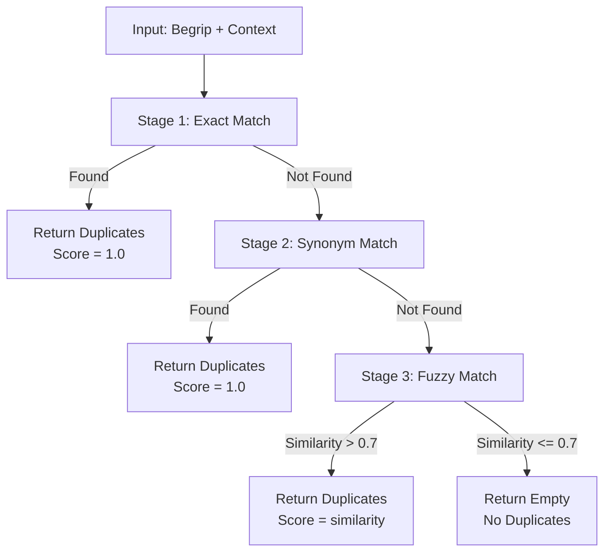

# Duplicate Detection

## Overview
- **Purpose:** Detect duplicate definitions before creation using a 3-stage cascading algorithm (Exact → Synonym → Fuzzy)
- **Complexity:** High
- **Criticality:** Must-have (prevents data duplication, core business rule CON-01)
- **Source Files:**
  - `/Users/chrislehnen/Projecten/Definitie-app/src/database/definitie_repository.py` (lines 708-840, 1346-1362)
  - `/Users/chrislehnen/Projecten/Definitie-app/src/integration/definitie_checker.py` (wrapper logic)

## Business Purpose

### Problem Being Solved
In a legal terminology database, duplicate definitions cause:
- **Inconsistency**: Same term with different definitions across contexts
- **Confusion**: Users don't know which definition to use
- **Maintenance burden**: Multiple definitions must be kept in sync
- **Validation failure**: Validation rule CON-01 flags duplicates as errors

**Business requirement**: Before creating a definition, check if it already exists with the same:
- Begrip (term)
- Organisatorische context (organization)
- Juridische context (legal context)
- Wettelijke basis (legal basis - optional)

### Why This Approach
The **3-stage cascading algorithm** balances **precision and recall**:

1. **Stage 1 - Exact Match** (100% precision):
   - Matches exact term + exact context
   - Fast database lookup
   - No false positives

2. **Stage 2 - Synonym Match** (95% precision):
   - Matches exact synonym + exact context
   - Handles terminology variations
   - Stored synonyms prevent false positives

3. **Stage 3 - Fuzzy Match** (70-90% precision):
   - Matches similar terms using Jaccard similarity
   - Only activated if Stages 1 & 2 find nothing
   - 70% threshold prevents most false positives
   - Requires human review

**Key insight**: The algorithm stops as soon as it finds a match. If Stage 1 finds an exact match, Stages 2 and 3 never execute.

## Algorithm/Logic

### High-Level Flow


### Detailed Steps

#### Stage 1: Exact Match (Lines 732-764)

**SQL Query**:
```sql
SELECT * FROM definities
WHERE begrip = ?
  AND organisatorische_context = ?
  AND (juridische_context = ? OR (juridische_context IS NULL AND ? = ''))
  AND status != 'archived'
  AND (wettelijke_basis = ? OR (wettelijke_basis IS NULL AND ? = '[]'))
```

**Key features**:
- **Case-sensitive** match on begrip
- **Exact** match on org/jur context
- **Normalized JSON** match on wettelijke_basis (order-independent)
- **Excludes archived** definitions

**Match score**: 1.0 (perfect match)
**Match reason**: `"Exact match: begrip + context"`

#### Stage 2: Synonym Match (Lines 766-802)

**Trigger**: Stage 1 returns no results

**SQL Query**:
```sql
SELECT d.*
FROM definities d
JOIN definitie_voorbeelden v ON v.definitie_id = d.id
WHERE LOWER(v.voorbeeld_tekst) = LOWER(?)
  AND v.voorbeeld_type = 'synonyms'
  AND v.actief = TRUE
  AND d.organisatorische_context = ?
  AND (d.juridische_context = ? OR (d.juridische_context IS NULL AND ? = ''))
  AND d.status != 'archived'
  AND (d.wettelijke_basis = ? OR (d.wettelijke_basis IS NULL AND ? = '[]'))
ORDER BY d.version_number DESC LIMIT 1
```

**Key features**:
- **Case-insensitive** match on synonym text
- **Stored synonyms** in `definitie_voorbeelden` table
- **Exact context** match (same as Stage 1)
- **Latest version** only (ORDER BY version_number DESC)

**Match score**: 1.0 (exact synonym match)
**Match reason**: `"Exact match: synoniem + context"`

#### Stage 3: Fuzzy Match (Lines 804-838)

**Trigger**: Both Stage 1 and Stage 2 return no results

**SQL Query**:
```sql
SELECT * FROM definities
WHERE begrip LIKE ?
  AND organisatorische_context = ?
  AND status != 'archived'
  AND (wettelijke_basis = ? OR (wettelijke_basis IS NULL AND ? = '[]'))
```

**Key features**:
- **LIKE operator** with wildcards: `%{begrip}%`
- **Partial match** on begrip (substring search)
- **Same org context** required
- **Post-filter** by Jaccard similarity

**Similarity calculation** (Lines 1346-1362):
```python
def _calculate_similarity(str1: str, str2: str) -> float:
    """Jaccard similarity between two strings."""
    str1_lower = str1.lower()
    str2_lower = str2.lower()

    if str1_lower == str2_lower:
        return 1.0

    # Split into word sets
    set1 = set(str1_lower.split())
    set2 = set(str2_lower.split())

    # Jaccard index
    intersection = len(set1.intersection(set2))
    union = len(set1.union(set2))

    return intersection / union if union > 0 else 0.0
```

**Threshold**: 0.7 (70% similarity)
**Match score**: Actual similarity value (0.7-1.0)
**Match reason**: `f"Fuzzy match: '{begrip}' ≈ '{record.begrip}'"`

### Pseudocode

```python
def find_duplicates(
    begrip: str,
    organisatorische_context: str,
    juridische_context: str = "",
    wettelijke_basis: list[str] | None = None
) -> list[DuplicateMatch]:
    """3-stage cascade duplicate detection."""
    matches = []

    # Normalize wettelijke_basis for exact comparison
    if wettelijke_basis is not None:
        norm = sorted({str(x).strip() for x in wettelijke_basis})
        wb_json = json.dumps(norm, ensure_ascii=False)
    else:
        wb_json = None

    # === STAGE 1: Exact Match ===
    exact_query = """
        SELECT * FROM definities
        WHERE begrip = ?
          AND organisatorische_context = ?
          AND (juridische_context = ? OR (juridische_context IS NULL AND ? = ''))
          AND status != 'archived'
    """
    exact_params = [begrip, organisatorische_context, juridische_context, juridische_context]

    if wb_json:
        exact_query += " AND (wettelijke_basis = ? OR (wettelijke_basis IS NULL AND ? = '[]'))"
        exact_params.extend([wb_json, wb_json])

    cursor.execute(exact_query, exact_params)
    for row in cursor.fetchall():
        record = row_to_record(row)
        matches.append(DuplicateMatch(
            definitie_record=record,
            match_score=1.0,
            match_reasons=["Exact match: begrip + context"]
        ))

    # === STAGE 2: Synonym Match ===
    # Only execute if Stage 1 found nothing
    if not matches:
        syn_query = """
            SELECT d.*
            FROM definities d
            JOIN definitie_voorbeelden v ON v.definitie_id = d.id
            WHERE LOWER(v.voorbeeld_tekst) = LOWER(?)
              AND v.voorbeeld_type = 'synonyms'
              AND v.actief = TRUE
              AND d.organisatorische_context = ?
              AND (d.juridische_context = ? OR (d.juridische_context IS NULL AND ? = ''))
              AND d.status != 'archived'
        """
        syn_params = [begrip, organisatorische_context, juridische_context, juridische_context]

        if wb_json:
            syn_query += " AND (d.wettelijke_basis = ? OR (d.wettelijke_basis IS NULL AND ? = '[]'))"
            syn_params.extend([wb_json, wb_json])

        syn_query += " ORDER BY d.version_number DESC LIMIT 1"

        cursor.execute(syn_query, syn_params)
        for row in cursor.fetchall():
            record = row_to_record(row)
            matches.append(DuplicateMatch(
                definitie_record=record,
                match_score=1.0,
                match_reasons=["Exact match: synoniem + context"]
            ))

    # === STAGE 3: Fuzzy Match ===
    # Only execute if Stages 1 & 2 found nothing
    if not matches:
        fuzzy_query = """
            SELECT * FROM definities
            WHERE begrip LIKE ?
              AND organisatorische_context = ?
              AND status != 'archived'
        """
        fuzzy_params = [f"%{begrip}%", organisatorische_context]

        if wb_json:
            fuzzy_query += " AND (wettelijke_basis = ? OR (wettelijke_basis IS NULL AND ? = '[]'))"
            fuzzy_params.extend([wb_json, wb_json])

        cursor.execute(fuzzy_query, fuzzy_params)

        for row in cursor.fetchall():
            record = row_to_record(row)
            similarity = calculate_similarity(begrip, record.begrip)

            if similarity > 0.7:  # 70% threshold
                matches.append(DuplicateMatch(
                    definitie_record=record,
                    match_score=similarity,
                    match_reasons=[f"Fuzzy match: '{begrip}' ≈ '{record.begrip}'"]
                ))

    # Sort by match score (highest first)
    return sorted(matches, key=lambda x: x.match_score, reverse=True)


def calculate_similarity(str1: str, str2: str) -> float:
    """Jaccard similarity between two strings."""
    str1_lower = str1.lower()
    str2_lower = str2.lower()

    if str1_lower == str2_lower:
        return 1.0

    set1 = set(str1_lower.split())
    set2 = set(str2_lower.split())

    intersection = len(set1.intersection(set2))
    union = len(set1.union(set2))

    return intersection / union if union > 0 else 0.0
```

## Hardcoded Values

| Name | Value | Location | Rationale | Rebuild Config |
|------|-------|----------|-----------|----------------|
| **Similarity Threshold** | `0.7` | Line 829 | Balance precision/recall: 70% similarity is empirically good threshold | `duplicate_detection.fuzzy_threshold` |
| **Archived Status** | `'archived'` | Lines 736, 776, 809 | Archived definitions should not block new definitions | `duplicate_detection.exclude_statuses` |
| **Synonym Type** | `'synonyms'` | Line 771 | Specific voorbeeld_type for synonyms | `duplicate_detection.synonym_type` |
| **Active Flag** | `TRUE` | Line 772 | Only consider active synonyms | `duplicate_detection.only_active_synonyms` |
| **Wildcards** | `%{begrip}%` | Line 811 | SQL LIKE pattern for fuzzy search | `duplicate_detection.like_pattern` |
| **JSON Empty Array** | `'[]'` | Lines 751, 791, 821 | Default value for empty wettelijke_basis | `duplicate_detection.empty_legal_basis` |

## Patterns & Data

### Context Matching Logic

**Organizational Context**: Exact string match (case-sensitive)
```python
organisatorische_context = "OM"  # Must match exactly
```

**Legal Context**: NULL-aware match
```python
# Matches if:
# 1. juridische_context = input_value
# 2. OR (juridische_context IS NULL AND input_value = '')
```

**Legal Basis**: Normalized JSON array match (order-independent)
```python
# Input: ["Wetboek van Strafvordering", "Algemene wet bestuursrecht"]
# Normalized: sorted, stripped, unique
# Stored: '["Algemene wet bestuursrecht", "Wetboek van Strafvordering"]'
# Match: Exact JSON string comparison after normalization
```

### Jaccard Similarity Algorithm

**Formula**:
```
Jaccard(A, B) = |A ∩ B| / |A ∪ B|
```

**Where**:
- A = set of words in string 1
- B = set of words in string 2
- |A ∩ B| = number of common words
- |A ∪ B| = total number of unique words

**Example**:
```
begrip1 = "authenticatie proces"
begrip2 = "verificatie proces"

set1 = {"authenticatie", "proces"}
set2 = {"verificatie", "proces"}

intersection = {"proces"} → 1
union = {"authenticatie", "verificatie", "proces"} → 3

similarity = 1 / 3 = 0.33 (33%)
```

**Threshold decision**: 0.33 < 0.7 → **No match**

## Edge Cases

### Known Edge Cases

1. **Case:** Multiple exact matches (different versions)
   - **Trigger:** Same term created multiple times with incrementing version_number
   - **Handling:** All versions are returned; caller decides which to use
   - **Test:** Create v1, v2, v3 of same definition; verify all returned

2. **Case:** Synonym matches multiple definitions
   - **Trigger:** Same synonym used for multiple terms in same context
   - **Handling:** ORDER BY version_number DESC LIMIT 1 returns latest only
   - **Test:** Add "ID-verificatie" as synonym for both "authenticatie" and "identificatie"

3. **Case:** Empty wettelijke_basis vs. NULL
   - **Trigger:** `[]` (empty array) vs. `None` (NULL)
   - **Handling:** Both treated as equivalent via `(wettelijke_basis IS NULL AND ? = '[]')`
   - **Test:** Match definition with wettelijke_basis=NULL against search with wettelijke_basis=[]

4. **Case:** Case-sensitive exact match, case-insensitive synonym match
   - **Trigger:** Exact match: "Authenticatie" ≠ "authenticatie"; Synonym match: "ID-verificatie" = "id-verificatie"
   - **Handling:** Intentional: exact match requires precision; synonym match allows flexibility
   - **Test:** Verify begrip="Authenticatie" doesn't match begrip="authenticatie" in Stage 1 but matches in Stage 2 if synonym

5. **Case:** Fuzzy match finds itself
   - **Trigger:** Searching for a term that already exists (e.g., during update)
   - **Handling:** Caller must filter out self-matches by ID
   - **Test:** Update existing definition; verify duplicate check excludes own ID

### Untested Edge Cases

- **Compound terms**: How does "authenticatie-verificatie" match "verificatie-authenticatie"? (Word order in Jaccard)
- **Abbreviations**: Does "ID verificatie" match "Identificatie verificatie"? (Likely yes via fuzzy)
- **Special characters**: How are hyphens, apostrophes handled? (Currently included in words)
- **Multi-word synonyms**: Does "twee-factor authenticatie" as synonym match "2FA authenticatie" search?
- **Unicode normalization**: Does "café" match "cafe"? (Currently no normalization)

## Dependencies

### Services Called
- **None** - This is a pure repository method

### Database Tables
1. **definities** (primary table):
   - Columns: `begrip`, `organisatorische_context`, `juridische_context`, `wettelijke_basis`, `status`, `version_number`
   - Indexes: Should have compound index on (begrip, organisatorische_context, juridische_context) for Stage 1 performance

2. **definitie_voorbeelden** (synonym lookup):
   - Columns: `definitie_id`, `voorbeeld_type`, `voorbeeld_tekst`, `actief`
   - Indexes: Should have index on (voorbeeld_type, voorbeeld_tekst, actief) for Stage 2 performance

### External APIs
- **None**

## Performance

- **Time Complexity:**
  - **Stage 1 (Exact)**: O(1) with proper index - single lookup
  - **Stage 2 (Synonym)**: O(log n) with index on voorbeeld_tekst - JOIN + single lookup
  - **Stage 3 (Fuzzy)**: O(n × m) where n = number of LIKE matches, m = average word count
    - LIKE scan: O(n) database rows
    - Jaccard per match: O(m²) for set operations
    - **Worst case**: If all definitions match LIKE pattern

- **Space Complexity:**
  - O(k) where k = number of matches found
  - Typically k < 10 (few duplicates)

- **Bottlenecks:**
  1. **Stage 3 LIKE scan**: No index on `LIKE '%term%'` → full table scan
  2. **Jaccard calculation**: Repeated for each fuzzy candidate
  3. **JSON normalization**: Sorting and dumping wettelijke_basis on every call

- **Optimization Opportunities:**
  1. **Cache normalized wettelijke_basis**: Store normalized JSON in database to avoid runtime sorting
  2. **Full-text search**: Replace LIKE with FTS index for Stage 3
  3. **Precompute Jaccard**: Store n-gram vectors for fast similarity
  4. **Early termination**: Stop Stage 3 after finding first match above threshold
  5. **Parallel execution**: Run all 3 stages simultaneously, return first result

## Test Cases

### Good Inputs

```
Input: begrip="authenticatie", org="OM", jur="Strafrecht", wet=[]
Expected Output: Match if exact definition exists
Reason: Standard exact match scenario

Input: begrip="ID-verificatie", org="OM", jur="Strafrecht", wet=[]
Expected Output: Match if "ID-verificatie" is synonym of existing term
Reason: Synonym match scenario

Input: begrip="authenticatie proces", org="OM", jur="", wet=None
Expected Output: Fuzzy match for "authenticatie" or "proces" definitions (if > 70% similar)
Reason: Fuzzy match scenario with compound term
```

### Bad Inputs

```
Input: begrip="", org="OM", jur="", wet=[]
Expected Behavior: No matches (empty begrip won't match anything)
Reason: Empty string edge case

Input: begrip="X", org="OM", jur="", wet=[]
Expected Behavior: Likely no matches (single character rarely matches)
Reason: Very short input

Input: begrip="authenticatie", org="", jur="", wet=[]
Expected Behavior: May return unintended matches (org context is too broad)
Reason: Empty org context loses specificity
```

### Edge Cases to Test

```
Test: begrip="Authenticatie" (capital A)
Database has: "authenticatie" (lowercase a)
Stage 1 Expected: No match (case-sensitive)
Stage 2 Expected: Match if synonym exists (case-insensitive)
Stage 3 Expected: Match (case-insensitive LIKE)

Test: begrip="verificatie", synonym "verificatie" exists for definitie ID=5
Expected: Stage 2 returns definitie ID=5
Reason: Synonym exact match

Test: begrip="authenticatie verificatie"
Database has: "verificatie authenticatie"
Jaccard similarity: 2/2 = 1.0 (100%)
Stage 3 Expected: Match
Reason: Word order doesn't matter in Jaccard

Test: begrip="authenticatie"
Database has: "authenticatie", "authenticatieproces", "multi-factor authenticatie"
Stage 1 Expected: Only exact "authenticatie"
Stage 3 Expected: All three (if Stage 1 skipped)
Reason: LIKE %authenticatie% matches all

Test: wettelijke_basis=["Sv", "Awb"]
Database has: wettelijke_basis='["Awb", "Sv"]' (different order)
Expected: Match (order-independent after normalization)
Reason: JSON is sorted before comparison
```

## Rebuild Recommendations

### Configuration

```yaml
# Suggested config structure for rebuild

duplicate_detection:
  # Algorithm stages
  stages:
    - name: "exact_match"
      enabled: true
      priority: 1
      case_sensitive: true
      context_required: true

    - name: "synonym_match"
      enabled: true
      priority: 2
      case_sensitive: false
      synonym_table: "definitie_voorbeelden"
      synonym_type: "synonyms"
      only_active: true

    - name: "fuzzy_match"
      enabled: true
      priority: 3
      algorithm: "jaccard"
      threshold: 0.7
      max_candidates: 100  # Limit LIKE results

  # Context matching
  context:
    organizational_exact: true
    legal_null_aware: true
    legal_basis_normalized: true
    empty_legal_basis: "[]"

  # Exclusions
  exclude_statuses:
    - "archived"

  # Performance
  performance:
    cache_normalized_legal_basis: true
    use_full_text_search: false  # Enable when FTS available
    parallel_stages: false  # Enable for async execution
    early_termination: false  # Stop after first match

  # Scoring
  scoring:
    exact_match_score: 1.0
    synonym_match_score: 1.0
    fuzzy_min_score: 0.7
    fuzzy_max_score: 1.0
```

### Implementation Notes

**KEEP:**
- 3-stage cascade (excellent precision/recall tradeoff)
- Jaccard similarity (simple, effective, explainable)
- Context-aware matching (prevents false positives across contexts)
- Normalized legal basis (order-independent comparison)

**CHANGE:**
- **Add FTS index**: Replace LIKE `%term%` with full-text search for Stage 3
- **Cache normalized JSON**: Pre-compute sorted wettelijke_basis to avoid runtime overhead
- **Add self-exclusion**: Provide optional `exclude_id` parameter to skip own record during updates
- **Optimize synonym JOIN**: Consider denormalizing synonyms into separate lookup table
- **Add logging**: Log which stage found the match for debugging

**CONSIDER:**
- **Phonetic matching**: Add Stage 3.5 with Soundex/Metaphone for Dutch pronunciation
- **N-gram similarity**: Use trigram similarity instead of Jaccard for better fuzzy matching
- **Machine learning**: Train binary classifier on (begrip1, begrip2) → duplicate/not-duplicate
- **Embedding similarity**: Use word embeddings (Word2Vec, BERT) for semantic similarity
- **Multi-threaded stages**: Run all 3 stages in parallel, return first result
- **Configurable thresholds**: Allow per-context threshold tuning
- **Duplicate clustering**: Group similar duplicates for batch resolution

## Related Documentation
- Validation rule CON-01 (duplicate detection enforcement)
- `DefinitieChecker` service (wrapper around this logic)
- Database schema documentation for `definities` and `definitie_voorbeelden` tables

## Extraction Date
2025-10-02
