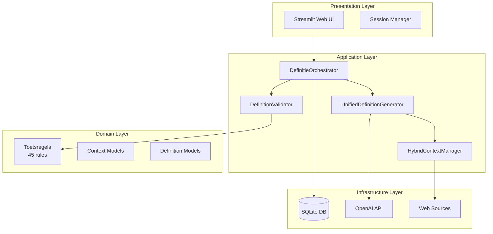
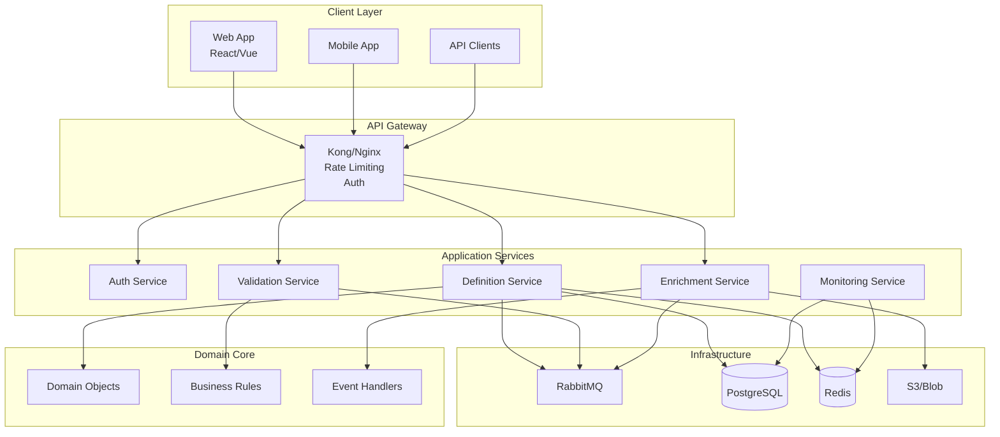
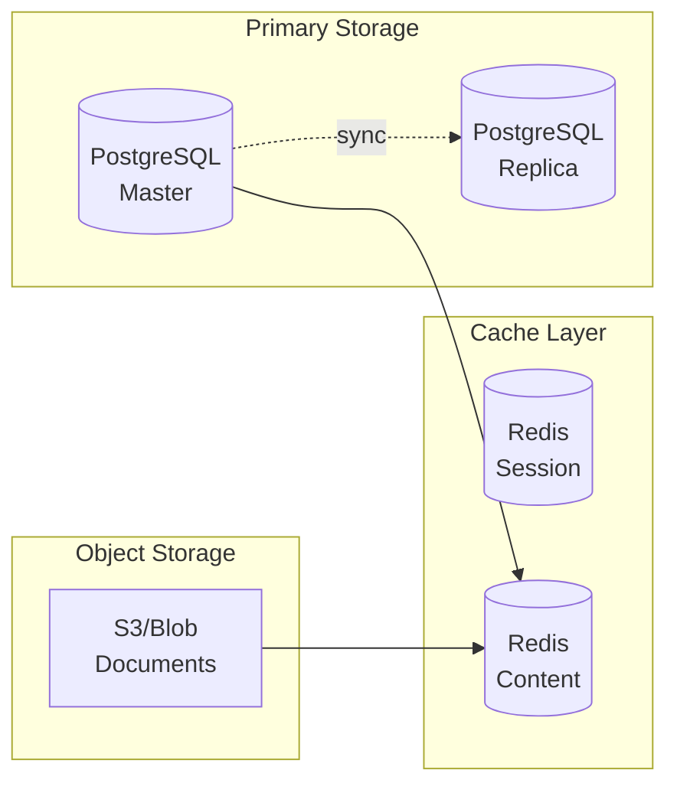
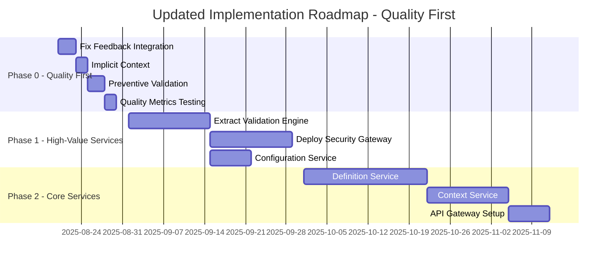
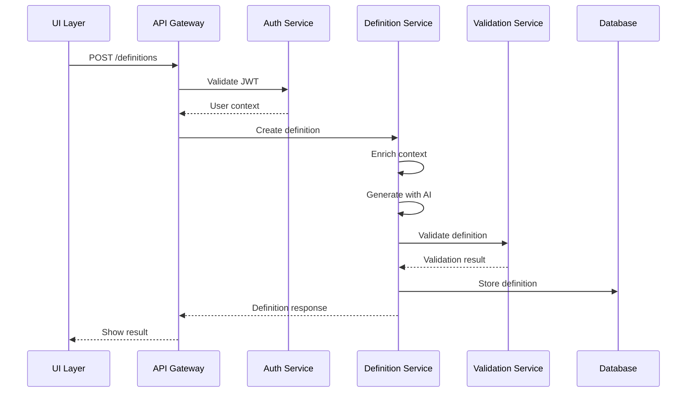
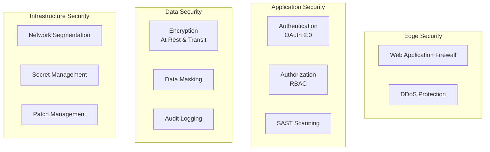
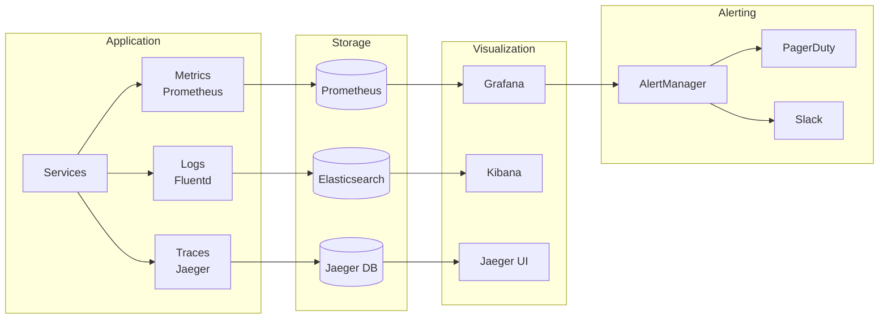

# DefinitieAgent - Complete Solution Architecture

**Document Type**: Solution Architecture Document (SAD)
**Version**: 1.0
**Date**: 2025-08-19
**Author**: Winston - BMad Solution Architect
**Status**: Updated with Complete AS-IS/TO-BE Analysis

---

## Executive Summary

Dit document presenteert de complete solution architectuur voor de DefinitieAgent applicatie, inclusief de huidige staat (AS-IS), de gewenste toekomstige staat (TO-BE), en een pragmatische transitie strategie die de GVI (Generation-Validation Integration) improvements incorporeert.

### Key Architectural Decisions

1. **Hybrid Approach**: Combinatie van quick wins (GVI) met lange termijn microservices evolutie
2. **Phased Migration**: Van monoliet naar modulaire services in 3 fases
3. **Technology Modernization**: Behoud Python/Streamlit voor UI, migratie backend naar FastAPI
4. **Data Strategy**: SQLite → PostgreSQL met Redis caching layer

### Business Drivers

- **Performance**: Response tijd van 8-12s naar <2s
- **Schaalbaarheid**: Van 1 naar 100+ concurrent users
- **Kwaliteit**: 90%+ first-time-right definities
- **Security**: Enterprise-grade authentication & authorization
- **Maintainability**: Van 304 files (50% unused) naar clean architecture

---

## 1. Current State Architecture (AS-IS)

### 1.1 System Overview



### 1.2 Current Issues Analysis

| Category | Issue | Impact | Root Cause |
|----------|-------|--------|------------|
| **Integration** | Feedback not used | 40% rejection rate | Disconnected components |
| **Context** | Explicit mentions | CON-01 violations | Poor prompt building |
| **Performance** | 8-12s response | User frustration | No caching, sync calls |
| **Scalability** | Single user only | Business limitation | SQLite, no concurrency |
| **Security** | No authentication | Critical risk | MVP shortcuts |
| **UI** | 70% tabs empty | Poor UX | Incomplete implementation |

### 1.3 Technical Debt Summary

- **150+ unused files** cluttering the codebase
- **11% test coverage** creating maintenance risk
- **No API abstraction** - direct Streamlit coupling
- **No monitoring** - blind to production issues

### 1.4 Codebase Analysis (Augustus 2025)

**Statistieken:**
- Totaal Python bestanden: 222
- Actief in gebruik: 64 (35%)
- Ongebruikt: 119 (65%)
- Gebruikspercentage: 35.0%

**Architectuur Patroon:** Layered Monolith met Streamlit Frontend

```
┌─────────────────────────────────────────────────┐
│           Streamlit UI (main.py)                │
├─────────────────────────────────────────────────┤
│              UI Components Layer                 │
│  (tabbed_interface.py + 10 tab components)     │
├─────────────────────────────────────────────────┤
│             Service Layer                        │
│  (unified_definition_generator.py + helpers)    │
├─────────────────────────────────────────────────┤
│            Domain Logic Layer                    │
│  (toetsregels, validation, ontologie)          │
├─────────────────────────────────────────────────┤
│           Infrastructure Layer                   │
│  (database, cache, monitoring, utils)           │
└─────────────────────────────────────────────────┘
```

### 1.5 Ongebruikte Microservice-Ready Components

**Reeds voorbereid voor microservices (119 ongebruikte files):**

1. **Security Service** (volledig ongebruikt)
   - `security/security_middleware.py` - Complete security pipeline
   - Threat detection, rate limiting, security events
   - **Status**: 100% ready voor deployment als microservice

2. **A/B Testing Service**
   - `services/ab_testing_framework.py` - Complete A/B test framework
   - Performance & quality metrics
   - **Status**: Klaar voor deployment

3. **Async API Layer**
   - `utils/async_api.py` - Async request handling
   - `ui/async_progress.py` - Progress streaming
   - **Status**: Ready voor API gateway pattern

4. **Configuration Service**
   - `config/config_manager.py` - Central config management
   - `config/config_adapters.py` - Config adapters
   - **Status**: Kan direct als config microservice

5. **Advanced Validation Services** (78 files!)
   - 39 individual validator implementations
   - 39 validation rules
   - **Status**: Perfect voor Rules Engine microservice

---

## 2. Target State Architecture (TO-BE)

### 2.1 High-Level Architecture



### 2.2 Service Architecture

#### Core Services

| Service | Responsibility | Technology | Scaling |
|---------|----------------|------------|---------|
| **Auth Service** | OAuth 2.0, RBAC, JWT | FastAPI + Redis | Horizontal |
| **Definition Service** | CRUD, Generation, Storage | FastAPI + PostgreSQL | Horizontal |
| **Validation Service** | Rule execution, Scoring | FastAPI + In-memory | Vertical |
| **Enrichment Service** | Context, Web lookup, AI | FastAPI + Cache | Horizontal |
| **Export Service** | Multi-format, Bulk ops | FastAPI + S3 | On-demand |

#### Supporting Services

| Service | Responsibility | Technology |
|---------|----------------|------------|
| **Monitoring** | Metrics, Logs, Traces | Prometheus + Grafana |
| **Message Bus** | Async communication | RabbitMQ/Kafka |
| **Cache** | Performance optimization | Redis Cluster |
| **Storage** | Document management | S3 Compatible |

### 2.3 Prioriteit Update: Kwaliteit boven Microservices

**Nieuwe prioriteiten (Augustus 2025):**
- Kwaliteit: 60% → **90%** first-time-right
- Architectuur: Monolith → **Quality-First Microservices**

**Gefaseerde Strategie:**

#### Fase 0: Quality Improvements in Monolith (Maand 1)
Focus op 90% first-time-right VOORDAT we splitsen:
1. Fix feedback integration (3 dagen)
2. Implementeer impliciete context (2 dagen)
3. Activeer preventieve validatie (3 dagen)
4. Test & measure quality metrics (2 dagen)

#### Fase 1: Extract High-Value Services (Maand 2)
Start met services die direct waarde toevoegen:

**Service 1: Validation Rules Engine**
- Extraheer alle 78 validation files
- REST API voor rule execution
- **Benefit**: Herbruikbaar across projecten

**Service 2: Security Gateway**
- Deploy security_middleware.py als gateway
- **Benefit**: Centralized security, compliance

#### Fase 2: Core Services Extraction (Maand 3)

**Service 3: Definition Generation Core**
- Extract unified_definition_generator
- **Benefit**: Horizontal scaling mogelijk

**Service 4: Context Enrichment Service**
- HybridContextEngine als service
- **Benefit**: Onafhankelijke context verrijking

### 2.4 Data Architecture



---

## 3. Transition Architecture

### 3.1 Phased Approach (Updated August 2025)



### 3.2 Phase 0: Quality First (2 weeks) - PRIORITY UPDATE

**Focus**: Fix immediate issues with minimal changes

#### 3.2.1 GVI Implementation

Based on the GVI plan, we implement:

```python
# Fix 1: Feedback Integration
class UnifiedPromptBuilder:
    def build_prompt(self, request, context, rules, feedback_history=None):
        prompt = self._base_prompt(request, context, rules)

        if feedback_history:
            prompt += self._build_feedback_section(feedback_history)

        return prompt

# Fix 2: Implicit Context
class ContextualPromptBuilder:
    def _make_context_implicit(self, contexts: List[str]) -> List[str]:
        implicit_map = {
            'NP': ["Focus op strafrechtelijke terminologie"],
            'OM': ["Gebruik juridische beslisterminologie"]
        }
        return [inst for ctx in contexts for inst in implicit_map.get(ctx, [])]

# Fix 3: Preventive Validation
class ValidationConstraintBuilder:
    def build_constraints(self, rules: List[Rule]) -> Dict[str, Any]:
        return {
            'structure': {'start_with': 'noun'},
            'context': {'implicit_only': True},
            'form': {'use_singular': True}
        }
```

#### 3.2.2 Expected Outcomes

- **First-time-right**: 60% → 90%
- **Response time**: 8-12s → 5-7s (fewer retries)
- **API costs**: -50% (fewer calls)

### 3.3 Phase 2: API & Foundation (9 weeks)

**Focus**: Create solid foundation for microservices

#### 3.3.1 FastAPI Backend

```python
# New API structure
app = FastAPI(title="DefinitieAgent API", version="2.0")

@app.post("/definitions")
async def create_definition(
    request: DefinitionRequest,
    context: Context = Depends(get_context),
    user: User = Depends(get_current_user)
) -> DefinitionResponse:
    # Orchestrate services
    enriched = await enrichment_service.enrich(request, context)
    definition = await generation_service.generate(enriched)
    validation = await validation_service.validate(definition)

    if validation.passed:
        await repository.save(definition, user)
        return DefinitionResponse(definition=definition)
    else:
        return await retry_with_feedback(validation.feedback)
```

#### 3.3.2 Authentication Service

```yaml
# OAuth 2.0 Configuration
auth:
  providers:
    - type: oauth2
      name: azure_ad
      client_id: ${AZURE_CLIENT_ID}
      tenant_id: ${AZURE_TENANT_ID}

  rbac:
    roles:
      - name: admin
        permissions: ["*"]
      - name: user
        permissions: ["read", "create"]
      - name: viewer
        permissions: ["read"]
```

### 3.4 Phase 3: Full Microservices (11 weeks)

**Focus**: Complete transformation to cloud-native

#### 3.4.1 Service Extraction Pattern

```python
# Before: Monolithic
class DefinitieOrchestrator:
    def create_definition(self, term, context):
        # Everything in one place
        enriched = self.enrich(term, context)
        generated = self.generate(enriched)
        validated = self.validate(generated)
        return self.save(validated)

# After: Microservices
class DefinitionService:
    async def create_definition(self, term: str, context: Context):
        # Publish event
        await self.event_bus.publish(
            "definition.requested",
            {"term": term, "context": context}
        )

        # Orchestrate via events
        enriched = await self.wait_for_event("enrichment.completed")
        generated = await self.wait_for_event("generation.completed")
        validated = await self.wait_for_event("validation.completed")

        return validated
```

#### 3.4.2 Database Migration Strategy

```sql
-- Phase 1: Add new columns to existing SQLite
ALTER TABLE definities ADD COLUMN version INTEGER DEFAULT 1;
ALTER TABLE definities ADD COLUMN tenant_id TEXT;

-- Phase 2: Dual write to PostgreSQL
-- Application writes to both databases

-- Phase 3: Switch reads to PostgreSQL
-- Phase 4: Decommission SQLite
```

---

## 4. Architecture Patterns & Principles

### 4.1 Design Patterns Applied

| Pattern | Usage | Benefit |
|---------|-------|---------|
| **Event Sourcing** | State changes as events | Audit trail, replay |
| **CQRS** | Separate read/write models | Performance, scaling |
| **Circuit Breaker** | External service calls | Resilience |
| **Saga Pattern** | Distributed transactions | Consistency |
| **API Gateway** | Single entry point | Security, routing |

### 4.2 Architectural Principles

1. **Domain-Driven Design**
   - Bounded contexts per service
   - Ubiquitous language
   - Aggregate roots

2. **12-Factor App**
   - Config in environment
   - Stateless processes
   - Dev/prod parity

3. **Security by Design**
   - Zero trust model
   - Defense in depth
   - Least privilege

### 4.3 Technology Standards

```yaml
standards:
  languages:
    backend: Python 3.11+
    frontend: TypeScript

  frameworks:
    api: FastAPI
    ui: React/Vue
    mobile: React Native

  databases:
    operational: PostgreSQL
    cache: Redis
    search: Elasticsearch

  infrastructure:
    container: Docker
    orchestration: Kubernetes
    ci_cd: GitLab CI
    monitoring: Prometheus + Grafana
```

---

## 5. Integration Architecture

### 5.1 Internal Integration



### 5.2 External Integration

| System | Integration | Protocol | Purpose |
|--------|-------------|----------|---------|
| **OpenAI** | REST API | HTTPS | AI generation |
| **Azure AD** | OAuth 2.0 | HTTPS | Authentication |
| **Wikipedia** | REST API | HTTPS | Context lookup |
| **Overheid.nl** | REST API | HTTPS | Legal context |
| **S3** | AWS SDK | HTTPS | Document storage |

### 5.3 Event Bus Architecture

```yaml
events:
  definition:
    requested:
      schema: {term: string, context: object}
      subscribers: [enrichment-service]

    enriched:
      schema: {term: string, enriched_context: object}
      subscribers: [generation-service]

    generated:
      schema: {definition: object}
      subscribers: [validation-service]

    validated:
      schema: {definition: object, score: number}
      subscribers: [notification-service, analytics-service]
```

---

## 6. Security Architecture

### 6.1 Security Layers



### 6.2 Security Controls

| Control | Implementation | Standard |
|---------|----------------|----------|
| **Authentication** | OAuth 2.0 + MFA | NIST 800-63 |
| **Authorization** | RBAC + ABAC | XACML |
| **Encryption** | AES-256 + TLS 1.3 | FIPS 140-2 |
| **Key Management** | HashiCorp Vault | NIST 800-57 |
| **Audit Logging** | ELK Stack | ISO 27001 |
| **Vulnerability Mgmt** | OWASP + Snyk | CVE/CVSS |

### 6.3 Compliance Requirements

- **GDPR**: Data privacy, right to deletion
- **ISO 27001**: Information security management
- **SOC 2**: Security, availability, confidentiality
- **NEN 7510**: Healthcare information security (NL)

---

## 7. Performance Architecture

### 7.1 Performance Targets

| Metric | Current | Target | Strategy |
|--------|---------|--------|----------|
| **Response Time** | 8-12s | <2s | Caching + Async |
| **Throughput** | 1 req/s | 100 req/s | Horizontal scaling |
| **Concurrent Users** | 1 | 100+ | Load balancing |
| **Availability** | 95% | 99.9% | HA + Failover |

### 7.2 Caching Strategy

```python
# Multi-layer caching
class CacheManager:
    def __init__(self):
        self.l1_cache = {}  # In-memory (process)
        self.l2_cache = Redis()  # Distributed
        self.l3_cache = CDN()  # Edge

    async def get_definition(self, key: str) -> Optional[Definition]:
        # L1: Check memory
        if result := self.l1_cache.get(key):
            return result

        # L2: Check Redis
        if result := await self.l2_cache.get(key):
            self.l1_cache[key] = result
            return result

        # L3: Check CDN
        if result := await self.l3_cache.get(key):
            await self.l2_cache.set(key, result)
            self.l1_cache[key] = result
            return result

        return None
```

### 7.3 Async Processing

```python
# Event-driven async processing
@app.post("/definitions/bulk")
async def bulk_create(request: BulkRequest):
    # Immediate response
    job_id = str(uuid.uuid4())

    # Queue for processing
    await queue.send({
        "job_id": job_id,
        "definitions": request.definitions
    })

    return {
        "job_id": job_id,
        "status": "processing",
        "check_url": f"/jobs/{job_id}"
    }
```

---

## 8. Operational Architecture

### 8.1 Deployment Architecture

```yaml
# Kubernetes deployment
apiVersion: apps/v1
kind: Deployment
metadata:
  name: definition-service
spec:
  replicas: 3
  strategy:
    type: RollingUpdate
    rollingUpdate:
      maxSurge: 1
      maxUnavailable: 0
  template:
    spec:
      containers:
      - name: definition-service
        image: definitieagent/definition-service:latest
        resources:
          requests:
            memory: "512Mi"
            cpu: "500m"
          limits:
            memory: "1Gi"
            cpu: "1000m"
        livenessProbe:
          httpGet:
            path: /health
            port: 8080
        readinessProbe:
          httpGet:
            path: /ready
            port: 8080
```

### 8.2 Monitoring & Observability



### 8.3 Disaster Recovery

| Aspect | RPO | RTO | Strategy |
|--------|-----|-----|----------|
| **Database** | 1 hour | 2 hours | Continuous replication |
| **Services** | 0 | 5 minutes | Multi-region deployment |
| **Documents** | 24 hours | 4 hours | S3 cross-region replication |

---

## 9. Migration Strategy

### 9.1 Migration Principles

1. **No Big Bang** - Gradual, controlled migration
2. **Backwards Compatible** - Support old & new
3. **Feature Flags** - Toggle functionality
4. **Rollback Ready** - Quick reversion capability

### 9.2 Migration Execution

```python
# Strangler Fig Pattern
class MigrationRouter:
    def __init__(self):
        self.legacy_service = LegacyService()
        self.new_service = NewService()
        self.migration_config = MigrationConfig()

    async def handle_request(self, request):
        # Check migration percentage
        if self.should_use_new_service(request):
            try:
                return await self.new_service.handle(request)
            except Exception as e:
                # Fallback to legacy
                logger.warning(f"New service failed: {e}")
                return await self.legacy_service.handle(request)
        else:
            return await self.legacy_service.handle(request)

    def should_use_new_service(self, request) -> bool:
        # Gradual rollout
        user_hash = hash(request.user_id) % 100
        return user_hash < self.migration_config.percentage
```

---

## 10. Cost Optimization

### 10.1 Cost Drivers & Optimization

| Component | Current Cost | Optimized Cost | Strategy |
|-----------|--------------|----------------|----------|
| **OpenAI API** | €100/day | €30/day | Caching + prompt optimization |
| **Infrastructure** | €0 (local) | €500/month | Right-sizing + auto-scaling |
| **Storage** | €0 (SQLite) | €100/month | Tiered storage |
| **Monitoring** | €0 | €200/month | Open source stack |

### 10.2 Optimization Techniques

1. **API Cost Reduction**
   - Cache frequent queries
   - Optimize prompt tokens
   - Batch requests
   - Use cheaper models where possible

2. **Infrastructure Optimization**
   - Spot instances for non-critical
   - Auto-scaling based on load
   - Reserved instances for baseline
   - Serverless for sporadic loads

---

## 11. Risk Analysis & Mitigation

### 11.1 Technical Risks

| Risk | Impact | Likelihood | Mitigation |
|------|--------|------------|------------|
| **Data Migration Failure** | High | Medium | Dual-write strategy, rollback plan |
| **Performance Degradation** | High | Low | Performance testing, gradual rollout |
| **Security Breach** | Critical | Low | Defense in depth, security audits |
| **Integration Issues** | Medium | Medium | Contract testing, circuit breakers |

### 11.2 Business Risks

| Risk | Impact | Likelihood | Mitigation |
|------|--------|------------|------------|
| **User Adoption** | High | Medium | Training, gradual migration |
| **Budget Overrun** | Medium | Low | Phased approach, cost monitoring |
| **Compliance Issues** | High | Low | Regular audits, compliance checks |

---

## 12. Success Criteria

### 12.1 Technical Metrics

- ✅ Response time < 2 seconds (95th percentile)
- ✅ Availability > 99.9%
- ✅ Test coverage > 80%
- ✅ Zero critical security vulnerabilities
- ✅ API costs reduced by 70%

### 12.2 Business Metrics

- ✅ First-time-right definitions > 90%
- ✅ User satisfaction score > 4.5/5
- ✅ Support 100+ concurrent users
- ✅ All compliance requirements met
- ✅ ROI positive within 12 months

---

## 13. Architecture Decision Records (ADRs)

### ADR-001: Quality-First Microservices Approach
**Status**: Accepted (Updated August 2025)
**Context**: 65% unused code, need for 90% quality before architecture change
**Decision**: Fix quality in monolith first, then extract microservices
**Consequences**: Delayed but more stable migration, reuse existing components

### ADR-002: Python + FastAPI for Backend
**Status**: Accepted
**Context**: Team expertise, ecosystem maturity
**Decision**: Use Python with FastAPI framework
**Consequences**: Good performance, excellent developer experience

### ADR-003: PostgreSQL + Redis for Data
**Status**: Accepted
**Context**: Need for ACID compliance and caching
**Decision**: PostgreSQL for persistence, Redis for cache
**Consequences**: Proven stack, good tooling

### ADR-004: Kubernetes for Orchestration
**Status**: Accepted
**Context**: Need for container orchestration
**Decision**: Use Kubernetes with Helm charts
**Consequences**: Industry standard, steep learning curve

---

## 14. Conclusion & Next Steps

### 14.1 Summary (Updated August 2025)

Deze solution architectuur biedt een herziene roadmap gebaseerd op de analyse van Augustus 2025. Belangrijkste bevindingen:

1. **65% van de code (119 files) is ongebruikt** - Veel microservice componenten zijn al gebouwd
2. **Prioriteit verschuiving**: Kwaliteit (90% first-time-right) komt voor architectuur migratie
3. **Reuse over rebuild**: Activeer bestaande ongebruikte componenten in plaats van nieuw bouwen

De gefaseerde aanpak focust eerst op kwaliteitsverbetering binnen de monoliet, gevolgd door extractie van reeds voorbereide microservices.

### 14.2 Immediate Actions (August 2025)

1. **Week 1**: Fix feedback integration in prompt builder (3 dagen)
2. **Week 1-2**: Implementeer impliciete context handling (2 dagen)
3. **Week 2**: Activeer preventieve validatie (3 dagen)
4. **Week 2**: Meet quality metrics (90% target)
5. **Week 3**: Activeer security_middleware.py
6. **Week 4**: Start extractie Validation Rules Engine

### 14.3 Key Stakeholders

| Role | Responsibility | Name |
|------|----------------|------|
| **Solution Architect** | Overall design | Winston - BMad |
| **Technical Lead** | Implementation oversight | TBD |
| **Product Owner** | Business alignment | TBD |
| **Security Officer** | Security compliance | TBD |

### 14.4 Document Maintenance

This document should be reviewed and updated:
- After each phase completion
- When major decisions change
- Quarterly for alignment check

---

## Appendices

### A. Reference Architecture Diagrams
- Detailed component diagrams
- Sequence diagrams for key flows
- Infrastructure diagrams

### B. Technology Evaluation Matrix
- Detailed comparison of technology choices
- Vendor evaluation criteria
- POC results

### C. Glossary
- **GVI**: Generation-Validation Integration
- **RBAC**: Role-Based Access Control
- **JWT**: JSON Web Token
- **HA**: High Availability
- **RPO**: Recovery Point Objective
- **RTO**: Recovery Time Objective

---

*End of Document*
