# Target Architecture - Definitie App

## Executive Summary

Dit document beschrijft de complete gewenste (TO-BE) architectuur voor de Definitie App. Het dient als blauwdruk voor alle ontwikkeling en migratie activiteiten.

## 1. High-Level Component Architecture

### 1.1 System Overview

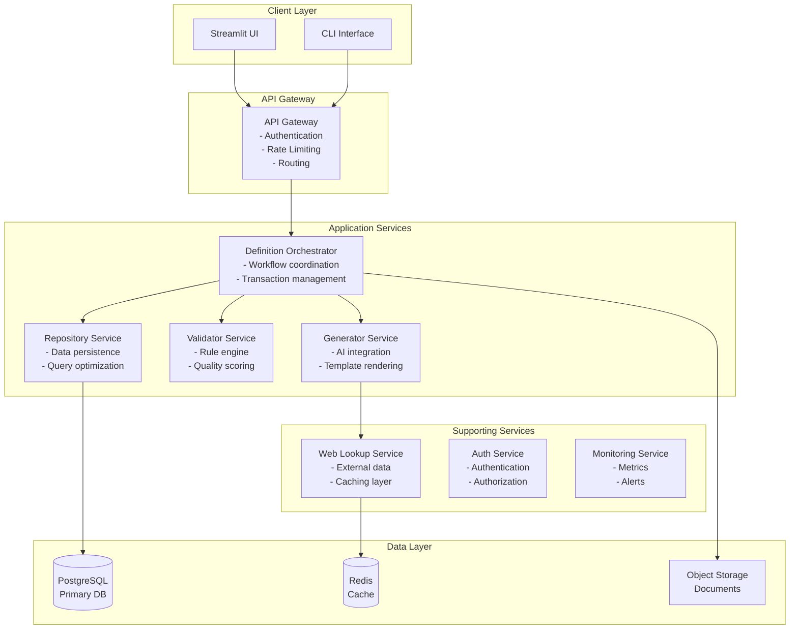

### 1.2 Service Responsibilities

| Service | Primary Responsibility | Key Features |
|---------|----------------------|--------------|
| **Orchestrator** | Workflow coordination | Transaction management, saga pattern, retry logic |
| **Generator** | Definition creation | AI integration, template engine, context enhancement |
| **Validator** | Quality assurance | Rule engine, scoring system, feedback generation |
| **Repository** | Data management | CRUD operations, query optimization, migrations |
| **Web Lookup** | External data | Multi-source lookup, caching, rate limiting |
| **Auth Service** | Security | JWT tokens, RBAC, API key management |
| **Monitoring** | Observability | Metrics, logging, tracing, alerting |

## 2. Data Architecture

### 2.1 Data Flow

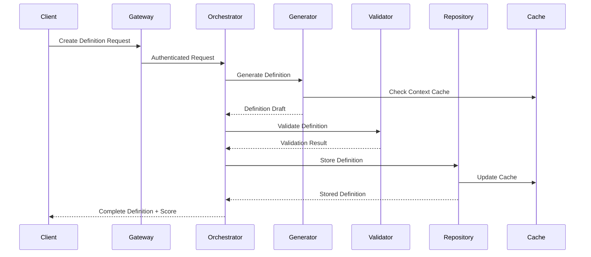

### 2.2 Database Schema

```sql
-- Core Tables
CREATE TABLE definitions (
    id UUID PRIMARY KEY,
    begrip VARCHAR(255) NOT NULL,
    definitie TEXT NOT NULL,
    category VARCHAR(50),
    context_org VARCHAR(255),
    context_legal TEXT,
    validation_score DECIMAL(3,2),
    version INTEGER DEFAULT 1,
    created_at TIMESTAMP WITH TIME ZONE,
    updated_at TIMESTAMP WITH TIME ZONE
);

CREATE TABLE validation_rules (
    id UUID PRIMARY KEY,
    rule_code VARCHAR(20) UNIQUE,
    category VARCHAR(50),
    severity VARCHAR(20),
    pattern TEXT,
    config JSONB,
    active BOOLEAN DEFAULT true
);

CREATE TABLE generation_history (
    id UUID PRIMARY KEY,
    definition_id UUID REFERENCES definitions(id),
    iteration INTEGER,
    prompt TEXT,
    response TEXT,
    metadata JSONB,
    created_at TIMESTAMP WITH TIME ZONE
);

-- Indexes for performance
CREATE INDEX idx_definitions_begrip ON definitions(begrip);
CREATE INDEX idx_definitions_category ON definitions(category);
CREATE INDEX idx_validation_rules_active ON validation_rules(active, category);
```

### 2.3 Caching Strategy

| Cache Layer | Technology | TTL | Use Case |
|-------------|-----------|-----|----------|
| L1 - Memory | In-process | 5 min | Hot paths, active sessions |
| L2 - Redis | Redis Cluster | 1 hour | Shared data, session state |
| L3 - CDN | CloudFront | 24 hours | Static assets, exports |

## 3. API Architecture

### 3.1 RESTful API Design

```yaml
openapi: 3.0.0
info:
  title: Definitie App API
  version: 1.0.0

paths:
  /api/v1/definitions:
    post:
      summary: Create new definition
      requestBody:
        content:
          application/json:
            schema:
              type: object
              required: [begrip, category]
              properties:
                begrip:
                  type: string
                category:
                  type: string
                  enum: [type, proces, resultaat, exemplaar]
                context:
                  type: object
                  properties:
                    organizational:
                      type: string
                    legal:
                      type: string
    get:
      summary: List definitions
      parameters:
        - name: category
          in: query
          schema:
            type: string
        - name: search
          in: query
          schema:
            type: string

  /api/v1/definitions/{id}:
    get:
      summary: Get definition details
    put:
      summary: Update definition
    delete:
      summary: Delete definition

  /api/v1/validate:
    post:
      summary: Validate definition text

  /api/v1/health:
    get:
      summary: Health check endpoint
```

### 3.2 Authentication & Authorization

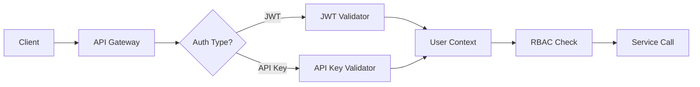

**Authorization Matrix:**

| Role | Create | Read | Update | Delete | Admin |
|------|--------|------|--------|--------|-------|
| Anonymous | ❌ | ✅ | ❌ | ❌ | ❌ |
| User | ✅ | ✅ | Own | ❌ | ❌ |
| Editor | ✅ | ✅ | ✅ | ❌ | ❌ |
| Admin | ✅ | ✅ | ✅ | ✅ | ✅ |

## 4. Deployment Architecture

### 4.1 Container Strategy

```yaml
# docker-compose.yml
version: '3.8'
services:
  gateway:
    image: definitie-app/gateway:latest
    ports:
      - "8080:8080"
    environment:
      - SERVICE_DISCOVERY_URL=http://consul:8500

  orchestrator:
    image: definitie-app/orchestrator:latest
    deploy:
      replicas: 3
    environment:
      - DB_CONNECTION_STRING=${DB_CONNECTION}

  generator:
    image: definitie-app/generator:latest
    deploy:
      replicas: 2
    environment:
      - AI_API_KEY=${AI_API_KEY}

  validator:
    image: definitie-app/validator:latest
    deploy:
      replicas: 2

  repository:
    image: definitie-app/repository:latest
    deploy:
      replicas: 2

  postgres:
    image: postgres:15
    volumes:
      - postgres_data:/var/lib/postgresql/data

  redis:
    image: redis:7-alpine
    deploy:
      replicas: 3
```

### 4.2 Kubernetes Architecture

```yaml
# Deployment example
apiVersion: apps/v1
kind: Deployment
metadata:
  name: definitie-orchestrator
spec:
  replicas: 3
  selector:
    matchLabels:
      app: orchestrator
  template:
    metadata:
      labels:
        app: orchestrator
    spec:
      containers:
      - name: orchestrator
        image: definitie-app/orchestrator:latest
        resources:
          requests:
            memory: "256Mi"
            cpu: "250m"
          limits:
            memory: "512Mi"
            cpu: "500m"
        livenessProbe:
          httpGet:
            path: /health
            port: 8080
        readinessProbe:
          httpGet:
            path: /ready
            port: 8080
```

### 4.3 Scaling Strategy

| Component | Min Instances | Max Instances | Scaling Metric |
|-----------|--------------|---------------|----------------|
| Gateway | 2 | 5 | CPU > 70% |
| Orchestrator | 3 | 10 | Request queue > 100 |
| Generator | 2 | 8 | Response time > 3s |
| Validator | 2 | 6 | CPU > 80% |
| Repository | 2 | 4 | Connection pool > 80% |

## 5. Security Architecture

### 5.1 Security Layers

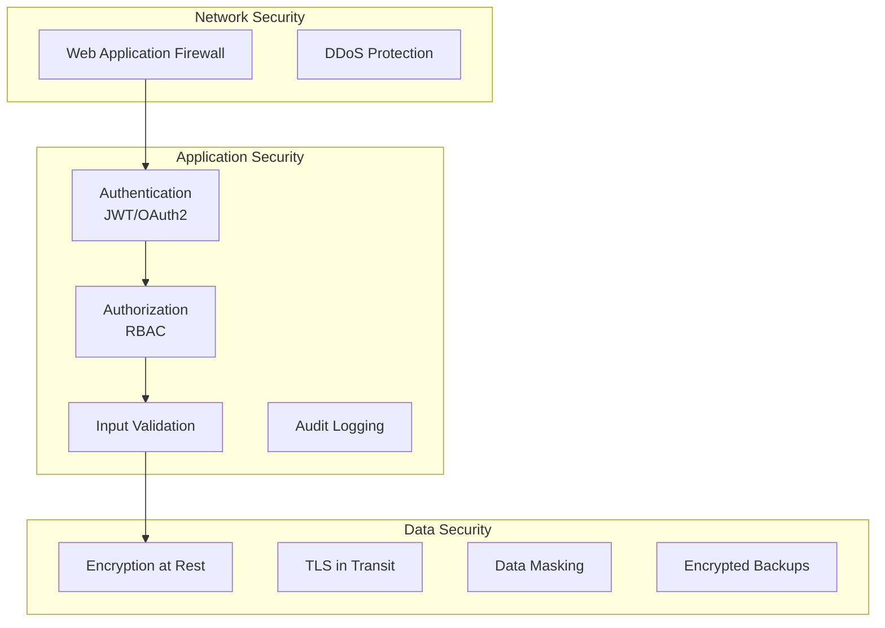

### 5.2 Security Controls

| Control | Implementation | Priority |
|---------|---------------|----------|
| **Authentication** | JWT with refresh tokens | High |
| **Authorization** | Role-based access control | High |
| **Encryption** | AES-256 at rest, TLS 1.3 in transit | High |
| **Input Validation** | Schema validation, sanitization | High |
| **Rate Limiting** | Token bucket algorithm | Medium |
| **Audit Logging** | Centralized, immutable logs | Medium |
| **Secret Management** | HashiCorp Vault | High |
| **Vulnerability Scanning** | Weekly automated scans | Medium |

### 5.3 Compliance Requirements

- **GDPR**: Personal data handling, right to deletion
- **SOC2**: Access controls, audit trails
- **ISO 27001**: Information security management

## 6. Performance & Monitoring

### 6.1 Performance Requirements

| Metric | Target | Current | Strategy |
|--------|--------|---------|----------|
| Response Time (p95) | < 2s | 8-12s | Caching, async processing |
| Throughput | 1000 req/s | 50 req/s | Horizontal scaling |
| Availability | 99.9% | 95% | HA deployment |
| Error Rate | < 0.1% | 2% | Better error handling |

### 6.2 Monitoring Stack

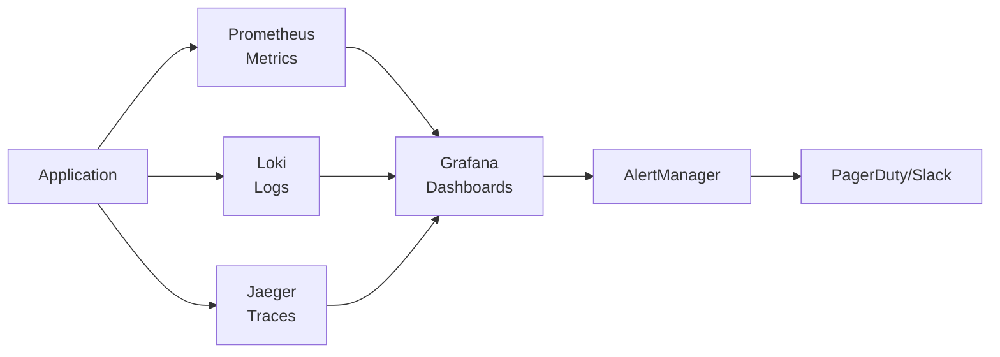

### 6.3 Key Metrics

**Application Metrics:**
- Request rate, error rate, duration (RED)
- Active users, definitions created, validation scores
- Cache hit rate, database query time
- AI API response time, token usage

**Infrastructure Metrics:**
- CPU, memory, disk usage
- Network throughput, latency
- Container health, restart count
- Database connections, query performance

## 7. Integration Patterns

### 7.1 Event-Driven Architecture

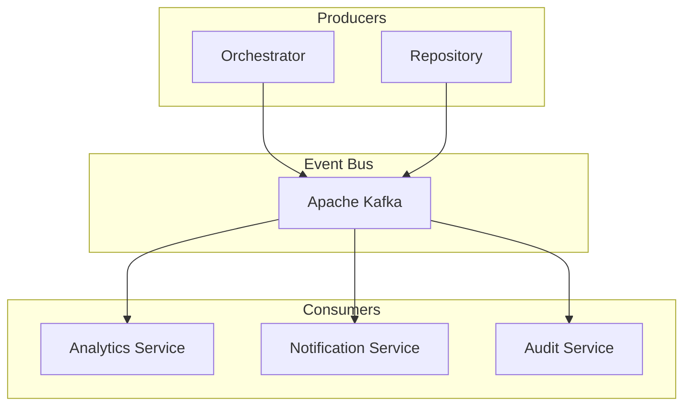

**Key Events:**
- DefinitionCreated
- DefinitionValidated
- DefinitionUpdated
- ValidationRuleChanged
- UserActionPerformed

### 7.2 External Integrations

| System | Integration Type | Purpose | Security |
|--------|-----------------|---------|----------|
| OpenAI API | REST API | AI generation | API key, rate limiting |
| External DBs | JDBC/ODBC | Legacy data | VPN, encrypted connection |
| Document Storage | S3 API | File storage | IAM roles, encryption |
| Email Service | SMTP/API | Notifications | TLS, authentication |
| Analytics | Webhook | Usage tracking | HMAC signatures |

## 8. Development & Testing

### 8.1 Development Environment

```bash
# Local development setup
docker-compose -f docker-compose.dev.yml up
# Includes: Local DB, Redis, Mock services

# Environment variables
cp .env.example .env.local
# Configure: API keys, DB connections, feature flags
```

### 8.2 Testing Strategy

| Test Type | Coverage Target | Tools | Frequency |
|-----------|----------------|-------|-----------|
| Unit Tests | 80% | pytest, unittest | On commit |
| Integration Tests | 70% | pytest, testcontainers | On PR |
| E2E Tests | Critical paths | Selenium, Cypress | Daily |
| Performance Tests | Key endpoints | Locust, K6 | Weekly |
| Security Tests | OWASP Top 10 | OWASP ZAP | Monthly |

### 8.3 CI/CD Pipeline

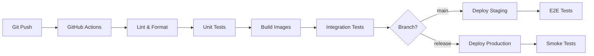

## 9. Migration Strategy

### 9.1 Phased Approach

**Phase 1: Foundation (Q1 2024)**
- ✅ Service extraction
- ✅ Interface definitions
- ⬜ API gateway setup
- ⬜ Basic monitoring

**Phase 2: Core Services (Q2 2024)**
- ⬜ PostgreSQL migration
- ⬜ Authentication service
- ⬜ Container deployment
- ⬜ Integration tests

**Phase 3: Advanced Features (Q3 2024)**
- ⬜ Event bus implementation
- ⬜ Advanced caching
- ⬜ Performance optimization
- ⬜ Security hardening

**Phase 4: Production Ready (Q4 2024)**
- ⬜ Full monitoring stack
- ⬜ Disaster recovery
- ⬜ Documentation complete
- ⬜ Team training

### 9.2 Risk Mitigation

| Risk | Impact | Mitigation |
|------|--------|------------|
| Data migration failure | High | Parallel run, rollback plan |
| Performance degradation | Medium | Gradual rollout, monitoring |
| Security vulnerabilities | High | Security reviews, pen testing |
| Team knowledge gaps | Medium | Training, documentation |

### 9.3 Pragmatic Timeline Adjustment

**Realistic Phasing (Extended Timeline):**

**Phase 0: Foundation Stabilization (Q1 2024)**
- Complete service extraction (90% done)
- Fix critical bugs in current system
- Establish CI/CD pipeline
- Team training on new architecture

**Phase 1: API Layer (Q2 2024)**
- Implement API Gateway
- Create OpenAPI specifications
- Add authentication (JWT)
- Basic monitoring setup

**Phase 2: Core Migration (Q3-Q4 2024)**
- PostgreSQL migration (with parallel run)
- Container deployment (Docker first)
- Enhanced validation engine
- Performance optimizations

**Phase 3: Advanced Features (Q1-Q2 2025)**
- Event bus (start simple - Redis pub/sub)
- Advanced caching strategies
- Kubernetes migration
- Full observability stack

**Phase 4: Production Excellence (Q3 2025)**
- Security hardening
- Disaster recovery
- Advanced monitoring
- Performance tuning

**Critical Success Factors:**
- Start with Docker Compose, migrate to K8s later
- Use Redis pub/sub before Kafka
- Implement basic auth before complex RBAC
- Focus on core functionality first

## 10. Success Criteria

### 10.1 Technical Metrics
- Response time < 2s (p95)
- Availability > 99.9%
- Test coverage > 80%
- Zero critical security issues

### 10.2 Business Metrics
- User satisfaction > 90%
- Definition quality score > 85%
- Time to create definition < 30s
- Support tickets < 10/month

### 10.3 Operational Metrics
- Deployment frequency > 2/week
- Lead time < 2 days
- MTTR < 30 minutes
- Change failure rate < 5%

## 11. Frontend Architecture

### 11.1 UI Evolution Strategy

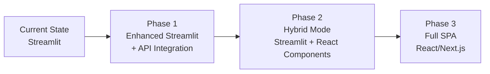

**Phase 1: Enhanced Streamlit (Q1 2024)**
- Add REST API consumption
- Implement session management
- Create reusable components
- Add proper error handling

**Phase 2: Hybrid Approach (Q2-Q3 2024)**
- Embed React components in Streamlit
- Gradual feature migration
- Shared state management
- API-first development

**Phase 3: Full SPA Migration (Q4 2024+)**
- Complete React/Next.js application
- Server-side rendering for SEO
- Progressive Web App features
- Offline capability

### 11.2 Component Architecture

```typescript
// Design System Structure
design-system/
├── tokens/
│   ├── colors.ts
│   ├── typography.ts
│   └── spacing.ts
├── components/
│   ├── atoms/        // Button, Input, Label
│   ├── molecules/    // FormField, Card, Alert
│   ├── organisms/    // DefinitionForm, ValidationResults
│   └── templates/    // PageLayout, DashboardLayout
└── patterns/
    ├── forms/
    ├── navigation/
    └── data-display/
```

### 11.3 Accessibility Standards

| Requirement | Standard | Implementation |
|------------|----------|----------------|
| **WCAG Compliance** | WCAG 2.1 AA | Automated testing with axe-core |
| **Keyboard Navigation** | Full support | Focus management, skip links |
| **Screen Readers** | NVDA, JAWS | ARIA labels, semantic HTML |
| **Color Contrast** | 4.5:1 minimum | Design token enforcement |
| **Responsive Design** | Mobile-first | Breakpoint system |

## 12. AI Service Architecture

### 12.1 Prompt Engineering Framework

```python
# Prompt versioning and management
class PromptTemplate:
    version: str = "1.0.0"
    template: str
    variables: List[str]
    model_constraints: Dict[str, Any]

    def render(self, context: Dict[str, Any]) -> str:
        # Variable substitution with validation
        pass

# A/B Testing for prompts
class PromptExperiment:
    control: PromptTemplate
    variants: List[PromptTemplate]
    metrics: List[str] = ["quality_score", "generation_time", "token_usage"]

    def select_variant(self, user_context: Dict) -> PromptTemplate:
        # Feature flag based selection
        pass
```

### 12.2 AI Cost Optimization

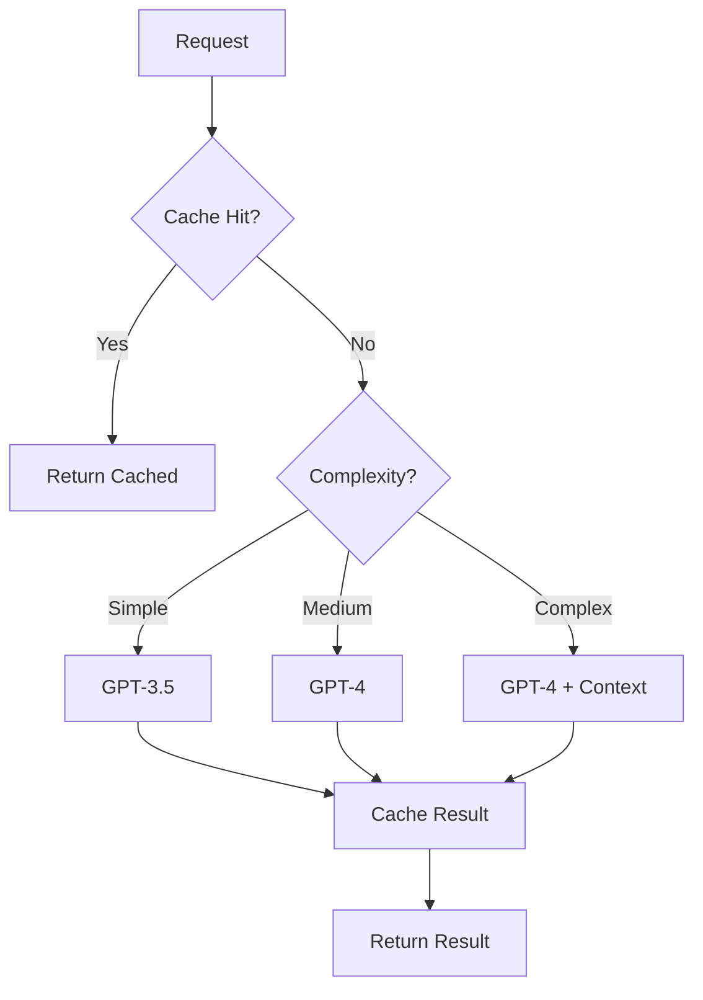

**Cost Control Strategies:**
- Semantic caching with embeddings
- Request batching for bulk operations
- Model selection based on complexity
- Token usage monitoring and alerts
- Fallback to cheaper models on budget limits

### 12.3 AI Service Resilience

```yaml
ai_service_config:
  primary_provider: openai
  fallback_providers:
    - anthropic
    - cohere

  retry_strategy:
    max_retries: 3
    backoff_multiplier: 2
    timeout_seconds: 30

  circuit_breaker:
    failure_threshold: 5
    recovery_timeout: 60
    half_open_requests: 3

  rate_limiting:
    requests_per_minute: 60
    tokens_per_minute: 90000
    concurrent_requests: 10
```

## 13. Data Privacy & Compliance

### 13.1 Data Classification

| Data Type | Classification | Retention | Encryption | Access |
|-----------|---------------|-----------|------------|--------|
| **User Credentials** | Confidential | Until deletion | AES-256 + BCrypt | Auth Service only |
| **Definitions** | Internal | 2 years active, 5 archive | AES-256 | Authorized users |
| **Audit Logs** | Restricted | 7 years | AES-256 | Admins only |
| **Analytics** | Internal | 1 year | TLS only | Analytics team |
| **PII** | Confidential | Per GDPR | AES-256 + masking | Need-to-know |

### 13.2 GDPR Implementation

```python
# Data Subject Rights Implementation
class GDPRService:
    async def export_user_data(self, user_id: str) -> Dict:
        """Right to data portability"""
        pass

    async def delete_user_data(self, user_id: str) -> bool:
        """Right to erasure (forget)"""
        pass

    async def restrict_processing(self, user_id: str, scope: List[str]) -> bool:
        """Right to restrict processing"""
        pass

    async def get_consent_status(self, user_id: str) -> Dict:
        """Consent management"""
        pass
```

### 13.3 Audit Trail Requirements

```sql
CREATE TABLE audit_log (
    id UUID PRIMARY KEY,
    timestamp TIMESTAMP WITH TIME ZONE NOT NULL,
    user_id UUID,
    action VARCHAR(100) NOT NULL,
    resource_type VARCHAR(50),
    resource_id UUID,
    changes JSONB,
    ip_address INET,
    user_agent TEXT,
    success BOOLEAN,
    error_message TEXT,
    -- Immutability via trigger
    created_at TIMESTAMP WITH TIME ZONE DEFAULT NOW()
);

-- Partitioning for performance
CREATE TABLE audit_log_2024_q1 PARTITION OF audit_log
FOR VALUES FROM ('2024-01-01') TO ('2024-04-01');
```

## 14. Development Experience

### 14.1 Local Development Setup

```bash
# One-command local setup
make dev-setup

# What it does:
# 1. Checks prerequisites (Docker, Python, Node)
# 2. Creates local SSL certificates
# 3. Sets up local databases with test data
# 4. Configures service discovery
# 5. Starts all services with hot-reload
# 6. Opens browser with service dashboard
```

### 14.2 Debugging Microservices

```yaml
# Local debugging configuration
services:
  orchestrator:
    environment:
      - DEBUG=true
      - LOG_LEVEL=debug
      - TRACING_ENABLED=true
      - JAEGER_ENDPOINT=http://localhost:16686
    ports:
      - "5678:5678"  # Python debugger
    volumes:
      - ./src:/app/src  # Hot reload
```

**Debug Tools Integration:**
- Distributed tracing with Jaeger
- Centralized logging with Loki
- Service mesh visualization
- Request replay capability
- Time-travel debugging

### 14.3 Feature Flag System

```python
# Feature flag implementation
class FeatureFlags:
    flags = {
        "new_validation_engine": {
            "enabled": True,
            "rollout_percentage": 50,
            "whitelist_users": ["beta_testers"],
            "blacklist_users": [],
        },
        "ai_model_gpt4": {
            "enabled": False,
            "rollout_percentage": 0,
            "enable_date": "2024-02-01",
        }
    }

    def is_enabled(self, flag: str, user_context: Dict) -> bool:
        # Evaluation logic with user context
        pass
```

### 14.4 Developer Productivity

| Tool/Practice | Purpose | Implementation |
|--------------|---------|----------------|
| **Hot Reload** | Instant feedback | Watchdog + importlib |
| **Mock Services** | Offline development | WireMock for external APIs |
| **Dev Portal** | Service discovery | Local dashboard at :8080 |
| **Code Generation** | Reduce boilerplate | OpenAPI → Python/TS |
| **Git Hooks** | Quality gates | pre-commit with linting |
| **VS Code Config** | Consistent setup | .vscode with debugger config |

## 15. Cost Management

### 15.1 Service Cost Projections

| Service | Monthly Base | Per 1K Requests | Scale Factor |
|---------|-------------|-----------------|--------------|
| **API Gateway** | $50 | $0.10 | Linear |
| **Compute (K8s)** | $200 | $0.50 | Step function |
| **Database** | $100 | $0.20 | Linear |
| **Redis Cache** | $50 | $0.05 | Linear |
| **AI API (GPT-3.5)** | $0 | $2.00 | Linear |
| **AI API (GPT-4)** | $0 | $20.00 | Linear |
| **Storage (S3)** | $10 | $0.02 | Linear |
| **Monitoring** | $100 | $0.10 | Tiered |

**Total Monthly (10K requests): ~$850**
**Total Monthly (100K requests): ~$3,500**

### 15.2 Cost Optimization Strategies

```python
# Intelligent model selection
def select_ai_model(request: GenerationRequest) -> str:
    complexity_score = calculate_complexity(request)
    budget_remaining = get_monthly_budget_remaining()

    if budget_remaining < 100:  # Emergency mode
        return "gpt-3.5-turbo"

    if complexity_score < 0.3:
        return "gpt-3.5-turbo"  # $0.002/1K tokens
    elif complexity_score < 0.7:
        return "gpt-3.5-turbo-16k"  # $0.003/1K tokens
    else:
        return "gpt-4"  # $0.03/1K tokens
```

### 15.3 Storage Growth Management

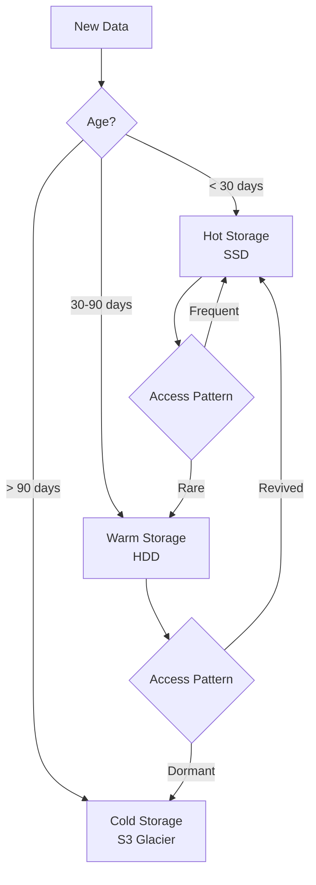

## 16. Operational Procedures

### 16.1 Incident Response Playbook

```markdown
# Severity Levels
- P1: Complete outage, data loss risk (Response: 15 min)
- P2: Major feature broken (Response: 1 hour)
- P3: Minor feature issue (Response: 4 hours)
- P4: Cosmetic issue (Response: Next business day)

# Incident Commander Checklist
1. [ ] Acknowledge incident
2. [ ] Assess severity
3. [ ] Start incident channel
4. [ ] Assign roles (IC, Comm, Tech)
5. [ ] Begin timer
6. [ ] Update status page
7. [ ] Execute runbook
8. [ ] Document timeline
9. [ ] Schedule postmortem
```

### 16.2 Feature Rollout Process

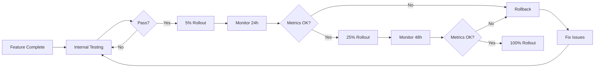

### 16.3 Rollback Procedures

```bash
# Automated rollback script
#!/bin/bash
# rollback.sh - Emergency rollback procedure

DEPLOYMENT=$1
NAMESPACE=${2:-production}

# 1. Capture current state
kubectl get deployment $DEPLOYMENT -n $NAMESPACE -o yaml > current_state.yaml

# 2. Rollback to previous version
kubectl rollout undo deployment/$DEPLOYMENT -n $NAMESPACE

# 3. Verify rollback
kubectl rollout status deployment/$DEPLOYMENT -n $NAMESPACE

# 4. Run smoke tests
./scripts/smoke_tests.sh $DEPLOYMENT

# 5. Update routing if needed
./scripts/update_routes.sh $DEPLOYMENT rollback

# 6. Notify team
./scripts/notify_rollback.sh $DEPLOYMENT
```

## Appendices

### A. Technology Stack

| Layer | Technology | Version | Rationale |
|-------|-----------|---------|-----------|
| Language | Python | 3.11+ | Team expertise, AI libraries |
| Framework | FastAPI | 0.104+ | Performance, async support |
| Database | PostgreSQL | 15+ | ACID, JSON support |
| Cache | Redis | 7+ | Performance, pub/sub |
| Message Bus | Kafka | 3.5+ | Scalability, durability |
| Container | Docker | 24+ | Standard, ecosystem |
| Orchestration | Kubernetes | 1.28+ | Scalability, resilience |
| Monitoring | Prometheus | 2.47+ | Cloud native, extensible |

### B. Reference Links

- API Documentation
- Database Migrations
- Security Policies
- Runbooks
- Architecture Decision Records

---

*Last Updated: 2024-01-18*
*Version: 1.1.0*
*Status: Updated - Comprehensive Architecture*

## Document History

| Version | Date | Author | Changes |
|---------|------|--------|---------|
| 1.0.0 | 2024-01-18 | Winston (Architect) | Initial target architecture |
| 1.1.0 | 2024-01-18 | Winston (Architect) | Added sections 11-16: Frontend, AI, Privacy, DevEx, Cost, Operations |

## Review Checklist

- [x] Component Architecture
- [x] Data Architecture
- [x] API Specifications
- [x] Security Architecture
- [x] Deployment Strategy
- [x] Frontend Architecture
- [x] AI Service Design
- [x] Privacy & Compliance
- [x] Developer Experience
- [x] Cost Projections
- [x] Operational Procedures
- [ ] Team Review
- [ ] Stakeholder Approval
