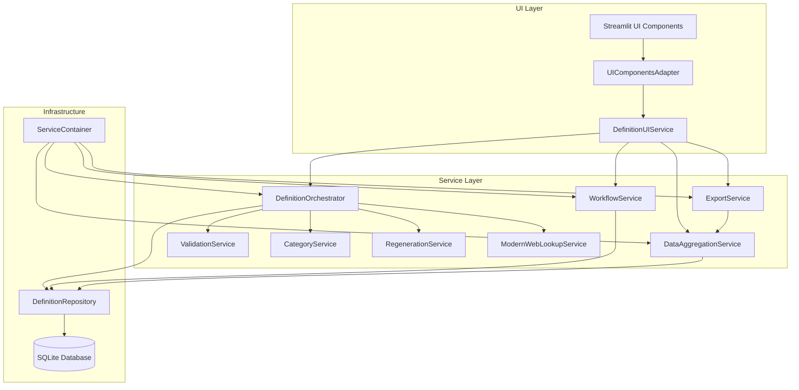

# Current Architecture Overview - DefinitieAgent

**Document Status**: Created 2025-08-26
**Purpose**: Accurate documentation of the current clean architecture implementation
**Replaces**: Legacy documentation referencing UnifiedDefinitionGenerator

## Executive Summary

DefinitieAgent has successfully completed its migration to a clean services architecture. The God Object (UnifiedDefinitionGenerator) has been fully replaced by a modular service architecture with DefinitionOrchestrator as the central orchestration service.

## Current Service Architecture

### Core Services



### Service Descriptions

#### 1. **DefinitionOrchestrator**
- **Purpose**: Central orchestration of definition generation workflow
- **Replaces**: UnifiedDefinitionGenerator (God Object)
- **Key Features**:
  - Coordinates generation, validation, and storage
  - Implements GVI (Generation-Validation-Integration) pattern
  - Clean interface-based design
  - Async operations support

#### 2. **WorkflowService**
- **Purpose**: Manages definition lifecycle states and transitions
- **Key Methods**:
  - `submit_for_review()`: Move definitions from DRAFT to REVIEW
  - `prepare_status_change()`: Handle state transitions
  - `validate_status_transition()`: Ensure valid state changes

#### 3. **DataAggregationService**
- **Purpose**: Aggregates data from multiple sources without UI dependencies
- **Key Achievement**: Eliminated session state dependencies
- **Key Features**:
  - Accepts UI data as parameters
  - Clean data collection from repository
  - Support for export data preparation

#### 4. **ExportService**
- **Purpose**: Handles multiple export formats (TXT, JSON, CSV)
- **Key Features**:
  - Format-agnostic export logic
  - Clean separation from UI
  - Works with DataAggregationService

#### 5. **CategoryService**
- **Purpose**: Manages category operations and state
- **Key Features**:
  - Category change handling
  - Regeneration support
  - Clean V2 interface

#### 6. **DefinitionUIService**
- **Purpose**: Facade service for all UI operations
- **Key Achievement**: Eliminates direct UI-to-repository communication
- **Benefits**:
  - Single point of entry for UI
  - Hides service complexity
  - Clean testability

#### 7. **ServiceContainer**
- **Purpose**: Dependency injection container
- **Key Features**:
  - Manages service lifecycles
  - Configuration management
  - Clean dependency resolution

### Adapter Pattern Implementation

The migration used adapter patterns for backward compatibility:

```python
# ServiceAdapter provides compatibility layer
class ServiceAdapter:
    def generate_definition(self, *args, **kwargs):
        # Translates old interface to new services
        return self.orchestrator.generate(*args, **kwargs)

# UIComponentsAdapter enables gradual UI migration
class UIComponentsAdapter:
    def adapt_component(self, component):
        # Wraps UI components with service integration
        return ServiceEnabledComponent(component)
```

### Key Architectural Achievements

#### 1. **Elimination of God Object**
- ✅ UnifiedDefinitionGenerator replaced by focused services
- ✅ Clear separation of concerns
- ✅ Each service has single responsibility

#### 2. **Session State Independence**
- ✅ Services accept data as parameters
- ✅ No SessionStateManager imports in services
- ✅ Clean testability without UI context

#### 3. **Repository Pattern**
- ✅ All database access via DefinitionRepository
- ✅ No direct SQL queries in services
- ✅ Clean data access abstraction

#### 4. **Dependency Injection**
- ✅ ServiceContainer manages all dependencies
- ✅ No hard-coded service instantiation
- ✅ Easy testing with mock services

#### 5. **Clean Interfaces**
- ✅ All major services implement interfaces
- ✅ Clear contracts between components
- ✅ Easy to extend and replace

## Migration Status

### Completed Phases ✅

1. **Phase 1-3: UI Migration**
   - All UI components use service layer
   - No direct database access from UI
   - Adapter pattern for compatibility

2. **Service Extraction**
   - Business logic moved to services
   - Clean service boundaries
   - Proper error handling

3. **Repository Cleanup**
   - Pure data access functions
   - No business logic in repository
   - Transaction support

### Deprecated Components

The following components are marked as deprecated:
- `unified_definition_generator.py.DEPRECATED`
- Direct imports of UnifiedDefinitionGenerator removed
- Legacy patterns eliminated

## Code Examples

### Using the New Architecture

```python
# Getting services via container
container = get_container()
orchestrator = container.get_definition_orchestrator()
workflow_service = container.get_workflow_service()

# Generating a definition
request = GenerationRequest(
    term="example",
    context="legal",
    additional_fields={}
)
response = await orchestrator.generate(request)

# Submitting for review
result = workflow_service.submit_for_review(
    definition_id=123,
    user="current_user",
    notes="Ready for review"
)
```

### Service Integration in UI

```python
# UI uses DefinitionUIService facade
ui_service = DefinitionUIService(
    repository=repository,
    workflow_service=workflow_service,
    export_service=export_service,
    data_aggregation_service=data_service
)

# Export operation
export_data = ui_service.prepare_export_data(
    definition_id=123,
    format=ExportFormat.JSON,
    additional_ui_data=session_data
)
```

## Benefits of Current Architecture

1. **Testability**: Services can be tested in isolation
2. **Maintainability**: Clear boundaries and responsibilities
3. **Scalability**: Easy to add new services or replace existing ones
4. **Flexibility**: Adapter pattern allows gradual migration
5. **Performance**: Reduced coupling improves efficiency

## Future Considerations

While the current architecture is clean and functional, consider:

1. **Async Consistency**: More services could benefit from async operations
2. **Event System**: Consider event-driven communication between services
3. **Caching Layer**: Add caching for frequently accessed data
4. **API Layer**: RESTful API using the service layer
5. **Monitoring**: Add comprehensive service monitoring

## Related Documentation

- **Migration Details**: See `/docs/LEGACY_CODE_MIGRATION_ROADMAP.md`
- **Implementation Guide**: See `/docs/architectuur/GVI-DETAILED-IMPLEMENTATION.md`
- **Solution Architecture**: See `/docs/architectuur/SOLUTION_ARCHITECTURE.md`
- **Session State Strategy**: See `/docs/architectuur/SESSION_STATE_ELIMINATION_STRATEGY.md`

## Archived Documentation

The following documents have been archived as they reference the old architecture:
- `SERVICES_DEPENDENCY_ANALYSIS.md` → `/docs/archief/2025-08-26-architecture-update/`
- `SERVICES_DEPENDENCY_GRAPH.md` → `/docs/archief/2025-08-26-architecture-update/`

## Conclusion

The DefinitieAgent has successfully transitioned from a monolithic God Object architecture to a clean, modular service architecture. This provides a solid foundation for future enhancements while maintaining backward compatibility through thoughtful adapter patterns.
---
canonical: true
status: active
owner: architecture
last_verified: 2025-09-02
applies_to: definitie-app@v2
---
