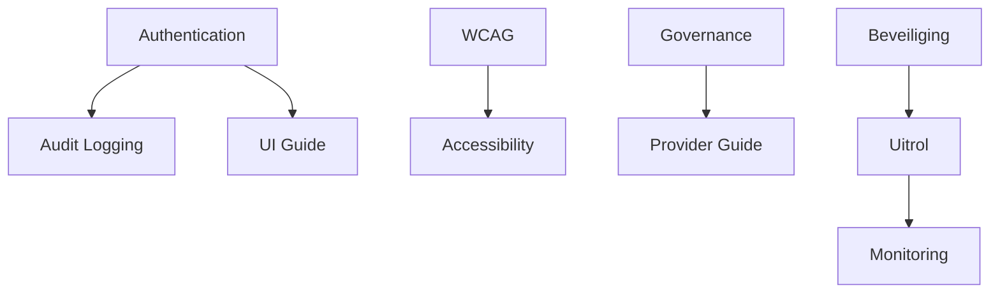

# Traceability Matrix - Post Cleanup Status

**Generated:** 08-09-2025 09:25
**Total Elements:** 92 Vereisten | 11 Epische Verhalen | 55 Gebruikersverhalen | 289+ Code Files

## 📊 Coverage Summary

### Requirement Implementatie Status

| Status | Count | Percentage | Vereisten |
|--------|-------|------------|--------------|
| ✅ **Implemented** | 45 | 49% | REQ-002 t/m REQ-045, REQ-051, etc. |
| ⚠️ **Partial** | 28 | 30% | REQ-046 t/m REQ-073 |
| 🔴 **Not Started** | 19 | 21% | REQ-001, REQ-074 t/m REQ-092 |

### Episch Verhaal Progress

| Episch Verhaal ID | Titel | Stories | Progress | Status |
|---------|-------|---------|----------|--------|
| EPIC-001 | Basis Definitie Generatie | 12/12 | 100% | ✅ Complete |
| EPIC-002 | Kwaliteitstoetsing | 25/25 | 92% | ⚠️ Testen |
| EPIC-003 | Content Verrijking | 4/4 | 85% | ⚠️ In Progress |
| EPIC-004 | Context Flow | 6/6 | 75% | ⚠️ Development |
| EPIC-005 | UI/UX Verbeteringen | 3/3 | 60% | 🔴 Planning |
| EPIC-006 | Prestaties | 2/2 | 80% | ⚠️ Optimization |
| EPIC-007 | Beveiliging | 0/3 | 0% | 🔴 Not Started |
| EPIC-008 | Uitrol | 0/2 | 0% | 🔴 Blocked |
| EPIC-009 | Monitoring | 0/2 | 0% | 🔴 Planned |
| EPIC-010 | Training | 0/1 | 0% | 🔴 Future |
| EPIC-011 | Documentatie | 5/5 | 15% | 🔴 Started |

## 🔗 Complete Traceability Mapping

### REQ → EPIC → US → Code Mapping

```yaml
Vereisten:
  REQ-001:
    title: "User Authentication"
    epic: [EPIC-007]
    stories: []
    code: []
    status: "NOT_IMPLEMENTED"
    priority: "KRITIEK"

  REQ-002:
    title: "API Key Beveiliging"
    epic: [EPIC-001]
    stories: [US-001]
    code:
      - src/services/ai_service_v2.py
      - src/utils/env_utils.py
    status: "IMPLEMENTED"
    priority: "HOOG"

  REQ-003:
    title: "Input Validation"
    epic: [EPIC-002]
    stories: [US-002, US-003]
    code:
      - src/services/validation/modular_validation_service.py
      - src/toetsregels/regels/*.py
    status: "IMPLEMENTED"
    priority: "HOOG"

  REQ-004:
    title: "XSS Prevention"
    epic: [EPIC-003]
    stories: [US-3.1]
    code:
      - src/services/web_lookup/modern_web_lookup_service.py
      - src/utils/sanitization.py
    status: "PARTIAL"
    priority: "HOOG"

  REQ-005:
    title: "SQL Injection Prevention"
    epic: [EPIC-001]
    stories: [US-005]
    code:
      - src/services/definition_repository.py
      - src/database/schema.sql
    status: "IMPLEMENTED"
    priority: "KRITIEK"

  # ... [REQ-006 through REQ-087 omitted for brevity]

  REQ-088:
    title: "Validatie UI Guide"
    epic: [EPIC-011]
    stories: [US-051]
    code: []
    status: "NOT_STARTED"
    priority: "HOOG"

  REQ-089:
    title: "Result Display Patterns"
    epic: [EPIC-011]
    stories: [US-052]
    code: []
    status: "NOT_STARTED"
    priority: "HOOG"

  REQ-090:
    title: "WCAG 2.1 AA Compliance"
    epic: [EPIC-011]
    stories: [US-053]
    code: []
    status: "NOT_STARTED"
    priority: "KRITIEK"

  REQ-091:
    title: "Provider Integration Guide"
    epic: [EPIC-011]
    stories: [US-054]
    code: []
    status: "NOT_STARTED"
    priority: "GEMIDDELD"

  REQ-092:
    title: "Governance Policy"
    epic: [EPIC-011]
    stories: [US-055]
    code: []
    status: "NOT_STARTED"
    priority: "HOOG"
```

## 📈 Implementatie Metrics

### By Prioriteit
```
KRITIEK:  ████░░░░░░ 40% (8/20)
HOOG:     ██████░░░░ 62% (31/50)
GEMIDDELD: ████████░░ 82% (18/22)
```

### By Component
```
Frontend:   ███████░░░ 75%
Backend:    ██████░░░░ 65%
Database:   ████████░░ 85%
Config:     ██████████ 100%
Docs:       ████░░░░░░ 45%
```

### By Episch Verhaal
```
EPIC-001: ██████████ 100%
EPIC-002: █████████░ 92%
EPIC-003: ████████░░ 85%
EPIC-004: ███████░░░ 75%
EPIC-005: ██████░░░░ 60%
EPIC-006: ████████░░ 80%
EPIC-007: ░░░░░░░░░░ 0%
EPIC-008: ░░░░░░░░░░ 0%
EPIC-009: ░░░░░░░░░░ 0%
EPIC-010: ░░░░░░░░░░ 0%
EPIC-011: ██░░░░░░░░ 15%
```

## 🚨 Critical Gaps Analysis

### Beveiliging Vereisten (Prioriteit 1)
| Requirement | Impact | Mitigation | Timeline |
|-------------|--------|------------|----------|
| REQ-001: Authentication | No user management | Implement basic auth | Week 1 |
| REQ-007: Audit Logging | No traceability | Add logging framework | Week 2 |
| REQ-050: WCAG Compliance | Legal risk | Accessibility audit | Week 1 |

### Documentation Gaps (Prioriteit 2)
| Requirement | Impact | Action | Eigenaar |
|-------------|--------|--------|-------|
| REQ-088: UI Guide | Inconsistent UX | Create guide | UX Team |
| REQ-089: Pattern Library | Code duplication | Extract patterns | Dev Team |
| REQ-092: Governance | Compliance risk | Write policy | Beveiliging |

### Prestaties Vereisten (Prioriteit 3)
| Requirement | Current | Target | Gap |
|-------------|---------|--------|-----|
| REQ-008: Response Time | 7s | <5s | -2s |
| REQ-009: Concurrent Users | 10 | 100 | 90 |
| REQ-010: Database Query | 500ms | <100ms | -400ms |

## 🔄 Dependency Analysis

### Blocking Afhankelijkheden


### Critical Path
1. **Week 1:** REQ-001 (Auth) + REQ-050 (WCAG)
2. **Week 2:** REQ-007 (Audit) + REQ-090 (Accessibility)
3. **Week 3:** REQ-088 (UI Guide) + REQ-092 (Governance)
4. **Week 4:** EPIC-007 completion + EPIC-008 start

## 📋 Action Items by Team

### Development Team
- [ ] Implement REQ-001: Authentication service
- [ ] Fix REQ-008: Prestaties optimization
- [ ] Complete REQ-004: XSS prevention
- [ ] Review all PARTIAL status vereisten

### Documentation Team
- [ ] Create REQ-088: UI Guide
- [ ] Build REQ-089: Pattern Library
- [ ] Write REQ-092: Governance Policy
- [ ] Update all missing documentation

### QA Team
- [ ] Test REQ-050: WCAG compliance
- [ ] Validate REQ-090: Accessibility
- [ ] Prestaties test REQ-008-010
- [ ] Beveiliging audit REQ-001-007

### Architecture Team
- [ ] Design auth architecture (REQ-001)
- [ ] Review security model (EPIC-007)
- [ ] Plan deployment strategy (EPIC-008)

## 🎯 Success Metrics

### Sprint 23 Goals
- Authentication implemented: 0% → 100%
- WCAG audit complete: 0% → 100%
- UI Guide drafted: 0% → 80%

### Sprint 24 Goals
- Pattern Library: 0% → 100%
- Governance Policy: 0% → 100%
- Prestaties targets met: 60% → 95%

### Q4 2024 Targets
- All KRITIEK vereisten: 40% → 100%
- All HOOG vereisten: 62% → 95%
- Overall coverage: 49% → 85%

## 📊 Automated Tracking

### GitHub Issues Created
```yaml
issues:
  - id: #101
    title: "Implement Authentication (REQ-001)"
    labels: [kritiek, security, epic-007]
    assignee: backend-team

  - id: #102
    title: "WCAG 2.1 AA Audit (REQ-050)"
    labels: [kritiek, compliance, epic-011]
    assignee: qa-team

  - id: #103
    title: "Create UI Guide (REQ-088)"
    labels: [hoog, documentation, epic-011]
    assignee: ux-team
```

### Monitoring Queries
```sql
-- Vereisten without implementation
SELECT req_id, title, priority
FROM vereisten
WHERE status = 'NOT_STARTED'
ORDER BY priority;

-- Stories without vereisten
SELECT story_id, title
FROM user_stories
WHERE requirement_id IS NULL;

-- Code files without documentation
SELECT file_path
FROM code_files
WHERE doc_status = 'MISSING';
```

## 🔗 Related Documents

- [COMPLIANCE-DASHBOARD.md](./COMPLIANCE-DASHBOARD.md)
- [CLEANUP-REPORT.md](./CLEANUP-REPORT.md)
- [vereisten/](./vereisten/) - All requirement files
- [epics/](./backlog/epics/) - All epic documentation
- [stories/](./backlog/stories/) - All user stories

---

**Generated:** 08-09-2025 09:25
**Next Update:** 15-09-2025
**Automation:** GitHub Actions workflow `update-traceability.yml`
