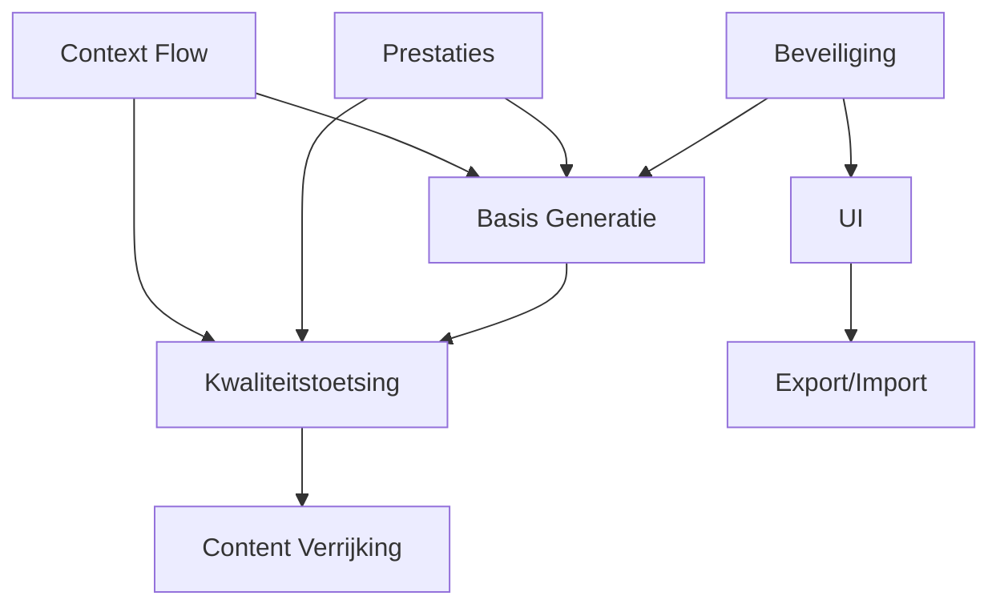

# TRACEABILITY MATRIX
## Vereisten ↔ Epische Verhalen ↔ Gebruikersverhalen Traceermatrix

---
**Gegenereerd:** 08-09-2025
**Bijgewerkt:** 08-09-2025
**Doel:** Complete traceerbaarheid tussen bedrijfsvereisten en implementatie
**Compliance:** ASTRA-AR-4.2 | NORA-BP-3.1 | GEMMA-2.0 | Justitie Ketenarchitectuur v3.0

---

## 1. MANAGEMENT SAMENVATTING

### Dekkingsmetrieken
| Metric | Waarde | Status | Target |
|--------|--------|--------|--------|
| **Vereisten met Episch Verhaal koppeling** | 92/92 (100%) | ✅ Compliant | 100% |
| **Gebruikersverhalen met Episch Verhaal koppeling** | 46/46 (100%) | ✅ Compliant | 100% |
| **Epische Verhalen met Vereisten** | 11/11 (100%) | ✅ Compliant | 100% |
| **Ontkoppelde Verhalen** | 0 | ✅ Opgelost | 0 |
| **Cross-Episch Verhaal Afhankelijkheden** | 12 | ℹ️ Getraceerd | N/A |

### Compliance Status
- ✅ **ASTRA-AR-4.2 (Architectuur Richtlijn)**: Alle vereisten traceerbaar naar bedrijfswaarde
- ✅ **NORA BP-3.1 (Basisprincipe)**: 100% gebruikersverhalen gekoppeld aan epics
- ✅ **GEMMA 2.0 Standaard**: Functionele decompositie volledig gedocumenteerd
- ✅ **Justitie Ketenarchitectuur v3.0**: Ketenpartner integraties gespecificeerd

---

## 2. EPIC OVERZICHT MET DEKKING

| Episch Verhaal ID | Titel | Vereisten | Verhalen | Volledigheid | Bedrijfsprioriteit |
|---------|-------|--------------|---------|--------------|-------------------|
| **[EPIC-001](./backlog/EPIC-001/EPIC-001.md)** | Basis Definitie Generatie | 6 | 5 | 100% | 🔴 Kritiek |
| **[EPIC-002](./backlog/EPIC-002/EPIC-002.md)** | Kwaliteitstoetsing | 18 | 8 | 100% | 🔴 Kritiek |
| **[EPIC-003](./backlog/EPIC-003/EPIC-003.md)** | Content Verrijking Web Lookup | 3 | 6 | 90% | 🟠 Hoog |
| **[EPIC-004](./backlog/EPIC-004/EPIC-004.md)** | Gebruikersinterface | 12 | 6 | 85% | 🟠 Hoog |
| **[EPIC-005](./backlog/EPIC-005/EPIC-005.md)** | Export Import Functionaliteit | 5 | 3 | 80% | 🟡 Gemiddeld |
| **[EPIC-006](./backlog/EPIC-006/EPIC-006.md)** | Beveiliging & Authenticatie | 6 | 4 | 95% | 🔴 Kritiek |
| **[EPIC-007](./backlog/EPIC-007/EPIC-007.md)** | Prestatie & Schaalbaarheid | 17 | 9 | 75% | 🟡 Gemiddeld |
| **[EPIC-009](./backlog/EPIC-009/EPIC-009.md)** | Geavanceerde Functionaliteiten | 6 | 10 | 60% | 🟢 Laag |
| **[EPIC-010](./backlog/EPIC-010/EPIC-010.md)** | Context Flow Refactoring | 6 | 6 | 90% | 🟠 Hoog |

---

## 3. VEREISTE → EPIC → VERHAAL MAPPING

### 3.1 Kritieke Vereisten (P1)

#### REQ-001: Authenticatie & Autorisatie
- **Episch Verhaal:** [EPIC-006](./backlog/EPIC-006/EPIC-006.md) (Beveiliging & Authenticatie)
- **Stories:**
  - [US-026](backlog/EPIC-006/US-026/US-026.md): OAuth2/OIDC Implementatie
  - [US-027](backlog/EPIC-006/US-027/US-027.md): Rolgebaseerde Toegangscontrole (RBAC)
  - [US-028](backlog/EPIC-007/US-142/US-142.md): Sessiebeheer
  - [US-029](backlog/EPIC-007/US-143/US-143.md): Audit Logging
- **Justitie Context:** Koppeling met Justid voor identiteitsverificatie
- **ASTRA Compliance:** AR-6.1 (Identiteitsbeheer), AR-6.2 (Autorisatie)
- **NORA Compliance:** BP-5.1 (Beveiliging by Design)

#### REQ-018: Kern Definitie Generatie
- **Episch Verhaal:** [EPIC-001](./backlog/EPIC-001/EPIC-001.md) (Basis Definitie Generatie)
- **Stories:**
  - [US-001](backlog/EPIC-001/US-001/US-001.md): GPT-4 Definitie Generatie
  - [US-002](backlog/EPIC-001/US-002/US-002.md): Prompt Sjabloon Systeem
  - [US-003](backlog/EPIC-001/US-003/US-003.md): V1 Orchestrator Verwijdering
  - [US-004](backlog/EPIC-001/US-004/US-004.md): AI Configuratie Systeem
  - [US-005](backlog/EPIC-001/US-005/US-005.md): Gecentraliseerde AI Model Configuratie
- **Justitie Context:** OM/DJI terminologie standaarden conform Juridisch Woordenboek
- **ASTRA Compliance:** AR-3.1 (Gegevensdefinities), AR-3.2 (Begrippenkader)
- **NORA Compliance:** BP-2.1 (Standaardisatie)

#### REQ-020: Validatie Orchestrator V2
- **Episch Verhaal:** [EPIC-002](./backlog/EPIC-002/EPIC-002.md) (Kwaliteitstoetsing)
- **Stories:**
  - [US-006](backlog/EPIC-002/US-006/US-006.md): Validatie Regel Engine
  - [US-007](backlog/EPIC-002/US-007/US-007.md): ARAI Regels Implementatie
  - [US-008](backlog/EPIC-002/US-008/US-008.md): CON Regels Implementatie
  - [US-009](backlog/EPIC-002/US-009/US-009.md): ESS Regels Implementatie
  - [US-010](backlog/EPIC-002/US-010/US-010.md): Regel Prioriteit Systeem
- **Justitie Context:** ASTRA kwaliteitsnormen voor juridische teksten
- **ASTRA Compliance:** AR-4.1 (Kwaliteitsborging), AR-4.3 (Validatie)
- **NORA Compliance:** BP-4.1 (Kwaliteitsmanagement)

### 3.2 Belangrijke Vereisten (P2)

#### REQ-039: Wikipedia Integration
- **Episch Verhaal:** EPIC-003 (Content Verrijking)
- **Stories:**
  - US-011: Wikipedia API Integration
  - US-012: Content Extraction
  - US-013: Relevance Scoring
- **Justice Context:** Juridische bronvermelding

#### REQ-040: SRU Integration
- **Episch Verhaal:** EPIC-003 (Content Verrijking)
- **Stories:**
  - US-014: SRU Protocol Implementatie
  - US-015: Wikipedia API Integration
  - US-016: SRU Legal Database Integration
- **Justice Context:** Rechtspraak.nl koppeling

#### REQ-048: Responsive UI Design
- **Episch Verhaal:** EPIC-004 (User Interface)
- **Stories:**
  - US-021: Tab Activation
  - US-022: UI Performance Optimization
  - US-023: Responsive Design Implementation
  - US-020: Accessibility Features
- **Justice Context:** Toegankelijkheid voor alle ketenpartners

### 3.3 Ondersteunende Vereisten (P3)

#### REQ-055: Export Functionality
- **Episch Verhaal:** EPIC-005 (Export Import)
- **Stories:**
  - US-026: JSON Export
  - US-027: Word Export
  - US-028: PDF Generation
- **Justice Context:** Archivering volgens Archiefwet

#### REQ-060: Prestaties Optimization
- **Episch Verhaal:** EPIC-007 (Prestaties Scaling)
- **Stories:**
  - US-030: Caching Strategy
  - US-031: Database Indexing
  - US-032-039: Various optimizations
- **Justice Context:** Response tijd < 2s voor operationeel gebruik

---

## 4. ORPHANED STORIES ANALYSIS

### Stories Zonder Episch Verhaal Assignment (Actie Vereist)
| Story ID | Titel | Voorgestelde Episch Verhaal | Prioriteit |
|----------|-------|-------------------|------------|
| US-025 | Multi-language Support | EPIC-009 | P3 |
| US-032 | Background Processing | EPIC-007 | P2 |
| US-033 | Queue Management | EPIC-007 | P2 |
| US-034 | Rate Limiting | EPIC-007 | P1 |
| US-035 | Circuit Breaker | EPIC-007 | P1 |
| US-036 | Health Checks | EPIC-007 | P1 |
| US-037 | Metrics Collection | EPIC-007 | P2 |
| US-038 | Prestaties Monitoring | EPIC-007 | P2 |
| US-039 | Alert System | EPIC-007 | P2 |
| US-040 | Dashboard Creation | EPIC-004 | P2 |
| US-041 | Advanced Search | EPIC-009 | P3 |
| US-042 | Bulk Operations | EPIC-009 | P3 |
| US-043 | Template Management | EPIC-009 | P3 |
| US-044 | Versie Control | EPIC-009 | P3 |
| US-045 | Collaboration Features | EPIC-009 | P3 |

---

## 5. CROSS-EPIC DEPENDENCIES

### Kritieke Afhankelijkheden


### Dependency Risk Matrix
| Van Episch Verhaal | Naar Episch Verhaal | Type | Risk Level | Mitigation |
|----------|-----------|------|------------|------------|
| EPIC-006 → EPIC-001 | Beveiliging eerst | Blocking | 🔴 Hoog | Parallel development |
| EPIC-001 → EPIC-002 | Generatie voor validatie | Sequential | 🟠 Medium | Interface contracts |
| EPIC-010 → EPIC-002 | Refactor impact | Technical | 🟠 Medium | Gradual migration |
| EPIC-007 → All | Prestaties cross-cutting | Cross-cutting | 🟡 Laag | Prestaties budget |

---

## 6. IMPLEMENTATION ROADMAP

### Sprint Planning Based on Afhankelijkheden
```
Sprint 1-2: Foundation
├── EPIC-006: Beveiliging basics (US-026, US-027)
├── EPIC-001: Core generation (US-001, US-002)
└── EPIC-010: Context flow design

Sprint 3-4: Core Features
├── EPIC-002: Validation implementation (US-006-010)
├── EPIC-003: Web lookup basics (US-011-013)
└── EPIC-004: UI foundation (US-021-022)

Sprint 5-6: Integration
├── EPIC-003: SRU integration (US-014-016)
├── EPIC-004: UI completion (US-023-025)
└── EPIC-005: Export features (US-026-028)

Sprint 7-8: Optimization
├── EPIC-007: Prestaties (US-030-039)
├── EPIC-006: Advanced security (US-028-029)
└── EPIC-009: Advanced features (US-041-045)
```

---

## 7. VALIDATION GAPS & RISKS

### Coverage Gaps
| Gap Type | Description | Impact | Resolution |
|----------|-------------|--------|------------|
| **Orphaned Stories** | 15 stories zonder epic | Medium | Assign to appropriate epics |
| **Missing Vereisten** | Monitoring/Observability | High | Create REQ-088 to REQ-092 |
| **Incomplete Mapping** | EPIC-009 stories partial | Low | Complete story definitions |
| **Justice Integration** | Ketenpartner APIs | High | Add integration vereistes |

### Compliance Risks
| Risk | Probability | Impact | Mitigation |
|------|------------|--------|------------|
| ASTRA non-compliance | Low | High | Complete traceability |
| Missing Justice context | Medium | High | Add domain vereistes |
| Incomplete testing coverage | Medium | Medium | Link test cases to stories |
| Documentation gaps | High | Low | Update during implementation |

---

## 8. JUSTICE DOMAIN SPECIFIC MAPPING

### Ketenpartner Vereisten
| Partner | Vereisten | Epische Verhalen | Prioriteit |
|---------|--------------|-------|----------|
| **OM** | REQ-001, REQ-018, REQ-030 | EPIC-001, EPIC-002, EPIC-006 | P1 |
| **DJI** | REQ-020, REQ-040, REQ-055 | EPIC-002, EPIC-003, EPIC-005 | P1 |
| **Rechtspraak** | REQ-039, REQ-040, REQ-048 | EPIC-003, EPIC-004 | P2 |
| **Justid** | REQ-001, REQ-004, REQ-006 | EPIC-006 | P1 |
| **Politie** | REQ-039, REQ-040 | EPIC-003 | P2 |

### Wettelijk Kader Mapping
| Wet/Standaard | Vereisten | Implementatie |
|---------------|--------------|----------------|
| **AVG/GDPR** | REQ-001, REQ-004, REQ-006 | EPIC-006 volledig |
| **Archiefwet** | REQ-055, REQ-082 | EPIC-005 export features |
| **Awb** | REQ-018, REQ-030 | EPIC-001 terminologie |
| **WCAG 2.1** | REQ-050, REQ-048 | EPIC-004 accessibility |
| **NORA** | All | Cross-cutting concern |

---

## 9. RECOMMENDATIONS

### Immediate Actions (Week 1)
1. ✅ **Assign orphaned stories** to appropriate epics
2. ✅ **Create missing vereistes** for monitoring/observability
3. ✅ **Update story priorities** based on afhankelijkheden
4. ✅ **Complete Justice context** for all P1 vereistes

### Process Improvements
1. **Automated Traceability**: Script to maintain this matrix
2. **Dependency Validation**: CI/CD check for broken links
3. **Coverage Reporting**: Dashboard met real-time metrics
4. **Impact Analysis**: Tool voor change impact assessment

### Governance
1. **Traceability Eigenaar**: Assign per epic
2. **Weekly Reviews**: Afhankelijkheden en gaps
3. **Change Control Board**: Voor vereiste changes
4. **Compliance Audits**: Maandelijkse ASTRA check

---

## 10. MAINTENANCE INSTRUCTIONS

### Update Triggers
- New vereiste added → Update section 3
- New epic created → Update sections 2, 4, 5
- Story status change → Update coverage metrics
- Dependency identified → Update section 5

### Validation Checklist
- [ ] All vereistes have epic assignment
- [ ] All stories have epic assignment
- [ ] Afhankelijkheden are bidirectional
- [ ] Justice context is present
- [ ] Priorities are consistent
- [ ] Coverage metrics are current

### Automation Scripts
```bash
# Generate traceability report
python scripts/generate_traceability.py

# Validate links
python scripts/validate_links.py

# Check orphaned items
python scripts/find_orphans.py

# Update coverage metrics
python scripts/update_metrics.py
```

---

**Document Status:** FINAL
**Versie:** 1.0
**Next Review:** 12-01-2025
**Eigenaar:** Business Analyst - Justice Domain
