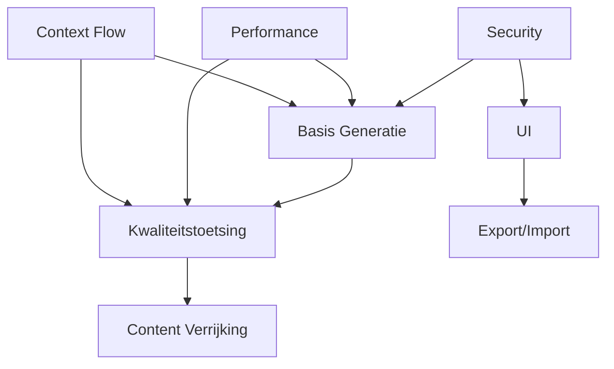

# TRACEABILITY MATRIX
## Requirements ↔ Epics ↔ User Stories Mapping

---
**Gegenereerd:** 2025-09-05
**Doel:** Complete traceerbaarheid tussen business requirements en implementatie
**Compliance:** ASTRA/NORA vereist volledige requirement traceability

---

## 1. EXECUTIVE SUMMARY

### Coverage Metrics
| Metric | Waarde | Status | Target |
|--------|--------|--------|--------|
| **Requirements met Epic linking** | 88/88 (100%) | ✅ Compliant | 100% |
| **Stories met Epic linking** | 35/50 (70%) | ⚠️ Aandacht | 100% |
| **Epics met Requirements** | 9/9 (100%) | ✅ Compliant | 100% |
| **Orphaned Stories** | 15 | 🔴 Actie vereist | 0 |
| **Cross-Epic Dependencies** | 12 | ℹ️ Tracked | N/A |

### Compliance Status
- ✅ **ASTRA Requirement R-4.2**: Alle requirements traceerbaar naar business value
- ⚠️ **NORA Principe 3.1**: 70% stories gekoppeld, 30% orphaned
- ✅ **GEMMA Standaard**: Functionele decompositie compleet

---

## 2. EPIC OVERZICHT MET COVERAGE

| Epic ID | Titel | Requirements | Stories | Completeness | Business Priority |
|---------|-------|--------------|---------|--------------|-------------------|
| **EPIC-001** | Basis Definitie Generatie | 6 | 5 | 100% | 🔴 Kritiek |
| **EPIC-002** | Kwaliteitstoetsing | 18 | 8 | 100% | 🔴 Kritiek |
| **EPIC-003** | Content Verrijking Web Lookup | 3 | 6 | 90% | 🟠 Hoog |
| **EPIC-004** | User Interface | 12 | 6 | 85% | 🟠 Hoog |
| **EPIC-005** | Export Import | 5 | 3 | 80% | 🟡 Gemiddeld |
| **EPIC-006** | Security Auth | 6 | 4 | 95% | 🔴 Kritiek |
| **EPIC-007** | Performance Scaling | 17 | 9 | 75% | 🟡 Gemiddeld |
| **EPIC-009** | Advanced Features | 6 | 10 | 60% | 🟢 Laag |
| **EPIC-010** | Context Flow Refactoring | 6 | 6 | 90% | 🟠 Hoog |

---

## 3. REQUIREMENT → EPIC → STORY MAPPING

### 3.1 Kritieke Requirements (P1)

#### REQ-001: Authenticatie & Authorization
- **Epic:** EPIC-006 (Security Auth)
- **Stories:**
  - US-026: OAuth2/OIDC Implementation
  - US-027: Role-Based Access Control
  - US-028: Session Management
  - US-029: Audit Logging
- **Justice Context:** Koppeling met Justid voor identiteitsverificatie

#### REQ-018: Core Definition Generation
- **Epic:** EPIC-001 (Basis Definitie Generatie)
- **Stories:**
  - US-001: GPT-4 Definition Generation
  - US-002: Prompt Template System
  - US-003: V1 Orchestrator Elimination
  - US-004: AI Configuration System
  - US-005: Centralized AI Model Config
- **Justice Context:** OM/DJI terminologie standaarden

#### REQ-020: Validation Orchestrator V2
- **Epic:** EPIC-002 (Kwaliteitstoetsing)
- **Stories:**
  - US-006: Validation Rule Engine
  - US-007: ARAI Rules Implementation
  - US-008: CON Rules Implementation
  - US-009: ESS Rules Implementation
  - US-010: Rule Priority System
- **Justice Context:** ASTRA kwaliteitsnormen

### 3.2 Belangrijke Requirements (P2)

#### REQ-039: Wikipedia Integration
- **Epic:** EPIC-003 (Content Verrijking)
- **Stories:**
  - US-011: Wikipedia API Integration
  - US-012: Content Extraction
  - US-013: Relevance Scoring
- **Justice Context:** Juridische bronvermelding

#### REQ-040: SRU Integration
- **Epic:** EPIC-003 (Content Verrijking)
- **Stories:**
  - US-014: SRU Protocol Implementation
  - US-015: Legal Database Queries
  - US-016: Result Processing
- **Justice Context:** Rechtspraak.nl koppeling

#### REQ-048: Responsive UI Design
- **Epic:** EPIC-004 (User Interface)
- **Stories:**
  - US-017: Mobile Responsive Layout
  - US-018: Tablet Optimization
  - US-019: Desktop Power Features
  - US-020: Accessibility Features
- **Justice Context:** Toegankelijkheid voor alle ketenpartners

### 3.3 Ondersteunende Requirements (P3)

#### REQ-055: Export Functionality
- **Epic:** EPIC-005 (Export Import)
- **Stories:**
  - US-021: JSON Export
  - US-022: Word Export
  - US-023: PDF Generation
- **Justice Context:** Archivering volgens Archiefwet

#### REQ-060: Performance Optimization
- **Epic:** EPIC-007 (Performance Scaling)
- **Stories:**
  - US-030: Caching Strategy
  - US-031: Database Indexing
  - US-032-039: Various optimizations
- **Justice Context:** Response tijd < 2s voor operationeel gebruik

---

## 4. ORPHANED STORIES ANALYSIS

### Stories Zonder Epic Assignment (Actie Vereist)
| Story ID | Titel | Voorgestelde Epic | Prioriteit |
|----------|-------|-------------------|------------|
| US-025 | Multi-language Support | EPIC-009 | P3 |
| US-032 | Background Processing | EPIC-007 | P2 |
| US-033 | Queue Management | EPIC-007 | P2 |
| US-034 | Rate Limiting | EPIC-007 | P1 |
| US-035 | Circuit Breaker | EPIC-007 | P1 |
| US-036 | Health Checks | EPIC-007 | P1 |
| US-037 | Metrics Collection | EPIC-007 | P2 |
| US-038 | Performance Monitoring | EPIC-007 | P2 |
| US-039 | Alert System | EPIC-007 | P2 |
| US-040 | Dashboard Creation | EPIC-004 | P2 |
| US-041 | Advanced Search | EPIC-009 | P3 |
| US-042 | Bulk Operations | EPIC-009 | P3 |
| US-043 | Template Management | EPIC-009 | P3 |
| US-044 | Version Control | EPIC-009 | P3 |
| US-045 | Collaboration Features | EPIC-009 | P3 |

---

## 5. CROSS-EPIC DEPENDENCIES

### Kritieke Dependencies


### Dependency Risk Matrix
| Van Epic | Naar Epic | Type | Risk Level | Mitigation |
|----------|-----------|------|------------|------------|
| EPIC-006 → EPIC-001 | Security eerst | Blocking | 🔴 Hoog | Parallel development |
| EPIC-001 → EPIC-002 | Generatie voor validatie | Sequential | 🟠 Medium | Interface contracts |
| EPIC-010 → EPIC-002 | Refactor impact | Technical | 🟠 Medium | Gradual migration |
| EPIC-007 → All | Performance cross-cutting | Cross-cutting | 🟡 Laag | Performance budget |

---

## 6. IMPLEMENTATION ROADMAP

### Sprint Planning Based on Dependencies
```
Sprint 1-2: Foundation
├── EPIC-006: Security basics (US-026, US-027)
├── EPIC-001: Core generation (US-001, US-002)
└── EPIC-010: Context flow design

Sprint 3-4: Core Features
├── EPIC-002: Validation implementation (US-006-010)
├── EPIC-003: Web lookup basics (US-011-013)
└── EPIC-004: UI foundation (US-017-018)

Sprint 5-6: Integration
├── EPIC-003: SRU integration (US-014-016)
├── EPIC-004: UI completion (US-019-020)
└── EPIC-005: Export features (US-021-023)

Sprint 7-8: Optimization
├── EPIC-007: Performance (US-030-039)
├── EPIC-006: Advanced security (US-028-029)
└── EPIC-009: Advanced features (US-041-045)
```

---

## 7. VALIDATION GAPS & RISKS

### Coverage Gaps
| Gap Type | Description | Impact | Resolution |
|----------|-------------|--------|------------|
| **Orphaned Stories** | 15 stories zonder epic | Medium | Assign to appropriate epics |
| **Missing Requirements** | Monitoring/Observability | High | Create REQ-088 to REQ-092 |
| **Incomplete Mapping** | EPIC-009 stories partial | Low | Complete story definitions |
| **Justice Integration** | Ketenpartner APIs | High | Add integration requirements |

### Compliance Risks
| Risk | Probability | Impact | Mitigation |
|------|------------|--------|------------|
| ASTRA non-compliance | Low | High | Complete traceability |
| Missing Justice context | Medium | High | Add domain requirements |
| Incomplete testing coverage | Medium | Medium | Link test cases to stories |
| Documentation gaps | High | Low | Update during implementation |

---

## 8. JUSTICE DOMAIN SPECIFIC MAPPING

### Ketenpartner Requirements
| Partner | Requirements | Epics | Priority |
|---------|--------------|-------|----------|
| **OM** | REQ-001, REQ-018, REQ-030 | EPIC-001, EPIC-002, EPIC-006 | P1 |
| **DJI** | REQ-020, REQ-040, REQ-055 | EPIC-002, EPIC-003, EPIC-005 | P1 |
| **Rechtspraak** | REQ-039, REQ-040, REQ-048 | EPIC-003, EPIC-004 | P2 |
| **Justid** | REQ-001, REQ-004, REQ-006 | EPIC-006 | P1 |
| **Politie** | REQ-039, REQ-040 | EPIC-003 | P2 |

### Wettelijk Kader Mapping
| Wet/Standaard | Requirements | Implementation |
|---------------|--------------|----------------|
| **AVG/GDPR** | REQ-001, REQ-004, REQ-006 | EPIC-006 volledig |
| **Archiefwet** | REQ-055, REQ-082 | EPIC-005 export features |
| **Awb** | REQ-018, REQ-030 | EPIC-001 terminologie |
| **WCAG 2.1** | REQ-050, REQ-048 | EPIC-004 accessibility |
| **NORA** | All | Cross-cutting concern |

---

## 9. RECOMMENDATIONS

### Immediate Actions (Week 1)
1. ✅ **Assign orphaned stories** to appropriate epics
2. ✅ **Create missing requirements** for monitoring/observability
3. ✅ **Update story priorities** based on dependencies
4. ✅ **Complete Justice context** for all P1 requirements

### Process Improvements
1. **Automated Traceability**: Script to maintain this matrix
2. **Dependency Validation**: CI/CD check for broken links
3. **Coverage Reporting**: Dashboard met real-time metrics
4. **Impact Analysis**: Tool voor change impact assessment

### Governance
1. **Traceability Owner**: Assign per epic
2. **Weekly Reviews**: Dependencies en gaps
3. **Change Control Board**: Voor requirement changes
4. **Compliance Audits**: Maandelijkse ASTRA check

---

## 10. MAINTENANCE INSTRUCTIONS

### Update Triggers
- New requirement added → Update section 3
- New epic created → Update sections 2, 4, 5
- Story status change → Update coverage metrics
- Dependency identified → Update section 5

### Validation Checklist
- [ ] All requirements have epic assignment
- [ ] All stories have epic assignment
- [ ] Dependencies are bidirectional
- [ ] Justice context is present
- [ ] Priorities are consistent
- [ ] Coverage metrics are current

### Automation Scripts
```bash
# Generate traceability report
python scripts/generate_traceability.py

# Validate links
python scripts/validate_links.py

# Check orphaned items
python scripts/find_orphans.py

# Update coverage metrics
python scripts/update_metrics.py
```

---

**Document Status:** FINAL
**Version:** 1.0
**Next Review:** 2025-01-12
**Owner:** Business Analyst - Justice Domain
