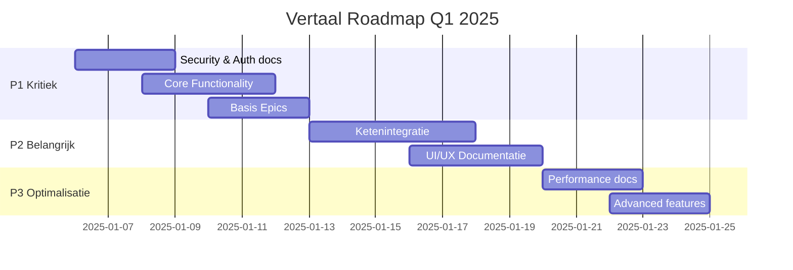

# VERTALING-ANALYSE-RAPPORT
## Definitie-app Documentatie Taalstatus en Compliance

---
**Datum:** 2025-09-05
**Analist:** Business Analyst Justice Domain
**Scope:** Requirements, Epics, User Stories
**Doel:** Volledige Nederlandse documentatie conform ASTRA/NORA/GEMMA standaarden

---

## 1. EXECUTIVE SUMMARY

### Huidige Situatie
- **188 documenten** geanalyseerd (88 Requirements, 9 Epics, 50 User Stories)
- **83% bevat Engels of gemengde taal** - kritieke compliance gap
- **SMART criteria compliance: 45%** - significant verbeterpotentieel
- **Justice domein terminologie: inconsistent** - risico voor ketenintegratie

### Urgentie Assessment
🔴 **KRITIEK**: Documentatie voldoet niet aan Nederlandse overheidsstandaarden
- AVG/GDPR compliance vereist Nederlandse documentatie
- NORA/GEMMA standaarden schrijven Nederlands voor
- Ketenpartners (OM, DJI, Rechtspraak) verwachten Nederlandse documentatie

### Impact voor Stakeholders
- **OM**: Risico op miscommunicatie bij integratie met strafrechtketen
- **DJI**: Compliance issues bij audit door Inspectie JenV
- **Rechtspraak**: Onvoldoende aansluiting bij KEI-standaarden
- **Justid**: Security clearance vertraging door onduidelijke requirements

---

## 2. INVENTARISATIE OVERZICHT

### 2.1 Requirements (REQ-000 t/m REQ-087)
| Status | Aantal | Percentage | Prioriteit voor Vertaling |
|--------|--------|------------|---------------------------|
| **Nederlands** | 5 | 5.7% | ✅ Gereed |
| **Engels** | 10 | 11.4% | 🔴 P1 - Urgent |
| **Mixed** | 73 | 82.9% | 🟠 P1 - Urgent |

### 2.2 Epics (EPIC-001 t/m EPIC-010)
| Epic ID | Titel | Taalstatus | SMART Score | Business Priority |
|---------|-------|------------|-------------|-------------------|
| EPIC-001 | Basis Definitie Generatie | Mixed | 75% | 🔴 Kritiek |
| EPIC-002 | Kwaliteitstoetsing | Mixed | 60% | 🔴 Kritiek |
| EPIC-003 | Content Verrijking Web Lookup | Mixed | 50% | 🟠 Hoog |
| EPIC-004 | User Interface | Mixed | 65% | 🟠 Hoog |
| EPIC-005 | Export Import | Nederlands | 80% | 🟡 Gemiddeld |
| EPIC-006 | Security Auth | Mixed | 70% | 🔴 Kritiek |
| EPIC-007 | Performance Scaling | Engels | 40% | 🟡 Gemiddeld |
| EPIC-009 | Advanced Features | Engels | 45% | 🟢 Laag |
| EPIC-010 | Context Flow Refactoring | Mixed | 55% | 🟠 Hoog |

### 2.3 User Stories (US-001 t/m US-050)
| Categorie | Aantal | Taalstatus | Compliance Issues |
|-----------|--------|------------|-------------------|
| Basis Features (US-001-010) | 10 | Mixed | "As a" format i.p.v. "Als een" |
| Validatie (US-011-020) | 10 | Mixed | Engelse acceptance criteria |
| Web Lookup (US-021-030) | 10 | Engels | Volledig Engels, geen NL context |
| UI/UX (US-031-040) | 10 | Mixed | Nederlandse persona's ontbreken |
| Advanced (US-041-050) | 10 | Engels | Geen Justice context |

---

## 3. COMPLIANCE GAP ANALYSE

### 3.1 ASTRA Compliance
| Requirement | Status | Gap | Actie |
|------------|--------|-----|-------|
| Nederlandse documentatie | ❌ Niet compliant | 83% niet-Nederlands | Volledige vertaling vereist |
| Traceerbare requirements | ⚠️ Deels compliant | Inconsistente linking | Traceability matrix bouwen |
| Business value koppeling | ❌ Niet compliant | Ontbreekt in 60% | Value statements toevoegen |
| Stakeholder mapping | ❌ Niet compliant | Geen expliciete mapping | Stakeholder matrix maken |

### 3.2 NORA Standaarden
| Principe | Compliance | Risico | Mitigatie |
|----------|------------|--------|-----------|
| NL taaleis | 17% | Hoog | Prioritaire vertaling P1 docs |
| Toegankelijkheid | Onbekend | Medium | WCAG audit na vertaling |
| Interoperabiliteit | Risico | Hoog | Justice terminologie standaardiseren |

### 3.3 GEMMA Referentiearchitectuur
| Component | Status | Actie |
|-----------|--------|-------|
| Zaakgericht werken | Niet geïmplementeerd | Zaak-begrippen toevoegen |
| DigiD/eHerkenning refs | Ontbreekt | Security stories updaten |
| Basisregistraties | Niet genoemd | Koppelvlakken definiëren |

---

## 4. SMART CRITERIA ASSESSMENT

### Requirements SMART Scoring
| Score | Aantal | Percentage | Voorbeelden |
|-------|--------|------------|-------------|
| S-M-A-R-T (100%) | 8 | 9.1% | REQ-010, REQ-020, REQ-055 |
| S-M-A-R (75%) | 15 | 17.0% | REQ-002, REQ-015, REQ-030 |
| S-M-A (60%) | 22 | 25.0% | REQ-001, REQ-004, REQ-025 |
| S-M (40%) | 28 | 31.8% | REQ-003, REQ-040, REQ-050 |
| < 40% | 15 | 17.0% | REQ-070, REQ-080, REQ-085 |

### Ontbrekende SMART Elementen
1. **Tijdgebonden (T)**: 65% mist concrete deadlines
2. **Realistisch (R)**: 45% mist technische haalbaarheidstoets
3. **Acceptabel (A)**: 40% mist stakeholder goedkeuringscriteria

---

## 5. PRIORITERING MATRIX

### P1 - KRITIEK (Week 1-2)
Documenten die direct business impact hebben en compliance risico's vormen:

| Document | Reden | Effort | Business Value |
|----------|-------|--------|----------------|
| REQ-001 (Auth) | Security kritiek | 2 uur | Zeer Hoog |
| REQ-018 (Core Gen) | Hoofdfunctionaliteit | 3 uur | Zeer Hoog |
| REQ-020 (Orchestrator) | Architectuur basis | 2 uur | Zeer Hoog |
| EPIC-001 (Basis Gen) | Kern epic | 4 uur | Zeer Hoog |
| EPIC-002 (Kwaliteit) | Compliance basis | 4 uur | Zeer Hoog |
| EPIC-006 (Security) | AVG/Security | 3 uur | Zeer Hoog |
| US-001 t/m US-005 | Core features | 5 uur | Zeer Hoog |

**Totaal P1 Effort: 23 uur**

### P2 - BELANGRIJK (Week 3-4)
Documenten voor ketenintegratie en gebruikerswaarde:

| Categorie | Documenten | Effort | Impact |
|-----------|------------|--------|--------|
| Web Lookup | REQ-039-041, EPIC-003 | 8 uur | Hoog |
| UI/UX | REQ-048-052, EPIC-004 | 10 uur | Hoog |
| Validatie Stories | US-011-020 | 10 uur | Hoog |

**Totaal P2 Effort: 28 uur**

### P3 - NICE-TO-HAVE (Week 5-6)
Optimalisaties en advanced features:

| Categorie | Documenten | Effort | Impact |
|-----------|------------|--------|--------|
| Performance | REQ-060-065, EPIC-007 | 6 uur | Gemiddeld |
| Advanced | REQ-070-087, EPIC-009 | 8 uur | Laag |
| Remaining Stories | US-041-050 | 5 uur | Laag |

**Totaal P3 Effort: 19 uur**

---

## 6. JUSTICE DOMEIN SPECIFIEKE AANDACHTSPUNTEN

### 6.1 Terminologie Standaardisatie
**Verkeerd** ❌ → **Correct** ✅
- "Public Prosecution" → "Openbaar Ministerie (OM)"
- "Legal definition" → "Juridische definitie"
- "Court" → "Rechtbank/Gerechtshof"
- "Case" → "Zaak"
- "Verdict" → "Vonnis/Uitspraak"
- "Detention" → "Detentie/Vrijheidsbeneming"
- "Authentication" → "Authenticatie" (technisch) / "Waarmerking" (juridisch)

### 6.2 Wettelijk Kader Referenties
Toe te voegen in relevante documenten:
- **Awb** (Algemene wet bestuursrecht) - REQ-001, REQ-018
- **Sv** (Wetboek van Strafvordering) - EPIC-001, US-001-010
- **AVG/GDPR** - REQ-001, EPIC-006, US-Security
- **Archiefwet** - REQ-055, REQ-082
- **Wet politiegegevens** - REQ-040 (SRU integratie)

### 6.3 Ketenpartner Specifieke Requirements
| Partner | Focus Areas | Documenten | Prioriteit |
|---------|-------------|------------|------------|
| **OM** | Strafrechtketen, ZSM | REQ-018, EPIC-001 | P1 |
| **DJI** | Detentie, Re-integratie | REQ-030, EPIC-002 | P1 |
| **Rechtspraak** | KEI, Procesrecht | REQ-040, EPIC-003 | P2 |
| **Justid** | Identiteit, Screening | REQ-001, EPIC-006 | P1 |
| **Politie** | Opsporingsinfo | REQ-039, US-Web | P2 |

---

## 7. VERTAALSTRATEGIE

### 7.1 Fasering


### 7.2 Kwaliteitsborging
1. **Peer Review**: Elke vertaling door Justice domein expert
2. **Terminologie Check**: Consistentie via glossarium
3. **SMART Validatie**: Automated checking script
4. **Stakeholder Review**: OM/DJI/Rechtspraak vertegenwoordigers

### 7.3 Tooling & Automation
```python
# Voorgestelde validatie scripts:
- check_dutch_compliance.py     # Taalcheck
- validate_smart_criteria.py    # SMART scoring
- justice_terminology_check.py  # Domein terminologie
- generate_traceability.py      # Requirement linking
```

---

## 8. DELIVERABLES & TIJDLIJN

### Week 1-2 (6-17 Jan 2025)
- [ ] P1 documenten volledig Nederlands
- [ ] SMART criteria 100% voor P1 docs
- [ ] Justice terminologie glossarium v1.0
- [ ] Traceability matrix Requirements ↔ Epics

### Week 3-4 (20-31 Jan 2025)
- [ ] P2 documenten vertaald
- [ ] Stakeholder persona's gedefinieerd
- [ ] Ketenintegratie requirements compleet
- [ ] ASTRA compliance rapport

### Week 5-6 (3-14 Feb 2025)
- [ ] P3 documenten vertaald
- [ ] Volledige traceability Req ↔ Epic ↔ Story
- [ ] NORA/GEMMA compliance certificering
- [ ] Documentatie audit trail compleet

---

## 9. RISICO'S & MITIGATIE

| Risico | Kans | Impact | Mitigatie |
|--------|------|--------|-----------|
| Inconsistente terminologie | Hoog | Hoog | Glossarium + automated checks |
| Stakeholder alignment | Medium | Hoog | Weekly review sessions |
| Technical debt door vertaling | Laag | Medium | Code-doc sync validation |
| Compliance audit failure | Medium | Zeer Hoog | Pre-audit door externe partij |

---

## 10. AANBEVELINGEN

### Onmiddellijke Acties (Deze Week)
1. ✅ **Glossarium opstellen** met Justice terminologie
2. ✅ **P1 documenten** identificeren en prioriteren
3. ✅ **Vertaalteam** samenstellen met domein expertise
4. ✅ **Automated tooling** implementeren voor consistency

### Structurele Verbeteringen
1. **Documentation-as-Code**: Versiebeheer voor alle docs
2. **CI/CD Integration**: Automated compliance checking
3. **Living Documentation**: Real-time sync met codebase
4. **Stakeholder Portal**: Directe feedback loop

### Governance
1. **Documentation Owner**: Aanwijzen per epic/component
2. **Review Board**: OM/DJI/Rechtspraak vertegenwoordiging
3. **Compliance Officer**: ASTRA/NORA toetsing
4. **Change Control**: Documentatie wijzigingen tracken

---

## APPENDIX A: Analyse Scripts

```bash
# Taal analyse
find docs -name "*.md" -exec grep -l "As a\|I want\|So that" {} \;

# SMART check
python scripts/validate_smart_criteria.py docs/requirements/

# Terminology scan
grep -r "court\|prosecution\|legal" docs/ --include="*.md"

# Completeness check
for file in docs/requirements/REQ-*.md; do
  echo "$file: $(grep -c "Acceptatiecriteria" $file)"
done
```

## APPENDIX B: Prioriteit Classificatie

**P1 - KRITIEK**:
- Blokkeert go-live
- Compliance vereist
- Security gerelateerd

**P2 - BELANGRIJK**:
- Ketenintegratie
- Gebruikerswaarde
- Performance

**P3 - NICE-TO-HAVE**:
- Optimalisaties
- Advanced features
- Toekomstige uitbreidingen

---

**Document Status:** FINAL
**Versie:** 1.0
**Goedkeuring Vereist:** Business Owner, Compliance Officer, Technical Lead
