# Complete Architectuur Overzicht - DefinitieAgent

## AS-IS Architectuur (Huidige Situatie)

```mermaid
graph TB
    subgraph "Frontend Layer - Streamlit UI"
        UI[Streamlit App<br/>10 Tabs - 30% Functional]
        T1[✅ Definitie Gen]
        T2[✅ Geschiedenis]
        T3[✅ Export Basic]
        T4[⚠️ Kwaliteitscontrole]
        T5[❌ Prompt Viewer]
        T6[❌ Aangepaste Def]
        T7[❌ Developer Tools]
        T8[❌ Expert Review]
        T9[❌ Externe Bronnen]
        T10[❌ Orchestratie]
        
        UI --> T1
        UI --> T2
        UI --> T3
        UI --> T4
        UI --> T5
        UI --> T6
        UI --> T7
        UI --> T8
        UI --> T9
        UI --> T10
    end
    
    subgraph "Service Layer - GOD OBJECT"
        UDS[UnifiedDefinitionService<br/>🔴 1000+ lines<br/>Singleton Pattern]
        
        subgraph "Mixed Responsibilities"
            GEN[Generation Logic]
            VAL[Validation Orchestration]
            CACHE[Cache Management]
            LEGACY[Legacy Compatibility]
            PROMPT[Prompt Building]
            RATE[Rate Limiting]
            ERROR[Error Handling]
        end
        
        UDS --> GEN
        UDS --> VAL
        UDS --> CACHE
        UDS --> LEGACY
        UDS --> PROMPT
        UDS --> RATE
        UDS --> ERROR
    end
    
    subgraph "AI & Validation Layer"
        AI[OpenAI GPT-4<br/>8-12 sec response]
        TOETS[46 Toetsregels<br/>✅ Working]
        
        subgraph "Content Services 🔴 BROKEN"
            WEB1[definitie_lookup_broken.py]
            WEB2[definitie_lookup_encoding.py]
            WEB3[bron_lookup_encoding.py]
            WEB4[legacy_lookup_v1.py]
            WEB5[legacy_lookup_v2.py]
            ENRICH[❌ Synoniemen<br/>❌ Antoniemen<br/>❌ Voorbeelden]
        end
    end
    
    subgraph "Data Layer"
        DB[(SQLite DB<br/>⚠️ Locking Issues)]
        REPO[Repository Pattern<br/>✅ Modern]
        SESSION[Session State<br/>⚠️ Inconsistent]
        
        subgraph "Direct DB Access 🔴"
            UI_DB[UI → DB Direct]
            TAB_DB[Tabs → DB Direct]
        end
    end
    
    subgraph "Infrastructure & Config"
        subgraph "Config Chaos 🔴"
            C1[.env Config]
            C2[config.py]
            C3[settings.json]
            C4[hardcoded values]
        end
        
        subgraph "Import Chaos 🔴"
            I1[Relative imports ...]
            I2[Absolute imports]
            I3[sys.path hacks]
        end
        
        TEST[Test Suite<br/>🔴 87% Broken]
    end
    
    %% Connections AS-IS
    T1 --> UDS
    T2 --> UDS
    T3 --> UDS
    T4 --> UDS
    
    %% Direct DB violations
    T2 -.-> DB
    T3 -.-> DB
    
    UDS --> AI
    UDS --> TOETS
    UDS --> DB
    UDS --> REPO
    UDS --> SESSION
    
    GEN --> AI
    VAL --> TOETS
    
    %% Broken connections
    UDS -.-> WEB1
    UDS -.-> WEB2
    UDS -.-> ENRICH
    
    %% Config connections
    UDS --> C1
    UDS --> C2
    UI --> C3
    
    classDef broken fill:#ff6b6b,stroke:#c92a2a,color:#fff
    classDef working fill:#51cf66,stroke:#2b8a3e,color:#fff
    classDef partial fill:#ffd43b,stroke:#fab005,color:#000
    classDef godObject fill:#ff8787,stroke:#fa5252,color:#fff,stroke-width:4px
    
    class WEB1,WEB2,WEB3,WEB4,WEB5,ENRICH,T5,T6,T7,T8,T9,T10,TEST,UI_DB,TAB_DB,I1,I2,I3 broken
    class T1,T2,T3,TOETS,REPO working
    class T4,DB,SESSION,UI partial
    class UDS godObject
```

## TO-BE Architectuur (Gewenste Situatie)

```mermaid
graph TB
    subgraph "Frontend Layer - Complete UI"
        UI_NEW[Streamlit App<br/>✅ 100% Functional]
        subgraph "Active Tabs"
            NT1[✅ Definitie Generatie]
            NT2[✅ Geschiedenis]
            NT3[✅ Export Advanced]
            NT4[✅ Kwaliteitscontrole]
            NT5[✅ Prompt Viewer]
            NT6[✅ Aangepaste Definitie]
            NT7[✅ Developer Tools]
            NT8[✅ Expert Review]
            NT9[✅ Externe Bronnen]
            NT10[✅ Orchestratie]
        end
        
        COMP[Component Library<br/>Reusable UI Parts]
        STATE[Centralized State<br/>Management]
    end
    
    subgraph "Service Layer - Clean Architecture"
        FACADE[DefinitionFacade<br/>API Gateway]
        
        subgraph "Focused Services"
            S1[DefinitionGenerator<br/>Core AI Logic]
            S2[ValidationOrchestrator<br/>46 Rules Engine]
            S3[ContentEnrichmentService<br/>Synoniemen/Antoniemen]
            S4[PromptOptimizer<br/><10k chars]
            S5[CacheManager<br/>Redis/Memory]
            S6[WebLookupService<br/>✅ UTF-8 Fixed]
        end
        
        subgraph "Cross-Cutting"
            AUTH[AuthenticationService<br/>User Management]
            MONITOR[MonitoringService<br/>Metrics & Logs]
            RATELIMIT[RateLimiter<br/>Smart Throttling]
        end
    end
    
    subgraph "AI & External Services"
        AI_OPT[OpenAI GPT-4<br/><5 sec response]
        REDIS[Redis Cache<br/>80% hit rate]
        
        subgraph "External APIs"
            EXT1[wetten.nl API]
            EXT2[rechtspraak.nl API]
            EXT3[officielebekendmakingen.nl]
        end
    end
    
    subgraph "Data Layer - Clean Access"
        subgraph "Database"
            PG[(PostgreSQL<br/>Production)]
            SQLITE[(SQLite<br/>Development)]
        end
        
        subgraph "Data Access"
            REPO_NEW[Repository Layer<br/>No Direct Access]
            MAPPER[Data Mappers]
            MIGRATE[Migration System]
        end
        
        CACHE_LAYER[Cache Layer<br/>Query Cache]
    end
    
    subgraph "Infrastructure - Unified"
        CONFIG[Unified Config<br/>Single Source]
        
        subgraph "Quality Assurance"
            TESTS[Test Suite<br/>✅ 60% Coverage]
            CI[CI/CD Pipeline<br/>Automated]
            LINT[Code Quality<br/>Black/Ruff/MyPy]
        end
        
        subgraph "Monitoring"
            LOG[Structured Logging]
            METRIC[Metrics Collection]
            ALERT[Alert System]
        end
        
        DEPLOY[Deployment<br/>Docker/Cloud Ready]
    end
    
    %% Connections TO-BE
    UI_NEW --> STATE
    STATE --> COMP
    
    NT1 --> FACADE
    NT2 --> FACADE
    NT3 --> FACADE
    NT4 --> FACADE
    NT5 --> FACADE
    NT6 --> FACADE
    NT7 --> FACADE
    NT8 --> FACADE
    NT9 --> FACADE
    NT10 --> FACADE
    
    FACADE --> S1
    FACADE --> S2
    FACADE --> S3
    FACADE --> S4
    FACADE --> S5
    FACADE --> S6
    
    FACADE --> AUTH
    FACADE --> MONITOR
    FACADE --> RATELIMIT
    
    S1 --> AI_OPT
    S1 --> S4
    S2 --> MONITOR
    S3 --> AI_OPT
    S5 --> REDIS
    S6 --> EXT1
    S6 --> EXT2
    S6 --> EXT3
    
    S1 --> REPO_NEW
    S2 --> REPO_NEW
    S3 --> REPO_NEW
    S6 --> REPO_NEW
    
    REPO_NEW --> MAPPER
    MAPPER --> PG
    MAPPER --> SQLITE
    REPO_NEW --> CACHE_LAYER
    CACHE_LAYER --> REDIS
    
    AUTH --> REPO_NEW
    MONITOR --> LOG
    MONITOR --> METRIC
    METRIC --> ALERT
    
    FACADE --> CONFIG
    S1 --> CONFIG
    S2 --> CONFIG
    
    CI --> TESTS
    CI --> LINT
    CI --> DEPLOY
    
    classDef working fill:#51cf66,stroke:#2b8a3e,color:#fff
    classDef new fill:#74c0fc,stroke:#339af0,color:#fff
    classDef improved fill:#63e6be,stroke:#20c997,color:#fff
    
    class NT1,NT2,NT3,NT4,NT5,NT6,NT7,NT8,NT9,NT10,TESTS working
    class S1,S2,S3,S4,S5,S6,AUTH,MONITOR,RATELIMIT,FACADE new
    class AI_OPT,REDIS,CONFIG,CI,DEPLOY improved
```

## Transformatie Pad (AS-IS → TO-BE)

## Key Architecture Transformations

### 1. Service Layer Evolution
- **AS-IS**: UnifiedDefinitionService (God Object, 1000+ lines)
- **TO-BE**: 6 focused services met clear boundaries
- **Benefit**: 90% betere testbaarheid, 70% snellere feature development

### 2. UI Layer Completion
- **AS-IS**: 30% tabs functional, direct DB access
- **TO-BE**: 100% tabs functional, proper layering
- **Benefit**: Complete feature set, maintainable UI

### 3. Performance Optimization
- **AS-IS**: 8-12 sec response, 35k prompts, no caching
- **TO-BE**: <5 sec response, <10k prompts, 80% cache hits
- **Benefit**: 60% sneller, 70% goedkoper

### 4. Infrastructure Modernization
- **AS-IS**: 4 config systems, broken tests, manual deployment
- **TO-BE**: Unified config, 60% test coverage, CI/CD
- **Benefit**: Reliable deployments, confident changes

### 5. Data Access Pattern
- **AS-IS**: Direct DB access from UI, SQLite locking
- **TO-BE**: Repository pattern, PostgreSQL ready
- **Benefit**: Scalable, secure, testable

## Migration Complexity Matrix

| Component | Complexity | Risk | Priority |
|-----------|-----------|------|----------|
| Import Fixes | Low | Low | Sprint 0 |
| Service Split | High | Medium | Sprint 2 |
| Web Lookup Fix | Medium | High | Sprint 3 |
| UI Activation | Medium | Low | Sprint 4-5 |
| Test Suite | High | Low | Sprint 5-6 |
| Monitoring | Low | Low | Sprint 6 |
| PostgreSQL | Medium | Medium | Future |