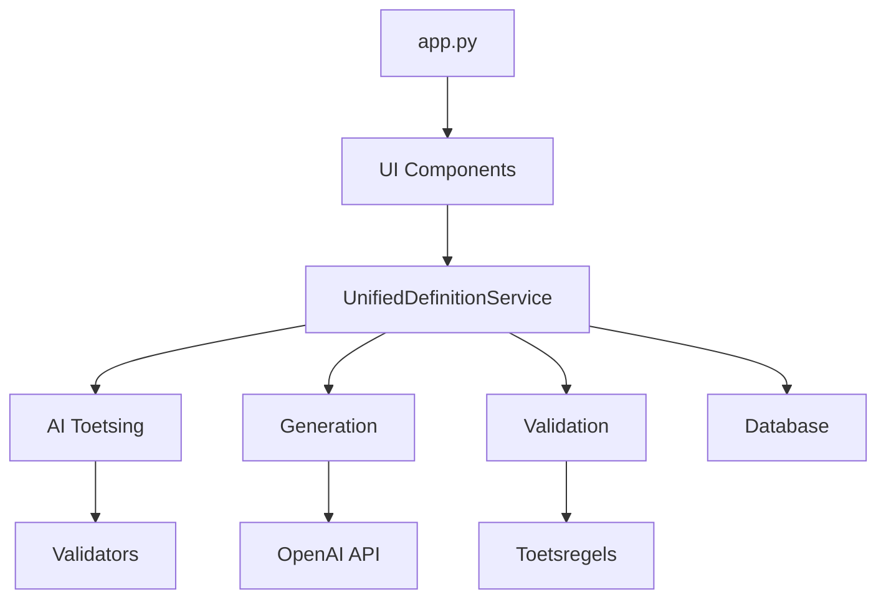

# Source Tree Organization - DefinitieAgent

## Overview

Dit document beschrijft de source code organisatie van DefinitieAgent. Het dient als referentie voor developers om snel te navigeren en te begrijpen waar functionaliteit zich bevindt.

## Root Structure

```
definitie-app/
├── src/                    # Source code
├── tests/                  # Test suites
├── docs/                   # Documentation
├── data/                   # Data files & databases
├── config/                 # Configuration files
├── scripts/                # Utility scripts
├── backups/                # Code backups
├── logs/                   # Application logs
├── exports/                # Generated exports
├── cache/                  # Cache files
├── .bmad-core/            # BMAD framework
├── .env.example           # Environment template
├── requirements.txt       # Python dependencies
├── README.md              # Project overview
├── CHANGELOG.md          # Version history
└── CONTRIBUTING.md       # Contribution guide
```

## Source Code Structure (`src/`)

### Core Application
```
src/
├── __init__.py
├── app.py                 # Streamlit entry point
├── main.py               # Alternative entry point
└── centrale_module_definitie_kwaliteit.py  # Legacy monolith (reference)
```

### Services Layer
```
src/services/
├── __init__.py
├── unified_definition_service.py    # ✅ Main service (Singleton)
├── definition_service.py           # Legacy service
├── integrated_service.py           # Legacy service
└── async_definition_service.py    # Async wrapper
```

**Key Service**: `UnifiedDefinitionService`
- Singleton pattern via `get_instance()`
- Modes: AUTO, MODERN, LEGACY, HYBRID
- Handles all definition generation

### AI & Validation (`ai_toetsing/`)
```
src/ai_toetsing/
├── __init__.py
├── toetsing_service.py            # Main validation service
├── modular_toetser.py            # Modular validator
├── json_validator_loader.py      # JSON rule loader
├── validators/                   # Individual validators
│   ├── SAM_01.py                # No circular reasoning
│   ├── STR_01.py                # Capital letter start
│   └── ... (46 validators)
└── toetsregels/                 # Rule configurations
    ├── regels/                  # JSON rule definitions
    └── sets/                    # Rule sets by category
```

### UI Layer (`ui/`)
```
src/ui/
├── __init__.py
├── tabbed_interface.py           # Main UI orchestrator
├── session_state.py             # Session management
├── cache_manager.py             # UI caching
├── components/                  # UI tabs
│   ├── definition_generator_tab.py    # Tab 1 ✅
│   ├── quality_control_tab.py        # Tab 2 ✅
│   ├── expert_review_tab.py          # Tab 3 ✅
│   ├── management_tab.py             # Tab 4 ⚠️
│   ├── orchestration_tab.py          # Tab 5 ⚠️
│   ├── history_tab.py                # Tab 6 ❌
│   ├── export_tab.py                 # Tab 7 ❌
│   ├── monitoring_tab.py             # Tab 8 ❌
│   ├── external_sources_tab.py       # Tab 9 ❌
│   └── web_lookup_tab.py             # Tab 10 ❌
└── async_progress.py            # Progress indicators
```

### Data Layer
```
src/
├── database/
│   ├── __init__.py
│   ├── definitie_repository.py   # Main repository
│   ├── schema.sql               # Database schema
│   └── migrations/              # SQL migrations
├── models/
│   └── (currently using dict objects)
└── repositories/
    └── (legacy repository pattern)
```

### Domain Logic
```
src/
├── ontologie/
│   ├── __init__.py
│   └── ontological_analyzer.py   # 6-step ontology protocol
├── voorbeelden/
│   ├── __init__.py
│   ├── unified_voorbeelden.py   # Example generator
│   └── cached_voorbeelden.py    # Cached examples
└── generation/
    ├── __init__.py
    └── definitie_generator.py    # Core generation logic
```

### Utilities
```
src/utils/
├── __init__.py
├── cache.py                      # Caching utilities
├── exceptions.py                 # Custom exceptions
├── resilience.py                # Error handling
├── smart_rate_limiter.py        # API rate limiting
└── performance_monitor.py       # Performance tracking
```

### External Integrations
```
src/
├── web_lookup/
│   ├── __init__.py
│   ├── bron_lookup.py           # Source lookups
│   ├── definitie_lookup.py      # Definition search
│   └── juridische_lookup.py     # Legal lookups
└── external/
    └── external_source_adapter.py
```

### Configuration
```
src/config/
├── __init__.py
├── config_manager.py            # Central config
├── rate_limit_config.py        # Rate limit settings
├── verboden_woorden.json       # Forbidden words
└── context_wet_mapping.json    # Context mappings
```

### Legacy Code
```
src/legacy/
├── README.md                    # Legacy reference guide
├── centrale_module_*.py        # Original monolith
└── core_legacy.py              # Original validators
```

## Test Structure (`tests/`)

```
tests/
├── __init__.py
├── pytest.ini                   # Pytest configuration
├── unit/                       # Unit tests
│   ├── test_validation_system.py
│   ├── test_config_system.py
│   └── test_*
├── integration/                # Integration tests
│   ├── test_comprehensive_system.py
│   └── test_ui_comprehensive.py
├── functionality/              # Functional tests
├── performance/               # Performance tests
├── rate_limiting/            # Rate limit tests
└── services/                 # Service tests
```

## Configuration Files (`config/`)

```
config/
├── config_default.yaml         # Default settings
├── config_development.yaml     # Dev overrides
├── config_production.yaml      # Prod settings
├── config_testing.yaml         # Test settings
└── toetsregels/               # Validation rules
```

## Data Directory (`data/`)

```
data/
├── database/
│   └── definities.db          # SQLite database
├── uploaded_documents/        # User uploads
├── cache/                    # Persistent cache
└── exports/                  # Generated files
```

## Key Entry Points

1. **Web UI**: `streamlit run src/app.py`
2. **CLI**: `python src/main.py` (limited functionality)
3. **Tests**: `pytest tests/`

## Module Dependencies



## Import Conventions

### Standard Import Pattern
```python
# External imports
import os
from typing import Dict, Optional

# Third-party imports
import streamlit as st
from sqlalchemy import create_engine

# Local imports
from src.services.unified_definition_service import UnifiedDefinitionService
from src.ai_toetsing.toetsing_service import ToetsingService
```

### Common Import Issues
- ❌ `from services.` (missing src)
- ❌ `from definitie_app.` (old pattern)
- ✅ `from src.services.` (correct)

## File Naming Conventions

- **Python files**: `snake_case.py`
- **Test files**: `test_*.py`
- **Config files**: `*.yaml` or `*.json`
- **Documentation**: `*.md`
- **SQL files**: `*.sql`

## Service Locator Pattern

Most services use singleton pattern:
```python
# Get service instance
service = UnifiedDefinitionService.get_instance()

# Use service
result = service.generate_definition(term)
```

## Configuration Loading

```python
# Central config manager
from src.config.config_manager import ConfigManager

config = ConfigManager.get_config()
api_key = config.get('OPENAI_API_KEY')
```

## Adding New Features

### New UI Tab
1. Create `src/ui/components/new_feature_tab.py`
2. Register in `src/ui/tabbed_interface.py`
3. Add tests in `tests/unit/test_new_feature_tab.py`

### New Validator
1. Create `src/ai_toetsing/validators/NEW_01.py`
2. Add rule in `src/toetsregels/regels/NEW-01.json`
3. Register in toetsing service
4. Add tests

### New Service
1. Create in `src/services/`
2. Follow singleton pattern if needed
3. Add to unified service if applicable
4. Document in this file

## Common Locations

| What | Where |
|------|-------|
| Add new UI tab | `src/ui/components/` |
| Add validator | `src/ai_toetsing/validators/` |
| Add API endpoint | `src/services/` |
| Add database table | `src/database/schema.sql` |
| Add config option | `src/config/config_default.yaml` |
| Add test | `tests/unit/` or `tests/integration/` |
| Add documentation | `docs/` |

---
*Laatste update: 2025-01-18*