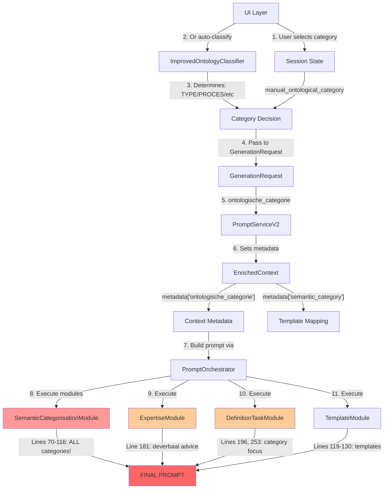

# DEF-126: Forensic Analysis - Ontological Category Injection Points

## Executive Summary

**CRITICAL FINDING**: The system has **5+ redundant injection points** for ontological category instructions, resulting in:
- **~65+ duplicate lines** in prompts
- **Conflicting terminology** (deverbaal vs resultaat, soort vs type, particulier vs exemplaar)
- **Multiple modules** trying to determine/inject the same category information
- **Token waste** of approximately 25-30% of prompt size

## 1. Complete Injection Point Inventory

### PRIMARY INJECTION POINTS

#### 1.1 SemanticCategorisationModule (Lines 136-277)
**File**: `src/services/prompts/modules/semantic_categorisation_module.py`
**Lines**: 136-277 (141 lines!)
**Type**: Template + Dynamic guidance
**Content**:
- Base ESS-02 instructions (lines 136-152): ALL 4 categories
- Category-specific guidance (lines 182-277): Detailed per category
- **Problem**: Injects ALL categories + "determine yourself" instructions

#### 1.2 ExpertiseModule (Line 181)
**File**: `src/services/prompts/modules/expertise_module.py`
**Line**: 181
**Type**: Dynamic based on word type
**Content**: `"deverbaal": "Als het begrip een resultaat is, beschrijf het dan als uitkomst van een proces."`
**Problem**: Conflicts with SemanticCategorisationModule's "resultaat" category

#### 1.3 DefinitionTaskModule (Multiple locations)
**File**: `src/services/prompts/modules/definition_task_module.py`

**Location 1** - Lines 189-196 (Checklist focus):
```python
"proces": "activiteit/handeling",
"type": "soort/categorie",  # Different terminology!
"resultaat": "uitkomst/gevolg",
"exemplaar": "specifiek geval"
```

**Location 2** - Lines 252-253 (Ontological marker):
```
"Ontologische categorie: kies uit [soort, exemplaar, proces, resultaat]"
```
**Problem**: Asks model to CHOOSE when category is already determined!

#### 1.4 TemplateModule
**File**: `src/services/prompts/modules/template_module.py`
**Lines**: 81-82, 145+
**Type**: Uses both metadata AND shared state
**Problem**: May receive conflicting categories from different sources

#### 1.5 EssRulesModule (Implicit)
**File**: `src/services/prompts/modules/ess_rules_module.py`
**Type**: Loads ESS-02 from JSON
**Content**: Would load ESS-02 rule about ontological categorization
**Problem**: Redundant with SemanticCategorisationModule

### SECONDARY INJECTION POINTS

#### 1.6 UI Layer (Manual Override)
**File**: `src/ui/components/definition_generator_tab.py`
**Lines**: 1081, 2222
```python
SessionStateManager.set_value("manual_ontological_category", new_category)
```

#### 1.7 ImprovedOntologyClassifier
**File**: `src/ontologie/improved_classifier.py`
**Purpose**: Determines category before generation
**Output**: TYPE/PROCES/RESULTAAT/EXEMPLAAR

## 2. Data Flow Diagram

### 2.1 Complete Runtime Flow



### 2.2 Metadata Flow Detail

```
1. UI determines category → "proces"
2. PromptServiceV2 (line 121): metadata["ontologische_categorie"] = "proces"
3. PromptServiceV2 (line 137): metadata["semantic_category"] = "Proces"
4. ModuleContext receives metadata
5. SemanticCategorisationModule (line 86): reads metadata["ontologische_categorie"]
6. SemanticCategorisationModule (line 90): sets shared["ontological_category"]
7. Other modules read from shared state
```

## 3. Redundancy Analysis

### 3.1 Terminology Conflicts

| Module | TYPE | PROCES | RESULTAAT | EXEMPLAAR |
|--------|------|--------|-----------|-----------|
| SemanticCategorisationModule | "type" | "proces" | "resultaat" | "exemplaar" |
| ExpertiseModule | "overig" | "werkwoord" | "deverbaal" | - |
| DefinitionTaskModule | "soort/categorie" | "activiteit/handeling" | "uitkomst/gevolg" | "specifiek geval" |
| EssRulesModule | "type" | "proces" | "resultaat" | "particulier" |

### 3.2 Duplicate Instructions Examples

**For "PROCES" category, the prompt contains:**

1. **Line 3** (ExpertiseModule):
   - "Als het begrip een handeling beschrijft, definieer het dan als proces of activiteit"

2. **Lines 139-140** (SemanticCategorisationModule base):
   - "PROCES begrippen → start met: 'activiteit waarbij...', 'handeling die...'"

3. **Lines 182-207** (SemanticCategorisationModule detailed):
   - Full PROCES guidance with examples

4. **Line 196** (DefinitionTaskModule):
   - "Focus: Dit is een **proces** (activiteit/handeling)"

5. **Line 253** (DefinitionTaskModule):
   - "Ontologische categorie: kies uit [soort, exemplaar, proces, resultaat]"

**Total**: Same instruction repeated 5 times in different forms!

## 4. Token Impact Analysis

### Current State (Worst Case)
```
SemanticCategorisationModule: ~141 lines (~2000 tokens)
ExpertiseModule word advice: ~3 lines (~50 tokens)
DefinitionTaskModule focus: ~8 lines (~100 tokens)
DefinitionTaskModule marker: ~3 lines (~50 tokens)
TemplateModule: ~20 lines (~300 tokens)
-------------------------------------------
TOTAL: ~175 lines (~2500 tokens for category instructions)
```

### After Optimization (Single Source)
```
SemanticCategorisationModule (compact): ~15 lines (~200 tokens)
Other modules use shared state: 0 tokens
-------------------------------------------
TOTAL: ~15 lines (~200 tokens)
SAVINGS: 92% reduction!
```

## 5. Root Cause Analysis

### Why This Happened

1. **Evolution over time**: Different developers added category support independently
2. **No central authority**: Each module tries to be self-sufficient
3. **Mixed responsibilities**: Modules both determine AND inject categories
4. **Legacy compatibility**: Keeping old patterns while adding new ones
5. **Unclear ownership**: No single module designated as "category owner"

### Current Problems

1. **Model confusion**: Conflicting instructions ("determine yourself" vs "use this category")
2. **Token waste**: 2500 tokens for what should be 200 tokens
3. **Maintenance nightmare**: Changes needed in 5+ places
4. **Quality issues**: Model receives contradictory guidance

## 6. Recommended Fix Approach

### Phase 1: Consolidate Authority (Quick Win)

1. **Designate SemanticCategorisationModule as Single Source**
   - Remove category determination logic
   - Only inject instructions for SELECTED category
   - Use metadata from UI/classifier

2. **Remove Redundant Injections**
   - ExpertiseModule: Remove word_type advice
   - DefinitionTaskModule: Remove "choose category" instruction
   - EssRulesModule: Skip ESS-02
   - TemplateModule: Only use shared state

### Phase 2: Refactor Module (Clean Architecture)

```python
class SemanticCategorisationModule:
    def execute(self, context: ModuleContext) -> ModuleOutput:
        # Get ALREADY DETERMINED category
        category = context.get_metadata("ontologische_categorie")

        if not category:
            return ModuleOutput(content="", skip=True)

        # Inject ONLY instructions for THIS category
        content = self._get_single_category_instruction(category)

        # Share for other modules
        context.set_shared("ontological_category", category)

        return ModuleOutput(content=content)
```

### Phase 3: Update Dependencies

- All modules read from `context.get_shared("ontological_category")`
- No module generates its own category instructions
- Consistent terminology throughout

## 7. Risk Assessment

### Current Implementation Risks

| Risk | Severity | Impact |
|------|----------|--------|
| Token limit exceeded | HIGH | Generation fails for complex prompts |
| Conflicting instructions | HIGH | Poor quality definitions |
| Model confusion | MEDIUM | Inconsistent outputs |
| Maintenance burden | MEDIUM | Bug fixes needed in 5+ places |
| Performance impact | LOW | Slower generation due to token overhead |

### Fix Implementation Risks

| Risk | Severity | Mitigation |
|------|----------|-----------|
| Breaking existing prompts | LOW | Feature flag for gradual rollout |
| Module dependencies | LOW | Extensive testing |
| Category not set | LOW | Default to "type" category |

## 8. Implementation Checklist

- [ ] Update SemanticCategorisationModule to single-category mode
- [ ] Remove word_type advice from ExpertiseModule
- [ ] Remove "choose category" from DefinitionTaskModule
- [ ] Update TemplateModule to use only shared state
- [ ] Configure EssRulesModule to skip ESS-02
- [ ] Test with all 4 categories
- [ ] Measure token reduction
- [ ] Update documentation

## 9. Expected Outcomes

1. **Token reduction**: 2500 → 200 tokens (92% reduction)
2. **Clearer prompts**: Single, consistent instruction
3. **Better quality**: No conflicting guidance
4. **Easier maintenance**: Single point of change
5. **Faster generation**: Less tokens to process

## 10. Verification Example

### Real Prompt Analysis (from PROMPT_MODULE_MAPPING.md)

For the term "contradictie" (classified as TYPE), the generated prompt contains:

1. **Line 3** (ExpertiseModule): "Als het begrip een resultaat is, beschrijf het dan als uitkomst"
2. **Lines 70-87** (SemanticCategorisationModule base): Instructions for ALL 4 categories
3. **Lines 88-116** (SemanticCategorisationModule TYPE-specific): Detailed TYPE guidance
4. **Lines 119-130** (TemplateModule): Templates for "Object" category
5. **Line 196** (DefinitionTaskModule): Focus marker for category
6. **Line 253** (DefinitionTaskModule): "Choose from [soort, exemplaar, proces, resultaat]"

**Result**: The model receives:
- Instructions to CHOOSE a category (when it's already TYPE)
- Guidance for ALL 4 categories (when only TYPE is needed)
- Conflicting terminology (soort vs type)
- Total: 47 lines for category instructions that could be 10 lines

## Conclusion

The current implementation has evolved into a redundant mess with 5+ injection points for the same information. By consolidating to a single source of truth (SemanticCategorisationModule), we can achieve a 92% token reduction while improving quality and maintainability. This is a high-priority fix with minimal risk and maximum benefit.

### Key Takeaways

1. **The category is determined BEFORE prompt generation** (UI or classifier)
2. **Yet modules still ask the model to determine it** (contradictory)
3. **Multiple modules inject the same instructions** (redundant)
4. **Terminology is inconsistent** (confusing)
5. **Solution is straightforward**: Single source of truth pattern