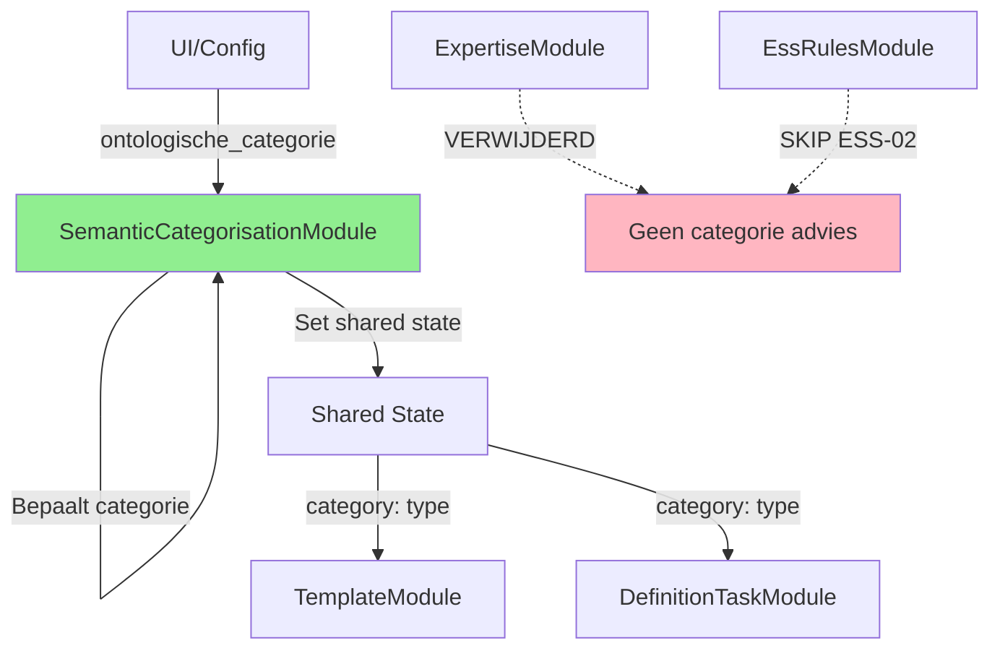

# DEF-155: Ontologische Categorie Instructies - Complete Mapping

## 🔍 Probleem: 5 Overlappende Bronnen voor Dezelfde Instructie

### a. ExpertiseModule → Regel 3
```python
# src/services/prompts/modules/expertise_module.py (regel 181)
"deverbaal": "Als het begrip een resultaat is, beschrijf het dan als uitkomst van een proces."
```
**Locatie in prompt:** Regel 3
**Basis:** Woordsoort (werkwoord/deverbaal/overig)

### b. SemanticCategorisationModule → Regels 70-116
```python
# src/services/prompts/modules/semantic_categorisation_module.py
# Genereert complete ESS-02 sectie met:
- Basis instructies (regels 70-87)
- TYPE-specifieke guidance (regels 88-116)
```
**Locatie in prompt:** Regels 70-116 (47 regels!)
**Basis:** Ontologische categorie metadata

### c. EssRulesModule → Regel 150
```python
# Laadt uit: src/toetsregels/regels/ESS-02.json
"naam": "Ontologische categorie expliciteren (type / particulier / proces / resultaat)"
```
**Locatie in prompt:** Regel 150 (binnen ESS sectie)
**Basis:** Validatieregel uit JSON

### d. DefinitionTaskModule → Regel 395 & 204
```python
# src/services/prompts/modules/definition_task_module.py
# In checklist:
"🎯 Focus: Dit is een **type** (soort/categorie)"
"→ Ontologische categorie is duidelijk"
```
**Locatie in prompt:**
- Regel 204: "→ Ontologische categorie is duidelijk"
- Regel 395: "🎯 Focus: Dit is een **type** (soort/categorie)"

### e. DefinitionTaskModule → Regels 413-415
```python
# Ontologische marker instructie:
"📋 **Ontologische marker (lever als eerste regel):**"
"- Ontologische categorie: kies uit [soort, exemplaar, proces, resultaat]"
```
**Locatie in prompt:** Regels 413-415

## 📊 Samenvatting van Overlappingen

| Module | Regels | Wat doet het | Type Content |
|--------|--------|--------------|--------------|
| **ExpertiseModule** | 3 | Geeft advies op basis van woordsoort | **Dynamisch** (woordsoort bepaling) |
| **SemanticCategorisationModule** | 70-116 | Complete ESS-02 instructie set | **Template** + Dynamisch |
| **EssRulesModule** | 150 | Noemt ESS-02 regel | **Template** (uit JSON) |
| **DefinitionTaskModule** | 204, 395 | Herhaalt categorie focus | **Dynamisch** |
| **DefinitionTaskModule** | 413-415 | Vraagt om categorie keuze | **Template** |

## 🔴 Kern Problemen

### 1. Terminologie Inconsistentie
- **ExpertiseModule**: "deverbaal" → advies voor "resultaat"
- **SemanticCategorisation**: "resultaat" categorie
- **EssRulesModule**: "particulier" (niet "exemplaar")
- **DefinitionTaskModule**: "soort" (niet "type")

### 2. Conflicterende Instructies
- **ExpertiseModule** bepaalt op basis van **woordsoort** (morfologie)
- **SemanticCategorisation** gebruikt **metadata** (UI/config)
- Beide proberen hetzelfde te doen maar met andere logica

### 3. Redundante Herhaling
- Dezelfde instructie wordt **5x** op verschillende manieren gegeven
- Totaal **~65 regels** voor wat eigenlijk **~15 regels** kan zijn

## ✅ Voorgestelde Oplossing: Single Source Architecture

### Principe: Eén Module als Category Authority



### Implementatie Plan

#### STAP 1: Consolideer in SemanticCategorisationModule

```python
class SemanticCategorisationModule(BasePromptModule):
    """
    DE ENIGE BRON voor ontologische categorie bepaling en instructies.
    """

    def execute(self, context: ModuleContext) -> ModuleOutput:
        # 1. Bepaal categorie (UI override of intelligent detection)
        category = self._determine_category(context)

        # 2. Sla op voor ALLE andere modules
        context.set_shared("ontological_category", category)
        context.set_shared("category_normalized", self._normalize(category))

        # 3. Genereer EENMALIGE complete instructie
        if context.config.get("compact_mode"):
            content = self._build_compact_instruction(category)
        else:
            content = self._build_full_ess02_instruction(category)

        return ModuleOutput(content=content)

    def _determine_category(self, context):
        """Intelligente categorie bepaling."""
        # 1. Check UI/metadata override
        if context.get_metadata("ontologische_categorie"):
            return context.get_metadata("ontologische_categorie")

        # 2. Morfologische analyse (wat ExpertiseModule deed)
        begrip = context.begrip.lower()

        # Mapping van woordsoort naar categorie
        if begrip.endswith(("eren", "elen", "enen")):
            return "proces"  # Werkwoord → proces

        if begrip.endswith(("ing", "atie", "tie", "isatie")):
            # Deverbaal kan proces OF resultaat zijn
            if self._is_action_noun(begrip):
                return "proces"  # bijv. "vergadering" (actie)
            else:
                return "resultaat"  # bijv. "registratie" (uitkomst)

        if "exemplaar" in begrip or "geval" in begrip:
            return "exemplaar"

        # Default
        return "type"

    def _build_compact_instruction(self, category):
        """Compacte versie voor token besparing."""
        instructions = {
            "proces": "→ Start met: 'activiteit waarbij...' of 'handeling die...'",
            "type": "→ Start met: [kernwoord] dat/die [kenmerk]",
            "resultaat": "→ Start met: 'resultaat van...' of 'uitkomst van...'",
            "exemplaar": "→ Start met: 'exemplaar van... dat...'"
        }
        return f"📐 Ontologische categorie: **{category}**\n{instructions[category]}"
```

#### STAP 2: Verwijder uit ExpertiseModule

```python
class ExpertiseModule(BasePromptModule):
    def execute(self, context: ModuleContext) -> ModuleOutput:
        sections = []
        sections.append(self._build_role_definition())
        sections.append(self._build_task_instruction())
        # VERWIJDERD: _build_word_type_advice()
        sections.append(self._build_basic_requirements())
        return ModuleOutput(content="\n".join(sections))
```

#### STAP 3: Skip ESS-02 in EssRulesModule

```python
class EssRulesModule(BasePromptModule):
    def execute(self, context: ModuleContext) -> ModuleOutput:
        # Filter ESS-02 eruit (handled by SemanticCategorisationModule)
        ess_rules = {
            k: v for k, v in all_rules.items()
            if k.startswith("ESS-") and k != "ESS-02"
        }
```

#### STAP 4: Simplify DefinitionTaskModule

```python
class DefinitionTaskModule(BasePromptModule):
    def _build_checklist(self, ontological_category: str | None) -> str:
        # Gebruik alleen shared state, geen eigen generatie
        category = context.get_shared("ontological_category")

        return f"""📋 **CONSTRUCTIE GUIDE:**
→ Categorie: {category}  # Alleen noemen, niet uitleggen
→ Eén enkele zin zonder punt
→ Context verwerkt zonder expliciete benoeming"""

    def _build_ontological_marker(self) -> str:
        # OPTIONEEL: Alleen als niet al bepaald
        if not context.get_shared("ontological_category"):
            return "📋 Bepaal categorie: [type/exemplaar/proces/resultaat]"
        return ""  # Skip als al bekend
```

#### STAP 5: TemplateModule gebruikt alleen Shared State

```python
class TemplateModule(BasePromptModule):
    def execute(self, context: ModuleContext) -> ModuleOutput:
        # Gebruik ALLEEN de categorie uit shared state
        category = context.get_shared("ontological_category")
        if not category:
            return ModuleOutput(content="", success=False)

        template = self._get_category_template(category)
        return ModuleOutput(content=template)
```

## 📈 Verwachte Resultaten

### Voor (Huidige Situatie)
- **65+ regels** voor ontologische categorie instructies
- **5 verschillende modules** die hetzelfde proberen
- **Inconsistente terminologie**
- **Verwarrende/conflicterende instructies**

### Na (Voorgestelde Oplossing)
- **~15 regels** totaal (77% reductie)
- **1 module** als single source
- **Consistente terminologie**
- **Heldere, eenduidige instructies**

### Concrete Winsten
1. **-50 regels** prompt reductie
2. **Betere onderhoudbaarheid** (1 plek om aan te passen)
3. **Consistentere output** (geen conflicterende instructies)
4. **Flexibele modi** (compact vs volledig)

## 🚀 Implementatie Prioriteit

**HIGH PRIORITY** - Dit is een quick win met grote impact:
- Relatief eenvoudig te implementeren
- Direct meetbaar resultaat (token reductie)
- Verbetert prompt kwaliteit
- Maakt DEF-155 transformatie makkelijker

## Configuration Voorbeeld

```yaml
# config/prompt_modules.yaml
semantic_categorisation:
  enabled: true
  mode: compact  # of 'full' voor uitgebreide instructies
  auto_detect: true  # Morfologische analyse als geen metadata

expertise:
  word_type_advice: false  # DEPRECATED - gebruik semantic_categorisation

ess_rules:
  skip_rules: ["ESS-02"]  # Handled by semantic_categorisation

definition_task:
  show_ontological_marker: auto  # Alleen als niet bepaald
```

## Conclusie

Door alle ontologische categorie logic te consolideren in **SemanticCategorisationModule**:
- Elimineren we **5 redundante bronnen**
- Reduceren we de prompt met **~50 regels**
- Creëren we **één autoritieve bron** voor categorieën
- Maken we het systeem **veel makkelijker te onderhouden**

Dit is een perfecte eerste stap voor DEF-155 transformatie!