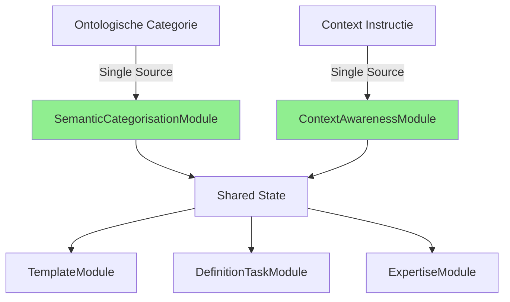

# DEF-155: Oplossing voor Redundante Instructies

## Probleem Analyse

### 1. Context Redundantie (3x dezelfde instructie)

**Huidige situatie:**
```
Regel 64: ContextAwarenessModule (rich context >= 0.8)
  → "Gebruik onderstaande context om de definitie specifiek te maken..."

Regel 242: ContextAwarenessModule (moderate context 0.5-0.8)
  → "Gebruik onderstaande context om de definitie specifiek te maken..."

Regel 204: Context verwerkt zonder expliciete benoeming
  → In de checklist
```

**Oorzaak:** `ContextAwarenessModule` genereert verschillende secties gebaseerd op context score, maar herhaalt dezelfde instructie.

### 2. Ontologische Categorie Redundantie (4x overlappende instructies)

**Huidige situatie:**
```
ExpertiseModule (regel 3):
  → "Als het begrip een resultaat is, beschrijf het dan als uitkomst van een proces"
  → Gebaseerd op "woordsoort" (werkwoord/deverbaal/overig)

SemanticCategorisationModule (regels 70-116):
  → Uitgebreide ESS-02 instructies voor 4 categorieën
  → Gebaseerd op "ontologische_categorie" (type/proces/resultaat/exemplaar)

TemplateModule (regels 117-131):
  → Templates per categorie
  → Gebruikt beide: word_type EN semantic_category

DefinitionTaskModule (regel 395):
  → "Focus: Dit is een **type** (soort/categorie)"
  → Herhaalt categorie informatie
```

**Probleem:** Meerdere modules proberen hetzelfde te bepalen:
- "deverbaal" (ExpertiseModule) ≈ "resultaat" (SemanticCategorisationModule)
- "werkwoord" (ExpertiseModule) ≈ "proces" (SemanticCategorisationModule)

## Voorgestelde Oplossing

### Principe: Single Source of Truth per Concern



### Implementatie Aanpassingen

#### 1. ContextAwarenessModule - Eén Context Instructie

```python
class ContextAwarenessModule(BasePromptModule):
    def execute(self, context: ModuleContext) -> ModuleOutput:
        # Bereken context score
        context_score = self._calculate_context_score(context.enriched_context)

        # NIEUW: Slechts één keer de instructie, aanpassing in formatting
        if context_score > 0.0:
            content = self._build_unified_context_section(context, context_score)
        else:
            content = "📍 Context: Geen specifieke context beschikbaar."

    def _build_unified_context_section(self, context, score):
        """Één uniforme context sectie, formatting varieert op score."""
        sections = []

        # Eén keer de instructie
        sections.append("📌 VERPLICHTE CONTEXT INFORMATIE:")
        sections.append(
            "⚠️ Gebruik onderstaande context om de definitie specifiek te maken "
            "voor deze setting, zonder de context expliciet te benoemen."
        )

        # Varieer alleen de PRESENTATIE op basis van score
        if score >= 0.8:
            # Rich: Gedetailleerde context met categorieën
            sections.extend(self._format_detailed_context(context))
        elif score >= 0.5:
            # Moderate: Standaard context
            sections.extend(self._format_standard_context(context))
        else:
            # Minimal: Compacte context
            sections.extend(self._format_compact_context(context))

        return "\n".join(sections)
```

#### 2. ExpertiseModule - Geen Categorie Advies Meer

```python
class ExpertiseModule(BasePromptModule):
    def execute(self, context: ModuleContext) -> ModuleOutput:
        # Bouw alleen expert rol en basis vereisten
        sections = []
        sections.append(self._build_role_definition())
        sections.append(self._build_task_instruction())
        # VERWIJDER: word_type_advice - dit is verantwoordelijkheid van SemanticCategorisationModule
        sections.append(self._build_basic_requirements())

        return ModuleOutput(content="\n".join(sections))
```

#### 3. SemanticCategorisationModule - Primaire Categorie Owner

```python
class SemanticCategorisationModule(BasePromptModule):
    def execute(self, context: ModuleContext) -> ModuleOutput:
        # Deze module is DE bron voor ontologische categorie
        categorie = self._determine_category(context)

        # Sla op voor ALLE andere modules
        context.set_shared("ontological_category", categorie)
        context.set_shared("category_instruction", self._get_single_instruction(categorie))

        # Genereer EENMALIG de juiste instructie
        content = self._build_category_specific_section(categorie)
        return ModuleOutput(content=content)

    def _determine_category(self, context):
        """Intelligente categorie bepaling op basis van begrip."""
        begrip = context.begrip.lower()

        # Check metadata eerst (UI/user override)
        if context.get_metadata("ontologische_categorie"):
            return context.get_metadata("ontologische_categorie")

        # Anders: Intelligente detectie
        if begrip.endswith(("ing", "atie", "isatie", "tie")):
            # Kan proces OF resultaat zijn
            if self._is_process_word(begrip):
                return "proces"
            else:
                return "resultaat"
        elif begrip.endswith("aar") or "persoon" in begrip:
            return "type"  # Actor type
        else:
            return "type"  # Default
```

#### 4. TemplateModule - Gebruik Alleen Shared State

```python
class TemplateModule(BasePromptModule):
    def execute(self, context: ModuleContext) -> ModuleOutput:
        # Gebruik ALLEEN de gedeelde categorie
        category = context.get_shared("ontological_category", "type")

        # Geen eigen bepaling meer!
        template = self._get_category_template(category)
        # ...
```

#### 5. DefinitionTaskModule - Geen Herhaling

```python
class DefinitionTaskModule(BasePromptModule):
    def _build_checklist(self, ontological_category: str | None) -> str:
        # Gebruik de instructie uit shared state, NIET opnieuw genereren
        category_instruction = context.get_shared("category_instruction", "")

        return f"""📋 **CONSTRUCTIE GUIDE:**
→ Begint met zelfstandig naamwoord
→ Eén enkele zin zonder punt
→ {category_instruction}  # Gebruik de GEDEELDE instructie
→ Context verwerkt zonder expliciete benoeming"""
```

### Configuratie voor Conditional Loading

```python
# config/module_activation_rules.yaml
activation_rules:
  semantic_categorisation:
    # Deze module bepaalt ALTIJD de categorie
    always_active: true
    priority: 95  # Heel vroeg, zodat andere modules kunnen gebruiken

  expertise:
    # Alleen basis rol, geen categorie advies
    provides: ["role_definition", "basic_requirements"]
    NOT_provides: ["word_type_advice"]  # Deprecated

  template:
    # Alleen actief als categorie bekend is
    requires: ["ontological_category"]
    active_when: "context.get_shared('ontological_category') is not None"

  context_awareness:
    # Adaptieve activatie op context score
    modes:
      - minimal: "score < 0.3"  # Skip module entirely
      - compact: "0.3 <= score < 0.5"
      - standard: "0.5 <= score < 0.8"
      - rich: "score >= 0.8"
```

## Resultaat na Implementatie

### Voorheen (423 regels):
- 3x context instructie
- 4x overlappende categorie instructies
- Inconsistente terminologie (deverbaal vs resultaat)
- Modules die elkaars werk herhalen

### Na implementatie (~350 regels geschat):
- 1x context instructie (adaptieve formatting)
- 1x categorie instructie (single source)
- Consistente terminologie
- Heldere module verantwoordelijkheden

### Concrete Winst:
1. **-73 regels** (17% reductie)
2. **Consistentere prompts**
3. **Makkelijker te onderhouden**
4. **Snellere generatie** (minder tokens)

## Implementatie Stappen

1. **Refactor ContextAwarenessModule**
   - Implementeer `_build_unified_context_section()`
   - Test met verschillende context scores

2. **Simplify ExpertiseModule**
   - Verwijder `_build_word_type_advice()`
   - Verwijder woordsoort bepaling

3. **Enhance SemanticCategorisationModule**
   - Wordt primaire categorie bepaler
   - Implementeer intelligente categorie detectie

4. **Update afhankelijke modules**
   - TemplateModule: gebruik shared state
   - DefinitionTaskModule: geen duplicatie

5. **Test end-to-end**
   - Vergelijk output kwaliteit
   - Meet token reductie
   - Valideer consistentie

## Risico's en Mitigatie

| Risico | Impact | Mitigatie |
|--------|--------|-----------|
| Breaking change voor bestaande prompts | Hoog | Feature flag voor geleidelijke rollout |
| Categorie detectie faalt | Medium | Fallback naar "type" als default |
| Module dependencies breken | Laag | Uitgebreide unit tests per module |

## Conclusie

Door het Single Source of Truth principe toe te passen:
- **ContextAwarenessModule** wordt de enige bron voor context instructies
- **SemanticCategorisationModule** wordt de enige bron voor categorie bepaling
- Andere modules gebruiken alleen shared state, geen eigen bepalingen

Dit resulteert in een cleaner, efficiënter systeem met ~17% minder tokens in de prompt.