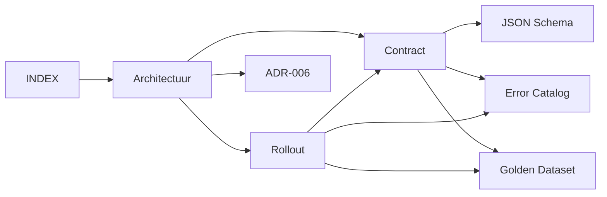

# Validation Orchestrator V2 - Document Index

> 🗺️ **Centrale navigatie hub voor alle ValidationOrchestratorV2 documentatie**
> Laatste update: 2024-12-29

## 📚 Document Hiërarchie

### 🎯 Primaire Documenten (Start Hier)
1. **[Architectuur & Migratie](./validation_orchestrator_v2.md)** ← CANONIEK
   - Status: `ACTIVE` | Type: `Architecture` | Version: `2.0`
   - Beschrijft complete architectuur, interfaces en migratiestappen

### 📋 Contracten & Specificaties
2. **[ValidationResult Contract](./contracts/validation_result_contract.md)**
   - Status: `DRAFT` | Type: `Contract` | Version: `1.0`
   - Definieert data model, versioning, JSON schema
   - → Gebruikt door: Rollout Runbook, Golden Dataset

3. **[JSON Schema](./contracts/schemas/validation_result.schema.json)**
   - Status: `DRAFT` | Type: `Schema` | Version: `1.0.0`
   - Machine-readable contract definitie
   - → Parent: ValidationResult Contract

4. **[Error Catalog](../technisch/error_catalog_validation.md)**
   - Status: `DRAFT` | Type: `Reference` | Version: `1.0`
   - Error taxonomie, codes, retry policies
   - → Gebruikt door: Contract, Rollout, Monitoring

### 🚀 Operationeel
5. **[Rollout Runbook](../workflows/validation_orchestrator_rollout.md)**
   - Status: `DRAFT` | Type: `Runbook` | Version: `1.0`
   - Shadow mode, feature flags, metrics, rollback
   - → Depends on: Contract, Error Catalog, Golden Dataset

### 🏛️ Governance
6. **[ADR-006: Validation Orchestrator Separation](../architectuur/beslissingen/ADR-006-validation-orchestrator-separation.md)**
   - Status: `PROPOSED` | Type: `Decision` | Version: `Draft`
   - Formele architectuur beslissing
   - → Rationale voor: Alle bovenstaande

### 🧪 Testing & Quality
7. **[Golden Dataset](../testing/golden-dataset-validation.md)**
   - Status: `TODO` | Type: `Test Data` | Version: `TBD`
   - Referentie dataset voor regression testing
   - → Gebruikt: Contract schema voor validatie

8. **[Test Plan](../testing/validation_orchestrator_testplan.md)**
   - Status: `TODO` | Type: `Test Strategy` | Version: `TBD`
   - Unit, integration, contract, shadow tests
   - → Test coverage voor: Alle componenten

### 📊 Monitoring & Observability
9. **[Observability Guide](../technisch/validation_observability_privacy.md)**
   - Status: `TODO` | Type: `Operations` | Version: `TBD`
   - Metrics, logging, tracing, privacy
   - → Implementeert: Error Catalog telemetry

### 🔧 Implementatie
10. **[Implementation Guide](../development/validation_orchestrator_implementation.md)**
    - Status: `TODO` | Type: `Developer Guide` | Version: `TBD`
    - Code examples, integration patterns
    - → Implements: Architecture, Contract, Error handling

## 🔄 Document Relaties

## 📌 Quick Links per Use Case

### Voor Developers
- Start: [Architectuur](./validation_orchestrator_v2.md)
- Contract: [ValidationResult](./contracts/validation_result_contract.md)
- Errors: [Catalog](../technisch/error_catalog_validation.md)
- Guide: [Implementation](../development/validation_orchestrator_implementation.md)

### Voor DevOps
- Deployment: [Rollout Runbook](../workflows/validation_orchestrator_rollout.md)
- Monitoring: [Observability](../technisch/validation_observability_privacy.md)
- Errors: [Error Catalog](../technisch/error_catalog_validation.md)

### Voor QA
- Test Data: [Golden Dataset](../testing/golden-dataset-validation.md)
- Test Plan: [Strategy](../testing/validation_orchestrator_testplan.md)
- Contract: [JSON Schema](./contracts/schemas/validation_result.schema.json)

### Voor Architecten
- Decision: [ADR-006](../architectuur/beslissingen/ADR-006-validation-orchestrator-separation.md)
- Design: [Architectuur](./validation_orchestrator_v2.md)
- Contracts: [All Specs](./contracts/)

## 🏷️ Document Metadata

| Document | Status | Owner | Last Review | Next Review |
|----------|--------|-------|-------------|-------------|
| Architectuur | ACTIVE | Architect | 2024-12-29 | 2025-01-15 |
| Contract | DRAFT | Dev Lead | - | 2025-01-05 |
| Error Catalog | DRAFT | Dev Lead | - | 2025-01-05 |
| Rollout | DRAFT | DevOps | - | 2025-01-05 |
| ADR-006 | PROPOSED | Architect | - | 2025-01-02 |

## 🔍 Zoektermen / Tags

`#validation #orchestrator #v2 #async #architecture #migration #contract #rollout #testing`

## 📝 Onderhouds Notities

- **Canoniek Document**: `validation_orchestrator_v2.md`
- **Superseded**: `validation-orchestrator-migration.md` (historisch)
- **Update Frequentie**: Bij elke sprint/milestone
- **Review Cycle**: 2-wekelijks tijdens implementatie

---
*Dit index document wordt automatisch bijgewerkt bij wijzigingen in de document structuur.*
