# AS-IS Architectuur - DefinitieAgent

**Versie**: 2.0
**Laatste Update**: 2025-08-18
**Status**: Geconsolideerd uit 7 brondocumenten

## 📋 Executive Summary

De DefinitieAgent applicatie is een Streamlit-gebaseerde tool voor het genereren en beheren van juridische definities. De huidige architectuur vertoont significante technische schuld met een centrale "God Object" (UnifiedDefinitionService) die teveel verantwoordelijkheden heeft.

### Key Metrics
- **Test Coverage**: 11% (1,154 van 10,135 statements)
- **Response Time**: 8-12 seconden per definitie generatie
- **UI Functionaliteit**: 30% tabs volledig functioneel
- **Memory Usage**: ~200MB base, oplopend tot 500MB+
- **Code Complexiteit**: 1000+ regels in UnifiedDefinitionService

## 🏗️ Architectuur Overzicht

```mermaid
graph TB
    subgraph "Frontend Layer - Streamlit UI"
        UI[Streamlit App<br/>10 Tabs - 30% Functional]
        T1[✅ Definitie Gen]
        T2[✅ Geschiedenis]
        T3[✅ Export Basic]
        T4[⚠️ Kwaliteitscontrole]
        T5[❌ Prompt Viewer]
        T6[❌ Aangepaste Def]
        T7[❌ Developer Tools]
        T8[❌ Expert Review]
        T9[❌ Externe Bronnen]
        T10[❌ Orchestratie]

        UI --> T1
        UI --> T2
        UI --> T3
        UI --> T4
        UI --> T5
        UI --> T6
        UI --> T7
        UI --> T8
        UI --> T9
        UI --> T10
    end

    subgraph "Service Layer - GOD OBJECT"
        UDS[UnifiedDefinitionService<br/>🔴 1000+ lines<br/>Singleton Pattern]

        subgraph "Mixed Responsibilities"
            GEN[Generation Logic]
            VAL[Validation Orchestration]
            CACHE[Cache Management]
            LEGACY[Legacy Compatibility]
            PROMPT[Prompt Building]
            RATE[Rate Limiting]
            ERROR[Error Handling]
        end

        UDS --> GEN
        UDS --> VAL
        UDS --> CACHE
        UDS --> LEGACY
        UDS --> PROMPT
        UDS --> RATE
        UDS --> ERROR
    end

    subgraph "AI & Validation Layer"
        AI[OpenAI GPT-4<br/>8-12 sec response]

        subgraph "Validation System"
            TOETS_ENGINE[ai_toetser<br/>Validation Engine]
            TOETS_RULES[toetsregels<br/>46 Validation Rules]
            TOETS_MGR[ToetsregelManager<br/>Rule Loading & Caching]

            TOETS_ENGINE --> TOETS_MGR
            TOETS_MGR --> TOETS_RULES
        end

        subgraph "Content Services ⚠️ DEELS WERKEND"
            WEB_MODERN[WebLookupService<br/>✅ Backend werkt<br/>28 tests passing]
            WEB_UI[❌ UI Tab Integration<br/>Niet geïmplementeerd]
            WEB_LEGACY[❌ Legacy lookups<br/>5 broken variants]
            ENRICH[❌ Synoniemen<br/>❌ Antoniemen<br/>❌ Voorbeelden]
        end
    end

    subgraph "Data Layer"
        DB[(SQLite DB<br/>⚠️ Locking Issues)]
        REPO[Repository Pattern<br/>✅ Modern]
        SESSION[Session State<br/>⚠️ Inconsistent]

        subgraph "Direct DB Access 🔴"
            UI_DB[UI → DB Direct]
            TAB_DB[Tabs → DB Direct]
        end
    end

    subgraph "Infrastructure & Config"
        subgraph "Config Chaos 🔴"
            C1[.env Config]
            C2[config.py]
            C3[settings.json]
            C4[hardcoded values]
        end

        subgraph "Import Chaos 🔴"
            I1[Relative imports ...]
            I2[Absolute imports]
            I3[sys.path hacks]
        end

        TEST[Test Suite<br/>🔴 87% Broken]
    end

    %% Connections AS-IS
    T1 --> UDS
    T2 --> UDS
    T3 --> UDS
    T4 --> UDS

    %% Direct DB violations
    T2 -.-> DB
    T3 -.-> DB

    UDS --> AI
    UDS --> TOETS_ENGINE
    UDS --> DB
    UDS --> REPO
    UDS --> SESSION

    GEN --> AI
    VAL --> TOETS_ENGINE

    %% Connections
    UDS --> WEB_MODERN
    WEB_MODERN -.-> WEB_UI
    UDS -.-> WEB_LEGACY
    UDS -.-> ENRICH

    %% Config connections
    UDS --> C1
    UDS --> C2
    UI --> C3

    classDef broken fill:#ff6b6b,stroke:#c92a2a,color:#fff
    classDef working fill:#51cf66,stroke:#2b8a3e,color:#fff
    classDef partial fill:#ffd43b,stroke:#fab005,color:#000
    classDef godObject fill:#ff8787,stroke:#fa5252,color:#fff,stroke-width:4px

    class WEB_UI,WEB_LEGACY,ENRICH,T5,T6,T7,T8,T9,T10,TEST,UI_DB,TAB_DB,I1,I2,I3 broken
    class T1,T2,T3,TOETS_ENGINE,TOETS_RULES,TOETS_MGR,REPO,WEB_MODERN working
    class T4,DB,SESSION,UI partial
    class UDS godObject
```



## 📊 Component Status

### Frontend Layer (30% Functioneel)
| Tab | Status | Functionaliteit |
|-----|--------|----------------|
| Definitie Generatie | ✅ Werkend | Basis generatie functionaliteit |
| Geschiedenis | ✅ Werkend | Bekijken van historie |
| Export | ✅ Basis | Alleen TXT export |
| Kwaliteitscontrole | ⚠️ Deels | Beperkte functionaliteit |
| Prompt Viewer | ❌ Broken | Niet geïmplementeerd |
| Aangepaste Definitie | ❌ Broken | Template systeem ontbreekt |
| Developer Tools | ❌ Broken | Debug features niet actief |
| Expert Review | ❌ Broken | Review workflow ontbreekt |
| Externe Bronnen | ❌ Broken | Backend werkt, UI tab niet geïntegreerd |
| Orchestratie | ❌ Broken | Workflow engine ontbreekt |

### Service Layer Issues

#### UnifiedDefinitionService (God Object)
- **Grootte**: 1000+ regels code
- **Verantwoordelijkheden**: 7+ verschillende concerns
- **Coupling**: Direct gekoppeld aan alle lagen
- **Testbaarheid**: Zeer moeilijk te testen in isolatie
- **Performance**: Singleton bottleneck

#### Service Container Status
- **Dependency Injection**: ✅ Geïmplementeerd
- **Service Registration**: ⚠️ Handmatig proces
- **Config Import**: ❌ Circulaire dependencies
- **Feature Flags**: ⚠️ 33% geïmplementeerd (1/3)

### Data Layer Problemen

1. **SQLite Locking**: Multi-user issues
2. **Direct DB Access**: UI components bypassen service layer
3. **Session State**: Inconsistente state management
4. **Repository Pattern**: Alleen deels geïmplementeerd

### Infrastructure Issues

#### Configuration Chaos
- 4 verschillende config systemen
- Geen centrale config management
- Hard-coded waarden verspreid door codebase
- Environment variables inconsistent gebruikt

#### Import Problems
- Mix van relative en absolute imports
- sys.path manipulatie voor imports
- Geen duidelijke module boundaries
- Circulaire dependencies

## 🔧 Technische Details

### Technology Stack
| Component | Technology | Version | Status |
|-----------|------------|---------|--------|
| Frontend | Streamlit | 1.39.0 | ✅ |
| Backend | Python | 3.11+ | ✅ |
| Database | SQLite | 3.x | ⚠️ |
| AI Service | OpenAI GPT-4 | Latest | ✅ |
| Validation | Custom (ai_toetser) | 2.0 | ✅ |
| Web Scraping | BeautifulSoup | 4.x | ⚠️ Backend werkt, UI niet |

### Directory Structure
```
src/
├── ai_toetser/          # ✅ Validation engine
├── cache/               # ⚠️ Basic caching
├── config/              # ❌ Config chaos
├── database/            # ✅ Repository pattern
├── services/            # ❌ God object anti-pattern
├── toetsregels/         # ✅ Modular validation rules
├── ui/                  # ⚠️ 30% functional
├── utils/               # ✅ Helper functions
├── validation/          # ✅ New validation system
└── web_lookup/          # ⚠️ Backend werkt, UI integratie ontbreekt
```

### Performance Karakteristieken

#### Response Times
- Definition Generation: 8-12 seconden
- Validation: 1-2 seconden
- Database Query: 50-200ms
- Web Lookup Backend: 1-3 seconden (werkend)
- Web Lookup UI: N/A (niet geïntegreerd)

#### Resource Usage
- Base Memory: ~200MB
- Peak Memory: 500MB+
- CPU Usage: Spikes tijdens generatie
- Disk I/O: Hoog door SQLite

## 🌐 Web Lookup Architectuur Detail

### Huidige Status
De web lookup functionaliteit heeft een **werkende backend** maar **ontbrekende UI integratie**:

#### Backend (✅ Werkend)
- **WebLookupService**: Moderne implementatie met 28 passing tests
- **DefinitionOrchestrator**: Integreert web lookup in generatie pipeline
- **SearchService**: Ondersteunt wetten.nl en officielebekendmakingen.nl
- **Performance**: 1-3 seconden response time

#### UI Tab (❌ Niet Geïntegreerd)
- **external_sources_tab.py**: Aanwezig maar niet aangesloten
- **Mock Implementation**: DefinitieZoeker gebruikt mock resultaten
- **Integratie Gap**: Geen connectie tussen UI en backend service

#### Legacy (❌ Deprecated)
- 5 oude lookup implementaties (alle broken)
- Moeten verwijderd worden uit codebase

## 🐛 Bekende Issues (Prioriteit Geordend)

### Kritiek (P0)
1. **Web Lookup UI Integratie**: Backend werkt (28 tests), maar UI tab toont geen resultaten
2. **Test Suite 87% Broken**: 113 van 130 tests falen
3. **Memory Leaks**: Session state accumuleert

### Hoog (P1)
1. **God Object Pattern**: UnifiedDefinitionService te groot
2. **Direct Database Access**: Security & consistency risico
3. **Config Management**: 4 conflicterende systemen

### Medium (P2)
1. **Import Structure**: Onderhoudbaarheidsprobleem
2. **Incomplete UI Tabs**: 70% functionaliteit ontbreekt
3. **No Caching Strategy**: Performance impact

### Laag (P3)
1. **Documentation Gaps**: Ontbrekende API docs
2. **Logging Inconsistency**: Verschillende log formats
3. **Code Duplication**: 20% duplicatie geschat

## 📈 Metrics & Monitoring

### Code Quality Metrics
- **Cyclomatic Complexity**: Hoog (UnifiedDefinitionService: 45+)
- **Code Duplication**: ~20%
- **Type Coverage**: 60%
- **Documentation Coverage**: 40%

### Operational Metrics
- **Uptime**: Geen monitoring
- **Error Rate**: Onbekend (geen tracking)
- **User Sessions**: Geen analytics
- **Performance**: Handmatige observatie alleen

## 🔗 Legacy & Dependencies

### Legacy Components
1. **definitie_lookup_broken.py**: Oude web scraping
2. **legacy_integration.py**: Connecties naar oude systemen
3. **validatie_toetsregels/**: Oude validatie module

### Legacy → Modern Mapping
| Legacy Component | Modern Replacement | Status | Notes |
|-----------------|-------------------|--------|-------|
| centrale_module_definitie_kwaliteit_legacy.py | UnifiedDefinitionService | ⚠️ Partial | God object probleem |
| core_legacy.py | Multiple services | 🔄 In Progress | Moet gesplitst worden |
| validatie_toetsregels/ | ai_toetser module | ✅ 90% | Enkele edge cases |
| legacy_integration.py | External adapters | ❌ Todo | Nieuwe interfaces nodig |
| old_prompt_builder.py | PromptOptimizer | 🔄 40% | Refactoring required |
| definition_generator_old.py | DefinitionGenerator service | 🔄 60% | AI logic extract |

### External Dependencies
- OpenAI API (kritiek)
- wetten.nl (✅ backend werkt)
- officielebekendmakingen.nl (✅ backend werkt)
- rechtspraak.nl (niet geïmplementeerd)

### Migration Status
- Legacy Validation → ai_toetser: 90% compleet
- Old Services → New Services: 40% compleet
- SQLite → PostgreSQL: 0% (gepland)

## 🎯 Conclusie

De huidige architectuur heeft significante technische schuld met een centrale God Object, gebroken web services, en slechts 30% werkende UI functionaliteit. De applicatie werkt voor basis taken maar mist kritieke features en heeft ernstige onderhoudbaarheids- en schaalbaarheidsuitdagingen.

**Geschatte Technical Debt**: 400-600 development uren
**Risico Level**: Hoog
**Aanbeveling**: Gefaseerde refactoring volgens TO-BE architectuur
