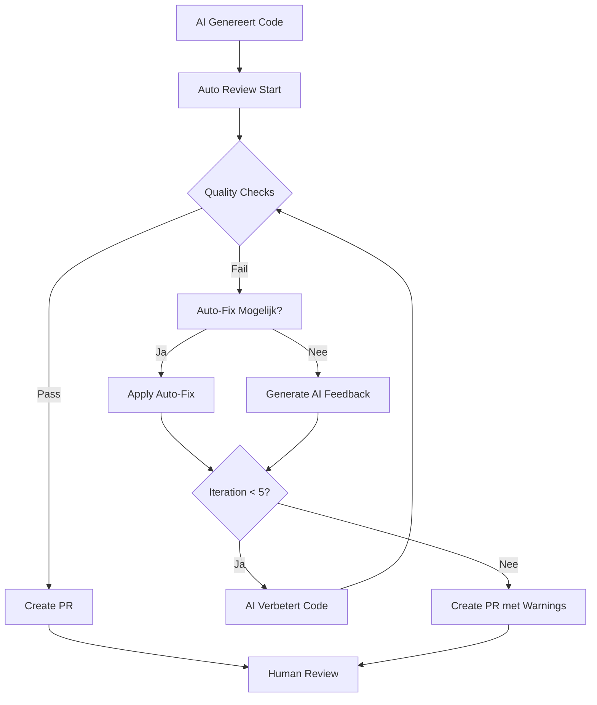

# 🤖 AI Agent Code Review Integration met Auto-Fix Loop

## Overzicht

Dit document beschrijft hoe AI agents (zoals Claude, GitHub Copilot, of custom agents) automatisch code review ondergaan met een ingebouwde verbeter-loop, specifiek aangepast voor het DefinitieAgent Python/Streamlit project.

## 🔄 Auto-Fix Feedback Loop



## 📋 Geautomatiseerde Checks

### Python-Specifieke Checks
1. **Ruff Linting** - Python style & common errors
2. **Black Formatting** - Consistent code style
3. **MyPy Type Checking** - Type safety
4. **Bandit Security** - Security vulnerabilities
5. **Pytest** - Unit tests blijven groen
6. **Coverage** - Minimaal 80% coverage behouden

### DefinitieAgent-Specifieke Checks
1. **Nederlandse Documentatie** - Docstrings in het Nederlands
2. **Streamlit Best Practices** - Session state management
3. **SQLite Connection Handling** - Proper connection pooling
4. **GPT Prompt Safety** - Injection preventie
5. **Toetsregels Compliance** - Validatie logic intact

## 🛠️ Implementatie

### 1. AI Agent Wrapper Script

```bash
#!/bin/bash
# scripts/ai-agent-wrapper.py
# Python implementatie voor betere integratie

import subprocess
import json
import sys
from pathlib import Path
from typing import Dict, List, Tuple

class AICodeReviewer:
    """Automated code review voor AI-gegenereerde code."""
    
    def __init__(self, max_iterations: int = 5):
        self.max_iterations = max_iterations
        self.current_iteration = 0
        self.issues_found = []
        self.auto_fixes_applied = []
        
    def run_quality_checks(self) -> Tuple[bool, List[Dict]]:
        """Run alle quality checks en return status + issues."""
        checks = [
            ("ruff", ["ruff", "check", "src/", "--output-format=json"]),
            ("black", ["black", "--check", "src/"]),
            ("mypy", ["mypy", "src/", "--json-output"]),
            ("bandit", ["bandit", "-r", "src/", "-f", "json"]),
            ("pytest", ["pytest", "--json-report", "--json-report-file=test-report.json"])
        ]
        
        all_passed = True
        issues = []
        
        for check_name, command in checks:
            result = subprocess.run(command, capture_output=True, text=True)
            if result.returncode != 0:
                all_passed = False
                issues.append({
                    "check": check_name,
                    "output": result.stdout or result.stderr,
                    "fixable": check_name in ["ruff", "black"]
                })
                
        return all_passed, issues
    
    def apply_auto_fixes(self, issues: List[Dict]) -> int:
        """Pas automatische fixes toe waar mogelijk."""
        fixes_applied = 0
        
        for issue in issues:
            if issue["fixable"]:
                if issue["check"] == "ruff":
                    subprocess.run(["ruff", "check", "src/", "--fix"])
                    fixes_applied += 1
                elif issue["check"] == "black":
                    subprocess.run(["black", "src/"])
                    fixes_applied += 1
                    
        return fixes_applied
    
    def generate_ai_feedback(self, issues: List[Dict]) -> str:
        """Genereer feedback voor AI agent om issues te fixen."""
        feedback = "# Code Review Feedback\n\n"
        feedback += "De volgende issues moeten worden opgelost:\n\n"
        
        for issue in issues:
            if not issue["fixable"]:
                feedback += f"## {issue['check'].upper()} Issues\n"
                feedback += "```\n"
                feedback += issue["output"][:1000]  # Limit output
                feedback += "\n```\n\n"
                
                # Add specific guidance
                if issue["check"] == "mypy":
                    feedback += "**Fix suggestie**: Voeg type hints toe aan alle functies.\n\n"
                elif issue["check"] == "bandit":
                    feedback += "**Fix suggestie**: Controleer security warnings en pas code aan.\n\n"
                elif issue["check"] == "pytest":
                    feedback += "**Fix suggestie**: Fix failing tests of pas tests aan voor nieuwe functionaliteit.\n\n"
                    
        return feedback
    
    def create_pr_report(self) -> str:
        """Maak een PR report met alle iteraties en fixes."""
        report = "# AI Code Review Report\n\n"
        report += f"**AI Agent**: {os.getenv('AI_AGENT_NAME', 'Unknown')}\n"
        report += f"**Iterations**: {self.current_iteration}\n"
        report += f"**Auto-fixes Applied**: {len(self.auto_fixes_applied)}\n\n"
        
        if self.issues_found:
            report += "## Remaining Issues\n"
            for issue in self.issues_found:
                report += f"- {issue}\n"
        else:
            report += "✅ All checks passed!\n"
            
        return report
```

### 2. Git Pre-commit Hook

```bash
#!/bin/bash
# .git/hooks/pre-commit
# Check if commit is from AI agent

if [ -n "$AI_AGENT_COMMIT" ]; then
    echo "🤖 AI Agent commit detected, running enhanced review..."
    python scripts/ai-agent-wrapper.py
    exit $?
fi

# Normal pre-commit flow
pre-commit run --all-files
```

### 3. Integration met AI Tools

#### Claude (via API)
```python
def claude_code_review_loop():
    """Integration met Claude API voor code improvements."""
    
    reviewer = AICodeReviewer()
    
    for iteration in range(reviewer.max_iterations):
        # Run checks
        passed, issues = reviewer.run_quality_checks()
        
        if passed:
            print(f"✅ All checks passed in iteration {iteration + 1}")
            break
            
        # Try auto-fixes first
        fixes = reviewer.apply_auto_fixes(issues)
        if fixes > 0:
            continue
            
        # Generate feedback voor Claude
        feedback = reviewer.generate_ai_feedback(issues)
        
        # Call Claude API (pseudo-code)
        response = claude_api.messages.create(
            model="claude-3-opus-20240229",
            messages=[{
                "role": "user",
                "content": f"Fix deze code issues:\n\n{feedback}\n\nHuidige code:\n{read_code()}"
            }]
        )
        
        # Apply Claude's suggestions
        apply_claude_fixes(response.content)
```

#### GitHub Copilot Integration
```python
# .github/copilot-instructions.md
"""
Wanneer je code genereert voor dit project:
1. Gebruik type hints voor alle functies
2. Schrijf docstrings in het Nederlands
3. Handle SQLite connections met context managers
4. Valideer user input tegen prompt injection
5. Voeg tests toe voor nieuwe functionaliteit
"""
```

## 📊 Monitoring & Metrics

### Success Rate Tracking
```python
# scripts/ai_metrics.py
import json
from datetime import datetime
from collections import defaultdict

class AIMetricsTracker:
    def __init__(self, metrics_file="ai_metrics.json"):
        self.metrics_file = metrics_file
        self.metrics = self.load_metrics()
        
    def record_review(self, agent_name: str, iterations: int, 
                     passed: bool, issues_found: List[str]):
        """Record een AI code review sessie."""
        
        if agent_name not in self.metrics:
            self.metrics[agent_name] = {
                "total_reviews": 0,
                "successful_reviews": 0,
                "average_iterations": 0,
                "common_issues": defaultdict(int)
            }
            
        agent_metrics = self.metrics[agent_name]
        agent_metrics["total_reviews"] += 1
        
        if passed:
            agent_metrics["successful_reviews"] += 1
            
        # Update average iterations
        current_avg = agent_metrics["average_iterations"]
        new_avg = (current_avg * (agent_metrics["total_reviews"] - 1) + iterations) / agent_metrics["total_reviews"]
        agent_metrics["average_iterations"] = new_avg
        
        # Track common issues
        for issue in issues_found:
            agent_metrics["common_issues"][issue] += 1
            
        self.save_metrics()
```

### Dashboard View
```python
def generate_dashboard():
    """Generate een simpel dashboard view."""
    tracker = AIMetricsTracker()
    
    print("🤖 AI Agent Performance Dashboard")
    print("=" * 50)
    
    for agent, metrics in tracker.metrics.items():
        success_rate = (metrics["successful_reviews"] / metrics["total_reviews"]) * 100
        print(f"\n{agent}:")
        print(f"  Success Rate: {success_rate:.1f}%")
        print(f"  Average Iterations: {metrics['average_iterations']:.1f}")
        print(f"  Total Reviews: {metrics['total_reviews']}")
        
        print("  Common Issues:")
        for issue, count in sorted(metrics["common_issues"].items(), 
                                 key=lambda x: x[1], reverse=True)[:3]:
            print(f"    - {issue}: {count} times")
```

## 🔒 Security Considerations

### AI Agent Sandboxing
1. **Limited Permissions** - AI agents kunnen alleen in feature branches
2. **No Direct Main Access** - Altijd via PR met human review
3. **Secret Scanning** - Automatische check op exposed secrets
4. **Dependency Scanning** - Check nieuwe dependencies

### Prompt Injection Protection
```python
def validate_ai_code(code: str) -> bool:
    """Valideer dat AI geen malicious patterns heeft toegevoegd."""
    
    dangerous_patterns = [
        r"eval\s*\(",
        r"exec\s*\(",
        r"__import__",
        r"subprocess.*shell\s*=\s*True",
        r"os\.system",
    ]
    
    for pattern in dangerous_patterns:
        if re.search(pattern, code):
            raise SecurityError(f"Dangerous pattern detected: {pattern}")
            
    return True
```

## 🚀 Getting Started

### 1. Setup
```bash
# Install dependencies
pip install -r requirements-dev.txt

# Setup git hooks
cp scripts/ai-pre-commit .git/hooks/pre-commit
chmod +x .git/hooks/pre-commit

# Configure AI agent
export AI_AGENT_NAME="Claude"
export AI_REVIEW_ENABLED=true
```

### 2. Gebruik
```bash
# Voor AI commits
AI_AGENT_COMMIT=1 git commit -m "AI: implement new feature"

# Monitor metrics
python scripts/ai_metrics.py --dashboard
```

### 3. Configuration
```yaml
# .ai-review-config.yaml
max_iterations: 5
auto_fix_enabled: true
checks:
  - ruff
  - black
  - mypy
  - bandit
  - pytest
  
thresholds:
  coverage_min: 80
  complexity_max: 10
  
ai_agents:
  claude:
    model: claude-3-opus-20240229
    temperature: 0.3
  github_copilot:
    enabled: true
```

## 📈 Best Practices

### Voor AI Agents
1. **Start Klein** - Laat AI kleine, focused changes maken
2. **Context Geven** - Provide relevante code context
3. **Specificeer Requirements** - Wees expliciet over code standards
4. **Review Output** - AI output altijd human-reviewen

### Voor Developers
1. **Monitor Metrics** - Track welke AI agents best presteren
2. **Update Feedback** - Verbeter feedback templates based op patterns
3. **Train AI** - Gebruik succesvolle fixes als training examples
4. **Security First** - Alle AI code moet security checks doorstaan

---

*Remember: AI agents zijn tools om productiviteit te verhogen, niet om code review te vervangen!*