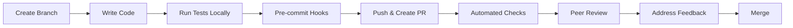
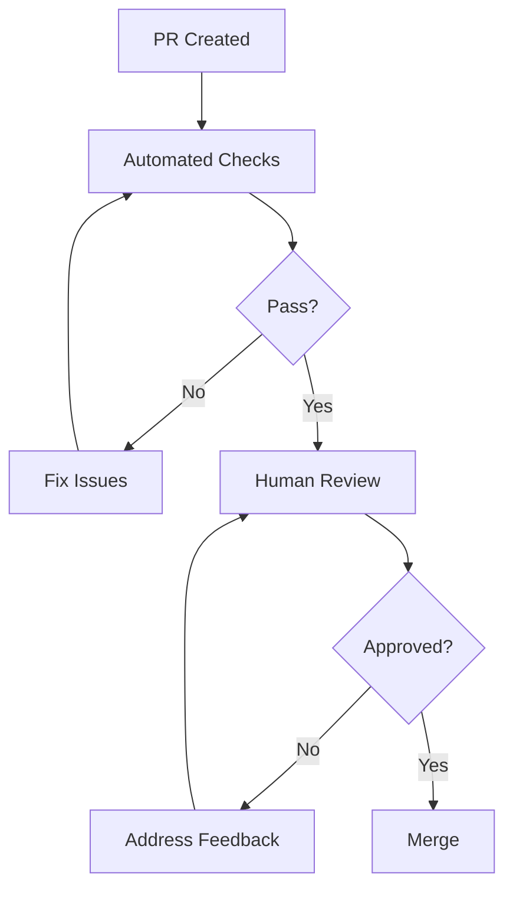

# 📚 Development Documentation Overview

Welcome to the DefinitieAgent development documentation. This guide helps you navigate our development practices, tools, and workflows.

## 🗂️ Documentation Structure

### 1. [Code Review Protocol](../CODE_REVIEW_PROTOCOL.md)
**Purpose**: Comprehensive guide for conducting thorough code reviews
**When to use**: When reviewing pull requests or conducting code audits
**Key sections**:
- 7-phase review process with time boxes
- Security & performance checklists
- Risk-based prioritization
- Team collaboration guidelines

### 2. [Quick Reference Card](../code-review-quick-reference.md)
**Purpose**: Fast lookup for common issues during reviews
**When to use**: Keep open during code reviews for quick checks
**Key sections**:
- Review priority order
- Python red flags & gotchas
- Code smell indicators
- Comment templates

### 3. [Automated Review Setup](../automated-review-setup.md)
**Purpose**: Configure automated tools to catch issues early
**When to use**: Initial project setup or tool updates
**Key sections**:
- Pre-commit hooks configuration
- Linting & formatting tools
- Security scanning setup
- CI/CD integration

### 4. AI Agent Integration
**Purpose**: Automated review for AI-generated code with fix loop
**When to use**: When using AI tools to generate code
**Key sections**:
- Auto-fix feedback loop (max 5 iterations)
- Python-specific checks
- Security considerations
- Metrics tracking

### 5. This Document
**Purpose**: Navigation hub for all development documentation
**When to use**: Starting point for new developers or finding specific guides

## 🚀 Quick Start for New Developers

### Day 1: Environment Setup
1. Clone the repository
2. Follow [Automated Review Setup](../automated-review-setup.md) to install tools
3. Run `make install` to set up pre-commit hooks
4. Configure your IDE using provided settings

### Day 2: Understanding Standards
1. Read the [Code Review Protocol](../CODE_REVIEW_PROTOCOL.md) overview
2. Bookmark the [Quick Reference Card](../code-review-quick-reference.md)
3. Run `make quality` to see our standards in action
4. Review recent merged PRs to see examples

### Day 3: First Contribution
1. Create feature branch: `git checkout -b feature/your-feature`
2. Make changes with pre-commit hooks active
3. Run `make quality` before pushing
4. Create PR with our template
5. Address review feedback using our guidelines

## 📋 Development Workflows

### Feature Development Flow


### Code Review Flow


## 🛠️ Tool Overview

### Essential Tools
| Tool | Purpose | Command |
|------|---------|---------|
| **Ruff** | Fast Python linting | `ruff check .` |
| **Black** | Code formatting | `black .` |
| **MyPy** | Type checking | `mypy src/` |
| **Pytest** | Testing framework | `pytest` |
| **Coverage** | Test coverage | `coverage run -m pytest` |
| **Bandit** | Security scanning | `bandit -r src/` |

### Make Commands
```bash
make install      # Set up development environment
make lint         # Run linting checks
make format       # Auto-format code
make test         # Run test suite
make coverage     # Generate coverage report
make security     # Run security scans
make quality      # Run all checks
```

## 📊 Quality Standards

### Code Metrics
- **Test Coverage**: Minimum 80%, target 90%
- **Cyclomatic Complexity**: Maximum 10 per function
- **Method Length**: Maximum 50 lines
- **Class Length**: Maximum 300 lines
- **Type Coverage**: 100% for public APIs

### Review Standards
- **Response Time**: Within 24 hours
- **Blocking Issues**: Must be resolved before merge
- **Security Vulnerabilities**: Zero tolerance for HIGH/CRITICAL
- **Performance Regressions**: Must be justified or fixed

## 🔗 Related Resources

### Internal Documentation
- Project Architecture
- API Documentation
- Testing Guide
- Deployment Guide

### External Resources
- [Python Best Practices](https://docs.python-guide.org/)
- [Effective Python](https://effectivepython.com/)
- [Security Guidelines](https://python.readthedocs.io/en/latest/library/security_warnings.html)

## 📝 Contributing to Documentation

### Documentation Standards
- Write in clear, concise English (or Dutch where appropriate)
- Use examples to illustrate concepts
- Keep documents focused on a single topic
- Update when implementing changes

### Documentation Review
- Documentation PRs follow same review process
- Technical accuracy is priority
- Check for outdated information
- Ensure examples work

## 🆘 Getting Help

### Resources
1. **Slack Channel**: #definitie-agent-dev
2. **Team Meetings**: Weekly on Thursdays
3. **Documentation**: You're reading it!
4. **Code Examples**: Check recently merged PRs

### Escalation Path
1. Check documentation
2. Search existing issues/PRs
3. Ask in Slack channel
4. Schedule pairing session
5. Escalate to tech lead

## 🔄 Continuous Improvement

We regularly update our practices based on:
- Team retrospectives
- Tool improvements
- Security advisories
- Performance metrics

**Last Updated**: 2025-01-15
**Next Review**: 2025-04-15

---

*Remember: Good documentation is as important as good code!*
