# DefinitieAgent 2.0 - Architectuur Diagrammen

**Versie:** 2.2 - UI Flow & Error Handling Enhancement  
**Laatste Update:** 2025-07-14  
**Features:** Document Upload, Hybrid Context Verrijking, Web Lookup Integratie

Deze architectuur diagrammen tonen de complete structuur van DefinitieAgent 2.0 inclusief de nieuwe document upload functionaliteit en hybride context verrijking die web lookup combineert met document processing voor optimale definitie generatie.

## 1. Component Overzicht Diagram

```mermaid
graph TB
    subgraph "🖥️ User Interface Layer"
        UI[Streamlit UI]
        TI[Tabbed Interface]
        CTX[Context Selector]
        DGT[Definition Generator Tab]
        ERT[Expert Review Tab]
        HT[History Tab]
        ET[Export Tab]
    end

    subgraph "🧠 Business Logic Layer"
        DA[Definitie Agent]
        DG[Definitie Generator]
        DV[Definitie Validator]
        DC[Definitie Checker]
        AI[AI Toetser]
        VB[Voorbeelden Generator]
        DP[Document Processor]
    end

    subgraph "🔧 Service Layer"
        DS[Definition Service]
        AS[Async Service]
        WL[Web Lookup Service]
        EX[Export Service]
        DE[Document Extractor]
    end

    subgraph "💾 Data Layer"
        DR[Definitie Repository]
        DB[(SQLite Database)]
        CH[Cache Manager]
        FS[(File System)]
        DM[Document Metadata Store]
    end

    subgraph "🌐 External APIs"
        GPT[OpenAI GPT API]
        WP[Wikipedia API]
        LD[Legal Databases]
        WK[Wiktionary API]
    end

    subgraph "⚙️ Infrastructure"
        CF[Config Manager]
        RL[Rate Limiter]
        RES[Resilience Layer]
        LOG[Logging System]
    end

    %% User Interface connections
    UI --> TI
    TI --> CTX
    TI --> DGT
    TI --> ERT
    TI --> HT
    TI --> ET

    %% UI to Business Logic
    DGT --> DC
    DGT --> DA
    DGT --> DP
    ERT --> DR
    HT --> DR
    ET --> EX

    %% Business Logic connections
    DC --> DR
    DA --> DG
    DA --> DV
    DG --> AI
    DG --> VB
    DG --> DP
    AI --> CF
    DP --> DE

    %% Service Layer connections
    DA --> DS
    DG --> AS
    VB --> WL
    DP --> WL
    ET --> EX
    DE --> FS

    %% Data Layer connections
    DS --> DR
    DR --> DB
    AS --> CH
    CH --> FS
    DP --> DM
    DM --> FS

    %% External API connections
    DG --> GPT
    WL --> WP
    WL --> LD
    WL --> WK

    %% Infrastructure connections
    AS --> RL
    AS --> RES
    DS --> LOG
    CF --> LOG

    style UI fill:#e1f5fe
    style DA fill:#f3e5f5
    style DR fill:#e8f5e8
    style GPT fill:#fff3e0
    style CF fill:#fce4ec
```



## 2. Data Flow Diagram - Definitie Generatie met Document Upload


## 3. API Structuur Diagram


## 4. Database Relaties Diagram


## 5. Deployment Architectuur Diagram

```mermaid
graph TB
    subgraph "💻 Local Development"
        DEV[Development Environment]
        subgraph "Dev Stack"
            DAPP[Streamlit App :8501]
            DDB[(SQLite Database)]
            DCACHE[File Cache]
            DLOG[Local Logs]
        end
    end

    subgraph "🧪 Testing Environment"
        TEST[Testing Environment]
        subgraph "Test Stack"
            TAPP[Test Streamlit :8502]
            TDB[(Test Database)]
            TCACHE[Test Cache]
            TLOG[Test Logs]
        end
    end

    subgraph "🚀 Production Environment"
        PROD[Production Environment]
        subgraph "Prod Stack"
            PAPP[Production App :80]
            PDB[(Production Database)]
            PCACHE[Production Cache]
            PLOG[Production Logs]
            PMON[Monitoring]
        end
    end

    subgraph "☁️ External Services"
        OPENAI[OpenAI API]
        WIKI[Wikipedia API]
        LEGAL[Legal Databases]
        BACKUP[Backup Storage]
    end

    subgraph "📁 File System Structure"
        FS[File System]
        subgraph "Directory Structure"
            SRC[/src - Source Code]
            CONF[/config - Configuration]
            DATA[/data - Database Files]
            CACHE_DIR[/cache - Cache Files]
            EXPORT[/exports - Generated Exports]
            LOG_DIR[/log - Application Logs]
            DOC_DIR[/data/uploaded_documents - Document Storage]
        end
    end

    subgraph "⚙️ Configuration Management"
        CONFIG[Configuration System]
        subgraph "Config Files"
            YAML_DEF[config_default.yaml]
            YAML_DEV[config_development.yaml]
            YAML_TEST[config_testing.yaml]
            YAML_PROD[config_production.yaml]
            ENV[Environment Variables]
        end
    end

    %% Environment connections
    DEV --> DAPP
    DAPP --> DDB
    DAPP --> DCACHE
    DAPP --> DLOG

    TEST --> TAPP
    TAPP --> TDB
    TAPP --> TCACHE
    TAPP --> TLOG

    PROD --> PAPP
    PAPP --> PDB
    PAPP --> PCACHE
    PAPP --> PLOG
    PAPP --> PMON

    %% External service connections
    DAPP --> OPENAI
    TAPP --> OPENAI
    PAPP --> OPENAI

    DAPP --> WIKI
    TAPP --> WIKI
    PAPP --> WIKI

    DAPP --> LEGAL
    TAPP --> LEGAL
    PAPP --> LEGAL

    PDB --> BACKUP

    %% File system connections
    DAPP --> FS
    TAPP --> FS
    PAPP --> FS

    FS --> SRC
    FS --> CONF
    FS --> DATA
    FS --> CACHE_DIR
    FS --> EXPORT
    FS --> LOG_DIR
    FS --> DOC_DIR

    %% Configuration connections
    DAPP --> CONFIG
    TAPP --> CONFIG
    PAPP --> CONFIG

    CONFIG --> YAML_DEF
    CONFIG --> YAML_DEV
    CONFIG --> YAML_TEST
    CONFIG --> YAML_PROD
    CONFIG --> ENV

    style DEV fill:#e8f5e8
    style TEST fill:#fff3e0
    style PROD fill:#ffebee
    style OPENAI fill:#e3f2fd
    style CONFIG fill:#f3e5f5
```

## 6. Cache & Performance Architectuur


## 7. Security & Compliance Diagram


## 8. AI Integration Architectuur

```mermaid
graph TB
    subgraph "🤖 AI Services Layer"
        subgraph "Generation Services"
            DEF_GEN[Definition Generator]
            EX_GEN[Example Generator]
            FEEDBACK[Feedback Generator]
        end

        subgraph "Validation Services"
            RULE_VAL[Rule Validator]
            QUALITY[Quality Checker]
            COMPLIANCE[Compliance Checker]
        end

        subgraph "Enhancement Services"
            SYNONYM[Synonym Generator]
            TRANSLATION[Translation Service]
            SUMMARY[Summary Generator]
            DOC_ENHANCE[Document Enhancement]
            HYBRID_CTX[Hybrid Context Builder]
        end
    end

    subgraph "🧠 AI Models"
        GPT4[GPT-4 Turbo]
        GPT35[GPT-3.5 Turbo]
        EMBEDDING[Text Embeddings]
        CUSTOM[Custom Models]
    end

    subgraph "📝 Prompt Management"
        TEMPLATES[Prompt Templates]
        CONTEXT[Context Builder]
        OPTIMIZER[Prompt Optimizer]
    end

    subgraph "⚡ Performance"
        CACHE_AI[AI Response Cache]
        BATCH[Batch Processing]
        ASYNC_AI[Async Processing]
    end

    %% AI Service connections
    DEF_GEN --> GPT4
    EX_GEN --> GPT35
    FEEDBACK --> GPT4
    RULE_VAL --> GPT35
    QUALITY --> GPT4
    COMPLIANCE --> GPT4
    SYNONYM --> GPT35
    TRANSLATION --> GPT4
    SUMMARY --> GPT35
    DOC_ENHANCE --> GPT35
    HYBRID_CTX --> GPT4

    %% Embedding connections
    RULE_VAL --> EMBEDDING
    QUALITY --> EMBEDDING

    %% Prompt management
    DEF_GEN --> TEMPLATES
    TEMPLATES --> CONTEXT
    CONTEXT --> OPTIMIZER

    %% Performance
    DEF_GEN --> CACHE_AI
    EX_GEN --> BATCH
    FEEDBACK --> ASYNC_AI

    style DEF_GEN fill:#e3f2fd
    style GPT4 fill:#ffebee
    style TEMPLATES fill:#e8f5e8
    style CACHE_AI fill:#fff3e0
```



## 9. Hybride Context Verrijking Architectuur

```mermaid
graph TB
    subgraph "📄 Document Processing Pipeline"
        subgraph "Upload & Extraction"
            UP[Document Upload]
            EXT[Text Extraction]
            META[Metadata Analysis]
        end
        
        subgraph "Content Analysis"
            KW[Keyword Extraction]
            CONC[Concept Identification]
            LEG[Legal Reference Detection]
            HINT[Context Hints Generation]
        end
        
        subgraph "Document Intelligence"
            CLASS[Document Classification]
            TOPIC[Topic Modeling]
            REL[Relevance Scoring]
        end
    end

    subgraph "🌐 Web Lookup Integration"
        subgraph "Source Selection"
            SMART[Smart Source Selector]
            PRIO[Priority Engine]
            FILTER[Context Filter]
        end
        
        subgraph "Enhanced Lookup"
            WIKI[Wikipedia Enhanced]
            LEGAL_WEB[Legal Databases Enhanced]
            GOV[Government Sources Enhanced]
            DICT[Dictionary Enhanced]
        end
        
        subgraph "Result Enhancement"
            MERGE[Result Merger]
            DEDUP[Deduplication]
            RANK[Relevance Ranking]
        end
    end

    subgraph "🔄 Hybrid Context Engine"
        subgraph "Context Fusion"
            AGG[Context Aggregator]
            WEIGHT[Weighted Combination]
            VALIDATE[Cross-Validation]
        end
        
        subgraph "Intelligence Layer"
            MATCH[Document-Web Matching]
            CONFLICT[Conflict Resolution]
            CONFIDENCE[Confidence Scoring]
        end
        
        subgraph "Output Generation"
            UNIFIED[Unified Context]
            SOURCES[Source Attribution]
            ENRICHED[Enriched Prompt]
        end
    end

    subgraph "🎯 Definition Generation"
        GPT_ENHANCED[GPT with Hybrid Context]
        QUALITY_CHECK[Enhanced Quality Check]
        RESULT[Enhanced Definition]
    end

    %% Document Processing Flow
    UP --> EXT
    EXT --> META
    META --> KW
    META --> CONC
    META --> LEG
    KW --> HINT
    CONC --> HINT
    LEG --> HINT
    
    %% Document Intelligence
    HINT --> CLASS
    CLASS --> TOPIC
    TOPIC --> REL

    %% Web Lookup Enhancement
    CLASS --> SMART
    TOPIC --> PRIO
    REL --> FILTER
    
    SMART --> WIKI
    SMART --> LEGAL_WEB
    SMART --> GOV
    SMART --> DICT
    
    WIKI --> MERGE
    LEGAL_WEB --> MERGE
    GOV --> MERGE
    DICT --> MERGE
    
    MERGE --> DEDUP
    DEDUP --> RANK

    %% Hybrid Context Generation
    HINT --> AGG
    RANK --> AGG
    AGG --> WEIGHT
    WEIGHT --> VALIDATE
    VALIDATE --> MATCH
    MATCH --> CONFLICT
    CONFLICT --> CONFIDENCE
    CONFIDENCE --> UNIFIED
    UNIFIED --> SOURCES
    SOURCES --> ENRICHED

    %% Final Generation
    ENRICHED --> GPT_ENHANCED
    GPT_ENHANCED --> QUALITY_CHECK
    QUALITY_CHECK --> RESULT

    style UP fill:#e3f2fd
    style SMART fill:#e8f5e8
    style AGG fill:#fff3e0
    style GPT_ENHANCED fill:#ffebee
```



## 10. Context Enrichment Data Flow


---

## Diagram Implementatie Instructies

### Voor Mermaid Diagrammen:
1. Kopieer de mermaid code naar [mermaid.live](https://mermaid.live)
2. Of gebruik een Mermaid plugin in je editor (VS Code, IntelliJ)
3. Export als SVG/PNG voor documentatie

### Voor Uitgebreide Visualisatie:
- **Lucidchart**: Voor professionele diagrammen
- **Draw.io**: Gratis online diagram tool
- **PlantUML**: Voor tekstuele diagram definitie
- **Visio**: Voor Microsoft omgevingen

### Kleuren Schema:
- 🔵 **Blauw** (#e3f2fd): User Interface componenten
- 🟢 **Groen** (#e8f5e8): Data & Storage componenten  
- 🟠 **Oranje** (#fff3e0): External Services & APIs
- 🔴 **Rood** (#ffebee): AI Services & Critical components
- 🟣 **Paars** (#f3e5f5): Configuration & Infrastructure

Deze diagrammen geven een complete overview van de DefinitieAgent architectuur en kunnen als basis dienen voor verdere ontwikkeling en documentatie.

## 11. UI User Flow Diagram


## 12. Error Handling Flow Diagram


## Update Summary v2.2

**Nieuwe Diagrammen:**
- UI User Flow Diagram: Toont huidige workflow problemen en gewenste flow
- Error Handling Flow Diagram: Visualiseert error handling strategie

**Highlighted Issues:**
- Term input navigatie probleem (rood gemarkeerd)
- Context selector complexiteit (oranje gemarkeerd)

Deze update reflecteert de UI regressie issues en voorgestelde verbeteringen uit de consolidatie.