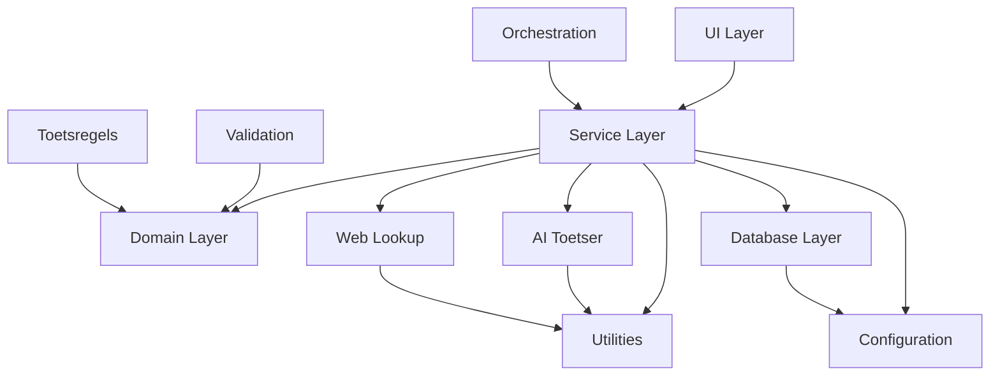

# Source Tree Structure - DefinitieAgent

## Overzicht

Dit document beschrijft de structuur van de DefinitieAgent codebase, inclusief de organisatie van modules, verantwoordelijkheden en belangrijke design beslissingen.

## Root Directory Structure

```
definitie-app/
├── .bmad-core/           # BMad method configuratie en agents
├── .github/              # GitHub Actions workflows
├── docs/                 # Projectdocumentatie
│   ├── architectuur/     # Architectuur documenten
│   ├── archief/          # Gearchiveerde documentatie
│   └── brief.md          # Project brief
├── src/                  # Source code (zie details hieronder)
├── tests/                # Test suites
├── app.py                # Streamlit applicatie entry point
├── pyproject.toml        # Project configuratie en dependencies
├── requirements.txt      # Python dependencies
├── .env.example          # Environment variables template
└── README.md            # Project overview
```

## Source Code Structure (`src/`)

### Top-Level Modules

```
src/
├── __init__.py
├── ai_toetser/          # AI validatie componenten
├── config/              # Configuratie management
├── database/            # Database layer en migrations
├── document_processing/ # Document verwerking
├── domain/              # Domain models en business logic
├── orchestration/       # Orchestratie logica
├── services/            # Core services
├── toetsregels/         # Validatie regels
├── ui/                  # Streamlit UI componenten
├── utils/               # Utilities en helpers
├── validation/          # Input validatie
└── web_lookup/          # Externe data integratie
```

### Module Details

#### `ai_toetser/` - AI Validation Components

**Doel**: Bevat AI-gebaseerde validatie en toetsing functionaliteit.

```
ai_toetser/
├── __init__.py
├── ai_toetser.py        # Hoofdklasse voor AI toetsing
└── prompts/             # Prompt templates voor validatie
```

**Verantwoordelijkheden**:
- AI-gebaseerde kwaliteitscontrole
- Definitie validatie via LLM
- Suggesties voor verbeteringen

#### `config/` - Configuration Management

**Doel**: Centraal configuratiebeheer voor de applicatie.

```
config/
├── __init__.py
├── config_manager.py    # ConfigManager class
├── exceptions.py        # Configuratie exceptions
└── schemas/            # Configuratie schema's
```

**Verantwoordelijkheden**:
- Environment variable management
- YAML configuratie parsing
- Feature flags
- Runtime configuratie

#### `database/` - Database Layer

**Doel**: Database abstractie, models en migrations.

```
database/
├── __init__.py
├── models.py           # SQLAlchemy models
├── repository.py       # Repository pattern implementatie
├── migrations/         # Database migrations
│   └── schema.sql     # Database schema definitie
└── session.py         # Database session management
```

**Verantwoordelijkheden**:
- Database connectiviteit
- CRUD operaties
- Schema management
- Query optimalisatie

#### `document_processing/` - Document Processing

**Doel**: Document parsing, extractie en verwerking.

```
document_processing/
├── __init__.py
├── processor.py        # Document processor
├── extractors/         # Content extractors
└── formatters/         # Output formatters
```

**Verantwoordelijkheden**:
- PDF/Word document parsing
- Content extractie
- Metadata verwerking
- Format conversies

#### `domain/` - Domain Models

**Doel**: Core business domain models en logica.

```
domain/
├── __init__.py
├── models.py           # Domain entities
├── value_objects.py    # Value objects
├── enums.py           # Domain enumeraties
└── exceptions.py       # Domain exceptions
```

**Key Models**:
- `Definition`: Hoofdmodel voor definities
- `DefinitionCategory`: Type, Proces, Resultaat, Exemplaar
- `ValidationResult`: Validatie resultaten
- `DefinitionContext`: Context informatie

#### `orchestration/` - Orchestration Logic

**Doel**: Coördinatie van complexe workflows en processen.

```
orchestration/
├── __init__.py
├── base_orchestrator.py    # Abstract orchestrator
├── v2_orchestrator.py      # V2 async orchestrator
└── strategies/             # Orchestratie strategieën
```

**Verantwoordelijkheden**:
- Multi-step workflow coördinatie
- Service compositie
- Error recovery
- State management

#### `services/` - Core Services

**Doel**: Belangrijkste business services en functionaliteit.

```
services/
├── __init__.py
├── ai_service.py           # AI service interface
├── ai_service_v2.py        # V2 AI implementatie
├── async_gpt_client.py     # Async OpenAI client
├── cache_service.py        # Caching functionaliteit
├── definition_service.py    # Definitie business logic
├── orchestrators/          # Service-specifieke orchestrators
│   ├── definition_orchestrator_v2.py
│   └── prompt_orchestrator.py
├── prompts/               # Prompt management
│   ├── base_module.py    # Base prompt module
│   ├── module_registry.py # Module registratie
│   └── modules/          # 18+ prompt modules
└── service_container.py   # Dependency injection container
```

**Key Services**:
- **AIService**: Interface voor AI operaties
- **CacheService**: In-memory caching
- **DefinitionService**: Definitie CRUD en business logic
- **AsyncGPTClient**: Async OpenAI integratie

#### `services/prompts/modules/` - Prompt Modules

**Doel**: Modulaire prompt generatie systeem.

```
modules/
├── achtergrond.py         # Context achtergrond
├── algemene_kennis.py     # Algemene kennis integratie
├── beschrijving.py        # Beschrijving generatie
├── context.py             # Context verwerking
├── dynamische_elementen.py # Dynamische content
├── gerelateerde_begrippen.py # Gerelateerde termen
├── gvi.py                 # Generation-Validation-Integration
├── juridische_context.py   # Juridische context
├── ontologie.py           # Ontologische classificatie
├── prompt_formatter.py     # Prompt formatting
├── reflectie.py           # Zelf-reflectie
├── samenvatting.py        # Samenvattingen
├── structuur.py           # Structurele formatting
├── taal.py                # Taal verwerking
├── validatie.py           # Validatie prompts
├── verbetering.py         # Verbetering suggesties
├── voorbeeld.py           # Voorbeeld generatie
└── voorbeeld_zin.py       # Voorbeeld zinnen
```

#### `toetsregels/` - Validation Rules

**Doel**: Implementatie van 40+ validatie regels.

```
toetsregels/
├── __init__.py
├── base_rule.py           # Abstract base regel
├── regel_factory.py       # Regel instantiatie
├── arai/                  # Afbakening regels
├── con/                   # Context regels
├── ess/                   # Essentiële element regels
├── int/                   # Integriteit regels
├── sam/                   # Samenhang regels
├── str/                   # Structuur regels
└── ver/                   # Verificatie regels
```

**Regel Categorieën**:
- **ARAI**: Afbakening, Reikwijdte, Afbakening Inhoud
- **CON**: Context, Consistentie
- **ESS**: Essentiële elementen
- **INT**: Integriteit, Internal consistency
- **SAM**: Samenhang, Samenvatting
- **STR**: Structuur validatie
- **VER**: Verificatie

#### `ui/` - User Interface

**Doel**: Streamlit UI componenten en pages.

```
ui/
├── __init__.py
├── main_page.py           # Hoofdpagina
├── components/            # Herbruikbare UI componenten
│   ├── definition_form.py
│   ├── results_display.py
│   └── sidebar.py
├── pages/                 # Streamlit pages
│   ├── generator.py      # Definitie generator
│   ├── validator.py      # Validatie interface
│   └── history.py        # Historie weergave
└── styles/               # CSS en styling
```

**Verantwoordelijkheden**:
- User interface rendering
- Form handling
- Session state management
- Result visualisatie

#### `utils/` - Utilities

**Doel**: Algemene utilities en helper functies.

```
utils/
├── __init__.py
├── async_utils.py         # Async helpers
├── cache_utils.py         # Cache utilities
├── logging_utils.py       # Logging configuratie
├── resilience.py          # Circuit breakers, retries
├── sanitizer.py           # Input sanitization
└── validators.py          # Input validators
```

**Key Utilities**:
- **AsyncUtils**: Async pattern helpers
- **Resilience**: Retry logic, circuit breakers
- **Sanitizer**: XSS preventie, input cleaning
- **Validators**: Format validatie

#### `validation/` - Input Validation

**Doel**: Input validatie en sanitization.

```
validation/
├── __init__.py
├── input_validator.py     # Input validatie logic
├── schemas.py            # Validatie schema's
└── exceptions.py         # Validatie exceptions
```

#### `web_lookup/` - External Data Integration

**Doel**: Integratie met externe data bronnen.

```
web_lookup/
├── __init__.py
├── lookup_service.py      # Web lookup service
├── scrapers/             # Web scrapers
├── parsers/              # Content parsers
└── enrichment.py         # Data verrijking
```

## Test Structure

```
tests/
├── __init__.py
├── conftest.py           # Pytest configuratie
├── fixtures/             # Test data
├── unit/                 # Unit tests per module
│   ├── services/
│   ├── toetsregels/
│   └── utils/
├── integration/          # Integratie tests
│   ├── test_ai_integration.py
│   └── test_db_integration.py
├── e2e/                  # End-to-end tests
└── performance/          # Performance tests
```

## Design Patterns

### Service Pattern
- Alle business logic in services
- Clean interfaces
- Dependency injection via ServiceContainer

### Repository Pattern
- Database abstractie
- Scheiding van domein en persistentie
- Testbare data access

### Module Pattern
- Prompt modules voor flexibiliteit
- Regel modules voor validatie
- Plugin architectuur

### Factory Pattern
- RegelFactory voor regel instantiatie
- ServiceContainer voor service creatie
- ModuleRegistry voor prompt modules

## Key Design Decisions

### 1. Modular Prompt System
- 18+ gespecialiseerde modules
- Flexibele compositie
- Makkelijk uitbreidbaar

### 2. Async-First Architecture
- AsyncGPTClient voor AI calls
- Async database operations
- Non-blocking I/O

### 3. Validation Framework
- 40+ validatie regels
- Categorie-gebaseerde organisatie
- Pluggable regel systeem

### 4. Service-Oriented Architecture
- Clear separation of concerns
- Dependency injection
- Testbare componenten

## Module Dependencies



## Best Practices

### Module Organization
1. Elke module heeft een duidelijke verantwoordelijkheid
2. Minimale dependencies tussen modules
3. Publieke interfaces gedefinieerd in `__init__.py`
4. Private implementaties met underscore prefix

### Code Organization
1. Groepeer gerelateerde functionaliteit
2. Gebruik descriptieve bestandsnamen
3. Houd bestanden klein en focused
4. Documenteer publieke APIs

### Import Structure
1. Standaard library imports eerst
2. Third-party imports daarna
3. Lokale applicatie imports laatst
4. Alfabetisch binnen elke groep

### Testing
1. Mirror source structure in tests
2. Een test file per source file
3. Fixtures in centrale locatie
4. Integration tests voor cross-module functionaliteit

---

Deze source tree documentatie wordt bijgewerkt wanneer de structuur van de applicatie verandert.
