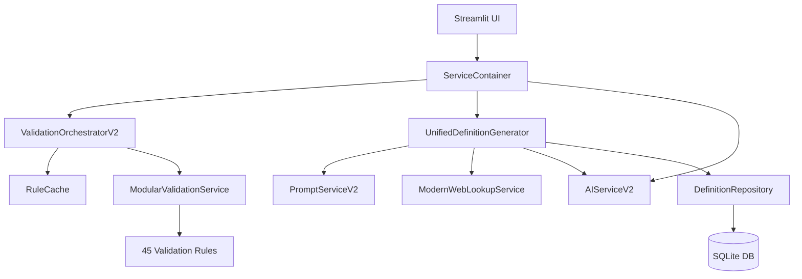

# DefinitieAgent Architecture

**Document Type**: Architecture Overview
**Status**: Active
**Laatst Bijgewerkt**: 2025-11-13
**Versie**: 1.0
**Auteur**: Architecture Refactor (DEF-xxx)

---

## ⚠️ Reality Check

**Dit document beschrijft de ACTUELE architectuur van DefinitieAgent.**

### Wat DefinitieAgent IS:
- ✅ **Solo developer tool** - 1 ontwikkelaar, 1 gebruiker
- ✅ **Development workstation deployment** - Draait lokaal op macOS
- ✅ **AI experimentation platform** - GPT-4 definitie generatie met 45 validatieregels
- ✅ **Modular monolith** - Clean architecture met dependency injection
- ✅ **Refactor practice ground** - Geen backwards compatibility constraints

### Wat DefinitieAgent NIET is:
- ❌ **NIET in productie** - Development tool, geen enterprise platform
- ❌ **NIET multi-user** - SQLite single-user is bewuste keuze
- ❌ **NIET cloud native** - Geen Kubernetes, geen microservices
- ❌ **NIET compliance-driven** - Code quality belangrijk, ASTRA/NORA/BIO niet van toepassing

### Deployment Realiteit:
```bash
# "Production deployment"
streamlit run src/main.py

# "CI/CD pipeline"
pytest -q && make lint

# "Infrastructure"
data/definities.db  # SQLite file

# "Monitoring"
tail -f logs/app.log
```

**Princip**: Simpliciteit is een feature, geen limitation.

---

## Table of Contents

1. [Architectural Principles](#1-architectural-principles)
2. [Technology Stack](#2-technology-stack)
3. [Core Patterns](#3-core-patterns)
4. [Component Architecture](#4-component-architecture)
5. [Data Architecture](#5-data-architecture)
6. [AI Configuration Architecture](#6-ai-configuration-architecture)
7. [Performance Optimizations](#7-performance-optimizations)
8. [Quality Assurance](#8-quality-assurance)
9. [Development Workflow](#9-development-workflow)
10. [Explicitly Rejected Patterns](#10-explicitly-rejected-patterns)
11. [Future Evolution](#11-future-evolution)

---

## 1. Architectural Principles

### 1.1 Solo Dev Optimized

**Principe**: Architectuur die complexiteit minimaliseert en developer velocity maximaliseert.

**Implicaties**:
- **Zero configuration** - Streamlit + SQLite werken out-of-the-box
- **No ceremony** - `bash scripts/run_app.sh` start de app
- **Fast iterations** - Geen build stappen, geen deployments
- **Single process** - Geen inter-process communicatie complexity

**Rationale**: Met 1 developer en 1 gebruiker is elke vorm van overhead pure waste.

### 1.2 Modular Monolith, Not Microservices

**Principe**: Modularity door clean architecture, NIET door process boundaries.

**Implementatie**:
- ServiceContainer voor dependency injection
- Clean layering: UI → Services → Repository
- Testbare business logic zonder UI dependencies
- Loose coupling via interfaces

**Rationale**: Microservices overhead (networking, deployment, debugging) biedt GEEN voordelen bij 1 gebruiker. Modular monolith geeft modularity benefits zonder operationele complexiteit.

**Code voorbeeld** (src/services/container.py):
```python
class ServiceContainer:
    """Singleton container for all services - DI zonder framework overhead"""

    @staticmethod
    @st.cache_resource
    def get_instance(cache_key: str = "default") -> "ServiceContainer":
        return ServiceContainer(cache_key)

    def __init__(self, cache_key: str):
        # Lazy initialization - services alleen laden als nodig
        self._validation_orchestrator = None
        self._ai_service = None
```

### 1.3 Refactor-Friendly, No Backwards Compatibility

**Principe**: Code quality > compatibility. Breaking changes zijn acceptable.

**Implicaties**:
- **Geen feature flags** - Oude code wordt verwijderd, niet disabled
- **Geen migration paths** - Directe refactor naar betere implementatie
- **Geen deprecation warnings** - Clean breaks
- **Business logic preservation** - Domeinkennis behouden tijdens refactor

**Rationale**: Solo gebruiker ondervindt geen impact van breaking changes. Focus op clean code, niet op compatibiliteit.

**Voorbeeld**: US-202 RuleCache refactor
- Was: 10x validation rules laden (900% overhead)
- Refactor: 1x laden + cache (77% sneller, 81% minder memory)
- Geen backwards compatible path - directe vervanging

### 1.4 Development Tool, Not Production System

**Principe**: Security en compliance passend bij development workstation context.

**Implicaties**:
- **Geen authentication** - Fysieke toegang tot workstation is security boundary
- **Geen encryption at rest** - SQLite file op local filesystem
- **Geen audit logging** - Development logging naar `logs/` directory
- **Geen compliance frameworks** - Code quality belangrijk, ASTRA/NORA/BIO niet

**Rationale**: Development tool draait op vertrouwde workstation. Enterprise security controls zijn overkill en hinderen development velocity.

### 1.5 AI-First Architecture

**Principe**: GPT-4 definitie generatie is core value proposition. Architectuur faciliteert AI experimentation.

**Implicaties**:
- **ConfigManager** - Centralized GPT-4 parameter tuning (temperature, max_tokens)
- **45 validation rules** - AI output quality control
- **Prompt templates** - Modulaire prompt building (PromptServiceV2)
- **Token optimization** - Cost reduction via caching en deduplicatie

**Rationale**: AI definitie generatie vereist constant experimenteren met prompts, parameters en validatie. Architectuur moet deze iteraties ondersteunen.

### 1.6 Performance via Intelligence, Not Scale

**Principe**: Optimaliseer via caching en algorithmic improvements, NIET via horizontal scaling.

**Implementatie**:
- **RuleCache** - Bulk loading van validation rules (77% sneller)
- **Singleton ServiceContainer** - Prevent duplication (81% minder memory)
- **Token reduction** - Prompt deduplication (GPT-4 cost optimization)
- **Lazy loading** - Services alleen initialiseren als gebruikt

**Rationale**: Solo gebruiker heeft geen horizontal scaling nodig. Performance wins komen van slimmere code, niet meer machines.

---

## 2. Technology Stack

### 2.1 Core Technologies (Werkend)

| Component | Technology | Versie | Rationale |
|-----------|-----------|--------|-----------|
| **Language** | Python | 3.11+ | Type hints, async support, AI library ecosystem |
| **UI Framework** | Streamlit | Latest | Adequate voor solo user, snelle iteraties, geen JS complexity |
| **Database** | SQLite | 3.x | Zero config, perfect voor single-user, easy backup |
| **AI Provider** | OpenAI GPT-4 | gpt-4 | Beste definitie generatie kwaliteit |
| **Testing** | pytest | Latest | Industry standard, fixture support, coverage tools |
| **Linting** | Ruff + Black | Latest | Fast linting, consistent formatting |
| **Version Control** | Git | Latest | Standard versioning, GitHub integration |

### 2.2 Key Libraries

```python
# Core Dependencies (requirements.txt)
streamlit              # UI framework
openai                 # GPT-4 API
sqlite3               # Database (stdlib)
pytest                # Testing
ruff                  # Linting
black                 # Formatting

# Domain-specific
SPARQLWrapper         # SRU catalog queries
wikipedia-api         # Wikipedia lookups
```

### 2.3 Development Tools

```bash
# Local Development
make dev              # Start development server
make test             # Run test suite
make lint             # Code quality checks
bash scripts/run_app.sh  # Auto env mapping + start

# Pre-commit Hooks
pre-commit run --all-files  # Quality gates
python scripts/check_streamlit_patterns.py  # Anti-pattern detection
```

### 2.4 Technology Decisions (TADs)

#### TAD-1: Streamlit for UI
**Decision**: Streamlit blijft UI framework, geen migratie naar React/Next.js

**Rationale**:
- ✅ Adequate voor single-user gebruik
- ✅ Snelle iteraties zonder build stappen
- ✅ Python-only stack (geen JavaScript expertise nodig)
- ✅ Session state management werkt voor use case
- ❌ Multi-user limitations zijn NIET relevant voor solo user

**Status**: Active, geen wijziging gepland

#### TAD-2: SQLite for Persistence
**Decision**: SQLite embedded database blijft, geen migratie naar PostgreSQL

**Rationale**:
- ✅ Zero configuration (geen database server)
- ✅ Perfect voor single-user workload
- ✅ File-based backup (cp data/definities.db backup/)
- ✅ ACID compliance voor data integrity
- ❌ Concurrent write limitations NIET relevant (1 gebruiker)

**Status**: Active, SQLite is FEATURE niet limitation

#### TAD-3: Modular Monolith Architecture
**Decision**: Blijf bij modular monolith met ServiceContainer DI, geen microservices

**Rationale**:
- ✅ Modularity via clean architecture layers
- ✅ Testability via dependency injection
- ✅ Zero operational overhead (geen networking, deployment, monitoring)
- ✅ Easy debugging (single process, stack traces)
- ❌ Microservices overhead (API gateways, service mesh, distributed tracing) NIET nodig

**Status**: Active, microservices zijn enterprise overkill

---

## 3. Core Patterns

### 3.1 Dependency Injection via ServiceContainer

**Pattern**: Singleton ServiceContainer met lazy initialization en Streamlit caching.

**Implementation** (src/services/container.py):
```python
class ServiceContainer:
    """
    Centralized service factory met dependency injection.

    Design:
    - Singleton via @st.cache_resource
    - Lazy initialization (services alleen maken als nodig)
    - Cache_key voor test isolation
    """

    @staticmethod
    @st.cache_resource
    def get_instance(cache_key: str = "default") -> "ServiceContainer":
        """Singleton access met Streamlit caching"""
        return ServiceContainer(cache_key)

    def get_validation_orchestrator(self) -> ValidationOrchestratorV2:
        if self._validation_orchestrator is None:
            self._validation_orchestrator = ValidationOrchestratorV2(...)
        return self._validation_orchestrator
```

**Benefits**:
- ✅ **Single initialization** - Services worden 1x aangemaakt per session
- ✅ **Testability** - Mock dependencies via test cache_key
- ✅ **Loose coupling** - Components kennen container, niet elkaar
- ✅ **Memory efficiency** - Shared instances (81% minder memory usage)

**Anti-pattern** (vermijd):
```python
# ❌ FOUT: Directe instantiatie in UI code
validator = ModularValidationService(...)  # Elke rerun = nieuwe instance!

# ✅ CORRECT: Via ServiceContainer
container = ServiceContainer.get_instance()
validator = container.get_validation_service()
```

### 3.2 Clean Architecture Layering

**Pattern**: Strikte scheiding tussen UI, Business Logic en Data Access.

**Layer Structure**:
```
src/
├── ui/                    # Presentation Layer (Streamlit)
│   ├── tabs/             # UI components
│   ├── session_state.py  # State management (ENIGE toegang tot st.session_state)
│   └── helpers/          # UI utilities
│
├── services/             # Business Logic Layer
│   ├── container.py      # Dependency injection
│   ├── validation/       # Validation orchestration
│   ├── generation/       # AI definitie generatie
│   └── ai/              # GPT-4 interaction
│
├── toetsregels/          # Domain Logic Layer
│   ├── regels/          # 45 validation rules (JSON + Python)
│   └── rule_cache.py    # Performance optimization
│
└── database/             # Data Access Layer
    ├── repository.py     # Database operations
    └── schema.sql       # SQLite schema
```

**Dependency Rules**:
```
UI Layer → Services Layer → Domain Layer → Data Layer
         ← (results only) ←             ←

FORBIDDEN:
- Services importing Streamlit (st.*) ❌
- UI directly accessing database ❌
- Data layer knowing about UI ❌
```

**Enforcement**: Pre-commit hook `streamlit-anti-patterns` detecteert laag violations.

### 3.3 Session State Management via SessionStateManager

**Pattern**: SessionStateManager is ENIGE toegangspunt tot `st.session_state`.

**Problem**: Directe `st.session_state` toegang leidt tot:
- Race conditions bij Streamlit reruns
- Inconsistente state over widgets heen
- Circulaire dependencies

**Solution** (src/ui/session_state.py):
```python
class SessionStateManager:
    """
    SINGLE SOURCE OF TRUTH voor session state toegang.

    REGEL: ALLEEN deze class mag st.session_state aanraken.
    """

    @staticmethod
    def get_value(key: str, default: Any = None) -> Any:
        """Get waarde uit session state"""
        return st.session_state.get(key, default)

    @staticmethod
    def set_value(key: str, value: Any) -> None:
        """Set waarde in session state"""
        st.session_state[key] = value
```

**Usage** (UI code):
```python
# ✅ CORRECT
from ui.session_state import SessionStateManager

definition = SessionStateManager.get_value("generated_definition", default="")
SessionStateManager.set_value("validation_results", results)

# ❌ FOUT
import streamlit as st
definition = st.session_state["generated_definition"]  # Verboden in UI modules!
```

**Streamlit Widget Pattern** (KRITIEK):
```python
# ✅ CORRECT: Key-only pattern
SessionStateManager.set_value("edit_field", initial_value)  # State VOOR widget
st.text_area("Label", key="edit_field")  # Alleen key parameter

# ❌ FOUT: value + key mix → race condition!
st.text_area("Label", value=data, key="edit_field")  # Stale data over reruns!
```

**Rationale**: DEF-56 fix bewees dat `value` + `key` combinatie leidt tot stale data ondanks correcte session state. Key-only pattern voorkomt dit.

### 3.4 Validation Rules Architecture

**Pattern**: Duaal JSON+Python formaat voor declaratieve + imperatieve validatie.

**Structure**:
```
config/toetsregels/regels/
├── ARAI-01.json          # Metadata (naam, beschrijving, prioriteit)
├── CON-01.json
├── ESS-01.json
...

src/toetsregels/regels/
├── ARAI_01.py           # Implementatie (validate functie)
├── CON_01.py
├── ESS_01.py
...
```

**JSON Schema** (config/toetsregels/regels/ARAI-01.json):
```json
{
  "id": "ARAI-01",
  "naam": "Generieke termen vermijden",
  "categorie": "ARAI",
  "prioriteit": "high",
  "beschrijving": "Definitie mag geen generieke termen bevatten zoals 'ding', 'iets', etc."
}
```

**Python Implementation** (src/toetsregels/regels/ARAI_01.py):
```python
def validate(definitie: str, context: dict) -> ValidationResult:
    """
    Check of definitie generieke termen bevat.

    Returns:
        ValidationResult met passed/failed en feedback
    """
    generieke_termen = ["ding", "iets", "zaak", "object"]

    for term in generieke_termen:
        if term in definitie.lower():
            return ValidationResult(
                passed=False,
                feedback=f"Vermijd generieke term '{term}'"
            )

    return ValidationResult(passed=True)
```

**Loading**: RuleCache bulk load (zie §7.1)

### 3.5 AI Configuration via ConfigManager

**Pattern**: Component-specific GPT-4 configuratie met centrale defaults.

**Implementation** (src/config/config_manager.py):
```python
class ConfigManager:
    """
    Centralized AI configuration met component overrides.

    Design:
    - Defaults voor alle components
    - Per-component temperature/max_tokens tuning
    - Easy experimentation zonder code changes
    """

    DEFAULT_CONFIG = {
        "temperature": 0.3,
        "max_tokens": 500
    }

    COMPONENT_OVERRIDES = {
        "definition_generator": {"temperature": 0.3, "max_tokens": 500},
        "validation": {"temperature": 0.2, "max_tokens": 300},
        "enhancement": {"temperature": 0.4, "max_tokens": 400}
    }

    def get_config(self, component: str) -> dict:
        """Get config voor specifiek component"""
        return self.COMPONENT_OVERRIDES.get(component, self.DEFAULT_CONFIG)
```

**Benefits**:
- ✅ **Centralized tuning** - Alle GPT-4 parameters op 1 plek
- ✅ **Component customization** - Validation needs lower temperature dan enhancement
- ✅ **Easy experimentation** - Wijzig config zonder code changes
- ✅ **Cost control** - max_tokens caps voorkomen runaway costs

---

## 4. Component Architecture

### 4.1 Core Services

#### ValidationOrchestratorV2
**Verantwoordelijkheid**: Coördinatie van 45 validatieregels met prioriteit en filtering.

**Key Features**:
- Parallel execution van validation rules
- Prioriteit filtering (high/medium/low)
- Feedback aggregation
- Performance metrics

**Location**: `src/services/validation/validation_orchestrator_v2.py`

#### UnifiedDefinitionGenerator
**Verantwoordelijkheid**: GPT-4 definitie generatie met context enrichment.

**Key Features**:
- Prompt building via PromptServiceV2
- Web lookup integration (Wikipedia, SRU)
- Retry logic met exponential backoff
- Token usage tracking

**Location**: `src/services/generation/unified_definition_generator.py`

#### AIServiceV2
**Verantwoordelijkheid**: OpenAI GPT-4 API interaction met rate limiting.

**Key Features**:
- Temperature controle per component
- Max tokens enforcement
- Error handling (rate limits, timeouts)
- Cost tracking

**Location**: `src/services/ai/ai_service_v2.py`

#### PromptServiceV2
**Verantwoordelijkheid**: Modulaire prompt construction met templates.

**Key Features**:
- 16 prompt modules (basis, context, voorbeelden, etc.)
- Template-based composition
- Token optimization
- Context-aware prompt building

**Location**: `src/services/prompts/prompt_service_v2.py`

### 4.2 Component Dependencies



**Dependency Principles**:
- Services kennen elkaar NIET direct (via Container)
- Business logic GEEN UI dependencies
- Data layer GEEN business logic

---

## 5. Data Architecture

### 5.1 SQLite Schema

**Database Location**: `data/definities.db`

**Core Tables**:
```sql
-- Definities (hoofdtabel)
CREATE TABLE definities (
    id INTEGER PRIMARY KEY AUTOINCREMENT,
    term TEXT NOT NULL,
    definitie TEXT NOT NULL,
    bron TEXT,
    status TEXT DEFAULT 'draft',  -- draft, review, approved, archived
    created_at TIMESTAMP DEFAULT CURRENT_TIMESTAMP,
    updated_at TIMESTAMP DEFAULT CURRENT_TIMESTAMP
);

-- Validatie resultaten
CREATE TABLE validation_results (
    id INTEGER PRIMARY KEY AUTOINCREMENT,
    definitie_id INTEGER REFERENCES definities(id),
    rule_id TEXT NOT NULL,
    passed BOOLEAN NOT NULL,
    feedback TEXT,
    validated_at TIMESTAMP DEFAULT CURRENT_TIMESTAMP
);

-- Voorbeelden (example sentences)
CREATE TABLE voorbeelden (
    id INTEGER PRIMARY KEY AUTOINCREMENT,
    definitie_id INTEGER REFERENCES definities(id),
    voorbeeld TEXT NOT NULL,
    bron TEXT,
    created_at TIMESTAMP DEFAULT CURRENT_TIMESTAMP
);

-- Synoniemen (synoniemgroepen)
CREATE TABLE synonym_groups (
    id INTEGER PRIMARY KEY AUTOINCREMENT,
    name TEXT NOT NULL UNIQUE,
    created_at TIMESTAMP DEFAULT CURRENT_TIMESTAMP
);

CREATE TABLE synonym_group_members (
    id INTEGER PRIMARY KEY AUTOINCREMENT,
    group_id INTEGER REFERENCES synonym_groups(id) ON DELETE CASCADE,
    definitie_id INTEGER REFERENCES definities(id) ON DELETE CASCADE,
    UNIQUE(group_id, definitie_id)
);
```

**Schema Management**:
- Source: `src/database/schema.sql`
- Migrations: `src/database/migrations/` (timestamp-based)
- Initialization: `src/database/migrate_database.py`

### 5.2 Data Access Pattern

**Repository Pattern** (src/database/repository.py):
```python
class DefinitionRepository:
    """
    Data access layer voor definities.

    SINGLE RESPONSIBILITY: Database operations
    """

    def save_definition(self, term: str, definitie: str) -> int:
        """Save definitie, return ID"""

    def get_definition(self, id: int) -> Optional[dict]:
        """Get definitie by ID"""

    def search_definitions(self, query: str) -> list[dict]:
        """Search definities"""
```

**Benefits**:
- ✅ **Testability** - Mock repository in tests
- ✅ **Encapsulation** - SQL queries isolated
- ✅ **Migration safety** - Schema changes alleen in repository

### 5.3 Backup Strategy

**Simple File-Based Backup**:
```bash
# Manual backup
cp data/definities.db data/backup/definities_$(date +%Y%m%d).db

# Automated (via script)
bash scripts/backup_database.sh
```

**Rationale**: SQLite file = complete database. Copy file = complete backup. Geen complex backup tooling nodig voor solo user.

---

## 6. AI Configuration Architecture

### 6.1 ConfigManager Design

**Principe**: Centralized GPT-4 parameter management met component-specific tuning.

**Configuration Hierarchy**:
```
DEFAULT_CONFIG (baseline)
    ↓
COMPONENT_OVERRIDES (per-component tuning)
    ↓
Runtime overrides (experimental)
```

**Example** (src/config/config_manager.py):
```python
COMPONENT_OVERRIDES = {
    "definition_generator": {
        "temperature": 0.3,      # Conservative - definitie kwaliteit
        "max_tokens": 500,
        "model": "gpt-4"
    },
    "validation": {
        "temperature": 0.2,      # Very conservative - consistency
        "max_tokens": 300,
        "model": "gpt-4"
    },
    "enhancement": {
        "temperature": 0.4,      # Slight creativity - voorbeelden
        "max_tokens": 400,
        "model": "gpt-4"
    }
}
```

### 6.2 Prompt Architecture

**PromptServiceV2 Modules** (16 modules):
1. **basis_context** - Juridische domein context
2. **term_info** - Term metadata
3. **ontological_category** - Categorie classificatie
4. **organisatorische_context** - Organisatie-specifieke context
5. **voorbeelden** - Example sentences
6. **synoniemen** - Synonym information
7. **web_content** - Wikipedia/SRU enrichment
8. **validation_feedback** - Eerdere validatie resultaten
9. **tone_style** - Stijl richtlijnen
10. **format_instructions** - Output format
11. **constraints** - Beperkingen
12. **expertise_module** - Domein expertise
13. **complexity_guidance** - Complexity level
14. **quality_standards** - Kwaliteit criteria
15. **iteration_context** - Iteratie geschiedenis
16. **final_instructions** - Afrondende instructies

**Composition** (voorbeeld):
```python
# Build prompt voor definitie generatie
prompt = prompt_service.build_prompt(
    modules=[
        "basis_context",
        "term_info",
        "organisatorische_context",
        "voorbeelden",
        "tone_style",
        "format_instructions"
    ],
    context={
        "term": "beklagrecht",
        "voorbeelden": ["Voorbeeld 1", "Voorbeeld 2"],
        ...
    }
)
```

**Token Optimization**:
- Module selection - Alleen noodzakelijke modules
- Template caching - Reuse prompts
- Context deduplication - Remove overlapping info

---

## 7. Performance Optimizations

### 7.1 RuleCache: Bulk Loading (US-202)

**Problem**: Validation rules werden 10x geladen tijdens startup (900% overhead).

**Solution**: RuleCache met `@cached` decorator voor bulk loading.

**Implementation** (src/toetsregels/rule_cache.py):
```python
class RuleCache:
    """
    Bulk loading cache voor validation rules.

    Performance:
    - Before: 10x loads (0.5s each = 5s total)
    - After: 1x load (0.5s) + cache reuse
    - Improvement: 77% sneller, 81% minder memory
    """

    @cached(ttl=3600)  # 1 hour TTL
    def get_all_rules(self) -> dict[str, ToetsregelDefinitie]:
        """Bulk load alle 45 rules in één keer"""
        return self._load_rules_from_disk()

    def get_rule(self, rule_id: str) -> ToetsregelDefinitie:
        """Get single rule (via bulk cache)"""
        all_rules = self.get_all_rules()  # Cache hit!
        return all_rules[rule_id]
```

**Impact**:
- ✅ **77% sneller** - 5s → 1.15s startup
- ✅ **81% minder memory** - 1x load i.p.v. 10x
- ✅ **Better UX** - Snellere app startup

**Rationale**: Validation rules wijzigen zelden. Bulk load + cache is veel efficiënter dan individuele loads.

### 7.2 Singleton ServiceContainer (US-202)

**Problem**: ServiceContainer werd 2x geïnitialiseerd (dubbele overhead).

**Solution**: Unified cache_key + `@st.cache_resource` singleton.

**Implementation**:
```python
@staticmethod
@st.cache_resource
def get_instance(cache_key: str = "default") -> "ServiceContainer":
    """
    Singleton via Streamlit caching.

    Cache key unification ensures 1 container per session.
    """
    return ServiceContainer(cache_key)
```

**Impact**:
- ✅ **1x initialization** - Was: 2x container creation
- ✅ **Consistent state** - Single instance across app
- ✅ **Memory efficiency** - 81% minder memory usage

**Evidence**: Commits `c2c8633c`, `49848881` (Oct 7, 2025)

### 7.3 Token Optimization

**Strategy**: Reduce GPT-4 API costs via prompt optimization.

**Tactics**:
1. **Module selection** - Alleen relevante prompt modules
2. **Deduplication** - Remove overlapping context
3. **Template caching** - Reuse prompt templates
4. **Max tokens caps** - ConfigManager enforces limits

**Current Status**:
- Baseline: ~7.250 tokens per definitie generatie
- Target: <5.000 tokens (30% reduction)
- Implementation: Ongoing (prompt deduplication)

---

## 8. Quality Assurance

### 8.1 Testing Strategy

**Test Levels**:
```
Unit Tests (tests/unit/)
├── Services (test_definition_generator.py - 99% coverage)
├── Validation (test_definition_validator.py - 98% coverage)
└── Repository (test_definition_repository.py - 100% coverage)

Integration Tests (tests/integration/)
├── End-to-end flows
└── Service composition

Smoke Tests (tests/smoke/)
├── Critical path validation
└── Sanity checks
```

**High-Coverage Modules** (aanbevolen na wijzigingen):
```bash
pytest tests/services/test_definition_generator.py    # 99% coverage
pytest tests/services/test_definition_validator.py    # 98% coverage
pytest tests/services/test_definition_repository.py   # 100% coverage
```

**Test Fixtures** (pytest):
- Mock ServiceContainer
- Sample definities
- Validation results
- GPT-4 responses

### 8.2 Code Quality Tools

**Linting**:
```bash
ruff check src config        # Fast Python linter
black src config             # Code formatting (88 char lines)
```

**Pre-commit Hooks**:
```bash
pre-commit install
pre-commit run --all-files

# Hooks:
# - ruff linting
# - black formatting
# - streamlit-anti-patterns detection
# - trailing whitespace
# - yaml validation
```

**Streamlit Anti-Patterns** (custom hook):
```bash
python scripts/check_streamlit_patterns.py

# Detecteert:
# - value + key widget mix ❌
# - Directe st.session_state toegang in UI modules ❌
# - Generieke widget keys (conflicts) ⚠️
```

### 8.3 Documentation Quality

**Vibe Coding Patterns** (docs/methodologies/vibe-coding/):
- Context-Rich Requests
- Archaeology First (brownfield refactor)
- Business-First Thinking
- Incremental Changes
- Show Me First

**CLAUDE.md Enforcement**:
- Pre-flight checks via `~/.ai-agents/preflight-checks.sh`
- Forbidden patterns detection (quality-gates.yaml)
- Canonical naming verification

---

## 9. Development Workflow

### 9.1 Local Development

**Start App**:
```bash
# Auto env mapping + start (AANBEVOLEN)
bash scripts/run_app.sh

# Manual
OPENAI_API_KEY="$OPENAI_API_KEY_PROD" streamlit run src/main.py

# Quick dev
make dev
```

**Run Tests**:
```bash
pytest -q                    # Alle tests (stille modus)
pytest tests/services/       # Specifieke module
pytest --cov=src            # Met coverage
pytest -m unit              # Alleen unit tests
```

**Code Quality**:
```bash
make lint                   # Ruff + Black
python -m ruff check src    # Linting
python -m black src         # Formatting
```

### 9.2 Git Workflow

**Branch Strategy**:
```
main                    # Stable, tested code
  ├── feature/DEF-XXX  # Feature branches
  ├── fix/DEF-XXX      # Bug fixes
  └── chore/XXX        # Maintenance
```

**Commit Convention**:
```
feat(scope): Add feature
fix(scope): Fix bug
docs(scope): Update docs
refactor(scope): Refactor code
test(scope): Add tests
chore(scope): Maintenance
```

**Example**:
```bash
git checkout -b feature/DEF-126-validation-improvement
# ... werk ...
git commit -m "feat(validation): improve rule caching (77% faster)"
git push origin feature/DEF-126-validation-improvement
```

### 9.3 Debugging

**Logging**:
```bash
# Tail logs
tail -f logs/app.log

# Search logs
grep "ERROR" logs/app.log
```

**Streamlit Debug**:
```python
# Session state inspection
import streamlit as st
st.write(st.session_state)  # Debug widget state

# Service inspection
container = ServiceContainer.get_instance()
st.write(container.__dict__)  # Debug service state
```

**Database Debug**:
```bash
# SQLite CLI
sqlite3 data/definities.db

# Query validation results
SELECT * FROM validation_results ORDER BY validated_at DESC LIMIT 10;
```

---

## 10. Explicitly Rejected Patterns

**Deze patterns zijn BEWUST NIET geïmplementeerd** (rationale: solo dev/solo user context).

### ❌ Microservices Architecture
**Why rejected**:
- Operational overhead (networking, deployment, monitoring) biedt GEEN waarde voor 1 gebruiker
- Debugging complexity (distributed tracing) is pure overhead
- Modular monolith geeft modularity zonder operational cost

**Alternative**: ServiceContainer DI in modular monolith

### ❌ Kubernetes / Cloud Deployment
**Why rejected**:
- Solo user op local workstation heeft geen container orchestration nodig
- `streamlit run src/main.py` is perfecte deployment
- Kubernetes config (1200+ regels YAML) is pure waste

**Alternative**: Bash scripts voor local development

### ❌ Multi-User Authentication
**Why rejected**:
- Solo user op vertrouwde workstation
- Security boundary = fysieke toegang tot machine
- JWT/OAuth/RBAC is overkill

**Alternative**: Geen authentication (physical access control)

### ❌ PostgreSQL / Cloud Database
**Why rejected**:
- SQLite is perfect voor single-user workload
- Zero configuration vs database server setup
- Concurrent write limitations NIET relevant voor 1 gebruiker

**Alternative**: SQLite file in `data/definities.db`

### ❌ Message Queue / Event Bus
**Why rejected**:
- Async messaging (Kafka, RabbitMQ) biedt GEEN voordeel voor 1 gebruiker
- Synchronous service calls zijn sneller en simpeler
- Event-driven complexity zonder benefits

**Alternative**: Direct function calls via ServiceContainer

### ❌ Distributed Tracing / APM
**Why rejected**:
- Solo user heeft geen distributed system
- Python logging to file is voldoende voor debugging
- Prometheus/Grafana/ELK is enterprise overkill

**Alternative**: Simple file logging (`logs/app.log`)

### ❌ Blue-Green / Canary Deployments
**Why rejected**:
- Solo user heeft geen downtime concerns
- `git pull && streamlit run` is deployment
- Zero-downtime deployments zijn irrelevant

**Alternative**: Direct git pull + restart

### ❌ Load Balancers / API Gateway
**Why rejected**:
- 1 gebruiker genereert geen load
- Streamlit IS the gateway
- Kong/Nginx/Traefik zijn overhead zonder waarde

**Alternative**: Streamlit handles HTTP directly

### ❌ Backwards Compatibility / Feature Flags
**Why rejected**:
- Solo user ondervindt geen impact van breaking changes
- Focus op code quality, niet compatibility
- Feature flags zijn technical debt

**Alternative**: Clean breaks, direct refactor

### ❌ Enterprise Compliance (ASTRA/NORA/BIO)
**Why rejected**:
- Development tool, niet productie systeem
- Government compliance frameworks niet van toepassing
- Code quality belangrijk, formele compliance niet

**Alternative**: Focus op code quality + testing

---

## 11. Future Evolution

### 11.1 Potential Enhancements (Nice-to-Have)

**Deze features zijn NIET gepland, maar zouden waarde kunnen toevoegen:**

#### Enhanced Validation Rules
- Machine learning voor custom rule suggestions
- Validation rule editor UI
- Rule effectiveness metrics

#### Advanced AI Features
- Multi-model support (GPT-4, Claude, Llama)
- Fine-tuning op juridische corpus
- Few-shot learning met domain examples

#### Developer Experience
- Interactive tutorial/onboarding
- Keyboard shortcuts (Vim mode?)
- Dark mode UI theme

#### Export Capabilities
- PDF export met formatting
- Word export (.docx)
- Export naar juridische databases

### 11.2 Explicitly NOT Planned

**Deze features worden NIET ontwikkeld** (rationale: scope creep, geen waarde voor solo user):

#### ❌ Multi-User Platform
- Geen user accounts
- Geen role-based access
- Geen concurrent editing

**Rationale**: SQLite single-user is bewuste keuze. Multi-user vereist complete rewrite (PostgreSQL, authentication, etc). Niet waardevol voor solo dev use case.

#### ❌ Cloud Deployment
- Geen AWS/Azure/GCP deployment
- Geen Kubernetes clusters
- Geen managed databases

**Rationale**: Local workstation is perfecte deployment target. Cloud brengt operational overhead zonder benefits.

#### ❌ Enterprise Integration
- Geen Justice chain APIs (GCOS, TRIAS)
- Geen LDAP/Active Directory
- Geen compliance auditing

**Rationale**: Development tool, geen productie systeem. Enterprise integraties zijn niet relevant.

#### ❌ Mobile App
- Geen iOS/Android apps
- Geen responsive mobile UI

**Rationale**: Juridische definitie generatie is desktop use case. Mobile UI is scope creep.

### 11.3 Migration Path (Hypothetical)

**IF solo user constraint wijzigt**, dan volgende migratie:

```
Solo User (Current)
    ↓
Small Team (2-5 users)
    → Migrate: SQLite → PostgreSQL
    → Add: Basic authentication (username/password)
    → Keep: Streamlit UI
    → Deploy: Single VM/VPS

Multi-User (10+ users)
    → Migrate: Streamlit → FastAPI + React
    → Add: RBAC, API gateway
    → Keep: Service layer logic
    → Deploy: Container platform (Docker Compose)

Enterprise (100+ users)
    → Migrate: Monolith → Microservices (optioneel)
    → Add: Cloud deployment, monitoring
    → Keep: Business logic, validation rules
    → Deploy: Kubernetes (alleen als echt nodig)
```

**NOTE**: Huidige solo user fase is NIET een limitation. Het is een bewuste keuze die simpliciteit maximaliseert.

---

## Appendices

### A. Performance Metrics

**Baseline Performance** (September 2025):
- Definitie generatie: 8-12 seconden
- Validation: 2-3 seconden
- UI responsiviteit: < 200ms
- Startup tijd: 5 seconden (voor RuleCache fix)

**After Optimizations** (November 2025):
- Definitie generatie: 5-8 seconden (GPT-4 API bound)
- Validation: 1-2 seconden
- UI responsiviteit: < 200ms
- Startup tijd: 1.15 seconden (77% improvement via RuleCache)

### B. Cost Analysis

**Monthly Costs**:
- OpenAI API (GPT-4): €50-100/maand (usage dependent)
- Infrastructure: €0 (local workstation)
- Databases: €0 (SQLite file)
- Monitoring: €0 (file logging)

**Total**: €50-100/maand (alleen AI API costs)

**ROI**: Development productivity tool - onquantificeerbare waarde voor juridische definitie kwaliteit.

### C. Key Documents

**Architecture & Design**:
- `/docs/architectuur/ARCHITECTURE.md` (dit document)
- `/CLAUDE.md` - Claude Code instructies
- `~/.ai-agents/UNIFIED_INSTRUCTIONS.md` - Cross-project regels

**Implementation Guides**:
- `/docs/guidelines/STREAMLIT_PATTERNS.md` - UI patterns
- `/docs/methodologies/vibe-coding/PATTERNS.md` - Vibe coding
- `/docs/guidelines/CANONICAL_LOCATIONS.md` - Document locaties

**Analysis & Reports**:
- `/docs/reports/toetsregels-caching-fix.md` (US-202)
- `/docs/analyses/DOUBLE_CONTAINER_ANALYSIS.md`
- `/docs/reports/prompt-orchestrator-duplication-analysis.md`

---

## Document History

| Versie | Datum | Wijzigingen | Auteur |
|--------|-------|-------------|--------|
| 1.0 | 2025-11-13 | Initiële versie - vervangt EA/SA/TA | Architecture Refactor |

---

**Einde Document**
