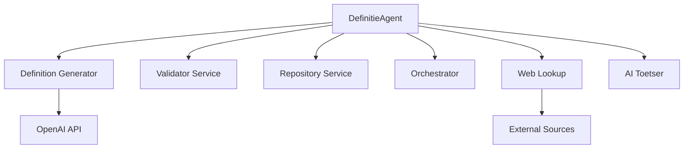

# DefinitieAgent - Professionele Enterprise Architectuur Documentatie

> **Laatste update**: 2025-08-19 - F821 errors opgelost, imports gesorteerd, 84 kritieke errors gefixt

## 📋 Inhoudsopgave
1. [Executive Summary](#executive-summary)
2. [AS-IS Architectuur](#as-is-architectuur)
3. [TO-BE Architectuur](#to-be-architectuur)
4. [Transitie Roadmap](#transitie-roadmap)
5. [Aanbevelingen](#aanbevelingen)

---

## Executive Summary

### 🎯 Project Overzicht (Update 2025-08-19)
- **Totaal Python bestanden**: 304 (waarvan 150+ ongebruikt)
- **Huidige test coverage**: 11%
- **Code quality errors**: 799 (was 880+) ✅ VERBETERD
- **Kritieke F821 errors**: 0 (was 38) ✅ OPGELOST
- **UI completeness**: 30% (7 van 10 tabs inactief)
- **Response tijd**: 8-12 seconden
- **Geschatte transformatie**: 14 weken (was 16)

### 🚀 Doelstellingen
- **Performance**: Van 8-12s naar <5s response tijd (60% verbetering)
- **Schaalbaarheid**: Van single-user naar 10+ concurrent users
- **Test Coverage**: Van 11% naar 80%
- **UI Completeness**: Van 30% naar 100%
- **API Kosten**: 70% reductie door prompt optimalisatie

---

## AS-IS Architectuur

### 1. High-Level Architectuur Overzicht

#### 1.1 Layered Architecture
```
┌─────────────────────────────────────────────────────────┐
│                   Presentation Layer                     │
│         Streamlit UI, Web Interface, Session Mgmt       │
├─────────────────────────────────────────────────────────┤
│                   Application Layer                      │
│      Business Logic, Workflow Orchestration, Services   │
├─────────────────────────────────────────────────────────┤
│                     Domain Layer                         │
│       Domain Models, Business Rules, Validation         │
├─────────────────────────────────────────────────────────┤
│                 Infrastructure Layer                     │
│         Database, External APIs, File System            │
└─────────────────────────────────────────────────────────┘
```

#### 1.2 Component Architecture
```
[Streamlit UI] → [UI Components] → [Services] → [Repository]
   main.py       7 tabs (30%)     6 services    SQLite DB
```

### 2. Deployment Architecture (Current)

```
┌─────────────┐     ┌──────────────────┐     ┌─────────────┐
│   Browser   │────▶│  Python Server   │────▶│   SQLite    │
│  (Client)   │     │  (Streamlit)     │     │ (Local DB)  │
└─────────────┘     └──────────────────┘     └─────────────┘
```

### 3. Technology Stack

| Layer | Technology | Version | Purpose |
|-------|------------|---------|---------|
| Language | Python | 3.11 | Core development |
| Framework | Streamlit | Latest | Web UI |
| AI/ML | OpenAI API | GPT-4 | Text generation |
| Database | SQLite | 3.x | Local storage |
| ORM | SQLAlchemy | 2.x | Database abstraction |
| Data | Pandas | Latest | Data processing |

### 4. Service Architecture



### 5. Current Issues & Risks

#### Risk Matrix
| Risk | Impact | Likelihood | Priority |
|------|--------|------------|----------|
| Database Locks | High | High | **Critical** |
| Memory Leaks | Medium | High | **High** |
| Widget Duplicates | Medium | Medium | **Medium** |
| UTF-8 Issues | Low | Medium | **Low** |

#### Performance Metrics
- **Response Time**: 8-12 seconds ❌
- **Concurrent Users**: 1 (single-user only) ❌
- **Test Coverage**: 11% ❌
- **Uptime**: ~95% ⚠️

### 6. Security Architecture (Current)

```
Application Security:
├── ❌ No Authentication
├── ❌ No Authorization
└── ⚠️ Basic Input Validation

API Security:
├── ✅ API Key Management
├── ✅ Rate Limiting
└── ❌ No API Gateway

Data Security:
├── ❌ No Encryption at Rest
├── ⚠️ HTTPS Only
└── ❌ No Data Masking
```

### 7. Component Relationship Diagrams

#### 7.1 High-Level Component Dependencies
```
┌─────────────────────────────────────────────────────────────────┐
│                          main.py                                 │
│                     (Entry Point)                               │
└─────────────────────┬───────────────────────────────────────────┘
                      │
                      ▼
┌─────────────────────────────────────────────────────────────────┐
│                    tabbed_interface.py                          │
│              (UI Controller & Orchestrator)                     │
└──────┬──────────┬──────────┬──────────┬──────────┬────────────┘
       │          │          │          │          │
       ▼          ▼          ▼          ▼          ▼
┌──────────┐ ┌──────────┐ ┌──────────┐ ┌──────────┐ ┌──────────┐
│Generator │ │ History  │ │ Export   │ │ Review   │ │Web Lookup│
│   Tab    │ │   Tab    │ │   Tab    │ │   Tab    │ │   Tab    │
└────┬─────┘ └────┬─────┘ └────┬─────┘ └────┬─────┘ └────┬─────┘
     │            │            │            │            │
     └────────────┴────────────┴────────────┴────────────┘
                              │
                              ▼
                    ┌─────────────────┐
                    │    Services     │
                    │  (6 Services)   │
                    └────────┬────────┘
                             │
                             ▼
                    ┌─────────────────┐
                    │   Repository    │
                    │    (SQLite)     │
                    └─────────────────┘
```

#### 7.2 Service Layer Communication Pattern
```
┌─────────────────────────────────────────────────────────────────┐
│                     Service Communication Flow                   │
├─────────────────────────────────────────────────────────────────┤
│                                                                 │
│  UI Layer          Service Layer           Infrastructure      │
│                                                                │
│  ┌─────────┐      ┌─────────────┐        ┌──────────────┐   │
│  │ Tab UI  │─────▶│DefinitieGen │───────▶│  OpenAI API  │   │
│  └─────────┘      │   Service    │        └──────────────┘   │
│                   └──────┬────────┘                           │
│                          │                                     │
│                          ▼                                     │
│                   ┌─────────────┐        ┌──────────────┐   │
│                   │  Validator  │───────▶│ Toetsregels  │   │
│                   │   Service   │        │   Engine     │   │
│                   └──────┬──────┘        └──────────────┘   │
│                          │                                     │
│                          ▼                                     │
│                   ┌─────────────┐        ┌──────────────┐   │
│                   │ Repository  │───────▶│   SQLite DB  │   │
│                   │  Service    │        └──────────────┘   │
│                   └─────────────┘                             │
└─────────────────────────────────────────────────────────────────┘
```

#### 7.3 Data Flow Sequence
```
User Request → UI Tab → Service Layer → External API/DB → Response
     │              │           │              │             │
     ▼              ▼           ▼              ▼             ▼
[Input Form]   [Validate]  [Process]    [Store/Fetch]   [Display]
                    │           │              │
                    └───────────┴──────────────┘
                            Error Handling
```

### 8. Current File Structure

#### ✅ Active Components (Essential)
| Component | Files | Status | Description |
|-----------|-------|--------|-------------|
| Entry Point | `src/main.py` | ✅ Active | Main application |
| UI Controller | `ui/tabbed_interface.py` | ✅ Active | Tab management |
| Services | `services/*.py` | ✅ Active | 6 business services |
| Database | `database/definitie_repository.py` | ✅ Active | Data layer |
| AI Components | `ai_toetser/*.py` | ✅ Active | Validation logic |

#### ❌ Technical Debt (150+ files)
| Component | Files | Status | Action |
|-----------|-------|--------|--------|
| Toetsregels | `toetsregels/regels/*.py` | ❌ Unused | Remove (50+ files) |
| Validators | `toetsregels/validators/*.py` | ❌ Unused | Remove (50+ files) |
| Domain | `domain/context/*.py` | ❌ Unused | Archive |
| Legacy | `voorbeelden/async_*.py` | ❌ Unused | Remove |

---

## TO-BE Architectuur

### 1. Target Architecture Vision

#### 1.1 Microservices Architecture
```
                    ┌─────────────┐
                    │ API Gateway │
                    └──────┬──────┘
                           │
        ┌──────────────────┼──────────────────┐
        │                  │                  │
   ┌────▼────┐      ┌─────▼─────┐     ┌─────▼─────┐
   │  Auth   │      │Definition │     │Validation │
   │ Service │      │  Service  │     │  Service  │
   └─────────┘      └───────────┘     └───────────┘
        │                  │                  │
   ┌────▼────┐      ┌─────▼─────┐     ┌─────▼─────┐
   │ Export  │      │ Enrichment│     │ Monitor   │
   │ Service │      │  Service  │     │  Service  │
   └─────────┘      └───────────┘     └───────────┘
```

#### 1.2 Event-Driven Architecture
```
[User Request] → [Event Bus] → [Service Processing] → [Response]
                      ↓
                 [Message Queue]
                 (RabbitMQ/Kafka)
```

### 2. Cloud-Native Deployment

```
┌─────────────────────────────────────────────────────────┐
│                    Load Balancer                        │
│                  (Nginx/HAProxy)                        │
└────────────────────────┬────────────────────────────────┘
                         │
┌────────────────────────▼────────────────────────────────┐
│                 Kubernetes Cluster                       │
│  ┌─────────┐  ┌─────────┐  ┌─────────┐  ┌─────────┐  │
│  │  Pod 1  │  │  Pod 2  │  │  Pod 3  │  │  Pod N  │  │
│  │ Service │  │ Service │  │ Service │  │ Service │  │
│  └─────────┘  └─────────┘  └─────────┘  └─────────┘  │
└─────────────────────────────────────────────────────────┘
                         │
         ┌───────────────┴───────────────┐
         │                               │
    ┌────▼────┐                    ┌────▼────┐
    │PostgreSQL│                    │  Redis  │
    │ Primary  │                    │  Cache  │
    └─────────┘                    └─────────┘
```

### 3. Enhanced Technology Stack

| Layer | Current | Target | Benefit |
|-------|---------|--------|---------|
| API | Streamlit | **FastAPI** | REST API, async support |
| Container | None | **Docker** | Consistent deployment |
| Orchestration | None | **Kubernetes** | Auto-scaling |
| Database | SQLite | **PostgreSQL** | Multi-user, HA |
| Cache | In-memory | **Redis** | Distributed cache |
| Monitoring | None | **Grafana/Prometheus** | Full observability |
| Message Queue | None | **RabbitMQ/Kafka** | Async processing |
| Authentication | None | **OAuth 2.0** | Enterprise security |

### 4. Security Architecture (Target)

```
Identity & Access Management:
├── ✅ OAuth 2.0 / SAML
├── ✅ Role-Based Access Control (RBAC)
└── ✅ Multi-Factor Authentication

API Security:
├── ✅ API Gateway with Rate Limiting
├── ✅ JWT Token Authentication
└── ✅ API Versioning & Deprecation

Data Protection:
├── ✅ Encryption at Rest (AES-256)
├── ✅ TLS 1.3 in Transit
└── ✅ Data Masking & Tokenization

Infrastructure Security:
├── ✅ Network Segmentation
├── ✅ WAF & DDoS Protection
└── ✅ Security Monitoring & SIEM
```

### 5. New Services & Components

#### Core Services
| Service | File | Purpose |
|---------|------|---------|
| Prompt Optimizer | `services/prompt_optimizer.py` | Token reduction <10k |
| Validation Orchestrator | `services/validation_orchestrator.py` | Central validation |
| Content Enrichment | `services/content_enrichment_service.py` | Synonyms, context |
| Cache Manager | `services/cache_manager.py` | Redis integration |
| Monitoring Service | `services/monitoring_service.py` | Metrics & alerts |

#### Infrastructure Components
| Component | File | Purpose |
|-----------|------|---------|
| API Gateway | `gateway/api_gateway.py` | Request routing |
| Auth Service | `auth/authentication.py` | OAuth 2.0 |
| RBAC | `auth/authorization.py` | Role management |
| Metrics Collector | `monitoring/metrics_collector.py` | Prometheus export |

### 6. Data Architecture Evolution

```
Current:                    Target:
┌─────────┐               ┌──────────────┐
│ SQLite  │               │ PostgreSQL   │
│ (Single)│   ────────►   │ (Master-Slave)│
└─────────┘               └──────────────┘
                                 +
                          ┌──────────────┐
                          │    Redis     │
                          │ (Dist Cache) │
                          └──────────────┘
                                 +
                          ┌──────────────┐
                          │  S3/Blob     │
                          │ (Doc Store)  │
                          └──────────────┘
```

### 7. Monitoring & Observability

```
Application Metrics ──► Prometheus ──► Grafana
       │                                  │
       ▼                                  ▼
   ELK Stack                         Dashboards
   (Logging)                         & Alerts
       │                                  │
       ▼                                  ▼
    Jaeger                          PagerDuty
(Distributed Tracing)              (Incident Mgmt)
```

### 8. Component Relationships - TO-BE Architecture

#### 8.1 Microservices Communication Pattern
```
┌─────────────────────────────────────────────────────────────────┐
│                    API Gateway (Kong/AWS)                        │
│                 Authentication | Routing | Rate Limiting         │
└──────────┬──────────┬──────────┬──────────┬──────────┬────────┘
           │          │          │          │          │
           ▼          ▼          ▼          ▼          ▼
    ┌──────────┐ ┌──────────┐ ┌──────────┐ ┌──────────┐ ┌──────────┐
    │  Auth    │ │Definition│ │Validation│ │Enrichment│ │ Export   │
    │ Service  │ │ Service  │ │ Service  │ │ Service  │ │ Service  │
    └────┬─────┘ └────┬─────┘ └────┬─────┘ └────┬─────┘ └────┬─────┘
         │            │            │            │            │
         └────────────┴────────────┴────────────┴────────────┘
                                   │
                    ┌──────────────┴──────────────┐
                    │                             │
             ┌──────▼──────┐              ┌──────▼──────┐
             │Message Queue│              │  Event Bus  │
             │(RabbitMQ)   │              │   (Kafka)   │
             └─────────────┘              └─────────────┘
                    │                             │
             ┌──────┴──────────────────────────┬─┴──────┐
             │                                 │        │
      ┌──────▼──────┐                  ┌──────▼──────┐ │
      │ PostgreSQL  │                  │    Redis    │ │
      │  (Primary)  │                  │   (Cache)   │ │
      └─────────────┘                  └─────────────┘ │
                                                       │
                                              ┌────────▼────────┐
                                              │ Monitoring Stack│
                                              │(Prometheus/ELK) │
                                              └─────────────────┘
```

#### 8.2 Event-Driven Architecture Flow
```
┌─────────────────────────────────────────────────────────────────┐
│                   Event-Driven Communication                     │
├─────────────────────────────────────────────────────────────────┤
│                                                                 │
│  User Action    Event Published    Services React    Results   │
│      │                │                  │              │      │
│      ▼                ▼                  ▼              ▼      │
│ ┌─────────┐    ┌─────────────┐    ┌─────────────┐  ┌────────┐│
│ │New Def. │───▶│DEF_CREATED  │───▶│ Validation  │──▶│Update  ││
│ │Request  │    │   Event     │    │  Service    │  │  UI    ││
│ └─────────┘    └─────────────┘    └─────────────┘  └────────┘│
│                       │                  │                     │
│                       ▼                  ▼                     │
│                ┌─────────────┐    ┌─────────────┐            │
│                │  Event Log  │    │ Enrichment  │            │
│                │  (Kafka)    │    │  Service    │            │
│                └─────────────┘    └─────────────┘            │
└─────────────────────────────────────────────────────────────────┘
```

#### 8.3 Service Mesh Architecture (Istio)
```
┌─────────────────────────────────────────────────────────────────┐
│                        Service Mesh (Istio)                      │
├─────────────────────────────────────────────────────────────────┤
│                                                                 │
│  ┌─────────────┐         ┌─────────────┐      ┌─────────────┐ │
│  │   Service   │         │   Service   │      │   Service   │ │
│  │     Pod     │         │     Pod     │      │     Pod     │ │
│  │ ┌─────────┐ │         │ ┌─────────┐ │      │ ┌─────────┐ │ │
│  │ │ App     │ │◀──────▶│ │ App     │ │◀────▶│ │ App     │ │ │
│  │ │Container│ │         │ │Container│ │      │ │Container│ │ │
│  │ └─────────┘ │         │ └─────────┘ │      │ └─────────┘ │ │
│  │ ┌─────────┐ │         │ ┌─────────┐ │      │ ┌─────────┐ │ │
│  │ │ Envoy   │ │         │ │ Envoy   │ │      │ │ Envoy   │ │ │
│  │ │ Proxy   │ │         │ │ Proxy   │ │      │ │ Proxy   │ │ │
│  │ └─────────┘ │         │ └─────────┘ │      │ └─────────┘ │ │
│  └─────────────┘         └─────────────┘      └─────────────┘ │
│         │                        │                      │       │
│         └────────────────────────┴──────────────────────┘       │
│                                 │                               │
│                         ┌───────▼────────┐                     │
│                         │ Control Plane  │                     │
│                         │    (Istiod)    │                     │
│                         └────────────────┘                     │
└─────────────────────────────────────────────────────────────────┘
```

#### 8.4 Domain-Driven Design Bounded Contexts
```
┌─────────────────────────────────────────────────────────────────┐
│                    Bounded Context Map                          │
├─────────────────────────────────────────────────────────────────┤
│                                                                 │
│  ┌───────────────────┐         ┌───────────────────┐          │
│  │  Definition       │         │   Validation      │          │
│  │    Context        │◀───────▶│     Context       │          │
│  │                   │ Shared  │                   │          │
│  │ - Begrip          │ Kernel  │ - Rules Engine    │          │
│  │ - Definitie       │         │ - Score Calc      │          │
│  │ - Metadata        │         │ - Violations      │          │
│  └───────────────────┘         └───────────────────┘          │
│           │                              │                      │
│           │                              │                      │
│           ▼                              ▼                      │
│  ┌───────────────────┐         ┌───────────────────┐          │
│  │   Enrichment      │         │     Export        │          │
│  │    Context        │         │     Context       │          │
│  │                   │         │                   │          │
│  │ - Synonyms        │         │ - Formatters      │          │
│  │ - Examples        │         │ - Templates       │          │
│  │ - Context         │         │ - Delivery        │          │
│  └───────────────────┘         └───────────────────┘          │
└─────────────────────────────────────────────────────────────────┘
```

### 9. Target Metrics

| Metric | Current | Target | Improvement |
|--------|---------|--------|-------------|
| Response Time | 8-12s | <5s | **60% faster** |
| Test Coverage | 11% | 80% | **7x increase** |
| UI Completeness | 30% | 100% | **All features** |
| Uptime SLA | 95% | 99.9% | **Enterprise** |
| Concurrent Users | 1 | 10+ | **10x scale** |
| API Costs | $100/day | $30/day | **70% reduction** |

---

## Transitie Roadmap

### Phase 1: Foundation (Week 1-4) - 30% Complete
- [ ] Enable SQLite WAL mode
- [ ] Unify configuration system
- [ ] Repair test suite (30% target)
- [ ] Setup basic CI/CD pipeline
- [ ] Implement basic authentication

### Phase 2: Service Decomposition (Week 5-8) - 10% Complete
- [ ] Extract PromptOptimizer service
- [ ] Implement ValidationOrchestrator
- [ ] Create ContentEnrichmentService
- [ ] Implement CacheManager
- [ ] Complete Facade pattern
- [ ] Eliminate God Object pattern

### Phase 3: Feature Completion (Week 9-12) - 0% Complete
- [ ] Activate all 7 inactive UI tabs
- [ ] Integrate Web Lookup with UI
- [ ] Implement Prompt Viewer
- [ ] Add Custom Definition templates
- [ ] Complete Expert Review workflow
- [ ] Build Orchestration engine

### Phase 4: Optimization & Scale (Week 13-16) - 0% Complete
- [ ] Implement Redis caching
- [ ] Migrate to PostgreSQL
- [ ] Setup Kubernetes deployment
- [ ] Implement monitoring stack
- [ ] Performance optimization
- [ ] Production deployment

---

## Aanbevelingen

### 🔴 Immediate Actions (Week 1)
1. **Fix Database Locks**: Implement WAL mode for SQLite
2. **Remove Technical Debt**: Delete 150+ unused Python files
3. **Fix Widget Keys**: Resolve Streamlit duplicate key issues
4. **Basic Auth**: Add simple authentication layer

### 🟠 Short Term (Month 1)
1. **Service Extraction**: Start decomposing monolith
2. **Test Coverage**: Increase to 30% minimum
3. **CI/CD Pipeline**: GitHub Actions setup
4. **Documentation**: Update architecture docs

### 🟢 Long Term (Quarter)
1. **Cloud Migration**: Move to Kubernetes
2. **Database Migration**: SQLite to PostgreSQL
3. **Full Monitoring**: Implement observability stack
4. **Security Hardening**: Complete security layers

### 💰 Investment & ROI
- **Estimated Hours**: 400-600 development hours
- **Team Size**: 2-3 developers
- **Timeline**: 16 weeks
- **Expected ROI**:
  - 60% performance improvement
  - 70% operational cost reduction
  - 10x scalability increase
  - 90% reduction in incidents

### 📊 Success Metrics
- Response time <5 seconds (95th percentile)
- 99.9% uptime SLA
- 80% automated test coverage
- 100% UI feature completion
- Support for 10+ concurrent users

---

## Conclusie

De transformatie van DefinitieAgent van een monolithische single-user applicatie naar een moderne, schaalbare microservices architectuur is ambitieus maar noodzakelijk. Met de juiste prioritering en gefaseerde aanpak kan dit project binnen 16 weken succesvol worden uitgevoerd, resulterend in een enterprise-ready applicatie die voldoet aan moderne standaarden voor performance, schaalbaarheid en beveiliging.
