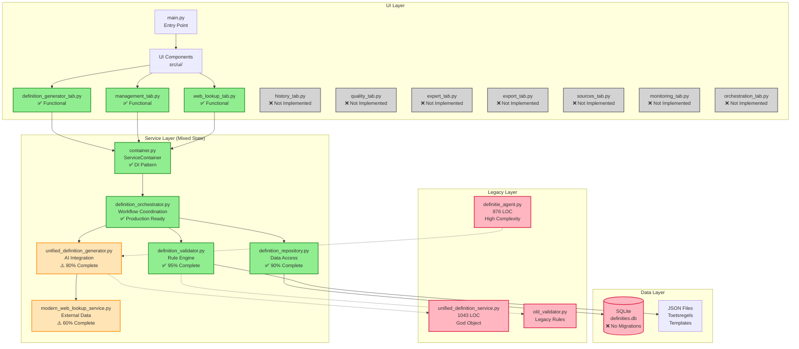
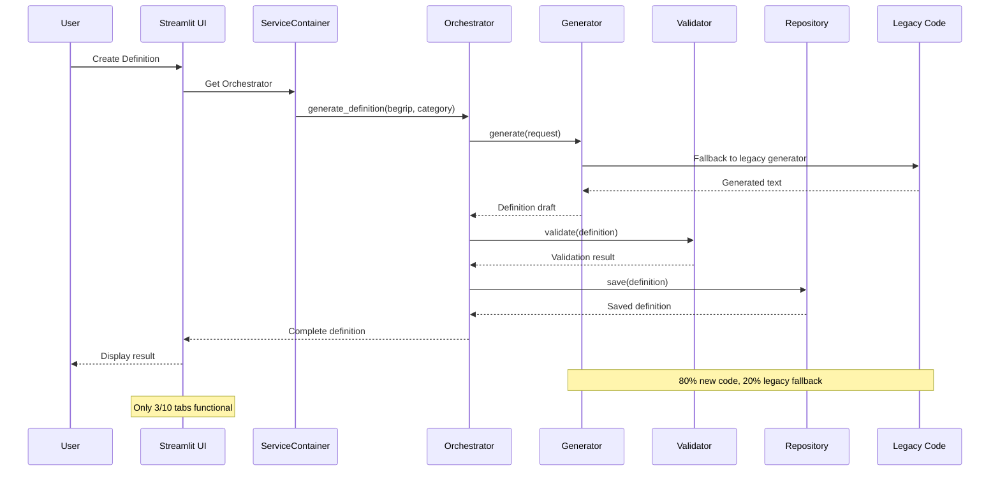
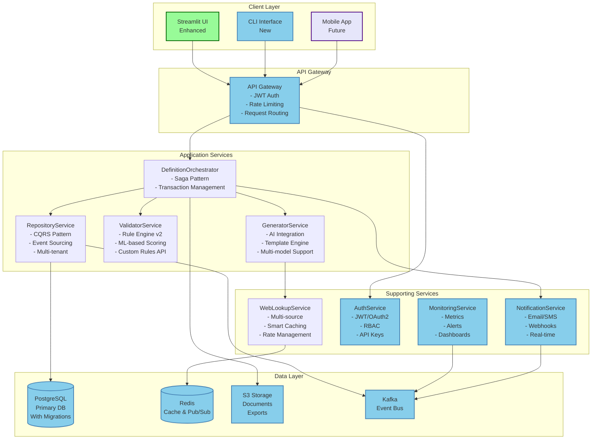
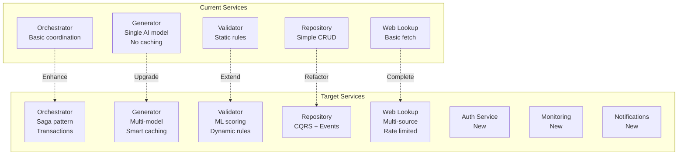

# Architectuur Visualisatie - Definitie App

Dit document biedt een visuele weergave van zowel de huidige (AS-IS) als gewenste (TO-BE) architectuur van de Definitie App, met specifieke aandacht voor Python bestanden en hun functies.

## 1. Huidige Architectuur (AS-IS)

### 1.1 Component Overzicht



### 1.2 Python Bestanden en Hun Functies

#### UI Components (`src/ui/`)
| Bestand | Status | Primaire Functie | Dependencies |
|---------|--------|------------------|--------------|
| `main.py` | ✅ Active | Streamlit app entry point, session management | All UI components |
| `tabbed_interface.py` | ✅ Active | Tab navigation controller | Individual tab modules |
| `definition_generator_tab.py` | ✅ Working | Create new definitions UI | ServiceContainer |
| `management_tab.py` | ✅ Working | Manage existing definitions | ServiceContainer |
| `web_lookup_tab.py` | ✅ Working | External source lookup | ServiceContainer |
| `history_tab.py` | ❌ Stub | Definition history view | Not implemented |
| `quality_tab.py` | ❌ Stub | Quality control dashboard | Not implemented |
| `expert_tab.py` | ❌ Stub | Expert review interface | Not implemented |
| `export_tab.py` | ❌ Stub | Export functionality | Not implemented |
| `sources_tab.py` | ❌ Stub | External sources config | Not implemented |
| `monitoring_tab.py` | ❌ Stub | System monitoring | Not implemented |
| `orchestration_tab.py` | ❌ Stub | Workflow orchestration | Not implemented |

#### Service Layer (`src/services/`)
| Bestand | Status | Primaire Functie | Key Methods |
|---------|--------|------------------|-------------|
| `container.py` | ✅ Production | Dependency injection container | `get_orchestrator()`, `get_repository()` |
| `definition_orchestrator.py` | ✅ Production | Workflow coordination | `generate_definition()`, `validate_definition()` |
| `unified_definition_generator.py` | ⚠️ Partial | AI-powered generation | `generate()`, `_enhance_with_context()` |
| `definition_validator.py` | ✅ Production | Rule-based validation | `validate()`, `_check_rules()` |
| `definition_repository.py` | ✅ Production | Data persistence | `save()`, `get()`, `update()`, `delete()` |
| `modern_web_lookup_service.py` | ⚠️ Partial | External data fetching | `lookup()`, `_fetch_from_source()` |

#### Legacy Components (`src/legacy/`)
| Bestand | Lines | Complexity | Still Used | Migration Status |
|---------|-------|------------|------------|------------------|
| `definitie_agent.py` | 876 | 24 | Yes - Wrapper | Needs full replacement |
| `unified_definition_service.py` | 1043 | 31 | Partially | 60% migrated to new services |
| `old_validator.py` | 456 | 15 | As fallback | Can be removed |

### 1.3 Data Flow - Huidige Situatie



## 2. Gewenste Architectuur (TO-BE)

### 2.1 Component Overzicht



### 2.2 Target Service Architecture

#### Core Application Services
```python
# src/services/definition_orchestrator.py
class DefinitionOrchestrator:
    """
    Verantwoordelijkheden:
    - Workflow coordination met Saga pattern
    - Transaction management
    - Event publishing
    - Service composition
    """
    async def create_definition_workflow(self, request: CreateDefinitionRequest) -> Definition:
        # 1. Start transaction/saga
        # 2. Generate via GeneratorService
        # 3. Validate via ValidatorService
        # 4. Persist via RepositoryService
        # 5. Publish events
        # 6. Handle compensation on failure

# src/services/generator_service.py
class GeneratorService:
    """
    Verantwoordelijkheden:
    - AI model integration (OpenAI, Anthropic, etc.)
    - Prompt template management
    - Context enhancement
    - Response caching
    """
    async def generate(self, request: GenerationRequest) -> GeneratedDefinition:
        # 1. Select optimal AI model
        # 2. Build context from cache
        # 3. Apply templates
        # 4. Stream response
        # 5. Cache result

# src/services/validator_service.py
class ValidatorService:
    """
    Verantwoordelijkheden:
    - Rule engine v2 with hot reload
    - ML-based quality scoring
    - Custom validation rules API
    - Detailed feedback generation
    """
    async def validate(self, definition: Definition) -> ValidationResult:
        # 1. Apply rule sets
        # 2. ML quality prediction
        # 3. Generate feedback
        # 4. Calculate scores

# src/services/repository_service.py
class RepositoryService:
    """
    Verantwoordelijkheden:
    - CQRS implementation
    - Event sourcing
    - Query optimization
    - Multi-tenant support
    """
    async def save(self, definition: Definition) -> str:
        # 1. Validate command
        # 2. Store in write model
        # 3. Publish domain event
        # 4. Update read model
```

### 2.3 Target Folder Structure

```
definitie-app/
├── src/
│   ├── api/                      # API Gateway & REST endpoints
│   │   ├── gateway/
│   │   ├── middleware/
│   │   └── routes/
│   ├── services/                 # Business logic services
│   │   ├── core/                # Core domain services
│   │   │   ├── definition_orchestrator.py
│   │   │   ├── generator_service.py
│   │   │   ├── validator_service.py
│   │   │   └── repository_service.py
│   │   ├── supporting/          # Supporting services
│   │   │   ├── web_lookup_service.py
│   │   │   ├── auth_service.py
│   │   │   ├── notification_service.py
│   │   │   └── monitoring_service.py
│   │   └── shared/              # Shared utilities
│   │       ├── interfaces.py
│   │       ├── exceptions.py
│   │       └── utils.py
│   ├── domain/                  # Domain models
│   │   ├── models/
│   │   ├── events/
│   │   └── commands/
│   ├── infrastructure/          # Infrastructure code
│   │   ├── database/
│   │   ├── cache/
│   │   ├── messaging/
│   │   └── storage/
│   ├── ui/                      # UI applications
│   │   ├── streamlit/          # Current UI
│   │   ├── cli/               # New CLI
│   │   └── shared/            # Shared UI components
│   └── tests/                  # All tests
│       ├── unit/
│       ├── integration/
│       └── e2e/
├── infrastructure/             # IaC definitions
│   ├── kubernetes/
│   ├── terraform/
│   └── docker/
├── migrations/                 # Database migrations
├── docs/                      # Documentation
└── scripts/                   # Utility scripts
```

### 2.4 API Design

```yaml
# API Endpoints Overview
openapi: 3.0.0
info:
  title: Definitie App API
  version: 2.0.0

paths:
  /api/v1/definitions:
    post:
      summary: Create new definition
      tags: [Definitions]
      security:
        - bearerAuth: []
      requestBody:
        required: true
        content:
          application/json:
            schema:
              $ref: '#/components/schemas/CreateDefinitionRequest'
      responses:
        201:
          description: Definition created
          content:
            application/json:
              schema:
                $ref: '#/components/schemas/Definition'

  /api/v1/definitions/{id}:
    get:
      summary: Get definition by ID
      parameters:
        - name: id
          in: path
          required: true
          schema:
            type: string
            format: uuid

  /api/v1/definitions/validate:
    post:
      summary: Validate definition text
      requestBody:
        required: true
        content:
          application/json:
            schema:
              type: object
              properties:
                text:
                  type: string
                category:
                  type: string
                  enum: [type, proces, resultaat, exemplaar]
```

### 2.5 Migration Path

```mermaid
graph LR
    subgraph "Phase 1: Foundation"
        A1[Complete Service<br/>Extraction]
        A2[Add API Gateway]
        A3[Implement Auth]
        A4[Setup Monitoring]
    end

    subgraph "Phase 2: Data Layer"
        B1[PostgreSQL<br/>Migration]
        B2[Add Redis Cache]
        B3[Implement<br/>Event Bus]
        B4[Add Migrations]
    end

    subgraph "Phase 3: Features"
        C1[Complete All<br/>UI Tabs]
        C2[Add CLI]
        C3[Performance<br/>Optimization]
        C4[Advanced<br/>Validation]
    end

    subgraph "Phase 4: Production"
        D1[Kubernetes<br/>Deployment]
        D2[Full Monitoring]
        D3[Security<br/>Hardening]
        D4[Documentation]
    end

    A1 --> A2 --> A3 --> A4
    A4 --> B1 --> B2 --> B3 --> B4
    B4 --> C1 --> C2 --> C3 --> C4
    C4 --> D1 --> D2 --> D3 --> D4
```



## 3. Key Differences Summary

### 3.1 Architecture Evolution

| Aspect | Current (AS-IS) | Target (TO-BE) |
|--------|-----------------|----------------|
| **Pattern** | Hybrid monolith/services | True microservices |
| **Database** | SQLite, no migrations | PostgreSQL with migrations |
| **Caching** | None | Redis multi-layer |
| **Auth** | None | JWT/OAuth2 + RBAC |
| **API** | Direct function calls | REST API Gateway |
| **Events** | None | Kafka event bus |
| **UI** | 30% functional | 100% + CLI + Mobile |
| **Monitoring** | Basic logging | Full observability |
| **Deployment** | Manual | Kubernetes + CI/CD |
| **Performance** | 8-12s response | <2s response |

### 3.2 Service Comparison



## 4. Browser-Friendly Views

Deze diagrammen zijn geoptimaliseerd voor weergave in browsers:
- Mermaid diagrammen werken in GitHub, GitLab, en vele markdown viewers
- Kleuren geven status aan: Groen (✅), Oranje (⚠️), Rood (❌), Grijs (niet geïmplementeerd)
- Interactieve elementen in ondersteunde viewers

Voor het beste resultaat:
1. Open dit bestand in GitHub of een Mermaid-compatible viewer
2. Gebruik een moderne browser (Chrome, Firefox, Safari)
3. Voor offline viewing: gebruik een tool zoals Mermaid Live Editor

## 5. Quick Reference

### Current State Issues
- 70% UI non-functional
- No authentication/security
- Performance 4-6x slower than target
- 23% code duplication
- No proper testing (11% coverage)

### Target State Benefits
- Full functionality across all interfaces
- <2s response times
- Secure multi-tenant architecture
- 80%+ test coverage
- Automated deployment & monitoring

---

*Document gemaakt door: Winston (Architect)*
*Datum: 2024-01-19*
*Versie: 1.0*
