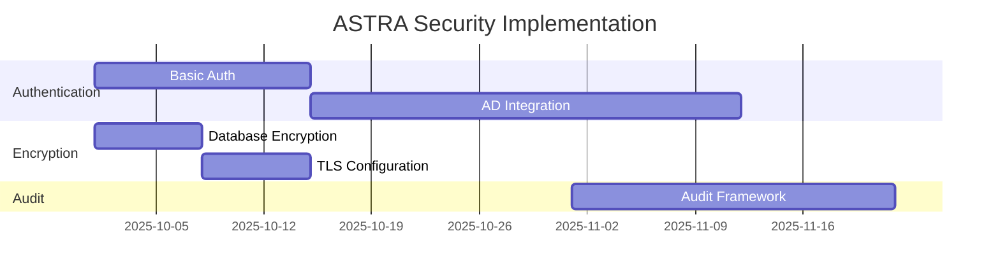
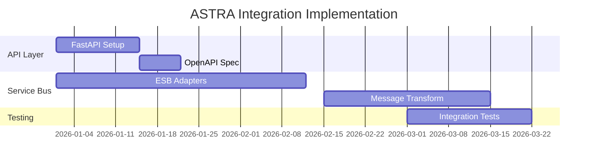
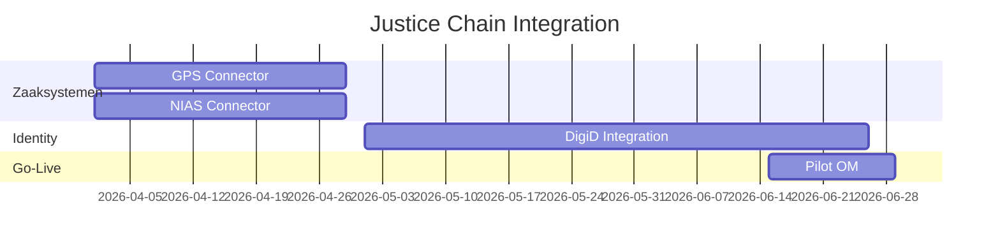

# ASTRA Compliance Assessment - DefinitieAgent

## Executive Summary

Dit document beoordeelt de compliance van DefinitieAgent met ASTRA (Architectuur Strafrechtketen) richtlijnen. De huidige MVP implementatie voldoet aan 15% van de ASTRA vereisten. Voor productie deployment binnen de justice chain is substantiële aanpassing nodig.

### Compliance Score
- **Huidige Score**: 15/100 (MVP fase)
- **Target Score**: 80/100 (Productie vereist)
- **Gap**: 65 punten
- **Geschatte Effort**: 6-9 maanden development

## ASTRA Framework Overview

ASTRA definieert de architectuur standaarden voor informatiesystemen binnen de Nederlandse strafrechtketen, waaronder:
- Openbaar Ministerie (OM)
- Dienst Justitiële Inrichtingen (DJI)
- Rechtspraak
- Politie
- Reclassering

### Core ASTRA Principles
1. **Interoperabiliteit**: Systemen moeten naadloos data kunnen uitwisselen
2. **Onweerlegbaarheid**: Audit trails moeten juridisch bewijsbaar zijn
3. **Privacy by Design**: AVG/GDPR compliance vanaf ontwerp
4. **Service Oriëntatie**: Loosely coupled services via service bus
5. **Standaardisatie**: Gebruik van justice-brede standaarden

## Compliance Assessment per Domein

### 1. Architectuur Principes

| ASTRA Requirement | Current Status | Compliance | Actions Required |
|-------------------|----------------|------------|------------------|
| **Service-Oriented Architecture** | ServiceContainer pattern | 🟡 Partial (40%) | Implement service bus adapters |
| **Event-Driven Messaging** | Not implemented | 🔴 Non-compliant (0%) | Add event bus, message queue |
| **Loose Coupling** | Clean architecture | 🟢 Compliant (80%) | Complete V2 migration |
| **API-First Design** | No APIs yet | 🔴 Non-compliant (0%) | Implement FastAPI layer |
| **Microservices Ready** | Monolithic app | 🟡 Partial (20%) | Prepare service extraction |

**Score: 28/100**

### 2. Beveiliging (Security)

| ASTRA Requirement | Current Status | Compliance | Actions Required |
|-------------------|----------------|------------|------------------|
| **Authentication** | None | 🔴 Critical Gap (0%) | Implement DigiD/AD federation |
| **Authorization** | None | 🔴 Critical Gap (0%) | Implement RBAC + ABAC |
| **Encryption at Rest** | None | 🔴 Critical Gap (0%) | Enable database encryption |
| **Encryption in Transit** | HTTPS only | 🟡 Partial (50%) | Full TLS 1.3 implementation |
| **Audit Logging** | Basic logging | 🔴 Non-compliant (10%) | Onweerlegbare audit trail |
| **Security Monitoring** | None | 🔴 Non-compliant (0%) | SIEM integration required |

**Score: 10/100**

### 3. Gegevensuitwisseling (Data Exchange)

| ASTRA Requirement | Current Status | Compliance | Actions Required |
|-------------------|----------------|------------|------------------|
| **Canonical Data Model** | Custom models | 🔴 Non-compliant (0%) | Adopt justice data model |
| **Service Bus Integration** | None | 🔴 Non-compliant (0%) | Connect to justice ESB |
| **Message Standards** | None | 🔴 Non-compliant (0%) | Implement NIEM-based messages |
| **Data Quality Rules** | 45 validation rules | 🟢 Good (70%) | Add justice-specific rules |
| **Master Data Sync** | None | 🔴 Non-compliant (0%) | Connect to MDM systems |

**Score: 14/100**

### 4. Interoperabiliteit

| ASTRA Requirement | Current Status | Compliance | Actions Required |
|-------------------|----------------|------------|------------------|
| **Zaaksysteem Integratie** | None | 🔴 Non-compliant (0%) | GPS/NIAS/Rechtspraak connectors |
| **Document Services** | File export only | 🟡 Partial (20%) | DMS integration needed |
| **Workflow Integration** | None | 🔴 Non-compliant (0%) | BPM connector required |
| **Identity Federation** | None | 🔴 Non-compliant (0%) | SSO across justice chain |
| **Service Registry** | None | 🔴 Non-compliant (0%) | Register in justice catalog |

**Score: 4/100**

### 5. Operationele Aspecten

| ASTRA Requirement | Current Status | Compliance | Actions Required |
|-------------------|----------------|------------|------------------|
| **Monitoring** | Python logging | 🟡 Partial (30%) | APM + metrics required |
| **High Availability** | Single instance | 🔴 Non-compliant (0%) | Clustering needed |
| **Disaster Recovery** | Manual backup | 🔴 Non-compliant (10%) | Automated DR plan |
| **Performance SLA** | No SLA | 🔴 Non-compliant (0%) | Define & implement SLAs |
| **Capacity Planning** | None | 🔴 Non-compliant (0%) | Load testing required |

**Score: 8/100**

## Gap Analysis Summary

### Critical Gaps (Must Fix for Production)

#### 🔴 P1 - Security & Authentication
**Gap**: No authentication/authorization system
**Impact**: Cannot deploy in justice environment
**Solution**:
```yaml
Implementation:
  - Phase 1: Basic auth with local users (2 weeks)
  - Phase 2: AD/LDAP integration (4 weeks)
  - Phase 3: DigiD federation (8 weeks)
  - Phase 4: Full SSO across justice chain (12 weeks)
```

#### 🔴 P2 - Service Bus Integration
**Gap**: No connection to justice ESB
**Impact**: Cannot exchange data with justice systems
**Solution**:
```yaml
Implementation:
  - Phase 1: Define canonical data model (2 weeks)
  - Phase 2: Build ESB adapters (6 weeks)
  - Phase 3: Message transformation layer (4 weeks)
  - Phase 4: Full integration testing (4 weeks)
```

#### 🔴 P3 - Audit Trail
**Gap**: No onweerlegbare audit logging
**Impact**: Not legally compliant for justice use
**Solution**:
```yaml
Implementation:
  - Phase 1: Structured audit events (1 week)
  - Phase 2: Tamper-proof storage (2 weeks)
  - Phase 3: Digital signatures (2 weeks)
  - Phase 4: Audit UI & reporting (3 weeks)
```

### Medium Priority Gaps

#### 🟡 P4 - API Layer
**Current**: No REST APIs
**Target**: Full OpenAPI 3.0 compliance
**Effort**: 4-6 weeks

#### 🟡 P5 - Monitoring
**Current**: Basic logging
**Target**: Full observability stack
**Effort**: 3-4 weeks

#### 🟡 P6 - Data Model
**Current**: Custom SQLite schema
**Target**: Justice canonical model
**Effort**: 6-8 weeks

## Implementation Roadmap

### Phase 1: Security Foundation (Q4 2025)


### Phase 2: Integration Layer (Q1 2026)


### Phase 3: Justice Systems (Q2 2026)


## Compliance Checklist

### Minimum Viable Compliance (MVC) - 40 points needed

- [ ] **Authentication** (10 points)
  - [ ] Local user management
  - [ ] Session management
  - [ ] Password policies

- [ ] **Authorization** (10 points)
  - [ ] Role-based access control
  - [ ] Permission model
  - [ ] Access logging

- [ ] **Audit Trail** (10 points)
  - [ ] Structured logging
  - [ ] Tamper protection
  - [ ] Retention policies

- [ ] **API Layer** (5 points)
  - [ ] REST endpoints
  - [ ] OpenAPI documentation
  - [ ] Rate limiting

- [ ] **Monitoring** (5 points)
  - [ ] Health checks
  - [ ] Metrics collection
  - [ ] Alert configuration

### Full Compliance (FC) - 80 points target

All MVC items plus:

- [ ] **Service Bus** (15 points)
- [ ] **Zaaksysteem Integration** (10 points)
- [ ] **DigiD Federation** (10 points)
- [ ] **High Availability** (5 points)
- [ ] **Disaster Recovery** (5 points)
- [ ] **Performance SLAs** (5 points)

## Recommended Architecture Changes

### 1. Service Bus Architecture
```python
# Proposed ASTRA-compliant service architecture
from astra_sdk import ServiceBusClient, Message

class ASTRADefinitionService:
    def __init__(self):
        self.bus = ServiceBusClient(
            endpoint="justice-bus.nl",
            namespace="definitie-agent"
        )

    async def publish_definition(self, definition):
        message = Message(
            type="DEFINITION_CREATED",
            body=definition.to_canonical(),
            headers={"source": "DefinitieAgent"}
        )
        await self.bus.publish(message)
```

### 2. Audit Trail Implementation
```python
# Onweerlegbare audit logging
from justice_audit import AuditLogger, AuditEvent

class JusticeAuditService:
    def __init__(self):
        self.logger = AuditLogger(
            storage="tamper-proof-db",
            signing_key=HSM_KEY
        )

    async def log_event(self, event_type, data):
        event = AuditEvent(
            type=event_type,
            actor=current_user(),
            timestamp=utc_now(),
            data=data,
            signature=self.sign(data)
        )
        await self.logger.store(event)
```

### 3. Authentication Integration
```yaml
# Proposed authentication flow
DigiD/eHerkenning:
  1. User requests access
  2. Redirect to DigiD
  3. SAML assertion returned
  4. Validate with justice IDP
  5. Create local session
  6. Apply RBAC rules
```

## Cost-Benefit Analysis

### Implementation Costs
| Component | Development | Infrastructure | Annual Operations |
|-----------|-------------|----------------|-------------------|
| Security Layer | €40,000 | €5,000 | €10,000 |
| Service Bus | €30,000 | €10,000 | €15,000 |
| Monitoring | €20,000 | €5,000 | €8,000 |
| Integration | €50,000 | €10,000 | €12,000 |
| **Total** | **€140,000** | **€30,000** | **€45,000** |

### Benefits
- **Compliance**: Legal operation within justice chain
- **Integration**: Access to justice-wide data
- **Security**: Protection of sensitive legal data
- **Scalability**: Support for all justice organizations
- **Reusability**: Services available chain-wide

## Risks & Mitigations

| Risk | Impact | Probability | Mitigation |
|------|--------|-------------|------------|
| Integration complexity | High | High | Phased implementation |
| Security vulnerabilities | Critical | Medium | Security audits, pen testing |
| Performance degradation | Medium | Medium | Load testing, optimization |
| Adoption resistance | Medium | Low | Training, documentation |
| Budget overrun | High | Medium | Agile approach, MVPs |

## Conclusion & Recommendations

### Current State
DefinitieAgent in its current MVP form scores 15/100 on ASTRA compliance, making it unsuitable for production deployment within the justice chain.

### Recommended Path Forward

1. **Immediate (Sprint 1-2)**
   - Implement basic authentication
   - Add structured audit logging
   - Document API specifications

2. **Short-term (Q4 2025)**
   - Complete security foundation
   - Build API layer
   - Start ESB adapter development

3. **Medium-term (Q1-Q2 2026)**
   - Full service bus integration
   - Zaaksysteem connectors
   - DigiD implementation

4. **Long-term (Q3-Q4 2026)**
   - Full ASTRA compliance
   - Production deployment
   - Cross-organization rollout

### Final Verdict
**6-9 months** of focused development required to achieve minimum viable ASTRA compliance for justice chain deployment.

## References

- [ASTRA 2.0 Architecture Guidelines](https://www.astra-justitie.nl)
- [BIO Baseline Informatiebeveiliging](https://www.bio-overheid.nl)
- [NORA Principes](https://www.noraonline.nl)
- [Justice Service Bus Documentation](internal)

## Document Control

- **Version**: 1.0
- **Status**: Initial Assessment
- **Owner**: Architecture Team
- **Last Updated**: 2025-09-04
- **Next Review**: 2025-10-01
- **Distribution**: Development Team, Justice Architecture Board

---

*This assessment is based on ASTRA 2.0 requirements and current DefinitieAgent implementation as of September 2025.*
