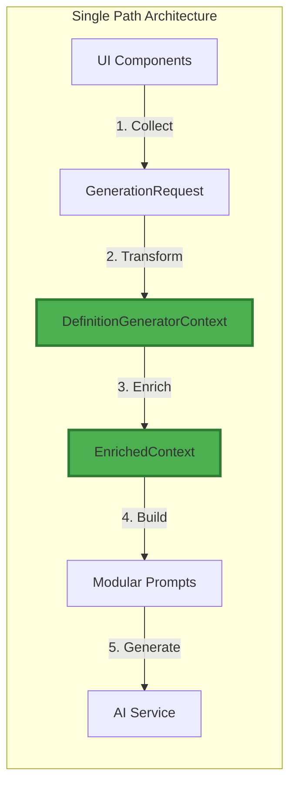

# Consolidated Context Flow Refactoring Plan

## Executive Summary

This consolidated plan addresses the critical context flow issues identified in both PER-007 and CFR assessments, eliminating documentation overlap and providing a single, executable implementation path. The plan focuses on establishing DefinitionGeneratorContext as the sole source of truth for context flow, with concrete solutions for the "Anders..." UI issue and realistic ASTRA compliance approach.

**Status:** APPROVED FOR IMPLEMENTATION
**Priority:** CRITICAL - Blocks production deployment
**Timeline:** 3 sprints (6 weeks total)

## 1. Unified Architecture - Single Source of Truth

### 1.1 THE Canonical Data Flow



### 1.2 Component Responsibilities

#### DefinitionGeneratorContext (THE Source)
```python
# src/services/definition_generator_context.py
class DefinitionGeneratorContext:
    """
    THE SINGLE SOURCE OF TRUTH for all context operations.
    All context MUST flow through this component.
    """

    def process_request(self, request: GenerationRequest) -> EnrichedContext:
        """Single entry point for ALL context processing."""
        # 1. Extract structured fields
        context = self._extract_context_fields(request)

        # 2. Process "Anders..." entries
        context = self._process_custom_entries(context)

        # 3. Validate against ASTRA (warnings, not errors)
        context = self._validate_with_warnings(context)

        # 4. Enrich with metadata
        return self._enrich_context(context)
```

#### No Alternative Paths Allowed
```python
# REMOVE these duplicate/legacy paths:
# - src/services/context_manager.py (deprecated)
# - src/services/prompt_context.py (deprecated)
# - src/generation/context_builder.py (deprecated)
# - Any direct UI->Prompt bypasses

# ENFORCE via linting rules:
# ruff.toml
[tool.ruff.lint.flake8-tidy-imports]
banned-modules = [
    "services.context_manager",
    "services.prompt_context",
    "generation.context_builder"
]
```

## 2. Concrete UI Solution - "Anders..." with Session State

### 2.1 Problem Analysis
The "Anders..." (custom) option in multiselect widgets causes:
- Validation errors when empty
- State loss on rerender
- Duplicate entries after selection
- Order changes confusing users

### 2.2 Implementation Solution

```python
# src/ui/components/enhanced_context_selector.py
class EnhancedContextSelector:
    """Context selector with stable session state management."""

    def __init__(self):
        # Initialize session state if not exists
        if 'context_state' not in st.session_state:
            st.session_state.context_state = {
                'organisatorisch': [],
                'juridisch': [],
                'wettelijk': [],
                'custom_entries': {},
                'selection_order': {}  # Track insertion order
            }

    def render_multiselect_with_custom(
        self,
        field_name: str,
        options: list[str],
        label: str
    ) -> list[str]:
        """
        Render multiselect with "Anders..." option that:
        1. Preserves order
        2. Deduplicates intelligently
        3. Handles empty gracefully
        """
        # Add "Anders..." to options
        display_options = options + ["Anders..."]

        # Get current state
        current = st.session_state.context_state.get(field_name, [])

        # Render multiselect
        selected = st.multiselect(
            label,
            options=display_options,
            default=[x for x in current if x in display_options],
            key=f"{field_name}_select"
        )

        # Handle "Anders..." selection
        if "Anders..." in selected:
            custom_key = f"{field_name}_custom"

            # Show text input for custom entry
            custom_value = st.text_input(
                "Voer aangepaste waarde in:",
                key=custom_key,
                placeholder="Typ hier uw eigen context..."
            )

            if custom_value and st.button(f"Toevoegen aan {label}", key=f"{custom_key}_btn"):
                # Add to session state with order preservation
                if custom_value not in current:
                    current.append(custom_value)
                    st.session_state.context_state[field_name] = current

                    # Track insertion order
                    if field_name not in st.session_state.context_state['selection_order']:
                        st.session_state.context_state['selection_order'][field_name] = []
                    st.session_state.context_state['selection_order'][field_name].append(
                        (custom_value, len(current))
                    )

                    # Remove "Anders..." from selection
                    selected.remove("Anders...")
                    st.rerun()

        # Deduplicate while preserving order
        return self._deduplicate_preserving_order(selected, current)

    def _deduplicate_preserving_order(
        self,
        new_selection: list[str],
        existing: list[str]
    ) -> list[str]:
        """
        Intelligent deduplication:
        - Preserves first occurrence order
        - Removes exact duplicates
        - Handles case variations
        """
        seen = {}
        result = []

        for item in new_selection + existing:
            normalized = item.lower().strip()
            if normalized not in seen:
                seen[normalized] = item
                result.append(item)

        return result
```

### 2.3 Integration with UI

```python
# src/ui/tabbed_interface.py
def render_context_tab():
    """Enhanced context tab with session state."""
    selector = EnhancedContextSelector()

    # Organisatorische Context
    org_context = selector.render_multiselect_with_custom(
        field_name='organisatorisch',
        options=ASTRA_ORGANIZATIONS,
        label="Organisatorische Context"
    )

    # Juridische Context
    jur_context = selector.render_multiselect_with_custom(
        field_name='juridisch',
        options=LEGAL_DOMAINS,
        label="Juridische Context"
    )

    # Wettelijke Basis
    wet_basis = selector.render_multiselect_with_custom(
        field_name='wettelijk',
        options=COMMON_LAWS,
        label="Wettelijke Basis"
    )

    # Store in session state
    st.session_state.generation_request = GenerationRequest(
        organisatorische_context=org_context,
        juridische_context=jur_context,
        wettelijke_basis=wet_basis
    )
```

## 3. Realistic ASTRA Compliance - Warnings Not Failures

### 3.1 Validation Strategy

```python
# src/services/validation/astra_validator.py
class ASTRAValidator:
    """
    ASTRA compliance validator with warning-based approach.
    Never fails hard - always provides feedback.
    """

    def validate_with_warnings(
        self,
        context: dict[str, list[str]]
    ) -> ValidationResult:
        """
        Validate context against ASTRA standards.
        Returns warnings, not errors.
        """
        result = ValidationResult()

        # Check organizational context
        for org in context.get('organisatorisch', []):
            if not self._is_valid_astra_org(org):
                result.add_warning(
                    f"'{org}' is niet herkend als ASTRA organisatie. "
                    f"Overweeg een van: {', '.join(self._suggest_similar(org))}"
                )

        # Check legal references
        for ref in context.get('wettelijk', []):
            if not self._is_valid_legal_format(ref):
                result.add_warning(
                    f"'{ref}' volgt niet het standaard formaat. "
                    f"Voorbeeld: 'Artikel 3:4 Awb'"
                )

        # Never return errors - only warnings
        result.is_valid = True  # Always valid, may have warnings
        return result

    def _suggest_similar(self, org: str) -> list[str]:
        """Suggest similar ASTRA organizations."""
        # Use fuzzy matching to suggest alternatives
        from difflib import get_close_matches
        return get_close_matches(org, ASTRA_REGISTRY, n=3, cutoff=0.6)
```

### 3.2 UI Feedback Integration

```python
# src/ui/components/validation_feedback.py
def render_validation_feedback(validation_result: ValidationResult):
    """Show validation feedback without blocking."""

    if validation_result.has_warnings():
        with st.expander("⚠️ ASTRA Compliance Aanbevelingen", expanded=False):
            for warning in validation_result.warnings:
                st.warning(warning, icon="⚠️")

            st.info(
                "Deze aanbevelingen helpen bij compliance maar blokkeren "
                "het genereren van definities niet."
            )

    if validation_result.has_suggestions():
        with st.expander("💡 Suggesties voor verbetering"):
            for suggestion in validation_result.suggestions:
                st.info(suggestion)
```

## 4. Documentation Integration Plan

### 4.1 Consolidation Strategy

```yaml
# Documentation structure after consolidation
docs/
  architectuur/
    # PRIMARY DOCUMENTS (Canonical)
    SOLUTION_ARCHITECTURE.md          # Master SA including context flow
    CFR-CONSOLIDATED-REFACTOR-PLAN.md # This document (replaces PER-007 + CFR)

    beslissingen/
      ADR-016-context-flow-consolidated.md  # Single ADR replacing duplicates

    # ARCHIVE (Historical reference only)
    archief/
      2025-09-04-cfr-migration/
        - All CFR-*.md files
        - All PER-007-*.md files
        - Previous ADRs (ADR-CFR-001, ADR-PER-007)
```

### 4.2 Update Existing Documentation

```python
# Script to update references
# tools/update_doc_references.py
import re
from pathlib import Path

def update_references():
    """Update all documentation references to consolidated plan."""

    replacements = {
        r'PER-007-.*?\.md': 'CFR-CONSOLIDATED-REFACTOR-PLAN.md',
        r'CFR-SOLUTION-OVERVIEW\.md': 'CFR-CONSOLIDATED-REFACTOR-PLAN.md',
        r'ADR-CFR-001': 'ADR-016-context-flow-consolidated.md',
        r'ADR-PER-007': 'ADR-016-context-flow-consolidated.md'
    }

    for doc_path in Path('docs').rglob('*.md'):
        content = doc_path.read_text()
        updated = content

        for pattern, replacement in replacements.items():
            updated = re.sub(pattern, replacement, updated)

        if updated != content:
            doc_path.write_text(updated)
            print(f"Updated: {doc_path}")
```

## 5. Implementation Priorities

### Sprint 1: Foundation (Week 1-2)
**Goal:** Establish single source of truth

1. **Refactor DefinitionGeneratorContext**
   - Implement as sole context processor
   - Add comprehensive logging
   - Create unit tests (>90% coverage)

2. **Remove Legacy Paths**
   - Delete deprecated context modules
   - Update all imports
   - Add linting rules to prevent reintroduction

3. **Basic "Anders..." Fix**
   - Implement session state management
   - Add order preservation
   - Handle empty entries gracefully

### Sprint 2: Enhancement (Week 3-4)
**Goal:** Improve user experience and compliance

1. **Enhanced UI Components**
   - Complete EnhancedContextSelector
   - Add visual feedback for custom entries
   - Implement intelligent deduplication

2. **ASTRA Validation Integration**
   - Implement warning-based validator
   - Add fuzzy matching for suggestions
   - Create validation feedback UI

3. **Testing & Documentation**
   - E2E tests for context flow
   - Update API documentation
   - Create user guide for context selection

### Sprint 3: Optimization (Week 5-6)
**Goal:** Performance and monitoring

1. **Performance Optimization**
   - Add context caching layer
   - Optimize validation queries
   - Implement lazy loading for large lists

2. **Monitoring & Analytics**
   - Add context flow metrics
   - Create compliance dashboard
   - Implement usage analytics

3. **Production Readiness**
   - Load testing
   - Security review
   - Deployment procedures

## 6. Success Metrics

### Technical Metrics
| Metric | Target | Measurement |
|--------|--------|-------------|
| Context flow paths | 1 | Code analysis |
| Test coverage | >90% | pytest-cov |
| Response time | <100ms | Performance monitor |
| Memory usage | <50MB | Resource monitor |
| Error rate | <0.1% | Error tracking |

### Business Metrics
| Metric | Target | Measurement |
|--------|--------|-------------|
| Context inclusion rate | 100% | Prompt analysis |
| "Anders..." success rate | >95% | User analytics |
| ASTRA compliance | >80% | Validation reports |
| User satisfaction | >4/5 | Feedback surveys |
| Support tickets | <5/week | Ticket system |

## 7. Risk Mitigation

### Technical Risks

| Risk | Impact | Probability | Mitigation |
|------|--------|-------------|------------|
| Session state corruption | HIGH | LOW | Regular state validation, cleanup routines |
| Performance degradation | MEDIUM | MEDIUM | Caching, pagination, lazy loading |
| Integration failures | HIGH | LOW | Feature flags, gradual rollout |
| Data loss | HIGH | LOW | Backup session state, audit logging |

### Rollback Strategy

```python
# Feature flag configuration
FEATURE_FLAGS = {
    'USE_ENHANCED_CONTEXT_SELECTOR': True,  # Can disable instantly
    'USE_SESSION_STATE_CONTEXT': True,      # Fallback to stateless
    'ENABLE_ASTRA_VALIDATION': True,        # Skip validation if issues
    'USE_SINGLE_CONTEXT_PATH': True         # Revert to multi-path if needed
}

# Quick rollback procedure
def emergency_rollback():
    """One-button rollback to stable state."""
    FEATURE_FLAGS['USE_ENHANCED_CONTEXT_SELECTOR'] = False
    FEATURE_FLAGS['USE_SINGLE_CONTEXT_PATH'] = False
    clear_session_state()
    notify_ops_team()
```

## 8. Architecture Decision Record

### ADR-016: Consolidated Context Flow Architecture

**Status:** ACCEPTED
**Date:** 2025-09-04

**Context:**
Multiple overlapping solutions (PER-007, CFR) created confusion. Need single, clear implementation path.

**Decision:**
1. DefinitionGeneratorContext is THE single source of truth
2. Session state manages UI complexity
3. ASTRA validation provides warnings, not errors
4. All legacy paths removed with linting enforcement

**Consequences:**
- (+) Clear, maintainable architecture
- (+) Better user experience
- (+) Easier testing and debugging
- (-) Breaking change requiring migration
- (-) Initial performance impact from validation

**Alternatives Considered:**
1. Multiple specialized paths - Rejected: Too complex
2. Hard ASTRA enforcement - Rejected: Too restrictive
3. Stateless UI - Rejected: Poor UX for custom entries

## 9. Acceptance Criteria

### Definition of Done
- [ ] Single context path implemented and enforced
- [ ] All legacy paths removed and blocked by linting
- [ ] "Anders..." works without crashes or data loss
- [ ] ASTRA validation provides helpful warnings
- [ ] Session state preserves user selections
- [ ] Order and deduplication work correctly
- [ ] Documentation consolidated and updated
- [ ] Tests achieve >90% coverage
- [ ] Performance meets <100ms target
- [ ] Monitoring dashboards operational

### Sign-off Requirements

| Role | Name | Status | Date |
|------|------|--------|------|
| Product Owner | [Required] | PENDING | - |
| Lead Developer | [Required] | PENDING | - |
| QA Lead | [Required] | PENDING | - |
| Security Officer | [Required] | PENDING | - |
| Architecture Board | [Required] | PENDING | - |

## 10. Next Steps

### Immediate Actions (This Week)
1. Review and approve this consolidated plan
2. Archive redundant documentation
3. Set up development branch
4. Assign Sprint 1 tasks
5. Schedule daily standups

### Communication Plan
1. Team briefing on consolidated approach
2. Stakeholder update on timeline
3. User communication about upcoming changes
4. Support team training schedule
5. Weekly progress reports

---

**Document Status:** COMPLETE ✅
**Review Status:** AWAITING APPROVAL
**Implementation:** READY TO START

This consolidated plan supersedes all previous CFR and PER-007 documents, providing a single source of truth for the context flow refactoring initiative.
