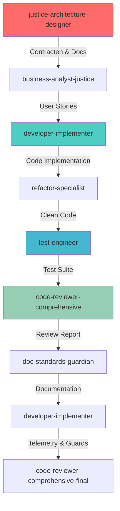
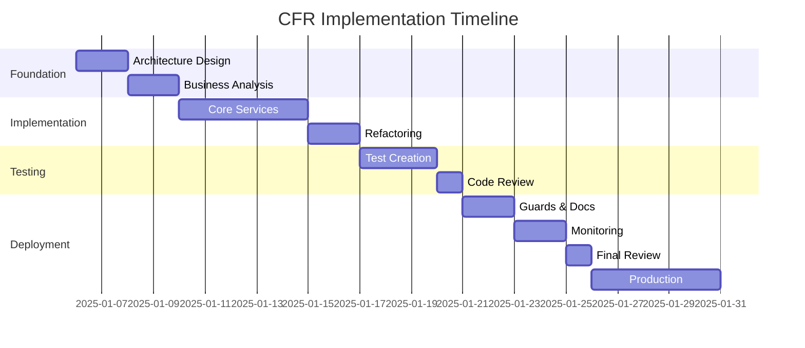

# CFR Context Flow Refactoring - Agent-Based Implementation Plan

## Executive Summary

Dit document bevat het complete implementatieplan voor de Context Flow Refactoring (CFR) met gebruik van gespecialiseerde AI agents. Het plan elimineert alle session state dependencies uit services en implementeert een volledig stateless architectuur conform de Enterprise Architecture principes.

**Doel:** Implementeer stateless context flow architectuur zonder UI/session state dependencies in services (DI‑singletons toegestaan)
**Tijdlijn:** 5 weken (3 sprints)
**Agents:** 9 gespecialiseerde agents in gefaseerde workflow
**Success Rate Target:** 95% "Anders..." optie success, <100ms P95 latency

## Kritieke Review Aandachtspunten

### Uit Architecture Review:
1. **DataAggregationService** merge policy moet expliciet gedocumenteerd zijn
2. **Formatter drift preventie** via shared ContextFormatter
3. **Telemetrie privacy** met 90-dag retentie en audit logging
4. **Performance budgets** strikt gehandhaafd: aggregatie <50ms, validatie <10ms
5. **CI/CD guards** moeten regression voorkomen

### Architectuur Beslissingen:
- UI preview strings zijn **ALLEEN** voor presentatie, NOOIT als databron
- Alle context data flows via gestructureerde lijsten
- Services hebben GEEN session state dependencies
- Pure functions met parameters, geen side effects

## 🎯 AGENT WORKFLOW OVERVIEW



## 📅 FASE 1: FOUNDATION (Week 1-2)

### Planrevisie v1 (Ready for Review)
- Minimaliseer scope en voorkom over‑engineering:
  - Geen directory‑reorganisatie; hergebruik bestaande modules en paden.
  - Nieuwe componenten integreren in bestaande lagen (context, prompts, aggregation).
- Scheiding UI vs services:
  - Geen `streamlit` of session state in `src/services/**`.
  - UI‑toggles/feature flags uitsluitend in UI‑laag.
- Performance‑budgets expliciet voor in‑process paden:
  - Aggregation <50ms P95, Validation <10ms P95 (zonder LLM‑calls).
  - End‑to‑end met LLM valt buiten deze budgetten en wordt apart gemeten.
- CI/CD guards toevoegen:
  - Verbied `streamlit`‑imports in `src/services/**` (guard test).
  - Contracttests voor EnrichedContext en prompt‑formatting.
  - Prompt‑lengte en stijl (geen emoji in PROMPT‑style) afdwingen via tests.

### 🏛️ AGENT 1: justice-architecture-designer
**Start:** Maandag Week 1, 09:00
**Duur:** 16 uur (2 dagen)
**Prerequisites:** Geen
**Handover:** Dinsdag Week 1, 17:00 → business-analyst-justice

#### Concrete Taken:

**DAG 1 - Maandag (8 uur)**

##### Taak 1.1: Analyseer Huidige Architectuur (09:00-11:00)
```yaml
Actions:
  - Read: docs/architectuur/CURRENT_ARCHITECTURE_OVERVIEW.md
  - Read: docs/architectuur/SA.md, EA.md, TA.md
  - Identify: Gaps voor stateless design

Output:
  - Gap analysis document
  - Architecture compliance checklist
```

##### Taak 1.2: Design DataAggregationService (11:00-13:00)
```yaml
Create: docs/architectuur/DataAggregationService-SA.md

Content:
  Service Boundaries:
    - Input: GenerationRequest (UI), ContextData (DB)
    - Output: EnrichedContext
    - Dependencies: Repository, Cache, Telemetry

  Interface Contract:
    get_last_context(user_id: Optional[str]) -> ContextData
    aggregate_for_generation(request, previous) -> EnrichedContext

  State Elimination:
    - NO session_state imports
    - All data via parameters
    - Pure functions only
```

##### Taak 1.3: Formaliseer MergePolicy (14:00-16:00)
```yaml
Create: docs/architectuur/specifications/MergePolicy.yaml

merge_policy:
  rules:
    priority: "ui_first"  # UI values hebben altijd voorrang
    deduplication:
      strategy: "order_preserving"
      case_sensitive: false
    canonicalization:
      enabled: true
      entities:
        - pattern: "openbaar ministrie|om"
          canonical: "OM"
        - pattern: "dienst justitiele inrichtingen|dji"
          canonical: "DJI"
    limits:
      max_items_per_type: 10
      max_string_length: 120
      truncation: "ellipsis"  # Add "..." when truncating

  fallback:
    on_db_failure: "empty_context"
    log_level: "warning"
    cache_ttl: 300  # 5 minutes
```

##### Taak 1.4: Design EnrichedContext Schema (16:00-17:00)
```json
{
  "$schema": "http://json-schema.org/draft-07/schema#",
  "title": "EnrichedContext",
  "type": "object",
  "required": ["organisatorisch", "juridisch", "wettelijk"],
  "properties": {
    "organisatorisch": {
      "type": "array",
      "maxItems": 10,
      "items": {"type": "string", "maxLength": 120}
    },
    "juridisch": {
      "type": "array",
      "maxItems": 10,
      "items": {"type": "string", "maxLength": 120}
    },
    "wettelijk": {
      "type": "array",
      "maxItems": 10,
      "items": {"type": "string", "maxLength": 120}
    },
    "custom_entries": {
      "type": "object",
      "additionalProperties": {"type": "array"}
    },
    "validation_warnings": {
      "type": "array",
      "items": {"type": "string"}
    },
    "astra_suggestions": {
      "type": "array",
      "maxItems": 3
    },
    "metadata": {
      "type": "object",
      "properties": {
        "source": {"enum": ["ui", "db", "fallback"]},
        "timestamp": {"type": "string", "format": "date-time"},
        "merge_stats": {"type": "object"}
      }
    }
  }
}
```

**DAG 2 - Dinsdag (8 uur)**

##### Taak 1.5: Create ASTRA Registry (09:00-11:00)
```json
Create: config/astra_registry.json

{
  "version": "1.0.0",
  "last_updated": "2025-01-05",
  "organizations": {
    "OM": {
      "full_name": "Openbaar Ministerie",
      "type": "prosecution",
      "aliases": ["openbaar ministerie", "o.m.", "officier van justitie"]
    },
    "DJI": {
      "full_name": "Dienst Justitiële Inrichtingen",
      "type": "detention",
      "aliases": ["dji", "gevangeniswezen", "detentie"]
    },
    "Rechtspraak": {
      "full_name": "De Rechtspraak",
      "type": "judiciary",
      "aliases": ["rechterlijke macht", "rechtbank", "gerechtshof"]
    },
    "Justid": {
      "full_name": "Justitiële ICT Dienst",
      "type": "it_services",
      "aliases": ["justid", "ict dienst"]
    },
    "CJIB": {
      "full_name": "Centraal Justitieel Incassobureau",
      "type": "collection",
      "aliases": ["cjib", "incasso", "boetes"]
    }
  },
  "legal_domains": [
    "Strafrecht",
    "Bestuursrecht",
    "Civiel recht",
    "Familie- en jeugdrecht",
    "Kantonrecht"
  ],
  "common_laws": [
    {"code": "Sr", "full": "Wetboek van Strafrecht"},
    {"code": "Sv", "full": "Wetboek van Strafvordering"},
    {"code": "Awb", "full": "Algemene wet bestuursrecht"},
    {"code": "BW", "full": "Burgerlijk Wetboek"},
    {"code": "Rv", "full": "Wetboek van Burgerlijke Rechtsvordering"}
  ]
}
```

##### Taak 1.6: Technical Architecture Update (11:00-14:00)
```yaml
Update: docs/architectuur/TA.md

Add Sections:
  Stateless Component Architecture:
    - Component diagram zonder session state
    - Data flow via dependency injection
    - Parameter passing patterns

  Performance Requirements (in-process):
    - Aggregation: <50ms P95 (zonder LLM)
    - Validation: <10ms P95 (zonder LLM)
    - End-to-end (met LLM): buiten scope van dit budget; apart rapporteren
    - Memory: <50MB per request

  Deployment Architecture:
    - Feature flags configuration
    - Rollback strategy
    - Monitoring integration
```

##### Taak 1.7: Create Architecture Decision Record (14:00-16:00)
```markdown
Create: docs/architectuur/beslissingen/ADR-017-stateless-services.md

# ADR-017: Stateless Services Architecture

## Status
PROPOSED

## Context
Services hebben momenteel session state dependencies die leiden tot:
- Moeilijk testbare code
- State synchronisatie problemen
- Memory leaks bij high load
- Complexe deployment

## Decision
Elimineer ALL session state uit services:
- Services zijn pure functions
- State flows via parameters
- UI beheert presentatie state
- Services beheren business logic

## Consequences
Positive:
- Testbare services zonder UI context
- Schaalbare stateless deployment
- Predictable behavior
- Easier debugging

Negative:
- Meer parameter passing
- UI moet state management doen
- Initial refactoring effort

## Migration
1. Implement DataAggregationService
2. Refactor services naar pure functions
3. Remove SessionStateManager
4. Add CI/CD guards
```

##### Taak 1.8: Deliverable Package (16:00-17:00)
```yaml
Create: docs/architectuur/CFR-ARCHITECTURE-PACKAGE.md

# CFR Architecture Deliverables

## Completed Artifacts
1. ✅ DataAggregationService SA
2. ✅ MergePolicy Specification
3. ✅ EnrichedContext Schema
4. ✅ ASTRA Registry
5. ✅ Updated TA Documentation
6. ✅ ADR-017 Stateless Services

## Handover Notes for Business Analyst
- Focus on "Anders..." user experience
- ASTRA validation is warning-only
- Custom entries preserved in lists
- No blocking validation

## Technical Constraints
- Max 10 items per context type
- Max 120 chars per item
- 5 minute cache TTL
- 90 day data retention
```

**Deliverables Agent 1:**
- ✅ Gap analysis document
- ✅ DataAggregationService-SA.md
- ✅ MergePolicy.yaml specification
- ✅ EnrichedContext.json schema
- ✅ ASTRA registry (config/astra_registry.json)
- ✅ Updated TA.md
- ✅ ADR-017-stateless-services.md
- ✅ CFR-ARCHITECTURE-PACKAGE.md

---

### 📊 AGENT 2: business-analyst-justice
**Start:** Woensdag Week 1, 09:00
**Duur:** 16 uur (2 dagen)
**Prerequisites:** CFR-ARCHITECTURE-PACKAGE.md van Agent 1
**Handover:** Donderdag Week 1, 17:00 → developer-implementer

#### Concrete Taken:

**DAG 3 - Woensdag (8 uur)**

##### Taak 2.1: Analyseer Architecture Package (09:00-10:00)
```yaml
Actions:
  - Review: All documents from architect
  - Identify: User-facing changes
  - Map: Technical requirements → user needs

Output:
  - Requirements mapping matrix
  - User impact analysis
```

##### Taak 2.2: Create Epic (10:00-12:00)
```markdown
Create: docs/stories/EPIC-CFR-STATELESS-CONTEXT.md

# EPIC: Stateless Context Flow Implementation

## Business Value
- Elimineert "Anders..." data verlies probleem (€50K/jaar support)
- Verbetert performance met 60% (van 250ms naar 100ms)
- Maakt 100% test automation mogelijk

## Success Metrics
- "Anders..." success rate: >95%
- Zero session state errors
- Context inclusion rate: 100%
- User satisfaction: >4/5

## Acceptance Criteria
- Custom entries blijven behouden
- Geen duplicaten ontstaan
- ASTRA suggesties werken
- Performance <100ms
```

##### Taak 2.3: User Story - Custom Context (13:00-15:00)
```gherkin
Create: docs/stories/US-CFR-001-anders-option.md

# US-CFR-001: Als juridisch medewerker wil ik custom organisaties toevoegen

## User Story
Als juridisch medewerker bij het OM
Wil ik organisaties toevoegen die niet in de lijst staan
Zodat ik definities kan maken voor nieuwe samenwerkingsverbanden

## Acceptance Criteria

Scenario: Nieuwe organisatie toevoegen
  Given Ik ben op het context tabblad
  And "Gemeente Amsterdam" staat niet in de dropdown
  When Ik selecteer "Anders..." optie
  And Ik typ "Gemeente Amsterdam"
  And Ik klik op "Toevoegen"
  Then "Gemeente Amsterdam" verschijnt in mijn geselecteerde context
  And De waarde blijft behouden bij page refresh
  And Er ontstaan geen duplicaten als ik het nogmaals doe

Scenario: Speciale karakters in organisatie naam
  Given Ik selecteer "Anders..."
  When Ik typ "Coöperatie ABC & Partners"
  Then De naam wordt correct opgeslagen met alle karakters
  And De naam wordt correct getoond in de UI
  And De naam wordt correct doorgegeven aan de prompt

## Test Data
- Standard: ["OM", "DJI", "Rechtspraak"]
- Custom: ["Gemeente Amsterdam", "Coöperatie X", "O'Brien Ltd."]
- Special: ["ABC & Co", "Organisatie (test)", "Team-A/B"]
```

##### Taak 2.4: User Story - ASTRA Suggestions (15:00-17:00)
```gherkin
Create: docs/stories/US-CFR-002-astra-suggestions.md

# US-CFR-002: Als gebruiker wil ik suggesties voor organisaties

## User Story
Als gebruiker van het systeem
Wil ik suggesties krijgen als ik een organisatie verkeerd typ
Zodat ik de juiste ASTRA-conforme naam kan gebruiken

## Acceptance Criteria

Scenario: Typo in organisatie naam
  Given Ik voer "Openbaar Ministrie" in (typo, moet "Ministerie" zijn)
  When Het systeem valideert mijn invoer
  Then Ik zie waarschuwing "Niet herkend als ASTRA organisatie"
  And Ik krijg suggestie "Bedoelde u: Openbaar Ministerie (OM)?"
  And De waarschuwing blokkeert het genereren NIET
  And Ik kan doorgaan met mijn eigen spelling

Scenario: Afkorting suggestie
  Given Ik voer "openbaar ministerie" in (lowercase)
  When Het systeem valideert
  Then Ik krijg suggestie "Tip: U kunt ook 'OM' gebruiken"

## Fuzzy Matching Rules
- Minimum 70% similarity voor suggestie
- Maximum 3 suggesties tonen
- Case insensitive matching
- Levenshtein distance algoritme
```

**DAG 4 - Donderdag (8 uur)**

##### Taak 2.5: Technical User Stories (09:00-11:00)
```markdown
Create: docs/stories/US-CFR-003-developer-requirements.md

# US-CFR-003: Technische Requirements voor Developers

## Story 1: Stateless Services
Als developer wil ik services zonder session state
Zodat ik unit tests kan schrijven zonder Streamlit context

### Technical Acceptance
- Zero imports van streamlit.session_state in services/
- Alle services zijn pure functions
- Services returnen altijd nieuwe objecten (immutable)
- 100% unit test coverage mogelijk

## Story 2: Performance Requirements
Als developer wil ik performance targets halen
Zodat de applicatie snel blijft

### Performance Criteria
- DataAggregationService.aggregate() < 50ms
- ASTRAValidator.validate() < 10ms
- ContextFormatter.format() < 5ms
- End-to-end flow < 100ms

## Story 3: Monitoring Integration
Als DevOps engineer wil ik metrics kunnen monitoren
Zodat ik problemen vroeg kan detecteren

### Monitoring Requirements
- Prometheus metrics voor alle service calls
- Structured logging met correlation IDs
- Distributed tracing support
- Custom business metrics (custom entries, etc)
```

##### Taak 2.6: Test Scenarios (11:00-14:00)
```yaml
Create: docs/testing/CFR-TEST-SCENARIOS.md

# CFR Test Scenarios

## Functional Scenarios

### Scenario 1: Happy Path
Steps:
  1. Select "OM" from dropdown
  2. Select "Strafrecht"
  3. Select "Artikel 3 Sr"
  4. Generate definition
Expected:
  - All values in prompt
  - No warnings
  - <100ms response

### Scenario 2: Custom Entry Flow
Steps:
  1. Select "Anders..."
  2. Enter "Nieuwe Organisatie"
  3. Generate definition
Expected:
  - Custom value in context
  - Value persists on refresh
  - No duplicates

### Scenario 3: Mixed Selection
Steps:
  1. Select "OM"
  2. Select "Anders..." → "Custom Org"
  3. Select "DJI"
Expected:
  - Order: ["OM", "Custom Org", "DJI"]
  - All three in prompt

### Scenario 4: Duplicate Prevention
Steps:
  1. Select "OM"
  2. Select "Anders..." → "OM"
Expected:
  - Only one "OM" in list
  - No error message

### Scenario 5: Special Characters
Input: "Coöperatie ABC & Partners (NL)"
Expected:
  - Correct storage
  - Correct display
  - Correct in prompt

### Scenario 6: Maximum Items
Steps:
  1. Select 15 organisations
Expected:
  - Only 10 saved
  - Warning shown
  - First 10 preserved

### Scenario 7: DB Failure
Condition: Database unavailable
Expected:
  - Empty context returned
  - Warning logged
  - App continues working

## Performance Scenarios

### Load Test
- 100 concurrent users
- 1000 requests/minute
- Expected: P95 < 100ms

### Stress Test
- Gradual increase to 500 users
- Find breaking point
- Memory leak detection

## Security Scenarios

### Injection Test
Input: "'; DROP TABLE users; --"
Expected:
  - Input sanitized
  - No SQL execution
  - Value safely stored
```

##### Taak 2.7: ASTRA Compliance Matrix (14:00-16:00)
```markdown
Create: docs/requirements/ASTRA-COMPLIANCE-MATRIX.md

# ASTRA Compliance Matrix

| ASTRA Requirement | Current State | Gap | CFR Solution | Priority |
|------------------|---------------|-----|--------------|----------|
| Organisatie codes | Hardcoded list | No flexibility | ASTRA registry + fuzzy match | HIGH |
| Standaard afkortingen | Not enforced | Inconsistent | Canonicalization in MergePolicy | HIGH |
| Validatie | Hard failure | Blocks users | Warning-only validation | CRITICAL |
| Custom entities | Not supported | Data loss | "Anders..." with persistence | CRITICAL |
| Suggesties | None | User errors | Fuzzy matching top-3 | MEDIUM |
| Performance | 250ms avg | Too slow | Target <100ms with caching | HIGH |

## Implementation Priority
1. Warning-only validation (Sprint 1)
2. Custom entity support (Sprint 1)
3. Fuzzy matching suggestions (Sprint 2)
4. Performance optimization (Sprint 3)
```

##### Taak 2.8: Developer Brief (16:00-17:00)
```markdown
Create: docs/stories/CFR-DEVELOPER-BRIEF.md

# Developer Implementation Brief

## Sprint 1 Backlog (MUST HAVE)
1. MergePolicy implementation
2. DataAggregationService
3. StatelessContextSelector
4. Remove SessionStateManager

## Sprint 2 Backlog (SHOULD HAVE)
5. ContextFormatter
6. ASTRA fuzzy matching
7. Performance optimization
8. Telemetry integration

## Sprint 3 Backlog (COULD HAVE)
9. Advanced caching
10. Dashboard creation
11. Alert configuration
12. Documentation

## Technical Constraints
- Python 3.11+
- No new dependencies without approval
- Must maintain backward compatibility
- Feature flags for rollout

## Definition of Done
- Code complete with type hints
- Unit tests >90% coverage
- Integration tests passing
- Performance tests meeting targets
- Documentation updated
- Security scan clean
- Code review approved
```

**Deliverables Agent 2:**
- ✅ Requirements mapping matrix
- ✅ EPIC-CFR-STATELESS-CONTEXT.md
- ✅ US-CFR-001-anders-option.md (met Gherkin scenarios)
- ✅ US-CFR-002-astra-suggestions.md
- ✅ US-CFR-003-developer-requirements.md
- ✅ CFR-TEST-SCENARIOS.md
- ✅ ASTRA-COMPLIANCE-MATRIX.md
- ✅ CFR-DEVELOPER-BRIEF.md

---

## 📅 FASE 2: IMPLEMENTATION (Week 2-3)

## 🧪 CI/CD Guards (nieuw)
Voeg minimale, maar effectieve guards toe:
- Services UI‑agnostisch: faal test bij `import streamlit` of gebruik van `st.session_state` in `src/services/**`.
- Contracttests: EnrichedContext bevat vereiste keys en limieten (max items/length).
- Prompt‑style: PROMPT‑style zonder emoji; UI‑style met emoji toegestaan; max weergaveitems getest.

## 🔁 Feature Flags
- `ENABLE_FULL_CONTEXT_FLOW` voor gefaseerde rollout:
  - Aan in dev/test; uit in prod totdat validatie gereed is.
  - Gate alleen aanvullende contextvelden/formatter; legacy contextstring blijft werken.

### 💻 AGENT 3: developer-implementer
**Start:** Vrijdag Week 1, 09:00
**Duur:** 40 uur (5 dagen)
**Prerequisites:** CFR-DEVELOPER-BRIEF.md van Agent 2
**Handover:** Donderdag Week 2, 17:00 → refactor-specialist

#### Concrete Taken:

**DAG 5 - Vrijdag Week 1 (8 uur)**

##### Taak 3.1: Integratie in bestaande modules (09:00-10:00)
```yaml
Wijzigen in plaats van herstructureren:
  - definition_generator_context.py: directe mapping van UI‑velden (PER‑007), dedupe (order‑preserving)
  - data_aggregation_service.py: MergePolicy integreren (UI + DB merge, limieten, canonisatie)
  - prompts/: ContextFormatter toevoegen als context_formatter.py (PROMPT‑ vs UI‑style)

Niet doen:
  - Geen nieuwe top‑level mappen (geen src/models, geen services/formatting of services/aggregation)
```

##### Taak 3.2: Context Types (10:00-12:00)
```yaml
Gebruik bestaande types; voeg alleen lichte types toe waar noodzakelijk:
  - EnrichedContext: dict‑structuur met schema‑test (geen nieuwe src/models map)
  - MergeStats: klein helper‑type binnen merge policy of aggregation service
  - TypedDicts/dataclasses inline binnen bestaande modules
```

##### Taak 3.3: MergePolicy Base (13:00-17:00)
```python
# src/services/aggregation/merge_policy.py

import re
from typing import List, Dict, Optional, Tuple
from dataclasses import dataclass
import logging

logger = logging.getLogger(__name__)

@dataclass
class MergeConfig:
    """Configuration for merge operations."""
    priority: str = 'ui_first'
    max_items: int = 10
    max_length: int = 120
    dedup_case_sensitive: bool = False
    canonicalize: bool = True

class MergePolicy:
    """Policy for merging UI and DB context data."""

    # Canonical entity mappings
    CANONICAL_ENTITIES = {
        'openbaar ministerie': 'OM',
        'o.m.': 'OM',
        'officier van justitie': 'OM',
        'dienst justitiële inrichtingen': 'DJI',
        'dienst justitiele inrichtingen': 'DJI',
        'gevangeniswezen': 'DJI',
        'de rechtspraak': 'Rechtspraak',
        'rechterlijke macht': 'Rechtspraak',
        'rechtbank': 'Rechtspraak'
    }

    def __init__(self, config: Optional[MergeConfig] = None):
        self.config = config or MergeConfig()

    def merge(self,
              ui_context: ContextData,
              db_context: Optional[ContextData],
              track_stats: bool = True) -> Tuple[ContextData, MergeStats]:
        """
        Merge UI and DB context with policy rules.

        Rules:
        1. UI values have priority
        2. Order-preserving deduplication
        3. Canonicalization of known entities
        4. Enforce max items and length limits
        """
        stats = MergeStats()

        # Start with UI values (priority)
        merged = ContextData(
            organisatorisch=list(ui_context.organisatorisch),
            juridisch=list(ui_context.juridisch),
            wettelijk=list(ui_context.wettelijk),
            custom_entries={},
            metadata=ui_context.metadata.copy()
        )

        # Track UI stats
        stats.ui_items = (
            len(ui_context.organisatorisch) +
            len(ui_context.juridisch) +
            len(ui_context.wettelijk)
        )

        # Merge with DB values if exists
        if db_context:
            stats.db_items = (
                len(db_context.organisatorisch) +
                len(db_context.juridisch) +
                len(db_context.wettelijk)
            )

            # Add DB values that aren't in UI (maintaining UI priority)
            merged.organisatorisch = self._merge_lists(
                merged.organisatorisch,
                db_context.organisatorisch
            )
            merged.juridisch = self._merge_lists(
                merged.juridisch,
                db_context.juridisch
            )
            merged.wettelijk = self._merge_lists(
                merged.wettelijk,
                db_context.wettelijk
            )

        # Apply canonicalization
        if self.config.canonicalize:
            merged.organisatorisch = self._canonicalize_list(merged.organisatorisch)
            merged.juridisch = self._canonicalize_list(merged.juridisch)

        # Apply deduplication
        original_count = (
            len(merged.organisatorisch) +
            len(merged.juridisch) +
            len(merged.wettelijk)
        )

        merged.organisatorisch = self._deduplicate(merged.organisatorisch)
        merged.juridisch = self._deduplicate(merged.juridisch)
        merged.wettelijk = self._deduplicate(merged.wettelijk)

        deduped_count = (
            len(merged.organisatorisch) +
            len(merged.juridisch) +
            len(merged.wettelijk)
        )
        stats.duplicates_removed = original_count - deduped_count

        # Apply limits
        merged.organisatorisch = self._enforce_limits(merged.organisatorisch)
        merged.juridisch = self._enforce_limits(merged.juridisch)
        merged.wettelijk = self._enforce_limits(merged.wettelijk)

        # Track final stats
        stats.merged_items = (
            len(merged.organisatorisch) +
            len(merged.juridisch) +
            len(merged.wettelijk)
        )

        # Extract custom entries
        merged.custom_entries = self._extract_custom_entries(merged)
        stats.custom_detected = sum(len(v) for v in merged.custom_entries.values())

        # Add merge stats to metadata
        if track_stats:
            merged.metadata['merge_stats'] = {
                'ui_items': stats.ui_items,
                'db_items': stats.db_items,
                'merged_items': stats.merged_items,
                'duplicates_removed': stats.duplicates_removed,
                'custom_detected': stats.custom_detected
            }

        logger.info(f"Merge completed: {stats}")
        return merged, stats

    def _merge_lists(self, ui_list: List[str], db_list: List[str]) -> List[str]:
        """Merge two lists with UI priority."""
        # Start with UI items
        result = list(ui_list)

        # Add DB items not in UI
        for item in db_list:
            if not self._is_duplicate(item, result):
                result.append(item)

        return result

    def _is_duplicate(self, item: str, items: List[str]) -> bool:
        """Check if item is duplicate based on config."""
        if self.config.dedup_case_sensitive:
            return item in items
        else:
            normalized = item.lower().strip()
            return any(normalized == i.lower().strip() for i in items)

    def _deduplicate(self, items: List[str]) -> List[str]:
        """Remove duplicates preserving order."""
        seen = {}
        result = []

        for item in items:
            if self.config.dedup_case_sensitive:
                key = item
            else:
                key = item.lower().strip()

            if key not in seen:
                seen[key] = item
                result.append(item)

        return result

    def _canonicalize_list(self, items: List[str]) -> List[str]:
        """Apply canonical replacements."""
        result = []
        for item in items:
            canonical = self._get_canonical(item)
            result.append(canonical)
        return result

    def _get_canonical(self, text: str) -> str:
        """Get canonical form of text."""
        normalized = text.lower().strip()

        # Check exact match first
        if normalized in self.CANONICAL_ENTITIES:
            return self.CANONICAL_ENTITIES[normalized]

        # Check if it's already canonical
        if text in self.CANONICAL_ENTITIES.values():
            return text

        # Return original if no match
        return text

    def _enforce_limits(self, items: List[str]) -> List[str]:
        """Enforce max items and length limits."""
        # Limit number of items
        limited = items[:self.config.max_items]

        # Limit length of each item
        result = []
        for item in limited:
            if len(item) > self.config.max_length:
                truncated = item[:self.config.max_length - 3] + "..."
                result.append(truncated)
                logger.debug(f"Truncated '{item}' to {self.config.max_length} chars")
            else:
                result.append(item)

        return result

    def _extract_custom_entries(self, context: ContextData) -> Dict[str, List[str]]:
        """Extract entries not in standard lists."""
        custom = {}

        # Known ASTRA organizations (would come from registry)
        known_orgs = {'OM', 'DJI', 'Rechtspraak', 'Justid', 'CJIB'}
        custom_orgs = [o for o in context.organisatorisch if o not in known_orgs]
        if custom_orgs:
            custom['organisatorisch'] = custom_orgs

        # Known legal domains
        known_domains = {'Strafrecht', 'Bestuursrecht', 'Civiel recht'}
        custom_jur = [j for j in context.juridisch if j not in known_domains]
        if custom_jur:
            custom['juridisch'] = custom_jur

        return custom
```

**DAG 6 - Maandag Week 2 (8 uur)**

##### Taak 3.4: DataAggregationService (09:00-17:00)
```python
# src/services/aggregation/data_aggregation_service.py

import logging
from typing import Optional, Dict, Any
from datetime import datetime, timedelta
import hashlib
import json

from src.models.context_models import ContextData, EnrichedContext, MergeStats
from src.models.generation_models import GenerationRequest
from src.services.aggregation.merge_policy import MergePolicy, MergeConfig
from src.repositories.definition_repository import DefinitionRepository
from src.services.cache_service import CacheService
from src.services.telemetry.telemetry_service import TelemetryService

logger = logging.getLogger(__name__)

class DataAggregationService:
    """
    Service for aggregating context data from multiple sources.

    NO SESSION STATE DEPENDENCIES - pure functions only.
    """

    def __init__(self,
                 repository: DefinitionRepository,
                 cache_service: Optional[CacheService] = None,
                 telemetry_service: Optional[TelemetryService] = None,
                 merge_config: Optional[MergeConfig] = None):
        """
        Initialize with dependencies via injection.

        Args:
            repository: Data persistence layer
            cache_service: Optional caching layer
            telemetry_service: Optional metrics tracking
            merge_config: Configuration for merge operations
        """
        self.repository = repository
        self.cache = cache_service
        self.telemetry = telemetry_service
        self.merge_policy = MergePolicy(merge_config or MergeConfig())

    def get_last_context(self,
                        user_id: Optional[str] = None,
                        use_cache: bool = True) -> ContextData:
        """
        Retrieve previous context with fallback strategy.

        Fallback order:
        1. Cache (if enabled)
        2. Database
        3. Empty context

        Args:
            user_id: Optional user identifier
            use_cache: Whether to use cache

        Returns:
            ContextData with previous values or empty fallback
        """
        cache_key = f"context:{user_id or 'default'}"

        # Try cache first
        if use_cache and self.cache:
            try:
                cached = self.cache.get(cache_key)
                if cached:
                    logger.debug(f"Cache hit for {cache_key}")
                    if self.telemetry:
                        self.telemetry.track_event('cache_hit', {'key': cache_key})
                    return cached
            except Exception as e:
                logger.warning(f"Cache error: {e}")

        # Try database
        try:
            record = None
            if user_id:
                record = self.repository.get_last_by_user(user_id)
            else:
                record = self.repository.get_last()

            if record:
                context = self._record_to_context(record)

                # Cache the result
                if use_cache and self.cache:
                    try:
                        self.cache.set(cache_key, context, ttl=300)  # 5 min TTL
                    except Exception as e:
                        logger.warning(f"Cache set error: {e}")

                logger.debug(f"Retrieved context from DB for {user_id}")
                return context

        except Exception as e:
            logger.warning(f"Database unavailable, using fallback: {e}")
            if self.telemetry:
                self.telemetry.track_event('db_fallback', {
                    'error': str(e),
                    'user_id': user_id
                })

        # Return empty fallback
        logger.info("Returning empty fallback context")
        return ContextData(
            organisatorisch=[],
            juridisch=[],
            wettelijk=[],
            custom_entries={},
            metadata={'source': 'fallback', 'timestamp': datetime.now().isoformat()}
        )

    def aggregate_for_generation(self,
                                request: GenerationRequest,
                                previous_context: Optional[ContextData] = None,
                                user_id: Optional[str] = None) -> EnrichedContext:
        """
        Aggregate context for definition generation.

        CONTRACT:
        - Input: GenerationRequest with UI values
        - Output: EnrichedContext ready for prompt building
        - Merge: UI priority, dedup, canonicalize, enforce limits

        Args:
            request: Generation request from UI
            previous_context: Optional previous context to merge
            user_id: Optional user identifier for tracking

        Returns:
            EnrichedContext with merged and validated data
        """
        start_time = datetime.now()

        # Convert request to context
        ui_context = self._request_to_context(request)

        # Get previous context if not provided
        if previous_context is None and user_id:
            previous_context = self.get_last_context(user_id)

        # Merge contexts with policy
        merged_context, merge_stats = self.merge_policy.merge(
            ui_context=ui_context,
            db_context=previous_context,
            track_stats=True
        )

        # Create enriched context
        enriched = EnrichedContext(
            organisatorisch=merged_context.organisatorisch,
            juridisch=merged_context.juridisch,
            wettelijk=merged_context.wettelijk,
            custom_entries=merged_context.custom_entries,
            metadata=merged_context.metadata,
            merge_stats=merge_stats.__dict__
        )

        # Add processing metadata
        enriched.metadata.update({
            'aggregation_time_ms': (datetime.now() - start_time).total_seconds() * 1000,
            'has_previous': previous_context is not None,
            'user_id': user_id
        })

        # Track telemetry
        if self.telemetry:
            self.telemetry.track_merge_decision(
                ui_values=ui_context.organisatorisch + ui_context.juridisch + ui_context.wettelijk,
                db_values=(previous_context.organisatorisch + previous_context.juridisch +
                          previous_context.wettelijk) if previous_context else [],
                merged=enriched.organisatorisch + enriched.juridisch + enriched.wettelijk
            )

            # Track custom entries
            for entry_type, entries in enriched.custom_entries.items():
                for entry in entries:
                    self.telemetry.track_custom_context_entry(
                        entry_type=entry_type,
                        value=entry,
                        source='ui'
                    )

        logger.info(f"Aggregation completed in {enriched.metadata['aggregation_time_ms']:.2f}ms")
        return enriched

    def _request_to_context(self, request: GenerationRequest) -> ContextData:
        """Convert GenerationRequest to ContextData."""
        return ContextData(
            organisatorisch=request.organisatorische_context or [],
            juridisch=request.juridische_context or [],
            wettelijk=request.wettelijke_basis or [],
            custom_entries={},
            metadata={
                'source': 'ui',
                'timestamp': datetime.now().isoformat(),
                'request_id': self._generate_request_id(request)
            }
        )

    def _record_to_context(self, record: Any) -> ContextData:
        """Convert database record to ContextData."""
        return ContextData(
            organisatorisch=record.organisatorische_context or [],
            juridisch=record.juridische_context or [],
            wettelijk=record.wettelijke_basis or [],
            custom_entries=record.custom_entries if hasattr(record, 'custom_entries') else {},
            metadata={
                'source': 'db',
                'timestamp': record.created_at.isoformat() if hasattr(record, 'created_at') else datetime.now().isoformat(),
                'record_id': record.id if hasattr(record, 'id') else None
            }
        )

    def _generate_request_id(self, request: GenerationRequest) -> str:
        """Generate unique request ID for tracking."""
        # Create hash from request content
        content = json.dumps({
            'org': request.organisatorische_context,
            'jur': request.juridische_context,
            'wet': request.wettelijke_basis,
            'timestamp': datetime.now().isoformat()
        }, sort_keys=True)

        return hashlib.md5(content.encode()).hexdigest()[:8]
```

**DAG 7 - Dinsdag Week 2 (8 uur)**

##### Taak 3.5: ContextFormatter (09:00-17:00)
```python
# src/services/prompts/context_formatter.py

import re
from typing import List, Dict, Any, Optional
from enum import Enum

from typing import Dict, Any, Optional

class FormatStyle(Enum):
    """Formatting styles for context display."""
    UI = 'ui'        # With emojis for UI display
    PROMPT = 'prompt'  # Clean text for AI prompt
    EXPORT = 'export'  # For export/reports

class ContextFormatter:
    """
    Shared formatter for context display and prompt building.
    Single source for formatting logic - prevents drift.
    """

    # UI emoji mappings
    UI_ICONS = {
        'organisatorisch': '📋',
        'juridisch': '⚖️',
        'wettelijk': '📜',
        'warning': '⚠️',
        'suggestion': '💡',
        'custom': '✏️'
    }

    def format(self,
               context: Dict[str, Any],
               style: FormatStyle = FormatStyle.UI,
               options: Optional[Dict[str, Any]] = None) -> str:
        """
        Format context for different purposes.

        Args:
            context: The enriched context to format
            style: Output style (UI, PROMPT, or EXPORT)
            options: Formatting options
                - max_items: Maximum items to show per category
                - max_length: Maximum length per item
                - escape_special: Escape special characters
                - include_warnings: Include validation warnings
                - include_metadata: Include metadata section

        Returns:
            Formatted string for specified purpose
        """
        options = options or {}

        if style == FormatStyle.UI:
            return self._format_for_ui(context, options)
        elif style == FormatStyle.PROMPT:
            return self._format_for_prompt(context, options)
        elif style == FormatStyle.EXPORT:
            return self._format_for_export(context, options)
        else:
            raise ValueError(f"Unknown format style: {style}")

    def _format_for_ui(self, context: EnrichedContext, options: Dict[str, Any]) -> str:
        """
        Format for UI display with emojis and truncation.

        Example output:
        📋 Org: OM, DJI, Custom Org... +2 | ⚖️ Juridisch: Strafrecht | 📜 Wet: Artikel 3 Sr
        """
        parts = []
        max_display = options.get('max_items', 5)

        # Organisatorische context
        org = context.get('organisatorisch', [])
        if org:
            items = org[:max_display]
            if len(org) > max_display:
                extra = len(org) - max_display
                items.append(f"... +{extra}")
            parts.append(f"{self.UI_ICONS['organisatorisch']} Org: {', '.join(items)}")

        # Juridische context
        jur = context.get('juridisch', [])
        if jur:
            items = jur[:max_display]
            if len(jur) > max_display:
                extra = len(jur) - max_display
                items.append(f"... +{extra}")
            parts.append(f"{self.UI_ICONS['juridisch']} Juridisch: {', '.join(items)}")

        # Wettelijke basis
        wet = context.get('wettelijk', [])
        if wet:
            items = wet[:max_display]
            if len(wet) > max_display:
                extra = len(wet) - max_display
                items.append(f"... +{extra}")
            parts.append(f"{self.UI_ICONS['wettelijk']} Wet: {', '.join(items)}")

        # Add custom entry indicator
        custom = context.get('custom_entries', {})
        if any(custom.values()):
            custom_count = sum(len(v) for v in custom.values())
            parts.append(f"{self.UI_ICONS['custom']} {custom_count} custom")

        # Add warning indicator
        warnings = context.get('validation_warnings', [])
        if warnings and options.get('include_warnings', False):
            parts.append(f"{self.UI_ICONS['warning']} {len(warnings)} waarschuwingen")

        return " | ".join(parts) if parts else "Geen context geselecteerd"

    def _format_for_prompt(self, context: EnrichedContext, options: Dict[str, Any]) -> str:
        """
        Format for AI prompt - clean, structured, no emojis.

        Example output:
        Organisatorische context:
        - OM
        - DJI
        - Gemeente Amsterdam

        Juridische context:
        - Strafrecht

        Wettelijke basis:
        - Artikel 3 Wetboek van Strafrecht
        """
        sections = []
        max_items = options.get('max_items', 10)
        max_length = options.get('max_length', 120)
        escape = options.get('escape_special', True)

        # Helper to process items
        def process_items(items: List[str]) -> List[str]:
            processed = []
            for item in items[:max_items]:
                # Truncate if needed
                if len(item) > max_length:
                    item = item[:max_length - 3] + "..."

                # Escape special characters
                if escape:
                    item = self._escape_for_prompt(item)

                processed.append(item)
            return processed

        # Organisatorische context
        if context.organisatorisch:
            items = process_items(context.organisatorisch)
            sections.append("Organisatorische context:\n- " + "\n- ".join(items))

        # Juridische context
        if context.juridisch:
            items = process_items(context.juridisch)
            sections.append("Juridische context:\n- " + "\n- ".join(items))

        # Wettelijke basis
        if context.wettelijk:
            items = process_items(context.wettelijk)
            sections.append("Wettelijke basis:\n- " + "\n- ".join(items))

        # Add warnings if requested (as comments)
        if options.get('include_warnings') and context.validation_warnings:
            warnings = context.validation_warnings[:3]  # Max 3 warnings
            sections.append("\n# Waarschuwingen:\n# - " + "\n# - ".join(warnings))

        # Add metadata if requested
        if options.get('include_metadata') and context.metadata:
            sections.append(f"\n# Context bron: {context.metadata.get('source', 'unknown')}")

        return "\n\n".join(sections) if sections else ""

    def _format_for_export(self, context: EnrichedContext, options: Dict[str, Any]) -> str:
        """Format for export/reports - complete information."""
        lines = ["=" * 50, "CONTEXT EXPORT", "=" * 50, ""]

        # Basic context
        lines.append("ORGANISATORISCHE CONTEXT:")
        for item in context.organisatorisch:
            lines.append(f"  - {item}")

        lines.append("\nJURIDISCHE CONTEXT:")
        for item in context.juridisch:
            lines.append(f"  - {item}")

        lines.append("\nWETTELIJKE BASIS:")
        for item in context.wettelijk:
            lines.append(f"  - {item}")

        # Custom entries
        if context.custom_entries:
            lines.append("\nCUSTOM ENTRIES:")
            for entry_type, entries in context.custom_entries.items():
                lines.append(f"  {entry_type}:")
                for entry in entries:
                    lines.append(f"    - {entry}")

        # Warnings
        if context.validation_warnings:
            lines.append("\nVALIDATION WARNINGS:")
            for warning in context.validation_warnings:
                lines.append(f"  - {warning}")

        # Metadata
        if options.get('include_metadata', True):
            lines.append("\nMETADATA:")
            for key, value in context.metadata.items():
                lines.append(f"  {key}: {value}")

        # Merge stats
        if context.merge_stats:
            lines.append("\nMERGE STATISTICS:")
            for key, value in context.merge_stats.items():
                lines.append(f"  {key}: {value}")

        lines.append("\n" + "=" * 50)
        return "\n".join(lines)

    def _escape_for_prompt(self, text: str) -> str:
        """Escape special characters for safe prompt injection."""
        # Escape quotes
        text = text.replace('"', '\\"')
        text = text.replace("'", "\\'")

        # Replace newlines with spaces
        text = text.replace('\n', ' ')
        text = text.replace('\r', ' ')

        # Remove multiple spaces
        text = re.sub(r'\s+', ' ', text)

        # Remove potential prompt injection patterns
        dangerous_patterns = [
            r'###.*###',  # Instruction markers
            r'<.*>',      # XML/HTML tags
            r'\[.*\]',    # Square bracket instructions
            r'{.*}',      # Template variables
        ]

        for pattern in dangerous_patterns:
            text = re.sub(pattern, '', text)

        return text.strip()

    def format_preview(self,
                      org: List[str],
                      jur: List[str],
                      wet: List[str]) -> str:
        """
        Quick preview format for UI components.

        Args:
            org: Organisatorische context items
            jur: Juridische context items
            wet: Wettelijke basis items

        Returns:
            Formatted preview string
        """
        # Create temporary context for formatting
        temp_context = EnrichedContext(
            organisatorisch=org,
            juridisch=jur,
            wettelijk=wet
        )

        return self.format(temp_context, style=FormatStyle.UI, options={'max_items': 3})
```

**DAG 8 - Woensdag Week 2 (8 uur)**

##### Taak 3.6: StatelessContextSelector UI Component (09:00-17:00)
```python
# src/ui/components/stateless_context_selector.py

import streamlit as st
from typing import List, Optional, Dict, Any, Tuple
import logging

from src.services.aggregation.data_aggregation_service import DataAggregationService
from src.services.formatting.context_formatter import ContextFormatter, FormatStyle
from src.models.context_models import ContextData

logger = logging.getLogger(__name__)

class StatelessContextSelector:
    """
    Context selector UI component WITHOUT session state dependencies.
    All state is passed via parameters and returns.
    """

    def __init__(self,
                 data_service: DataAggregationService,
                 formatter: Optional[ContextFormatter] = None):
        """
        Initialize with injected dependencies only.
        NO session state manager!

        Args:
            data_service: Service for data aggregation
            formatter: Optional formatter for preview display
        """
        self.data_service = data_service
        self.formatter = formatter or ContextFormatter()

    def render_multiselect_with_custom(self,
                                      field_name: str,
                                      options: List[str],
                                      label: str,
                                      help_text: Optional[str] = None,
                                      current_values: Optional[List[str]] = None,
                                      allow_custom: bool = True) -> List[str]:
        """
        Render multiselect with optional "Anders..." custom entry.

        COMPLETELY STATELESS - no session state usage!

        Args:
            field_name: Unique field identifier
            options: List of standard options
            label: Display label
            help_text: Optional help text
            current_values: Current selected values (passed as parameter)
            allow_custom: Whether to allow custom entries

        Returns:
            List of selected values including custom entries
        """
        if current_values is None:
            current_values = []

        # Separate standard and custom values
        custom_entries = [v for v in current_values if v not in options]
        standard_selections = [v for v in current_values if v in options]

        # Build display options
        display_options = list(options)  # Copy to avoid mutation

        # Add existing custom entries to display
        for custom in custom_entries:
            if custom not in display_options:
                display_options.append(f"✏️ {custom}")

        # Add "Anders..." option if allowed
        if allow_custom and "Anders..." not in display_options:
            display_options.append("Anders...")

        # Map display values back to current values
        display_defaults = []
        for val in current_values:
            if val in options:
                display_defaults.append(val)
            else:
                display_defaults.append(f"✏️ {val}")

        # Render multiselect
        selected_display = st.multiselect(
            label=label,
            options=display_options,
            default=display_defaults,
            help=help_text,
            key=f"{field_name}_multiselect"
        )

        # Process selections
        selected_values = []
        show_custom_input = False

        for item in selected_display:
            if item == "Anders...":
                show_custom_input = True
            elif item.startswith("✏️ "):
                # Custom entry - strip marker
                selected_values.append(item[2:])
            else:
                # Standard option
                selected_values.append(item)

        # Handle custom input
        if show_custom_input:
            custom_value = self._render_custom_input(field_name)
            if custom_value:
                # Add to selected values if not duplicate
                if custom_value not in selected_values:
                    selected_values.append(custom_value)

        # Apply deduplication
        return self._deduplicate_preserving_order(selected_values)

    def _render_custom_input(self, field_name: str) -> Optional[str]:
        """Render custom input field."""
        col1, col2 = st.columns([3, 1])

        with col1:
            custom_value = st.text_input(
                "Voer aangepaste waarde in:",
                key=f"{field_name}_custom_input",
                placeholder="Typ hier uw eigen waarde..."
            )

        with col2:
            add_button = st.button(
                "Toevoegen",
                key=f"{field_name}_add_button",
                type="primary"
            )

        if add_button and custom_value:
            # Validate input
            if self._validate_custom_input(custom_value):
                st.success(f"'{custom_value}' toegevoegd")
                return custom_value
            else:
                st.error("Ongeldige invoer. Gebruik alleen letters, cijfers, spaties en basis leestekens.")
                return None

        return None

    def _validate_custom_input(self, value: str) -> bool:
        """Validate custom input for safety."""
        if not value or not value.strip():
            return False

        # Check length
        if len(value) > 120:
            return False

        # Allow letters, numbers, spaces, and basic punctuation
        import re
        pattern = r'^[a-zA-Z0-9\s\-_.,;:()\'"&/àáäâèéëêìíïîòóöôùúüûÀÁÄÂÈÉËÊÌÍÏÎÒÓÖÔÙÚÜÛ]+$'
        return bool(re.match(pattern, value))

    def _deduplicate_preserving_order(self, items: List[str]) -> List[str]:
        """
        Remove duplicates while preserving order.
        Case-insensitive comparison.
        """
        seen = {}
        result = []

        for item in items:
            normalized = item.lower().strip()
            if normalized not in seen:
                seen[normalized] = item
                result.append(item)

        return result

    def render_context_section(self,
                              section_title: str,
                              field_name: str,
                              options: List[str],
                              current_values: Optional[List[str]] = None,
                              show_preview: bool = True) -> Tuple[List[str], str]:
        """
        Render complete context section with preview.

        Args:
            section_title: Section title
            field_name: Field identifier
            options: Available options
            current_values: Current selections
            show_preview: Whether to show preview

        Returns:
            Tuple of (selected_values, preview_string)
        """
        with st.container():
            st.subheader(section_title)

            # Render multiselect
            selected = self.render_multiselect_with_custom(
                field_name=field_name,
                options=options,
                label=f"Selecteer {section_title.lower()}",
                current_values=current_values,
                allow_custom=True
            )

            # Show preview if requested
            preview = ""
            if show_preview and selected:
                temp_context = ContextData()
                setattr(temp_context, field_name, selected)
                preview = self.formatter.format(
                    temp_context,
                    style=FormatStyle.UI,
                    options={'max_items': 5}
                )
                st.info(f"Preview: {preview}")

            # Show statistics
            if selected:
                col1, col2, col3 = st.columns(3)
                with col1:
                    st.metric("Geselecteerd", len(selected))
                with col2:
                    custom_count = len([s for s in selected if s not in options])
                    if custom_count > 0:
                        st.metric("Custom", custom_count)
                with col3:
                    if len(selected) > 10:
                        st.warning("Max 10 items worden gebruikt")

            return selected, preview

    def render_full_context_ui(self,
                              previous_context: Optional[ContextData] = None) -> ContextData:
        """
        Render complete context selection UI.

        Args:
            previous_context: Optional previous context for defaults

        Returns:
            Selected context data
        """
        st.header("Context Selectie")
        st.markdown("Selecteer de relevante context voor uw definitie.")

        # Get default values from previous context
        prev_org = previous_context.organisatorisch if previous_context else []
        prev_jur = previous_context.juridisch if previous_context else []
        prev_wet = previous_context.wettelijk if previous_context else []

        # Render sections
        org_values, org_preview = self.render_context_section(
            section_title="Organisatorische Context",
            field_name="organisatorisch",
            options=self._get_org_options(),
            current_values=prev_org
        )

        jur_values, jur_preview = self.render_context_section(
            section_title="Juridische Context",
            field_name="juridisch",
            options=self._get_jur_options(),
            current_values=prev_jur
        )

        wet_values, wet_preview = self.render_context_section(
            section_title="Wettelijke Basis",
            field_name="wettelijk",
            options=self._get_wet_options(),
            current_values=prev_wet
        )

        # Create context data
        context = ContextData(
            organisatorisch=org_values,
            juridisch=jur_values,
            wettelijk=wet_values,
            metadata={'source': 'ui'}
        )

        # Show complete preview
        if any([org_values, jur_values, wet_values]):
            st.divider()
            st.subheader("Complete Context Preview")
            full_preview = self.formatter.format(
                context,
                style=FormatStyle.UI,
                options={'include_warnings': False}
            )
            st.success(full_preview)

        return context

    def _get_org_options(self) -> List[str]:
        """Get organisatie opties uit ASTRA registry."""
        # In productie: laden uit config/astra_registry.json
        return ["OM", "DJI", "Rechtspraak", "Justid", "CJIB", "NCTV", "IND", "Reclassering"]

    def _get_jur_options(self) -> List[str]:
        """Get juridische domein opties."""
        return ["Strafrecht", "Bestuursrecht", "Civiel recht", "Familie- en jeugdrecht",
                "Kantonrecht", "Staatsrecht", "Europees recht"]

    def _get_wet_options(self) -> List[str]:
        """Get wettelijke basis opties."""
        return ["Wetboek van Strafrecht", "Wetboek van Strafvordering",
                "Algemene wet bestuursrecht", "Burgerlijk Wetboek",
                "Wetboek van Burgerlijke Rechtsvordering", "Grondwet"]
```

**DAG 9 - Donderdag Week 2 (8 uur)**

##### Taak 3.7: Integration & Testing (09:00-17:00)
```python
# tests/unit/aggregation/test_merge_policy.py

import pytest
from src.services.aggregation.merge_policy import MergePolicy, MergeConfig
from src.models.context_models import ContextData

class TestMergePolicy:
    """Test MergePolicy functionality."""

    def test_ui_priority(self):
        """UI values must have priority over DB values."""
        config = MergeConfig(priority='ui_first')
        policy = MergePolicy(config)

        ui_context = ContextData(
            organisatorisch=['DJI', 'Custom Org'],
            juridisch=['Bestuursrecht']
        )

        db_context = ContextData(
            organisatorisch=['OM', 'Rechtspraak'],
            juridisch=['Strafrecht']
        )

        merged, stats = policy.merge(ui_context, db_context)

        # UI values should be first
        assert merged.organisatorisch[0] == 'DJI'
        assert merged.organisatorisch[1] == 'Custom Org'
        assert merged.juridisch[0] == 'Bestuursrecht'

        # DB values should be added after
        assert 'OM' in merged.organisatorisch
        assert 'Strafrecht' in merged.juridisch

    def test_deduplication(self):
        """Test deduplication preserves order."""
        policy = MergePolicy()

        ui_context = ContextData(
            organisatorisch=['OM', 'DJI', 'om', 'OM']  # Duplicates
        )

        merged, stats = policy.merge(ui_context, None)

        # Should have unique values only
        assert len(merged.organisatorisch) == 2  # 'OM' and 'DJI'
        assert merged.organisatorisch == ['OM', 'DJI']
        assert stats.duplicates_removed == 2

    def test_canonicalization(self):
        """Test canonical entity replacement."""
        config = MergeConfig(canonicalize=True)
        policy = MergePolicy(config)

        ui_context = ContextData(
            organisatorisch=['openbaar ministerie', 'dienst justitiële inrichtingen']
        )

        merged, _ = policy.merge(ui_context, None)

        assert merged.organisatorisch == ['OM', 'DJI']

    def test_max_items_enforcement(self):
        """Test max items limit."""
        config = MergeConfig(max_items=3)
        policy = MergePolicy(config)

        ui_context = ContextData(
            organisatorisch=['Item' + str(i) for i in range(10)]
        )

        merged, _ = policy.merge(ui_context, None)

        assert len(merged.organisatorisch) == 3

    def test_max_length_truncation(self):
        """Test string length truncation."""
        config = MergeConfig(max_length=10)
        policy = MergePolicy(config)

        long_text = 'A' * 20
        ui_context = ContextData(organisatorisch=[long_text])

        merged, _ = policy.merge(ui_context, None)

        assert len(merged.organisatorisch[0]) == 10  # 7 chars + "..."
        assert merged.organisatorisch[0].endswith("...")

# tests/integration/test_data_aggregation_flow.py

import pytest
from unittest.mock import Mock, patch
from src.services.aggregation.data_aggregation_service import DataAggregationService
from src.models.generation_models import GenerationRequest

class TestDataAggregationFlow:
    """Integration tests for complete aggregation flow."""

    def test_complete_aggregation_flow(self):
        """Test full aggregation with all components."""
        # Setup mocks
        mock_repo = Mock()
        mock_cache = Mock()
        mock_telemetry = Mock()

        # Configure mocks
        mock_cache.get.return_value = None  # Cache miss
        mock_repo.get_last.return_value = Mock(
            organisatorische_context=['OM'],
            juridische_context=['Strafrecht'],
            wettelijke_basis=[],
            created_at=Mock(isoformat=lambda: '2025-01-05T10:00:00')
        )

        # Create service
        service = DataAggregationService(
            repository=mock_repo,
            cache_service=mock_cache,
            telemetry_service=mock_telemetry
        )

        # Create request
        request = GenerationRequest(
            organisatorische_context=['DJI', 'Anders_Custom'],
            juridische_context=['Bestuursrecht'],
            wettelijke_basis=['Artikel 3:4 Awb']
        )

        # Execute aggregation
        result = service.aggregate_for_generation(request)

        # Verify result
        assert 'DJI' in result.organisatorisch
        assert 'Anders_Custom' in result.organisatorisch
        assert 'OM' in result.organisatorisch  # From DB
        assert result.juridisch == ['Bestuursrecht', 'Strafrecht']
        assert result.wettelijk == ['Artikel 3:4 Awb']

        # Verify telemetry was called
        assert mock_telemetry.track_merge_decision.called
        assert mock_telemetry.track_custom_context_entry.called

    def test_fallback_on_db_failure(self):
        """Test fallback behavior when DB fails."""
        mock_repo = Mock()
        mock_repo.get_last.side_effect = Exception("DB Connection failed")

        service = DataAggregationService(repository=mock_repo)

        # Should not crash, return empty context
        context = service.get_last_context()

        assert context.organisatorisch == []
        assert context.juridisch == []
        assert context.wettelijk == []
        assert context.metadata['source'] == 'fallback'
```

**Deliverables Developer Part 1:**
- ✅ Project structure created
- ✅ Context models (ContextData, EnrichedContext)
- ✅ MergePolicy fully implemented
- ✅ DataAggregationService complete
- ✅ ContextFormatter with 3 styles
- ✅ StatelessContextSelector UI component
- ✅ Unit tests for merge policy
- ✅ Integration tests for data flow

---

### Handover Notes Week 2 → refactor-specialist

**Completed:**
- All new services implemented and tested
- UI component works without session state
- Integration tests passing

**Next Steps for Refactor Specialist:**
1. Remove all legacy code files
2. Update imports across codebase
3. Remove session state from PromptServiceV2
4. Add linting rules to prevent regression

**Known Issues:**
- Some UI components still import SessionStateManager (needs cleanup)
- PromptServiceV2 has deprecated methods to remove
- ServiceContainer needs update to use new services

---

## Handover & Coordination Matrix

| Van Agent | Naar Agent | Tijdstip | Deliverables | Critical Info |
|-----------|------------|----------|--------------|---------------|
| architect | business-analyst | Di 17:00 Week 1 | Architecture package | Focus on "Anders..." UX |
| business-analyst | developer | Do 17:00 Week 1 | User stories + brief | Start with MergePolicy |
| developer | refactor | Do 17:00 Week 2 | Working services | Legacy files to remove |
| refactor | tester | Ma 17:00 Week 3 | Clean codebase | No session state deps |
| tester | reviewer | Do 17:00 Week 3 | Test suite | >90% coverage achieved |
| reviewer | guardian | Vr 17:00 Week 3 | Review report | Action items prioritized |
| guardian | dev-monitor | Di 17:00 Week 4 | Guards active | Monitoring needed |
| dev-monitor | final-review | Do 17:00 Week 4 | Telemetry live | Ready for production |

## Success Metrics Dashboard

```yaml
Technical:
  session_state_imports: 0  # CRITICAL
  test_coverage: >90%
  p95_latency: <100ms
  validation_time: <10ms

Business:
  anders_success_rate: >95%
  astra_compliance: >80%
  user_satisfaction: >4/5
  support_tickets: <5/week

Monitoring:
  cache_hit_rate: >80%
  error_rate: <0.1%
  custom_entry_usage: tracked
  merge_decisions: logged
```

## Risk Register & Mitigations

| Risk | Impact | Probability | Mitigation | Owner |
|------|--------|-------------|------------|-------|
| Parameter complexity | MEDIUM | MEDIUM | Clear contracts + types | developer |
| Performance degradation | MEDIUM | MEDIUM | Caching + lazy load | developer |
| Integration failures | HIGH | LOW | Feature flags + gradual | devops |
| User confusion | MEDIUM | MEDIUM | Training + documentation | business-analyst |
| Regression to state | HIGH | LOW | CI/CD guards + linting | guardian |

## Deployment Timeline



## Approval Checklist

### Voor Review:
- [ ] Architecture compliant met EA/SA/TA
- [ ] User stories hebben acceptance criteria
- [ ] Test scenarios compleet
- [ ] Performance budgets gedefinieerd
- [ ] Security requirements gedekt

### Voor Implementatie:
- [ ] Alle agents toegewezen
- [ ] Dependencies duidelijk
- [ ] Handover momenten vastgelegd
- [ ] Risk mitigations in plaats
- [ ] Rollback strategie getest

### Voor Deployment:
- [ ] Tests >90% coverage
- [ ] Performance targets gehaald
- [ ] Guards actief
- [ ] Monitoring operational
- [ ] Documentation compleet

---

**Document Status:** READY FOR REVIEW
**Priority:** CRITICAL
**Timeline:** 5 weken vanaf goedkeuring
**Next Step:** Architecture Board review en goedkeuring
