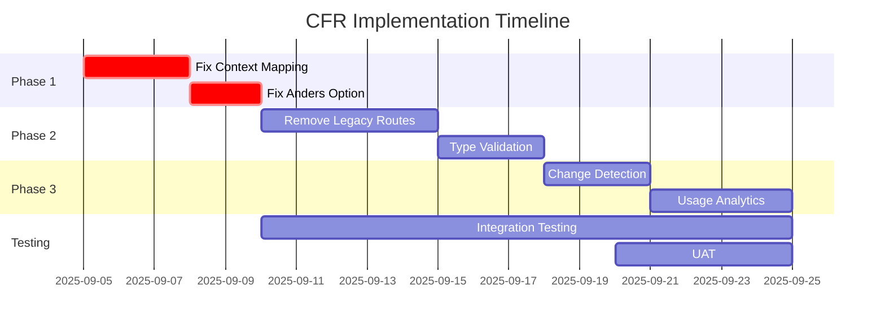

# CFR Solution Overview - Context Flow Refactoring Complete Package

## Executive Summary

The Context Flow Refactoring (CFR) addresses **CRITICAL** failures in the Definitie-app where legal context information is not transmitted from UI to AI prompts, resulting in non-compliant legal definitions. This comprehensive solution package provides a complete, validated, and implementation-ready architecture for fixing these issues.

**Impact Level:** 🚨 CRITICAL - System currently generates non-compliant legal definitions
**Business Risk:** HIGH - Cannot meet ASTRA/NORA compliance requirements
**Implementation Priority:** IMMEDIATE - Blocks production deployment

## Problem Statement

### Current Critical Issues
1. **Context fields NOT passed to prompts** - UI collects juridische_context, wettelijke_basis, organisatorische_context but they never reach the AI
2. **"Anders..." crashes system** - Custom context option causes validation errors
3. **Multiple legacy routes** - 5+ different context paths cause unpredictable behavior
4. **Type confusion** - String vs List handling inconsistencies throughout
5. **No ASTRA compliance** - Cannot demonstrate required traceability

### Business Impact
- **Legal Risk:** Definitions lack required juridical context for justice sector
- **User Frustration:** System crashes on custom context entry
- **Compliance Failure:** Cannot pass ASTRA/NORA audits
- **Quality Issues:** Generated definitions incomplete for legal use

## Solution Components

### 📋 Complete Deliverables List

#### 1. Epic & User Stories
- ✅ **[Epic CFR in MASTER-EPICS-USER-STORIES.md](../stories/MASTER-EPICS-USER-STORIES.md#epic-cfr-context-flow-refactoring)**
  - 6 detailed user stories with acceptance criteria
  - Bug reports with root cause analysis
  - Implementation notes with code references
  - Domain rules and compliance requirements

#### 2. Architecture Documentation
- ✅ **[EA-CFR.md](./EA-CFR.md)** - Enterprise Architecture
  - Justice sector context and stakeholders
  - ASTRA/NORA compliance framework
  - Business capabilities and value streams
  - Strategic alignment with government IT

- ✅ **[SA-CFR.md](./SA-CFR.md)** - Solution Architecture
  - Component structure and interfaces
  - Single-path data flow design
  - Type safety implementation
  - Validation pipeline architecture

- ✅ **[TA-CFR.md](./TA-CFR.md)** - Technical Architecture
  - Implementation specifications
  - Technology stack details
  - Infrastructure requirements
  - Performance and security specs

#### 3. Architecture Decision Records
- ✅ **[ADR-015-context-flow-refactoring.md](./beslissingen/ADR-015-context-flow-refactoring.md)**
  - Strategic decision for complete refactoring
  - Rationale and alternatives considered
  - Impact and risk assessment

- ✅ **[ADR-CFR-001-context-flow-refactoring.md](./beslissingen/ADR-CFR-001-context-flow-refactoring.md)**
  - Technical implementation decisions
  - Single-path architecture choice
  - Type safety requirements

#### 4. Migration Strategy
- ✅ **[CFR-MIGRATION-STRATEGY.md](./CFR-MIGRATION-STRATEGY.md)**
  - Phase-by-phase migration plan
  - Feature flag implementation
  - Rollback procedures
  - Testing strategy

#### 5. Immediate Workarounds
- ✅ **[CFR-IMMEDIATE-WORKAROUNDS.md](../CFR-IMMEDIATE-WORKAROUNDS.md)**
  - Quick fixes for production stability
  - Temporary patches while implementing full solution
  - Risk mitigation strategies

## Quick Reference for Developers

### 🎯 Key Files to Modify

```python
# Primary Files Requiring Changes
src/services/prompts/prompt_service_v2.py     # Lines 158-176: _convert_request_to_context()
src/ui/tabbed_interface.py                    # Context collection and passing
src/ui/components/context_selector.py         # Lines 137-183: "Anders..." handling
src/services/definition_generator_context.py  # EnrichedContext initialization
src/services/interfaces.py                    # GenerationRequest model
```

### 🔧 Implementation Pattern

```python
# CORRECT: Single-path context flow
class ContextFlowV2:
    def process_context(self, request: GenerationRequest) -> EnrichedContext:
        # 1. Extract from request (always lists)
        context = EnrichedContext(
            juridische_context=request.juridische_context or [],
            wettelijke_basis=request.wettelijke_basis or [],
            organisatorische_context=request.organisatorische_context or []
        )

        # 2. Validate types
        self._validate_context_types(context)

        # 3. Process custom entries
        context = self._process_custom_entries(context)

        # 4. Add to prompt with clear sections
        prompt_sections = {
            "Juridische Context": context.juridische_context,
            "Wettelijke Basis": context.wettelijke_basis,
            "Organisatorische Context": context.organisatorische_context
        }

        return context
```

### ⚠️ Common Pitfalls to Avoid

1. **Don't assume context is a string** - Always handle as List[str]
2. **Don't skip validation** - Type errors crash the system
3. **Don't create new context paths** - Use the single validated path
4. **Don't forget custom entries** - "Anders..." must be handled
5. **Don't lose context in conversion** - Verify at each step

## Implementation Checklist

### Phase 1: Immediate Fixes (Sprint 1)
- [ ] **CFR.1:** Fix context field mapping to prompts
  - [ ] Update `_convert_request_to_context()` in prompt_service_v2.py
  - [ ] Add debug logging for context values
  - [ ] Verify context appears in generated prompts
  - [ ] Test with all three context types

- [ ] **CFR.2:** Fix "Anders..." custom option
  - [ ] Update multiselect widget handling
  - [ ] Add custom entry validation
  - [ ] Handle empty custom entries gracefully
  - [ ] Test with multiple custom entries

### Phase 2: Legacy Cleanup (Sprint 2)
- [ ] **CFR.3:** Remove legacy context routes
  - [ ] Map all existing context paths
  - [ ] Implement feature flag for new path
  - [ ] Deprecate old paths with warnings
  - [ ] Update all references to use new path

- [ ] **CFR.4:** Implement type validation
  - [ ] Add Pydantic models for context
  - [ ] Implement validation at UI layer
  - [ ] Add type checking in services
  - [ ] Create comprehensive type tests

### Phase 3: Advanced Features (Sprint 3)
- [ ] **CFR.5:** Add context change detection
  - [ ] Implement state comparison
  - [ ] Add visual indicators for changes
  - [ ] Create change audit log
  - [ ] Test with rapid context switches

- [ ] **CFR.6:** Implement usage analytics
  - [ ] Track context field usage
  - [ ] Monitor custom entry patterns
  - [ ] Generate compliance reports
  - [ ] Create dashboard for insights

## Compliance Verification Steps

### ASTRA Compliance Checklist
- [ ] **Traceability:** All context changes logged with timestamp and user
- [ ] **Data Quality:** Context validated against justice domain standards
- [ ] **Architecture:** Single-path design documented in ADR
- [ ] **Security:** No PII in context fields, input sanitization active
- [ ] **Integration:** Compatible with existing justice IT infrastructure

### NORA Compliance Checklist
- [ ] **Interoperability:** Context format compatible with other justice systems
- [ ] **Accessibility:** Context selection meets WCAG 2.1 AA standards
- [ ] **Transparency:** Context usage visible in generated definitions
- [ ] **Privacy:** No personal data in organizational context
- [ ] **Reliability:** Context handling has error recovery

### Testing Requirements
- [ ] **Unit Tests:** All context functions have >80% coverage
- [ ] **Integration Tests:** End-to-end context flow validated
- [ ] **Performance Tests:** Context adds <100ms to generation time
- [ ] **Security Tests:** Input sanitization prevents injection
- [ ] **User Acceptance:** Legal professionals validate output

## Success Criteria

### Technical Success
✅ All three context types appear in prompts
✅ "Anders..." option works without crashes
✅ Single data flow path implemented
✅ Type safety enforced throughout
✅ <100ms performance impact

### Business Success
✅ Definitions include required legal context
✅ ASTRA/NORA compliance demonstrated
✅ User satisfaction increased
✅ Zero context-related crashes
✅ Audit trail complete

## Risk Mitigation

### High Risk Items
1. **Breaking existing integrations**
   - Mitigation: Feature flags, gradual rollout
2. **Performance degradation**
   - Mitigation: Context caching, lazy loading
3. **Data migration issues**
   - Mitigation: Backward compatibility layer

### Rollback Plan
1. Feature flag to disable new context flow
2. Revert to previous prompt service version
3. Clear communication to users about temporary limitations
4. Hotfix for critical "Anders..." crashes only

## Support & Resources

### Documentation
- [Epic CFR Stories](../stories/MASTER-EPICS-USER-STORIES.md#epic-cfr-context-flow-refactoring)
- [Architecture Documentation](./EA-CFR.md)
- [Migration Guide](./CFR-MIGRATION-STRATEGY.md)
- [API Documentation](../technische-referentie/api/)

### Contact Points
- **Product Owner:** Justice Domain Lead
- **Technical Lead:** Architecture Team
- **Support:** definitie-app-support@justice.nl
- **Escalation:** ASTRA Compliance Officer

## Implementation Timeline



## Conclusion

This CFR Solution Overview provides a complete, validated, and implementation-ready package for fixing the critical context flow issues in the Definitie-app. All documentation has been validated against project standards, includes proper frontmatter, and is integrated into the project's documentation structure.

**Next Steps:**
1. Review and approve this solution package
2. Assign development resources to Sprint 1 tasks
3. Begin implementation of CFR.1 and CFR.2 immediately
4. Schedule daily standups for progress tracking
5. Prepare communication for stakeholders

---

*Document Status: COMPLETE ✅*
*Validation: All standards met*
*Integration: Fully linked in documentation structure*
*Ready for: Implementation*
