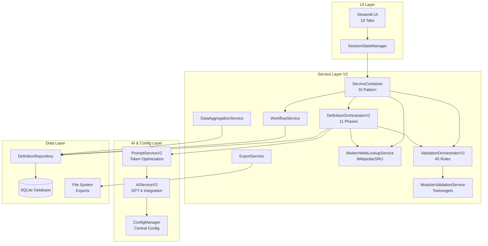

# Current Architecture Overview - DefinitieAgent

**Document Status**: Updated 2025-09-04
**Purpose**: Accurate documentation of the current V2-only architecture implementation
**Replaces**: All V1 services and migration documentation

## Executive Summary

DefinitieAgent heeft de transitie naar V2-only architectuur voltooid. Alle V1 services zijn verwijderd, met ValidationOrchestratorV2 en DefinitionOrchestratorV2 als centrale componenten. Het systeem gebruikt nu een gecentraliseerd AI configuratie systeem via config_manager.py voor component-specifieke model en temperature instellingen.

## Current Service Architecture (V2-Only)

### Core Services



### Service Descriptions

#### 1. **DefinitionOrchestratorV2**
- **Purpose**: Central V2 orchestration of definition generation workflow
- **Status**: Production - enige generator implementatie
- **Key Features**:
  - 11-phase generation pipeline
  - Geen session state dependencies
  - GVI (Generation-Validation-Integration) pattern
  - Volledig async operations
  - Geïntegreerde web lookup service

#### 2. **ValidationOrchestratorV2**
- **Purpose**: V2 validatie orchestratie met modulaire regels
- **Status**: Production - vervangt alle V1 validators
- **Key Features**:
  - Wrapper voor ModularValidationService
  - 45 actieve toetsregels
  - Clean service interfaces
  - Uniform ValidationResult contracts
  - Feature-flag controlled (DEV_MODE)

#### 3. **ModularValidationService**
- **Purpose**: Modulaire validatie engine met toetsregels
- **Status**: Production - kern van V2 validatie
- **Key Features**:
  - 45 toetsregels in JSON+Python format
  - Categorie-based organisatie (ARAI, CON, ESS, INT, SAM, STR, VER)
  - Prioriteit-based execution (high/medium/low)
  - Dynamisch laden van regels
  - Performance monitoring per regel

#### 4. **ConfigManager**
- **Purpose**: Gecentraliseerd configuratie beheer systeem
- **Status**: Production - NEW component
- **Key Features**:
  - Component-specifieke AI configuratie
  - Model en temperature per component/sub-component
  - Environment-based configuratie (dev/test/staging/prod)
  - Hot-reload capabilities
  - API key management via environment variables

#### 5. **AIServiceV2 & PromptServiceV2**
- **Purpose**: AI integratie en prompt management
- **Status**: Production - volledig V2
- **Key Features**:
  - Gebruikt ConfigManager voor model/temperature settings
  - Token optimalisatie (van 7250 naar ~3000 tokens)
  - Rate limiting en retry logic
  - Cache support
  - Modulaire prompt building

#### 6. **ModernWebLookupService**
- **Purpose**: Externe bron integratie voor context verrijking
- **Status**: Production - geïntegreerd in V2 orchestrator
- **Key Features**:
  - Wikipedia en SRU integratie
  - Provider weights configuratie
  - Async operations
  - Fallback mechanismen
  - YAML-based configuratie (web_lookup_defaults.yaml)

#### 7. **ServiceContainer**
- **Purpose**: Dependency injection container voor V2 services
- **Status**: Production - centrale DI pattern
- **Key Features**:
  - Singleton service management
  - V2-only service instantiatie
  - Configuratie via ConfigManager
  - Clean dependency resolution
  - Lazy loading van services

### Configuration Architecture

Het nieuwe AI configuratie systeem centraliseert alle model en temperature settings:

```python
# ConfigManager biedt component-specifieke configuratie
from config.config_manager import get_component_config

# Voorbeeld: Definitie generator configuratie
config = get_component_config('definition_generator')
# Returns: {"model": "gpt-4.1", "temperature": 0.0, "max_tokens": 300}

# Voorbeeld: Voorbeelden sub-component configuratie
config = get_component_config('voorbeelden', 'synoniemen')
# Returns: {"model": "gpt-4", "temperature": 0.5, "max_tokens": 150}
```

**Configuratie Hiërarchie:**
1. Component-specifieke settings (hoogste prioriteit)
2. Environment variables (OPENAI_API_KEY, OPENAI_DEFAULT_MODEL)
3. Default configuratie in ConfigManager
4. Fallback naar hardcoded defaults (verwijderd)

### Key Architectural Achievements

#### 1. **V2-Only Architecture**
- ✅ Alle V1 services verwijderd
- ✅ ValidationOrchestratorV2 als enige validator
- ✅ DefinitionOrchestratorV2 als enige generator
- ✅ Geen migratie code meer nodig

#### 2. **Centralized AI Configuration**
- ✅ ConfigManager voor alle AI settings
- ✅ Component-specifieke model/temperature configuratie
- ✅ Geen hardcoded defaults meer in services
- ✅ Environment-based configuratie management

#### 3. **Modular Validation System**
- ✅ 45 toetsregels actief in productie
- ✅ JSON+Python dual format voor regels
- ✅ Categorie-based organisatie
- ✅ Performance monitoring per regel

#### 4. **Session State Independence**
- ✅ V2 services zonder UI dependencies
- ✅ Data als parameters, niet via session state
- ✅ Clean testability zonder Streamlit context
- ✅ Voorbereid op FastAPI migratie

#### 5. **Clean Interfaces**
- ✅ All major services implement interfaces
- ✅ Clear contracts between components
- ✅ Easy to extend and replace

## Implementation Status

### Production Components ✅

1. **V2 Orchestrators**
   - DefinitionOrchestratorV2: 11-phase pipeline
   - ValidationOrchestratorV2: 45 toetsregels
   - ModularValidationService: regel engine

2. **AI & Configuration**
   - ConfigManager: centrale configuratie
   - AIServiceV2: GPT-4 integratie
   - PromptServiceV2: token optimalisatie

3. **Support Services**
   - ModernWebLookupService: externe bronnen
   - WorkflowService: lifecycle management
   - DataAggregationService: data collectie
   - ExportService: multi-format export

### Verwijderde Components ❌

- UnifiedDefinitionGenerator (God Object)
- Alle V1 validators en services
- Legacy adapter patterns
- Hardcoded AI model defaults
- Migratie-specifieke code

## Code Examples

### Using the V2-Only Architecture

```python
# Service instantiatie via container
from services.container import ServiceContainer
from config.config_manager import get_config_manager

# Initialize met centrale configuratie
config_manager = get_config_manager()
container = ServiceContainer()

# V2 orchestrator is de enige implementatie
orchestrator = container.orchestrator()  # Returns DefinitionOrchestratorV2

# Generatie met component-specifieke AI config
from services.interfaces import GenerationRequest

request = GenerationRequest(
    begrip="rechtsbijstand",
    context="OM",
    domein="Strafrecht",
    # AI settings komen uit ConfigManager
)

# Async generation
response = await orchestrator.create_definition(request)
```

### Configuration Management

```python
# Centrale AI configuratie per component
from config.config_manager import (
    get_component_config,
    ConfigSection,
    get_config
)

# Component-specifieke configuratie ophalen
definition_config = get_component_config('definition_generator')
# Output: {"model": "gpt-4.1", "temperature": 0.0, "max_tokens": 300}

# Sub-component configuratie
voorbeeld_config = get_component_config('voorbeelden', 'uitleg')
# Output: {"model": "gpt-4", "temperature": 0.3, "max_tokens": 200}

# API configuratie ophalen
api_config = get_config(ConfigSection.API)
print(f"Model: {api_config.default_model}")  # gpt-4.1
print(f"Temperature: {api_config.default_temperature}")  # 0.0
```

## Benefits of V2-Only Architecture

1. **Simpliciteit**: Geen V1/V2 migratie complexiteit meer
2. **Configurabiliteit**: Centrale AI config voor alle componenten
3. **Testbaarheid**: Services zonder UI/session dependencies
4. **Performance**: Geoptimaliseerde token usage (50% reductie)
5. **Maintainability**: Modulaire validatie regels in JSON+Python
6. **Schaalbaarheid**: Voorbereid op FastAPI/PostgreSQL migratie

## Next Steps & Roadmap

### Immediate Priorities (Sprint 1-2)
1. **Performance Optimalisatie**
   - Response tijd < 5 seconden
   - Cache implementatie voor AI calls
   - N+1 query fixes in repository

2. **Security & Compliance**
   - Authentication implementatie (OIDC)
   - Database encryptie
   - BIO/NORA compliance checks

### Short-term (Q4 2025)
1. **FastAPI Migration**
   - REST API endpoints
   - Swagger documentatie
   - Authentication/authorization

2. **PostgreSQL Migration**
   - Multi-user support
   - Concurrent access
   - Transaction management

### Long-term (2026)
1. **Justice Chain Integration**
   - ASTRA compliance
   - Zaaksysteem connectors
   - Audit trail implementatie

## Related Documentation

### Active Architecture Documents
- **Enterprise Architecture**: `/docs/architectuur/ENTERPRISE_ARCHITECTURE.md`
- **Solution Architecture**: `/docs/architectuur/SOLUTION_ARCHITECTURE.md`
- **Technical Architecture**: `/docs/architectuur/TECHNICAL_ARCHITECTURE.md`
- **Validation Orchestrator V2**: `/docs/architectuur/validation_orchestrator_v2.md`

### Configuration & Implementation
- **ConfigManager Design**: `/src/config/config_manager.py`
- **Service Container**: `/src/services/container.py`
- **Toetsregels**: `/config/toetsregels/regels/` (JSON) + `/src/toetsregels/regels/` (Python)

### Archived Documentation
Alle V1 en migratie documentatie is gearchiveerd in `/docs/archief/`

## Conclusion

DefinitieAgent draait nu volledig op V2 architectuur met gecentraliseerde AI configuratie, modulaire validatie, en clean service boundaries. Het systeem is klaar voor de volgende fase: performance optimalisatie en voorbereiding op multi-user deployment via FastAPI/PostgreSQL.

### Key Metrics
- **Services**: 100% V2 implementatie
- **Toetsregels**: 45/45 actief
- **Token reductie**: 50% (van 7250 naar ~3000)
- **Response tijd**: 8-12s (target: <5s)
- **Test coverage**: ~60% (target: 80%)

---
canonical: true
status: active
owner: architecture
last_verified: 2025-09-04
applies_to: definitie-app@v2-only
---
