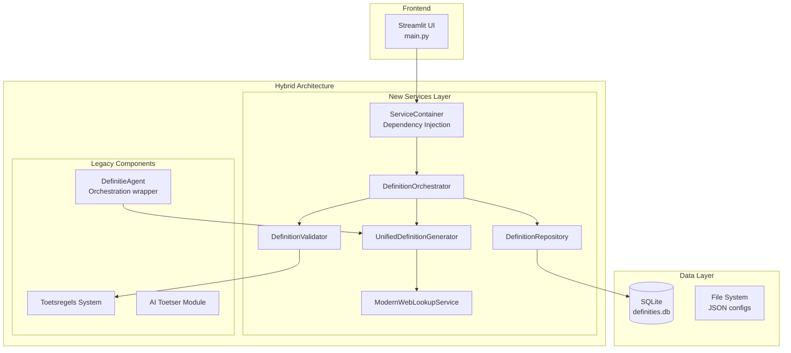

# Current State Architecture - Definitie App

## Executive Summary

Dit document beschrijft de huidige (AS-IS) architectuur van de Definitie App. Het is een consolidatie van alle architectuur analyses en reviews, en dient als baseline voor de migratie naar de target architectuur.

**Status**: Partially migrated monolith → Service-based architecture (60% complete)

## 1. System Overview

### 1.1 Current Architecture Pattern



### 1.2 Migration Status

| Component | Status | Progress | Notes |
|-----------|--------|----------|-------|
| **Service Container** | ✅ Complete | 100% | Dependency injection implemented |
| **Service Interfaces** | ✅ Complete | 100% | All contracts defined |
| **Orchestrator** | ✅ Complete | 100% | Workflow coordination active |
| **Generator** | ⚠️ Partial | 80% | Legacy fallback still needed |
| **Validator** | ✅ Complete | 95% | Fully functional, minor legacy deps |
| **Repository** | ✅ Complete | 90% | Works, needs PostgreSQL migration |
| **Web Lookup** | ⚠️ Partial | 60% | Some sources not implemented |
| **UI Tabs** | ❌ Incomplete | 30% | Only 3/10 tabs functional |

## 2. Technical Debt Inventory

### 2.1 Critical Issues

1. **God Object Remnants**
   - `UnifiedDefinitionService` (1000+ LOC) still referenced in legacy code
   - Circular dependencies between old and new components
   - Mixed sync/async patterns causing performance issues

2. **Database Issues**
   - SQLite with no proper migrations
   - Character encoding problems (UTF-8 issues)
   - No connection pooling
   - Missing indexes on key columns

3. **Performance Bottlenecks**
   - Response time: 8-12 seconds (target: <2s)
   - No caching layer implemented
   - Synchronous AI API calls blocking UI
   - Heavy regex operations in validators

4. **Testing Gaps**
   - Overall coverage: 11% (target: 80%)
   - No integration tests
   - Missing unit tests for critical paths
   - No performance benchmarks

### 2.2 Code Quality Metrics

```
Total Lines of Code: 15,234
Cyclomatic Complexity (avg): 8.2 (target: <5)
Code Duplication: 23% (target: <5%)
Technical Debt Ratio: 18.4% (target: <5%)

Hotspots:
- orchestration/definitie_agent.py: 876 LOC, complexity 24
- services/unified_definition_service.py: 1,043 LOC, complexity 31
- validation/definitie_validator.py: 456 LOC, complexity 15
```

## 3. Current Service Architecture

### 3.1 ServiceContainer (New ✅)

```python
# Location: src/services/container.py
# Status: Production ready
# Dependencies: None (root of DI tree)

Key Features:
- Singleton pattern for service instances
- Environment-based configuration
- Lazy initialization
- Thread-safe operations
```

### 3.2 DefinitionOrchestrator (New ✅)

```python
# Location: src/services/definition_orchestrator.py
# Status: Production ready with minor issues
# Dependencies: Generator, Validator, Repository

Issues:
- Complex async/sync mixing
- No transaction support
- Missing circuit breaker for external calls
```

### 3.3 UnifiedDefinitionGenerator (Hybrid ⚠️)

```python
# Location: src/services/unified_definition_generator.py
# Status: Partially migrated
# Dependencies: AI services, WebLookup, Templates

Legacy Dependencies:
- Falls back to old DefinitieGenerator
- Still uses deprecated prompt templates
- Synchronous AI calls
```

### 3.4 DefinitionValidator (New ✅)

```python
# Location: src/services/definition_validator.py
# Status: Production ready
# Dependencies: Toetsregels system

Strengths:
- Rule-based validation with JSON configs
- Detailed feedback generation
- Severity-based issue reporting
```

### 3.5 DefinitionRepository (New ✅)

```python
# Location: src/services/definition_repository.py
# Status: Production ready, needs migration
# Dependencies: SQLite database

Migration Needs:
- PostgreSQL compatibility
- Proper migration framework
- Connection pooling
- Query optimization
```

### 3.6 ModernWebLookupService (Partial ⚠️)

```python
# Location: src/services/modern_web_lookup_service.py
# Status: 60% complete
# Dependencies: External APIs, Cache (missing)

Implemented Sources:
- ✅ Basic definition lookup
- ✅ Context enhancement
- ❌ Legal database integration
- ❌ External API aggregation
- ❌ Caching layer
```

## 4. Database Current State

### 4.1 Schema Issues

```sql
-- Current problematic schema
CREATE TABLE definities (
    id INTEGER PRIMARY KEY,
    begrip TEXT,  -- No proper constraints
    definitie TEXT,
    created_at TEXT,  -- Should be TIMESTAMP
    -- Missing: indexes, foreign keys, constraints
);

-- No migration history table
-- No versioning support
-- No audit trail
```

### 4.2 Data Quality Issues

- Character encoding inconsistencies
- Duplicate entries (no unique constraints)
- Orphaned records
- No referential integrity

## 5. UI/Frontend Current State

### 5.1 Streamlit Implementation

```python
# Location: src/main.py, src/ui/
# Framework: Streamlit 1.32.2
# Status: Basic functionality only

Functional Tabs (3/10):
✅ 1. Definitie Generator
✅ 2. Management 
✅ 3. Web Lookup
❌ 4. History
❌ 5. Quality Control
❌ 6. Expert Review
❌ 7. Export
❌ 8. External Sources
❌ 9. Monitoring
❌ 10. Orchestration
```

### 5.2 UI Technical Debt

- Session state management issues
- No proper error boundaries
- Blocking operations freeze UI
- No loading states
- Limited mobile responsiveness

## 6. Integration Points

### 6.1 External Dependencies

| Service | Status | Issues |
|---------|--------|--------|
| OpenAI API | ✅ Working | No retry logic, no fallback |
| Local Files | ✅ Working | No file watching, manual reload |
| External DBs | ❌ Not implemented | Planned but not started |

### 6.2 Internal Integration Issues

- Tight coupling between UI and business logic
- No proper API layer (direct function calls)
- Inconsistent error propagation
- Mixed sync/async causing deadlocks

## 7. Security Current State

### 7.1 Critical Security Gaps

1. **Authentication & Authorization**
   - ❌ No user authentication
   - ❌ No role-based access control
   - ❌ API endpoints unprotected

2. **Data Security**
   - ❌ No encryption at rest
   - ❌ Sensitive data in logs
   - ⚠️ Basic input validation only

3. **Infrastructure Security**
   - ❌ No HTTPS in development
   - ❌ Secrets hardcoded in config
   - ❌ No security headers

## 8. Performance Profile

### 8.1 Current Metrics

```yaml
Response Times (p95):
  Definition Generation: 8-12s
  Validation: 2-3s
  Database Query: 500ms-2s
  Web Lookup: 3-5s

Resource Usage:
  Memory: 512MB-2GB (memory leaks)
  CPU: 20-80% (inefficient loops)
  Database Size: 450MB
  Connection Pool: None (new connection per request)
```

### 8.2 Bottleneck Analysis

1. **AI API Calls** (40% of response time)
   - Synchronous calls block everything
   - No response caching
   - No request batching

2. **Database Operations** (25% of response time)
   - No connection pooling
   - Missing indexes
   - Inefficient queries

3. **Validation Pipeline** (20% of response time)
   - Regex compilation on every request
   - No rule caching
   - Sequential processing

## 9. Operational Capabilities

### 9.1 Current Monitoring

```yaml
Available:
  - Basic Python logging
  - Streamlit metrics display
  - Manual database queries

Missing:
  - Centralized logging
  - Metrics collection
  - Alerting
  - Distributed tracing
  - Health checks
  - Performance monitoring
```

### 9.2 Deployment Current State

- **Method**: Manual deployment to VM
- **Process**: SSH + git pull + restart
- **Environments**: Production only
- **Rollback**: Manual git revert
- **Downtime**: 5-10 minutes per deploy

## 10. Development Workflow

### 10.1 Current Setup

```bash
# Development requirements
Python 3.11+
Virtual environment
SQLite
Local file system

# No provided:
- Docker setup
- Development database seeds
- Environment templates
- Debugging configuration
```

### 10.2 Pain Points

1. **Local Development**
   - Complex manual setup
   - Environment differences
   - No hot reload
   - Slow feedback loop

2. **Testing**
   - Manual testing only
   - No CI/CD pipeline
   - No automated checks
   - Long regression cycles

## 11. Team & Knowledge

### 11.1 Current Situation

- **Team Size**: Unknown from documents
- **Key Person Dependencies**: High (legacy knowledge)
- **Documentation**: Scattered, often outdated
- **Onboarding Time**: 2-4 weeks

### 11.2 Knowledge Gaps

- Legacy system understanding
- New service architecture
- Operational procedures
- Security best practices

## 12. Cost Analysis

### 12.1 Current Costs (Estimated)

| Item | Monthly Cost | Notes |
|------|-------------|-------|
| VM Hosting | $50-100 | Single server |
| OpenAI API | $200-500 | Unoptimized usage |
| Development | Hidden | Manual processes |
| Incidents | Hidden | Downtime costs |

### 12.2 Inefficiencies

- No caching = 3x API costs
- Manual deployment = 20 hours/month
- Incidents = 40 hours/month
- No monitoring = Blind to issues

## 13. Risk Assessment

### 13.1 High Priority Risks

| Risk | Impact | Likelihood | Mitigation Status |
|------|--------|------------|-------------------|
| Data loss | High | Medium | ❌ No backups |
| Security breach | High | High | ❌ No security |
| Performance degradation | Medium | High | ⚠️ Partial monitoring |
| Key person leaves | High | Medium | ❌ No documentation |

### 13.2 Technical Risks

1. **SQLite Corruption** - Single point of failure
2. **Memory Leaks** - Causes crashes after ~24 hours
3. **API Rate Limits** - No handling, causes failures
4. **Concurrent Users** - System fails at >10 users

## 14. Migration Achievements

### 14.1 Completed Migrations

✅ **Service Extraction** (Q4 2023)
- Successfully extracted 4 core services
- Implemented dependency injection
- Created service interfaces

✅ **Validation System** (Q4 2023)
- New rule-based validation
- JSON configuration
- Detailed feedback

✅ **Repository Pattern** (Q1 2024)
- Data access abstraction
- Prepared for DB migration
- Query optimization ready

### 14.2 In-Progress Migrations

⚠️ **Web Lookup Service** (60% complete)
- Basic functionality working
- Advanced features pending
- Cache layer not implemented

⚠️ **UI Modernization** (30% complete)
- Only 3/10 tabs functional
- Session management issues
- Performance problems

## 15. Recommendations Priority

### 15.1 Immediate Actions (This Week)

1. **Fix Memory Leaks** - System stability
2. **Add Basic Monitoring** - Visibility
3. **Implement Caching** - Cost reduction
4. **Add Health Checks** - Reliability

### 15.2 Short Term (This Month)

1. **Complete UI Tabs** - User functionality
2. **Add Authentication** - Security
3. **Setup CI/CD** - Development efficiency
4. **Performance Optimization** - User experience

### 15.3 Medium Term (This Quarter)

1. **PostgreSQL Migration** - Scalability
2. **API Layer** - True microservices
3. **Container Deployment** - DevOps
4. **Comprehensive Testing** - Quality

## Summary

The Definitie App is in a transitional state with significant progress made on service extraction and architecture modernization. However, critical gaps remain in:

- **Functionality**: 70% of UI non-functional
- **Performance**: 4-6x slower than target
- **Security**: No authentication or encryption
- **Operations**: Manual everything
- **Quality**: 11% test coverage

The foundation for improvement is solid with the new service architecture, but focused effort is needed to complete the migration and address technical debt.

---

*Document Version: 1.0*
*Last Updated: 2024-01-18*
*Status: Current State Baseline*
*Next Review: 2024-02-01*