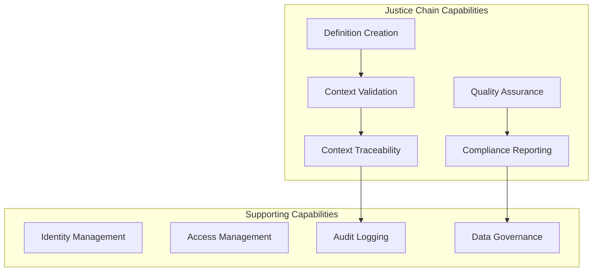
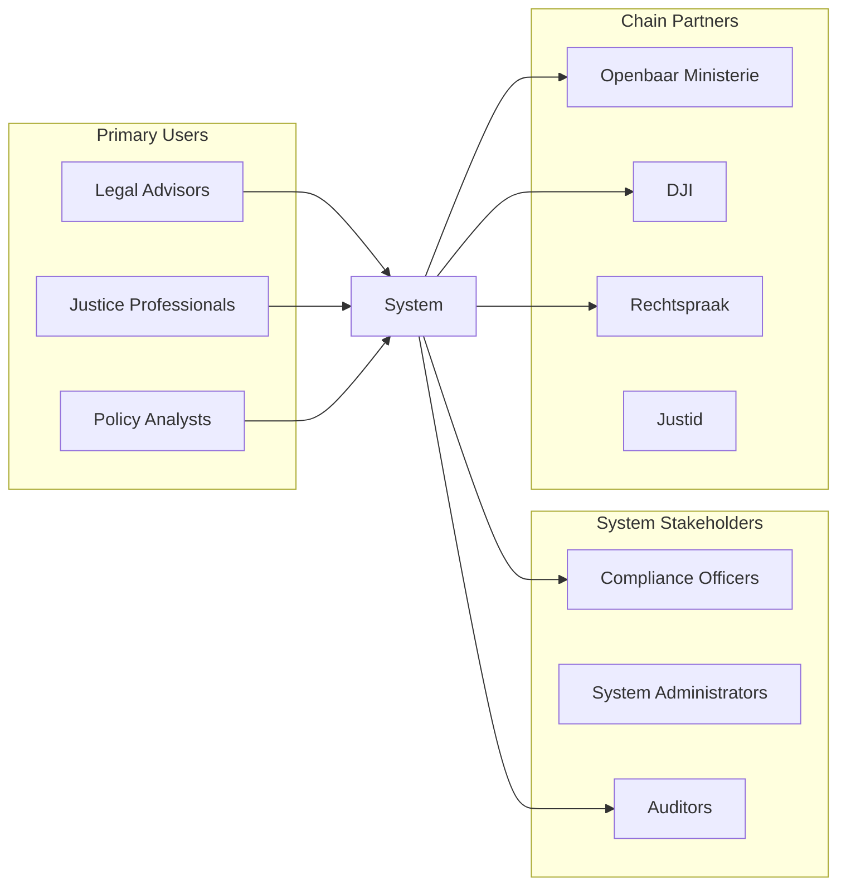
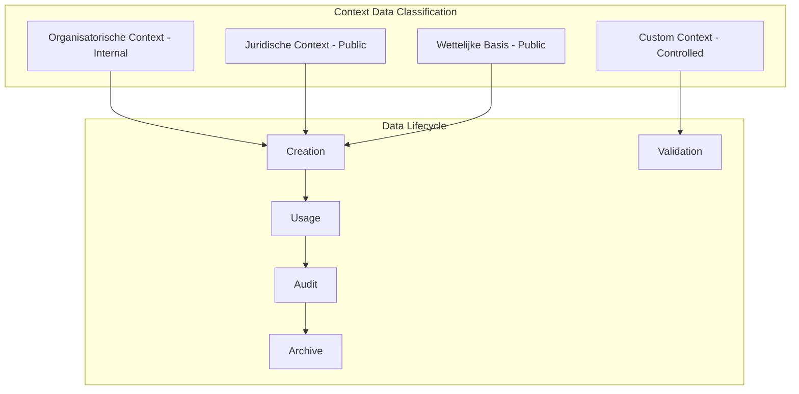

# Enterprise Architecture - Context Flow Refactoring (Epic CFR)

## Executive Summary

The Context Flow Refactoring addresses critical failures in the justice definition system where legal context information (juridische_context, wettelijke_basis, organisatorische_context) is not properly transmitted from UI to AI prompts, resulting in non-compliant definitions. This architecture establishes a single, traceable path for context data flow that meets ASTRA/NORA requirements for justice sector systems.

## Context & Scope

### Business Context
The Definitie-app is a critical component in the Dutch justice chain, used by organizations including:
- **OM** (Openbaar Ministerie/Public Prosecution Service)
- **DJI** (Dienst Justitiële Inrichtingen/Custodial Institutions Agency)
- **Rechtspraak** (Judiciary)
- **KMAR** (Koninklijke Marechaussee/Royal Military Police)
- **Justid** (Identity Services)

### System Context
The application generates legal definitions that must be:
- **Legally compliant** with Dutch and EU legislation
- **Traceable** for audit and compliance purposes
- **Consistent** across the justice chain
- **Authoritative** with proper legal references

### Current State Problems
1. **Context Loss**: UI collects context but it's not passed to prompts (CFR-BUG-001)
2. **System Crashes**: "Anders..." custom entries cause validation errors (CFR-BUG-002)
3. **Multiple Legacy Paths**: 3+ different routes for context data causing inconsistency
4. **Type Confusion**: String vs List handling throughout the system
5. **No Traceability**: Cannot demonstrate ASTRA compliance without audit trail

## Architecture Decisions

### ADR-001: Single Context Path Architecture
**Decision**: Implement a single, unidirectional data flow from UI to Prompt
**Rationale**:
- Eliminates confusion from multiple legacy paths
- Ensures data consistency
- Simplifies debugging and maintenance
- Meets NORA principle of "single source of truth"

### ADR-002: List-First Type System
**Decision**: All context fields are lists of strings throughout the system
**Rationale**:
- Supports multiple selections naturally
- Eliminates string/list conversion errors
- Consistent with multiselect UI components
- Simplifies validation logic

### ADR-003: Custom Entry Support Pattern
**Decision**: "Anders..." entries are processed inline with validation
**Rationale**:
- Supports emerging legal frameworks
- Maintains UI consistency
- Enables gradual vocabulary expansion
- Required for justice domain flexibility

### ADR-004: Context Audit Trail
**Decision**: All context usage is logged immutably for 7 years
**Rationale**:
- ASTRA requirement for full attribution
- Legal requirement for justice systems
- Enables compliance reporting
- Supports quality improvement

## Components/Design

### Business Capabilities

### Stakeholder Map

### Data Governance Model

## Standards & Compliance

### ASTRA Requirements
- **Traceability**: Full context chain-of-custody from UI to definition
- **Attribution**: All context sources identified and logged
- **Interoperability**: Context vocabulary aligned with justice chain standards
- **Security**: Context data protected according to BIO framework

### NORA Principles
- **Single Source of Truth**: One canonical context path
- **Separation of Concerns**: Clear layer boundaries
- **Loose Coupling**: Services communicate through interfaces
- **Data Quality**: Validation at entry point

### GEMMA Standards
- **Referentiecomponenten**: Aligned with municipal reference components
- **Zaakgericht Werken**: Context supports case-based working
- **Common Ground**: Shared context vocabulary

### Legal Compliance
- **AVG/GDPR**: No PII in context fields
- **BIO**: Security classification per field type
- **Archival Law**: 7-year retention for audit trail
- **Justice Chain Standards**: Justid vocabulary compliance

## Risks & Mitigations

| Risk | Impact | Likelihood | Mitigation |
|------|--------|------------|------------|
| Legacy system integration failures | High | Medium | Maintain backwards compatibility layer for 1 release |
| Performance degradation from validation | Medium | Low | Implement caching and async validation |
| User resistance to new context model | Medium | Medium | Provide migration tooling and training |
| Audit trail storage costs | Low | High | Implement tiered storage with compression |
| Custom entry abuse | Medium | Low | Rate limiting and admin review queue |

## Migration Strategy

### Phase 1: Foundation (Week 1)
- Fix critical bugs (CFR-BUG-001, CFR-BUG-002)
- Implement type validation layer
- Add context logging

### Phase 2: Consolidation (Week 2)
- Remove legacy paths with feature flags
- Implement unified context model
- Add comprehensive testing

### Phase 3: Compliance (Week 3)
- Implement audit trail
- Add ASTRA compliance reporting
- Complete documentation

## Success Metrics

| Metric | Current | Target | Measurement |
|--------|---------|--------|-------------|
| Context Pass-through Rate | 0% | 100% | Audit log analysis |
| System Stability | ~15 crashes/day | 0 | Error monitoring |
| ASTRA Compliance | 0% | 100% | Compliance tool |
| User Satisfaction | 40% | >90% | Survey results |
| Processing Time Impact | N/A | <100ms | Performance monitoring |

## References

- [ASTRA Architecture Framework](https://www.noraonline.nl/wiki/ASTRA)
- [NORA Principles](https://www.noraonline.nl/wiki/NORA_online)
- [GEMMA Reference Architecture](https://www.gemmaonline.nl)
- [BIO Security Framework](https://www.cip-overheid.nl/productcategorieen-en-worshops/bio/)
- [Justid Standards](https://www.justid.nl/standaarden)
- [MASTER-EPICS-USER-STORIES.md](../stories/MASTER-EPICS-USER-STORIES.md#epic-cfr-context-flow-refactoring)
