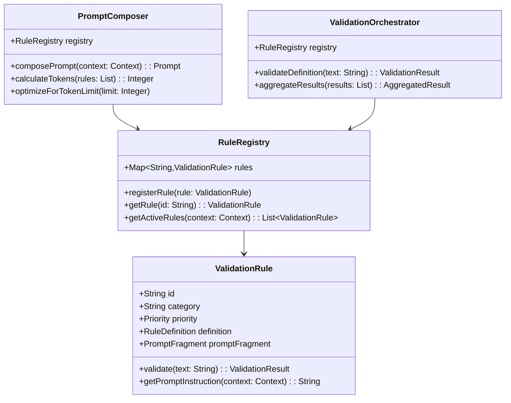
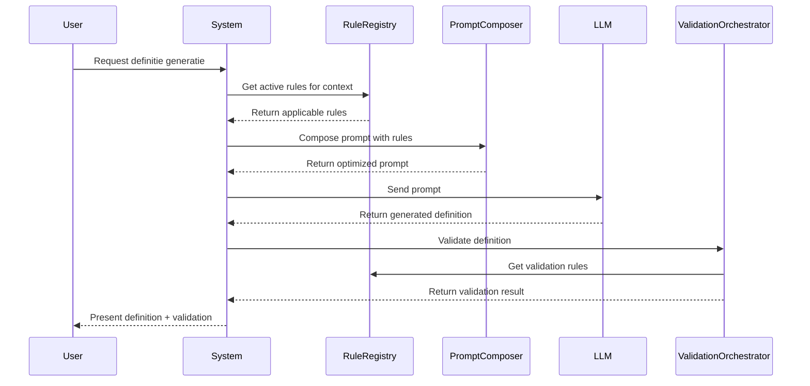

# EA - Prompt Management Systeem voor Definitie-app

## Executive Summary

Dit document beschrijft de Enterprise Architectuur voor een nieuw Prompt Management Systeem binnen de Definitie-app. Het systeem centraliseert en modulariseert de beheer van validatieregels en hun bijbehorende prompt-instructies, waarbij een "Single Source of Truth" principe wordt gehandhaafd voor zowel validatie als generatie van juridische definities.

## Context & Scope

### Organisatorische Context

De Definitie-app wordt gebruikt binnen de Nederlandse justitieketen voor het genereren en valideren van juridische definities. Relevante stakeholders zijn:

- **OM (Openbaar Ministerie)**: Primaire gebruiker voor strafrechtelijke definities
- **DJI (Dienst Justitiële Inrichtingen)**: Gebruik voor detentie-gerelateerde begrippen
- **Rechtspraak**: Validatie van juridische terminologie
- **Justid**: Authenticatie en autorisatie van gebruikers

### Probleemstelling

Het huidige systeem heeft de volgende uitdagingen:
1. **Token Inefficiëntie**: Alle 45 validatieregels worden hardcoded in elke prompt meegegeven (7250 tokens)
2. **Onderhoudbaarheid**: Regels zijn verspreid over verschillende modules zonder centrale coördinatie
3. **Testbaarheid**: Geen mogelijkheid om individuele regels geïsoleerd te testen
4. **Flexibiliteit**: Geen dynamische samenstelling van prompts op basis van context

### Business Capabilities

Het nieuwe systeem moet de volgende capabilities ondersteunen:

```mermaid
graph TD
    BC1[Regel Beheer] --> BC1.1[Regel Definitie]
    BC1[Regel Beheer] --> BC1.2[Regel Configuratie]
    BC1[Regel Beheer] --> BC1.3[Regel Versionering]

    BC2[Prompt Generatie] --> BC2.1[Context-aware Samenstelling]
    BC2[Prompt Generatie] --> BC2.2[Token Optimalisatie]
    BC2[Prompt Generatie] --> BC2.3[Template Management]

    BC3[Validatie Services] --> BC3.1[Regel Executie]
    BC3[Validatie Services] --> BC3.2[Result Aggregatie]
    BC3[Validatie Services] --> BC3.3[Feedback Generatie]

    BC4[Kwaliteitsborging] --> BC4.1[Regel Testing]
    BC4[Kwaliteitsborging] --> BC4.2[Prompt Testing]
    BC4[Kwaliteitsborging] --> BC4.3[Performance Monitoring]
```

## Architecture Decisions

### AD1: Single Source of Truth Principe

**Besluit**: Elke validatieregel heeft exact één definitie die gebruikt wordt voor zowel validatie als prompt-generatie.

**Rationale**:
- Voorkomt inconsistenties tussen validatie en generatie logica
- Vereenvoudigt onderhoud
- Verbetert traceerbaarheid

**Consequenties**:
- Regel definities moeten rijk genoeg zijn voor beide use cases
- Mogelijk hogere complexiteit in regel metadata

### AD2: Modulaire Regel Architectuur

**Besluit**: Elke regel wordt een zelfstandige module met eigen verantwoordelijkheden.

**Rationale**:
- Verhoogt testbaarheid (unit tests per regel)
- Maakt hot-reloading mogelijk
- Ondersteunt geleidelijke migratie

**Consequenties**:
- Meer bestanden in het systeem
- Noodzaak voor regel discovery mechanisme

### AD3: Context-Driven Prompt Composition

**Besluit**: Prompts worden dynamisch samengesteld op basis van actieve context en configuratie.

**Rationale**:
- Reduceert token gebruik significant
- Verhoogt relevantie van instructies
- Ondersteunt A/B testing van regels

**Consequenties**:
- Complexere prompt builder logica
- Noodzaak voor context determination service

## Components/Design

### Domein Model

### Information Flow

## Standards & Compliance

### NORA Principes

- **P01 - Proactief**: Systeem anticipeert op verschillende juridische contexten
- **P02 - Vindbaar**: Alle regels zijn centraal vindbaar en doorzoekbaar
- **P03 - Toegankelijk**: API-first design voor integratie met andere systemen
- **P04 - Standaarden**: Gebruik van OpenAPI voor interface specificaties
- **P05 - Geborgd**: Audit trail voor alle regel wijzigingen

### BIO Compliance

- **Integriteit**: Hash-based verificatie van regel definities
- **Vertrouwelijkheid**: Role-based access voor regel configuratie
- **Beschikbaarheid**: Caching strategie voor regel metadata

### AVG/GDPR

- Geen persoonsgegevens in regel definities
- Audit logs bevatten alleen functionele metadata
- Data minimalisatie in prompt samenstelling

## Risks & Mitigations

### Risico 1: Performance Degradatie

**Beschrijving**: Dynamische prompt compositie kan leiden tot langere response tijden.

**Mitigatie**:
- Implement caching voor frequent gebruikte regel combinaties
- Pre-compile prompt templates tijdens startup
- Async loading van regel modules

### Risico 2: Backwards Compatibility

**Beschrijving**: Bestaande integraties kunnen breken bij migratie.

**Mitigatie**:
- Facade pattern voor legacy interfaces
- Feature flags voor geleidelijke rollout
- Parallel run van oud en nieuw systeem tijdens transitie

### Risico 3: Regel Conflicten

**Beschrijving**: Verschillende regels kunnen conflicterende instructies genereren.

**Mitigatie**:
- Conflict detection tijdens regel registratie
- Prioriteit-based resolution mechanisme
- Expliciete conflict rules in configuratie

## Migration Strategy

### Fase 1: Foundation (Week 1-2)
- Implementeer RuleRegistry en basis ValidationRule interface
- Migreer 5 pilot regels (ARAI, CON groep)

### Fase 2: Integration (Week 3-4)
- Integreer met bestaande ModularValidationService
- Implement PromptComposer met token optimalisatie

### Fase 3: Migration (Week 5-8)
- Migreer remaining 40 regels in batches
- Parallel testing met legacy systeem

### Fase 4: Optimization (Week 9-10)
- Performance tuning
- A/B testing framework
- Monitoring en alerting

## References

- [NORA Principes](https://www.noraonline.nl/wiki/Principes)
- [Baseline Informatiebeveiliging Overheid](https://www.cip-overheid.nl/productcategorieen-en-worddocumenten/bio-versie-104zv/)
- [GEMMA Referentiearchitectuur](https://www.gemmaonline.nl/index.php/GEMMA_Architectuur)
- [OpenAPI Specification 3.1](https://spec.openapis.org/oas/latest.html)

---
*Versie: 1.0.0*
*Datum: 2025-09-03*
*Status: Concept*
