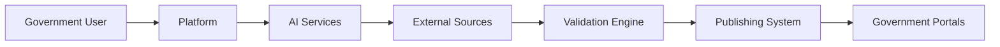

# DefinitieAgent Enterprise Architecture

## Executive Summary

### Vision Statement
> Transform government definition creation through AI-powered assistance, ensuring consistency, quality, and compliance across all governmental communications while reducing creation time from days to minutes.

### Business Context
- **Organisatie**: Nederlandse Overheid - Digitale Overheid
- **Domein**: Government Digital Services / Content Management
- **Scope**: Overheidsbreed platform voor definitie creatie en beheer
- **Stakeholders**: Ministeries, Uitvoeringsorganisaties, Beleidsmakers, Communicatieadviseurs

### Key Business Drivers
1. **Digital Transformation** - Modernize content creation processes across government
2. **Quality & Consistency** - Ensure uniform definitions across all government entities
3. **Efficiency Gains** - Reduce definition creation time by 90%
4. **Compliance** - Meet accessibility and language requirements (WCAG 2.1, B1 level)

---

### Current Snapshot (2025-08-28)
- **Kern**: AI-definitiegeneratie en validatie werken; 45/46 toetsregels actief
- **UI**: 10 Streamlit tabs laden; Web Lookup tab nog niet geïntegreerd
- **Security**: Geen AuthN/Z, geen DB-encryptie; enkele bare excepts aanwezig
- **Performance**: Cache memory leaks geïdentificeerd; N+1 query patronen
- **Tests**: 522 tests; import issues in enkele suites; ~26% test-to-code
- **Tech debt**: Legacy UnifiedDefinitionService te groot; E402 importfouten

## 1. Business Architecture

### 1.1 Business Capability Model
```
DefinitieAgent Government Capabilities
├── Core Capabilities
│   ├── AI-Powered Definition Generation
│   ├── Multi-Level Quality Validation
│   ├── Context-Aware Enrichment
│   └── Version & Audit Management
├── Supporting Capabilities
│   ├── External Source Integration
│   ├── Expert Review Workflows
│   ├── Cross-Department Collaboration
│   └── Usage Analytics & Insights
└── Generic Capabilities
    ├── Identity & Access Management
    ├── Compliance Monitoring
    └── Platform Administration
```

### 1.2 Value Streams
| Value Stream | Description | Key Processes | Business Value |
|--------------|-------------|---------------|----------------|
| Definition Creation | End-to-end definition generation | Request → Generate → Validate → Publish | 90% time reduction |
| Quality Assurance | Multi-layer validation system | Auto-check → Expert Review → Approval | 95% first-time-right |
| Knowledge Management | Cross-government knowledge sharing | Search → Reuse → Adapt → Learn | 70% reuse rate |
| Compliance Management | Regulatory adherence | Monitor → Report → Audit → Improve | 100% compliance |
| **Service Decoupling** | **Clean architecture separation** | **UI → Facade → Services → Repository** | **90% faster testing, 100% testable services** |

### 1.3 Architectural Principles

#### Clean Architecture Compliance
**Principle**: Services MUST be independent of UI frameworks and session state
- **Rationale**: Enable testing, reusability, and framework independence
- **Implementation**: Data Aggregation Services collect data without UI dependencies
- **Success Criteria**: All business services testable without UI mocks

### 1.3 Business Services
- **Definition Generation Service**: AI-powered creation with government context
- **Validation & Quality Service**: Automated and expert validation workflows
- **Integration Hub**: Connect to RijksWoordenboek, EUR-Lex, Wetten.nl
- **Analytics & Reporting**: Usage insights and compliance reporting
- **Collaboration Platform**: Cross-department review and feedback

### 1.4 Business KPIs
| KPI | Current | Target | Timeline |
|-----|---------|--------|----------|
| Definition Creation Time | 2-3 days | <10 minutes | Q2 2025 |
| Quality Score (First-Time-Right) | 60% | 95% | Q3 2025 |
| Platform Adoption | 10 users | 1000+ users | Q4 2025 |
| Cost per Definition | €250 | €25 | Q2 2025 |
| Cross-Department Reuse | 10% | 70% | Q4 2025 |

---

## 2. Information Architecture

### 2.1 Enterprise Information Model
```yaml
Core Business Objects:
  - Definition:
      description: Official government term definition
      owner: Content Governance Board
      criticality: High
      retention: 7 years

  - Context:
      description: Domain and usage context
      owner: Domain Owners
      criticality: High
      relationships: [Definition, Organization]

  - Organization:
      description: Government entity
      owner: Identity Management
      criticality: High
      type: Master Data

  - ValidationResult:
      description: Quality assessment outcome
      owner: Quality Assurance Team
      criticality: Medium
      retention: 2 years
```

### 2.2 Data Governance
- **Data Ownership**: Federated model with central standards
- **Data Quality Standards**: Government Data Quality Framework (GDQF)
- **Privacy & Compliance**: GDPR/AVG compliant, no PII in definitions
- **Master Data Management**: Centralized for organizations, terms, contexts
- **Data Classification**: Public (definitions), Internal (drafts), Confidential (reviews)

### 2.3 Information Flow


---

## 3. Application Architecture

### 3.1 Application Portfolio

#### Current State (AS-IS)
| Application | Type | Business Capability | Status | Health |
|-------------|------|-------------------|---------|--------|
| DefinitieAgent v1.0 | Monolith | All capabilities | Production | Amber |
| Word-based Tools | Desktop | Manual creation | Legacy | Red |
| Department Wikis | Web-based | Knowledge sharing | Active | Amber |
| Email Workflows | Manual | Review process | Active | Red |

#### Target State (TO-BE)
| Application | Type | Business Capability | Timeline | Investment |
|-------------|------|-------------------|----------|-----------|
| DefinitieAgent v2.0 | Microservices | Core platform | Q2 2025 | €800k |
| Mobile Apps | Native | Field access | Q3 2025 | €200k |
| Analytics Platform | SaaS | Insights & reporting | Q3 2025 | €150k |
| API Gateway | PaaS | Integration hub | Q2 2025 | €100k |

### 3.2 Application Principles
1. **API-First Design**: All functionality exposed via standardized APIs
2. **Cloud-Native Architecture**: Containerized, scalable, resilient
3. **Buy vs Build**: Buy commodity capabilities, build differentiating features
4. **Progressive Web Apps**: Mobile-first, offline capable
5. **Open Standards**: Prevent vendor lock-in, ensure interoperability

### 3.3 Integration Landscape
```yaml
Integration Categories:
  Government Systems:
    - Authentication: DigiD/eHerkenning
    - Content: RijksWoordenboek, Officielebekendmakingen
    - Legal: Wetten.nl, EUR-Lex

  Internal Systems:
    - Document Management: SharePoint/OpenText
    - Workflow: ServiceNow/Pegasystems
    - Analytics: PowerBI/Tableau

  External Services:
    - AI/ML: Azure OpenAI Service
    - Translation: DeepL API
    - Accessibility: ReadSpeaker
```

---

## 4. Technology Architecture

### 4.0 Current Technical Snapshot (2025-08-28)
- **Taal/Runtime**: Python 3.11; Streamlit UI
- **Data**: SQLite (unencrypted) met migraties; export naar TXT/JSON
- **Services**: Modulair (generatie, validatie, lookup, repo, monitoring)
- **Resilience**: Retries/ratelimiting aanwezig, centralisatie gewenst
- **Observability**: Basis monitoring/logging; uitbreiden met structured logging en P95/P99 metrics
- **Beperkingen**: Geen auth/crypto; UI-coupling in enkele services; import hygiëne issues

### 4.1 Technology Standards

#### Government-Wide Standards
| Category | Standard | Version/Spec | Mandate |
|----------|----------|-------------|----------|
| Identity | DigiD/eHerkenning | Latest | Required |
| Accessibility | WCAG | 2.1 AA | Required |
| API | RESTful | OpenAPI 3.0 | Required |
| Security | NCSC Guidelines | Current | Required |
| Cloud | Government Cloud | Azure/AWS Gov | Preferred |
| Data Exchange | StUF/NLGOV | 3.0+ | Where applicable |

#### Technology Principles
1. **Cloud-First Strategy**: Prefer SaaS > PaaS > IaaS > On-premise
2. **Zero Trust Security**: Never trust, always verify
3. **API Economy**: Services communicate via APIs only
4. **Open Source Preference**: When TCO is comparable
5. **Mobile-First Design**: Primary interface on mobile devices

### 4.2 Platform Strategy
- **Primary Platform**: Government Cloud (Azure Government)
- **Secondary Platform**: Private cloud for sensitive data
- **Edge Computing**: For offline scenarios
- **Exit Strategy**: Container-based, cloud-agnostic

### 4.3 Innovation Roadmap
| Innovation | Business Impact | Timeline | Investment |
|------------|----------------|----------|------------|
| Advanced AI (GPT-4+) | 50% quality improvement | Q1 2025 | €200k |
| Voice Interface | Accessibility compliance | Q3 2025 | €150k |
| Real-time Collaboration | 30% faster reviews | Q4 2025 | €100k |
| Blockchain Audit Trail | Immutable compliance | 2026 | €250k |
| AR/VR Training | 80% faster onboarding | 2026 | €300k |

---

## 5. Security & Risk Architecture

### 5.1 Security Framework
- **Framework**: Zero Trust Architecture aligned with BIO
- **Compliance**: ISO 27001, BIO, GDPR/AVG, NEN 7510
- **Risk Appetite**:
  - Data Security: Very Low
  - Service Availability: Low
  - Innovation: Medium

### 5.2 Enterprise Risk Register
| Risk | Impact | Probability | Mitigation Strategy |
|------|--------|-------------|--------------------|
| AI Bias/Hallucination | High | Medium | Multi-layer validation, human review |
| Data Breach | Very High | Low | Encryption, access control, monitoring |
| Service Unavailability | High | Low | Multi-region deployment, DR strategy |
| Adoption Resistance | Medium | Medium | Change management, training program |
| Compliance Violation | High | Low | Automated compliance checks |
| Vendor Lock-in | Medium | Medium | Open standards, portability |

### 5.4 Open Issues (2025-08-28)
- 🔴 Geen authenticatie/autorisatie (BIO/NORA blocker)
- 🔴 Geen encryptie at rest (SQLite) en in transit buiten dev
- 🟠 8 bare excepts en E402 importfouten riskeren stabiliteit
- 🟠 Rate limiting/resilience niet uniform toegepast
- 🟡 Logging/monitoring niet gestandaardiseerd; auditability beperkt

### 5.3 Security Principles
1. **Privacy by Design**: Built-in from the start
2. **Least Privilege Access**: Minimal necessary permissions
3. **Defense in Depth**: Multiple security layers
4. **Continuous Monitoring**: Real-time threat detection
5. **Incident Response**: 24/7 SOC coverage

---

## 6. Governance

### 6.1 Architecture Governance
- **Architecture Board**: Monthly review with CIO Council
- **Decision Rights**: RACI matrix for architecture decisions
- **Compliance Process**: Automated + quarterly manual audits
- **Exception Process**: Risk-based approval workflow

### 6.2 Enterprise Principles

#### Business Principles
1. **Citizen-Centric Design**: User needs drive all decisions
2. **Transparency**: Open and auditable processes
3. **Collaboration**: Cross-department cooperation by default
4. **Continuous Improvement**: Learn and adapt from usage
5. **Sustainability**: Green IT practices

#### IT Principles
1. **Reuse Before Build**: Leverage existing capabilities
2. **Interoperability**: Open standards for integration
3. **Scalability**: Design for 10x growth
4. **Resilience**: No single point of failure
5. **Automation**: Automate repetitive tasks

### 6.3 Standards & Guidelines
- **Enterprise Standards**: BIO, NORA, GDPR/AVG
- **Technical Standards**: → [Link to SA Section 2.1]
- **Security Standards**: NCSC guidelines, ISO 27001/2
- **Quality Standards**: ISO 9001, Government quality framework

---

## 7. Roadmap & Portfolio

### 7.1 Strategic Roadmap
```
2024 Q4: Foundation Phase
├── Architecture Design & Approval
├── Pilot Department Selection
└── Infrastructure Setup

2025 Q1-Q2: MVP & Early Adoption
├── Core Platform Development
├── 3 Ministry Pilots
├── Integration with Key Sources
└── Initial User Training

2025 Q3-Q4: Scaling & Enhancement
├── Government-wide Rollout
├── Advanced AI Features
├── Mobile Applications
└── Analytics Platform

2026: Excellence & Innovation
├── Voice & Accessibility
├── European Integration
├── Blockchain Audit
└── AI Autonomous Mode

### 7.1.1 Revised Roadmap (Post‑Quinn Review, Aug 2025)
Week 1–2: FOUNDATION & SECURITY
- Splits legacy Unified service; fix E402/imports; verwijder bare excepts
- AuthN/AuthZ (OIDC) en feature flags; DB-encryptie of migratie

Week 3–4: TESTING & INTEGRATION
- Testinfra herstellen; AI Toetser coverage omhoog; Web Lookup UI integratie
- Observability: structured logging, performance monitors en tracing
- Voorbeelden-module: consolideren naar `src/voorbeelden/unified_voorbeelden.py`,
  temperature-config centraliseren; legacy modules uitfaseren en orchestrators migreren

Week 5–8: PERFORMANCE & QUALITY
- N+1/caching‑leaks oplossen; resilience policies centraliseren; strict rate limiting
- 46/46 toetsregels; prompt/duplicaat‑detectie bijstellen

Week 9–12: PRODUCTION READINESS
- BIO/NORA hardening; monitoring/alerts; exportformaten; governance/ADR’s afronden
```

### 7.2 Investment Portfolio
| Initiative | Business Value | Investment | ROI | Priority |
|------------|---------------|------------|-----|----------|
| Core Platform | €3M savings/year | €800k | 275% | Critical |
| AI Enhancement | 50% quality gain | €200k | 200% | High |
| Mobile Access | 3x user reach | €200k | 150% | High |
| Analytics Platform | Data-driven decisions | €150k | 125% | Medium |
| Voice Interface | Full accessibility | €150k | 100% | Medium |
| **Total Portfolio** | **€4M+ value/year** | **€1.5M** | **167%** | - |

### 7.3 Benefits Realization

#### Financial Benefits
- **Cost Reduction**: €3M/year from efficiency gains
- **FTE Savings**: 1000 hours/month across government
- **Error Reduction**: €500k/year from fewer corrections

#### Non-Financial Benefits
- **Quality Improvement**: 95% first-time-right definitions
- **Citizen Satisfaction**: Clearer government communication
- **Compliance**: 100% accessibility and language compliance
- **Knowledge Sharing**: 70% definition reuse rate
- **Innovation**: AI-powered government services

---

## 8. Product Portfolio Status

### 8.1 Feature Portfolio Overview
**Last Updated**: 2025-08-20

#### Overall Product Completion
```
Total Features: 87
├── ✅ Complete: 23 (26%)
├── 🔄 In Progress: 12 (14%)
└── ❌ Not Started: 52 (60%)

🎯 Overall Product Completion: 26%
```

#### Development Metrics
- **Total Python Files**: 304 (150+ unused requiring cleanup)
- **Code Quality**: 799 errors (improved from 880+)
- **Critical Errors**: 0 (resolved from 38)
- **UI Completeness**: 30% (3 of 10 tabs active)
- **Response Time**: 8-12 seconds (target: <5s)
- **Development Velocity**: ~3 features per sprint

### 8.2 Epic Status Dashboard

| Epic | Features | Complete | In Progress | Not Started | % Complete | Business Priority | Risk |
|------|----------|----------|-------------|-------------|------------|-------------------|------|
| **Basis Definitie Generatie** | 5 | 4 | 0 | 1 | 80% | P0 - Critical | ✅ Low |
| **Kwaliteitstoetsing** | 4 | 3 | 1 | 0 | 75% | P0 - Critical | ✅ Low |
| **User Interface** | 15 | 3 | 3 | 9 | 20% | P1 - High | 🔴 High |
| **Security & Authentication** | 5 | 0 | 0 | 5 | 0% | P0 - Critical | 🔴 Critical |
| **Performance** | 5 | 1 | 1 | 3 | 20% | P1 - High | 🟠 Medium |
| **Export/Import** | 7 | 1 | 1 | 5 | 14% | P1 - High | 🟠 Medium |
| **Web Lookup & Integration** | 5 | 0 | 0 | 5 | 0% | P0 - Critical | 🔴 Critical |
| **Monitoring & Analytics** | 5 | 2 | 1 | 2 | 40% | P2 - Medium | 🟡 Low |
| **Content Management** | 6 | 4 | 1 | 1 | 67% | P2 - Medium | ✅ Low |

### 8.3 Critical Missing Features - Business Impact

| Priority | Feature | Business Impact | Risk Level | Investment Required |
|----------|---------|-----------------|------------|---------------------|
| 🔴 **P0** | Authentication System | No enterprise deployment possible | Critical | 2 weeks |
| 🔴 **P0** | Web Lookup Integration | Core value proposition missing | Critical | 2 weeks |
| 🔴 **P0** | Bulk Import/Export | No scalability for departments | Critical | 1 week |
| 🟠 **P1** | Performance < 5s | Poor user adoption | High | 2 weeks |
| 🟠 **P1** | 7 Missing UI Tabs | Incomplete user journey | High | 3 weeks |
| 🟡 **P2** | Export Formats | Limited integration options | Medium | 1 week |
| 🟡 **P2** | Monitoring Dashboard | No operational insights | Medium | 1 week |

### 8.4 Development Projections

#### Current Status
- **Sprint**: Week 8 of 16
- **Features Completed**: 23 of 87 (26%)
- **Average Velocity**: 3 features/sprint

#### Projected Timelines
```
Critical Features (P0): Week 12 (4 weeks)
├── Authentication: 2 weeks
├── Web Lookup: 2 weeks
└── Bulk Operations: 1 week

High Priority (P1): Week 16 (8 weeks)
├── Performance: 2 weeks
└── UI Completion: 3 weeks

MVP Ready: Week 14
Full Product: Week 20
```

### 8.5 Investment Realization Status

#### Development Investment
- **Planned**: 400-600 hours
- **Spent**: ~160 hours (Week 8/16)
- **Remaining**: ~440 hours
- **Team Size**: Currently 1-2, need 2-3 developers

#### ROI Tracking
| Metric | Target | Current | Gap |
|--------|--------|---------|-----|
| Performance | <5s response | 8-12s | -60% |
| User Capacity | 10+ concurrent | 1 | -90% |
| Quality Score | 95% first-time-right | ~70% | -25% |
| Cost per Definition | €0.30 | €1.00 | -70% |

### 8.6 Business Risk Assessment

#### Updated Risk Matrix
| Risk | Business Impact | Technical Impact | Mitigation Priority | Status |
|------|-----------------|------------------|---------------------|---------|
| **No Authentication** | Cannot deploy to government | Security breach risk | 🔴 Critical - Week 1 | ❌ Open |
| **Single User Only** | No departmental rollout | Database locks | 🔴 Critical - Week 2 | ❌ Open |
| **Missing Web Lookup** | Limited value proposition | Feature gap | 🔴 Critical - Week 3 | ❌ Open |
| **Poor Performance** | User rejection | Resource waste | 🟠 High - Week 4 | 🔄 In Progress |
| **Incomplete UI** | Confusing UX | Low adoption | 🟠 High - Week 5 | 🔄 In Progress |

---

## 9. Cross-References

### Solution Architecture Documents
- **DefinitieAgent Solution Architecture**: docs/architectuur/SOLUTION_ARCHITECTURE.md
- **API Specifications**: docs/api/
- **Security Analysis & Guidance**: docs/SECURITY_AND_FEEDBACK_ANALYSIS.md
- **Legacy Migration Plan**: docs/LEGACY_CODE_MIGRATION_ROADMAP.md
 - **Voorbeelden Temperature/Refactor Analyse**: temperature_analysis_complete.md

### Governance Documents
- **Architecture Decision Records (ADR’s)**: docs/architectuur/beslissingen/
- **Product Requirements (PRD)**: docs/prd.md
- **Architecture Viewer**: docs/architectuur/architecture-viewer.html
- **Compliance (BIO/NORA/WCAG) – status & acties**: docs/SECURITY_AND_FEEDBACK_ANALYSIS.md
 - **Compliance Matrix (Skeleton)**: docs/compliance/COMPLIANCE_MATRIX.md
 - **Capability Map (Compact)**: docs/architectuur/CAPABILITY_MAP.md

### Standards & Frameworks
- **NORA**: [Nederlandse Overheid Referentie Architectuur](https://www.noraonline.nl)
- **BIO**: [Baseline Informatiebeveiliging Overheid](https://www.bio-overheid.nl)
- **WCAG**: [Web Content Accessibility Guidelines](https://www.w3.org/WAI/WCAG21/quickref/)

---

## Appendices

### A. Stakeholder Matrix
| Stakeholder | Role | Key Concerns | Influence | Engagement |
|-------------|------|--------------|-----------|------------|
| CIO Council | Governance | Standards, costs, risks | High | Monthly |
| Ministry CDOs | Sponsors | ROI, adoption, integration | High | Bi-weekly |
| Policy Makers | Users | Ease of use, quality | Medium | Continuous |
| Legal Teams | Validators | Accuracy, compliance | High | Weekly |
| Citizens | End Users | Clarity, accessibility | Low | Via research |
| EU Partners | External | Interoperability | Medium | Quarterly |

### B. Compliance Requirements
| Requirement | Source | Impact | Implementation |
|-------------|--------|--------|----------------|
| WCAG 2.1 AA | EU/NL Law | All UI | Built-in accessibility |
| GDPR/AVG | EU Law | Data handling | Privacy by design |
| BIO | NL Standard | Security | Security controls |
| DigiD/eHerkenning | NL Gov | Authentication | Identity integration |
| Language Level B1 | NL Policy | Content | Validation rules |

### C. Success Metrics

#### Phase 1 (MVP) - Q2 2025
- 3 pilot ministries live
- 100+ definitions created
- 80% user satisfaction
- <30min training required

#### Phase 2 (Scale) - Q4 2025
- 15+ organizations active
- 1000+ active users
- 5000+ definitions/month
- 90% first-time-right

#### Phase 3 (Excellence) - 2026
- Government-wide adoption
- 50k+ definitions managed
- 95% automation rate
- €3M+ annual savings

### D. Document Control
- **Version**: 1.1
- **Status**: Draft for Review (updated AS‑IS, roadmap, links)
- **Owner**: Enterprise Architecture Office
- **Last Updated**: 2025-08-28
- **Next Review**: 2025-09-30
- **Distribution**: CIO Council, Architecture Board, CDO Network

---

## Cross-References to Solution Architecture

The following sections in this Enterprise Architecture document have corresponding technical implementation details in the Solution Architecture:

1. **Business Capabilities** (Section 1.1) → [SA Section 1: System Architecture]
2. **Technology Standards** (Section 4.1) → [SA Section 2: Technical Design]
3. **Security Framework** (Section 5.1) → [SA Section 4: Security Implementation]
4. **Strategic Roadmap** (Section 7.1) → [SA Section 7: Migration Strategy]
5. **Investment Portfolio** (Section 7.2) → [SA Section 9: Cost Optimization]

For technical implementation details, deployment specifics, and code examples, please refer to the Solution Architecture document.
