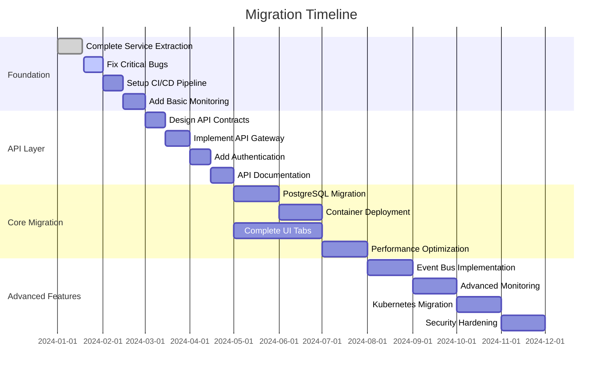

# Migration Roadmap - Definitie App

## Executive Summary

Dit document beschrijft de concrete stappen om van de huidige architectuur (AS-IS) naar de gewenste architectuur (TO-BE) te migreren. De roadmap is pragmatisch opgezet met focus op incrementele waarde levering.

**Migratie Filosofie**: "Make it work, make it right, make it fast"

## Migration Overview



## Phase 0: Foundation Stabilization (Jan-Feb 2024)

### 🎯 Goals
- Stabilize current system
- Enable safe future changes
- Improve developer experience

### 📋 Tasks

#### Week 1-2: Critical Bug Fixes
```yaml
Priority: CRITICAL
Owner: Development Team

Tasks:
- [ ] Fix memory leaks in DefinitieAgent
- [ ] Resolve UTF-8 encoding issues in database
- [ ] Fix session state management in Streamlit
- [ ] Add error boundaries to prevent UI crashes

Success Criteria:
- System runs 48+ hours without crashes
- No data corruption issues
- Error messages properly displayed
```

#### Week 3-4: Development Infrastructure
```yaml
Priority: HIGH
Owner: DevOps Lead

Tasks:
- [ ] Setup GitHub Actions CI/CD
  - [ ] Automated linting (ruff)
  - [ ] Unit test execution
  - [ ] Build verification
- [ ] Create development environment script
  - [ ] Docker-compose for local dev
  - [ ] Test data seeding
  - [ ] Environment variable template
- [ ] Implement pre-commit hooks
  - [ ] Code formatting
  - [ ] Type checking
  - [ ] Security scanning

Deliverables:
- .github/workflows/ci.yml
- docker-compose.dev.yml
- Makefile with common commands
```

#### Week 5-6: Basic Monitoring
```yaml
Priority: HIGH
Owner: Backend Team

Tasks:
- [ ] Structured logging implementation
  - [ ] JSON log format
  - [ ] Correlation IDs
  - [ ] Error tracking
- [ ] Health check endpoints
  - [ ] /health - basic liveness
  - [ ] /ready - readiness check
  - [ ] /metrics - prometheus format
- [ ] Basic dashboards
  - [ ] Response times
  - [ ] Error rates
  - [ ] Resource usage

Tools:
- Python logging with JSON formatter
- Prometheus client library
- Grafana for visualization
```

## Phase 1: API Layer Implementation (Mar-Apr 2024)

### 🎯 Goals
- Enable true service separation
- Prepare for frontend evolution
- Establish security foundation

### 📋 Tasks

#### Week 7-8: API Design
```yaml
Priority: HIGH
Owner: Architect + Backend Team

Tasks:
- [ ] Create OpenAPI specifications
  - [ ] Definition management endpoints
  - [ ] Validation endpoints
  - [ ] Web lookup endpoints
- [ ] Design authentication flow
  - [ ] JWT token structure
  - [ ] Refresh token strategy
  - [ ] API key management
- [ ] Error response standards
  - [ ] Error code taxonomy
  - [ ] Standard error format
  - [ ] Validation error details

Deliverables:
- openapi.yaml specification
- API design document
- Authentication flow diagram
```

#### Week 9-10: FastAPI Implementation
```yaml
Priority: HIGH
Owner: Backend Team

Implementation:
- [ ] Setup FastAPI application
  - [ ] Project structure
  - [ ] Dependency injection
  - [ ] Middleware setup
- [ ] Implement core endpoints
  - [ ] GET /api/v1/definitions
  - [ ] POST /api/v1/definitions
  - [ ] GET /api/v1/definitions/{id}
  - [ ] POST /api/v1/validate
- [ ] Add request validation
  - [ ] Pydantic models
  - [ ] Custom validators
  - [ ] Error handling

Code Structure:
src/api/
├── __init__.py
├── main.py
├── routers/
│   ├── definitions.py
│   ├── validation.py
│   └── health.py
├── models/
│   ├── requests.py
│   └── responses.py
└── middleware/
    ├── auth.py
    └── logging.py
```

#### Week 11-12: Authentication Implementation
```yaml
Priority: CRITICAL
Owner: Security Lead + Backend

Tasks:
- [ ] JWT implementation
  - [ ] Token generation
  - [ ] Token validation
  - [ ] Refresh mechanism
- [ ] User management
  - [ ] Basic user model
  - [ ] Password hashing (bcrypt)
  - [ ] Session management
- [ ] API protection
  - [ ] Protected endpoints
  - [ ] Rate limiting
  - [ ] CORS configuration

Security Checklist:
- [ ] HTTPS only
- [ ] Secure headers
- [ ] Input sanitization
- [ ] SQL injection prevention
```

## Phase 2: Core Infrastructure (May-Jul 2024)

### 🎯 Goals
- Scalable data layer
- Container-based deployment
- Complete UI functionality

### 📋 Tasks

#### Week 13-16: PostgreSQL Migration
```yaml
Priority: HIGH
Owner: Database Team

Migration Strategy:
1. Parallel Run Phase (2 weeks)
   - [ ] Setup PostgreSQL instance
   - [ ] Implement dual-write logic
   - [ ] Data sync verification
   - [ ] Performance testing

2. Migration Execution (1 week)
   - [ ] Full data migration
   - [ ] Constraint implementation
   - [ ] Index optimization
   - [ ] Backup procedures

3. Cutover (1 week)
   - [ ] Switch primary to PostgreSQL
   - [ ] Monitor for issues
   - [ ] Remove SQLite code
   - [ ] Document procedures

Tools:
- Alembic for migrations
- pgAdmin for management
- pg_dump for backups
```

#### Week 17-20: Container Deployment
```yaml
Priority: MEDIUM
Owner: DevOps Team

Docker Implementation:
- [ ] Create Dockerfiles
  - [ ] API service
  - [ ] UI service
  - [ ] Worker services
- [ ] Docker Compose setup
  - [ ] Service definitions
  - [ ] Network configuration
  - [ ] Volume management
- [ ] Registry setup
  - [ ] Private registry
  - [ ] Image versioning
  - [ ] Security scanning

Deployment:
- [ ] Staging environment
- [ ] Blue-green deployment
- [ ] Rollback procedures
- [ ] Monitoring integration
```

#### Week 13-20: Complete UI Implementation
```yaml
Priority: HIGH
Owner: Frontend Team

Remaining Tabs (7 of 10):
- [ ] History Tab
  - Version history
  - Change tracking
  - Rollback capability
- [ ] Quality Control Tab
  - Validation dashboard
  - Rule management
  - Batch validation
- [ ] Expert Review Tab
  - Review workflow
  - Approval process
  - Comments system
- [ ] Export Tab
  - Multiple formats
  - Bulk export
  - Template system
- [ ] External Sources Tab
  - Source configuration
  - Import mapping
  - Sync status
- [ ] Monitoring Tab
  - Real-time metrics
  - System health
  - User analytics
- [ ] Orchestration Tab
  - Workflow designer
  - Process monitoring
  - Task management

Each Tab Requirements:
- Loading states
- Error handling
- Responsive design
- Keyboard navigation
```

## Phase 3: Advanced Features (Aug-Nov 2024)

### 🎯 Goals
- Event-driven architecture
- Production-grade monitoring
- Kubernetes deployment

### 📋 Tasks

#### Week 21-24: Event Bus Implementation
```yaml
Priority: MEDIUM
Owner: Backend Team

Start Simple (Redis Pub/Sub):
- [ ] Redis Streams setup
- [ ] Event publishers
- [ ] Event consumers
- [ ] Dead letter queue

Event Types:
- DefinitionCreated
- DefinitionUpdated
- ValidationCompleted
- WebLookupCached

Future (Kafka):
- Design event schema
- Plan partition strategy
- Consider event sourcing
```

#### Week 25-28: Full Observability
```yaml
Priority: HIGH
Owner: SRE Team

Implementation:
- [ ] Distributed tracing (Jaeger)
- [ ] Log aggregation (Loki)
- [ ] Metrics collection (Prometheus)
- [ ] Dashboards (Grafana)

Key Metrics:
- Four golden signals (latency, traffic, errors, saturation)
- Business metrics (definitions created, validation scores)
- Infrastructure metrics (CPU, memory, disk, network)
```

#### Week 29-32: Kubernetes Migration
```yaml
Priority: MEDIUM
Owner: DevOps Team

Gradual Approach:
1. Local K8s development (minikube)
2. Staging cluster deployment
3. Production preparation
4. Gradual rollout

Components:
- [ ] Helm charts
- [ ] ConfigMaps/Secrets
- [ ] Ingress configuration
- [ ] Auto-scaling policies
- [ ] Pod disruption budgets
```

## Phase 4: Production Excellence (Q4 2024)

### 🎯 Goals
- Security hardening
- Disaster recovery
- Performance optimization

### 📋 Tasks

#### Security Hardening
```yaml
- [ ] Security audit
- [ ] Penetration testing
- [ ] Vulnerability scanning
- [ ] Compliance verification
- [ ] Security training
```

#### Disaster Recovery
```yaml
- [ ] Backup automation
- [ ] Recovery procedures
- [ ] Failover testing
- [ ] Runbook creation
- [ ] Incident response plan
```

#### Performance Tuning
```yaml
- [ ] Load testing
- [ ] Query optimization
- [ ] Caching strategy
- [ ] CDN implementation
- [ ] Resource optimization
```

## Success Metrics

### Phase Completion Criteria

| Phase | Key Metrics | Target |
|-------|------------|--------|
| **Phase 0** | System stability | 99% uptime, <5 crashes/week |
| **Phase 1** | API availability | All endpoints functional, <500ms p95 |
| **Phase 2** | Migration complete | PostgreSQL primary, all tabs working |
| **Phase 3** | Production ready | Full monitoring, K8s deployed |
| **Phase 4** | Excellence achieved | <2s response, 99.9% uptime |

### Overall Progress Tracking

```python
# Progress calculation
def calculate_progress():
    tasks = {
        "phase_0": {"total": 20, "completed": 18},
        "phase_1": {"total": 25, "completed": 0},
        "phase_2": {"total": 40, "completed": 0},
        "phase_3": {"total": 30, "completed": 0},
        "phase_4": {"total": 15, "completed": 0}
    }

    total_tasks = sum(p["total"] for p in tasks.values())
    completed_tasks = sum(p["completed"] for p in tasks.values())

    return {
        "overall_progress": f"{completed_tasks}/{total_tasks} ({completed_tasks/total_tasks*100:.1f}%)",
        "current_phase": "Phase 0: Foundation",
        "next_milestone": "CI/CD Pipeline Setup"
    }
```

## Risk Management

### Top Risks & Mitigations

| Risk | Impact | Probability | Mitigation |
|------|--------|-------------|------------|
| **Data loss during migration** | High | Medium | Parallel run, extensive testing, rollback plan |
| **Performance degradation** | Medium | High | Gradual rollout, monitoring, optimization sprints |
| **Team burnout** | High | Medium | Realistic timelines, rotation, celebration milestones |
| **Scope creep** | Medium | High | Strict phase gates, clear success criteria |
| **Technology adoption issues** | Medium | Medium | Training, documentation, gradual introduction |

## Communication Plan

### Stakeholder Updates
- **Weekly**: Development team standup
- **Bi-weekly**: Progress report to management
- **Monthly**: Architecture review board
- **Quarterly**: Executive briefing

### Documentation
- **ADRs**: For all major decisions
- **Runbooks**: For operational procedures
- **API Docs**: Auto-generated from OpenAPI
- **User Guides**: For each new feature

## Next Steps

### Immediate Actions (This Week)
1. [ ] Team kickoff meeting
2. [ ] Assign phase 0 task owners
3. [ ] Setup project tracking board
4. [ ] Create first CI/CD pipeline
5. [ ] Fix most critical bug

### Decision Points
- **Feb 2024**: Go/No-go for API implementation
- **May 2024**: PostgreSQL migration approval
- **Aug 2024**: Kubernetes vs alternatives
- **Nov 2024**: Production readiness review

---

*Document Version: 1.0*
*Last Updated: 2024-01-18*
*Next Review: 2024-02-01*
*Owner: Architecture Team*

## Appendices

### A. Task Template
```yaml
Task: [Name]
Priority: [CRITICAL/HIGH/MEDIUM/LOW]
Owner: [Team/Person]
Duration: [Weeks]
Dependencies: [Other tasks]
Deliverables: [Specific outputs]
Success Criteria: [Measurable outcomes]
```

### B. Phase Gate Checklist
- [ ] All tasks completed
- [ ] Tests passing (>80% coverage)
- [ ] Documentation updated
- [ ] Security review passed
- [ ] Performance benchmarks met
- [ ] Stakeholder approval

### C. Tools & Technologies
- **CI/CD**: GitHub Actions
- **Containers**: Docker, Kubernetes
- **API**: FastAPI, OpenAPI
- **Database**: PostgreSQL, Redis
- **Monitoring**: Prometheus, Grafana, Jaeger
- **Security**: JWT, bcrypt, OWASP tools
