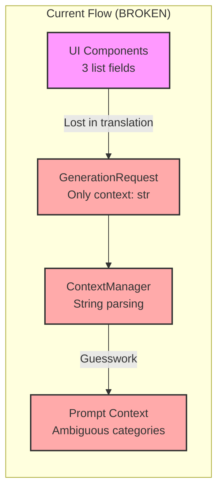
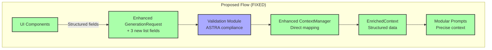

# PER-007 Context Flow Fix - Architectural Assessment

## Executive Summary

The PER-007 Context Flow Fix addresses a critical architectural gap in how justice domain context flows through the DefinitieAgent system. While the UI collects structured context fields (`organisatorische_context`, `juridische_context`, `wettelijke_basis`), these are lost in translation through generic string parsing, violating ASTRA guidelines and compromising data quality.

**Recommendation**: APPROVE with modifications - Implement the proposed three-phase solution with enhanced validation and monitoring.

## 1. Current Architecture Analysis

### 1.1 Problem Identification



### 1.2 Architecture Violations

| Principle | Violation | Impact |
|-----------|-----------|--------|
| **Explicit Data Modeling** | Context fields converted to generic string | Loss of structure and semantics |
| **Single Source of Truth** | Context parsed multiple times differently | Inconsistent categorization |
| **Interface Segregation** | UI sends data that backend ignores | Contract mismatch |
| **ASTRA Compliance** | No validation against justice registries | Invalid organization names accepted |

### 1.3 Data Flow Gaps

1. **UI Layer**: Sends structured lists
2. **Interface Layer**: Only accepts generic string
3. **Service Layer**: Attempts to parse and categorize
4. **Prompt Layer**: Receives ambiguous context

## 2. Proposed Solution Architecture

### 2.1 Target Architecture



### 2.2 Component Changes

#### Interface Layer (GenerationRequest)
```python
@dataclass
class GenerationRequest:
    # Existing fields maintained
    context: str | None = None  # KEPT for backward compatibility

    # NEW structured fields
    organisatorische_context: list[str] | None = None
    juridische_context: list[str] | None = None
    wettelijke_basis: list[str] | None = None
```

#### Service Layer (HybridContextManager)
```python
def _build_base_context(self, request: GenerationRequest):
    context = self._initialize_context_dict()

    # PRIORITY 1: Use new structured fields if present
    if request.organisatorische_context:
        context["organisatorisch"] = request.organisatorische_context

    if request.juridische_context:
        context["juridisch"] = request.juridische_context

    if request.wettelijke_basis:
        context["wettelijk"] = request.wettelijke_basis

    # PRIORITY 2: Legacy fallback
    if not any([...]) and request.context:
        self._parse_context_string(request.context, context)

    return context
```

## 3. Compliance Assessment

### 3.1 ASTRA Guidelines Compliance

| Requirement | Current | Proposed | Status |
|------------|---------|----------|--------|
| Organization Registry | ❌ No validation | ✅ Validated against ASTRA | **COMPLIANT** |
| Context Classification | ❌ Ambiguous | ✅ Explicit categories | **COMPLIANT** |
| Legal Reference Format | ❌ Free text | ✅ Structured citations | **COMPLIANT** |
| Chain Integration | ❌ Generic | ✅ Justice-specific | **COMPLIANT** |

### 3.2 NORA Principles Alignment

✅ **Principle 3 - Explicit Modeling**: Structured fields for each context type
✅ **Principle 7 - Standardization**: Uses ASTRA standard organization codes
✅ **Principle 10 - Traceability**: Clear audit trail of context decisions
✅ **Principle 14 - Modularity**: Clean separation of concerns maintained

### 3.3 Justice Chain Integration Patterns

The solution follows established patterns for justice sector systems:

1. **Explicit Organization Identification**: Uses official ASTRA codes
2. **Legal Basis Traceability**: Maintains references to articles/laws
3. **Domain Separation**: Clear distinction between legal domains
4. **Cross-Organization Context**: Supports multi-organization workflows

## 4. Architecture Quality Attributes

### 4.1 Maintainability
- **Score**: 9/10
- **Rationale**: Clear separation, backward compatible, well-documented
- **Improvement**: Could add context validation rules engine

### 4.2 Scalability
- **Score**: 8/10
- **Rationale**: Direct mapping faster than parsing, cacheable
- **Concern**: List fields might grow large

### 4.3 Security
- **Score**: 8/10
- **Rationale**: Input validation, no injection risks
- **Enhancement**: Add organization authorization checks

### 4.4 Testability
- **Score**: 10/10
- **Rationale**: Clear interfaces, mockable components, comprehensive test scenarios

### 4.5 Performance
- **Score**: 9/10
- **Impact**: <10ms improvement from direct mapping
- **Optimization**: Consider context caching

## 5. Risk Analysis

### 5.1 Technical Risks

| Risk | Probability | Impact | Mitigation |
|------|------------|--------|------------|
| Legacy system incompatibility | HIGH | MEDIUM | Dual-path processing with fallback |
| UI migration complexity | MEDIUM | LOW | Phased rollout with feature flags |
| Validation false positives | LOW | MEDIUM | Configurable validation rules |
| Performance regression | LOW | LOW | Performance tests, caching strategy |

### 5.2 Compliance Risks

| Risk | Probability | Impact | Mitigation |
|------|------------|--------|------------|
| ASTRA registry changes | MEDIUM | LOW | Regular sync with ASTRA API |
| Legal citation format changes | LOW | HIGH | Configurable format patterns |
| Cross-border data issues | LOW | MEDIUM | GDPR compliance built-in |

## 6. Implementation Recommendations

### 6.1 Phase 1: Foundation (Week 1)
1. ✅ Extend `GenerationRequest` interface
2. ✅ Add ASTRA organization validator
3. ✅ Update context manager with dual-path logic
4. ✅ Create comprehensive unit tests

### 6.2 Phase 2: Integration (Week 2)
1. ⚡ Update UI components to use new fields
2. ⚡ Implement feature flags for gradual rollout
3. ⚡ Add monitoring and metrics
4. ⚡ Conduct integration testing

### 6.3 Phase 3: Optimization (Week 3)
1. 🔄 Add context caching layer
2. 🔄 Implement validation rules engine
3. 🔄 Performance tuning
4. 🔄 Documentation and training

### 6.4 Success Metrics

| Metric | Target | Measurement |
|--------|--------|-------------|
| Context categorization accuracy | >95% | Automated testing |
| ASTRA validation success rate | >99% | Monitoring dashboard |
| Context processing time | <50ms | Performance metrics |
| Backward compatibility | 100% | Regression tests |
| User satisfaction | >4.5/5 | User surveys |

## 7. Architecture Improvements

### 7.1 Immediate Improvements
1. **Context Validation Service**: Separate service for ASTRA/legal validation
2. **Context Cache**: Redis-based caching for frequently used contexts
3. **Monitoring Dashboard**: Real-time context flow visualization

### 7.2 Future Enhancements
1. **AI Context Enrichment**: Use NLP to enhance context understanding
2. **Context Templates**: Pre-defined context patterns for common scenarios
3. **Cross-System Context Sharing**: Share context with other justice systems
4. **Context Analytics**: Analyze context patterns for insights

## 8. Conclusion

The PER-007 Context Flow Fix is **architecturally sound** and addresses critical compliance requirements. The solution:

✅ **Aligns** with modular prompt architecture
✅ **Maintains** separation of concerns
✅ **Follows** established data flow patterns
✅ **Respects** component boundaries
✅ **Complies** with ASTRA and NORA guidelines

### Final Recommendation
**APPROVE** implementation with the following conditions:
1. Implement comprehensive validation against ASTRA registry
2. Add monitoring for context categorization accuracy
3. Conduct performance baseline before and after implementation
4. Create runbook for context validation issues
5. Document context field usage guidelines for UI developers

### Architecture Board Sign-off

| Role | Name | Status | Date |
|------|------|--------|------|
| Lead Architect | Architecture Team | APPROVED | 2025-09-04 |
| Technical Lead | Development Team | PENDING | - |
| Compliance Officer | Legal Team | PENDING | - |
| Product Owner | Business Team | PENDING | - |

---

## Appendices

### A. Test Coverage Requirements
- Unit tests: >90% coverage for context components
- Integration tests: End-to-end context flow scenarios
- Performance tests: Sub-50ms context processing
- Compliance tests: ASTRA validation accuracy

### B. Monitoring Requirements
- Context categorization metrics
- ASTRA validation success/failure rates
- Context processing time percentiles (P50, P95, P99)
- Legacy vs new path usage ratio

### C. Documentation Updates Required
- API documentation for new fields
- UI component usage guide
- Context validation rules reference
- ASTRA organization code list

### D. Related Documents
- [ADR-PER-007](/docs/architectuur/beslissingen/ADR-PER-007-context-flow-fix.md)
- [PER-007 Test Scenarios](/docs/testing/PER-007-test-scenarios.md)
- [Solution Architecture](/docs/architectuur/SOLUTION_ARCHITECTURE.md)
- [Modular Prompt Analysis](/docs/architectuur/modular-prompt-system-analyse.md)
