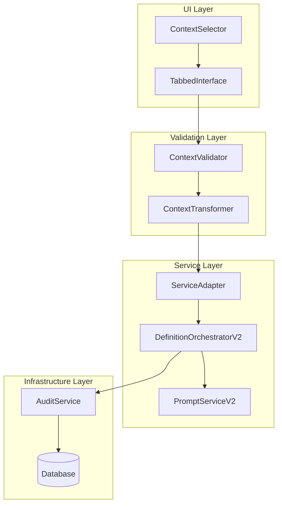
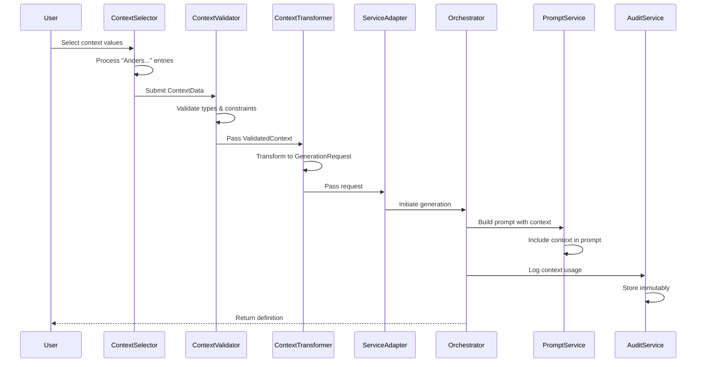
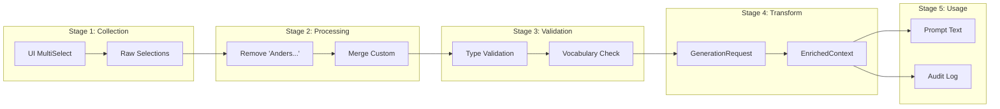
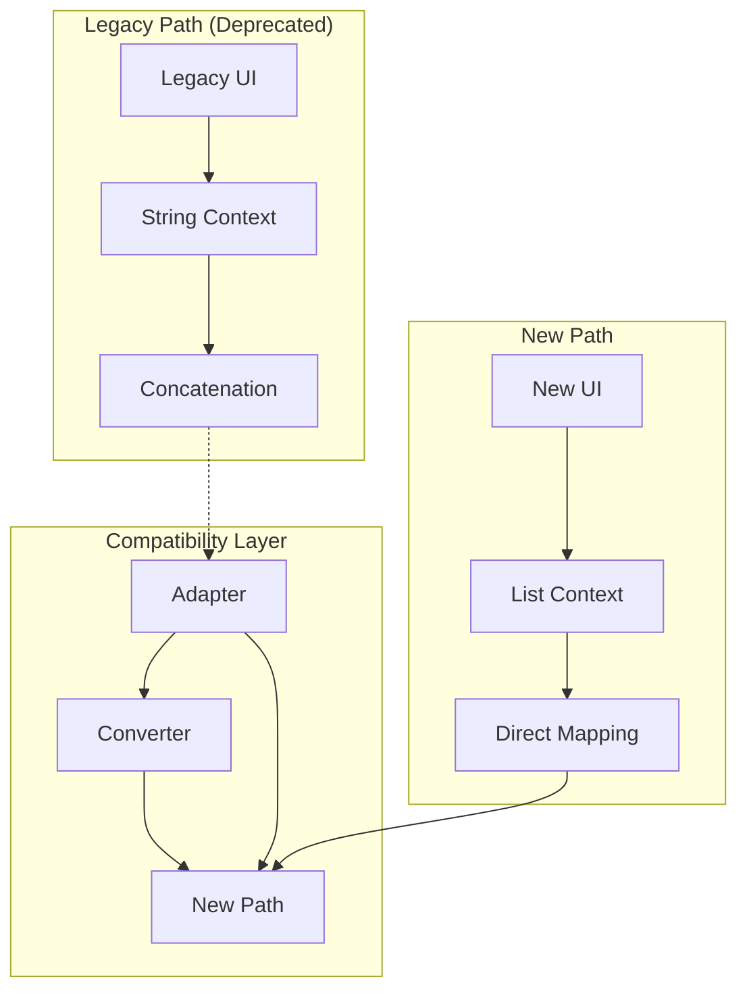

# Solution Architecture - Context Flow Refactoring (Epic CFR)

## Executive Summary

This Solution Architecture defines the component structure, interfaces, and data flow for the Context Flow Refactoring. It establishes a single, type-safe path from UI to prompt generation while supporting custom context entries and maintaining full ASTRA compliance.

## Context & Scope

The solution addresses the critical context flow issues identified in Epic CFR by implementing a clean, unidirectional data flow with proper type safety, validation, and traceability at each layer.

## Architecture Decisions

### Component Responsibilities

| Component | Responsibility | Interface Contract |
|-----------|---------------|-------------------|
| ContextSelector | UI widget for context selection | Returns `ContextData` object |
| ContextValidator | Type validation and sanitization | Validates `ContextData` → `ValidatedContext` |
| ServiceAdapter | Legacy compatibility layer | Maps UI data to `GenerationRequest` |
| PromptServiceV2 | Prompt construction with context | Uses `GenerationRequest` → `PromptResult` |
| DefinitionOrchestratorV2 | Service coordination | Orchestrates full generation flow |
| AuditService | Context usage tracking | Logs all context operations |

## Components/Design

### Component Architecture



### Data Flow Sequence



### Interface Specifications

#### ContextData Interface
```typescript
interface ContextData {
    organisatorische_context: string[];  // List of organizations
    juridische_context: string[];        // List of legal contexts
    wettelijke_basis: string[];          // List of legal bases
    custom_entries?: {                   // Optional custom entries
        organisatorisch?: string;
        juridisch?: string;
        wettelijk?: string;
    };
    metadata?: {
        voorsteller?: string;
        ketenpartners?: string[];
    };
}
```

#### ValidatedContext Interface
```typescript
interface ValidatedContext {
    organisatorische_context: string[];  // Validated & merged with custom
    juridische_context: string[];        // Validated & merged with custom
    wettelijke_basis: string[];          // Validated & merged with custom
    validation_metadata: {
        validated_at: DateTime;
        validation_rules_applied: string[];
        warnings?: string[];
    };
}
```

#### GenerationRequest Enhancement
```typescript
interface GenerationRequest {
    // Existing fields...
    id: string;
    begrip: string;

    // Context fields (ALWAYS lists, never strings)
    organisatorische_context: string[];
    juridische_context: string[];
    wettelijke_basis: string[];

    // Legacy compatibility (deprecated)
    context?: string;  // DEPRECATED - use context lists
    domein?: string;   // DEPRECATED - use juridische_context
}
```

### Component Specifications

#### 1. ContextSelector Component

**Purpose**: Provide user interface for context selection with "Anders..." support

**Key Functions**:
```python
class ContextSelector:
    def render(self) -> ContextData:
        """Main rendering function"""

    def _process_anders_entries(self, selections: List[str], custom: str) -> List[str]:
        """Process 'Anders...' entries without widget crashes"""
        # Remove "Anders..." from list
        # Append custom entry if provided
        # Return clean list for widget

    def _validate_selections(self, data: ContextData) -> ValidationResult:
        """Client-side validation"""
```

**"Anders..." Solution**:
1. Present "Anders..." as selectable option
2. When selected, show text input field
3. Process selections to remove "Anders..." marker
4. Append custom text to final list
5. Never pass "Anders..." to multiselect widget's value parameter

#### 2. ContextValidator Service

**Purpose**: Validate and sanitize context data

**Key Functions**:
```python
class ContextValidator:
    def validate(self, data: ContextData) -> ValidatedContext:
        """Main validation function"""

    def _ensure_list_type(self, value: Any) -> List[str]:
        """Convert any input to list of strings"""
        if value is None:
            return []
        if isinstance(value, str):
            return [value] if value else []
        if isinstance(value, list):
            return [str(v) for v in value if v]
        return []

    def _validate_against_vocabulary(self, values: List[str]) -> List[str]:
        """Check against justice vocabulary"""

    def _sanitize_custom_entries(self, text: str) -> str:
        """Sanitize custom input for injection attacks"""
```

#### 3. ServiceAdapter Enhancement

**Purpose**: Bridge between UI and orchestrator with proper context mapping

**Current Issue Fix**:
```python
# CURRENT BROKEN CODE (line 229):
context=", ".join(context_dict.get("organisatorisch", [])),

# FIXED CODE:
request = GenerationRequest(
    id=str(uuid.uuid4()),
    begrip=begrip,
    # Map context lists directly, no string concatenation
    organisatorische_context=context_dict.get("organisatorisch", []),
    juridische_context=context_dict.get("juridisch", []),
    wettelijke_basis=context_dict.get("wettelijk", []),
    # Legacy fields for compatibility
    context=None,  # Deprecated
    domein=None,   # Deprecated
)
```

#### 4. PromptServiceV2 Enhancement

**Purpose**: Build prompts with proper context inclusion

**Current Issue Fix**:
```python
# CURRENT BROKEN CODE (lines 158-176):
# Context fields are not properly extracted

# FIXED CODE:
def _convert_request_to_context(self, request: GenerationRequest, extra_context: dict = None):
    base_context = {
        "organisatorisch": request.organisatorische_context or [],
        "juridisch": request.juridische_context or [],
        "wettelijk": request.wettelijke_basis or [],
        "domein": []  # Legacy, kept for compatibility
    }

    # Build enriched context with all fields populated
    enriched = EnrichedContext(
        base_context=base_context,
        sources=[],
        expanded_terms={},
        confidence_scores={},
        metadata={
            "organisatorische_context": base_context["organisatorisch"],
            "juridische_context": base_context["juridisch"],
            "wettelijke_basis": base_context["wettelijk"],
        }
    )
    return enriched
```

#### 5. AuditService (New Component)

**Purpose**: Track all context usage for compliance

**Key Functions**:
```python
class AuditService:
    async def log_context_usage(
        self,
        request_id: str,
        context_data: ValidatedContext,
        user_id: str,
        timestamp: datetime
    ) -> AuditRecord:
        """Log context usage immutably"""

    async def generate_compliance_report(
        self,
        start_date: datetime,
        end_date: datetime
    ) -> ComplianceReport:
        """Generate ASTRA compliance report"""
```

### Data Transformation Pipeline



## Use Cases

### UC1: Standard Context Selection
1. User selects from predefined options
2. System validates selections
3. Context flows through to prompt
4. Definition generated with context
5. Audit trail created

### UC2: Custom Context Entry ("Anders...")
1. User selects "Anders..." option
2. Custom text field appears
3. User enters custom context
4. System validates and sanitizes input
5. Custom entry merged with selections
6. Flow continues as UC1

### UC3: Context Preset Usage
1. User selects context preset
2. System loads predefined values
3. User optionally modifies
4. Flow continues as UC1

### UC4: Compliance Audit
1. Compliance officer requests report
2. System queries audit trail
3. Context usage aggregated
4. ASTRA compliance verified
5. Report generated

## API Contracts

### Context Submission API
```yaml
POST /api/context/validate
Request:
  type: object
  properties:
    organisatorische_context:
      type: array
      items:
        type: string
    juridische_context:
      type: array
      items:
        type: string
    wettelijke_basis:
      type: array
      items:
        type: string
    custom_entries:
      type: object

Response:
  type: object
  properties:
    valid:
      type: boolean
    validated_context:
      type: object
    warnings:
      type: array
    errors:
      type: array
```

### Audit Trail API
```yaml
GET /api/audit/context/{request_id}
Response:
  type: object
  properties:
    request_id:
      type: string
    timestamp:
      type: string
      format: date-time
    context_used:
      type: object
    user_id:
      type: string
    definition_id:
      type: integer
```

## Security Requirements

### Input Validation
- Sanitize all custom text inputs
- Validate against injection attacks
- Check vocabulary compliance
- Rate limit custom entries

### Authorization
- Context selection: Authenticated users
- Custom entries: Authorized users only
- Audit viewing: Compliance role
- Configuration: Admin role

### Data Protection
- No PII in context fields
- Encrypt audit logs at rest
- Secure transmission (TLS 1.3)
- GDPR compliance for logs

## Integration Patterns

### Legacy System Support


### Feature Flag Strategy
```python
if feature_flag("use_new_context_flow"):
    context = process_new_context_flow(data)
else:
    context = process_legacy_context(data)
    log_warning("Using deprecated context flow")
```

## Testing Strategy

### Unit Tests
- Each component tested in isolation
- Mock dependencies
- Test "Anders..." edge cases
- Validate type conversions

### Integration Tests
- Full context flow path
- Legacy compatibility
- Audit trail generation
- Performance benchmarks

### E2E Tests
- User journey scenarios
- Context preset flows
- Custom entry handling
- Compliance reporting

## Performance Considerations

| Operation | Current | Target | Method |
|-----------|---------|--------|--------|
| Context validation | N/A | <50ms | Async validation |
| Custom entry processing | N/A | <20ms | Client-side first |
| Audit logging | N/A | <100ms | Async write |
| Full flow impact | N/A | <200ms | Parallel processing |

## Migration Plan

### Phase 1: Bug Fixes (Immediate)
1. Fix service_factory.py context mapping
2. Fix prompt_service_v2.py context extraction
3. Fix context_selector.py "Anders..." handling

### Phase 2: Type Safety (Week 1)
1. Implement ContextValidator
2. Add type conversion layer
3. Update interfaces

### Phase 3: New Components (Week 2)
1. Deploy AuditService
2. Implement compliance reporting
3. Add monitoring

### Phase 4: Cleanup (Week 3)
1. Remove legacy paths
2. Update documentation
3. Training materials

## References

- [Epic CFR User Stories](../stories/MASTER-EPICS-USER-STORIES.md#epic-cfr-context-flow-refactoring)
- [ASTRA Compliance Requirements](./ASTRA_COMPLIANCE.md)
- [Current Architecture Overview](./CURRENT_ARCHITECTURE_OVERVIEW.md)
- [API Specifications](../technische-referentie/api/)
