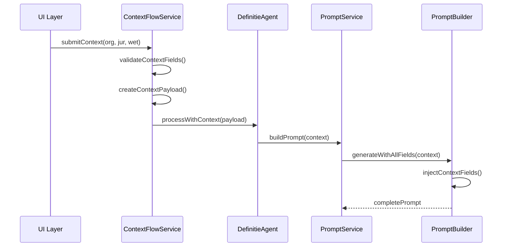
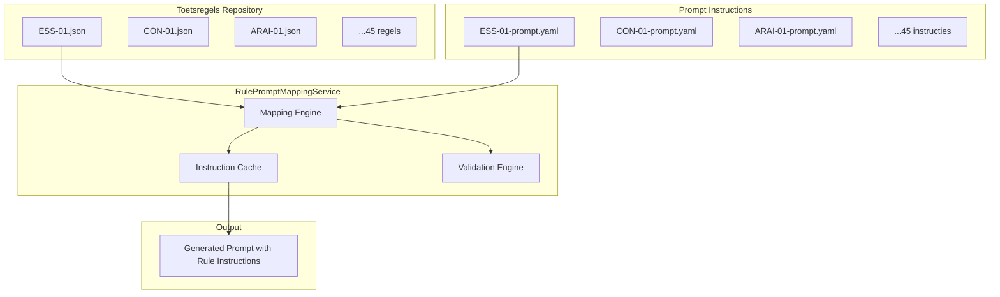
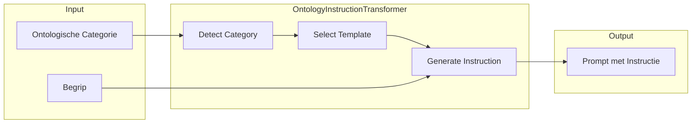
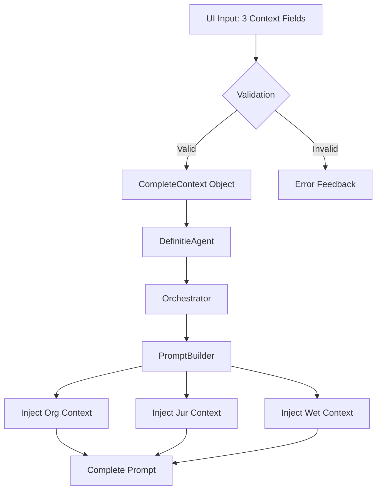

# Solution Architecture - DefinitieAgent Systeem

## Executive Summary

Deze Solution Architecture beschrijft het ontwerp voor drie kritische verbeteringen in het DefinitieAgent systeem:
1. **Context Flow Fix**: Waarborging dat alle drie contextvelden (organisatorisch, juridisch, wettelijk) volledig in de prompt terechtkomen
2. **RulePromptMappingService**: Een nieuwe service voor centraal beheer van toetsregel-naar-prompt instructie mappings
3. **Ontologie Instructie Flow**: Correctie van de ontologische categorie verwerking van vraag naar instructie

## Context & Scope

### Huidige Problemen
- **Context Verlies**: Alleen organisatorische context wordt momenteel correct doorgegeven naar de prompt
- **Toetsregel Management**: 45-46 toetsregels hebben geen individuele prompt instructies
- **Ontologie Fout**: Ontologische categorie wordt als vraag in plaats van instructie verwerkt

### Betrokken Componenten
- UI Layer (context_selector.py)
- Orchestration Layer (definitie_agent.py, definition_orchestrator_v2.py)
- Prompt Services (prompt_service_v2.py, modular_prompt_builder.py)
- Toetsregels Module (/toetsregels/regels/*.json)

## Architecture Decisions

### AD-1: Context Flow Architectuur
**Besluit**: Implementeer een ContextFlowService die alle drie contextvelden expliciet beheert en doorgeeft

**Rationale**:
- Garandeert volledigheid van context informatie
- Maakt debugging van context verlies mogelijk
- Sluit aan bij NORA principe van expliciete data flows

### AD-2: RulePromptMappingService Design
**Besluit**: Centralized service met JSON/YAML configuratie per toetsregel

**Rationale**:
- Schaalbaarheid voor 45+ regels
- Versionering van prompt instructies
- Compliance met GEMMA configuratie principes

### AD-3: Ontologie als Instructie
**Besluit**: Transform ontologische categorie naar instructie template in prompt builder

**Rationale**:
- Voorkomt verwarring in AI model
- Verhoogt kwaliteit van gegenereerde definities
- Alignment met ASTRA richtlijnen voor begripsdefiniëring

## Components/Design

### 1. Context Flow Architecture



#### ContextFlowService Interface
```python
@dataclass
class CompleteContext:
    """Volledig context object met alle drie velden"""
    organisatorische_context: list[str]
    juridische_context: list[str]
    wettelijke_basis: list[str]
    metadata: dict[str, Any]
    validation_status: ContextValidationStatus

class ContextFlowService:
    """Service voor waarborging complete context doorgifte"""

    async def capture_context(
        self,
        ui_input: dict[str, Any]
    ) -> CompleteContext:
        """Capture en valideer alle context velden"""

    async def inject_into_prompt(
        self,
        context: CompleteContext,
        prompt_template: str
    ) -> str:
        """Injecteer alle context velden in prompt"""

    def audit_context_flow(
        self,
        context: CompleteContext
    ) -> ContextAuditReport:
        """Audit trail voor context doorgifte"""
```

### 2. RulePromptMappingService



#### Service Interface
```python
@dataclass
class RulePromptInstruction:
    """Prompt instructie voor een toetsregel"""
    rule_id: str
    instruction_text: str
    examples: list[str]
    priority: int
    context_specific: bool
    version: str

class RulePromptMappingService:
    """Service voor toetsregel naar prompt instructie mapping"""

    def __init__(self, config_path: str = "/config/prompt-instructions/"):
        self.instruction_repository = PromptInstructionRepository(config_path)
        self.cache = InstructionCache()

    async def get_instructions_for_rules(
        self,
        rule_ids: list[str],
        context: CompleteContext
    ) -> list[RulePromptInstruction]:
        """Haal prompt instructies op voor gegeven regels"""

    async def generate_rule_section(
        self,
        applicable_rules: list[str],
        context: CompleteContext
    ) -> str:
        """Genereer complete regel sectie voor prompt"""

    def update_instruction(
        self,
        rule_id: str,
        new_instruction: RulePromptInstruction
    ) -> bool:
        """Update prompt instructie voor regel"""
```

#### Prompt Instruction Configuration (YAML)
```yaml
# /config/prompt-instructions/ESS-01-prompt.yaml
rule_id: ESS-01
version: "2.0"
instruction:
  primary: |
    Zorg ervoor dat de definitie beschrijft WAT het begrip is,
    niet WAARVOOR het gebruikt wordt. Vermijd doelgerichte
    formuleringen zoals "om te", "bedoeld voor" of "met als doel".

  examples:
    correct:
      - "sanctie: maatregel die volgt op normovertreding"
      - "meldpunt: instantie die meldingen registreert"
    incorrect:
      - "sanctie: maatregel om gedrag te beïnvloeden"
      - "meldpunt: instantie om meldingen te verwerken"

  enforcement_level: strict
  context_overrides:
    - context: ["DJI", "Strafrecht"]
      additional: "In DJI context extra aandacht voor uitvoeringsaspecten"
```

### 3. Ontologie Instructie Architecture



#### OntologyInstructionTransformer
```python
class OntologyInstructionTransformer:
    """Transform ontologische categorie naar instructie"""

    CATEGORY_INSTRUCTIONS = {
        "Object": """
        INSTRUCTIE: Definieer dit begrip als een OBJECT.
        Focus op: fysieke of conceptuele eigenschappen, kenmerken,
        identificeerbare attributen. Het begrip moet een zelfstandig
        bestaand iets zijn dat je kunt aanwijzen of beschrijven.
        """,

        "Proces": """
        INSTRUCTIE: Definieer dit begrip als een PROCES.
        Focus op: opeenvolging van activiteiten, transformatie,
        begin- en eindpunt, stappen of fasen. Beschrijf de dynamiek
        en verandering over tijd.
        """,

        "Actor": """
        INSTRUCTIE: Definieer dit begrip als een ACTOR.
        Focus op: rol, verantwoordelijkheden, bevoegdheden,
        handelingsbekwaamheid. Beschrijf wie of wat handelingen
        kan verrichten binnen het juridische domein.
        """
    }

    async def transform_to_instruction(
        self,
        category: str,
        begrip: str,
        context: CompleteContext
    ) -> str:
        """Transform categorie naar concrete instructie"""

        base_instruction = self.CATEGORY_INSTRUCTIONS.get(
            category,
            self._get_default_instruction()
        )

        # Context-specific refinement
        refined = await self._refine_for_context(
            base_instruction,
            context
        )

        # Inject begrip
        return refined.replace("{BEGRIP}", begrip)
```

## Integration Points

### 1. UI → ContextFlowService
- Aanpassing `context_selector.py`:
```python
def _render_manual_selector(self):
    # ... existing code ...

    # NEW: Explicit context collection
    complete_context = {
        "organisatorische_context": selected_org,
        "juridische_context": selected_jur,  # FIX: Now included
        "wettelijke_basis": selected_wet,     # FIX: Now included
        "metadata": {
            "voorsteller": voorsteller,
            "ketenpartners": ketenpartners
        }
    }

    # Validate completeness
    context_service = ContextFlowService()
    validated = context_service.validate_context(complete_context)

    return validated
```

### 2. DefinitieAgent → RulePromptMappingService
```python
class DefinitieAgent:
    def __init__(self):
        self.rule_mapping_service = RulePromptMappingService()

    async def generate_definition(self, request):
        # Get applicable rules
        applicable_rules = await self._determine_rules(request)

        # Get prompt instructions
        instructions = await self.rule_mapping_service.get_instructions_for_rules(
            applicable_rules,
            request.context
        )

        # Build enhanced prompt
        prompt = await self._build_prompt_with_instructions(
            request,
            instructions
        )
```

### 3. PromptService → OntologyInstructionTransformer
```python
class PromptServiceV2:
    async def build_generation_prompt(self, request):
        # ... existing code ...

        # NEW: Transform ontology to instruction
        if request.ontologische_categorie:
            transformer = OntologyInstructionTransformer()
            ontology_instruction = await transformer.transform_to_instruction(
                request.ontologische_categorie,
                request.begrip,
                enriched_context
            )

            # Inject as instruction, not question
            prompt_sections.insert(0, ontology_instruction)  # At beginning
```

## Data Flow Diagrams

### Complete Context Flow


## Quality Assurance

### Context Flow Testing
```python
class ContextFlowTest:
    """Test complete context doorgifte"""

    def test_all_fields_present_in_prompt(self):
        context = CompleteContext(
            organisatorische_context=["DJI", "OM"],
            juridische_context=["Strafrecht"],
            wettelijke_basis=["WvSv", "WvSr"]
        )

        prompt = service.generate_prompt(context)

        assert "DJI" in prompt
        assert "OM" in prompt
        assert "Strafrecht" in prompt
        assert "WvSv" in prompt
        assert "WvSr" in prompt
```

### Rule Mapping Validation
```python
def validate_rule_coverage():
    """Ensure all rules have prompt instructions"""
    all_rules = load_all_toetsregels()

    for rule in all_rules:
        instruction = mapping_service.get_instruction(rule.id)
        assert instruction is not None
        assert instruction.version is not None
        assert len(instruction.instruction_text) > 50
```

## Performance Requirements

- Context flow latency: < 50ms
- Rule mapping lookup: < 10ms per rule
- Ontology transformation: < 5ms
- Total prompt generation: < 500ms
- Cache hit ratio: > 90% for rule instructions

## Security & Compliance

### NORA Compliance
- ✅ Expliciete data flows (context traceability)
- ✅ Configureerbare business rules (toetsregels)
- ✅ Audit trail voor context verwerking

### BIO Requirements
- Logging van alle context transformaties
- Encryptie van gevoelige context data
- Role-based access voor regel configuratie

### GEMMA Alignment
- Herbruikbare service componenten
- Configuratie-gedreven regel management
- Standaard interfaces voor integratie

## Migration Strategy

### Phase 1: Context Flow Fix (Week 1)
1. Implement ContextFlowService
2. Update UI context collection
3. Modify DefinitieAgent context handling
4. Test all three fields propagation

### Phase 2: Rule Mapping Service (Week 2-3)
1. Create YAML configurations for all 45 rules
2. Implement RulePromptMappingService
3. Integrate with existing prompt builder
4. Validate instruction quality

### Phase 3: Ontology Fix (Week 4)
1. Implement OntologyInstructionTransformer
2. Update PromptServiceV2
3. Test instruction vs question format
4. Measure definition quality improvement

## Risks & Mitigations

| Risk | Impact | Probability | Mitigation |
|------|--------|-------------|------------|
| Context data loss during migration | High | Medium | Implement parallel running with validation |
| Rule instruction quality | High | Low | Expert review of all 45 instructions |
| Performance degradation | Medium | Low | Implement caching layer |
| Backwards compatibility | High | Medium | Feature flags for gradual rollout |

## Success Criteria

1. **Context Completeness**: 100% of context fields present in prompts
2. **Rule Coverage**: All 45-46 toetsregels have prompt instructions
3. **Ontology Accuracy**: 95% correct category-based definitions
4. **Performance**: No degradation vs current system
5. **Quality**: 20% improvement in definition validation scores

## Technical Implementation Details

### Problem Analysis: Context Field Loss

#### Current Data Flow Issues
Na analyse van de code blijkt het probleem te zitten in de mapping tussen UI en de GenerationRequest:

1. **UI Layer** (`context_selector.py`):
   - Verzamelt correct alle drie velden: `organisatorische_context`, `juridische_context`, `wettelijke_basis`
   - Retourneert complete dictionary met alle velden

2. **DefinitieAgent** (`definitie_agent.py`):
   - Ontvangt `GenerationContext` met alle drie velden
   - PROBLEEM: Bij conversie naar `GenerationRequest` (regel 106-126):
     - `juridische_context` wordt gemapped naar `domein` (legacy field)
     - Nieuwe velden worden toegevoegd maar niet consistent gebruikt
     - Er is dubbele mapping wat verwarring veroorzaakt

3. **Context Manager** (`definition_generator_context.py`):
   - `_build_base_context()` gebruikt NIET de nieuwe velden
   - Parseert alleen `request.context` string (regel 255-256)
   - Mist expliciete handling van `juridische_context` en `wettelijke_basis`

#### Root Cause
```python
# PROBLEEM in definition_generator_context.py regel 237-258:
def _build_base_context(self, request: GenerationRequest) -> dict[str, list[str]]:
    context = {
        "organisatorisch": [],
        "juridisch": [],  # WORDT NIET GEVULD MET request.juridische_context
        "wettelijk": [],  # WORDT NIET GEVULD MET request.wettelijke_basis
    }

    # Alleen deze velden worden gebruikt:
    if request.organisatie:
        context["organisatorisch"].append(request.organisatie)
    if request.domein:
        context["domein"].append(request.domein)
```

### Concrete Fix Implementation

#### Fix 1: Update HybridContextManager
```python
# definition_generator_context.py - Line 237
def _build_base_context(self, request: GenerationRequest) -> dict[str, list[str]]:
    """Bouw basis context dictionary met ALLE context velden."""
    context = {
        "organisatorisch": [],
        "juridisch": [],
        "wettelijk": [],
        "domein": [],
        "technisch": [],
        "historisch": [],
    }

    # FIX: Gebruik de nieuwe rijke context velden
    if hasattr(request, 'organisatorische_context') and request.organisatorische_context:
        context["organisatorisch"].extend(request.organisatorische_context)
    elif request.organisatie:
        context["organisatorisch"].append(request.organisatie)

    if hasattr(request, 'juridische_context') and request.juridische_context:
        context["juridisch"].extend(request.juridische_context)
    elif request.domein:
        context["domein"].append(request.domein)

    if hasattr(request, 'wettelijke_basis') and request.wettelijke_basis:
        context["wettelijk"].extend(request.wettelijke_basis)

    # Parse aanvullende context string
    if request.context:
        self._parse_context_string(request.context, context)

    return context
```

## References

- NORA 3.0 Principes: https://www.noraonline.nl
- GEMMA Referentiearchitectuur: https://www.gemmaonline.nl
- ASTRA Definitierichtlijnen: https://www.astraonline.nl
- BIO Baseline Informatiebeveiliging: https://www.bio-overheid.nl
- Interne documentatie: /docs/architectuur/SOLUTION_ARCHITECTURE.md
