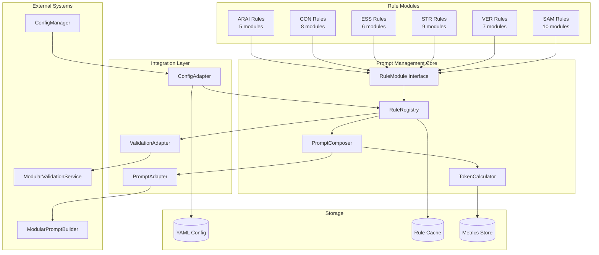
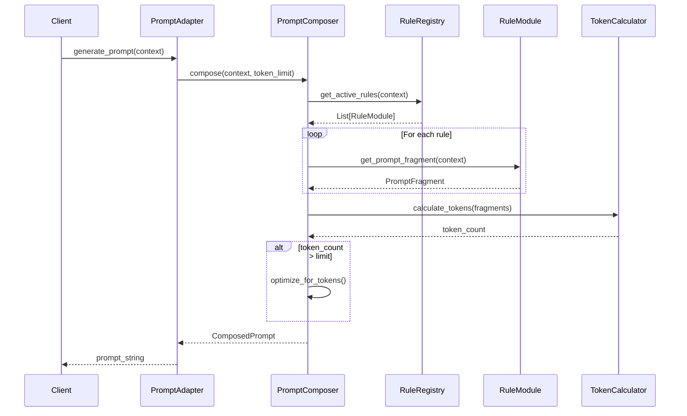
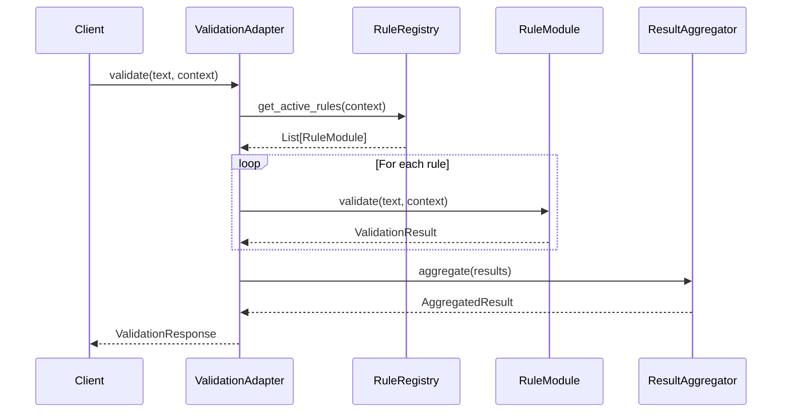

# SA - Prompt Management Systeem voor Definitie-app

## Executive Summary

Dit document beschrijft de Solution Architecture voor het nieuwe Prompt Management Systeem. Het systeem implementeert een modulaire architectuur waarbij elke validatieregel zijn eigen prompt-instructie beheert, met dynamische compositie op basis van context en configuratie.

## Context & Scope

Het systeem integreert met de bestaande Definitie-app architectuur en vervangt de huidige hardcoded prompt generatie met een flexibel, testbaar en onderhoudbaar alternatief. De scope omvat alle 45 bestaande validatieregels plus ruimte voor uitbreiding.

## Architecture Decisions

### SAD1: Rule Module Structure

**Besluit**: Elke regel wordt geïmplementeerd als Python module met gestandaardiseerde interface.

```python
class RuleModule(Protocol):
    rule_id: str
    category: str
    priority: Priority

    def validate(self, text: str, context: Context) -> ValidationResult
    def get_prompt_fragment(self, context: Context) -> PromptFragment
    def get_metadata(self) -> RuleMetadata
```

**Rationale**: Protocol-based design voor type safety met flexibiliteit

### SAD2: Prompt Fragment Composition

**Besluit**: Gebruik van template-based prompt fragments met variable substitution.

**Rationale**:
- Herbruikbare templates
- Versioneerbaar in Git
- Makkelijk te reviewen door domein experts

### SAD3: Configuration-Driven Activation

**Besluit**: YAML-based configuratie voor regel activatie en parameters.

**Rationale**:
- Geen code changes voor configuratie wijzigingen
- Environment-specific overrides mogelijk
- Audit trail via Git

## Components/Design

### Component Diagram



### Detailed Component Specifications

#### RuleRegistry

```python
@dataclass
class RuleRegistry:
    """Central registry for all validation rules."""

    rules: Dict[str, RuleModule]
    config: RuleConfiguration
    cache: RuleCache

    async def load_rules(self, path: Path) -> None:
        """Dynamically load rule modules from filesystem."""

    def get_rule(self, rule_id: str) -> Optional[RuleModule]:
        """Get specific rule by ID."""

    def get_active_rules(self, context: Context) -> List[RuleModule]:
        """Get all active rules for given context."""

    def register_rule(self, rule: RuleModule) -> None:
        """Register new rule module."""
```

#### PromptComposer

```python
@dataclass
class PromptComposer:
    """Composes prompts from rule fragments."""

    registry: RuleRegistry
    calculator: TokenCalculator
    optimizer: PromptOptimizer

    def compose(
        self,
        context: Context,
        token_limit: int = 8000
    ) -> ComposedPrompt:
        """Compose optimized prompt for context."""

    def get_fragments(
        self,
        rules: List[RuleModule],
        context: Context
    ) -> List[PromptFragment]:
        """Get prompt fragments from rules."""

    def optimize_for_tokens(
        self,
        fragments: List[PromptFragment],
        limit: int
    ) -> List[PromptFragment]:
        """Optimize fragments for token limit."""
```

#### RuleModule Example - ARAI-01

```python
class ARAI01_GeenCirculaireDefinitie(BaseRuleModule):
    """Regel: Definitie mag niet circulair zijn."""

    rule_id = "ARAI-01"
    category = "ARAI"
    priority = Priority.HIGH

    def __init__(self):
        self.prompt_template = """
## ARAI-01: Vermijd Circulariteit
- Het begrip '{term}' mag NIET voorkomen in de definitie
- Gebruik geen synoniemen die naar hetzelfde begrip verwijzen
- Voorkom indirecte circulariteit via andere begrippen
        """

    def validate(self, text: str, context: Context) -> ValidationResult:
        term = context.get("begrip", "")
        if self._contains_term(text, term):
            return ValidationResult(
                passed=False,
                score=0.0,
                message=f"Definitie bevat het te definiëren begrip '{term}'"
            )
        return ValidationResult(passed=True, score=1.0)

    def get_prompt_fragment(self, context: Context) -> PromptFragment:
        return PromptFragment(
            content=self.prompt_template.format(term=context.get("begrip", "")),
            tokens=self._calculate_tokens(),
            priority=self.priority
        )
```

### Data Flow Diagrams

#### Prompt Generation Flow



#### Validation Flow



### API Specifications

#### REST API Endpoints

```yaml
openapi: 3.1.0
info:
  title: Prompt Management API
  version: 1.0.0

paths:
  /api/v1/prompts/generate:
    post:
      summary: Generate optimized prompt
      requestBody:
        required: true
        content:
          application/json:
            schema:
              type: object
              properties:
                context:
                  $ref: '#/components/schemas/Context'
                token_limit:
                  type: integer
                  default: 8000
                rules:
                  type: array
                  items:
                    type: string
                  description: Specific rules to include (optional)
      responses:
        '200':
          description: Generated prompt
          content:
            application/json:
              schema:
                $ref: '#/components/schemas/ComposedPrompt'

  /api/v1/rules:
    get:
      summary: List all available rules
      parameters:
        - name: category
          in: query
          schema:
            type: string
            enum: [ARAI, CON, ESS, STR, VER, SAM]
        - name: active
          in: query
          schema:
            type: boolean
      responses:
        '200':
          description: List of rules
          content:
            application/json:
              schema:
                type: array
                items:
                  $ref: '#/components/schemas/RuleInfo'

  /api/v1/rules/{ruleId}:
    get:
      summary: Get specific rule details
      parameters:
        - name: ruleId
          in: path
          required: true
          schema:
            type: string
      responses:
        '200':
          description: Rule details
          content:
            application/json:
              schema:
                $ref: '#/components/schemas/RuleDetail'

  /api/v1/validation/execute:
    post:
      summary: Execute validation with specific rules
      requestBody:
        required: true
        content:
          application/json:
            schema:
              type: object
              properties:
                text:
                  type: string
                context:
                  $ref: '#/components/schemas/Context'
                rules:
                  type: array
                  items:
                    type: string
      responses:
        '200':
          description: Validation results
          content:
            application/json:
              schema:
                $ref: '#/components/schemas/ValidationResponse'

components:
  schemas:
    Context:
      type: object
      properties:
        begrip:
          type: string
        ontologische_categorie:
          type: string
        domain:
          type: string
        profile:
          type: string
        locale:
          type: string
          default: nl_NL

    ComposedPrompt:
      type: object
      properties:
        prompt:
          type: string
        metadata:
          type: object
          properties:
            token_count:
              type: integer
            rules_included:
              type: array
              items:
                type: string
            optimization_applied:
              type: boolean
            generation_time_ms:
              type: integer

    RuleInfo:
      type: object
      properties:
        id:
          type: string
        category:
          type: string
        name:
          type: string
        priority:
          type: string
        active:
          type: boolean

    ValidationResponse:
      type: object
      properties:
        overall_score:
          type: number
        is_acceptable:
          type: boolean
        violations:
          type: array
          items:
            $ref: '#/components/schemas/Violation'
        passed_rules:
          type: array
          items:
            type: string
```

### Configuration Schema

```yaml
# config/prompt_management.yaml
prompt_management:
  enabled: true
  version: "1.0.0"

  token_limits:
    default: 8000
    maximum: 12000
    reserve_for_response: 2000

  rule_categories:
    ARAI:
      enabled: true
      priority_boost: 1.2
      rules:
        - id: ARAI-01
          enabled: true
          weight: 1.0
          prompt_variant: "standard"
        - id: ARAI-02
          enabled: true
          weight: 0.9
          prompt_variant: "detailed"

    CON:
      enabled: true
      priority_boost: 1.0
      rules:
        - id: CON-01
          enabled: true
          weight: 0.8

    ESS:
      enabled: true
      priority_boost: 1.1

    STR:
      enabled: true
      priority_boost: 0.9

  optimization:
    strategy: "priority_weighted"
    min_rules_per_category: 2
    preserve_high_priority: true

  caching:
    enabled: true
    ttl_seconds: 3600
    max_entries: 1000

  monitoring:
    track_token_usage: true
    log_optimization_decisions: true
    alert_on_limit_exceeded: true
```

## Standards & Compliance

### Code Standards

- **PEP 8**: Python code styling
- **Type Hints**: Full typing voor type safety
- **Docstrings**: Google style docstrings
- **Testing**: Minimum 90% code coverage

### API Standards

- **OpenAPI 3.1**: API specification
- **JSON:API**: Response format voor complex data
- **RFC 7807**: Problem Details voor errors
- **Semantic Versioning**: Voor API versioning

## Risks & Mitigations

### Technical Risks

1. **Module Loading Performance**
   - Mitigatie: Lazy loading met pre-warming optie
   - Monitoring: Track module load times

2. **Token Calculation Accuracy**
   - Mitigatie: Use tiktoken library met caching
   - Validation: Regular comparison met actual API usage

3. **Rule Conflicts**
   - Mitigatie: Automated conflict detection
   - Resolution: Priority-based ordering

## References

- [Python Protocol PEP 544](https://www.python.org/dev/peps/pep-0544/)
- [OpenAPI Specification](https://spec.openapis.org/oas/latest.html)
- [JSON:API Specification](https://jsonapi.org/)
- [tiktoken Library](https://github.com/openai/tiktoken)

---
*Versie: 1.0.0*
*Datum: 2025-09-03*
*Status: Concept*
