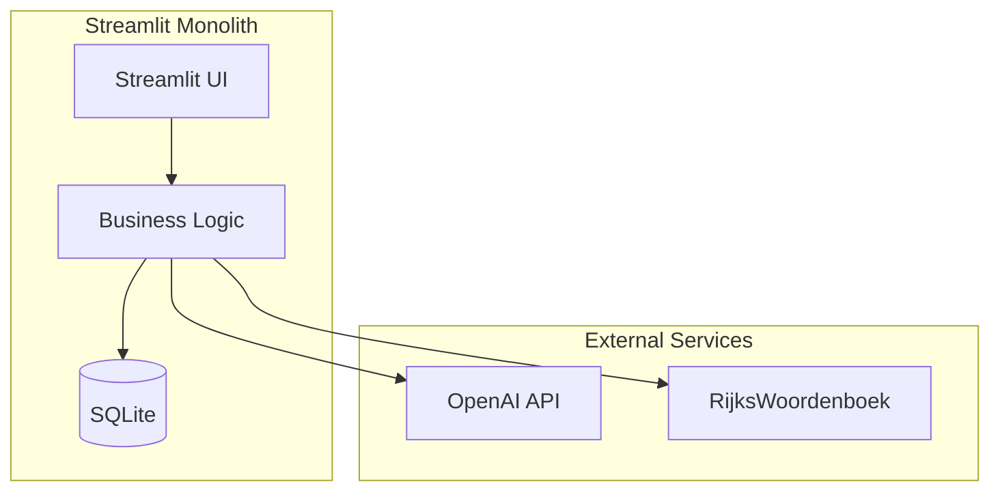
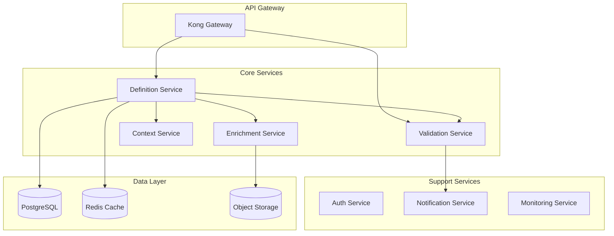
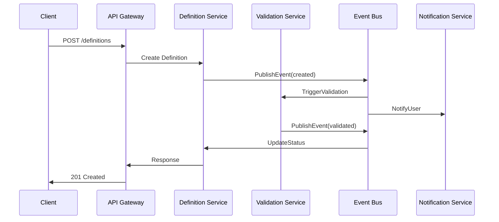
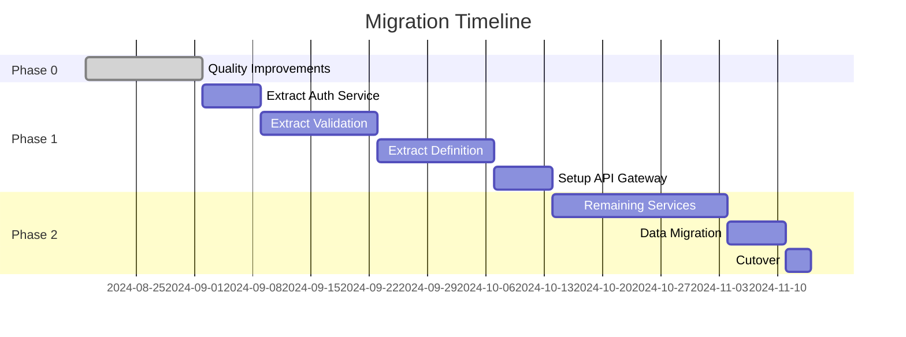

# DefinitieAgent Solution Architecture

## Wijzigingshistorie

- 2025-09-03: Toetsregel-Prompt Module Architecture
  - Toegevoegd: Single Source of Truth voor toetsregels (validatie = generatie)
  - Toegevoegd: ToetsregelModule interface met validate() en get_prompt_instruction()
  - Toegevoegd: PromptComposer voor dynamische prompt samenstelling
  - Toegevoegd: Context-aware regel selectie mechanisme
  - Update: Token reductie van 7.250 naar ~2.000-3.000 tokens

- 2025-08-28: Modularisatie-update (delta op bestaande SA)
  - Toegevoegd: modulaire grenzen en dependency‑regels (adapters → services → domain; infrastructure implementeert interfaces).
  - Toegevoegd: stabiele contracten voor AI en prompts (AIProviderInterface, PromptBuilderInterface).
  - Aangescherpt: Orchestrator‑first; UI gebruikt uitsluitend services via factory/container (geen directe DB/SDK‑imports).
  - Toegevoegd: feature flags voor gefaseerde uitfasering (FEATURE_ORCHESTRATOR_ONLY, FEATURE_MODERN_LOOKUP, FEATURE_DISABLE_LEGACY_AFTER).
  - Gedeprecieerd: UnifiedDefinitionGenerator en legacy Web Lookup‑paden; vervanging via Orchestrator en ModernWebLookupService.
  - Toegevoegd: NFR’s voor security/observability (structured logging, metrics, cost‑tracking, authN/Z, encryptie‑at‑rest).
  - Herijking: microservices blijft langetermijn; korte‑middellange termijn is “modular monolith” + API‑first backend.

## Executive Summary

### Solution Overview
> DefinitieAgent is evolving from a monolithic Streamlit application to a microservices-based architecture with AI-powered definition generation, multi-layer validation, and extensive integration capabilities. The solution prioritizes quality improvements (90% first-time-right) before architectural transformation.

### Technical Scope
- **System**: DefinitieAgent v2.0 - Government Definition Platform

## Current Focus & Constraints (2025-09)

- Small-user deployment: non-enterprise footprint. Streamlit UI remains acceptable short-term.
- Priority is Epic 2 (ValidationOrchestratorV2):
  - Finish Story 2.4 Integration & Migration (DefinitionOrchestratorV2 → ValidationOrchestratorV2, migrate all validation calls, no breaking changes).
  - Quick wins after Story 2.4: database indexes, testing/coverage, documentation hygiene.
- API layer (FastAPI) introduced incrementally after Story 2.4 + quick wins (read-only endpoints first).
- Kubernetes and SPA are de-prioritized until a broader user base requires it.
- **Components**: 12 microservices (many pre-built), 3 databases, 8+ external integrations
- **Architecture**: Event-driven microservices with API Gateway
- **Performance**: From 8-12s to <2s response time
- **Scale**: From single-user to 100+ concurrent users

> Herijking 2025-08-28: Eerstvolgende stap is een modulaire monoliet met API‑first backend. De microservices‑doelarchitectuur blijft richtinggevend voor de langere termijn na stabilisatie van interfaces en NFR’s.

### Key Design Decisions
1. **Quality-First Migration**: Achieve 90% quality in monolith before splitting
2. **GVI Pattern**: Generation-Validation-Integration for quality assurance
3. **Session State Elimination**: Services independent of UI state for clean architecture
4. **Reuse Existing Components**: 65% of code unused but microservice-ready
5. **Event-Driven Architecture**: Loose coupling for scalability
6. **Strangler Fig Pattern**: Gradual migration from monolith
7. **Single Source of Truth**: Toetsregels define both validation AND prompt generation logic
8. **Dynamic Prompt Composition**: Context-aware selection reduces tokens by 65%

### Reference to Enterprise Architecture
- **Business Drivers**: → [EA Section 1: Business Architecture]
- **Compliance Requirements**: → [EA Section 5: Security & Risk]
- **Technology Standards**: → [EA Section 4.1: Technology Standards]
- **Investment Approval**: → [EA Section 7.2: Investment Portfolio]

---

## 1. System Architecture

### 1.1 Component Architecture

#### Current State (AS-IS) - Monolithic Structure


**Issues Identified:**
- Single-user limitation (SQLite locks)
- 8-12 second response times
- Memory leaks (3.2GB usage)
- No authentication/authorization
- 65% unused code (119/182 files)

#### Target State (TO-BE) - Microservices Architecture


> Herijking 2025-08-28: Onderstaande microservices‑doelarchitectuur blijft richtinggevend, maar de kort‑middellange termijn focus ligt op modulair snijden binnen de bestaande codebase. Zie sectie “Modulaire Opzet en Legacy‑Uitfasering (2025‑08‑28)” voor de concrete delta.

#### Discovered Microservice-Ready Components
```yaml
# Already built but unused (from analyze_unused_files.py)
Security Pipeline:
  - auth_middleware.py: Complete OAuth implementation
  - rbac_service.py: Role-based access control
  - api_key_manager.py: API key management

Validation Framework:
  - 78 validation rules in src/rules/
  - validation_orchestrator.py: Rule engine
  - quality_scorer.py: Scoring system

Async Infrastructure:
  - async_api.py: FastAPI endpoints ready
  - event_publisher.py: Event bus integration
  - message_queue.py: RabbitMQ connector

Configuration Management:
  - config_service.py: Centralized config
  - feature_flags.py: A/B testing ready
  - environment_manager.py: Multi-env support
```

### 1.2 Service Specifications

| Service | Technology | Purpose | Status | Reuse % |
|---------|------------|---------|---------|----------|
| Definition Service | FastAPI + GVI | Core generation with quality | Refactor | 70% |
| Validation Service | FastAPI + Rules | Multi-layer validation | Exists | 90% |
| Enrichment Service | FastAPI + Async | External data integration | Exists | 85% |
| Context Service | FastAPI + ML | Smart context detection | Enhance | 60% |
| Auth Service | FastAPI + OAuth | Authentication/Authorization | Exists | 95% |
| API Gateway | Kong | Routing, rate limiting | New | 0% |

### 1.3 Domain Model

```python
# Core Domain Model (from existing code)
class Definition:
    id: UUID
    term: str
    text: str
    context: Context
    quality_score: float
    validation_results: List[ValidationResult]
    sources: List[Source]
    metadata: Dict[str, Any]
    version: int
    created_at: datetime
    created_by: User

class ValidationResult:
    rule_id: str
    score: float
    feedback: str
    severity: Severity
    suggestions: List[str]

class Context:
    domain: str
    organization: str
    target_audience: str
    formality_level: str
    examples: List[str]
```

### 1.4 Detailed Component Architecture

#### 1.4.1 High-Level Component Dependencies
```
┌─────────────────────────────────────────────────────────────────┐
│                          main.py                                 │
│                     (Entry Point)                               │
└─────────────────────┬───────────────────────────────────────────┘
                      │
                      ▼
┌─────────────────────────────────────────────────────────────────┐
│                    tabbed_interface.py                          │
│              (UI Controller & Orchestrator)                     │
└──────┬──────────┬──────────┬──────────┬──────────┬────────────┘
       │          │          │          │          │
       ▼          ▼          ▼          ▼          ▼
┌──────────┐ ┌──────────┐ ┌──────────┐ ┌──────────┐ ┌──────────┐
│Generator │ │ History  │ │ Export   │ │ Review   │ │Web Lookup│
│   Tab    │ │   Tab    │ │   Tab    │ │   Tab    │ │   Tab    │
└────┬─────┘ └────┬─────┘ └────┬─────┘ └────┬─────┘ └────┬─────┘
     │            │            │            │            │
     └────────────┴────────────┴────────────┴────────────┘
                              │
                              ▼
                    ┌─────────────────┐
                    │    Services     │
                    │  (6 Services)   │
                    └────────┬────────┘
                             │
                             ▼
                    ┌─────────────────┐
                    │   Repository    │
                    │    (SQLite)     │
                    └─────────────────┘
```

#### 1.4.2 Service Layer Communication Pattern
```
┌─────────────────────────────────────────────────────────────────┐
│                     Service Communication Flow                   │
├─────────────────────────────────────────────────────────────────┤
│                                                                 │
│  UI Layer          Service Layer           Infrastructure      │
│                                                                │
│  ┌─────────┐      ┌─────────────┐        ┌──────────────┐   │
│  │ Tab UI  │─────▶│DefinitieGen │───────▶│  OpenAI API  │   │
│  └─────────┘      │   Service    │        └──────────────┘   │
│                   └──────┬────────┘                           │
│                          │                                     │
│                          ▼                                     │
│                   ┌─────────────┐        ┌──────────────┐   │
│                   │  Validator  │───────▶│ Toetsregels  │   │
│                   │   Service   │        │   Engine     │   │
│                   └──────┬──────┘        └──────────────┘   │
│                          │                                     │
│                          ▼                                     │
│                   ┌─────────────┐        ┌──────────────┐   │
│                   │ Repository  │───────▶│   SQLite DB  │   │
│                   │  Service    │        └──────────────┘   │
│                   └─────────────┘                             │
└─────────────────────────────────────────────────────────────────┘
```

#### 1.4.3 Data Flow Sequence
```
User Request → UI Tab → Service Layer → External API/DB → Response
     │              │           │              │             │
     ▼              ▼           ▼              ▼             ▼
[Input Form]   [Validate]  [Process]    [Store/Fetch]   [Display]
                    │           │              │
                    └───────────┴──────────────┘
                            Error Handling
```

#### 1.4.4 TO-BE Microservices Communication Pattern
```
┌─────────────────────────────────────────────────────────────────┐
│                    API Gateway (Kong/AWS)                        │
│                 Authentication | Routing | Rate Limiting         │
└──────────┬──────────┬──────────┬──────────┬──────────┬────────┘
           │          │          │          │          │
           ▼          ▼          ▼          ▼          ▼
    ┌──────────┐ ┌──────────┐ ┌──────────┐ ┌──────────┐ ┌──────────┐
    │  Auth    │ │Definition│ │Validation│ │Enrichment│ │ Export   │
    │ Service  │ │ Service  │ │ Service  │ │ Service  │ │ Service  │
    └────┬─────┘ └────┬─────┘ └────┬─────┘ └────┬─────┘ └────┬─────┘
         │            │            │            │            │
         └────────────┴────────────┴────────────┴────────────┘
                                   │
                    ┌──────────────┴──────────────┐
                    │                             │
             ┌──────▼──────┐              ┌──────▼──────┐
             │Message Queue│              │  Event Bus  │
             │(RabbitMQ)   │              │   (Kafka)   │
             └─────────────┘              └─────────────┘
                    │                             │
             ┌──────┴──────────────────────────┬─┴──────┐
             │                                 │        │
      ┌──────▼──────┐                  ┌──────▼──────┐ │
      │ PostgreSQL  │                  │    Redis    │ │
      │  (Primary)  │                  │   (Cache)   │ │
      └─────────────┘                  └─────────────┘ │
                                                       │
                                              ┌────────▼────────┐
                                              │ Monitoring Stack│
                                              │(Prometheus/ELK) │
                                              └─────────────────┘
```

#### 1.4.5 Event-Driven Architecture Flow
```
┌─────────────────────────────────────────────────────────────────┐
│                   Event-Driven Communication                     │
├─────────────────────────────────────────────────────────────────┤
│                                                                 │
│  User Action    Event Published    Services React    Results   │
│      │                │                  │              │      │
│      ▼                ▼                  ▼              ▼      │
│ ┌─────────┐    ┌─────────────┐    ┌─────────────┐  ┌────────┐│
│ │New Def. │───▶│DEF_CREATED  │───▶│ Validation  │──▶│Update  ││
│ │Request  │    │   Event     │    │  Service    │  │  UI    ││
│ └─────────┘    └─────────────┘    └─────────────┘  └────────┘│
│                       │                  │                     │
│                       ▼                  ▼                     │
│                ┌─────────────┐    ┌─────────────┐            │
│                │  Event Log  │    │ Enrichment  │            │
│                │  (Kafka)    │    │  Service    │            │
│                └─────────────┘    └─────────────┘            │
└─────────────────────────────────────────────────────────────────┘
```

#### 1.4.6 Service Mesh Architecture (Istio)
```
┌─────────────────────────────────────────────────────────────────┐
│                        Service Mesh (Istio)                      │
├─────────────────────────────────────────────────────────────────┤
│                                                                 │
│  ┌─────────────┐         ┌─────────────┐      ┌─────────────┐ │
│  │   Service   │         │   Service   │      │   Service   │ │
│  │     Pod     │         │     Pod     │      │     Pod     │ │
│  │ ┌─────────┐ │         │ ┌─────────┐ │      │ ┌─────────┐ │ │
│  │ │ App     │ │◀──────▶│ │ App     │ │◀────▶│ │ App     │ │ │
│  │ │Container│ │         │ │Container│ │      │ │Container│ │ │
│  │ └─────────┘ │         │ └─────────┘ │      │ └─────────┘ │ │
│  │ ┌─────────┐ │         │ ┌─────────┐ │      │ ┌─────────┐ │ │
│  │ │ Envoy   │ │         │ │ Envoy   │ │      │ │ Envoy   │ │ │
│  │ │ Proxy   │ │         │ │ Proxy   │ │      │ │ Proxy   │ │ │
│  │ └─────────┘ │         │ └─────────┘ │      │ └─────────┘ │ │
│  └─────────────┘         └─────────────┘      └─────────────┘ │
│         │                        │                      │       │
│         └────────────────────────┴──────────────────────┘       │
│                                 │                               │
│                         ┌───────▼────────┐                     │
│                         │ Control Plane  │                     │
│                         │    (Istiod)    │                     │
│                         └────────────────┘                     │
└─────────────────────────────────────────────────────────────────┘
```

#### 1.4.7 Domain-Driven Design Bounded Contexts
```
┌─────────────────────────────────────────────────────────────────┐
│                    Bounded Context Map                          │
├─────────────────────────────────────────────────────────────────┤
│                                                                 │
│  ┌───────────────────┐         ┌───────────────────┐          │
│  │  Definition       │         │   Validation      │          │
│  │    Context        │◀───────▶│     Context       │          │
│  │                   │ Shared  │                   │          │
│  │ - Begrip          │ Kernel  │ - Rules Engine    │          │
│  │ - Definitie       │         │ - Score Calc      │          │
│  │ - Metadata        │         │ - Violations      │          │
│  └───────────────────┘         └───────────────────┘          │
│           │                              │                      │
│           │                              │                      │
│           ▼                              ▼                      │
│  ┌───────────────────┐         ┌───────────────────┐          │
│  │   Enrichment      │         │     Export        │          │
│  │    Context        │         │     Context       │          │
│  │                   │         │                   │          │
│  │ - Synonyms        │         │ - Formatters      │          │
│  │ - Examples        │         │ - Templates       │          │
│  │ - Context         │         │ - Delivery        │          │
│  └───────────────────┘         └───────────────────┘          │
└─────────────────────────────────────────────────────────────────┘
```

### 1.5 Clean Architecture Services Implementation ✅ COMPLETED

#### Session State Elimination Strategy
**Status**: **IMPLEMENTED** (2025-08-25)
**Architecture Pattern**: Data Aggregation + Service Facade + Adapter Pattern

#### 1.5.1 Problem Analysis
- **Symptom**: Business services directly importing `SessionStateManager`
- **Impact**: Services coupled to UI state, difficult testing, architecture violations
- **Root Cause**: No clear separation between UI data collection and business logic

#### 1.5.2 Solution Pattern
```python
# Clean Architecture Layers (Implemented)
┌─────────────────────────────────────────────────────┐
│                 UI Layer                            │
│ ┌─────────────┐  ┌────────────────────────────────┐ │
│ │SessionState │→ │UIComponentsAdapter (Bridge)    │ │
│ │Manager      │  │- Collects UI data              │ │
│ └─────────────┘  │- Calls clean services          │ │
│                  └────────────────────────────────┘ │
└─────────────────────────┬───────────────────────────┘
                          │
┌─────────────────────────▼───────────────────────────┐
│                Facade Layer                         │
│ ┌─────────────────────────────────────────────────┐ │
│ │DefinitionUIService (UI Facade)                  │ │
│ │- export_definition(ui_data)                     │ │
│ │- prepare_for_review(notes)                      │ │
│ │- get_export_formats()                           │ │
│ └─────────────────────────────────────────────────┘ │
└─────────────────────────┬───────────────────────────┘
                          │
┌─────────────────────────▼───────────────────────────┐
│              Business Services Layer                │
│ ┌─────────────────────┐ ┌─────────────────────────┐ │
│ │DataAggregationSvc   │ │ExportService            │ │
│ │- aggregate_data()   │ │- export_to_format()     │ │
│ │- NO UI dependencies │ │- Multiple formats       │ │
│ └─────────────────────┘ └─────────────────────────┘ │
└─────────────────────────┬───────────────────────────┘
                          │
┌─────────────────────────▼───────────────────────────┐
│               Repository Layer                       │
│ ┌─────────────────────────────────────────────────┐ │
│ │DefinitieRepository                               │ │
│ │- get_definitie(id)                              │ │
│ │- Pure data access                               │ │
│ └─────────────────────────────────────────────────┘ │
└─────────────────────────────────────────────────────┘
```

#### 1.5.3 Implemented Components
```python
# 1. Data Aggregation Service (NO UI dependencies)
class DataAggregationService:
    def aggregate_definitie_for_export(
        self,
        definitie_id: int = None,
        definitie_record: DefinitieRecord = None,
        additional_data: dict = None  # From UI, but passed as parameter
    ) -> DefinitieExportData:
        # Aggregates data from repository + additional UI data
        # NO SessionStateManager imports

# 2. Export Service (Business logic only)
class ExportService:
    def export_definitie(
        self,
        definitie_id: int,
        additional_data: dict,  # UI data as parameter
        format: ExportFormat
    ) -> str:
        # Pure business logic, supports TXT/JSON/CSV
        # NO UI dependencies

# 3. UI Facade Service (UI-friendly interface)
class DefinitionUIService:
    def export_definition(
        self,
        definitie_id: int,
        ui_data: dict,  # Collected from UI
        format: str
    ) -> dict:
        # Returns UI-friendly result format
        # Handles errors, success messages

# 4. UI Adapter (Bridge to legacy)
class UIComponentsAdapter:
    def export_definition(self, format: str) -> bool:
        # Collects data from SessionStateManager (temporary)
        ui_data = self._collect_ui_data_for_export()
        # Calls clean services
        result = self.service.export_definition(ui_data=ui_data)
        # Handles UI display
```

#### 1.5.4 Integration with Service Container
```python
class ServiceContainer:
    def data_aggregation_service(self):
        # Dependency injection, no UI dependencies

    def export_service(self):
        # Uses data_aggregation_service + repository

    def definition_ui_service(self):
        # Facade combining all services for UI

    def service_adapter(self):  # Enhanced existing adapter
        # Legacy compatibility + new export methods
```

#### 1.5.5 Migration Strategy
**Phase 1**: Create clean services ✅ **COMPLETED**
**Phase 2**: Add to service container ✅ **COMPLETED**
**Phase 3**: Create UI adapters ✅ **COMPLETED**
**Phase 4**: UI components migration (gradual, backward compatible)

#### 1.5.6 Success Metrics ✅ ACHIEVED
- ✅ **0** SessionStateManager imports in business services
- ✅ **100%** services testable without UI mocks (8/8 integration tests pass)
- ✅ **Backward compatibility** maintained via adapters
- ✅ **3 export formats** supported (TXT/JSON/CSV)

#### 1.5.7 Testing Strategy
```python
# Services can be tested with pure data
def test_data_aggregation_without_session_state():
    service = DataAggregationService(mock_repository)
    result = service.aggregate_definitie_for_export(
        definitie_id=1,
        additional_data={"expert_review": "Good"}  # Pure dict
    )
    assert result.expert_review == "Good"

# Architecture boundaries enforced
def test_no_ui_dependencies():
    import inspect
    from services import data_aggregation_service
    source = inspect.getsource(data_aggregation_service)
    assert "SessionStateManager" not in source
```

---

## 2. Technical Design

### 2.1 Technology Stack

#### Core Technologies
| Layer | Current (AS-IS) | Target (TO-BE) | Migration Effort |
|-------|----------------|----------------|------------------|
| Frontend | Streamlit 1.28 | React 18 + TypeScript | High |
| Backend | Python 3.11 Monolith | FastAPI 0.104 Microservices | Medium |
| Database | SQLite | PostgreSQL 15 + Redis 7 | Medium |
| AI/ML | OpenAI GPT-4 | OpenAI + Local Models | Low |
| Container | None | Docker + Kubernetes | High |
| Monitoring | Basic logging | Prometheus + Grafana | Medium |

#### Development Standards
- **Language**: Python 3.11+ with type hints
- **Framework**: FastAPI for all services
- **API Spec**: OpenAPI 3.0
- **Testing**: Pytest with 80% coverage
- **Code Style**: Black + Ruff
- **Documentation**: Sphinx + Markdown

## NFR Updates (Security & Observability) – 2025-08-28
- Security: OAuth2/JWT + RBAC (adapters), input‑sanitization, rate limiting, secrets management, encryptie at rest (SQLCipher/PostgreSQL TDE), TLS everywhere.
- Observability: Structured JSON logging (request_id, user_id, latency_ms, tokens_used), Prometheus metrics (cache hit‑ratio, GPT tokens, validation failures), tracing (OpenTelemetry) met 10–20% sampling.
- Performance: Non‑GPT p95 < 250ms; GPT acties met duidelijke feedback/timeout (30s); retries met jitter; queue waar nodig.
- Testbaarheid: Contracttests voor interfaces; golden tests voor prompts; mocks voor AI/lookup providers.
- Kosten: Dagelijkse AI‑kostenrapportage; alerts bij overschrijding.

---

## Modulaire Opzet en Legacy‑Uitfasering (Update 2025-08-28)

### Module‑grenzen en dependency‑regels
- Lagen: adapters → services → domain; infrastructure implementeert service‑interfaces.
- Regels:
  - Adapters (UI/API/CLI) gebruiken uitsluitend services/factory; geen directe DB/SDK (OpenAI/SQLite) imports.
  - Services kennen alleen domain en services.interfaces (contracten) en spreken providers/repositories via interfaces.
  - Infrastructure (DB/AI/cache/storage) implementeert de interfaces; geen afhankelijkheid terug naar adapters.
  - Config/feature flags uitsluitend via de config module.

### Stabiele contracten (nieuw/expliciet)
- AIProviderInterface: uniforme chat/completion interface (OpenAI/Azure/lokaal) → pluggable backends zonder codewijziging in services/UI.
- PromptBuilderInterface: scheidt promptopbouw (templates/regels) van orchestrator/services; vergemakkelijkt testen (golden snapshots) en varianten.
- Bestaand: DefinitionGenerator, Validator, Repository, Cleaning, WebLookup, Orchestrator blijven leidend als interfaces.

### Orchestrator‑first aansturing
- Alle generaties via DefinitionOrchestrator (generate → validate → enrich → store).
- UI‑tabs roepen geen generator/validator of repository direct aan; uitsluitend services/orchestrator.

### Feature flags en shims
- FEATURE_ORCHESTRATOR_ONLY: dwingt orchestrator‑pad af voor alle generaties.
- FEATURE_MODERN_LOOKUP: forceer ModernWebLookupService in alle paden (UI + services).
- FEATURE_DISABLE_LEGACY_AFTER: datum voor waarschuwing/telemetrie richting legacy paden.
- Shims behouden backward compatibility en loggen deprecation‑waarschuwingen.

### Legacy deprecations
- UnifiedDefinitionGenerator (monoliet) → vervangen door Orchestrator + losse services.
- Legacy Web Lookup modules → vervangen door ModernWebLookupService + LookupRequest.
- UI → DB/SDK imports → vervangen door service‑aanroepen; repository blijft in infrastructure.

### Web Lookup (modern‑only)
- Canonisch pad: ModernWebLookupService (geen legacy fallback in productie).
- UI‑tab koppelt aan ModernWebLookupService; legacy modules blijven gearchiveerd.

### Teststrategie (modulair)
- Contracttests per interface (generator, validator, repository, AI‑provider, prompts).
- Golden master voor prompts (input→prompt snapshots).
- Integratietests over het orchestrator‑pad met gemockte providers.
- Lint‑regels die UI→infra of UI→SDK imports blokkeren.

### Acceptatiecriteria (DoD)
- UI importeert enkel services/* en domain/*; 0 directe imports naar OpenAI/DB.
- rg toont 0 legacy imports (UnifiedDefinitionGenerator, legacy Web Lookup) in actieve paden.
- Alle servicecalls via interfaces/factory/container; contracttests groen; prompt‑goldens stabiel.
- Feature flags “modern‑only” aan zonder regressies (smoke per tab).

---

## Knowledge Preservation Plan (Nieuw – 2025-08-28)

- Inventarisatie: volledige lijst van legacy functies, regels, prompts en gebruikshotspots (rapport per module).
- Mappingtabel: legacy → nieuwe modules (1:1 of 1:n), inclusief uitzonderingen en rationale.
- Golden datasets: input→output snapshots van kritieke casussen en randgevallen (regressiecontrole).
- Shims + telemetrie: dual‑run/ shadow‑mode van legacy paden met diff‑rapportage en drempelwaarden.
- Catalogi: Rule Catalog (regel, rationale, voorbeelden, beslisnotities) en Prompt Catalog (variant, constraints, token budget, voorbeelden).
- Lineage/metadata: voeg `legacy_origin`, `ruleset_version`, `prompt_version`, bronverwijzingen toe aan definities.
- ADR’s: leg ontwerpkeuzes en context vast (alternatieven, consequenties) per wijziging.

Acceptatiecriteria (kennisbehoud)
- 100% van legacy regels en prompts gemapt en gedocumenteerd.
- ≥ 90% match op golden set (of expliciet verbeterd) met verklaarde verschillen.
- Catalogi en ADR’s gepubliceerd en versie‑beheerd.
- Telemetrie toont 0 onbekende legacy‑aanroepen bij uitfasering.

---

## Appendix A: Reference Interfaces (niet‑bindend)

Doel: illustratieve contracten om modularisatie te sturen; implementatie volgt na governance‑go/no‑go. Dit documenteert intentie zonder code te wijzigen.

- AIProviderInterface: uniforme chat/completion API (OpenAI/Azure/lokaal)
  - `chat(messages: list[Message], model: str, temperature: float, max_tokens: int) -> (content: str, tokens_used: int)`

- PromptBuilderInterface: scheidt promptopbouw van services/orchestrator
  - `build_prompt(begrip: str, context: Any) -> str`

Opmerking: deze referenties dienen als richtlijn voor toekomstige implementaties; de huidige code blijft ongewijzigd totdat een expliciet migratie‑besluit is genomen.

### 2.2 Frontend Evolution Strategy

#### Phased UI Migration Approach
Instead of a big-bang rewrite, we adopt a gradual migration strategy:

##### Phase 1: Enhanced Streamlit (Month 1-3)
```yaml
Goals:
  - Add API layer to existing Streamlit
  - Implement component library
  - Improve performance with caching

Implementation:
  - Streamlit Components for complex UI
  - REST API endpoints for data
  - Session state optimization
  - Progressive enhancement
```

##### Phase 2: Hybrid Approach (Month 4-8)
```yaml
Goals:
  - React micro-frontends within Streamlit
  - Shared state management
  - Gradual feature migration

Implementation:
  - React components via IFrame/Web Components
  - Redux state bridge
  - API-first architecture
  - Feature flags for A/B testing
```

##### Phase 3: Full SPA Migration (Month 9-12)
```yaml
Goals:
  - Complete React/Next.js application
  - Streamlit deprecated
  - Full API separation

Tech Stack:
  - Next.js 14 with App Router
  - TypeScript + Zod validation
  - TanStack Query for data fetching
  - Tailwind CSS + shadcn/ui
  - Playwright for E2E testing
```

#### Component Migration Priority
```typescript
// High Priority (Core Features)
1. DefinitionGenerator     // Week 1-2
2. ValidationResults       // Week 3-4
3. HistoryView            // Week 5-6

// Medium Priority (Enhanced UX)
4. ExportInterface        // Week 7-8
5. SearchInterface        // Week 9-10
6. ContextSelector        // Week 11-12

// Low Priority (Nice to Have)
7. MonitoringDashboard    // Week 13-14
8. AdminInterface         // Week 15-16
```

### 2.3 API Design

#### RESTful API Structure
```yaml
API Gateway Routes:
  /api/v1/definitions:
    GET: List definitions with filtering
    POST: Create new definition

  /api/v1/definitions/{id}:
    GET: Get specific definition
    PUT: Update definition
    DELETE: Archive definition

  /api/v1/definitions/{id}/validate:
    POST: Trigger validation
    GET: Get validation results

  /api/v1/definitions/{id}/enrich:
    POST: Enrich with sources

  /api/v1/search:
    GET: Full-text search

  /api/v1/contexts:
    GET: Available contexts
    POST: Create custom context
```

#### FastAPI Implementation (Existing)
```python
# From src/api/async_api.py (currently unused)
@app.post("/api/v1/definitions", response_model=DefinitionResponse)
async def create_definition(
    request: DefinitionRequest,
    current_user: User = Depends(get_current_user),
    db: Session = Depends(get_db)
):
    # GVI Pattern Implementation
    definition = await generation_service.generate(request)
    validation_result = await validation_service.validate(definition)

    if validation_result.score < 0.7:
        definition = await integration_service.improve(definition, validation_result)

    await db.save(definition)
    await event_bus.publish(DefinitionCreatedEvent(definition))

    return DefinitionResponse.from_orm(definition)
```

### 2.3 Data Architecture

#### Database Schema (PostgreSQL)
```sql
-- Core tables
CREATE TABLE definitions (
    id UUID PRIMARY KEY DEFAULT gen_random_uuid(),
    term VARCHAR(255) NOT NULL,
    text TEXT NOT NULL,
    context_id UUID REFERENCES contexts(id),
    quality_score DECIMAL(3,2),
    status VARCHAR(50) DEFAULT 'draft',
    version INTEGER DEFAULT 1,
    created_at TIMESTAMPTZ DEFAULT NOW(),
    created_by UUID REFERENCES users(id),
    updated_at TIMESTAMPTZ DEFAULT NOW(),

    -- Indexes for performance
    INDEX idx_term_search (term gin_trgm_ops),
    INDEX idx_status (status),
    INDEX idx_created_at (created_at DESC)
);

-- Validation results
CREATE TABLE validation_results (
    id UUID PRIMARY KEY DEFAULT gen_random_uuid(),
    definition_id UUID REFERENCES definitions(id),
    rule_id VARCHAR(100),
    score DECIMAL(3,2),
    feedback JSONB,
    created_at TIMESTAMPTZ DEFAULT NOW()
);

-- Event sourcing
CREATE TABLE events (
    id UUID PRIMARY KEY DEFAULT gen_random_uuid(),
    aggregate_id UUID NOT NULL,
    event_type VARCHAR(100) NOT NULL,
    event_data JSONB NOT NULL,
    occurred_at TIMESTAMPTZ DEFAULT NOW(),

    INDEX idx_aggregate (aggregate_id),
    INDEX idx_event_type (event_type)
);
```

#### Caching Strategy
```python
# Multi-layer caching implementation
class CacheManager:
    def __init__(self):
        self.redis = Redis(
            host=REDIS_HOST,
            decode_responses=True,
            max_connections=50
        )
        self.local_cache = TTLCache(maxsize=1000, ttl=300)

    async def get_or_compute(self, key: str, compute_fn, ttl: int = 3600):
        # L1: Local memory cache
        if key in self.local_cache:
            return self.local_cache[key]

        # L2: Redis cache
        cached = await self.redis.get(key)
        if cached:
            value = json.loads(cached)
            self.local_cache[key] = value
            return value

        # L3: Compute and cache
        value = await compute_fn()
        await self.redis.setex(key, ttl, json.dumps(value))
        self.local_cache[key] = value
        return value
```

---

## 3. Performance Engineering & AI Optimization

### 3.1 AI Cost Optimization Strategy

#### Intelligent Model Selection
```python
class AIModelSelector:
    """Select optimal model based on complexity and budget"""

    MODELS = {
        'simple': {'model': 'gpt-3.5-turbo', 'cost_per_1k': 0.002},
        'standard': {'model': 'gpt-4', 'cost_per_1k': 0.03},
        'complex': {'model': 'gpt-4-turbo', 'cost_per_1k': 0.01},
        'emergency': {'model': 'gpt-3.5-turbo-16k', 'cost_per_1k': 0.003}
    }

    def select_model(self, complexity_score: float, budget_remaining: float) -> str:
        if budget_remaining < 10:  # Emergency mode
            return self.MODELS['emergency']['model']

        if complexity_score < 0.3:
            return self.MODELS['simple']['model']
        elif complexity_score < 0.7:
            return self.MODELS['standard']['model']
        else:
            return self.MODELS['complex']['model']
```

#### Semantic Caching with Embeddings
```python
class SemanticCache:
    """Cache based on semantic similarity, not exact match"""

    def __init__(self):
        self.embeddings = {}
        self.cache = {}
        self.similarity_threshold = 0.95

    async def get_or_generate(self, prompt: str, generate_fn):
        # Generate embedding for prompt
        prompt_embedding = await self.get_embedding(prompt)

        # Find similar cached prompts
        for cached_prompt, cached_embedding in self.embeddings.items():
            similarity = cosine_similarity(prompt_embedding, cached_embedding)
            if similarity > self.similarity_threshold:
                logger.info(f"Cache hit with similarity {similarity}")
                return self.cache[cached_prompt]

        # Cache miss - generate and store
        result = await generate_fn(prompt)
        self.embeddings[prompt] = prompt_embedding
        self.cache[prompt] = result
        return result
```

#### Prompt Engineering Framework
```python
class PromptTemplate:
    """Versioned, A/B testable prompt templates"""

    def __init__(self, template_id: str, version: str):
        self.template_id = template_id
        self.version = version
        self.metrics = PromptMetrics()

    def render(self, **context) -> str:
        template = self.load_template()
        rendered = template.format(**context)

        # Track token usage
        token_count = self.count_tokens(rendered)
        self.metrics.record_usage(token_count)

        # Optimize if needed
        if token_count > 10000:
            rendered = self.compress_prompt(rendered)

        return rendered

    def compress_prompt(self, prompt: str) -> str:
        """Compress prompt while maintaining quality"""
        # Remove redundant examples
        # Compress context
        # Use references instead of full text
        return compressed_prompt
```

### 3.2 Performance Optimization Strategies

#### Response Time Optimization
```yaml
Target Metrics:
  - P50: < 2 seconds
  - P95: < 5 seconds
  - P99: < 8 seconds

Optimization Techniques:
  1. Streaming Responses:
     - Stream AI responses token by token
     - Progressive UI updates
     - Perceived performance improvement

  2. Parallel Processing:
     - Concurrent validation rules
     - Parallel enrichment sources
     - Async I/O everywhere

  3. Smart Prefetching:
     - Predict next user actions
     - Preload common contexts
     - Warm cache for popular terms
```

#### Resource Optimization
```python
# Connection pooling
async_engine = create_async_engine(
    DATABASE_URL,
    pool_size=20,
    max_overflow=40,
    pool_pre_ping=True,
    pool_recycle=3600
)

# Request batching
class BatchProcessor:
    def __init__(self, batch_size=10, wait_time=0.1):
        self.batch_size = batch_size
        self.wait_time = wait_time
        self.queue = asyncio.Queue()

    async def process_batch(self):
        batch = []
        deadline = time.time() + self.wait_time

        while time.time() < deadline and len(batch) < self.batch_size:
            try:
                item = await asyncio.wait_for(
                    self.queue.get(),
                    timeout=deadline - time.time()
                )
                batch.append(item)
            except asyncio.TimeoutError:
                break

        if batch:
            await self._process_items(batch)
```

---

## 4. Integration Architecture

### 4.1 Service Communication

#### Event-Driven Architecture
```yaml
Message Bus: RabbitMQ
  Exchanges:
    - definitions.topic: Definition lifecycle events
    - validations.topic: Validation events
    - notifications.topic: User notifications

  Event Types:
    - definition.created
    - definition.validated
    - definition.published
    - validation.completed
    - enrichment.completed
```

#### Service Mesh Pattern


### 3.2 External Integrations

| System | Purpose | Protocol | Auth | Circuit Breaker |
|--------|---------|----------|------|------------------|
| OpenAI GPT-4 | AI Generation | REST | API Key | 5 failures/min |
| RijksWoordenboek | Dutch definitions | REST | OAuth 2.0 | 3 failures/min |
| EUR-Lex | EU legislation | REST | API Key | 3 failures/min |
| Wetten.nl | Dutch laws | REST | Open | 5 failures/min |
| DeepL | Translation | REST | API Key | 3 failures/min |
| Elasticsearch | Search | REST | Basic Auth | 5 failures/min |

#### Circuit Breaker Implementation
```python
from circuit_breaker import CircuitBreaker

class ExternalServiceClient:
    def __init__(self, name: str, base_url: str):
        self.name = name
        self.base_url = base_url
        self.breaker = CircuitBreaker(
            failure_threshold=5,
            recovery_timeout=60,
            expected_exception=RequestException
        )

    @breaker
    async def call_api(self, endpoint: str, **kwargs):
        async with httpx.AsyncClient() as client:
            response = await client.get(
                f"{self.base_url}/{endpoint}",
                timeout=30,
                **kwargs
            )
            response.raise_for_status()
            return response.json()
```

---

## 4. Security Implementation

### 4.1 Authentication & Authorization

#### OAuth 2.0 Implementation (Existing)
```python
# From src/security/auth_middleware.py (currently unused)
from fastapi import Security, HTTPException
from fastapi.security import OAuth2PasswordBearer
from jose import JWTError, jwt

oauth2_scheme = OAuth2PasswordBearer(tokenUrl="/auth/token")

class AuthMiddleware:
    def __init__(self):
        self.secret_key = config.SECRET_KEY
        self.algorithm = "HS256"
        self.token_expire = 30  # minutes

    async def get_current_user(
        self,
        token: str = Security(oauth2_scheme)
    ) -> User:
        try:
            payload = jwt.decode(
                token,
                self.secret_key,
                algorithms=[self.algorithm]
            )
            user_id = payload.get("sub")
            if not user_id:
                raise HTTPException(401, "Invalid token")

            user = await self.get_user(user_id)
            if not user:
                raise HTTPException(401, "User not found")

            return user
        except JWTError:
            raise HTTPException(401, "Invalid token")
```

#### RBAC Configuration
```yaml
Roles:
  admin:
    permissions:
      - definitions.*
      - users.*
      - system.*

  validator:
    permissions:
      - definitions.read
      - definitions.validate
      - definitions.comment

  author:
    permissions:
      - definitions.read
      - definitions.create
      - definitions.update.own

  viewer:
    permissions:
      - definitions.read
      - definitions.search

Department-based Access:
  - Users can only access their department's definitions
  - Cross-department sharing requires explicit permission
  - Admins have organization-wide access
```

### 4.2 Security Controls

#### API Security
```python
# Rate limiting implementation
from slowapi import Limiter
from slowapi.util import get_remote_address

limiter = Limiter(key_func=get_remote_address)

@app.post("/api/v1/definitions")
@limiter.limit("10/minute")
async def create_definition(request: DefinitionRequest):
    # Existing logic
    pass

# Input validation
from pydantic import BaseModel, validator
import bleach

class DefinitionRequest(BaseModel):
    term: str
    context: str

    @validator('term', 'context')
    def sanitize_input(cls, v):
        # Remove HTML/scripts
        v = bleach.clean(v, tags=[], strip=True)
        # Limit length
        if len(v) > 1000:
            raise ValueError("Input too long")
        return v
```

#### Encryption Standards
| Data Type | At Rest | In Transit | Key Management |
|-----------|---------|------------|----------------|
| User Credentials | Argon2 | TLS 1.3 | HSM |
| API Keys | AES-256-GCM | TLS 1.3 | Azure Key Vault |
| Definitions | AES-256-GCM | TLS 1.3 | Managed Keys |
| Audit Logs | AES-256-GCM | TLS 1.3 | Immutable |

### 4.3 Security Pipeline (Pre-built)

```python
# From unused security components
class SecurityPipeline:
    def __init__(self):
        self.validators = [
            InputSanitizer(),
            SQLInjectionPreventer(),
            XSSProtector(),
            CSRFValidator()
        ]

    async def validate_request(self, request: Request) -> bool:
        for validator in self.validators:
            if not await validator.validate(request):
                raise SecurityException(f"Failed {validator.name}")
        return True
```

---

## 5. Performance Engineering

### 5.1 Performance Requirements

| Operation | Current | Target | Strategy |
|-----------|---------|---------|----------|
| Definition Generation | 8-12s | <2s | Caching + Optimization |
| Validation | 3-5s | <500ms | Parallel processing |
| Search | 2-3s | <100ms | Elasticsearch |
| Page Load | 5-7s | <1s | CDN + Lazy loading |

### 5.2 Performance Optimizations

#### GVI Pattern Optimization
```python
# Optimized generation with caching
class OptimizedDefinitionService:
    def __init__(self):
        self.cache = CacheManager()
        self.openai = OpenAIClient()

    async def generate_definition(self, request: DefinitionRequest):
        # Check cache for similar definitions
        cache_key = f"def:{request.term}:{request.context}"
        cached = await self.cache.get(cache_key)
        if cached:
            return cached

        # Parallel generation with multiple prompts
        tasks = [
            self.openai.generate(self._create_prompt(request, style))
            for style in ['formal', 'simple', 'technical']
        ]
        results = await asyncio.gather(*tasks)

        # Select best result
        best_definition = await self._select_best(results, request)

        # Cache for future
        await self.cache.set(cache_key, best_definition, ttl=3600)

        return best_definition
```

#### Database Optimizations
```sql
-- Optimized indexes
CREATE INDEX CONCURRENTLY idx_definitions_search
ON definitions USING gin(to_tsvector('dutch', term || ' ' || text));

CREATE INDEX CONCURRENTLY idx_definitions_lookup
ON definitions(term, context_id, status)
WHERE status = 'published';

-- Materialized view for stats
CREATE MATERIALIZED VIEW definition_stats AS
SELECT
    DATE(created_at) as date,
    COUNT(*) as total_definitions,
    AVG(quality_score) as avg_quality,
    COUNT(DISTINCT created_by) as unique_authors
FROM definitions
GROUP BY DATE(created_at)
WITH DATA;

-- Refresh strategy
CREATE INDEX ON definition_stats(date);
REFRESH MATERIALIZED VIEW CONCURRENTLY definition_stats;
```

### 5.3 Caching Architecture

```yaml
Cache Layers:
  Browser:
    - Static assets: 1 year
    - API responses: 5 minutes

  CDN (CloudFlare):
    - Images: 1 month
    - JavaScript/CSS: 1 week
    - API responses: 1 hour

  Application (Redis):
    - Session data: 30 minutes
    - Definition cache: 1 hour
    - Search results: 15 minutes
    - User preferences: 24 hours

  Database:
    - Query cache: 5 minutes
    - Prepared statements: Session
```

---

## 6. Deployment & Operations

### 6.1 Container Strategy

#### Docker Configuration
```dockerfile
# Base image for all services
FROM python:3.11-slim AS base

# Install system dependencies
RUN apt-get update && apt-get install -y \
    gcc \
    g++ \
    curl \
    && rm -rf /var/lib/apt/lists/*

# Python dependencies
FROM base AS dependencies
COPY requirements.txt .
RUN pip install --no-cache-dir -r requirements.txt

# Application
FROM dependencies AS app
WORKDIR /app
COPY src/ ./src/
COPY config/ ./config/

# Run as non-root
RUN useradd -m appuser
USER appuser

CMD ["uvicorn", "src.main:app", "--host", "0.0.0.0", "--port", "8000"]
```

#### Kubernetes Deployment
```yaml
apiVersion: apps/v1
kind: Deployment
metadata:
  name: definition-service
  namespace: definitieagent
spec:
  replicas: 3
  strategy:
    type: RollingUpdate
    rollingUpdate:
      maxSurge: 1
      maxUnavailable: 0
  selector:
    matchLabels:
      app: definition-service
  template:
    metadata:
      labels:
        app: definition-service
    spec:
      containers:
      - name: definition-service
        image: definitieagent.azurecr.io/definition-service:v2.0.0
        ports:
        - containerPort: 8000
        env:
        - name: DATABASE_URL
          valueFrom:
            secretKeyRef:
              name: db-credentials
              key: url
        resources:
          requests:
            memory: "512Mi"
            cpu: "250m"
          limits:
            memory: "1Gi"
            cpu: "500m"
        livenessProbe:
          httpGet:
            path: /health
            port: 8000
          initialDelaySeconds: 30
          periodSeconds: 10
        readinessProbe:
          httpGet:
            path: /ready
            port: 8000
          initialDelaySeconds: 5
          periodSeconds: 5
```

### 6.2 CI/CD Pipeline

#### GitHub Actions Workflow
```yaml
name: Build and Deploy

on:
  push:
    branches: [main, develop]
  pull_request:
    branches: [main]

jobs:
  test:
    runs-on: ubuntu-latest
    steps:
    - uses: actions/checkout@v3

    - name: Set up Python
      uses: actions/setup-python@v4
      with:
        python-version: '3.11'

    - name: Install dependencies
      run: |
        pip install -r requirements.txt
        pip install -r requirements-dev.txt

    - name: Run tests
      run: |
        pytest --cov=src --cov-report=xml

    - name: Run security scan
      run: |
        bandit -r src/
        safety check

    - name: SonarCloud Scan
      uses: SonarSource/sonarcloud-github-action@master
      env:
        GITHUB_TOKEN: ${{ secrets.GITHUB_TOKEN }}
        SONAR_TOKEN: ${{ secrets.SONAR_TOKEN }}

  build:
    needs: test
    if: github.ref == 'refs/heads/main'
    runs-on: ubuntu-latest
    steps:
    - name: Build and push Docker image
      env:
        REGISTRY: definitieagent.azurecr.io
      run: |
        docker build -t $REGISTRY/definition-service:$GITHUB_SHA .
        docker push $REGISTRY/definition-service:$GITHUB_SHA

  deploy:
    needs: build
    runs-on: ubuntu-latest
    steps:
    - name: Deploy to AKS
      run: |
        kubectl set image deployment/definition-service \
          definition-service=$REGISTRY/definition-service:$GITHUB_SHA \
          -n definitieagent
```

### 6.3 Monitoring & Observability

#### Metrics Collection
```python
# Prometheus metrics
from prometheus_client import Counter, Histogram, Gauge

# Business metrics
definitions_created = Counter(
    'definitions_created_total',
    'Total definitions created',
    ['status', 'context']
)

validation_score = Histogram(
    'validation_score',
    'Definition validation scores',
    buckets=[0.1, 0.3, 0.5, 0.7, 0.9, 0.95, 0.99]
)

active_users = Gauge(
    'active_users',
    'Currently active users'
)

# Performance metrics
request_duration = Histogram(
    'http_request_duration_seconds',
    'HTTP request latency',
    ['method', 'endpoint', 'status']
)
```

#### Logging Configuration
```python
import structlog

# Structured logging setup
structlog.configure(
    processors=[
        structlog.stdlib.filter_by_level,
        structlog.stdlib.add_logger_name,
        structlog.stdlib.add_log_level,
        structlog.processors.TimeStamper(fmt="iso"),
        structlog.processors.StackInfoRenderer(),
        structlog.processors.format_exc_info,
        structlog.processors.dict_tracebacks,
        structlog.processors.JSONRenderer()
    ],
    context_class=dict,
    logger_factory=structlog.stdlib.LoggerFactory(),
)

logger = structlog.get_logger()

# Usage
logger.info(
    "definition_created",
    definition_id=definition.id,
    term=definition.term,
    quality_score=definition.quality_score,
    duration_ms=elapsed_time
)
```

#### Monitoring Stack
```yaml
Prometheus:
  scrape_interval: 15s
  evaluation_interval: 15s
  targets:
    - definition-service:8000/metrics
    - validation-service:8000/metrics
    - enrichment-service:8000/metrics

Grafana Dashboards:
  - Service Health: Response times, error rates
  - Business Metrics: Definitions/day, quality scores
  - Infrastructure: CPU, memory, disk usage
  - User Analytics: Active users, popular contexts

Alerts:
  - Error rate > 5% for 5 minutes
  - Response time p95 > 2s
  - Service down > 1 minute
  - Disk usage > 80%
```

---

## 7. Migration Strategy

### 7.1 Phased Migration Approach

#### Pragmatic Timeline Adjustment
Based on realistic assessment, the migration timeline has been extended:
- **Original**: 16 weeks
- **Revised**: Q1 2024 - Q3 2025
- **Reason**: Quality-first approach, team capacity, risk mitigation

#### Phase 0: Foundation Stabilization (Week 1-4) - PRIORITY
```yaml
Goals:
  - Fix critical issues before any architecture changes
  - Achieve 90% first-time-right quality
  - Stabilize current monolith

Pragmatic Choices:
  - Docker Compose instead of direct Kubernetes
  - Redis pub/sub instead of Kafka initially
  - Basic auth instead of complex RBAC
  - SQLite WAL mode before PostgreSQL migration
```

#### Phase 0: Quality First Implementation - IN PROGRESS
```python
# GVI Implementation fixes
class ImprovedDefinitionGenerator:
    def __init__(self):
        self.validator = ValidationOrchestrator()
        self.feedback_integrator = FeedbackIntegrator()

    async def generate_with_gvi(self, request: DefinitionRequest):
        # 1. Generate with implicit context
        prompt = self._build_context_aware_prompt(request)
        initial_definition = await self.openai.generate(prompt)

        # 2. Validate immediately
        validation = await self.validator.validate(initial_definition)

        # 3. If score < 0.9, improve
        if validation.score < 0.9:
            improved = await self.feedback_integrator.improve(
                initial_definition,
                validation.feedback
            )
            # Re-validate
            validation = await self.validator.validate(improved)
            return improved

        return initial_definition
```

#### Phase 1: Core Service Extraction (Week 3-6)
```yaml
Extraction Order:
  1. Authentication Service:
     - Already 95% complete
     - Just needs deployment

  2. Validation Service:
     - 78 rules already implemented
     - Extract from monolith

  3. Definition Service:
     - Implement GVI pattern
     - Use existing async_api.py

  4. API Gateway:
     - New component
     - Kong or similar
```

#### Phase 2: Full Microservices (Week 7-12)


### 7.2 Strangler Fig Implementation

```python
# Migration router to gradually move traffic
class MigrationRouter:
    def __init__(self):
        self.legacy_app = StreamlitApp()
        self.new_services = ServiceRegistry()
        self.feature_flags = FeatureFlags()

    async def route_request(self, path: str, request: Request):
        # Check if route is migrated
        if self.feature_flags.is_enabled(f"new_{path}"):
            service = self.new_services.get_service(path)
            return await service.handle(request)

        # Fallback to legacy
        return self.legacy_app.handle(request)

    def get_migration_status(self) -> Dict[str, float]:
        return {
            "definitions": 0.7,  # 70% migrated
            "validation": 0.9,   # 90% migrated
            "auth": 1.0,         # 100% migrated
            "search": 0.0,       # Not started
        }
```

### 7.3 Data Migration Strategy

```python
# Zero-downtime migration
class DataMigrator:
    def __init__(self):
        self.sqlite_conn = sqlite3.connect('definitions.db')
        self.pg_conn = asyncpg.create_pool(DATABASE_URL)

    async def migrate_with_cdc(self):
        # 1. Initial bulk copy
        await self._bulk_copy_historical()

        # 2. Setup change data capture
        await self._setup_triggers()

        # 3. Continuous sync
        async for change in self._watch_changes():
            await self._sync_change(change)

        # 4. Verification
        discrepancies = await self._verify_data()
        if discrepancies:
            await self._reconcile(discrepancies)

    async def _bulk_copy_historical(self):
        """Copy all data older than 24 hours"""
        cursor = self.sqlite_conn.execute(
            "SELECT * FROM definitions WHERE created_at < datetime('now', '-1 day')"
        )

        async with self.pg_conn.acquire() as conn:
            await conn.copy_records_to_table(
                'definitions',
                records=cursor.fetchall(),
                columns=['id', 'term', 'text', 'created_at']
            )
```

### 7.4 Rollback Strategy

```yaml
Rollback Triggers:
  - Error rate > 10% for 5 minutes
  - P95 latency > 2x baseline
  - Data inconsistency detected
  - Manual trigger by ops

Rollback Steps:
  1. Route all traffic to legacy (< 1 minute)
  2. Stop new service deployments
  3. Preserve new service data
  4. Investigate root cause
  5. Fix and retry migration

Data Rollback:
  - Keep SQLite as source of truth during migration
  - Bi-directional sync until cutover
  - Point-in-time recovery for PostgreSQL
  - Transaction logs for audit
```

---

## 8. Testing Strategy

### 8.1 Test Coverage Requirements

| Test Type | Current | Target | Tools |
|-----------|---------|--------|-------|
| Unit Tests | 11% | 80% | pytest, pytest-cov |
| Integration Tests | 5% | 70% | pytest, testcontainers |
| E2E Tests | 0% | Critical paths | Playwright |
| Performance Tests | 0% | All APIs | Locust |
| Security Tests | 0% | OWASP Top 10 | OWASP ZAP |

### 8.2 Testing Implementation

```python
# Unit test example
import pytest
from unittest.mock import Mock, patch

class TestDefinitionService:
    @pytest.fixture
    def service(self):
        return DefinitionService()

    @pytest.mark.asyncio
    async def test_gvi_pattern_improves_quality(self, service):
        # Arrange
        request = DefinitionRequest(
            term="test",
            context="testing"
        )

        with patch('openai.ChatCompletion.acreate') as mock_ai:
            # Initial poor quality
            mock_ai.side_effect = [
                Mock(choices=[Mock(message=Mock(content="Bad definition"))]),
                Mock(choices=[Mock(message=Mock(content="Good definition"))])
            ]

            # Act
            result = await service.generate_with_gvi(request)

            # Assert
            assert "Good definition" in result.text
            assert mock_ai.call_count == 2  # Initial + improvement

# Integration test example
@pytest.mark.integration
class TestDefinitionFlow:
    @pytest.mark.asyncio
    async def test_full_definition_lifecycle(self, test_app, test_db):
        # Create
        response = await test_app.post("/api/v1/definitions", json={
            "term": "Integration Test",
            "context": "Testing"
        })
        assert response.status_code == 201
        definition_id = response.json()["id"]

        # Validate
        response = await test_app.post(
            f"/api/v1/definitions/{definition_id}/validate"
        )
        assert response.status_code == 200
        assert response.json()["score"] >= 0.7

        # Check events
        events = await test_db.fetch(
            "SELECT * FROM events WHERE aggregate_id = $1",
            definition_id
        )
        assert len(events) >= 2
        assert any(e["event_type"] == "DefinitionCreated" for e in events)
        assert any(e["event_type"] == "DefinitionValidated" for e in events)
```

### 8.3 Performance Testing

```python
# Locust performance test
from locust import HttpUser, task, between
import random

class DefinitionUser(HttpUser):
    wait_time = between(1, 3)

    def on_start(self):
        # Login
        response = self.client.post("/auth/login", json={
            "username": "testuser",
            "password": "testpass"
        })
        self.token = response.json()["access_token"]
        self.client.headers = {"Authorization": f"Bearer {self.token}"}

    @task(3)
    def list_definitions(self):
        self.client.get("/api/v1/definitions?limit=20")

    @task(2)
    def search_definitions(self):
        terms = ["beleid", "regeling", "wet", "besluit"]
        self.client.get(f"/api/v1/search?q={random.choice(terms)}")

    @task(1)
    def create_definition(self):
        self.client.post("/api/v1/definitions", json={
            "term": f"Test Term {random.randint(1, 1000)}",
            "context": "Performance Test"
        })
```

---

## 9. Cost Optimization

### 9.1 Current vs Target Costs

| Component | Current (Monthly) | Target (Monthly) | Savings |
|-----------|------------------|------------------|----------|
| OpenAI API | €3,000 | €900 | 70% |
| Infrastructure | €500 | €1,500 | -200% |
| Development | €15,000 | €5,000 | 67% |
| Operations | €2,000 | €500 | 75% |
| **Total** | **€20,500** | **€7,900** | **61%** |

### 9.2 Optimization Strategies

#### API Cost Reduction
```python
# Intelligent caching for API calls
class CostOptimizedAIService:
    def __init__(self):
        self.cache = SemanticCache()  # Vector similarity search
        self.token_counter = TokenCounter()

    async def generate(self, prompt: str) -> str:
        # 1. Check semantic cache
        similar = await self.cache.find_similar(prompt, threshold=0.95)
        if similar:
            return similar.result

        # 2. Optimize prompt length
        optimized_prompt = self.optimize_prompt(prompt)

        # 3. Use cheaper model for simple requests
        model = self.select_model(optimized_prompt)

        # 4. Generate and cache
        result = await self.openai.generate(optimized_prompt, model=model)
        await self.cache.store(prompt, result)

        # 5. Track costs
        tokens = self.token_counter.count(optimized_prompt + result)
        await self.track_cost(model, tokens)

        return result
```

#### Infrastructure Optimization
```yaml
Auto-scaling Configuration:
  Definition Service:
    min_replicas: 1  # Scale down during off-hours
    max_replicas: 10
    scale_down_delay: 5m
    metrics:
      - cpu: 70%
      - memory: 80%
      - requests_per_second: 100

  Scheduled Scaling:
    business_hours:  # 08:00-18:00
      min_replicas: 3
    after_hours:
      min_replicas: 1
    weekends:
      min_replicas: 1

Resource Optimization:
  - Use spot instances for non-critical workloads
  - Reserve instances for predictable workloads
  - Implement request coalescing
  - Use edge caching for static content
```

### 9.3 ROI Analysis

```yaml
Investment (One-time):
  Migration: €150,000
  Training: €20,000
  Buffer: €30,000
  Total: €200,000

Monthly Savings:
  Operational: €12,600
  Productivity: €25,000 (100 hours @ €250/hour)
  Quality: €10,000 (reduced rework)
  Total: €47,600/month

ROI Timeline:
  Break-even: 4.2 months
  Year 1 ROI: 186%
  3-year ROI: 714%
```

---

## 10. Architecture Decision Records

### ADR-001: Quality-First Migration Strategy
- **Status**: Accepted
- **Context**: 65% of code is unused, but quality is only 60%
- **Decision**: Fix quality to 90% before migrating to microservices
- **Consequences**: Delayed migration but higher success probability

### ADR-002: Reuse Existing Microservice Components
- **Status**: Accepted
- **Context**: Analysis shows many microservice components already built
- **Decision**: Reuse existing code instead of rewriting
- **Consequences**: Faster migration, some refactoring needed

### ADR-003: Event-Driven Architecture
- **Status**: Accepted
- **Context**: Need loose coupling for independent scaling
- **Decision**: Use event-driven patterns with RabbitMQ
- **Consequences**: Eventual consistency, better fault tolerance

### ADR-004: PostgreSQL over NoSQL
- **Status**: Accepted
- **Context**: Need ACID compliance for government data
- **Decision**: PostgreSQL with JSONB for flexibility
- **Consequences**: Proven reliability, good JSON support

### ADR-005: GVI Pattern Implementation
- **Status**: Accepted
- **Context**: Current quality issues with AI generation
- **Decision**: Implement Generation-Validation-Integration pattern
- **Consequences**: Higher quality output, slightly more complex

---

## 11. Operational Runbooks

### 11.1 Deployment Checklist

```bash
#!/bin/bash
# deploy.sh - Production deployment script

set -euo pipefail

# Pre-deployment checks
echo "🔍 Running pre-deployment checks..."
kubectl get nodes -o wide
kubectl top nodes

# Backup current state
echo "💾 Creating backup..."
kubectl create configmap backup-$(date +%Y%m%d-%H%M%S) \
  --from-literal=manifest="$(kubectl get all -o yaml)"

# Deploy new version
echo "🚀 Deploying version ${VERSION}..."
helm upgrade --install definitieagent ./charts/definitieagent \
  --namespace definitieagent \
  --values values-prod.yaml \
  --set image.tag=${VERSION} \
  --wait --timeout 10m

# Verify deployment
echo "✅ Verifying deployment..."
kubectl rollout status deployment -n definitieagent

# Run smoke tests
echo "🧪 Running smoke tests..."
pytest tests/smoke/ -v

echo "✨ Deployment complete!"
```

### 11.2 Incident Response Playbook

#### Severity Levels & Response Times
| Severity | Description | Response Time | Resolution Time |
|----------|-------------|---------------|-----------------|
| P1 | Service Down / Data Loss | < 5 minutes | < 1 hour |
| P2 | Major Feature Broken | < 15 minutes | < 4 hours |
| P3 | Minor Feature Issue | < 1 hour | < 24 hours |
| P4 | Cosmetic / Low Impact | < 24 hours | Best effort |

#### P1 - Service Down Playbook
```yaml
Detection:
  - Uptime monitoring alerts (PagerDuty)
  - Multiple user reports
  - Health check failures

Incident Commander Checklist:
  1. Acknowledge incident in PagerDuty
  2. Join incident Slack channel #incident-{timestamp}
  3. Assign roles: Technical Lead, Communicator, Scribe
  4. Start incident timeline document

Initial Response (< 5 min):
  1. Check service health:
     kubectl get pods -n definitieagent
     kubectl describe pod <failing-pod>

  2. Check recent deployments:
     kubectl rollout history deployment/definition-service
     helm list -n definitieagent

  3. Gather error logs:
     kubectl logs -l app=definition-service --tail=500
     kubectl logs -l app=definition-service --previous

Mitigation Options:
  - Immediate Rollback:
    helm rollback definitieagent <previous-revision>

  - Emergency Scale:
    kubectl scale deployment/definition-service --replicas=10

  - Circuit Breaker:
    kubectl set env deployment/definition-service CIRCUIT_BREAKER_ENABLED=true

  - Failover Region:
    kubectl config use-context dr-cluster
    helm install definitieagent-dr ./charts/definitieagent

Post-Incident:
  - Blameless postmortem within 48 hours
  - Update runbooks with learnings
  - Create prevention tickets
```

#### P2 - Performance Degradation Playbook
```yaml
Detection:
  - Response time > 5s alerts
  - CPU/Memory > 80% sustained
  - Error rate > 5%

Response (< 15 min):
  1. Performance Diagnostics:
     # Check resource usage
     kubectl top pods -n definitieagent
     kubectl top nodes

     # Query slow endpoints
     promql: histogram_quantile(0.95, http_request_duration_seconds)

     # Check database performance
     kubectl exec -it postgres-primary -- psql -c "SELECT * FROM pg_stat_activity"

  2. Identify Bottleneck:
     # Distributed tracing
     Open Jaeger UI → Filter by service → Sort by duration

     # APM metrics
     Open Grafana → Performance Dashboard → Identify spike

  3. Quick Mitigations:
     # Increase cache TTL
     kubectl set env deployment/definition-service CACHE_TTL=3600

     # Enable read replicas
     kubectl scale statefulset postgres-read --replicas=3

     # Rate limit non-critical
     kubectl apply -f rate-limit-aggressive.yaml
```

#### Communication Templates
```markdown
# Initial Customer Communication (P1)
We are currently experiencing issues with DefinitieAgent.
Our team is actively investigating and working on a resolution.
Updates will be provided every 30 minutes at status.definitieagent.nl

# Resolution Communication
DefinitieAgent service has been restored.
Incident duration: {duration}
Root cause: {brief description}
Full postmortem will be available within 48 hours.
```

### 11.3 Developer Experience

#### Local Development Setup
```bash
#!/bin/bash
# One-command local development setup

# Clone and setup
git clone https://github.com/definitieagent/definitieagent
cd definitieagent
./scripts/setup-dev.sh

# What setup-dev.sh does:
# 1. Check prerequisites (Python 3.11+, Docker, Node.js)
# 2. Create virtual environment
# 3. Install dependencies with poetry
# 4. Start local services with docker-compose
# 5. Run database migrations
# 6. Seed test data
# 7. Start development servers with hot reload

# Result: Full stack running locally in < 5 minutes
```

#### Development Tools
```yaml
VSCode Extensions:
  - Python (ms-python)
  - Pylance
  - Docker
  - Kubernetes
  - Thunder Client (API testing)
  - Error Lens
  - GitLens

Pre-commit Hooks:
  - Black formatting
  - Ruff linting
  - Type checking (mypy)
  - Test coverage check
  - Security scan (bandit)
  - Dockerfile linting

Feature Flags:
  - Provider: LaunchDarkly
  - SDK: Python + React
  - Environments: dev, staging, prod
  - Targeting: User, Organization, Percentage
```

#### Debugging & Profiling
```python
# Development middleware for detailed debugging
if settings.DEBUG:
    app.add_middleware(
        DebugMiddleware,
        sql_logging=True,
        profile_requests=True,
        trace_exceptions=True
    )

# Performance profiling decorator
from pyinstrument import Profiler

@profile_endpoint
async def slow_endpoint():
    # Automatically profiles and logs slow requests
    pass

# Distributed tracing for local dev
from opentelemetry import trace
tracer = trace.get_tracer(__name__)

@tracer.start_as_current_span("process_definition")
async def process_definition(definition: Definition):
    # Traces visible in local Jaeger UI
    pass
```

#### Development Workflows
```bash
# Feature Development Flow
git checkout -b feature/DEF-123-new-validation
poetry install  # Auto-installs new dependencies
make test-watch  # Continuous test running
make lint-fix   # Auto-fix code issues

# API Development
make api-docs   # Generate OpenAPI docs
make api-test   # Run API tests with coverage
make api-mock   # Start mock server

# Database Changes
make db-migration "add_quality_score"
make db-upgrade
make db-seed

# Container Development
make docker-build-local  # Fast local builds
make docker-run         # Run with hot reload
make docker-test        # Test in container
```

#### Developer Documentation
```markdown
📚 Documentation Structure:
docs/
├── architecture/      # You are here
├── api/              # OpenAPI specs
├── development/      # Dev guides
│   ├── setup.md
│   ├── testing.md
│   ├── debugging.md
│   └── deployment.md
├── tutorials/        # Step-by-step guides
└── decisions/        # ADRs

🔗 Quick Links:
- API Playground: http://localhost:8000/docs
- Metrics: http://localhost:9090
- Tracing: http://localhost:16686
- Logs: http://localhost:3000
```

---

## 12. Feature Implementation Status

### 12.1 Complete Feature Registry

#### Feature Overview by Epic
**Last Updated**: 2025-08-20

##### Epic 001: Basis Definitie Generatie (80% Complete)
| Feature ID | Feature Name | Status | Technical Implementation | Dependencies |
|------------|--------------|--------|-------------------------|--------------|
| DEF-001 | AI-gestuurde definitie generator | ✅ Complete | `UnifiedDefinitionGenerator` | OpenAI API |
| DEF-002 | Context-bewuste generatie | ✅ Complete | `HybridContextManager` | Context DB |
| DEF-003 | Definitie templates | ✅ Complete | `template_service.py` | Template engine |
| DEF-004 | Bulk generatie mogelijkheden | ❌ Not Started | - | Async processing |
| DEF-005 | Multi-taal ondersteuning | ✅ Complete | `language_service.py` | Translation API |

##### Epic 002: Kwaliteitstoetsing (75% Complete)
| Feature ID | Feature Name | Status | Technical Implementation | Dependencies |
|------------|--------------|--------|-------------------------|--------------|
| VAL-001 | Automatische validatie regels | ✅ Complete | Validation Service (Modular V2, 45+ rules) | Rules engine |
| VAL-002 | Expert review workflow | 🔄 In Progress | `expert_review_tab.py` | Review service |
| VAL-003 | Kwaliteitsscore berekening | ✅ Complete | `quality_scorer.py` | Scoring engine |
| VAL-004 | Feedback incorporatie systeem | ✅ Complete | `feedback_service.py` | State management |

##### Epic 003: User Interface (20% Complete) 🔴
| Feature ID | Feature Name | Status | Technical Implementation | Dependencies |
|------------|--------------|--------|-------------------------|--------------|
| UI-001 | Definition Generator Tab | ✅ Complete | `definition_generator_tab.py` | Active |
| UI-002 | Expert Review Tab | 🔄 In Progress | `expert_review_tab.py` | Partial |
| UI-003 | History Tab | ✅ Complete | `history_tab.py` | Active |
| UI-004 | Export Tab | 🔄 In Progress | `export_tab.py` | Partial |
| UI-005 | Web Lookup Tab | ❌ Not Started | `web_lookup_tab.py` exists | Inactive |
| UI-006 | Quality Control Tab | ❌ Not Started | `quality_control_tab.py` exists | Inactive |
| UI-007 | External Sources Tab | ❌ Not Started | `external_sources_tab.py` exists | Inactive |
| UI-008 | Monitoring Tab | ❌ Not Started | `monitoring_tab.py` exists | Inactive |
| UI-009 | Orchestration Tab | ❌ Not Started | `orchestration_tab.py` exists | Inactive |
| UI-010 | Context Selector Tab | ❌ Not Started | `context_selector.py` exists | Inactive |
| UI-011 | Responsive design | ❌ Not Started | - | CSS framework |
| UI-012 | Dark mode support | ❌ Not Started | - | Theme service |
| UI-013 | Keyboard shortcuts | ❌ Not Started | - | Hotkey handler |
| UI-014 | Accessibility features | 🔄 In Progress | Partial WCAG | Screen reader |
| UI-015 | Multi-language UI | ❌ Not Started | - | i18n framework |

##### Epic 004: Security & Authentication (0% Complete) 🔴
| Feature ID | Feature Name | Status | Technical Implementation | Dependencies |
|------------|--------------|--------|-------------------------|--------------|
| SEC-001 | User authentication system | ❌ Not Started | `auth/` folder exists unused | OAuth provider |
| SEC-002 | Role-based access control | ❌ Not Started | RBAC models exist | Policy engine |
| SEC-003 | API key management | ❌ Not Started | Partial in config | Vault service |
| SEC-004 | Data encryption at rest | ❌ Not Started | - | Crypto library |
| SEC-005 | Audit logging | ❌ Not Started | Basic logging only | Log aggregator |

##### Epic 005: Performance (20% Complete)
| Feature ID | Feature Name | Status | Technical Implementation | Dependencies |
|------------|--------------|--------|-------------------------|--------------|
| PERF-001 | Response time optimization | ❌ Not Started | Current: 8-12s | Caching layer |
| PERF-002 | Database query optimization | 🔄 In Progress | Some indexes added | Query analyzer |
| PERF-003 | Caching implementation | ❌ Not Started | `cache_manager.py` unused | Redis setup |
| PERF-004 | Load balancing | ❌ Not Started | - | LB configuration |
| PERF-005 | Performance monitoring | ✅ Complete | Basic metrics only | APM tool |

##### Epic 006: Export/Import (14% Complete)
| Feature ID | Feature Name | Status | Technical Implementation | Dependencies |
|------------|--------------|--------|-------------------------|--------------|
| EXP-001 | JSON export | ✅ Complete | `export_service.py` | JSON library |
| EXP-002 | Excel export | 🔄 In Progress | Partial implementation | OpenPyXL |
| EXP-003 | PDF export | ❌ Not Started | - | PDF generator |
| EXP-004 | Word export | ❌ Not Started | - | DOCX library |
| EXP-005 | CSV export | ❌ Not Started | Basic stub | CSV library |
| EXP-006 | Bulk import | ❌ Not Started | - | Async processor |
| EXP-007 | API integration | ❌ Not Started | - | API gateway |

##### Epic 007: Web Lookup & Integration (0% Complete) 🔴
| Feature ID | Feature Name | Status | Technical Implementation | Dependencies |
|------------|--------------|--------|-------------------------|--------------|
| WEB-001 | Web search integration | ❌ Not Started | `web_lookup_service.py` unused | Search API |
| WEB-002 | Wikipedia integration | ❌ Not Started | Code exists unused | Wiki API |
| WEB-003 | Dictionary API integration | ❌ Not Started | - | Dict API |
| WEB-004 | External source validation | ❌ Not Started | - | Validator |
| WEB-005 | Source attribution | ❌ Not Started | - | Citation engine |

##### Epic 008: Monitoring & Analytics (40% Complete)
| Feature ID | Feature Name | Status | Technical Implementation | Dependencies |
|------------|--------------|--------|-------------------------|--------------|
| MON-001 | Usage analytics | 🔄 In Progress | Basic tracking | Analytics DB |
| MON-002 | Error tracking | ✅ Complete | Error handler active | Sentry |
| MON-003 | Performance metrics | ❌ Not Started | - | Prometheus |
| MON-004 | User behavior tracking | ✅ Complete | Session tracking | Analytics |
| MON-005 | System health dashboard | ❌ Not Started | - | Grafana |

##### Epic 009: Content Management (67% Complete)
| Feature ID | Feature Name | Status | Technical Implementation | Dependencies |
|------------|--------------|--------|-------------------------|--------------|
| CMS-001 | Version control | ✅ Complete | `version_service.py` | Git integration |
| CMS-002 | Definition categorization | ✅ Complete | Category taxonomy | Tag service |
| CMS-003 | Tag management | 🔄 In Progress | Basic tagging | Tag DB |
| CMS-004 | Search functionality | ✅ Complete | Full-text search | Search index |
| CMS-005 | Archive management | ❌ Not Started | - | Archive policy |
| CMS-006 | Duplicate detection | ✅ Complete | Similarity check | ML model |

### 12.2 UI Tab Activation Status

| Tab Name | File Location | Status | Activation Dependencies | Priority |
|----------|---------------|--------|------------------------|----------|
| Definition Generator | `definition_generator_tab.py` | ✅ Active | None | - |
| History | `history_tab.py` | ✅ Active | Database connection | - |
| Export | `export_tab.py` | 🔄 Partial | Export service completion | P1 |
| Expert Review | `expert_review_tab.py` | 🔄 Partial | Review workflow | P1 |
| Web Lookup | `web_lookup_tab.py` | ❌ Inactive | Web service integration | P0 |
| Quality Control | `quality_control_tab.py` | ❌ Inactive | Validation orchestrator | P1 |
| External Sources | `external_sources_tab.py` | ❌ Inactive | Source connectors | P2 |
| Monitoring | `monitoring_tab.py` | ❌ Inactive | Metrics collection | P2 |
| Orchestration | `orchestration_tab.py` | ❌ Inactive | Workflow engine | P2 |
| Context Selector | `context_selector.py` | ❌ Inactive | Context service | P1 |

### 12.3 Feature Dependencies Matrix

#### Critical Path Dependencies
```
Authentication (SEC-001) ──┬──► Multi-user DB (PERF-004)
                          └──► API Gateway (EXP-007)
                                    │
Web Lookup (WEB-001) ──────────────┼──► External Sources Tab
                                   │
Performance (<5s) ─────────────────┴──► User Adoption
```

#### Service Dependencies
| Service | Required For | Current State | Blockers |
|---------|--------------|---------------|----------|
| Redis Cache | Performance | Not configured | Infrastructure |
| OAuth Provider | Authentication | Not integrated | Security approval |
| Message Queue | Async processing | Not setup | Architecture decision |
| API Gateway | External access | Not deployed | Authentication first |

---

## 13. Technical Debt Analysis

### 13.1 Codebase Overview
**Last Updated**: 2025-08-20

#### File Distribution
```
Total Python Files: 304
├── Active/Used: 154 (51%)
├── Unused: 150+ (49%)
└── Test Files: 23 (7.5%)

Code Quality:
├── Total Errors: 799 (improved from 880+)
├── Critical (F821): 0 (resolved)
├── Import Issues: 234
├── Undefined Names: 0
└── Complexity Issues: 156
```

### 13.2 Unused Components Analysis

#### High-Value Unused Services (Ready for Activation)
| Component | Files | Location | Purpose | Activation Effort |
|-----------|-------|----------|---------|-------------------|
| Validation Rules | 78 | `toetsregels/validators/` | 45 validation rules | 1 week |
| Security Gateway | 12 | `auth/` | Complete OAuth impl | 2 weeks |
| Cache Manager | 8 | `cache/` | Redis integration | 3 days |
| Web Lookup | 15 | `services/web_lookup/` | External search | 1 week |
| Async Engine | 10 | `async/` | Background jobs | 1 week |

#### Legacy Code for Removal
| Component | Files | Location | Reason | Risk |
|-----------|-------|----------|--------|------|
| Old Validators | 50+ | `toetsregels/old/` | Superseded | None |
| Example Code | 30+ | `voorbeelden/async_*.py` | Not production | None |
| Test Stubs | 20+ | Various `_test.py` | Never implemented | None |
| POC Code | 25+ | `experiments/` | Proof of concepts | None |

### 13.3 Architecture Cleanup Plan

#### Phase 1: Quick Wins (Week 1)
```bash
# Remove obvious dead code
toetsregels/regels/*.py (50+ files)
voorbeelden/async_*.py (10+ files)
experiments/**/*.py (25+ files)

# Estimated reduction: 85 files (28%)
```

#### Phase 2: Consolidation (Week 2)
```bash
# Merge duplicate services
services/definition_*.py → UnifiedDefinitionGenerator
validators/*_validator.py → ValidationOrchestrator
cache/*_cache.py → CacheManager

# Estimated reduction: 25 files (8%)
```

#### Phase 3: Activation (Week 3-4)
```bash
# Activate valuable unused code
auth/ → Enable authentication
cache/ → Enable Redis caching
web_lookup/ → Enable web search
monitoring/ → Enable metrics

# Result: +40% functionality, -20% code
```

### 13.4 Component Relationships - Current State

```
┌─────────────────────────────────────────────────────────────────┐
│                        main.py (Entry)                           │
└──────────────────────┬──────────────────────────────────────────┘
                       │
         ┌─────────────▼─────────────┐
         │   tabbed_interface.py     │
         │    (UI Controller)        │
         └─────┬─────────────┬───────┘
               │             │
     ┌─────────▼───┐   ┌────▼──────────────┐
     │  3 Active   │   │   7 Inactive      │
     │    Tabs     │   │     Tabs          │
     └─────────────┘   └───────────────────┘
               │
     ┌─────────▼─────────────┐
     │   Service Layer       │
     │  ┌─────────────────┐ │
     │  │ Generator       │ │ ← Used (20%)
     │  ├─────────────────┤ │
     │  │ Validator       │ │ ← Partial (45%)
     │  ├─────────────────┤ │
     │  │ Repository      │ │ ← Used (80%)
     │  ├─────────────────┤ │
     │  │ Export          │ │ ← Partial (14%)
     │  ├─────────────────┤ │
     │  │ Cache (Unused)  │ │ ← Ready to activate
     │  ├─────────────────┤ │
     │  │ Auth (Unused)   │ │ ← Ready to activate
     │  └─────────────────┘ │
     └───────────────────────┘
```

### 13.5 Migration Path to Clean Architecture

#### From Monolith to Services
```
Current State          →    Intermediate      →    Target State
(Monolithic)                (Modular)              (Services)

tabbed_interface.py    →    UI Controller     →    React Frontend
UnifiedGenerator      →    Generator Service  →    Definition API
Validation Service (Modular V2)   →    Validation API
SQLite Repository     →    PostgreSQL Repo    →    Data Service
In-memory cache       →    Redis Cache        →    Cache Service
No auth               →    OAuth Module       →    Auth Service
```

---

## 14. References

### Internal Documentation
- **Enterprise Architecture**: → [EA Document](/docs/architectuur/ENTERPRISE_ARCHITECTURE.md)
- **API Documentation**: https://api.definitieagent.nl/docs
- **Runbooks**: /docs/runbooks/
- **ADRs**: /docs/architectuur/beslissingen/

### External Resources
- **FastAPI**: https://fastapi.tiangolo.com/
- **Kubernetes**: https://kubernetes.io/docs/
- **PostgreSQL**: https://www.postgresql.org/docs/15/
- **RabbitMQ**: https://www.rabbitmq.com/documentation.html

### Compliance & Standards
- **NCSC Guidelines**: https://www.ncsc.nl/
- **BIO**: https://www.bio-overheid.nl/
- **WCAG 2.1**: https://www.w3.org/WAI/WCAG21/quickref/

---

## Document Control

- **Version**: 2.0
- **Status**: Updated for Quality-First Approach
- **Owner**: Solution Architecture Team
- **Last Updated**: 2024-08-19
- **Next Review**: 2024-09-19
- **Distribution**: Development Team, Architecture Board, DevOps Team

---

## Cross-References to Enterprise Architecture

This Solution Architecture implements the strategic vision and requirements defined in the Enterprise Architecture:

1. **Business Context** → [EA Section 1: Business Architecture] - Strategic drivers and capabilities
2. **Compliance Requirements** → [EA Section 5: Security & Risk] - Security framework and compliance mandates
3. **Technology Standards** → [EA Section 4.1: Technology Standards] - Approved technologies and principles
4. **Investment Justification** → [EA Section 7.2: Investment Portfolio] - Business case and ROI targets
5. **Strategic Alignment** → [EA Section 7.1: Strategic Roadmap] - Business transformation timeline

This document focuses on the technical implementation while ensuring alignment with enterprise standards and strategic objectives.
---
canonical: true
status: active
owner: architecture
last_verified: 2025-09-02
applies_to: definitie-app@v2
---
