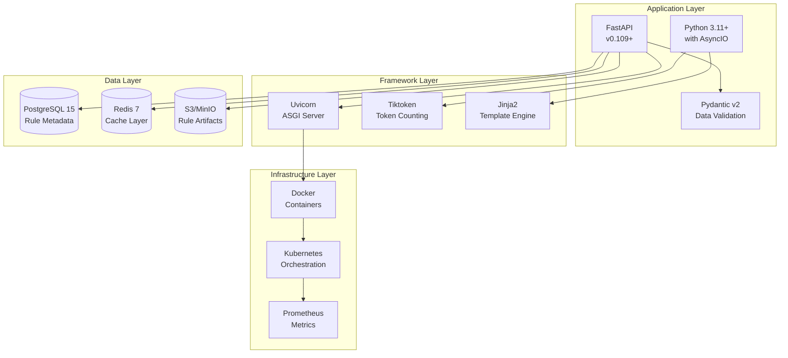

# TA - Prompt Management Systeem voor Definitie-app

## Executive Summary

Dit document beschrijft de Technical Architecture voor het Prompt Management Systeem. Het definieert de technische implementatie, infrastructuur vereisten, en deployment strategie voor een schaalbaar en onderhoudbaar systeem binnen de bestaande Python/FastAPI architectuur.

## Context & Scope

Het systeem wordt geïmplementeerd binnen de bestaande Definitie-app technische stack:
- Python 3.11+
- FastAPI framework
- PostgreSQL database
- Docker containers
- Redis voor caching

## Architecture Decisions

### TAD1: Async-First Implementation

**Besluit**: Alle regel modules en core componenten gebruiken Python async/await.

**Rationale**:
- Consistency met bestaande codebase
- Betere performance voor I/O operations
- Native support in FastAPI

**Implementation**:
```python
async def validate(self, text: str, context: Context) -> ValidationResult:
    async with self.semaphore:  # Rate limiting
        return await self._execute_validation(text, context)
```

### TAD2: Redis-based Caching Strategy

**Besluit**: Gebruik Redis voor prompt fragment caching met intelligent invalidation.

**Rationale**:
- Snelle lookup times (< 1ms)
- Distributed caching voor horizontal scaling
- TTL-based expiration

**Implementation**:
```python
CACHE_KEY_PATTERN = "prompt:v1:{context_hash}:{rules_hash}"
CACHE_TTL_SECONDS = 3600  # 1 hour default
```

### TAD3: Plugin-based Rule Loading

**Besluit**: Implementeer rule modules als Python plugins met hot-reloading.

**Rationale**:
- Zero-downtime rule updates
- Isolated testing mogelijk
- Backwards compatibility

## Components/Design

### Technology Stack



### Implementation Architecture

#### Directory Structure

```
src/
├── prompt_management/
│   ├── __init__.py
│   ├── core/
│   │   ├── __init__.py
│   │   ├── registry.py          # RuleRegistry implementation
│   │   ├── composer.py          # PromptComposer implementation
│   │   ├── calculator.py        # TokenCalculator
│   │   └── optimizer.py         # PromptOptimizer
│   │
│   ├── rules/
│   │   ├── __init__.py
│   │   ├── base.py             # BaseRuleModule abstract class
│   │   ├── loader.py           # Dynamic rule loader
│   │   ├── arai/
│   │   │   ├── __init__.py
│   │   │   ├── arai_01.py     # ARAI-01 implementation
│   │   │   ├── arai_02.py     # ARAI-02 implementation
│   │   │   └── ...
│   │   ├── con/
│   │   │   └── ...
│   │   └── [other categories]/
│   │
│   ├── adapters/
│   │   ├── __init__.py
│   │   ├── validation.py       # Integration with ModularValidationService
│   │   ├── prompt.py           # Integration with ModularPromptBuilder
│   │   └── config.py           # Configuration adapter
│   │
│   ├── cache/
│   │   ├── __init__.py
│   │   ├── redis_cache.py     # Redis caching implementation
│   │   └── strategies.py      # Cache strategies
│   │
│   ├── api/
│   │   ├── __init__.py
│   │   ├── routes.py          # FastAPI routes
│   │   ├── schemas.py         # Pydantic schemas
│   │   └── dependencies.py    # Dependency injection
│   │
│   └── templates/
│       ├── base_prompt.jinja2
│       └── fragments/
│           ├── arai.jinja2
│           └── ...
│
├── tests/
│   ├── unit/
│   │   ├── test_rules/
│   │   │   ├── test_arai_01.py
│   │   │   └── ...
│   │   ├── test_composer.py
│   │   └── test_registry.py
│   │
│   ├── integration/
│   │   ├── test_prompt_generation.py
│   │   └── test_validation_flow.py
│   │
│   └── performance/
│       ├── test_token_calculation.py
│       └── test_cache_performance.py
│
└── config/
    ├── prompt_rules.yaml
    └── cache_config.yaml
```

#### Core Implementation Details

##### BaseRuleModule

```python
from abc import ABC, abstractmethod
from typing import Optional, Dict, Any
from dataclasses import dataclass
import asyncio

@dataclass
class ValidationResult:
    passed: bool
    score: float
    message: Optional[str] = None
    details: Optional[Dict[str, Any]] = None

@dataclass
class PromptFragment:
    content: str
    tokens: int
    priority: int
    metadata: Dict[str, Any]

class BaseRuleModule(ABC):
    """Abstract base class for all rule modules."""

    rule_id: str
    category: str
    priority: int = 1

    def __init__(self, config: Optional[Dict[str, Any]] = None):
        self.config = config or {}
        self._cache = {}
        self._semaphore = asyncio.Semaphore(10)  # Rate limiting

    @abstractmethod
    async def validate(
        self,
        text: str,
        context: Dict[str, Any]
    ) -> ValidationResult:
        """Validate text against this rule."""
        pass

    @abstractmethod
    async def get_prompt_fragment(
        self,
        context: Dict[str, Any]
    ) -> PromptFragment:
        """Generate prompt fragment for this rule."""
        pass

    def get_metadata(self) -> Dict[str, Any]:
        """Return rule metadata for monitoring."""
        return {
            "id": self.rule_id,
            "category": self.category,
            "priority": self.priority,
            "config": self.config
        }
```

##### RuleRegistry with Plugin Loading

```python
import importlib
import asyncio
from pathlib import Path
from typing import Dict, List, Optional
import logging

logger = logging.getLogger(__name__)

class RuleRegistry:
    """Central registry with dynamic rule loading."""

    def __init__(self, rules_path: Path, cache_client: Optional[Redis] = None):
        self.rules_path = rules_path
        self.cache = cache_client
        self.rules: Dict[str, BaseRuleModule] = {}
        self._lock = asyncio.Lock()
        self._file_watchers = {}

    async def initialize(self):
        """Load all rules at startup."""
        await self._discover_and_load_rules()
        if self.cache:
            await self._warm_cache()

    async def _discover_and_load_rules(self):
        """Discover and load rule modules from filesystem."""
        async with self._lock:
            for category_dir in self.rules_path.iterdir():
                if category_dir.is_dir() and not category_dir.name.startswith('_'):
                    await self._load_category_rules(category_dir)

    async def _load_category_rules(self, category_path: Path):
        """Load all rules from a category directory."""
        for rule_file in category_path.glob("*.py"):
            if not rule_file.name.startswith('_'):
                try:
                    module_name = f"prompt_management.rules.{category_path.name}.{rule_file.stem}"
                    module = importlib.import_module(module_name)

                    # Find the rule class
                    for attr_name in dir(module):
                        attr = getattr(module, attr_name)
                        if (isinstance(attr, type) and
                            issubclass(attr, BaseRuleModule) and
                            attr is not BaseRuleModule):

                            rule_instance = attr()
                            self.rules[rule_instance.rule_id] = rule_instance
                            logger.info(f"Loaded rule: {rule_instance.rule_id}")

                except Exception as e:
                    logger.error(f"Failed to load rule from {rule_file}: {e}")

    async def hot_reload_rule(self, rule_id: str):
        """Hot reload a specific rule without restart."""
        async with self._lock:
            if rule_id in self.rules:
                # Clear module cache
                module = self.rules[rule_id].__class__.__module__
                if module in sys.modules:
                    del sys.modules[module]

                # Reload
                await self._load_category_rules(
                    self.rules_path / self.rules[rule_id].category.lower()
                )
```

##### Token Calculator with Caching

```python
import tiktoken
from functools import lru_cache
import hashlib

class TokenCalculator:
    """Efficient token calculation with caching."""

    def __init__(self, model: str = "gpt-4"):
        self.encoding = tiktoken.encoding_for_model(model)
        self._cache = {}

    @lru_cache(maxsize=1000)
    def calculate(self, text: str) -> int:
        """Calculate tokens with LRU caching."""
        return len(self.encoding.encode(text))

    def calculate_batch(self, texts: List[str]) -> Dict[str, int]:
        """Batch token calculation for efficiency."""
        results = {}
        for text in texts:
            cache_key = hashlib.md5(text.encode()).hexdigest()
            if cache_key in self._cache:
                results[text] = self._cache[cache_key]
            else:
                tokens = self.calculate(text)
                self._cache[cache_key] = tokens
                results[text] = tokens
        return results
```

### Infrastructure Requirements

#### Container Specification

```dockerfile
# Dockerfile
FROM python:3.11-slim

# Install system dependencies
RUN apt-get update && apt-get install -y \
    gcc \
    g++ \
    && rm -rf /var/lib/apt/lists/*

# Set working directory
WORKDIR /app

# Copy requirements
COPY requirements.txt .
RUN pip install --no-cache-dir -r requirements.txt

# Copy application
COPY src/ ./src/
COPY config/ ./config/

# Run as non-root user
RUN useradd -m appuser && chown -R appuser:appuser /app
USER appuser

# Health check
HEALTHCHECK --interval=30s --timeout=3s --start-period=5s --retries=3 \
    CMD python -c "import requests; requests.get('http://localhost:8000/health')"

# Start application
CMD ["uvicorn", "src.main:app", "--host", "0.0.0.0", "--port", "8000", "--workers", "4"]
```

#### Kubernetes Deployment

```yaml
apiVersion: apps/v1
kind: Deployment
metadata:
  name: prompt-management
  namespace: definitie-app
spec:
  replicas: 3
  selector:
    matchLabels:
      app: prompt-management
  template:
    metadata:
      labels:
        app: prompt-management
    spec:
      containers:
      - name: app
        image: definitie-app/prompt-management:1.0.0
        ports:
        - containerPort: 8000
        env:
        - name: REDIS_URL
          valueFrom:
            secretKeyRef:
              name: redis-credentials
              key: url
        - name: DATABASE_URL
          valueFrom:
            secretKeyRef:
              name: postgres-credentials
              key: url
        resources:
          requests:
            memory: "512Mi"
            cpu: "500m"
          limits:
            memory: "1Gi"
            cpu: "1000m"
        livenessProbe:
          httpGet:
            path: /health
            port: 8000
          initialDelaySeconds: 30
          periodSeconds: 10
        readinessProbe:
          httpGet:
            path: /ready
            port: 8000
          initialDelaySeconds: 5
          periodSeconds: 5
---
apiVersion: v1
kind: Service
metadata:
  name: prompt-management-service
  namespace: definitie-app
spec:
  selector:
    app: prompt-management
  ports:
  - protocol: TCP
    port: 80
    targetPort: 8000
  type: ClusterIP
```

### Performance Requirements

#### Response Time Targets

| Operation | Target | Maximum |
|-----------|--------|---------|
| Single rule validation | < 10ms | 50ms |
| Complete validation (45 rules) | < 200ms | 500ms |
| Prompt generation | < 100ms | 300ms |
| Cache lookup | < 1ms | 5ms |
| Token calculation (1000 chars) | < 5ms | 20ms |

#### Scalability Targets

- **Concurrent Users**: 100 simultaneous
- **Requests per Second**: 500 RPS
- **Cache Hit Rate**: > 80%
- **Memory per Instance**: < 1GB
- **CPU per Instance**: < 1 core

### Monitoring & Observability

#### Metrics Collection

```python
from prometheus_client import Counter, Histogram, Gauge
import time

# Metrics definitions
rule_validations = Counter(
    'rule_validations_total',
    'Total number of rule validations',
    ['rule_id', 'category', 'result']
)

validation_duration = Histogram(
    'validation_duration_seconds',
    'Time spent in validation',
    ['rule_id']
)

prompt_token_usage = Gauge(
    'prompt_token_usage',
    'Number of tokens in generated prompt',
    ['context_type']
)

cache_hits = Counter(
    'cache_hits_total',
    'Number of cache hits',
    ['cache_type']
)

# Usage example
class MonitoredRuleModule(BaseRuleModule):
    async def validate(self, text: str, context: Dict[str, Any]) -> ValidationResult:
        start_time = time.time()
        try:
            result = await self._execute_validation(text, context)
            rule_validations.labels(
                rule_id=self.rule_id,
                category=self.category,
                result='pass' if result.passed else 'fail'
            ).inc()
            return result
        finally:
            validation_duration.labels(rule_id=self.rule_id).observe(
                time.time() - start_time
            )
```

#### Logging Strategy

```python
import structlog
from contextvars import ContextVar

# Context vars for correlation
correlation_id: ContextVar[str] = ContextVar('correlation_id')

# Structured logging setup
logger = structlog.get_logger()

def setup_logging():
    structlog.configure(
        processors=[
            structlog.stdlib.filter_by_level,
            structlog.stdlib.add_logger_name,
            structlog.stdlib.add_log_level,
            structlog.stdlib.PositionalArgumentsFormatter(),
            structlog.processors.TimeStamper(fmt="iso"),
            structlog.processors.StackInfoRenderer(),
            structlog.processors.format_exc_info,
            structlog.processors.UnicodeDecoder(),
            structlog.processors.dict_tracebacks,
            add_correlation_id,
            structlog.processors.JSONRenderer()
        ],
        context_class=dict,
        logger_factory=structlog.stdlib.LoggerFactory(),
        cache_logger_on_first_use=True,
    )

def add_correlation_id(logger, log_method, event_dict):
    """Add correlation ID to all log entries."""
    if correlation_id.get(None):
        event_dict['correlation_id'] = correlation_id.get()
    return event_dict

# Usage
logger.info(
    "rule_validation_completed",
    rule_id="ARAI-01",
    duration_ms=15,
    result="passed",
    context={"begrip": "verdachte"}
)
```

### Security Considerations

#### Input Validation

```python
from pydantic import BaseModel, validator, Field
import re

class ValidationRequest(BaseModel):
    text: str = Field(..., min_length=1, max_length=10000)
    context: Dict[str, Any]
    rules: Optional[List[str]] = None

    @validator('text')
    def sanitize_text(cls, v):
        # Remove potential injection attempts
        v = re.sub(r'<script[^>]*>.*?</script>', '', v, flags=re.DOTALL)
        v = re.sub(r'{{.*?}}', '', v)  # Remove template injections
        return v

    @validator('rules')
    def validate_rule_ids(cls, v):
        if v:
            pattern = r'^[A-Z]{2,4}-\d{2}$'
            for rule_id in v:
                if not re.match(pattern, rule_id):
                    raise ValueError(f"Invalid rule ID format: {rule_id}")
        return v
```

#### Rate Limiting

```python
from slowapi import Limiter
from slowapi.util import get_remote_address

limiter = Limiter(
    key_func=get_remote_address,
    default_limits=["100/minute", "1000/hour"]
)

app = FastAPI()
app.state.limiter = limiter
app.add_exception_handler(RateLimitExceeded, _rate_limit_exceeded_handler)

@app.post("/api/v1/validation/execute")
@limiter.limit("20/minute")
async def execute_validation(
    request: Request,
    validation_request: ValidationRequest
):
    # Implementation
    pass
```

### CI/CD Pipeline

```yaml
# .github/workflows/prompt-management.yml
name: Prompt Management CI/CD

on:
  push:
    branches: [main, develop]
    paths:
      - 'src/prompt_management/**'
      - 'tests/**'
  pull_request:
    branches: [main]

jobs:
  test:
    runs-on: ubuntu-latest
    services:
      redis:
        image: redis:7
        options: >-
          --health-cmd "redis-cli ping"
          --health-interval 10s
          --health-timeout 5s
          --health-retries 5
        ports:
          - 6379:6379

    steps:
    - uses: actions/checkout@v3

    - name: Set up Python
      uses: actions/setup-python@v4
      with:
        python-version: '3.11'

    - name: Install dependencies
      run: |
        pip install -r requirements.txt
        pip install -r requirements-dev.txt

    - name: Run linting
      run: |
        black --check src/prompt_management
        flake8 src/prompt_management
        mypy src/prompt_management

    - name: Run tests
      run: |
        pytest tests/ \
          --cov=src/prompt_management \
          --cov-report=xml \
          --cov-report=term-missing \
          --cov-fail-under=90

    - name: Performance tests
      run: |
        pytest tests/performance/ -v

    - name: Security scan
      run: |
        pip install bandit safety
        bandit -r src/prompt_management
        safety check

  build:
    needs: test
    runs-on: ubuntu-latest
    if: github.ref == 'refs/heads/main'

    steps:
    - uses: actions/checkout@v3

    - name: Build Docker image
      run: |
        docker build -t prompt-management:${{ github.sha }} .

    - name: Push to registry
      run: |
        echo ${{ secrets.REGISTRY_PASSWORD }} | docker login -u ${{ secrets.REGISTRY_USERNAME }} --password-stdin
        docker tag prompt-management:${{ github.sha }} ${{ secrets.REGISTRY_URL }}/prompt-management:latest
        docker push ${{ secrets.REGISTRY_URL }}/prompt-management:latest
```

## Standards & Compliance

### Performance Standards

- **Response Time**: P95 < 300ms
- **Availability**: 99.9% uptime
- **Error Rate**: < 0.1%
- **Cache Hit Rate**: > 80%

### Security Standards

- **OWASP Top 10**: Full compliance
- **Input Validation**: All user input sanitized
- **Rate Limiting**: Implemented on all endpoints
- **Secrets Management**: Via Kubernetes secrets

## Risks & Mitigations

### Technical Debt

1. **Legacy Integration Complexity**
   - Risk: Complex integration with existing codebase
   - Mitigation: Adapter pattern with comprehensive testing
   - Monitoring: Track adapter performance metrics

2. **Rule Module Quality**
   - Risk: Inconsistent rule implementations
   - Mitigation: Strict base class, automated testing
   - Prevention: Code reviews, linting

3. **Cache Invalidation**
   - Risk: Stale cached data
   - Mitigation: TTL-based expiration, event-driven invalidation
   - Monitoring: Cache hit/miss ratios

## Implementation Roadmap

### Phase 1: Foundation (Week 1-2)
```bash
# Setup project structure
mkdir -p src/prompt_management/{core,rules,adapters,cache,api}
# Implement base classes
# Setup testing framework
# Create CI/CD pipeline
```

### Phase 2: Core Implementation (Week 3-4)
```bash
# Implement RuleRegistry
# Implement PromptComposer
# Setup Redis caching
# Create first 5 rule modules
```

### Phase 3: Integration (Week 5-6)
```bash
# Create adapters for existing services
# Implement API endpoints
# Setup monitoring
# Performance testing
```

### Phase 4: Migration (Week 7-8)
```bash
# Migrate all 45 rules
# Parallel testing
# Load testing
# Documentation
```

### Phase 5: Optimization (Week 9-10)
```bash
# Performance tuning
# Cache optimization
# A/B testing setup
# Production deployment
```

## References

- [FastAPI Documentation](https://fastapi.tiangolo.com/)
- [Python AsyncIO](https://docs.python.org/3/library/asyncio.html)
- [Redis Best Practices](https://redis.io/docs/manual/patterns/)
- [Kubernetes Patterns](https://kubernetes.io/docs/concepts/)
- [Prometheus Monitoring](https://prometheus.io/docs/introduction/overview/)
- [OWASP Security Guidelines](https://owasp.org/www-project-top-ten/)

---
*Versie: 1.0.0*
*Datum: 2025-09-03*
*Status: Concept*
