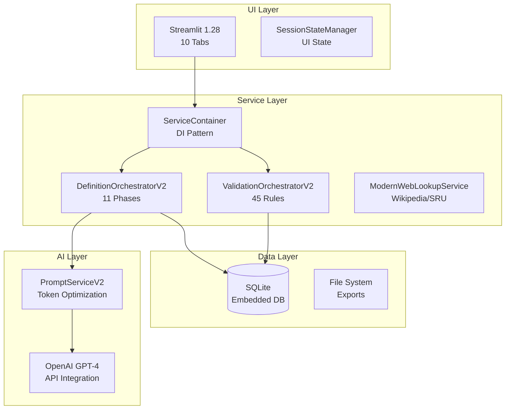
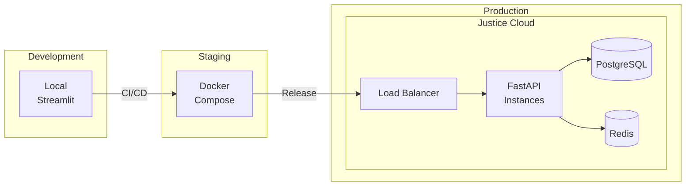

# Technical Architecture - DefinitieAgent

## Executive Summary

Dit document beschrijft de technische implementatie van DefinitieAgent V2-only architectuur. Het systeem draait volledig op V2 services met gecentraliseerde AI configuratie via ConfigManager, modulaire validatie met 45 toetsregels, en clean dependency injection via ServiceContainer. Alle V1 services en migratie code zijn verwijderd.

## Context & Scope

### Huidige Realiteit (2025-09)
- **Deployment Model**: Developer workstation (single-user MVP)
- **Architecture Pattern**: V2-only services met ServiceContainer DI
- **Service Layer**: DefinitionOrchestratorV2, ValidationOrchestratorV2, ModularValidationService
- **AI Configuration**: ConfigManager met component-specifieke settings
- **Migration Status**: 100% V2 - alle V1 code verwijderd
- **Production Path**: FastAPI/PostgreSQL Q4 2025, Justice chain Q2 2026

### Toekomstige Scope
- Multi-tenant architectuur voor OM/DJI/Rechtspraak
- ASTRA compliance voor justice integratie
- PostgreSQL voor concurrent users
- FastAPI voor REST endpoints

## Architecture Decisions

### TAD1: Streamlit voor MVP UI
**Besluit**: Streamlit blijft UI framework tot multi-user vereist is

**Rationale**:
- Adequate voor single-user desktop gebruik
- Snelle ontwikkeling en prototyping
- Python-native, geen frontend expertise nodig
- Migratie naar React/Vue bij productie

**Impact**:
- ✅ Snelle iteraties mogelijk
- ✅ Geen JavaScript complexiteit
- ❌ Beperkte UI customization
- ❌ Geen concurrent users mogelijk

### TAD2: SQLite voor MVP Persistence
**Besluit**: SQLite embedded database voor single-user MVP

**Rationale**:
- Zero configuration needed
- Adequate voor single-user workloads
- File-based, easy backup/restore
- Migratie pad naar PostgreSQL duidelijk

**Impact**:
- ✅ Geen database server nodig
- ✅ Simpliciteit voor development
- ❌ Geen concurrent writes
- ❌ Beperkte query performance

### TAD3: ServiceContainer Pattern
**Besluit**: Dependency injection via ServiceContainer class

**Rationale**:
- Clean architecture principles
- Testbaarheid zonder UI dependencies
- Flexibele service configuratie
- Voorbereid op microservices

**Implementation**:
```python
# src/services/container.py
class ServiceContainer:
    def orchestrator(self) -> DefinitionOrchestratorInterface:
        if "orchestrator" not in self._instances:
            self._instances["orchestrator"] = DefinitionOrchestratorV2(
                prompt_service=PromptServiceV2(),
                ai_service=AIServiceV2(),
                validation_service=ValidationServiceAdapterV1toV2(),
                cleaning_service=CleaningServiceAdapterV1toV2(),
                repository=self.repository()
            )
        return self._instances["orchestrator"]
```

## Components/Design

### Technology Stack (Werkend)



### Component Details

#### 1. Streamlit UI (src/ui/)
```
src/ui/
├── tabbed_interface.py         # Main UI controller
├── tabs/
│   ├── definition_generator_tab.py  ✅ Active
│   ├── history_tab.py              ✅ Active
│   ├── export_tab.py               🔄 Partial
│   └── [7 inactive tabs]           ❌ Not integrated
└── session_state.py            # State management
```

#### 2. Service Container (src/services/container.py)
```python
Services geregistreerd:
- orchestrator()     → DefinitionOrchestratorV2
- validator()        → DefinitionValidator (45 rules)
- repository()       → DefinitionRepository (SQLite)
- web_lookup()       → ModernWebLookupService
- cleaning_service() → CleaningService
- export_service()   → ExportService
```

#### 3. Orchestrators (src/services/orchestrators/)
```
ValidationOrchestratorV2:
- Async-first design
- Clean service interfaces
- Uniform ValidationResult contracts
- Feature-flag controlled

DefinitionOrchestratorV2:
- 11-phase orchestration flow
- No session state access
- GVI feedback integration
- DPIA/AVG compliance ready
```

#### 4. Data Persistence (data/)
```
data/
├── definities.db        # SQLite database
├── exports/            # JSON/TXT exports
└── uploads/            # Document uploads
```

## Technology Choices

### Programming Language & Frameworks

| Component | Technology | Version | Status |
|-----------|------------|---------|--------|
| Language | Python | 3.11+ | Production |
| UI Framework | Streamlit | 1.28 | Production (single-user) |
| Database | SQLite | 3.x | Production (migration planned) |
| AI Integration | OpenAI SDK | 1.x | Production via ConfigManager |
| Config Management | ConfigManager | Custom | Production (NEW) |
| Validation Engine | ModularValidationService | V2 | Production (45 rules) |
| Testing | Pytest | 7.x | ~60% coverage |
| Code Quality | Ruff + Black | Latest | Active |

### Dependencies & Libraries

```toml
# pyproject.toml key dependencies
[tool.poetry.dependencies]
python = "^3.11"
streamlit = "^1.28.0"
openai = "^1.0.0"
pydantic = "^2.0.0"
sqlalchemy = "^2.0.0"
pytest = "^7.0.0"
ruff = "^0.1.0"
black = "^23.0.0"
```

### Development Tools

| Tool | Purpose | Configuration |
|------|---------|--------------|
| Poetry | Dependency management | pyproject.toml |
| Pre-commit | Git hooks | .pre-commit-config.yaml |
| Make | Task automation | Makefile |
| Docker | Containerization | Dockerfile (future) |

## Performance Characteristics

### Current Performance Metrics

| Metric | Current | Target | Bottleneck |
|--------|---------|--------|------------|
| Response Time | 8-12s | <5s | OpenAI API calls |
| Memory Usage | 500MB | <1GB | Adequate |
| Database Queries | N+1 issues | Optimized | Query optimization needed |
| Cache Hit Rate | 0% | 80% | No caching implemented |

### Performance Optimizations Needed

1. **API Response Caching**
   - Semantic similarity voor duplicate requests
   - Redis implementation planned

2. **Database Optimization**
   - Fix N+1 queries in voorbeelden system
   - Add proper indexes

3. **Prompt Optimization**
   - Reduce tokens from 7,250 to ~3,000
   - Dynamic prompt composition

## Security Implementation

### Current Security Status

| Aspect | Status | Risk Level | Mitigation |
|--------|--------|------------|------------|
| Authentication | ❌ None | Low (single-user) | Not needed for MVP |
| Authorization | ❌ None | Low (single-user) | Not needed for MVP |
| Data Encryption | ❌ None | Medium | Planned for production |
| API Key Management | ✅ Env vars | Low | Adequate for MVP |
| Input Validation | ✅ Pydantic | Low | Type validation active |

### Justice Sector Security Requirements (Future)

```yaml
BIO Compliance (Required for Production):
  - Authentication: DigiD/AD integration
  - Authorization: RBAC with justice roles
  - Encryption: At-rest and in-transit
  - Audit Logging: Onweerlegbaar trail
  - Data Classification: Vertrouwelijk support

ASTRA Requirements:
  - Service Bus: Justice message format
  - Identity Federation: Cross-organization SSO
  - Zero Trust: Network segmentation
```

## Infrastructure & Deployment

### Current Deployment (MVP)

```bash
# Local development deployment
git clone <repository>
cd definitie-app
pip install -r requirements.txt
streamlit run src/main.py

# Environment configuration
OPENAI_API_KEY=sk-...
APP_ENV=development
```

### Future Production Deployment



## Migration Path to Production

### Phase 1: MVP Stabilization (Current)
- ✅ ServiceContainer architecture
- ✅ V2 Orchestrators implementation
- 🔄 V1→V2 service migration
- ❌ Test coverage improvement

### Phase 2: API Layer (Q1 2026)
```python
# Planned FastAPI implementation
from fastapi import FastAPI
from services.container import get_container

app = FastAPI()
container = get_container()

@app.post("/api/v1/definitions")
async def create_definition(request: GenerationRequest):
    orchestrator = container.orchestrator()
    return await orchestrator.create_definition(request)
```

### Phase 3: Multi-User Support (Q2 2026)
- PostgreSQL migration
- User authentication (OIDC)
- Session management
- Concurrent request handling

### Phase 4: Justice Integration (Q3 2026)
- ASTRA service bus adapters
- BIO compliance implementation
- Zaaksysteem connectors
- Audit trail implementation

## Monitoring & Observability

### Current Monitoring
```python
# Basic Python logging
import logging

logger = logging.getLogger(__name__)
logger.info(f"Generation {id}: Complete in {duration}s")
```

### Future Observability Stack
```yaml
Monitoring Stack:
  Metrics: Prometheus + Grafana
  Logging: ELK Stack (Elasticsearch, Logstash, Kibana)
  Tracing: OpenTelemetry + Jaeger
  Alerting: AlertManager

Key Metrics:
  - Definition generation rate
  - Validation success rate
  - API response times
  - Token usage costs
  - Error rates by service
```

## Cost Analysis

### Current Costs (MVP)
| Component | Monthly Cost | Notes |
|-----------|-------------|-------|
| OpenAI API | €50-100 | Development usage |
| Infrastructure | €0 | Local deployment |
| Database | €0 | SQLite embedded |
| **Total** | **€50-100** | |

### Projected Production Costs
| Component | Monthly Cost | Notes |
|-----------|-------------|-------|
| OpenAI API | €500-1000 | Production usage |
| Cloud Hosting | €200-400 | VMs + Database |
| Monitoring | €100-200 | APM tools |
| Security | €200-300 | WAF + Certificates |
| **Total** | **€1000-1900** | |

## Standards & Compliance

### Current Compliance
- ✅ Python PEP-8 (via Black/Ruff)
- ✅ Type hints (partial coverage)
- ❌ WCAG 2.1 (Streamlit limitations)
- ❌ BIO/NORA (not implemented)

### Required for Justice Production
```yaml
Mandatory Standards:
  ASTRA: Architecture Strafrechtketen
  BIO: Baseline Informatiebeveiliging Overheid
  NORA: Nederlandse Overheid Referentie Architectuur
  AVG/GDPR: Privacy wetgeving
  WCAG 2.1 AA: Accessibility

Technical Standards:
  OpenAPI 3.0: API specification
  OAuth 2.0/OIDC: Authentication
  TLS 1.3: Encryption in transit
  ISO 27001: Information security
```

## Risk Register

| Risk | Impact | Probability | Mitigation |
|------|--------|-------------|------------|
| SQLite concurrency | High | Certain (when scaling) | PostgreSQL migration planned |
| No authentication | Critical | Certain (production) | OIDC implementation Q2 2026 |
| Streamlit limitations | Medium | High | FastAPI + React planned |
| OpenAI dependency | High | Low | Alternative LLM options researched |
| Performance bottlenecks | Medium | High | Caching layer planned |

## Recommendations

### Immediate Actions (Sprint 1-2)
1. Complete V1→V2 service migration
2. Implement basic caching for API calls
3. Fix N+1 database queries
4. Increase test coverage to 60%

### Short-term (Q4 2025)
1. Add FastAPI read-only endpoints
2. Implement structured logging
3. Add performance monitoring
4. Document API contracts

### Medium-term (Q1-Q2 2026)
1. PostgreSQL migration
2. Full REST API implementation
3. Authentication/authorization
4. React frontend development

### Long-term (Q3-Q4 2026)
1. Justice chain integration
2. BIO/ASTRA compliance
3. Production deployment
4. Multi-organization support

## References

### Internal Documentation
- [Enterprise Architecture](./ENTERPRISE_ARCHITECTURE.md)
- [Solution Architecture](./SOLUTION_ARCHITECTURE.md)
- [Service Container Design](../technisch/service-container.md)
- [V2 Migration Plan](./workflows/v2-migration-workflow.md)

### External Standards
- [ASTRA](https://www.astra-justitie.nl)
- [BIO](https://www.bio-overheid.nl)
- [NORA](https://www.noraonline.nl)
- [Python PEP-8](https://pep8.org)

## Document Control

- **Version**: 1.0
- **Status**: Active
- **Owner**: Technical Architecture Team
- **Last Updated**: 2025-09-04
- **Next Review**: 2025-10-01
- **Distribution**: Development Team, Architecture Board

---

*This document represents the actual technical implementation of DefinitieAgent as of September 2025.*
