# TO-BE Architectuur & Roadmap - DefinitieAgent

**Versie**: 2.0  
**Laatste Update**: 2025-08-18  
**Status**: Geconsolideerd implementatieplan

## 🎯 Visie & Doelstellingen

### Architectuur Principes
1. **Clean Architecture**: Duidelijke scheiding van concerns
2. **Microservices Pattern**: Losjes gekoppelde, focused services
3. **Event-Driven**: Asynchrone communicatie waar mogelijk
4. **API-First**: Alle functionaliteit via APIs beschikbaar
5. **Cloud-Ready**: Schaalbaar en container-based

### Business Drivers
- **Performance**: <5 seconden response tijd (60% verbetering)
- **Schaalbaarheid**: Multi-user ondersteuning
- **Onderhoudbaarheid**: 80% test coverage
- **Functionaliteit**: 100% UI tabs werkend
- **Kosten**: 70% reductie OpenAI API kosten

## 🏛️ TO-BE Architectuur

```mermaid
graph TB
    subgraph "Frontend Layer - Complete UI"
        UI_NEW[Streamlit App<br/>✅ 100% Functional]
        subgraph "Active Tabs"
            NT1[✅ Definitie Generatie]
            NT2[✅ Geschiedenis]
            NT3[✅ Export Advanced]
            NT4[✅ Kwaliteitscontrole]
            NT5[✅ Prompt Viewer]
            NT6[✅ Aangepaste Definitie]
            NT7[✅ Developer Tools]
            NT8[✅ Expert Review]
            NT9[✅ Externe Bronnen]
            NT10[✅ Orchestratie]
        end
        
        COMP[Component Library<br/>Reusable UI Parts]
        STATE[Centralized State<br/>Management]
    end
    
    subgraph "Service Layer - Clean Architecture"
        FACADE[DefinitionFacade<br/>API Gateway]
        
        subgraph "Focused Services"
            S1[DefinitionGenerator<br/>Core AI Logic]
            S2[ValidationOrchestrator<br/>ai_toetser + toetsregels]
            S3[ContentEnrichmentService<br/>Synoniemen/Antoniemen]
            S4[PromptOptimizer<br/><10k chars]
            S5[CacheManager<br/>Redis/Memory]
            S6[WebLookupService<br/>✅ UTF-8 Fixed]
        end
        
        subgraph "Cross-Cutting"
            AUTH[AuthenticationService<br/>User Management]
            MONITOR[MonitoringService<br/>Metrics & Logs]
            RATELIMIT[RateLimiter<br/>Smart Throttling]
        end
    end
    
    subgraph "AI & External Services"
        AI_OPT[OpenAI GPT-4<br/><5 sec response]
        REDIS[Redis Cache<br/>80% hit rate]
        
        subgraph "External APIs"
            EXT1[wetten.nl API]
            EXT2[rechtspraak.nl API]
            EXT3[officielebekendmakingen.nl]
        end
    end
    
    subgraph "Data Layer - Clean Access"
        subgraph "Database"
            PG[(PostgreSQL<br/>Production)]
            SQLITE[(SQLite<br/>Development)]
        end
        
        subgraph "Data Access"
            REPO_NEW[Repository Layer<br/>No Direct Access]
            MAPPER[Data Mappers]
            MIGRATE[Migration System]
        end
        
        CACHE_LAYER[Cache Layer<br/>Query Cache]
    end
    
    subgraph "Infrastructure - Unified"
        CONFIG[Unified Config<br/>Single Source]
        
        subgraph "Quality Assurance"
            TESTS[Test Suite<br/>✅ 80% Coverage]
            CI[CI/CD Pipeline<br/>Automated]
            LINT[Code Quality<br/>Black/Ruff/MyPy]
        end
        
        subgraph "Monitoring"
            LOG[Structured Logging]
            METRIC[Metrics Collection]
            ALERT[Alert System]
        end
        
        DEPLOY[Deployment<br/>Docker/Cloud Ready]
    end
    
    %% Connections TO-BE
    UI_NEW --> STATE
    STATE --> COMP
    
    NT1 --> FACADE
    NT2 --> FACADE
    NT3 --> FACADE
    NT4 --> FACADE
    NT5 --> FACADE
    NT6 --> FACADE
    NT7 --> FACADE
    NT8 --> FACADE
    NT9 --> FACADE
    NT10 --> FACADE
    
    FACADE --> S1
    FACADE --> S2
    FACADE --> S3
    FACADE --> S4
    FACADE --> S5
    FACADE --> S6
    
    FACADE --> AUTH
    FACADE --> MONITOR
    FACADE --> RATELIMIT
    
    S1 --> AI_OPT
    S1 --> S4
    S2 --> MONITOR
    S3 --> AI_OPT
    S5 --> REDIS
    S6 --> EXT1
    S6 --> EXT2
    S6 --> EXT3
    
    S1 --> REPO_NEW
    S2 --> REPO_NEW
    S3 --> REPO_NEW
    S6 --> REPO_NEW
    
    REPO_NEW --> MAPPER
    MAPPER --> PG
    MAPPER --> SQLITE
    REPO_NEW --> CACHE_LAYER
    CACHE_LAYER --> REDIS
    
    AUTH --> REPO_NEW
    MONITOR --> LOG
    MONITOR --> METRIC
    METRIC --> ALERT
    
    FACADE --> CONFIG
    S1 --> CONFIG
    S2 --> CONFIG
    
    CI --> TESTS
    CI --> LINT
    CI --> DEPLOY
    
    classDef working fill:#51cf66,stroke:#2b8a3e,color:#fff
    classDef new fill:#74c0fc,stroke:#339af0,color:#fff
    classDef improved fill:#63e6be,stroke:#20c997,color:#fff
    
    class NT1,NT2,NT3,NT4,NT5,NT6,NT7,NT8,NT9,NT10,TESTS working
    class S1,S2,S3,S4,S5,S6,AUTH,MONITOR,RATELIMIT,FACADE new
    class AI_OPT,REDIS,CONFIG,CI,DEPLOY improved
```



## 📅 Transformatie Roadmap - 16 Weken

### Phase 1: Foundation (Week 1-4)
**Doel**: Stabiliseer de basis en fix kritieke issues

#### Week 1-2: Emergency Fixes
- [ ] Fix import paths structuur
- [ ] Implementeer WAL mode voor SQLite
- [ ] Fix widget key duplicates in Streamlit
- [ ] Basis authenticatie toevoegen

#### Week 3-4: Config & Testing
- [ ] Unificeer configuratie systeem
- [ ] Repair test suite (target: 30% working)
- [ ] Setup CI/CD pipeline basis
- [ ] Documenteer development setup

**Success Criteria Phase 1:**
- ✅ Applicatie start zonder errors
- ✅ 30% tests working
- ✅ Config via één systeem
- ✅ Basic auth werkend

### Phase 2: Service Decomposition (Week 5-8)
**Doel**: Elimineer God Object pattern

#### Week 5-6: Extract Core Services
```python
# Voorbeeld: Extract PromptOptimizer
class PromptOptimizer:
    def __init__(self, config: Config):
        self.max_tokens = config.prompt.max_tokens
        self.optimization_level = config.prompt.optimization_level
    
    def optimize(self, prompt: str, context: Dict) -> str:
        # Verplaats prompt optimization logic hier
        optimized = self._reduce_tokens(prompt)
        optimized = self._inject_context(optimized, context)
        return optimized
```

#### Week 7-8: Implement Facade Pattern
```python
# DefinitionFacade implementation
class DefinitionFacade:
    def __init__(self, container: ServiceContainer):
        self.generator = container.get(DefinitionGenerator)
        self.validator = container.get(ValidationOrchestrator)
        self.cache = container.get(CacheManager)
    
    async def generate_definition(self, request: DefinitionRequest) -> DefinitionResponse:
        # Orchestreer services
        cached = await self.cache.get(request.hash)
        if cached:
            return cached
            
        result = await self.generator.generate(request)
        validated = await self.validator.validate(result)
        await self.cache.set(request.hash, validated)
        
        return validated
```

**Success Criteria Phase 2:**
- ✅ God Object geëlimineerd
- ✅ 6 focused services
- ✅ Facade pattern werkend
- ✅ 50% test coverage

### Phase 3: Feature Completion (Week 9-12)
**Doel**: Activeer alle UI functionaliteit

#### Week 9-10: Web Lookup & Enrichment
```python
# Modern WebLookupService
class WebLookupService:
    async def lookup(self, term: str) -> LookupResult:
        results = await asyncio.gather(
            self._search_wetten_nl(term),
            self._search_rechtspraak(term),
            self._search_official(term),
            return_exceptions=True
        )
        return self._merge_results(results)
```

#### Week 11-12: Complete UI Tabs
- [ ] Prompt Viewer implementatie
- [ ] Aangepaste Definitie templates
- [ ] Developer Tools activeren
- [ ] Expert Review workflow
- [ ] Orchestratie engine

**Success Criteria Phase 3:**
- ✅ 100% tabs functioneel
- ✅ Web lookup werkend
- ✅ Content enrichment actief
- ✅ 70% test coverage

### Phase 4: Optimization & Scale (Week 13-16)
**Doel**: Performance en enterprise features

#### Week 13-14: Performance
- [ ] Implement Redis caching
- [ ] Prompt optimization (<10k chars)
- [ ] Async processing
- [ ] Database connection pooling

#### Week 15-16: Enterprise Features
- [ ] Multi-tenant support
- [ ] Advanced monitoring
- [ ] PostgreSQL migration
- [ ] Horizontal scaling prep

**Success Criteria Phase 4:**
- ✅ <5 sec response time
- ✅ 80% cache hit rate
- ✅ 80% test coverage
- ✅ Production ready

## 🔧 Implementatie Details

### Service Boundaries

| Service | Verantwoordelijkheid | Dependencies |
|---------|---------------------|--------------|
| DefinitionGenerator | AI interaction & generation | OpenAI, PromptOptimizer |
| ValidationOrchestrator | Rule validation coordination | ai_toetser, toetsregels |
| ContentEnrichmentService | Synonym/antonym lookup | External APIs, AI |
| PromptOptimizer | Token optimization | Config only |
| CacheManager | Caching strategy | Redis, Memory |
| WebLookupService | External source integration | Multiple APIs |

### Migration Patterns

#### Pattern 1: Strangler Fig
```python
# Gradually replace old service
class ServiceRouter:
    def get_service(self, feature_flag: str):
        if feature_flags.is_enabled(feature_flag):
            return self.new_service
        return self.legacy_service
```

#### Pattern 2: Branch by Abstraction
```python
# Abstract interface for migration
class IDefinitionService(ABC):
    @abstractmethod
    async def generate(self, request: Request) -> Response:
        pass

class LegacyService(IDefinitionService):
    # Existing implementation
    
class ModernService(IDefinitionService):
    # New implementation
```

### Quick Wins (Implementeer Direct)

1. **SQLite WAL Mode**
```python
# In database initialization
conn.execute("PRAGMA journal_mode=WAL")
conn.execute("PRAGMA synchronous=NORMAL")
```

2. **Import Path Fix**
```python
# In __init__.py files
import sys
from pathlib import Path
sys.path.insert(0, str(Path(__file__).parent))
```

3. **Widget Key Fix**
```python
# Add unique keys to all Streamlit widgets
st.text_input("Name", key=f"name_input_{tab_id}_{timestamp}")
```

## 🚨 Risico's & Mitigatie

### Technische Risico's

| Risico | Impact | Kans | Mitigatie |
|--------|--------|------|-----------|
| Data Loss tijdens migratie | Hoog | Medium | Comprehensive backups, staged rollout |
| Performance degradatie | Medium | Laag | Performance tests, gradual rollout |
| Integration failures | Hoog | Medium | Contract testing, mocks |
| User disruption | Medium | Hoog | Feature flags, A/B deployment |

### Mitigatie Strategieën

1. **Feature Flags**: Graduele uitrol van nieuwe features
2. **Canary Deployments**: Test met klein percentage gebruikers
3. **Rollback Plan**: Altijd een weg terug hebben
4. **Monitoring**: Real-time alerts voor problemen

## 📋 Governance

### Architecture Decision Records (ADRs)

1. **ADR-001**: Microservices over Monolith
2. **ADR-002**: PostgreSQL voor productie
3. **ADR-003**: Redis voor caching
4. **ADR-004**: Feature flags voor migratie
5. **ADR-005**: API Gateway pattern

### Review Momenten

- **Week 4**: Foundation Review
- **Week 8**: Architecture Review
- **Week 12**: Feature Complete Review
- **Week 16**: Go-Live Review

### Success Metrics

| Metric | Current | Target | Measurement |
|--------|---------|--------|-------------|
| Response Time | 8-12s | <5s | 95th percentile |
| Test Coverage | 11% | 80% | Coverage reports |
| UI Completion | 30% | 100% | Feature checklist |
| Code Quality | D | B+ | SonarQube |
| User Satisfaction | Unknown | >4.0 | NPS Score |

## 🎯 Conclusie

De TO-BE architectuur transformeert de DefinitieAgent van een monolithische applicatie met technische schuld naar een moderne, schaalbare microservices architectuur. De 16-weken roadmap biedt een pragmatische, risicoarme aanpak voor deze transformatie met duidelijke milestones en success criteria.

**Geschatte Investment**: 400-600 development uren  
**ROI**: 60% performance verbetering, 70% onderhoudskosten reductie  
**Go-Live**: Week 16 met gefaseerde uitrol