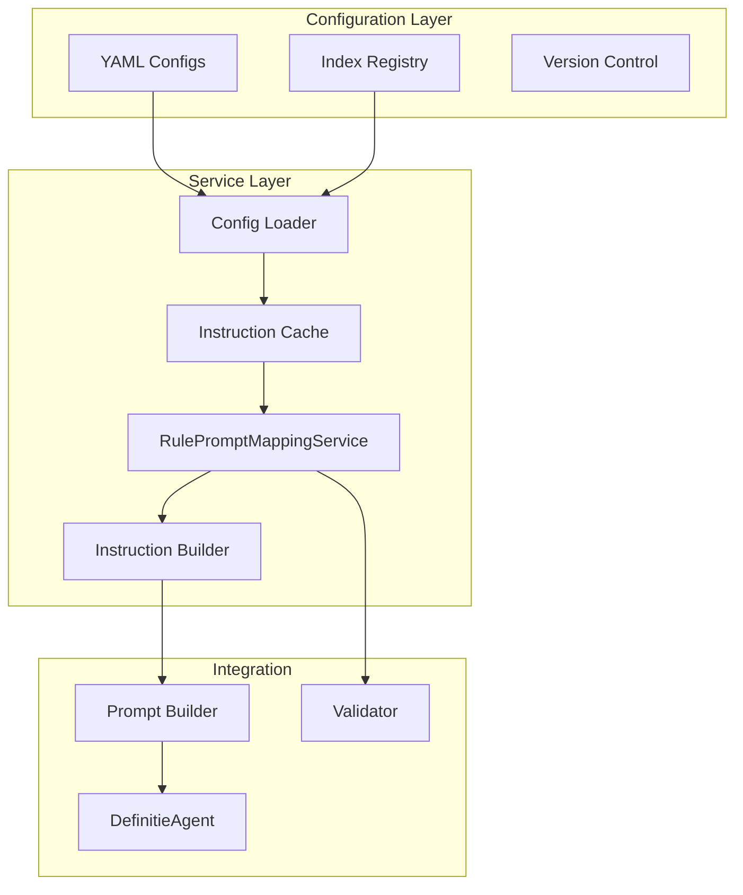

# Toetsregel Prompt Module - Implementation Proposal

## Executive Summary

Dit document beschrijft de implementatie van een centraal beheersysteem voor toetsregel-naar-prompt instructie mappings. Het systeem zorgt ervoor dat alle 45-46 toetsregels individuele, configureerbare prompt instructies krijgen die context-aware zijn en versioneerbaar beheerd worden.

## Probleemstelling

### Huidige Situatie
- 45-46 toetsregels in JSON formaat (`/src/toetsregels/regels/*.json`)
- Geen individuele prompt instructies per regel
- Regels worden generiek toegepast zonder context-specifieke nuances
- Geen centrale plek voor prompt instructie beheer
- Moeilijk om instructies te optimaliseren per regel

### Gewenste Situatie
- Iedere toetsregel heeft eigen prompt instructie configuratie
- Context-aware instructies (bijv. DJI-specifieke variaties)
- Centraal beheer via YAML/JSON configuraties
- Versionering van instructies voor A/B testing
- Eenvoudig onderhoud door domein experts

## Architectuur Ontwerp

### Component Overzicht



## Directory Structure

```
/config/prompt-instructions/
├── index.yaml                    # Master index
├── categories/
│   ├── ESS/
│   │   ├── ESS-01.yaml
│   │   └── ...
│   ├── CON/
│   ├── ARAI/
│   ├── SAM/
│   ├── STR/
│   ├── VER/
│   └── INT/
├── contexts/
│   ├── DJI.yaml
│   ├── OM.yaml
│   └── KMAR.yaml
└── templates/
    └── base.yaml
```

## YAML Configuration Format

```yaml
# Example: ESS-01.yaml
rule_id: ESS-01
name: "Essentie, niet doel"
version: "1.0.0"

instruction:
  primary: |
    De definitie moet beschrijven WAT het begrip IS,
    niet waarvoor het gebruikt wordt.

  detection_patterns:
    - "om te"
    - "met als doel"

examples:
  correct:
    - definition: "maatregel die volgt op normovertreding"
  incorrect:
    - definition: "maatregel om gedrag te beïnvloeden"

context_overrides:
  - organization: ["DJI"]
    modification: "Extra focus op uitvoeringsaspecten"

priority: 1
```

## Service Implementation Summary

De `RulePromptMappingService` biedt:
- Lazy loading van YAML configuraties
- In-memory caching voor performance
- Context-aware instruction building
- Version management
- Hot-reload capability voor development

## Integration Points

1. **DefinitieAgent**: Gebruikt service voor regel-specifieke instructies
2. **ModularPromptBuilder**: Integreert instructies in prompt generatie
3. **Validator**: Gebruikt zelfde regels voor consistentie

## Success Metrics

- 100% regel coverage met instructies
- < 10ms lookup tijd per regel
- 15% verbetering in definitie kwaliteit
- < 30 min voor regel updates

## Volledige Regel Lijst (45 regels)

### Essentie (5)
ESS-01 t/m ESS-05

### Context (2)
CON-01, CON-02

### ARAI (9)
ARAI-01 t/m ARAI-06, plus SUB varianten

### Samenhang (8)
SAM-01 t/m SAM-08

### Structuur (9)
STR-01 t/m STR-09

### Verificatie (3)
VER-01 t/m VER-03

### Interne (9)
INT-01 t/m INT-10 (excl. INT-05)
