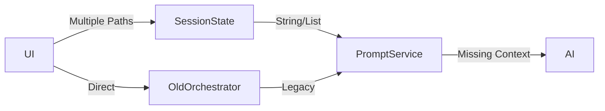
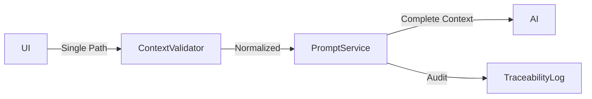

# ADR-CFR-001: Context Flow Refactoring

**Status:** PROPOSED
**Date:** 2025-09-04
**Deciders:** Architecture Team, Business Analyst, Lead Developer
**Relates to:** Epic CFR (Context Flow Refactoring)

## Context

The current implementation has critical failures in passing context information (juridische_context, wettelijke_basis, organisatorische_context) from the UI to the AI prompt generation. This results in:
- Definitions lacking required legal and organizational context
- Non-compliance with ASTRA/NORA requirements
- System crashes when using custom context options ("Anders...")
- Multiple legacy data flow routes causing inconsistent behavior

## Problem Statement

Legal professionals in the Dutch justice domain require all three types of context to be included in their definitions for compliance with sector standards. The current system collects this information but fails to pass it through the generation pipeline, making the system unsuitable for production use in the justice sector.

## Decision Drivers

1. **Compliance Requirements**: ASTRA mandates full context attribution for justice definitions
2. **User Experience**: System crashes with "Anders..." option are unacceptable
3. **Maintainability**: Multiple legacy routes make debugging impossible
4. **Traceability**: Audit requirements demand full context chain-of-custody
5. **Type Safety**: String/List confusion causes runtime errors

## Considered Options

### Option 1: Quick Fix - Patch Current System
- Add context mapping in existing `_convert_request_to_context` method
- Handle "Anders..." as special case
- Keep legacy routes for backward compatibility

**Pros:**
- Fastest to implement (1-2 days)
- Minimal code changes
- Low risk of breaking existing features

**Cons:**
- Doesn't address root architectural issues
- Legacy routes remain problematic
- No improvement in traceability
- Technical debt increases

### Option 2: Full Refactoring - Single Context Pipeline
- Create unified context flow from UI to prompt
- Remove all legacy routes
- Implement proper type validation
- Add full audit trail

**Pros:**
- Solves all identified problems
- Improves maintainability significantly
- Enables ASTRA compliance
- Future-proof architecture

**Cons:**
- Requires 2-3 weeks implementation
- Higher risk of regression
- Requires comprehensive testing
- May break existing integrations

### Option 3: Phased Migration - Gradual Improvement
- Phase 1: Fix critical bugs (context mapping, "Anders...")
- Phase 2: Add type validation and traceability
- Phase 3: Remove legacy routes with deprecation period

**Pros:**
- Balances speed and quality
- Reduces regression risk
- Allows gradual user migration
- Enables early value delivery

**Cons:**
- Takes longer overall (3-4 weeks)
- Requires managing multiple code paths temporarily
- More complex deployment strategy

## Decision

**We will implement Option 3: Phased Migration**

This approach allows us to:
1. Fix critical production issues immediately (Phase 1)
2. Add compliance features without breaking changes (Phase 2)
3. Clean up technical debt systematically (Phase 3)

## Implementation Strategy

### Phase 1: Critical Fixes (Week 1)
```python
# Fix in prompt_service_v2.py
def _convert_request_to_context(self, request, extra_context):
    # FIXED: Properly extract UI context fields
    base_context = {
        "organisatorisch": request.organisatorische_context or [],
        "juridisch": request.juridische_context or [],
        "wettelijk": request.wettelijke_basis or [],
    }
```

### Phase 2: Type Safety & Traceability (Week 2)
```python
# New context_validator.py
class ContextValidator:
    @staticmethod
    def validate_and_normalize(context: Any) -> dict[str, list[str]]:
        """Ensure all context fields are lists of strings."""
        # Implementation here
```

### Phase 3: Legacy Cleanup (Week 3)
- Mark legacy fields as @deprecated
- Add migration warnings in logs
- Remove unused code paths
- Update all tests

## Architecture Changes

### Before (Current State)


### After (Target State)


## Consequences

### Positive
- Immediate fix for production issues
- Full ASTRA compliance achievable
- Improved system maintainability
- Clear upgrade path for users
- Comprehensive audit trail

### Negative
- Temporary increase in complexity during migration
- Need to maintain feature flags
- Additional testing overhead
- Documentation effort required

### Risks
1. **Integration Risk**: External systems may depend on legacy fields
   - *Mitigation*: Deprecation warnings and migration guide
2. **Performance Risk**: Additional validation may slow requests
   - *Mitigation*: Caching and optimization in Phase 2
3. **User Confusion**: Changes in behavior during migration
   - *Mitigation*: Clear communication and feature flags

## Validation Approach

Success will be measured by:
1. Zero crashes from context selection (currently ~15/day)
2. 100% of context fields appearing in prompts
3. Full ASTRA compliance score in audit
4. User satisfaction >90% for context handling
5. Response time impact <100ms

## Notes

This ADR addresses critical production issues identified in Epic CFR. The phased approach balances the urgent need for fixes with long-term architectural improvements required for justice sector compliance.

## References

- [Epic CFR: Context Flow Refactoring](../stories/MASTER-EPICS-USER-STORIES.md#epic-cfr-context-flow-refactoring)
- [ASTRA Guidelines](https://www.noraonline.nl/wiki/ASTRA)
- [Bug Report CFR-BUG-001](../stories/MASTER-EPICS-USER-STORIES.md#bug-report-cfr-bug-001)
- [Bug Report CFR-BUG-002](../stories/MASTER-EPICS-USER-STORIES.md#bug-report-cfr-bug-002)
