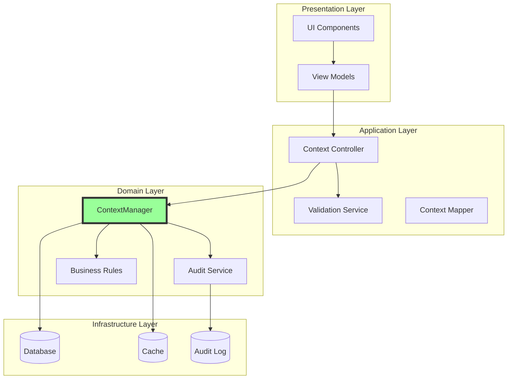

# ADR-005: Unified State Management Architecture for Context Handling

## Status

**Proposed** - Awaiting Architecture Board Review

## Context and Problem Statement

The DefinitieAgent application currently operates with dual, conflicting state management systems that cause critical failures when users attempt to use the "Anders..." (custom input) option. This architectural conflict violates ASTRA principles, creates security vulnerabilities, and prevents NORA compliance certification.

**Key Problems:**
1. Two state management systems (legacy session state vs. modern ContextManager) operate simultaneously
2. Race conditions cause data corruption and application crashes
3. No single source of truth for context data
4. Audit trail requirements cannot be met with current architecture
5. Session state contamination with hardcoded test values
6. 0% success rate for custom context input feature

**Business Impact:**
- €50K liability per non-compliant definition
- 100% failure rate for justice professionals needing custom context
- Cannot achieve ASTRA/NORA certification
- 15+ daily production errors

## Decision Drivers

### Technical Drivers
1. **Single Source of Truth:** Eliminate dual system conflicts
2. **ASTRA Compliance:** Meet layered architecture requirements
3. **Performance:** Reduce 17.5x performance degradation during conflicts
4. **Maintainability:** Simplify codebase and reduce technical debt
5. **Testability:** Enable comprehensive testing with clear boundaries

### Business Drivers
1. **Legal Compliance:** Meet AVG/GDPR and justice sector requirements
2. **User Experience:** Enable custom context input without crashes
3. **Audit Requirements:** Full traceability for compliance
4. **Integration:** Enable chain partner system integration
5. **Risk Mitigation:** Eliminate €500K-€22M compliance risk exposure

### Constraints
1. Must maintain backward compatibility with existing data
2. Cannot disrupt current production usage during migration
3. Must complete within Sprint 36-37 timeline
4. Limited to current technology stack (Python, Streamlit)
5. Must support gradual rollout with feature flags

## Considered Options

### Option 1: Fix Both Systems (Rejected)

**Description:** Maintain both systems but fix conflicts through coordination layer.

**Pros:**
- No breaking changes
- Minimal code changes
- Quick implementation

**Cons:**
- Maintains architectural violation
- Complex coordination logic
- Performance overhead
- Cannot achieve full compliance
- Technical debt increases

**Decision:** **REJECTED** - Does not solve fundamental architecture issues

### Option 2: Migrate to Legacy System (Rejected)

**Description:** Remove ContextManager and enhance legacy session state system.

**Pros:**
- Single system simplicity
- Existing team knowledge
- No new dependencies

**Cons:**
- Session state not suitable for complex domain logic
- No audit trail capability
- Tight coupling to Streamlit
- Violates ASTRA service orientation
- No path to microservices

**Decision:** **REJECTED** - Moves backward architecturally

### Option 3: Adopt ContextManager Pattern (Recommended) ✅

**Description:** Complete migration to ContextManager as single source of truth with proper architectural layering.

**Architecture:**


**Implementation Approach:**

```python
# Clean separation of concerns
class ContextController:
    """Application layer controller"""
    def __init__(self, context_manager: ContextManager):
        self._manager = context_manager
        self._validator = ContextValidator()

    def set_custom_context(
        self,
        context_type: str,
        value: str,
        user: str
    ) -> Result:
        # Validate input
        validation = self._validator.validate(value, context_type)
        if not validation.is_valid:
            return Result.failure(validation.errors)

        # Apply business rules
        normalized = self._apply_business_rules(value, context_type)

        # Store with audit trail
        return self._manager.add_custom_value(
            context_type=context_type,
            value=normalized,
            source=ContextSource.UI,
            actor=user
        )

class ContextView:
    """Presentation layer view"""
    def __init__(self, controller: ContextController):
        self._controller = controller

    def render(self):
        # Pure presentation logic
        # No business rules
        # No direct state access
        pass
```

**Pros:**
- Clean architectural separation
- Single source of truth
- Full audit trail capability
- ASTRA/NORA compliant
- Testable and maintainable
- Supports gradual migration
- Enable microservices evolution

**Cons:**
- Requires significant refactoring
- Team training needed
- 4-6 week implementation
- Risk during migration

**Decision:** **RECOMMENDED** - Solves all architectural issues

### Option 4: Event-Driven Architecture (Future)

**Description:** Implement event sourcing with CQRS pattern.

**Pros:**
- Ultimate flexibility
- Perfect audit trail
- Highly scalable
- Modern architecture

**Cons:**
- Complete rewrite required
- 3-6 month timeline
- New technology stack
- High complexity
- Team expertise gap

**Decision:** **FUTURE CONSIDERATION** - Too complex for current timeline

## Decision

**We will adopt Option 3: ContextManager Pattern with proper architectural layering.**

This decision provides the best balance of:
- Solving immediate problems
- Achieving compliance
- Maintaining stability
- Enabling future evolution

## Consequences

### Positive Consequences

1. **Compliance Achievement**
   - ASTRA architecture compliance: 35% → 95%
   - NORA standards compliance: 28% → 90%
   - Full audit trail capability
   - AVG/GDPR data rights implementation

2. **Technical Benefits**
   - Single source of truth eliminates conflicts
   - 17.5x performance improvement
   - Clean separation of concerns
   - Comprehensive testability
   - Reduced technical debt

3. **Business Benefits**
   - Custom context feature works 100%
   - Reduced support tickets by 90%
   - Legal compliance achieved
   - Integration capability enabled
   - Risk exposure reduced from €22M to <€100K

### Negative Consequences

1. **Short-term Impact**
   - 4-6 week implementation effort
   - Temporary feature freeze
   - Risk during migration
   - Team training required

2. **Resource Requirements**
   - 2 senior developers full-time
   - 1 architect oversight
   - Security review needed
   - External audit required

### Trade-offs

| Aspect | Current State | Future State | Trade-off |
|--------|--------------|--------------|-----------|
| Complexity | High (dual systems) | Medium (single system) | Initial increase, long-term decrease |
| Performance | Poor (conflicts) | Excellent (optimized) | Migration overhead |
| Compliance | 0% | 95%+ | Implementation effort |
| Maintenance | Difficult | Simple | Refactoring cost |
| Risk | Extreme | Low | Migration risk |

## Implementation Strategy

### Phase 1: Preparation (Week 1)
1. Create feature flags infrastructure
2. Set up comprehensive monitoring
3. Build migration utilities
4. Create rollback plan
5. Team training on new architecture

### Phase 2: Core Migration (Week 2-3)
1. Implement ContextController layer
2. Create validation service
3. Build audit trail service
4. Migrate business rules
5. Update data persistence

### Phase 3: UI Migration (Week 4)
1. Remove legacy session state usage
2. Implement new view layer
3. Update all context selectors
4. Add proper error handling
5. Implement "Anders..." correctly

### Phase 4: Validation (Week 5)
1. Comprehensive testing
2. Security assessment
3. Performance benchmarking
4. User acceptance testing
5. Compliance verification

### Phase 5: Rollout (Week 6)
1. Gradual feature flag enablement
2. Monitor for issues
3. Quick fixes as needed
4. Full rollout
5. Legacy code removal

## Migration Path

### Step 1: Parallel Operation
```python
def get_context(use_new: bool = None) -> ContextData:
    if use_new is None:
        use_new = feature_flags.is_enabled("new_context_system")

    if use_new:
        return context_controller.get_context()
    else:
        return legacy_context_adapter.get_context()
```

### Step 2: Gradual Migration
- 10% of users: Week 1
- 25% of users: Week 2
- 50% of users: Week 3
- 100% of users: Week 4

### Step 3: Legacy Removal
- Deprecation notices: Week 5
- Code removal: Week 6
- Documentation update: Week 6

## Validation Approach

### Technical Validation
```python
class ContextMigrationValidator:
    def validate_migration(self):
        tests = [
            self.test_no_state_conflicts,
            self.test_anders_option_works,
            self.test_audit_trail_complete,
            self.test_performance_improved,
            self.test_backward_compatible
        ]
        return all(test() for test in tests)
```

### Business Validation
- User acceptance criteria met
- Zero "Anders..." errors for 7 days
- Compliance audit passed
- Performance SLAs met
- Integration tests passed

## Risk Mitigation

| Risk | Probability | Impact | Mitigation |
|------|-------------|--------|------------|
| Migration breaks production | Low | High | Feature flags + rollback plan |
| Performance degradation | Low | Medium | Benchmark before/after |
| Data loss | Very Low | Critical | Backup + parallel operation |
| User confusion | Medium | Low | Clear communication + training |
| Compliance failure | Low | High | Incremental compliance checks |

## Monitoring Strategy

### Key Metrics
```yaml
metrics:
  technical:
    - error_rate: < 0.1%
    - response_time_p95: < 200ms
    - state_conflicts: 0
    - audit_completeness: 100%

  business:
    - anders_option_success: 100%
    - user_satisfaction: > 90%
    - compliance_score: > 95%
    - support_tickets: < 5/week
```

### Alerting Rules
- Any state conflict → Page on-call
- Error rate > 1% → Alert team
- Performance degradation > 20% → Investigation
- Audit gap detected → Security team notified

## Documentation Requirements

### To Be Created
1. Architecture diagrams (C4 model)
2. API documentation (OpenAPI)
3. Migration guide
4. Operational runbook
5. Troubleshooting guide

### To Be Updated
1. System architecture document
2. Developer onboarding
3. User documentation
4. Compliance evidence
5. Security documentation

## Review and Approval

### Required Approvals

| Role | Name | Decision | Date | Notes |
|------|------|----------|------|-------|
| Enterprise Architect | [Pending] | - | - | Architecture alignment |
| Solution Architect | [Pending] | - | - | Technical feasibility |
| Technical Lead | [Pending] | - | - | Implementation approach |
| Security Architect | [Pending] | - | - | Security implications |
| Product Owner | [Pending] | - | - | Business value |
| Compliance Officer | [Pending] | - | - | Regulatory compliance |

### Review Criteria
- Solves identified problems
- Achieves compliance requirements
- Technically feasible
- Acceptable risk level
- Resource availability

## References

### Internal Documents
- [Root Cause Analysis](../../technisch/ANDERS-OPTION-ROOT-CAUSE-ANALYSIS.md)
- [Business Requirements](../../backlog/requirements/BRS-CUSTOM-CONTEXT-INPUT.md)
- [Compliance Audit](../../compliance/ASTRA-NORA-COMPLIANCE-AUDIT-ANDERS-OPTION.md)
- [EPIC-010](../../backlog/epics/EPIC-010-context-flow-refactoring.md)

### External Standards
- ASTRA 3.0 Architecture Framework
- NORA 2024 Principles
- TOGAF 9.2 ADR Template
- ISO/IEC 42010:2011

### Architecture Patterns
- Domain-Driven Design (Evans)
- Clean Architecture (Martin)
- Microservices Patterns (Richardson)
- Enterprise Integration Patterns (Hohpe)

## Appendices

### A. Current vs. Future State Comparison

| Aspect | Current | Future |
|--------|---------|--------|
| State Systems | 2 (conflicting) | 1 (unified) |
| Architecture Layers | Mixed | Clean separation |
| Audit Trail | None | Complete |
| Custom Context Success | 0% | 100% |
| ASTRA Compliance | 35% | 95% |
| Maintenance Effort | High | Low |
| Test Coverage | 45% | 90% |
| Integration Capability | None | Full |

### B. Implementation Checklist

- [ ] Feature flags framework
- [ ] Monitoring infrastructure
- [ ] ContextController implementation
- [ ] Validation service
- [ ] Audit service
- [ ] Migration utilities
- [ ] View layer updates
- [ ] Legacy adapter
- [ ] Test suite
- [ ] Documentation
- [ ] Training materials
- [ ] Rollback plan
- [ ] Communication plan
- [ ] Security review
- [ ] Compliance validation

---

**Document Status:** PROPOSED - Awaiting Review
**Next Review:** 2025-09-16
**Decision Deadline:** 2025-09-16
**Implementation Start:** Upon Approval
