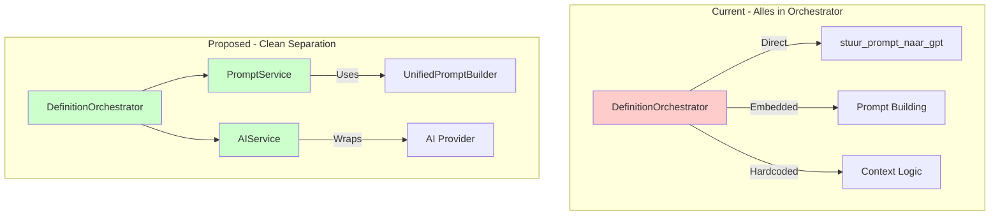
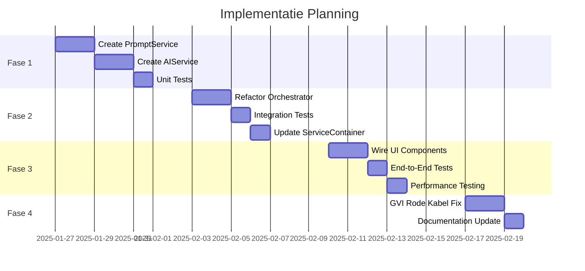

# Definition Generator Refactoring Proposal

**Versie**: 1.0
**Datum**: 2025-08-26
**Auteur**: Winston (Architect)
**Status**: Voorstel ter Review

---

## Executive Summary

Dit document beschrijft een pragmatische refactoring van de definitie generator met minimale breaking changes. De focus ligt op het scheiden van concerns zonder de UI te breken, terwijl we de architectuur voorbereiden op toekomstige verbeteringen zoals de GVI "Rode Kabel" fix.

**Kernprincipe**: Extract zonder te breken - gradual migration naar clean architecture.

---

## 1. Probleemstelling

### 1.1 Huidige Situatie

De `DefinitionOrchestrator._generate_definition()` methode bevat momenteel alle logica:

```python
async def _generate_definition(self, context: ProcessingContext) -> Definition:
    # 60+ regels code die:
    # - Prompt building doet
    # - Direct GPT aanroept
    # - Context transformeert
    # - Error handling doet
    # - Alles in één methode!
```

### 1.2 Concrete Problemen

1. **God Method Anti-pattern**: Één methode doet te veel
2. **Hardcoded Dependencies**: Direct imports in methode body
3. **Geen Abstractie**: Direct `stuur_prompt_naar_gpt` aanroep
4. **Moeilijk Testbaar**: Kan niet geïsoleerd getest worden
5. **GVI Blokkade**: Rode Kabel fix niet mogelijk zonder grote refactor

### 1.3 Impact

- **11% test coverage** (target: 80%)
- **8-12 seconden response tijd** (target: <5s)
- **Geen feedback loop** (GVI Rode Kabel)
- **Maintenance nightmare**: Elke wijziging is riskant

---

## 2. Voorgestelde Oplossing

### 2.1 Architectuur Overzicht



### 2.2 Nieuwe Services

#### 2.2.1 PromptService

**Verantwoordelijkheid**: Alle prompt-gerelateerde logica

```python
class PromptService:
    """Service voor het bouwen en beheren van AI prompts."""

    def __init__(self, config: UnifiedGeneratorConfig):
        self.config = config
        self.prompt_builder = UnifiedPromptBuilder(config)
        self.regeneration_service = RegenerationService(self.prompt_builder)

    def build_generation_prompt(
        self,
        request: GenerationRequest,
        feedback_history: list = None  # GVI Rode Kabel support!
    ) -> PromptResult:
        """Bouw een prompt voor definitie generatie.

        Returns:
            PromptResult met prompt text en metadata (tokens, strategy, etc)
        """
        # Extract van huidige _generate_definition logica
        enriched_context = self._create_enriched_context(request)

        # Check voor regeneration context
        if self.regeneration_service.get_active_context():
            feedback_history = self.regeneration_service.get_feedback_history()

        prompt = self.prompt_builder.build_prompt(
            request.begrip,
            enriched_context,
            feedback_history=feedback_history
        )

        return PromptResult(
            text=prompt,
            token_count=self._estimate_tokens(prompt),
            strategy_used=self.prompt_builder.get_strategy_name(),
            has_feedback=bool(feedback_history)
        )

    def _create_enriched_context(self, request: GenerationRequest) -> EnrichedContext:
        """Transform request naar enriched context."""
        # Verplaats logic uit orchestrator
```

#### 2.2.2 AIService

**Verantwoordelijkheid**: Alle AI provider interactie

```python
class AIService:
    """Service voor AI model interactie met provider abstractie."""

    def __init__(
        self,
        provider: str = "openai",
        api_key: str = None,
        model: str = "gpt-4",
        monitoring_service: MonitoringService = None
    ):
        self.provider = provider
        self.api_key = api_key or os.getenv("OPENAI_API_KEY")
        self.model = model
        self.monitoring = monitoring_service

    async def generate_text(
        self,
        prompt: str,
        temperature: float = 0.7,
        max_tokens: int = 500
    ) -> GenerationResult:
        """Genereer tekst via AI provider.

        Returns:
            GenerationResult met generated text en metadata
        """
        start_time = time.time()

        try:
            # Provider-specific implementation
            if self.provider == "openai":
                response = await self._call_openai(prompt, temperature, max_tokens)
            else:
                raise ValueError(f"Unsupported provider: {self.provider}")

            # Track metrics
            if self.monitoring:
                self.monitoring.track_generation(
                    provider=self.provider,
                    model=self.model,
                    prompt_tokens=response.prompt_tokens,
                    completion_tokens=response.completion_tokens,
                    duration=time.time() - start_time
                )

            return GenerationResult(
                text=response.text,
                tokens_used=response.total_tokens,
                model=self.model,
                finish_reason=response.finish_reason
            )

        except Exception as e:
            logger.error(f"AI generation failed: {e}")
            raise AIServiceError(f"Generation failed: {e}")

    async def _call_openai(self, prompt: str, temperature: float, max_tokens: int):
        """OpenAI specific implementation."""
        # Verplaats stuur_prompt_naar_gpt logic hier
        # Met retry logic en better error handling
```

### 2.3 Refactored Orchestrator

```python
class DefinitionOrchestrator:
    """Orchestreert definitie generatie met clean dependencies."""

    def __init__(
        self,
        config: OrchestratorConfig,
        repository: DefinitionRepositoryInterface,
        validator: DefinitionValidatorInterface,
        cleaner: CleaningServiceInterface,
        prompt_service: PromptService,  # NEW
        ai_service: AIService,           # NEW
        web_lookup: WebLookupServiceInterface | None = None,
    ):
        # Existing services
        self.config = config
        self.repository = repository
        self.validator = validator
        self.cleaner = cleaner
        self.web_lookup = web_lookup

        # New clean services
        self.prompt_service = prompt_service
        self.ai_service = ai_service

    async def _generate_definition(self, context: ProcessingContext) -> Definition:
        """Genereer definitie - nu CLEAN!"""
        try:
            # Stap 1: Bouw prompt
            prompt_result = self.prompt_service.build_generation_prompt(
                context.request,
                feedback_history=context.feedback_history
            )

            # Stap 2: Genereer via AI
            generation_result = await self.ai_service.generate_text(
                prompt_result.text,
                temperature=self.config.temperature,
                max_tokens=self.config.max_tokens
            )

            # Stap 3: Clean de output
            cleaned_text = self.cleaner.clean(generation_result.text)

            # Stap 4: Creëer Definition object
            return Definition(
                begrip=context.request.begrip,
                definitie=cleaned_text,
                context=context.request.context,
                domein=context.request.domein,
                metadata={
                    "model": generation_result.model,
                    "tokens_used": generation_result.tokens_used,
                    "prompt_strategy": prompt_result.strategy_used,
                    "has_feedback": prompt_result.has_feedback,
                    "generation_time": datetime.now(timezone.utc).isoformat(),
                }
            )

        except Exception as e:
            logger.error(f"Definition generation failed: {e}")
            raise
```

---

## 3. Implementatie Strategie

### 3.1 Gefaseerde Aanpak



### 3.2 Migration Path

1. **Fase 1**: Services creëren NAAST bestaande code
   - Geen breaking changes
   - Services kunnen getest worden in isolatie

2. **Fase 2**: Orchestrator refactoren met feature flag
   ```python
   if self.config.use_new_services:
       return await self._generate_definition_v2(context)
   else:
       return await self._generate_definition(context)  # Legacy
   ```

3. **Fase 3**: Gradual rollout
   - 10% traffic naar nieuwe implementatie
   - Monitor metrics
   - Increase tot 100%

4. **Fase 4**: Legacy cleanup
   - Remove oude code
   - Remove feature flags

---

## 4. Testing Strategie

### 4.1 Unit Tests per Service

```python
# test_prompt_service.py
class TestPromptService:
    def test_build_generation_prompt(self):
        service = PromptService(config)
        request = GenerationRequest(begrip="test", categorie="ENT")

        result = service.build_generation_prompt(request)

        assert result.text
        assert result.token_count > 0
        assert result.strategy_used == "unified"

    def test_feedback_integration(self):
        service = PromptService(config)
        feedback = [{"definition": "old", "violations": ["TEST-01"]}]

        result = service.build_generation_prompt(request, feedback)

        assert result.has_feedback
        assert "Eerdere pogingen" in result.text

# test_ai_service.py
class TestAIService:
    @patch('openai.ChatCompletion.create')
    def test_generate_text(self, mock_openai):
        mock_openai.return_value = mock_response
        service = AIService()

        result = await service.generate_text("test prompt")

        assert result.text
        assert result.tokens_used > 0
```

### 4.2 Integration Tests

```python
class TestDefinitionGeneration:
    async def test_full_generation_flow(self):
        # Setup services
        prompt_service = PromptService(config)
        ai_service = AIService()
        orchestrator = DefinitionOrchestrator(
            prompt_service=prompt_service,
            ai_service=ai_service
        )

        # Test request
        request = GenerationRequest(
            begrip="Verdachte",
            context="NP",
            categorie="ENT"
        )

        # Generate
        response = await orchestrator.create_definition(request)

        # Assert
        assert response.success
        assert response.definition
        assert "Verdachte" in response.definition.definitie
```

---

## 5. Risico's en Mitigatie

| Risico | Impact | Kans | Mitigatie |
|--------|--------|------|-----------|
| Breaking UI changes | Hoog | Laag | Feature flags, parallel run |
| Performance degradatie | Medium | Medium | Caching, monitoring |
| Test coverage gaps | Medium | Hoog | TDD approach, coverage tools |
| Feedback loop complexity | Laag | Medium | Incremental implementation |

---

## 6. Success Metrics

### 6.1 Technische Metrics

- **Test Coverage**: 11% → 60% (fase 1-3) → 80% (volledig)
- **Response Time**: 8-12s → <5s
- **Code Complexity**: Cyclomatic complexity < 10 per methode
- **Coupling**: Loose coupling tussen services

### 6.2 Business Metrics

- **First-Time-Right**: 60% → 90% (met feedback loop)
- **API Kosten**: -30% door betere prompts
- **User Satisfaction**: Snellere responses

---

## 7. Beslispunten

### 7.1 Goedkeuring Nodig Voor:

1. **Service Extractie Aanpak**: Akkoord met gefaseerde extractie?
2. **Feature Flag Strategie**: Gebruik van feature flags voor migration?
3. **Testing First**: Eerst tests schrijven, dan implementatie?
4. **API Abstractie**: Multiple provider support direct of later?

### 7.2 Alternatieven Overwogen

1. **Big Bang Refactor**: Verworpen - te riskant
2. **Alleen Orchestrator Fix**: Verworpen - lost onderliggende problemen niet op
3. **Complete Rewrite**: Verworpen - te veel werk, breaking changes

---

## 8. Conclusie

Deze refactoring biedt:
- ✅ **Minimale breaking changes**
- ✅ **Testbare architectuur**
- ✅ **GVI ready** (Rode Kabel fix mogelijk)
- ✅ **Gradual migration path**
- ✅ **Performance verbeteringen**

**Aanbeveling**: Start met Fase 1 (PromptService + AIService) als proof of concept.

---

## Appendix A: Code Locaties

- Huidige Orchestrator: `/src/services/definition_orchestrator.py`
- Prompt Builder: `/src/services/definition_generator_prompts.py`
- GPT Functie: `/src/prompt_builder/prompt_builder.py`
- Tests: `/tests/services/`

## Appendix B: Dependencies

```python
# requirements.txt additions
pytest-asyncio>=0.21.0  # Voor async testing
pytest-cov>=4.1.0      # Voor coverage reports
responses>=0.23.0      # Voor API mocking
```
