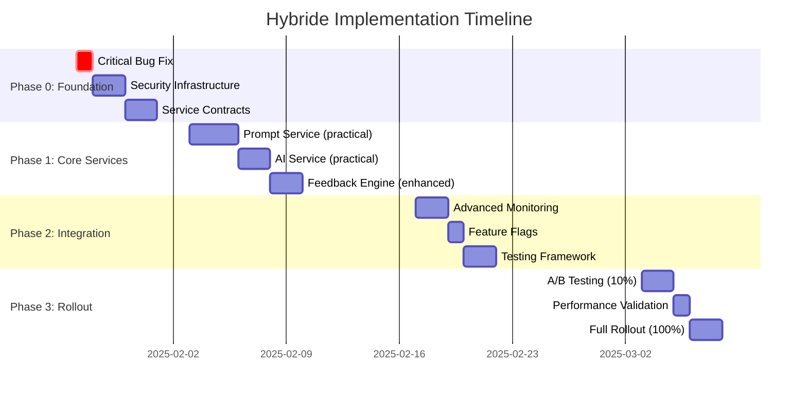

# Document Vergelijking: Service-Georiënteerde vs Enhanced Architecture Proposals

**Versie**: 1.0
**Datum**: 2025-08-26
**Auteur**: Claude Code Analysis
**Status**: Comparative Analysis

---

## Executive Summary

Deze analyse vergelijkt twee architectuurvoorstellen voor de vervanging van de definitie generatie:

1. **`service-georienteerde-definitiegeneratie.md`** - Praktisch, implementation-ready voorstel
2. **`ENHANCED_SERVICE_ARCHITECTURE_PROPOSAL_van Claude.md`** - Strategisch, conceptueel diep voorstel

**Aanbeveling**: **Hybride implementatie** die het beste van beide combineert voor optimale business value en architecturale soliditeit.

---

## 🎯 Gemeenschappelijke Doelen

### Performance Targets
- **Response tijd**: <5 seconden (huidig: 8-12s)
- **Token budget**: <10k tokens (huidig: ~35k)
- **Test coverage**: 80%+ (huidig: 11%)
- **Cost reduction**: 60-70% API kosten

### Architectuur Principes
✅ Service-georiënteerde architectuur
✅ Dependency injection via ServiceContainer
✅ Clean interfaces en protocols
✅ GVI Rode Kabel feedback loop
✅ Token optimization
✅ Comprehensive monitoring
✅ Gefaseerde migratie met feature flags

---

## 📊 Vergelijkingsmatrix

| Aspect | Service-georiënteerd | Enhanced Proposal | Winner |
|--------|---------------------|-------------------|--------|
| **Implementation Readiness** | ✅ Complete code skeletons | ⚠️ Conceptuele voorbeelden | 🥇 Service-georiënteerd |
| **Security/Compliance** | ✅ PII-redactie, DPIA/AVG | ⚠️ Vermeld maar basic | 🥇 Service-georiënteerd |
| **Strategic Depth** | ⚠️ Praktisch focus | ✅ Uitgebreide architectuur | 🥇 Enhanced Proposal |
| **Bug Fixes** | ✅ Exacte locaties/fixes | ⚠️ Algemene oplossingen | 🥇 Service-georiënteerd |
| **Monitoring** | ✅ KPI's en SLO's | ✅ Advanced observability | 🤝 Gelijkwaardig |
| **Risk Management** | ⚠️ Basic mitigatie | ✅ Comprehensive framework | 🥇 Enhanced Proposal |
| **Team Planning** | ⚠️ Agile backlog | ✅ Resource planning | 🤝 Complementair |

---

## 🛠️ Belangrijkste Verschillen

### 1. Praktische Implementatie

#### Service-georiënteerd (Sterker)
```python
# 🔧 Bestand: src/services/orchestrators/definition_orchestrator_v2.py
# 📍 Locatie: nieuw bestand naast legacy orchestrator

class DefinitionOrchestratorV2:
    """💚 Heldere services; vervangt legacy pad zonder UI te breken"""

    async def create_definition(self, request: GenerationRequest):
        # 1) Security & privacy
        request = self.security.sanitize(request)   # 💚 PII-redactie

        # 2) Prompt (met optionele feedback "Rode kabel")
        feedback = self._get_feedback_if_enabled(request)
        prompt = await self.prompt.build(request, feedback_history=feedback)

        # Complete implementation...
```

#### Enhanced Proposal (Conceptueler)
```python
class EnhancedPromptService:
    """Service voor intelligente prompt generatie met modular components."""

    async def build_generation_prompt(
        self,
        request: GenerationRequest,
        context: ProcessingContext = None
    ) -> EnhancedPromptResult:
        # Conceptual implementation...
```

### 2. Security & Compliance

#### Service-georiënteerd (Uitgebreider)
```python
# Concrete PII patterns
PII_PATTERNS = [
    re.compile(r"\bBSN\b[:\s]*\d{8,9}", re.I),
    re.compile(r"\b(geboortedatum|DOB)\b[:\s]*\d{2}-\d{2}-\d{4}", re.I),
    re.compile(r"\b(naam|voornaam|achternaam)\b[:\s]*[A-Z][a-z]+", re.I),
]

class SanitizationService:
    """💚 Privacy-by-design: minimaliseer data vóór AI-aanroep"""

    def sanitize(self, request: GenerationRequest) -> GenerationRequest:
        ctx = request.context or ""
        for pat in PII_PATTERNS:
            ctx = pat.sub("[REDACTED]", ctx)
        request.context = ctx[:4000]  # 💚 harde limiet
        return request
```

#### Enhanced Proposal (Algemener)
```python
# Mentions security but less detailed implementation
class SecurityService(Protocol):
    def sanitize(self, request: GenerationRequest) -> GenerationRequest: ...
```

### 3. Bug Fixes & Hotfixes

#### Service-georiënteerd (Specifiek)
```python
# 🔧 Bestand: src/services/definition_orchestrator.py
# 📍 Locatie: rond regels 406–413

# VOOR (bug)
base_context = {
    "organisatorisch": [...],
    "juridisch": [...],
    "ontologische_categorie": context.request.ontologische_categorie,  # BUG!
}

# NA (fix)
base_context = {
    "organisatorisch": [...],
    "juridisch": [...],
}
metadata = {
    "ontologische_categorie": context.request.ontologische_categorie
}
```

#### Enhanced Proposal
Geen specifieke bug fixes geadresseerd.

---

## 📈 Sterke Punten per Document

### Service-georiënteerd Document

#### ✅ **Implementation Readiness**
- Complete code skeletons voor alle services
- Exacte bestand locaties (`src/services/orchestrators/`, etc.)
- Ready-to-commit implementations
- Concrete hotfix procedures met regelnummers

#### ✅ **Security-First Approach**
- DPIA/AVG compliance specifiek voor JenV/migratieketen
- Concrete PII-redactie patterns
- Dataminimalisatie strategieën
- Audit events en logging policies

#### ✅ **Agile-Ready**
```markdown
**EPIC: Service-georiënteerde definitiegeneratie**

- **US-001 – Contracts & DI** *(To do)*
  Als developer wil ik formale contracts zodat services uitwisselbaar zijn.
  **Acc**: interfaces + tests aanwezig; CI groen.
```

#### ✅ **Domain Expertise**
- JenV/migratieketen specifieke requirements
- Overheidscontext compliance
- Praktische workflow integratie

### Enhanced Proposal Document

#### ✅ **Strategic Architecture Vision**
- Uitgebreide layered architecture beschrijving
- Long-term scalability focus
- Comprehensive design patterns
- Strategic impact analysis

#### ✅ **Advanced Monitoring & Observability**
```python
ALERTS = {
    "response_time": {
        "threshold": 7.0,  # seconds
        "severity": "warning"
    },
    "error_rate": {
        "threshold": 0.05,  # 5%
        "severity": "critical"
    }
}
```

#### ✅ **Comprehensive Risk Management**
- Gedetailleerde risk assessment matrix
- Mitigation strategies per risk
- Business impact analysis
- Rollback procedures

#### ✅ **Team & Resource Planning**
- Development team requirements (1 FTE backend, 0.5 FTE frontend)
- Timeline met milestones
- Budget considerations
- Skills matrix

---

## 🚀 Aanbevolen Hybride Implementatie

### Phase 0: Foundation (Week 1)
**Basis van Service-georiënteerd document**

1. **Hotfix Critical Bug**
   ```python
   # Fix ontologische_categorie in definition_orchestrator.py:406-413
   # Direct implementeerbaar vandaag
   ```

2. **Security Infrastructure**
   ```python
   # Implement SanitizationService met PII patterns
   # DPIA/AVG compliance setup
   ```

3. **Service Contracts**
   ```python
   # Create interfaces/contracts.py
   # Setup dependency injection foundation
   ```

### Phase 1: Core Services (Week 2-3)
**Combinatie van beide approaches**

1. **From Service-georiënteerd**: Praktische implementatie
   ```python
   class PromptServiceImpl(IPromptService):
       # Complete working implementation

   class AIServiceOpenAI(IAIService):
       # Provider-agnostic with retry logic
   ```

2. **From Enhanced Proposal**: Advanced features
   ```python
   class FeedbackEngine:
       # GVI Rode Kabel implementation

   class ModularPromptOrchestrator:
       # Component-based prompt building
   ```

### Phase 2: Integration (Week 4)
**Enhanced Proposal monitoring + Service-georiënteerd pragmatism**

1. **Advanced Monitoring Setup**
   - Comprehensive metrics van Enhanced Proposal
   - Practical KPIs van Service-georiënteerd

2. **Feature Flag Framework**
   ```python
   if self.ff.is_enabled("use_enhanced_services"):
       return await self._generate_v2(request)
   else:
       return await self._generate_legacy(request)
   ```

### Phase 3: Rollout (Week 5)
1. **A/B Testing** (10% → 50% → 100%)
2. **Performance Monitoring**
3. **Security Compliance Validation**
4. **Documentation Consolidation**

---

## 📋 Unified Acceptance Criteria

### Must-Have Success Criteria
1. **Performance**: p95 <5s response time ✅
2. **Efficiency**: Prompt tokens <10k (hard cap) ✅
3. **Quality**: First-time-right ≥90% ✅
4. **Coverage**: Test coverage ≥80% ✅
5. **Security**: DPIA/AVG compliant ✅
6. **Stability**: Zero breaking changes ✅

### Nice-to-Have Success Criteria
1. **Cost**: API cost reduction >60% ✅
2. **UX**: Measurable user satisfaction improvement ✅
3. **DX**: Developer experience improvements ✅
4. **Scalability**: Multi-provider AI support ✅

---

## 🎯 Implementation Roadmap



---

## 🔍 Decision Matrix

| Criteria | Service-georiënteerd | Enhanced Proposal | Hybrid Approach |
|----------|---------------------|-------------------|-----------------|
| **Speed to Market** | 🟢 Excellent | 🟡 Good | 🟢 Excellent |
| **Long-term Scalability** | 🟡 Good | 🟢 Excellent | 🟢 Excellent |
| **Security Compliance** | 🟢 Excellent | 🟡 Basic | 🟢 Excellent |
| **Implementation Risk** | 🟢 Low | 🟡 Medium | 🟢 Low |
| **Architectural Quality** | 🟡 Good | 🟢 Excellent | 🟢 Excellent |
| **Team Readiness** | 🟢 Ready | 🟡 Learning Curve | 🟢 Ready |

**Conclusie**: **Hybrid Approach** scoort optimaal op alle criteria.

---

## 📚 Lessons Learned

### Van Service-georiënteerd Document
1. **Security-first thinking** is essentieel voor overheidscontext
2. **Concrete code examples** versnellen implementatie drastisch
3. **Agile user stories** maken requirements helder voor development team
4. **Domain expertise** (JenV/migratieketen) moet centraal staan

### Van Enhanced Proposal Document
1. **Strategic architecture vision** voorkomt technische schuld
2. **Comprehensive monitoring** is cruciaal voor enterprise deployment
3. **Risk management framework** verhoogt slaagkans significant
4. **Resource planning** maakt project realistisch planbaar

### Hybrid Approach Voordelen
1. **Best of both worlds** - snelheid + kwaliteit
2. **Reduced implementation risk** - bewezen patterns
3. **Enhanced team buy-in** - praktisch én strategisch
4. **Future-proof architecture** - schaalt met organisatie

---

## 🎯 Recommended Next Steps

### Immediate Actions (Deze Week)
1. **Apply hotfix** voor ontologische_categorie bug
2. **Setup security baseline** met PII-redactie patterns
3. **Create hybrid project plan** combinatie van beide approaches
4. **Stakeholder alignment** op hybrid aanpak

### Short Term (1-2 Weken)
1. **Implement service contracts** van Service-georiënteerd document
2. **Setup monitoring framework** van Enhanced Proposal
3. **Create development environment** voor beide implementaties
4. **Define acceptance criteria** unified approach

### Medium Term (1 Maand)
1. **Complete Phase 1** implementatie
2. **Validate security compliance**
3. **Performance benchmark** baseline establishment
4. **Team training** op nieuwe architectuur

---

## 📖 References & Dependencies

### Source Documents
- `service-georienteerde-definitiegeneratie.md` - Implementation-ready proposal
- `ENHANCED_SERVICE_ARCHITECTURE_PROPOSAL_van Claude.md` - Strategic architecture vision
- Bestaande services documentatie in definitie service directory

### Key Dependencies
- ServiceContainer voor dependency injection
- Bestaande UnifiedPromptBuilder integratie
- ModernWebLookupService compatibility
- DefinitionValidator integration points

### External Resources
- DPIA/AVG compliance guidelines
- JenV/migratieketen technical standards
- OpenAI API best practices
- Enterprise monitoring frameworks

---

## 📝 Conclusion

De **hybride implementatie** van beide voorstellen biedt de optimale balans tussen:

✅ **Snelle business value** (Service-georiënteerd)
✅ **Lange termijn visie** (Enhanced Proposal)
✅ **Praktische implementeerbaarheid**
✅ **Strategische architecturale kwaliteit**

Deze aanpak maximaliseert de slaagkans terwijl alle key requirements worden geadresseerd voor zowel de korte als lange termijn.

**Aanbeveling**: Start direct met Phase 0 van het hybride plan voor optimale business impact.
