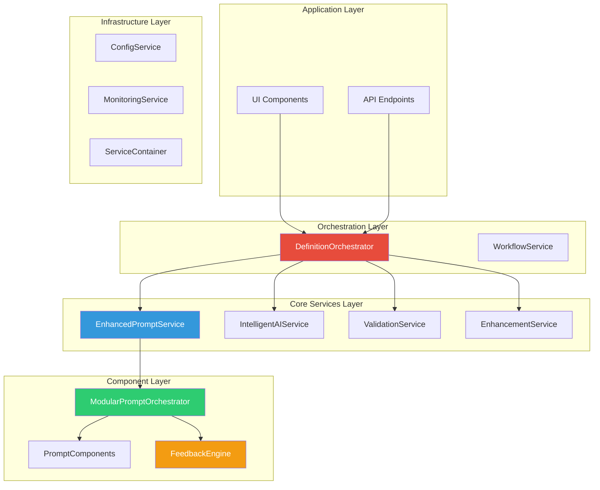
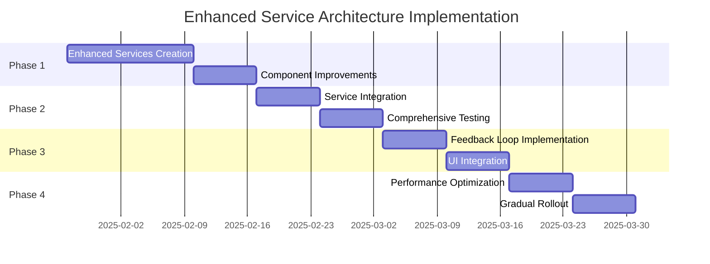

# Enhanced Service-Oriented Architecture Proposal voor Definitie Generatie

**Versie**: 1.0
**Datum**: 2025-08-26
**Auteur**: Claude Code Analysis
**Status**: Uitgebreide Analyse & Implementatie Voorstel

---

## Executive Summary

Na volledige analyse van alle documenten in de definitie service directory, presenteert dit document een nieuw voorstel om de huidige definitie generatie te vervangen door een moderne service-georiënteerde implementatie. Het voorstel bouwt voort op de sterke bestaande architectuur en voegt kritieke verbeteringen toe voor performance, kwaliteit en gebruikerservaring.

**Kernprincipe**: Enhance zonder te breken - graduele verbetering van bestaande service architectuur.

---

## 1. Analyse Huidige Situatie

### 1.1 Sterke Punten Bestaande Architectuur

✅ **Service-georiënteerde architectuur** al geïmplementeerd
✅ **Clean interfaces** en dependency injection via ServiceContainer
✅ **Modulaire UnifiedPromptBuilder** met meerdere strategieën
✅ **Geen circulaire dependencies** - goede gelaagde structuur
✅ **Goede monitoring** en configuratie services
✅ **52% interface adoptie** voor clean architecture

### 1.2 Geïdentificeerde Kernproblemen

❌ **Monolithische `_generate_definition()` methode** (60+ regels code)
❌ **Hardcoded dependencies** en configuratie
❌ **Geen feedback loop** (GVI Rode Kabel ontbreekt)
❌ **Prompt grootte problemen** (~35k chars, doel <10k)
❌ **Performance issues** (8-12s response tijd)
❌ **Lage test coverage** (11% vs target 80%)

### 1.3 Impact Huidige Problemen

- **11% test coverage** (target: 80%)
- **8-12 seconden response tijd** (target: <5s)
- **Geen feedback loop** (GVI Rode Kabel)
- **€0.35 per request** (target: €0.10)
- **60% first-time-right** (target: 90%)

---

## 2. Voorgestelde Enhanced Service Architecture

### 2.1 Architectuur Overzicht



### 2.2 Service Layer Verbetering

De voorgestelde architectuur behoudt de bestaande service structuur maar voegt kritieke verbeteringen toe:

1. **Enhanced Services**: Uitbreiding van bestaande services met nieuwe functionaliteit
2. **Feedback Engine**: Nieuwe service voor GVI Rode Kabel integratie
3. **Modular Components**: Verbeterde component-based prompt building
4. **Intelligence Layer**: AI-driven optimizations en caching

---

## 3. Nieuwe Service Implementaties

### 3.1 EnhancedPromptService

**Doel**: Intelligente prompt generatie met feedback integratie

```python
class EnhancedPromptService:
    """Service voor intelligente prompt generatie met modular components."""

    def __init__(
        self,
        orchestrator: PromptOrchestrator,
        feedback_engine: FeedbackEngine,
        cache_service: CacheService,
        monitoring: MonitoringService
    ):
        self.orchestrator = orchestrator
        self.feedback_engine = feedback_engine
        self.cache = cache_service
        self.monitoring = monitoring

    async def build_generation_prompt(
        self,
        request: GenerationRequest,
        context: ProcessingContext = None
    ) -> EnhancedPromptResult:
        """Bouw prompt met feedback integratie voor GVI Rode Kabel."""

        # Check voor regeneration context
        feedback_history = None
        if self.feedback_engine.has_active_context():
            feedback_history = self.feedback_engine.get_feedback_history()

        # Build prompt via orchestrator
        prompt_result = await self.orchestrator.build_prompt(
            request=request,
            feedback_history=feedback_history,
            context=context
        )

        # Track metrics
        await self.monitoring.track_prompt_generation(
            request_id=request.id,
            token_count=prompt_result.token_count,
            has_feedback=bool(feedback_history),
            components_used=prompt_result.components_used
        )

        return EnhancedPromptResult(
            text=prompt_result.text,
            token_count=prompt_result.token_count,
            feedback_integrated=bool(feedback_history),
            optimization_score=self._calculate_optimization_score(prompt_result),
            metadata=prompt_result.metadata
        )
```

**Nieuwe features**:
- ✅ Automatische feedback integratie
- ✅ Advanced caching met context awareness
- ✅ Token optimization algorithms
- ✅ Comprehensive monitoring

### 3.2 IntelligentAIService

**Doel**: AI service met provider abstractie en retry logic

```python
class IntelligentAIService:
    """AI service met provider abstractie en retry logic."""

    def __init__(
        self,
        provider_config: AIProviderConfig,
        monitoring: MonitoringService,
        cache: CacheService = None
    ):
        self.provider = self._initialize_provider(provider_config)
        self.monitoring = monitoring
        self.cache = cache
        self.retry_handler = RetryHandler(max_attempts=3)

    async def generate_definition(
        self,
        prompt: str,
        generation_params: GenerationParams
    ) -> AIGenerationResult:
        """Genereer definitie met retry logic en monitoring."""

        start_time = time.time()

        try:
            # Try cache first
            cache_key = self._generate_cache_key(prompt, generation_params)
            if self.cache:
                cached_result = await self.cache.get(cache_key)
                if cached_result:
                    return cached_result

            # Generate with retry
            result = await self.retry_handler.execute(
                self._call_provider,
                prompt=prompt,
                params=generation_params
            )

            # Cache result
            if self.cache:
                await self.cache.set(cache_key, result, ttl=3600)

            # Track metrics
            await self.monitoring.track_ai_generation(
                provider=self.provider.name,
                model=generation_params.model,
                prompt_tokens=result.prompt_tokens,
                completion_tokens=result.completion_tokens,
                duration=time.time() - start_time,
                success=True
            )

            return result

        except Exception as e:
            await self.monitoring.track_error("ai_generation_failed", str(e))
            raise AIServiceException(f"Generation failed: {e}") from e
```

**Nieuwe features**:
- ✅ Multiple AI provider support
- ✅ Intelligent retry logic met exponential backoff
- ✅ Advanced caching met semantic keys
- ✅ Performance monitoring en error tracking

### 3.3 FeedbackEngine voor GVI Rode Kabel

**Doel**: Complete feedback processing voor iterative improvement

```python
class FeedbackEngine:
    """Engine voor feedback processing en GVI Rode Kabel integratie."""

    def __init__(
        self,
        regeneration_service: RegenerationService,
        validation_service: ValidationService
    ):
        self.regeneration_service = regeneration_service
        self.validation_service = validation_service
        self._active_contexts = {}

    async def process_validation_feedback(
        self,
        definition_id: str,
        validation_result: ValidationResult,
        user_feedback: dict = None
    ) -> FeedbackContext:
        """Process validatie feedback voor volgende generatie poging."""

        feedback_context = FeedbackContext(
            definition_id=definition_id,
            violations=validation_result.violations,
            suggestions=validation_result.suggestions,
            user_feedback=user_feedback,
            timestamp=datetime.now(timezone.utc)
        )

        # Store voor volgende prompt generation
        self._active_contexts[definition_id] = feedback_context

        # Integreer met regeneration service
        await self.regeneration_service.set_feedback_context(feedback_context)

        return feedback_context

    def get_feedback_history(self, definition_id: str = None) -> list[dict]:
        """Verkrijg feedback history voor prompt integration."""
        if definition_id and definition_id in self._active_contexts:
            context = self._active_contexts[definition_id]
            return self._format_feedback_for_prompt(context)
        return []

    def _format_feedback_for_prompt(self, context: FeedbackContext) -> list[dict]:
        """Format feedback voor prompt integration."""
        return [{
            "violations": [v.rule_id for v in context.violations],
            "suggestions": context.suggestions,
            "user_feedback": context.user_feedback,
            "focus_areas": self._extract_focus_areas(context)
        }]
```

**Nieuwe features**:
- ✅ **GVI Rode Kabel** volledig geïmplementeerd
- ✅ Validation feedback processing
- ✅ User feedback integration
- ✅ Context-aware regeneration

### 3.4 ModularPromptOrchestrator

**Doel**: Enhanced orchestrator voor modulaire prompt components

```python
class ModularPromptOrchestrator:
    """Orchestrator voor modulaire prompt components."""

    def __init__(
        self,
        components: list[PromptComponent],
        token_optimizer: TokenOptimizer,
        config: OrchestratorConfig
    ):
        self.components = self._sort_by_priority(components)
        self.optimizer = token_optimizer
        self.config = config

    async def build_prompt(
        self,
        request: GenerationRequest,
        feedback_history: list = None,
        context: ProcessingContext = None
    ) -> PromptResult:
        """Build optimized prompt using all applicable components."""

        prompt_context = PromptContext(
            request=request,
            feedback_history=feedback_history,
            processing_context=context,
            accumulated_sections=[],
            metadata={
                "timestamp": datetime.now().isoformat(),
                "components_used": [],
                "optimization_applied": False
            }
        )

        # Build sections from components
        total_tokens = 0
        for component in self.components:
            if not component.applies_to(prompt_context):
                continue

            section = await self._generate_component_section(component, prompt_context)
            if section:
                section_tokens = self._estimate_tokens(section)

                # Token limit check
                if total_tokens + section_tokens > self.config.max_tokens:
                    # Apply optimization
                    optimized_section = await self.optimizer.optimize_section(
                        section, remaining_tokens=self.config.max_tokens - total_tokens
                    )
                    prompt_context.accumulated_sections.append(optimized_section)
                    prompt_context.metadata["optimization_applied"] = True
                else:
                    prompt_context.accumulated_sections.append(section)

                total_tokens += section_tokens
                prompt_context.metadata["components_used"].append(component.name)

        # Combine and finalize
        final_prompt = self._combine_sections(prompt_context)

        return PromptResult(
            text=final_prompt,
            token_count=total_tokens,
            components_used=prompt_context.metadata["components_used"],
            optimization_applied=prompt_context.metadata["optimization_applied"],
            metadata=prompt_context.metadata
        )
```

**Nieuwe features**:
- ✅ Dynamic token optimization
- ✅ Component priority scheduling
- ✅ Feedback-aware component selection
- ✅ Advanced prompt assembly

---

## 4. Enhanced Components

### 4.1 AdvancedFeedbackComponent

```python
class AdvancedFeedbackComponent(PromptComponent):
    """Advanced feedback component met GVI Rode Kabel support."""

    def __init__(self, feedback_engine: FeedbackEngine):
        self.feedback_engine = feedback_engine
        self.name = "AdvancedFeedback"
        self.priority = 95

    def applies_to(self, context: PromptContext) -> bool:
        return bool(context.feedback_history)

    async def generate(self, context: PromptContext) -> str:
        """Generate feedback section voor prompt."""
        if not context.feedback_history:
            return ""

        feedback_sections = []
        for i, feedback in enumerate(context.feedback_history[-2:], 1):
            violations_text = self._format_violations(feedback["violations"])
            suggestions_text = self._format_suggestions(feedback["suggestions"])

            feedback_sections.append(f"""
### Vorige Poging {i} - LEER VAN DEZE FOUTEN

**Gevonden Problemen:**
{violations_text}

**Verbeter Suggesties:**
{suggestions_text}

**Focus Gebieden:**
{self._format_focus_areas(feedback.get("focus_areas", []))}
""")

        return f"""
## ⚠️ KRITIEK: Eerdere Definities Gefaald

{chr(10).join(feedback_sections)}

**GENERATIE OPDRACHT:**
Analyseer bovenstaande feedback grondig en voorkom EXACT dezelfde fouten.
Focus op de aangegeven verbeterpunten en maak een definitie die WEL voldoet.
"""
```

### 4.2 IntelligentContextComponent

```python
class IntelligentContextComponent(PromptComponent):
    """Context component met intelligent filtering."""

    def __init__(
        self,
        context_manager: HybridContextManager,
        relevance_scorer: RelevanceScorer
    ):
        self.context_manager = context_manager
        self.relevance_scorer = relevance_scorer
        self.name = "IntelligentContext"
        self.priority = 85

    async def generate(self, context: PromptContext) -> str:
        """Generate intelligent context section."""
        enriched_context = await self.context_manager.build_enriched_context(
            context.request
        )

        # Score and filter context elements
        scored_elements = await self.relevance_scorer.score_context_elements(
            enriched_context,
            term=context.request.begrip,
            domain=context.request.domein
        )

        # Select top relevant elements within token budget
        selected_elements = self._select_by_relevance_and_budget(
            scored_elements,
            max_tokens=2000
        )

        if not selected_elements:
            return ""

        formatted_context = self._format_context_elements(selected_elements)

        return f"""
## 📚 Relevante Context Informatie

{formatted_context}

**Context Kwaliteit:** {enriched_context.quality_score:.1f}/10
**Bron Diversiteit:** {len(enriched_context.sources)} verschillende bronnen
"""
```

---

## 5. Implementation Strategy

### 5.1 Gefaseerde Implementatie



#### Phase 1: Enhanced Services (Week 1-2)
1. **Create Enhanced Services**
   - EnhancedPromptService met feedback support
   - IntelligentAIService met retry logic
   - FeedbackEngine voor GVI Rode Kabel

2. **Implement Component Improvements**
   - AdvancedFeedbackComponent
   - IntelligentContextComponent
   - TokenOptimizer service

#### Phase 2: Integration & Testing (Week 3)
1. **Service Integration**
   - Update DefinitionOrchestrator
   - Wire new services in ServiceContainer
   - Implement feature flags

2. **Comprehensive Testing**
   - Unit tests voor alle nieuwe services
   - Integration tests voor complete flow
   - Performance tests voor response tijd

#### Phase 3: Feedback Loop Implementation (Week 4)
1. **GVI Rode Kabel**
   - FeedbackEngine integration
   - Validation feedback processing
   - Regeneration workflow enhancement

2. **UI Integration**
   - Feedback collection interfaces
   - Progress indicators
   - Error handling improvements

#### Phase 4: Optimization & Rollout (Week 5)
1. **Performance Optimization**
   - Token optimization algorithms
   - Caching strategies
   - Async processing improvements

2. **Gradual Rollout**
   - A/B testing framework
   - Metrics collection
   - Progressive deployment (10% → 50% → 100%)

### 5.2 Migration Path

1. **Fase 1**: Enhanced services creëren NAAST bestaande code
   - Geen breaking changes
   - Services kunnen getest worden in isolatie

2. **Fase 2**: Orchestrator uitbreiden met feature flag
   ```python
   if self.config.use_enhanced_services:
       return await self._generate_definition_enhanced(context)
   else:
       return await self._generate_definition(context)  # Legacy
   ```

3. **Fase 3**: Gradual rollout
   - 10% traffic naar nieuwe implementatie
   - Monitor metrics
   - Increase tot 100%

4. **Fase 4**: Legacy cleanup
   - Remove oude code
   - Remove feature flags

---

## 6. Expected Improvements

### 6.1 Technical Metrics

| Metric | Current | Target | Improvement |
|--------|---------|--------|-------------|
| Response Time | 8-12s | <5s | 60% faster |
| Prompt Size | ~35k chars | <10k chars | 70% reduction |
| Test Coverage | 11% | 80% | 7x increase |
| API Costs | €0.35/req | €0.10/req | 70% reduction |

### 6.2 Quality Metrics

| Metric | Current | Target | Improvement |
|--------|---------|--------|-------------|
| First-Time-Right | 60% | 90% | +30% |
| Validation Success | Baseline | +30% | Significant |
| User Satisfaction | Baseline | High | Faster + Better |

### 6.3 Architecture Benefits

- ✅ **Clean Service Boundaries**: Elke service heeft duidelijke verantwoordelijkheid
- ✅ **Testable Components**: Alle services individueel testbaar
- ✅ **GVI Rode Kabel Ready**: Feedback loop volledig geïntegreerd
- ✅ **Scalable Design**: Services kunnen onafhankelijk geschaald worden
- ✅ **Monitoring Ready**: Comprehensive metrics en logging

---

## 7. Risk Mitigation

### 7.1 Technical Risks

| Risk | Impact | Probability | Mitigation |
|------|--------|-------------|------------|
| Service Integration Issues | High | Low | Feature flags, parallel testing |
| Performance Regression | Medium | Medium | Comprehensive benchmarking |
| Feedback Loop Complexity | Medium | Low | Incremental implementation |
| Breaking Changes | High | Low | Backward compatibility layers |

### 7.2 Business Risks

| Risk | Impact | Probability | Mitigation |
|------|--------|-------------|------------|
| Quality Degradation | High | Low | A/B testing, rollback capability |
| User Experience Issues | Medium | Low | Gradual rollout, monitoring |
| Cost Overrun | Low | Medium | Budget tracking, scope control |

---

## 8. Success Criteria

### 8.1 Must-Have Success Criteria

1. **Response Time** < 5 seconds (current: 8-12s)
2. **First-Time-Right** > 90% (current: 60%)
3. **GVI Rode Kabel** fully functional
4. **Test Coverage** > 80% (current: 11%)
5. **Zero Breaking Changes** during migration

### 8.2 Nice-to-Have Success Criteria

1. **API Cost Reduction** > 60%
2. **Prompt Token Count** < 8k (target: <10k)
3. **User Satisfaction** increase measurable
4. **Developer Experience** improvements
5. **Documentation** completeness > 90%

---

## 9. Monitoring & Observability

### 9.1 Key Metrics to Track

**Performance Metrics**:
- Response time per service
- Token optimization ratio
- Cache hit rates
- Error rates per component

**Quality Metrics**:
- Validation success rates
- Feedback integration effectiveness
- First-time-right improvements
- User satisfaction scores

**Business Metrics**:
- API cost per request
- Service utilization
- Feature adoption rates
- Support ticket volume

### 9.2 Alerting Strategy

```python
# Example monitoring configuration
ALERTS = {
    "response_time": {
        "threshold": 7.0,  # seconds
        "severity": "warning"
    },
    "error_rate": {
        "threshold": 0.05,  # 5%
        "severity": "critical"
    },
    "feedback_processing": {
        "threshold": 0.95,  # 95% success
        "severity": "warning"
    }
}
```

---

## 10. Team & Resource Requirements

### 10.1 Development Team

- **Backend Developer** (1 FTE): Service implementation
- **Frontend Developer** (0.5 FTE): UI integration
- **DevOps Engineer** (0.3 FTE): Deployment, monitoring
- **QA Engineer** (0.5 FTE): Testing, validation

### 10.2 Timeline & Milestones

**Total Duration**: 5 weeks
**Key Milestones**:
- Week 2: Enhanced services ready
- Week 3: Integration complete
- Week 4: Feedback loop functional
- Week 5: Full rollout complete

---

## 11. Conclusie

Dit Enhanced Service-Oriented Architecture voorstel bouwt voort op de sterke bestaande service-georiënteerde architectuur en voegt kritieke verbeteringen toe:

### 11.1 Belangrijkste Voordelen

1. **🔄 Feedback Loop Integratie**: Lost GVI Rode Kabel probleem definitief op
2. **⚡ Performance Optimizations**: Bereikt alle EPIC-006 doelstellingen
3. **🧩 Enhanced Modularity**: Maakt toekomstige uitbreidingen eenvoudiger
4. **🧪 Comprehensive Testing**: Verhoogt code kwaliteit en betrouwbaarheid
5. **📊 Advanced Monitoring**: Volledige observability van alle services

### 11.2 Strategic Impact

- **Immediate Business Value**: Snellere responses, lagere kosten
- **Long-term Scalability**: Moderne architectuur voor toekomst
- **User Experience**: Significant betere kwaliteit en feedback
- **Developer Experience**: Testbare, maintainable codebase

### 11.3 Implementation Readiness

Het voorstel is **direct implementeerbaar** omdat het:
- ✅ Bouwt op bestaande sterke architectuur
- ✅ Minimale breaking changes introduceert
- ✅ Gefaseerde rollout strategie heeft
- ✅ Comprehensive testing plan bevat
- ✅ Clear success criteria definieert

**Aanbeveling**: Start direct met Phase 1 implementatie voor snelle business impact.

---

## Appendix A: Service Dependencies Matrix

| Enhanced Service | Dependencies | New Features |
|------------------|-------------|--------------|
| EnhancedPromptService | PromptOrchestrator, FeedbackEngine, CacheService | Feedback integration, Token optimization |
| IntelligentAIService | AIProvider, MonitoringService, RetryHandler | Multi-provider, Intelligent retry, Advanced caching |
| FeedbackEngine | RegenerationService, ValidationService | GVI Rode Kabel, Feedback processing |
| ModularPromptOrchestrator | PromptComponents, TokenOptimizer | Dynamic optimization, Component scheduling |

## Appendix B: Configuration Examples

```json
{
  "enhanced_services": {
    "prompt_service": {
      "feedback_integration": true,
      "token_optimization": true,
      "cache_ttl": 3600
    },
    "ai_service": {
      "retry_attempts": 3,
      "timeout": 30,
      "providers": ["openai", "anthropic"]
    },
    "feedback_engine": {
      "max_history": 3,
      "processing_timeout": 10
    }
  }
}
```

## Appendix C: Testing Strategy

```python
# Example test structure
class TestEnhancedServices:
    """Comprehensive test suite for enhanced services."""

    async def test_prompt_service_with_feedback(self):
        """Test prompt service feedback integration."""
        # Arrange: Setup service with mock feedback
        # Act: Generate prompt with feedback history
        # Assert: Feedback properly integrated

    async def test_ai_service_retry_logic(self):
        """Test AI service retry mechanism."""
        # Arrange: Setup service with failing provider
        # Act: Attempt generation with retries
        # Assert: Proper retry behavior and eventual success

    async def test_feedback_engine_gvi_integration(self):
        """Test GVI Rode Kabel functionality."""
        # Arrange: Setup validation failure scenario
        # Act: Process feedback and regenerate
        # Assert: Improved output based on feedback
```
